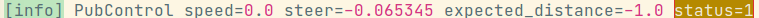
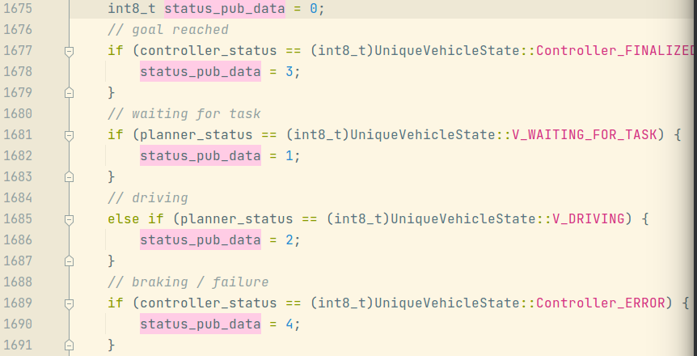
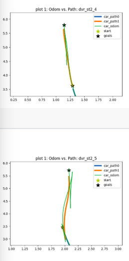

# 20210719: tsp apa parking demonstration on 29th July Shanghai

[toc]

---

## 1. briefing:

We are going to do some modifications on our current path planning and parking algorithm to fit x3 and byd platform. The date of transporting our vehicle is set to **26th July** for the time being. We have two time slots for the above work **20th ~ 26th July** and **27th ~ 29th July**. 


My suggestion for completing it would be optimizing the code on IC421 and transforming it to x3-byd along with testing before 26th July and exhibition site testing thereafter. 


Our business group have requested the organizer to reserve three-row empty vertical slots for our demonstration, rely status unknown. I think we also need our group to get the measurements of the site slots, which include but not limited to length, width, lane_with etc..


---


## 2. suggested modification on code

### 1. **A parking completion status should be added and transfer the completion state to APA**. **(necessary)**

In the session.log recorded during real car running, after final goal has been reached, PubControl will return status=1, which is the status of waiting for task, I think we should change it to 3 (goal reached)

   

   

   (more details) we need to pass this status to apainforprocess.

### 2. **modification on backward trajectory as correction trajectory** **(suggestion)**

From 4959-40, we can observe that there are sometimes weird moves after car have already inside the slots, though it gives more desired final pose of the vehicle, forwarding out and reverting into the slot for a long distance is not necessary, we should consider shorten the path if necessary. 

   

   code in `trajectory_operations.cpp --> trajectoryEngine::ForwardCPU --> (line435 // add backward trajectory as correction trajectory)`

   


### 3. find a way for smooth steering: avoid step motor like rotation (suggestion)

this phenomenon has been observed quite a lot at the time of turning the wheels, but we did not take it seriously because of various reasons, and  we have solve it once by redirect the session logs from the console to session.log file, but the lag still exist, though so far, it dose not affect our final parking pose. It is hard to describe what kind of motion it is so I will record and upload some vids about it for further analysis. 


### 4. path planning and parking control parameter adjustment, for x3-byd platform. (necessary)

I am read codes related to path planning and parking control, which are belongs to following class-steps, the value used in ic421 may not a good one for x3-byd.

```yaml
      - key: ParkingMiddleGoals
        log_level: 5
        output: middle_goal_pose
        output_path: expect_path
        parking_mode: 5
        steering_angle: 0.35						# need adjustment for x3-byd
        #parking_spot_length: 4.85
        #parking_spot_width: 6.1
        lane_width: 6								# need adjustment for new site
        perp_distance: 3							# need adjustment for new site
        para_distance: 4							# need adjustment for new site
        goal1_angle: 0.262							# need adjustment for x3-byd
        angle_tolerance: 0.262 # 15 deg				# need adjustment for correction trajectory, ic & x3
        distance_tolerance: 0.3						# need adjustment for correction trajectory, ic & x3
        iterations: 1
        save_to_apa: 1
        update_goal: 1
        apa_mode: 1
        use_astar: 0

      - key: ComputePath  # todox2
        ignore: 1
        input: middle_goal_pose  
        eval_result: eval_result
        output: expect_path  
        simple_path_type: RS
        backward: 1
        max_steer: 0.42								# need adjustment for x3-byd
        #check_collision: 2
        min_incr_dist: 0.05							# need adjustment for x3-byd
        map_layer: grid_map_layer
        use_local: 0								# ok for both platform?
        time_bound: 10.0							# ok for both platform?
        save_path: 1
        save_map: computepath_img_layer
        apa_mode: 1
        wait_for_map: 1								
        car_scale: 0.78

      - key: SavePathToApaInfoProcess
        input_path: expect_path 
        
      - key: TrajectoryEngine
        path_input: expect_path
        min_dist: 0.03								# ok for both platform?							
        max_acc: 0.5								# ok for both platform?
        obstacle_input: obstacle_layer
        sweep_area: sweep_layer
        front_ext: 0.2								# ok for both platform?
        side_ext: 0.2								# ok for both platform?
        time_step: 0.05								# ok for both platform?

      - key: ComputeControlValue
        log_level: 4
        output: control_value
        expect_pose: expect_pose_layer
        traj_debug: traj_cache_layer
        delta_gain: 2								# need adjustment for x3-byd
        slow_turn: 2								# need adjustment for x3-byd
        catchup_cache: 1							# need adjustment for x3-byd
        min_speed: 0.1# need adjustment for x3-byd
        time_step: 0.05
        goal_correction: 1 #correction

      - key: PubControl
        input: control_value
        speed_scale: 1
        steer_scale: 1
        max_steer: 0.5								# ok for both platform?
        max_speed: 0.4								# ok for both platform?
       # always_publish: 1 
```

noted:

|      |                                                      |                                                              |
| ---- | ---------------------------------------------------- | ------------------------------------------------------------ |
| 1    | need adjustment for x3-byd                           | on ic421, this value gives a good result, but need to find out whether it also work for x3-byd |
| 2    | need adjustment for new site                         | we need set these parameters for new sites or generalized/standard parking slots. |
| 3    | # need adjustment for correction trajectory, ic & x3 | for goal correction simplificaiton, refer to suggestion no. 2. |
| 4    | ok for both platform?                                | these values give good results on ic421, but I do not know whether we should adjust them on x3-byd |

   

