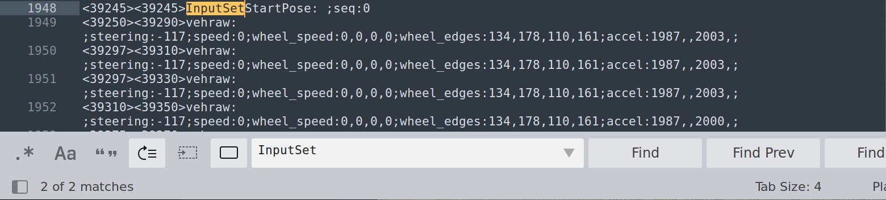
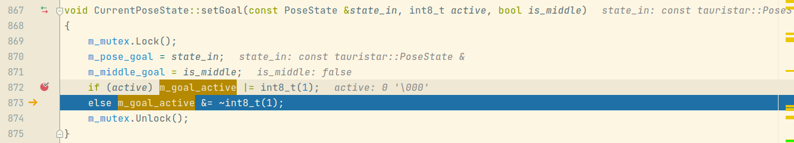

# 20210802  shanghai x3 apa path analysis

[toc]


---

# 0. aim

1. 使用 新老版本 processor_node 对特定版本的 LOG 进行 PC 仿真

2. 通过 对 特定版本的 commit 添加 LOG 并再编译，理解 code

3. 整理 plot（done）


现场版本：4c29c9a

最新版本：b44a44aa586ff5e56ed7a85038ae1cb81a83b56b


**task: 20210804:**（todo）


**task: 20210803:**（done）

昨天：定位到 computed path 生成与 active、m_active_goal 有关。

今天：找出 如何赋值 activate、m_activate_goal。（done）

计划：因为 20210803 下午需要调试 lidar，之后关于 apa 代码，需要进一步了解 m_active_goal 的赋值机制，即 cur_state --> setGoal(cur_pose) 是如何工作的。 


---

# 1. analysis target log 1021


使用这个 canbus，用不同的 yaml，进行 processor_node 仿真。


没有进入到 ParkingMiddleGoalsStep 中的 save compute path 中。分析原因。


问题1：关于 `CurrentPoseState`，是如何取得 pose_state 的？

这段代码：

LOG 中的 received goal from sharedstate 是如何 接收 goal 的；1. 从哪，2. 方式，3. 结果。


m_sharedstate_holder 调用函数取得 pose_state，即取得 goal，就可以将 goal 转换成 parking log center。 可以说，ParkingMiddleGoalsStep::loadInputLayer 就是用来确定车位坐标的，确定车位坐标之后，就可以在 ParkingMiddleGoalsStep::Forward_cpu 中 compute path directly（计算路径 compute_path.txt, compute_path2.txt）。

这个是 true_goal 的值，通过 getGoal 函数：


这个是 cur_pose 的值，通过 get 函数：


其实 true_goal 根 cur_pose 的值都是从 pose_state 中得到的，这是 pose_state 类的成员函数值，其中成员变量 m_cur_state_time.m_pose 与 m_pose_goal 分别对应 cur_pose 与 true_goal，这样就知道 get* 函数的大概功能机制了：

```cpp
CurrentPoseState* pose_state = m_sharedstate_holder->getCurrentPoseState();
```

pose_state 的值为 0x16e9090，这个值是由 m_sharedstate_holder->getCurrentPoseState() 得到。


在知道 cur_pose 与 true_goal 是如何被赋值的情况下，需要弄清楚 pose_state 是如何获得值的。接下 -------> 现在的问题是，getCurrentPoseState 是如何工作的，是如何从 canbus.txt 中读取车位坐标的。**关键点在于 m_sharedstate_holder 类对象 中装的是什么**。

对了，当 m_mode=0 时，是从 sharedstate 获取 goal，这个是什么意思？**需要了解 sharedstate_holder 是如何工作的**。这个是 m_sharedstate_holder 的成员变量值：

可以看到 pose_state=0x16e9090，m_sharedstate_holder=0x16e8af0，这些值表示的意义可以在 类 SharedStateHolder 的 enum StateType 中找到。

pose_state=0x16e9090 --> 5 --> CurrentPoseType

m_sharedstate_holder=0x16e8af0 --> 2 --> ProcessorUserDataType


其中 States 成员变量在 类 SharedStateHolder 中如下：


进入 787 行，查看函数代码 getGoal()：

state_out 是 true_goal 的引用传递，它的值有 m_pose_goal 赋予。**现在需要搞懂 m_pose_goal 的值的来源与 m_goal_activate 的作用。**思路1：m_pose_goal 是由 setGoal() 函数赋值。


m_pose_goal 在两个地方可以被赋值（hault）：


需要知道 m_pose_goal 是如何被賦值的，代码段如下，可以看到 m_pose_goal 被 state_in 或 goal 赋值。：


现在知道 m_pose_goal 是如何被赋值了：

PoseState 类对象 m_pose_goal 被声明在 CurrentPoseState 类中；进入 PostState 类中，可以看到其有一个无参构造器，代码如下：


在构造器中可以看到，PoseState 的对象被声明时，其成员变量的初始值都被赋值为 0.0，回到 getGoal(true_goal) 代码


其 `active = m_goal_activate & int8_t(1);` 这段代码中，int8_t m_goal_activate 声明在 CurrentPoseState 类中， 这个类的无参构造器中又初始化了 m_goal_activate 值，为0，同时 activate 的值是通过 按位与 计算结果，原理如下，这样只有当 m_goal_activate 为 1时，activate 才会取值 1，getGoal() 返回值才会为 1，if 判断才不为真，就不会跳出 loadInputLayer 逻辑，就会获得车位坐标 m_parking_spot，这样，在 ParkingMiddleGoalsStep::Forward_cpu 中 if(!m_parking_spot) 判断才不会为真，就不会跳出 Forward_cpu 逻辑，这样就会进行路径的计算 ParkingMiddleGoals: Computing path directly，**现在的问题是，m_goal_activate 如何为 1？**：


继续查找 m_goal_activate 的赋值逻辑，其在项目中有两处赋值位置，第一次是在 类 CurrentPoseState 的无参构造器中赋值为 0，第二次是在 CurrentPoseState::fromString 中赋值为 activate：


**现在需要关注的是 content_message 与 split_results，他们是在读取到 canbus.txt 中的什么数据时被触发的？（20210802）**


**意外：**

根据各种乱撞，发现在 session_xxx.log 中有 的内容：


session_xxx.log 中的关键字段：

```
# 关注点 1
[2021-08-04 15:02:05.763] [info] APAReadTxt Forward
[2021-08-04 15:02:05.763] [info] APAReadTxt: m_txt_id=1448 txt=<36394><36391>InputSetTargePose: ;mode:0;seq:0
# 关注点 2
[2021-08-04 15:02:05.763] [info] APAInfoProcessStep Forward_cpu()
[2021-08-04 15:02:05.763] [info] APAInfoProcessStep Forward_cpu() txt=<36394><36391>InputSetTargePose: 
```

关注点1对应的代码段：

m_txt_id 表示在 canbus.txt 中读取的行号，txt 表示行内容。


关注点1对应的 canbus.txt 内容，第1448行：


关注点1对应的代码段2：


需要关注的 key 字段1：

```
# session_xx.log 这个字段应该可以追溯 canbus.txt 中对应的字段
[2021-08-04 15:02:05.763] [info] APAInfoProcessStep Forward_cpu() txt=<36394><36391>InputSetTargePose:

# canbus.txt 中的对应字段，只有一个 match
<36394><36391>InputSetTargePose: ;mode:0;seq:0
```


这个是 processor_node 的 thread-3 的调用堆栈：


在 OperationProcedure 类中，它的显式构造函数中 m_sharedstate_holder 已经被赋值为 NULL（如下图）。


---

# 2. 分析 CurrentPoseState::getGoal: active: x, m_goal_activate: x 值变化原因


意外，最近一次运行，session_xxx.log 中没有出现下面的内容：

```
[2021-08-04 15:02:05.763] [info] camera: 0 time: 36605 tCnn: 36391
[2021-08-04 15:02:05.763] [info] camera: 1 time: 36601 tCnn: 36391
[2021-08-04 15:02:05.763] [info] [APAInfoProcess] found target in txt
[2021-08-04 15:02:05.763] [info] [APAInfoProcess] Setting Target Pose from txt
[2021-08-04 15:02:05.763] [info] InputSetTargetPose() armTime0 seg 0
```

更新，老的 session_xxx.log 中也有这段内容，注意 Activate goal：


取而代之的是这段内容（这段代码在老 session_xxx.log 中也有）：


`[APAInfoProcess] Activate goal` 定位代码，当 canbus.txt 中有字符串 `InputsetStartPose` 时，打印这个log：


重新对 canbus.txt 进行关键词查找： `inputset`




m_goal_active 赋值定位到这段代码：




找到了 m_goal_active 赋值 1 的代码，在 `setGoal` 中，如果 active 的值为 1，则根据 `m_goal_active = m_goal_active | int8_t(1)`，m_goal_active 为 1。


现在需要定位 setGoal 是被如何调用的。

根据 调速器 中的堆栈：


可以在旧的 session_xxx.log 中找到相应log字段：


关于 类 SubInputDataStep，在 test0f_01.yaml 中，启用了这个类：


**完成 20210803 任务（done）。**接下来需要继续了解 SubInputdataStep 类的 工作原理，是如何赋值的。


---

# &. 可能需要看的内容


需要了解如何将 canbus 中的数据转换成坐标的。

