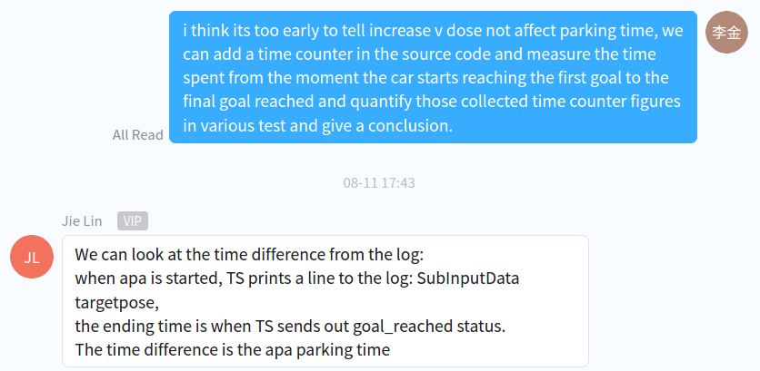
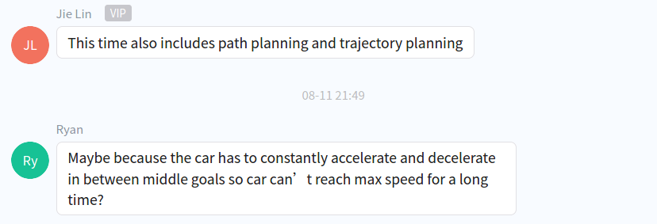
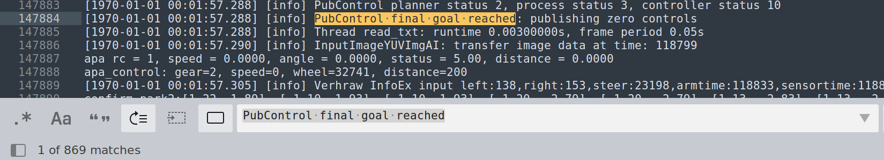
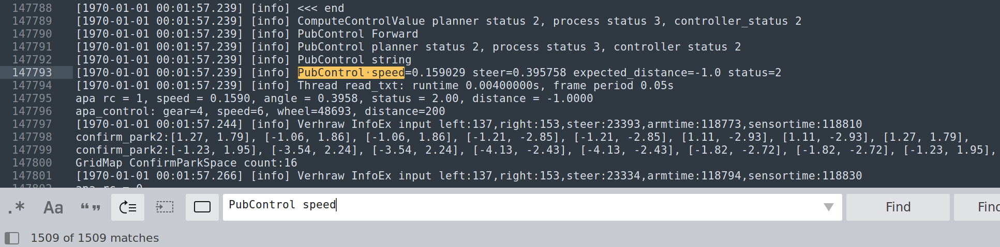

# 2021年08月16日：5928，ic421 最新代码运行效果分析

[toc]

---

## 0. task

1. 绘图。

2. 查看 v=1 与 v=0.35 时，泊车时间长度。

   

   

3. 根据 x3-byd 上海车展 md 文件，read the code。

---

## 1. calculate time spent for entire apa parking

[1970-01-01 00:00:38.437] [info] SubInputData targetpose=PoseState#1.633104,5.837288,-1.586385,0.000000

[1970-01-01 00:01:57.288] [info] PubControl final goal reached: publishing zero controls

time cost = 00:01:57.288 - 00:00:38.437 = 1.09'

根据`dvr_0811_ts_1_2`中的 `session.log`，分析 apa complete 中的 log 相关内容。

1. 关键字：`PubControl final goal reached: publishing zero controls`

   第一次出现，代表 apa 完成泊车。

   

2. 在关键字：`PubControl final goal reached: publishing zero controls`之前，关键字：`PubControl speed=`会出现最后一次，观察截图中的 `controller status`以及`PubControl`中的 `status`值。

   

---

## &. reference

