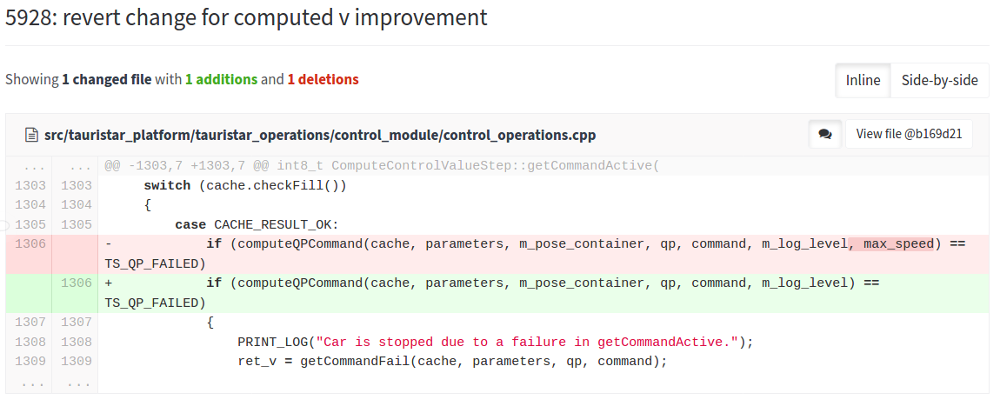
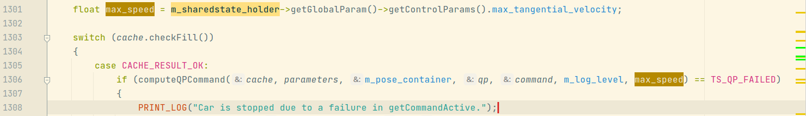
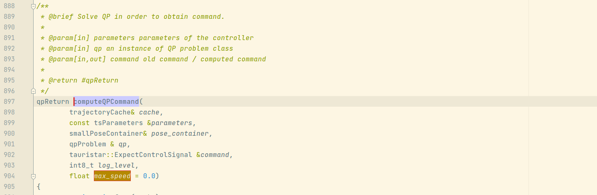
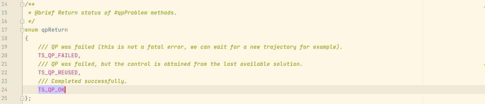
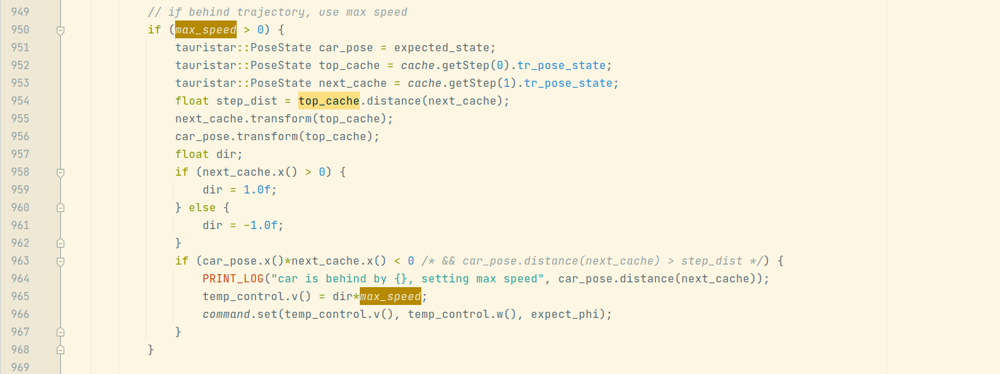
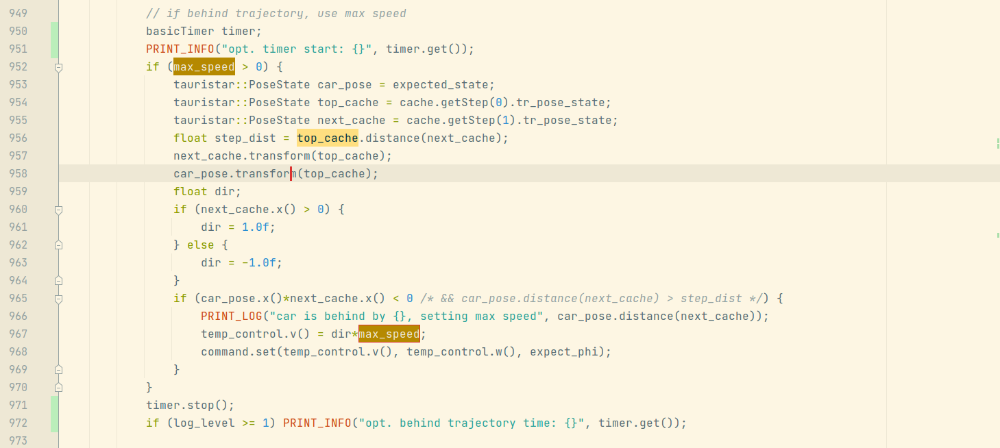
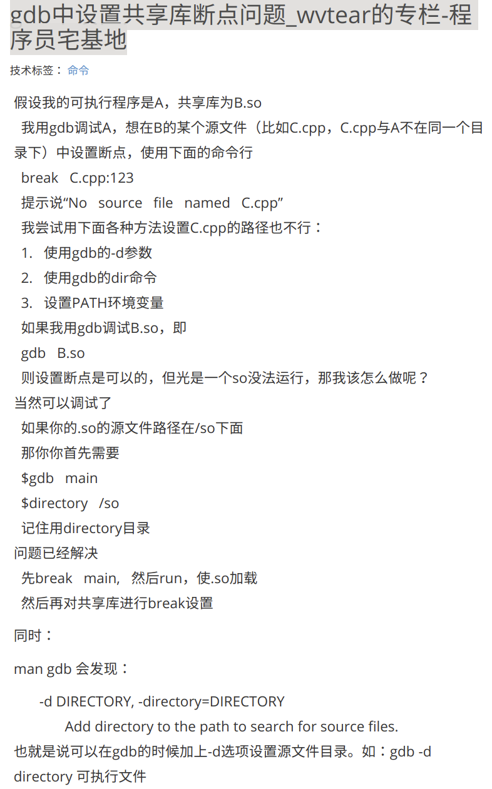

# 2021年08月18日：5928：revert change for computed v improvement

TS: b169d214345be154eea002a3c0daffb7d2d234cb

TS: [old]: 06c29c11fc66ae52154fdc5c2b7c0d0469e0dc50

---

[toc]


---

2021年08月19日：繼續 0818 的任務，早上，30 分鐘。


---

## 1. 代碼修改：




---

## 2. 分析：

### bp 0: `int8_t ComputeControlValueStep::getCommandActive()`

```
int8_t ComputeControlValueStep::getCommandActive() ---> line 1306
```



新代碼去掉了 max_speed 優化。

查看 `computeQPcommand()`

### bp1: `qpReturn computeQPCommand()`



QP: quadratic programming problem（二次規劃問題）

通過解二次式輸出控制變量。



這個是 qpReturen 的返回值，是枚舉類型。

這次提交的代碼執行時**不會**進入這個block： 



新發現：sublime 可以通過 ctrl + shift + f 實現 notepad++ 中 find all 功能。

在 dvr_0817_0.35_1_piao 的 session.log 中，可以發現，老代碼可以進入這個 block：


跳過 block：`if(max_speed > 0){}`，

嘗試使用 intelliJ clion 的 UML 圖生成功能。（unlucky）


2021年08月19日：今天一直感到疑惑的`ParkingMiddleGoalsStep::Forward_cpu()` 中的 參數 `m_update_goal`為什麼會變成`ture`的原因找到了，它的值其實在 yaml 中就已經被指定了：

```
      - key: ParkingMiddleGoals
        log_level: 5
        output: middle_goal_pose
        output_path: expect_path
        parking_mode: 5
        steering_angle: 0.35
        #parking_spot_length: 4.85
        #parking_spot_width: 6.1
        lane_width: 5.5
        #perp_distance: 3
        #para_distance: 4
        #goal1_angle: 0.262
        angle_tolerance: 0.262 # 15 deg
        distance_tolerance: 0.3
        iterations: 1
        save_to_apa: 1
        update_goal: 1									# 就是這裡指定的
        apa_mode: 1
        use_astar: 0
```





---

## &&. gdb 调试：设置共享库断点问题：

使用 GDB 调试共享库中的源代码步骤：

```
1. gdb ./processor_node
2. set -o xxxxx
3. b main  					# 在 main 设置断点，用来加载 .so 文件
4. run
5. b [你需要断点的文件:行数]
```

因为 如果 不运行程序（执行 main），无法加载 .so 文件，也是就说找不到 你所需要的源文件路径。

还需要好好再学习一下 GDB 的调试。 

参考：[gdb中设置共享库断点问题_wvtear的专栏-程序员宅基地](https://www.cxyzjd.com/article/wvtear/37657591)

参考：[GDB调试中 如何在so共享库中打断点、保存断点以及加载断点](https://blog.csdn.net/hao1183716597/article/details/97389312)


