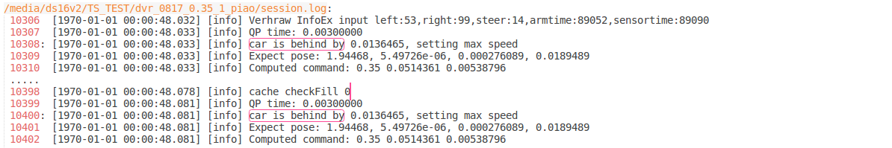
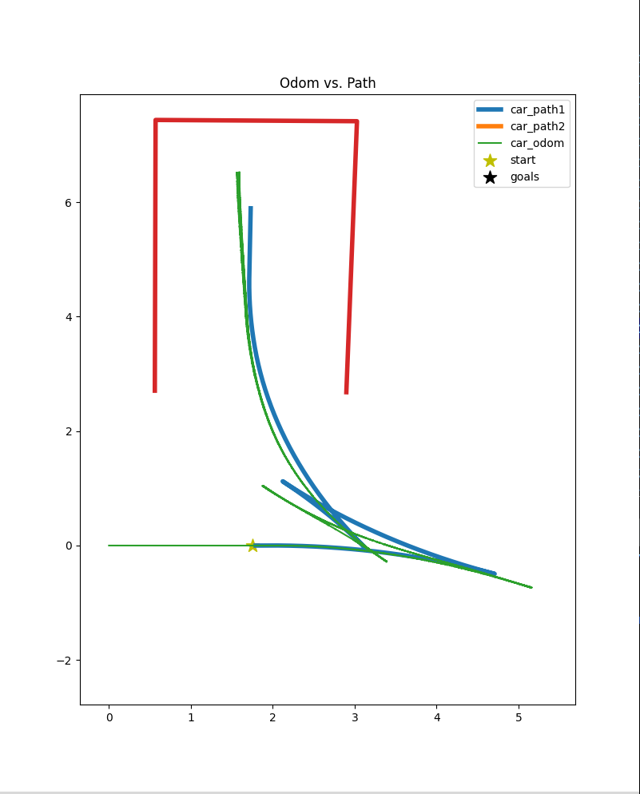
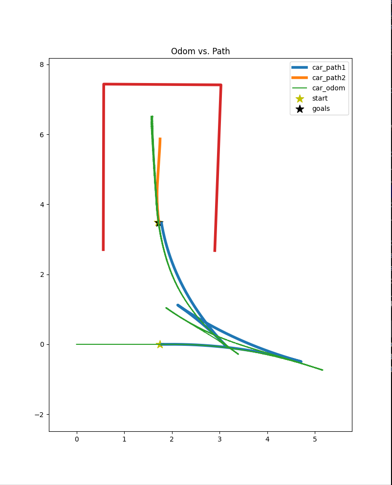
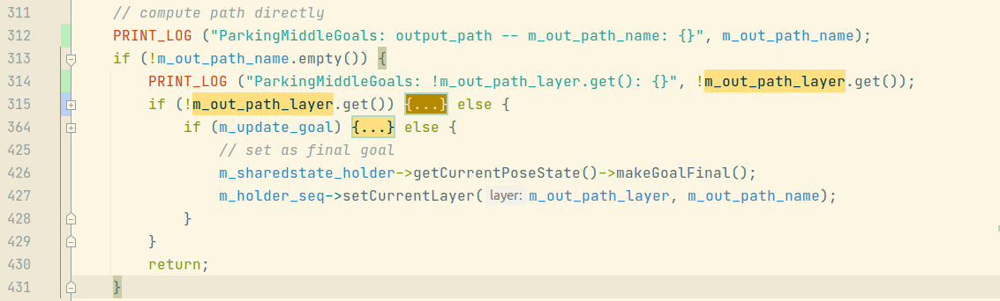

# 2021年08月18日：5928：revert change for computed v improvement

TS: b169d214345be154eea002a3c0daffb7d2d234cb

TS: [old]: 06c29c11fc66ae52154fdc5c2b7c0d0469e0dc50

---

[toc]


---

## 0. logs:

2021年08月19日：繼續 0818 的任務，早上，30 分鐘。

2021年08月20日：繼續 0819 的任務，早上，1：30 分鐘。下午 2：00 分鐘（~3：05）

---

## 1. 代碼修改：


---

## 2. 分析：

### bp 0: `int8_t ComputeControlValueStep::getCommandActive()`

```
int8_t ComputeControlValueStep::getCommandActive() ---> line 1306
```


新代碼去掉了 max_speed 優化。

查看 `computeQPcommand()`

### bp1: `qpReturn computeQPCommand()`


QP: quadratic programming problem（二次規劃問題）

通過解二次式輸出控制變量。


這個是 qpReturen 的返回值，是枚舉類型。

這次提交的代碼執行時**不會**進入這個block： 


新發現：sublime 可以通過 ctrl + shift + f 實現 notepad++ 中 find all 功能。

在 dvr_0817_0.35_1_piao 的 session.log 中，可以發現，老代碼可以進入這個 block：



跳過 block：`if(max_speed > 0){}`，

嘗試使用 intelliJ clion 的 UML 圖生成功能。（unlucky）


---

## &&. 關於：`m_update_goal = true` 的值的問題： 

2021年08月19日：今天一直感到疑惑的`ParkingMiddleGoalsStep::Forward_cpu()` 中的 參數 `m_update_goal`為什麼會變成`ture`的原因找到了，它的值其實在 yaml 中就已經被指定了：

```
      - key: ParkingMiddleGoals
        log_level: 5
        output: middle_goal_pose
        output_path: expect_path
        parking_mode: 5
        steering_angle: 0.35
        #parking_spot_length: 4.85
        #parking_spot_width: 6.1
        lane_width: 5.5
        #perp_distance: 3
        #para_distance: 4
        #goal1_angle: 0.262
        angle_tolerance: 0.262 # 15 deg
        distance_tolerance: 0.3
        iterations: 1
        save_to_apa: 1
        update_goal: 1									# 就是這裡指定的
        apa_mode: 1
        use_astar: 0
```


2021年08月20日：如果 m_update_goal = false，規劃的路徑會是什麼？

TS: 0a19e

|      | update_goal=0                                                | update_goal=1                                                |
| ---- | ------------------------------------------------------------ | ------------------------------------------------------------ |
|      |  |  |

規劃的路徑有所不同。

相當於，`update_goal=1`時，

```c++
        } else {
            if (m_update_goal) {
                // check if car is finished following path
                int8_t controller_status = m_sharedstate_holder->getUniqueVehicleState()->getControllerStatus();
                if (controller_status == (int8_t)UniqueVehicleState::Controller_FINALIZED) {
                    PRINT_LOG("ParkingMiddleGoals: updating goal for output_path mode");
                    // update goal
                    tauristar::PoseState temp;
                    if (updateAPAGoal(temp) >= 0) {
                        m_parking_spot->m_targetpose.set(temp.x(), temp.y(), 
                                                         temp.theta(), temp.phi());
                        m_sharedstate_holder->getCurrentPoseState()->setGoal(temp, 1, 0);
                    }

                    // find RS path to updated goal
                    tauristar::PoseState cur_pose;
                    CurrentPoseState* pose_state = m_sharedstate_holder->getCurrentPoseState();
                    pose_state->get(cur_pose);
                    boost::shared_ptr<tauristar::LayerWrapper> out_path_layer2
                        = m_holder_seq->createCurrentLayer(m_out_path_name);

                    m_flow_util->getPath(*m_parking_spot,
                                         cur_pose,
                                         out_path_layer2.get(),
                                         0,
                                         m_update_goal);

                    m_out_path_layer = out_path_layer2;

                    // save path
                    std::string path_file_name = "computed_path2.txt";
                    FILE * pFile;
                    pFile = fopen(path_file_name.c_str(), "w");
                    fprintf(pFile, "x y theta steer");

                    PointsLayerPtr pts_layer = out_path_layer2->getPointsLayerPtr();
                    FloatArray theta_array = pts_layer->getContainer().getFloatArray(PointsProp::_Theta_);
                    FloatArray steer_array = pts_layer->getContainer().getFloatArray(PointsProp::_Steer_);

                    float x, y, th, st;
                    size_t pts_num = pts_layer->size();
                    for (size_t id=0; id<pts_num; ++id) 
                    {
                        pts_layer->get2D_point(id, x, y);
                        th = theta_array.get(id);
                        st = steer_array.get(id);
                        fprintf(pFile, "\n%f %f %f %f", x, y, th, st);
                    }

                    fclose(pFile);

                    // set false so that path is not repeated
                    m_update_goal = false;

                    // set as final goal
                    m_sharedstate_holder->getCurrentPoseState()->makeGoalFinal();

                } else {
                    m_holder_seq->setCurrentLayer(m_out_path_layer, m_out_path_name);
                }
            
            } else {
                // set as final goal
                m_sharedstate_holder->getCurrentPoseState()->makeGoalFinal();
                m_holder_seq->setCurrentLayer(m_out_path_layer, m_out_path_name);
            }
        }
        return;
    }
```

需要弄清 layer 的問題。

apa 泊車包含：

1. 路徑規劃
2. 車體控制
   1. 計算控制輸出
   2. 控制輸出傳遞


上面的代碼的摺疊版本：

如果 yaml 中指定了 output_path: expect_path，就會執行這一步。執行完這一步後，路徑規劃結束：EOF：ParkingMiddleGoalsStep::Forward_cpu()。如果 yaml 中沒有指定 output_path 呢？



如果指定了 output_path，在 yaml 中，当运行中没有问题的时候，会在 430 行 完成 ParkingMiddleGoalsStep::Forward_cpu() 函数并跳出，进行 procedure 中的下一个 key。


---

## &&. 關於：apa 泊車代碼架構問題：

可以嘗試 分段開放 yaml 中 key block 的方式，進行學習。(todo)

尝试步骤：

1. 修改 yaml
2. 使用 release 模式获得 log
3. 分析 log
4. 使用 debug 模式分析代码
5. 修改代码


---

## &&. gdb 调试：设置共享库断点问题：

使用 GDB 调试共享库中的源代码步骤：

```
1. gdb ./processor_node
2. set -o xxxxx
3. b main  					# 在 main 设置断点，用来加载 .so 文件
4. run
5. b [你需要断点的文件:行数]
```

因为 如果 不运行程序（执行 main），无法加载 .so 文件，也是就说找不到 你所需要的源文件路径。

还需要好好再学习一下 GDB 的调试。 

参考：[gdb中设置共享库断点问题_wvtear的专栏-程序员宅基地](https://www.cxyzjd.com/article/wvtear/37657591)

参考：[GDB调试中 如何在so共享库中打断点、保存断点以及加载断点](https://blog.csdn.net/hao1183716597/article/details/97389312)


