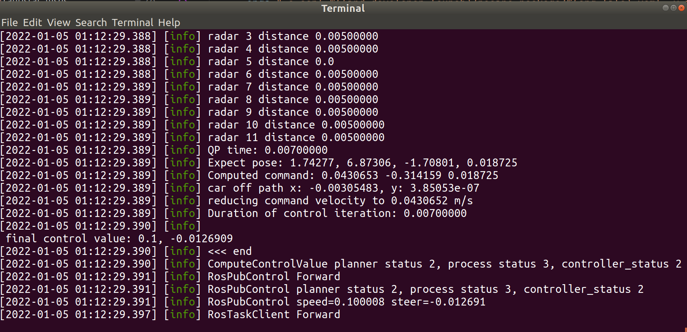
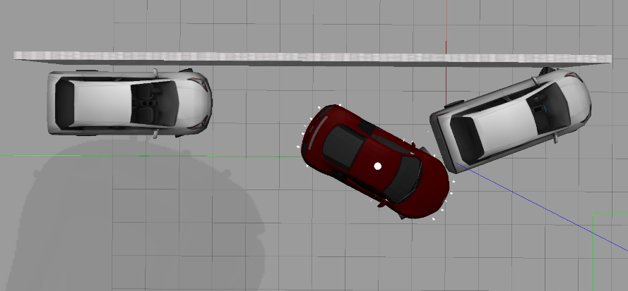

# 20220105_6941_apa_ros_park_out


[toc]


---

# 00. 需求


对 水平，垂直泊出的 ros 代码进行调试。


垂直泊出：

> set `parking_mode` in `ParkingExitPathWithRadar` to "0"（perpendicular）.

```shell
roslaunch developer_launch control_test_apa_exit.launch world:=parked_perpendicular_5
```


水平泊出：

> set `parking_mode` in `ParkingExitPathWithRadar` to "1"（parallel）.

```shell
roslaunch developer_launch control_test_apa_exit.launch world:=left_parallel_6
```


---


# 01. 了解 `control_test_apa_exit.launch`

自动泊出的 ros 启动文件，与 TSP 有关的节点如下：


```xml
    <arg name="debug" default="false" /> <!-- to use debug, make sure to run "catkin_make -DCMAKE_BUILD_TYPE=Debug" -->

	<!-- Run processor_node -->
    <node unless="$(arg debug)" pkg="tauristar_platform" 
          type="processor_node" name="test_process" 
          args="-o conf=$(find developer_launch)/recipe_package/$(arg file).yaml -v mapFile=$(find developer_launch)/launch/ryan/maps/$(arg map)" 
          output="screen" /> 

    <!-- Run processor_node with debug -->
    <node if="$(arg debug)" pkg="tauristar_platform" 
          type="processor_node" name="test_process" 
          args="-o conf=$(find developer_launch)/recipe_package/$(arg file).yaml -v mapFile=$(find developer_launch)/launch/ryan/maps/$(arg map)" 
          launch-prefix="xterm -e gdb --args" 
          output="screen" /> 

```


# 02. 如何调试 roslaunch？（已解决）


在调试 DCVS TSP parking exit 的时候用的方法：

注释掉目标`.launch`文件的需要调试的节点代码（`<node>`），或者使用`if (true，执行node脚本), unless`


---


在编译 ros 项目的时候，需要使用调试模式：

```shell
catkin_make -DBUILD_WITH_ROS=ON -DCMAKE_BUILD_TYPE=Debug
```


查看 launch 文件：

注意，如果在 ubuntu 下进行调试，需要使用：`launch-prefix="gnome-terminal -x gdb --args"`。这会打开一个新的 ubuntu 终端窗口。然后在那个窗口中键入：`r`，运行 processor_node。也可以使用 terminator：·

`launch-prefix="terminator`，但是遇到了问题：`Error while loading shared libraries: libtf2_ros.so`

```xml
    <!-- Run processor_node -->
    <node unless="$(arg debug)" pkg="tauristar_platform" type="processor_node" 
          name="test_process" 
          args="-o conf=$(find developer_launch)/recipe_package/$(arg file).yaml -v mapFile=$(find developer_launch)/launch/ryan/maps/$(arg map)" 
          output="screen" />

---+---+---+---+---+---+---+---+---+---+---+---+---+---+---+---+---+---+---+---

    <!-- Run processor_node with debug in xterm -->
    <node if="$(arg debug)" pkg="tauristar_platform" type="processor_node" 
          name="test_process" 
          args="-o conf=$(find developer_launch)/recipe_package/$(arg file).yaml -v mapFile=$(find developer_launch)/launch/ryan/maps/$(arg map)" 
          launch-prefix="xterm -e gdb --args" 
          output="screen" />

---+---+---+---+---+---+---+---+---+---+---+---+---+---+---+---+---+---+---+---

    <!-- Run processor_node with debug in ubuntu gnome-terminal   -->
    <node if="$(arg debug)" pkg="tauristar_platform" type="processor_node" 
          name="test_process"
          args="-o conf=$(find developer_launch)/recipe_package/$(arg file).yaml -v mapFile=$(find developer_launch)/launch/ryan/maps/$(arg map)"
          launch-prefix="gnome-terminal -x gdb --args"
          output="screen" />
```




# 03. 查看 roslaunch 中 processor_node 中 yaml 文件：`/ryan/APA_radar_exit.yaml`

```xml
args="-o conf=$(find developer_launch)/recipe_package/$(arg file).yaml
```

config 文件路径：

```shell
/home/ds18/catkin_ws/src/TauristarPlatformRecipe/developer_launch/developer_launch/recipe_package/ryan/APA_radar_exit.yaml


# developer_launch 路径：

$ rospack find developer_launch
/home/ds18/catkin_ws/src/TauristarPlatformRecipe/developer_launch

# arg file 路径：
<arg name="file" default="ryan/APA_radar_exit" /> <!-- yaml file -->
```


有关的 key：

```yaml
      - key: ProcessRadarData
        #input_map: grid_map_layer
        output_map: obstacle_map_layer
        output_points: obstacle_layer
        output_side_points: side_obstacle_layer
        sweep_mode: 1
        scan_front: 0
        use_side_radar: 1
        recent_points: 50
        map_resolution: 0.2
        map_width: 100
        map_height: 100
        x_offset: -10
        y_offset: -10
 
 ---+---+---+---+---+---+---+---+---+---+---+---+---+---+---+---+
 
	  - key: ParkingExitPathWithRadar
        wait_frame: 100
        input_obstacle_points: side_obstacle_layer
        output_path: expect_path
        parking_mode: 0
        exit_left: 0
        steering_angle: 0.5
        collision_dist: 0.1

 ---+---+---+---+---+---+---+---+---+---+---+---+---+---+---+---+

      - key: TrajectoryEngine
        path_input: expect_path
        min_dist: 0.03
        max_acc: 0.5
        #time_step: 0.1
        
 ---+---+---+---+---+---+---+---+---+---+---+---+---+---+---+---+        
        
      - key: ComputeControlValue
        log_level: 5
        output: control_value
        expect_pose: expect_pose_layer
        traj_debug: traj_cache_layer
        delta_gain: 2
        #min_speed: 0.1
        slow_turn: 2
        goal_correction: 1
        min_speed: 0.1
        #time_step: 0.1
        catchup_cache: 1
        stop_when_steering: 1

 ---+---+---+---+---+---+---+---+---+---+---+---+---+---+---+---+

      - key: RosPubControl
        log_level: 3
        input: control_value
        speed_topic: /audibot/audi_speed_controller/speed_cmd
        steer_topic: /audibot/audi_steering_controller/steering_cmd
        speed_scale: 1.   # The reason of this scale is not sure yet. Need to improve the simulation handling.
        steer_scale: 16 # 16.   # due to wheel_ratio (steering_cmd is related to control_wheel.)
        max_steer: 0.5
        max_speed: 1
        #queue_size: 10
```


---


# 04. 代码注释（todo）


### 01. ParkingExitPathWithRadar

`ParkingExitPathWithRadarStep`

```cpp
void ParkingExitPathWithRadarStep::StepSetUp()
{
    PRINT_LOG("ParkingExitPathWithRadar StepSetUp");

    m_wait_frame = getSubInt(m_parameters, "wait_frame", 0);
    m_parking_mode = getSubInt(m_parameters, "parking_mode", 0);    // 0 for perpendicular, 1 for parallel
    m_input_obstacle_name = getSubString(m_parameters, "input_obstacle_points");
    m_output_name = getSubString(m_parameters, "output_path");
    bool exit_left = getSubInt(m_parameters, "exit_left", 1);

    if (m_parking_mode == 0) {
        if (exit_left) {
            m_exit_direction = 1.;
        } else {
            m_exit_direction = -1.;
        }
    }
    else if (m_parking_mode == 1) {
        if (exit_left) {
            m_exit_direction = -1.;
        } else {
            m_exit_direction = 1.;
        }
    }
    
    m_steering = getSubDouble(m_parameters, "steering_angle", 0.35);
    m_collision_dist = getSubDouble(m_parameters, "collision_dist", 0.2);

}

void ParkingExitPathWithRadarStep::Forward_cpu()
{
    bool log_l2 = (m_log_level >= 2);
    int global_frame_counter = m_holder_seq->getGlobalFrameCounter();
    if (log_l2 && global_frame_counter % m_holder_seq->getFlowLogFreq() == 0)
        PRINT_LOG("ParkingExitPathWithRadar Forward");

    //if (global_frame_counter < m_wait_frame) {
    //    return;
    //}

    // get radar data
    bool empty = true;
    tauristar::RadarSignalState* radar_state = m_sharedstate_holder->getRadarSignalState();
    std::vector<tauristar::RadarDistanceSignals> pop_results;
    m_prev_read_id = radar_state->pop_interval(pop_results, m_prev_read_id);
    int temp_counter = 0;

    // obtain current pose
    tauristar::CurrentPoseState* pose_state = m_sharedstate_holder->getCurrentPoseState();
    int8_t curpose_set = pose_state->get(m_car_pose);
    if (!curpose_set) {
        return;
    }

    // 0:front_left, 1:front, 2:front_right, 3:rear_right, 4:rear, 5:rear_left
    if (m_exit_step == 0) {

        // save starting pose of car
        m_start_pose = m_car_pose;

        m_radar_positions.resize(radar_state->getRadarNumber());
        m_radar_distances.resize(radar_state->getRadarNumber());
        for (int i = 0; i < radar_state->getRadarNumber(); ++i) {
            tauristar::PoseState pose = radar_state->getPose(i);

            // side radars
            if (std::abs(1.57-std::abs(pose.theta())) < 0.5) {
                if (pose.x() > 0) {
                    // front side
                    if (pose.y() > 0) {
                        // front side left
                        m_radar_positions[i] = 0;
                    }
                    else {
                        // front side right
                        m_radar_positions[i] = 2;
                    }
                }
                else {
                    // rear side
                    if (pose.y() > 0) {
                        // rear side left
                        m_radar_positions[i] = 5;
                    }
                    else {
                        // rear side right
                        m_radar_positions[i] = 3;
                    }
                }
            }
            // front/rear radars
            else {
                if (pose.x() > 0) {
                    // front
                    m_radar_positions[i] = 1;
                }
                else {
                    // rear
                    m_radar_positions[i] = 4;
                }
            }
        }

        m_exit_step = 1;
    }

    while (true) {
        tauristar::RadarDistanceSignals rds;
        if(temp_counter >= (int)pop_results.size()) {
            if (empty) {
                PRINT_LOG("ParkingExitPathWithRadar: Radar Signal State is not ready");
                break;
            } else {
                break;
            }
        } else {
            rds = pop_results[temp_counter++];
        }
        empty = false;

        for (int i = 0; i < radar_state->getRadarNumber(); ++i) {
            double raw_dist = (double)rds.m_distance[i];
            // PRINT_LOG("radar raw_dist {}", raw_dist);
            double distance = (double)rds.m_distance[i] / 1000.;
            // PRINT_LOG("radar {} distance {} position {}", i, distance, m_radar_positions[i]);
            m_radar_distances[i] = distance;
        }
    }

    // get car parameters
    double incr_dist = 0.05;
    std::vector<tauristar::PoseState> path;
    path.clear();
    const GlobalParameters* global_param = m_sharedstate_holder->getGlobalParam();
    const CarModelParams& car_params = global_param->getCarParams();
    m_wheel_base = car_params.astar_car_wheel_base_;
    m_turn_radius = m_wheel_base / std::tan(m_steering);
    m_car_width = car_params.astar_width_;
    m_car_length = car_params.astar_length_;
    m_car_back_length = car_params.astar_carBackLength_;
    m_car_front_length = car_params.astar_carFrontLength_;

    double left_radar_dist = 10;
    double right_radar_dist = -10;

    // check for front obstacles (parallel parking)
    if (m_compute_boundary && m_parking_mode == 1) {
        double front_dist = 10;
        for (int i=0; i<m_radar_distances.size(); i++) {
            if (m_radar_positions[i] == 1) {
                if (m_radar_distances[i] < front_dist) {
                    front_dist = m_radar_distances[i];
                }
            }
            // roughly check for side obstacles
            else if (m_radar_positions[i] == 5) {
                left_radar_dist = m_radar_distances[i] + m_car_width/2.;
            }
            else if (m_radar_positions[i] == 3) {
                right_radar_dist = -1.f*m_radar_distances[i] - m_car_width/2.;
            }
        }
        if (front_dist < 10) {
            m_front_boundary = m_car_front_length + front_dist;
        }
        PRINT_LOG("ParkingExitPathWithRadar: front boundary line {}", m_front_boundary);
    }

    // check for side obstacles (neighboring parked cars)
    if (m_compute_boundary && m_car_pose.distance(m_start_pose) > 0.1) {
        if (!m_input_obstacle_name.empty()) {
            boost::shared_ptr<tauristar::LayerWrapper> in_layer = 
                    m_holder_seq->getCurrentLayer(m_input_obstacle_name);
            if (in_layer) {
                auto obs_pts_layer = in_layer->getPointsLayerPtr();
                int len = obs_pts_layer->size();
                float x, y;
                double left_min = 2;
                double right_max = -2;
                double left_avg = 0;
                double right_avg = 0;
                int left_count = 0;
                int right_count = 0;
                for (size_t id=0; id<len; ++id)
                {
                    obs_pts_layer->get2D_point(id, x, y);
                    tauristar::PoseState a;
                    a.set(x, y, 0, 0);
                    a.transform(m_start_pose);
                    
                    if (a.y() > 0) {
                        if (a.y() < left_min) left_min = a.y();
                        if (std::abs(a.y() - left_radar_dist) < 0.2) {
                            left_avg += a.y();
                            ++left_count;
                        } 
                    }
                    else if (a.y() < 0) {
                        if (a.y() > right_max) right_max = a.y();
                        if (std::abs(a.y() - right_radar_dist) < 0.2) {
                            right_avg += a.y();
                            ++right_count;
                        }
                    }     
                    
                }

                if (left_count > 0) left_avg = left_avg / (double)left_count;
                if (right_count > 0) right_avg = right_avg / (double)right_count;
                // PRINT_LOG("left_avg {} {} right_avg {} {}", left_avg, left_count, right_avg, right_count);

                // get left and right boundary lines from obstacles
                if (left_min < 2) {
                    // if (std::abs(left_min - left_avg) < 0.2) m_left_boundary = left_min;
                    // else 
                    m_left_boundary = left_avg;
                }
                if (right_max > -2) {
                    // if (std::abs(right_max - right_avg) < 0.2) m_right_boundary = right_max;
                    // else 
                    m_right_boundary = right_avg;
                }
                PRINT_LOG("ParkingExitPathWithRadar: left boundary line {}", m_left_boundary);
                PRINT_LOG("ParkingExitPathWithRadar: right boundary line {}", m_right_boundary);

            }
        }
        if (m_left_boundary > 0) m_side_obstacle = true;
        if (m_right_boundary < 0) m_side_obstacle = true;

        m_compute_boundary = false;
    }

    // perpendicular parking exit
    if (m_parking_mode == 0) {
        PRINT_LOG("ParkingExitPathWithRadar: exiting out of perpendicular parking");
        getPerpendicularExitPath(path);
    }

    // parallel parking exit
    else if (m_parking_mode == 1) {
        PRINT_LOG("ParkingExitPathWithRadar: exiting out of parallel parking");
        getParallelExitPath(path);
    }

    else {
        PRINT_ERROR("ParkingExitPathWithRadar: invalid parking mode");
        return;
    }
    
    // convert path
    if (path.size() > 0) {
        boost::shared_ptr<tauristar::LayerWrapper> out_path_layer 
                = m_holder_seq->createCurrentLayer(m_output_name);

        auto pts_layer = out_path_layer->getPointsLayerPtr();
        int pts_num = path.size();
        pts_layer->setPointNum(pts_num);

        FloatArray theta_array = pts_layer->getContainer().createFloatArray(tauristar::PointsProp::_Theta_);
        FloatArray steer_array = pts_layer->getContainer().createFloatArray(tauristar::PointsProp::_Steer_);

        int id = 0;
        // transform and reverse path
        for (int id = 0; id < pts_num; id++) {
            tauristar::PoseState temp;
            temp = path[id];
            temp.transformFrame(m_car_pose);

            pts_layer->set2D_point(id, temp.x(), temp.y());
            theta_array.set(id, temp.theta());
            steer_array.set(id, temp.phi());

        }

        m_pre_path_layer = out_path_layer;

    }

    // if no path output, use previous path
    else {
        if (m_pre_path_layer) {
            m_holder_seq->setCurrentLayer(m_pre_path_layer, m_output_name);
        }
    }
}

```


---


# 05. 水平泊出


**left parallel 7**

|  |  |  |
| ------------------------------------------------------------ | ------------------------------------------------------------ | ------------------------------------------------------------ |

**left parallel 6 (collision)**

|  |  |  |
| ------------------------------------------------------------ | ------------------------------------------------------------ | ------------------------------------------------------------ |

**left parallel 5.5**

|  |  |  |
| ------------------------------------------------------------ | ------------------------------------------------------------ | ------------------------------------------------------------ |

**right parallel 7**

|  |  |  |
| ------------------------------------------------------------ | ------------------------------------------------------------ | ------------------------------------------------------------ |

