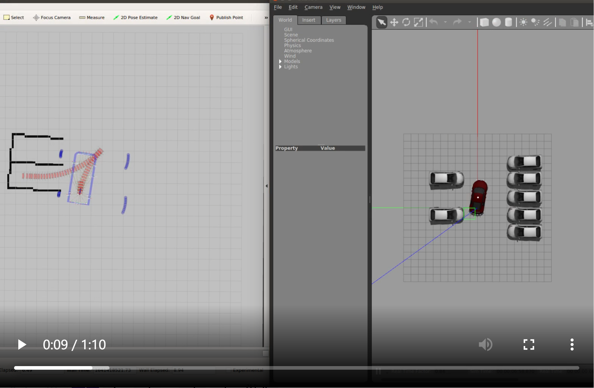
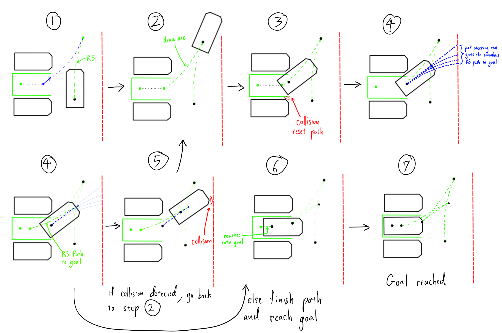
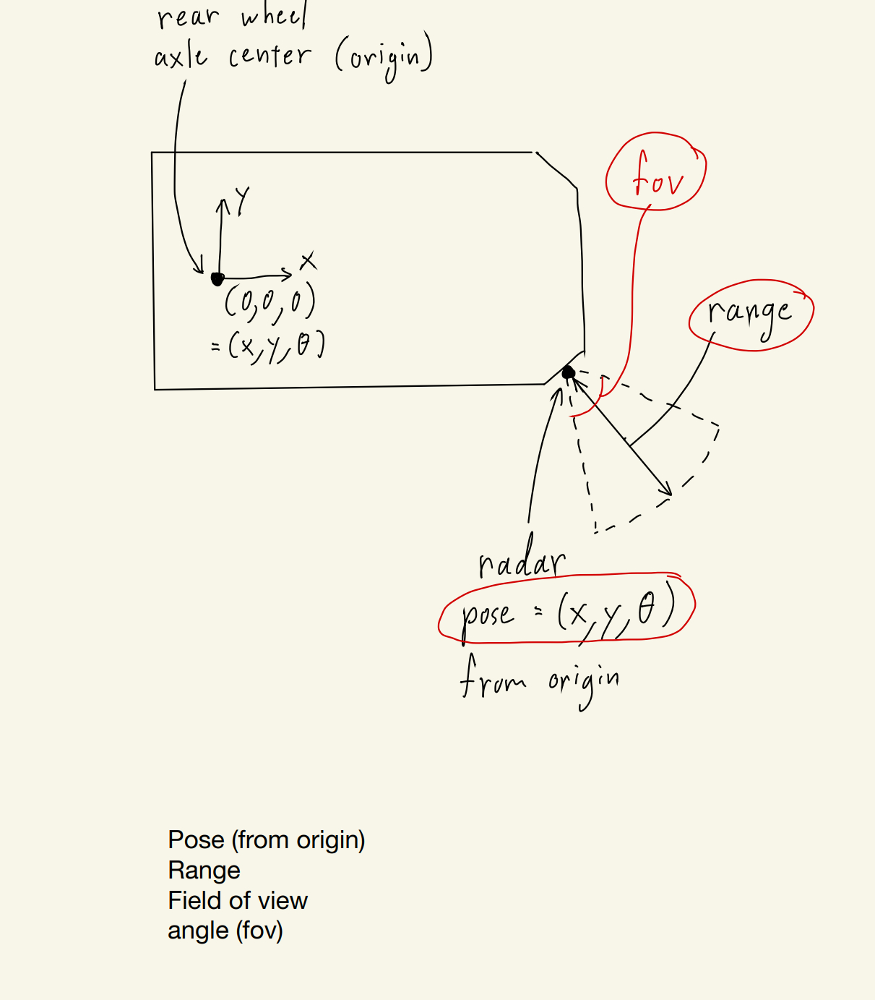

# 20220207_7204_apa_path_uss_ros : 基于雷达的车位检测


[toc]

---


2022年2月7日：

在 ROS 环境中的基于雷达的车位检测文档（初稿）。


---


## 00. 需求010：


> Due to lack of ultrasonic radar in our current APA solution, our APA path planning suffers from a few issues which are **extremely difficult** to solve in a vision-only approach.
>
> - we have to manually set a lane-width parameter which sets the boundary for car movement
>
> - our planning algorithm tries very hard to plan a path such that **any part of the ego car does not touch any part of the parking lines**, which adds unnecessary complexity to the path planning algorithm and inevitably adds more intermediate steps than needed. This seems to be one of the most complained issues for our APA demos, and it **cannot** be solved without ultrasonic radar or other reliable obstacle distance measurement sensor (Lidar).
>
>   ==需要使用超声波雷达解决 APA 泊车演示过程中的碰撞问题==
>
> In lieu of waiting for a controllable car with usable ultrasonic radar signals, our next APA path planning and control development will be based on ROS. Please construct a few simulation environments for parallel/perpendicular/slanted parking with surrounding obstacles. For this task, we can manually set an *initial* parking goal. We want to improve the following functionalities:
>
> ==在 ROS 中，创建包含障碍物的水平、垂直以及斜向车位仿真环境。==
>
> - use ultrasonic radar to automatically determine the drivable space, the **lane-width parameter** is optional, and is to be used as the maximum drivable space boundary parameter
>
>   ==使用超声波雷达（uss）自动检测可以泊入车位。==
>
> - fully test and develop obstacles handling, and in certain cases, a path re-planning logic needs to be added
>
>   ==开发测试障碍物处理以及路径重规划逻辑。==
>
> - improve our APA path planning logic:
>   
>   ==改进当前 APA 路径规划逻辑：==
>   
>   - we can try a more greedy path planning with the help of ultrasonic radar. For example, we always start with a single shot planning. If an obstacle is encountered, we stop the car, and do a re-plan with this new obstacle information.
>   
>     ==使用更加激进的路径规划算法，在超声波雷达的辅助下。==
>   
>   - improve our re-planning algorithm efficiency; since we will need to run this a few times during APA.
>   
>     ==改进现有的重规划算法的效率。==
>   
>   - if there are line obstacles (vehicle sides) on both sides of the ego car, our final goal is in the middle of these two line obstacles, with an orientation angle determined by these two lines.
>   
>     ==如何处理双线形障碍物？==
>   
>   - if there is only one line obstacle, or no line obstacles, we shall use parking space side lines to adjust ego car final pose.
>   
>     ==如何处理单线形障碍物？==
>   
>   - since line obstacle information is not fully known before the initial path planning, and the parking side lines are to be updated during parking maneuver, we need a logic to trigger re-planning when necessary.
>   
>     ==如何对超声波数据进行处理（识别线形障碍物），如何对线形障碍物进行更新？==
>   
> - develop both drive-in and drive-out path planning algorithms.
>
>   ==开发泊入与泊出路径规划算法。==


## 01. 进度：2022年2月7日


### 01. commet 3：

> Current flow:
>
> step 1: compute RS path from start to goal
> step 2: if front obstacle detected, stop following RS path, and follow backward steering path
> step 3: if rear obstacle detected, stop following path, and follow forward steering path
> step 4: if front obstacle detected, stop following path, and compute RS path from current pose to goal
>
> The main issue to work on is step 4. The should be positioned in a way that the final RS path to goal is as smooth as possible with no gear changes. This is hard to achieve since car start position is different every run. In the attached demo, the final RS path is not ideal because it curves back and forth.
> One way is to define a list of ideal poses to reach before step 4. Then we modify the turning radius of the paths before step 4 so that the car can reach one of those poses.
>
> ==要解决的主要问题是步骤4：==
>
> ==Final RS path 的起点应该能够使这段 RS path 尽可能的平滑，这样就不会有挡位的变换。难点在于在每一次程序的运行中，车的 Final RS path 的 起点都不相同。==
>
> ==解决办法是：在 步骤4 之前确定一系列理想的点。然后我们在 步骤4之前 修改路径的转弯半径，这样汽车就可以达到其中的一个位姿。==


超声波雷达检测车位与 垂直**泊入** 流程：

步骤1：计算 RS path 从起点到终点。

步骤2：如果 超声波雷达检测到 前方障碍物，停止 RS path 循迹，同时 开始 循迹 backward steering path。

步骤3：如果 超声波雷达检测到 后方障碍物，停止 当前循迹，同时开始计算从当前位置到 goal 的 RS path。

步骤4：如果 超声波雷达检测到 前方障碍物，停止 当前循迹，同时开始计算从当前位置到 goal 的 RS path。





### 02. commet 4：

> step 1: compute RS path from start to goal
> step 2: if front obstacle detected, stop following RS path, and follow backward steering path
> step 3: if rear obstacle detected, stop following path, try path with varying turning radius, and choose one path that will put the car in an "ideal" position to reverse into the parking spot
> step 4: compute RS path to goal
>
> The issue here is that the path computed in step 3 does not take into account collisions. Video demo attached
>
> ==此流程的问题：==
>
> ==步骤3没有考虑到碰撞情况。==


更新后的 垂直**泊入** 流程：

步骤1：计算 RS path，从 start 到 goal。或者计算 forward path。

步骤2：如果 超声波雷达检测到 前方障碍物，停止 RS path 循迹，同时 开始 循迹 backward steering path。

步骤3：如果 超声波雷达检测到 后方障碍物，停止 当前循迹，尝试不同转弯半径 并计算 RS path，选择一条 path，使汽车处于一个“理想”的位置，以便倒车进入停车位 。==需要对照代码看具体实现过程==

步骤4：计算 到 goal 的 RS path。


### 03. comment 7：

> **基于 commet 4：**
>
> Parking successful with no collisions. To avoid collisions from radar blind spots, obstacle points from ProcessRadarData were used.
>
> ==使用 ProcessRadarData 中的 obstacle points 避免碰撞。==
>
> In addition, step 1 drive forward was adjusted so that in step 2, the car can reverse into a spot in between the two parked cars.
>
> ==步骤1已经做出修改。==


### 04. comment 12-13：✦✦

#### 1. 超声波雷达垂直测温检测与泊车流程图示：

基于 commet 4 以及 commet 7 的改进。




| s.no. | sub-steps                                                    |                                            |
| ----- | ------------------------------------------------------------ | ------------------------------------------ |
| 步骤1 | 超声波雷达检测到垂直车位 goal<br />计算 start 到 goal 的 RS path（前向没有障碍物）<br />循迹 RS path<br />或者，计算 forward path（前向有障碍物）<br />循迹 forward path |                                            |
| 步骤2 | 循迹 步骤1 path<br />或，检测到前向障碍物，后向循迹 arc path |                                            |
| 步骤3 | 如果 检测到后向障碍物<br />停止 当前循迹<br />执行 步骤4     | 条件1：<br />有 后向障碍物<br />执行 步骤4 |
| 步骤4 | 尝试不同转弯半径 并计算 RS path，<br />选择一条 path，使汽车处于一个“理想”的位置，以便倒车进入停车位 <br />循迹 RS path |                                            |
| 步骤5 | 如果 检测到前向障碍物<br />停止当前循迹<br />执行 步骤2      | 条件2：<br />有 前向障碍物<br />执行 步骤2 |
| 步骤6 | 同 步骤4，循迹 RS path，到达 goal                            |                                            |
| 步骤7 | 到达 goal                                                    |                                            |

==在 步骤1 中，假设 ego-car 向上（前）行驶：==

==如果 右侧超声波雷达 没有检测到障碍物，则计算 start 到 goal 的 RS path。==

==如果 右侧超声波雷达 检测到障碍物，则计算 forward path。==

==具体流程结合代码。==


#### 2. 超声波雷达垂直车位检测与泊车的不同实例：

位置图：

```
far-side	|	lane	|	opposite-side
goal		|	ego-car	|	opposite-side
near-side	|	lane	|	opposite-side
```


------ ### ------------------------------------------------------------------
##### case 1 

```
            car
goal        car
car         car
```

> After the step 1 forward path, RS path will be computed directly to goal
>
> ==完成 步骤1 forward path 之后，计算当前 pose 到 goal 的 RS path。==


------ ### ------------------------------------------------------------------

##### case 2

```
car         car
goal        car
            car 
```

> In the above case, car should be allowed to reverse farther in step 2. 
>
> ==在 步骤2 中，汽车需要倒退更多距离。==
>
> However, I currently do not have a good way to determine from radar if there is no car parked on the near side. We can determine if there are obstacles on the left or right side of car, but we can't be sure if the parked car is on the far side or the near side.
>
> ==只能确定 far-side 或 near-side 障碍物，但是无法确定 far-side 或 near-side 是否有车辆。==


------ ### ------------------------------------------------------------------
##### case 3

```
car         
goal        
car 
```

> If there are no cars on the opposite side, RS path will be computed directly to goal at step 1.
>
> ==如果对面车位没有汽车，理论上 前向雷达探测的 障碍物距离 应该是雷达的最大探测距离。步骤1 中 直接计算 RS path 从 start 到 goal。==
>
> However, radar in simulation gives radar distance = 0, at the beginning of the run, so it still determines that there are obstacles on the opposite side, even thought there aren't. As a result, Step 1 will compute a forward path instead.
>
> ==当前问题：==
>
> ==仿真环境中 雷达的模拟信号 在程序运行的初始阶段给出的值为 0（前方有障碍物，距离为0m），导致的结果：步骤1 中会计算一个 forward path 而不是 RS path 从 start 到 goal。==


------ ### ------------------------------------------------------------------

##### case 4 

```
car         car
goal        car
car         car 
```

> Follow the steps shown in comment 12.（完整的泊车的流程图示）
>


------ ### ------------------------------------------------------------------

##### case 5 

```
            car
goal        car
            car 
```

> Same steps as case 1.
>
> ==前方有障碍物，完成 步骤1 forward path 之后，计算当前 pose 到 goal 的 RS path。==


------ ### ------------------------------------------------------------------

##### case 6

```
goal  
```

> Same steps as case 3.
>
> ==步骤1 中 直接计算 RS path 从 start 到 goal。==


### comment 14：

超声波雷达坐标系图示：


