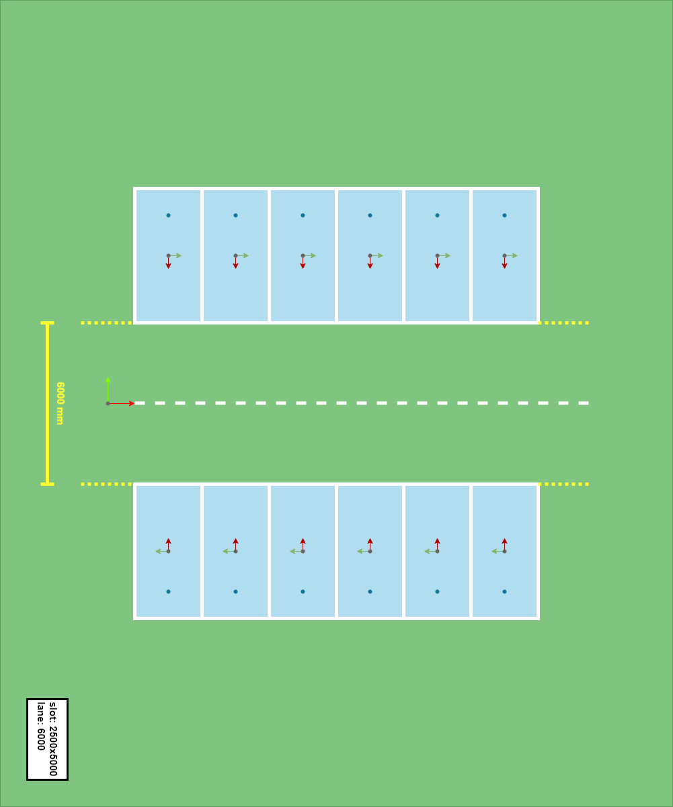

# 20220227_7502_ros_simu_env_parkinglot

[toc]

---


使用 drawio，blender 以及 gazebo 制作仿真环境。

经过思考，我认为其实车位的大小在仿真环境中无需过于精确。真正需要考虑的数据是车道的宽度（泊车空间）。因此，对于车位尺寸，在当前的开发环境下，统一设成 2.5 x 5 (m)。车道宽度可选项：5，5.5，6。


---


## 01. 使用 drawio 与 blender 创建 3D 渲染模型

示例2D图：




### 操作步骤：

1. 打开 blender，delete 掉初始立方体。

2. 使用 `shitf+A (物体模式--添加--网格--平面)`，创建一个平面。

   

3. 对平面，使用`N`，弹出条目菜单。修改平面尺寸。

   

4. 使用图像对平面进行贴图。`材质属性--基础色（黄色小点）--图像纹理--打开图像`。注意贴图的方向与 blender 视图窗口坐标系方向。按`z`在 `线框--渲染--实体--材质`中切换。

   

5. 添加墙体，切换到 `modeling`，`边选模式--shift+连续选边`。注意视图坐标系 x-y 方向。按 `Z` 切换到线框视图模式。按 `N` 调整 z 轴墙体高度`4m`。

   

   

6. 保存成 `.dae` 格式文件，带地面纹理。`文件--导出--collada(.dae)`（有的时候第一次保存不成功，需要两次保存）。

   

7. 命名规范：`ps_6by6_2halfx5_l6_perpend.xxx`。

   

   


---


## 02. 使用 gazebo 导入 01 的 3D 渲染模型

当前已经通过 blender 得到了模型文件 `xxx.dae` 以及对应的渲染文件 `.png`。现在需要使用这些文件在 gazebo 中创建 `.world` 文件。


1. 在终端中打开 gazebo：

   ```
   $ export SVGA_VGPU10=0
   $ gazebo
   ```

2. 在 gazebo 中：`edit--model editor--custom shapes--add`（导入`.dae`文件，注意，`.dae` 文件的名称需要遵循 gazebo 的规范，`.` 右边只能是格式后缀）。`model--model setting--static (将模型设置成静态属性，防止重力效应)`。

   

6. 保存 gazebo 中的当前 model：`file--save`。退出 `model editor`(需要先保存再退出)。然后退出 gazebo。不应当在保存了文件后继续在 gazebo 中操作模型。因为此时的模型没有纹理渲染。需要退出 gazebo，修改 `.sdf`文件，重新加载模型。

   

   

7. 修改 `model.sdf`。删除标记行。

   

8. 重新启动 gazebo：`insert--刚刚创建的模型`。我们需要将模型的选定 x-y 轴与 gazebo 世界坐标系 x-y 轴重合（当然，可以先略过这一步）。

   

9. 删除默认的 `ground plane`，从而消除锯齿现象。

   

10. 将模型地面指定原点与gazebo世界坐标系原点对齐（要确保模型比例尺与比例正确）。

    当前图像尺寸`(xy: 26000 x 30000 m)`，如下图，为了将`(-9000, 0)`与 world-o`(0, 0)`对齐，需要将图像上移`9000`，gazebo 中 pose 属性设置如图：

    

    

    |  |      |      |
    | ------------------------------------------------------------ | ---- | ---- |

    

11. 使用 roslaunch 检查仿真地库模型是否能成功加载。

    命令：

    ```
    roslaunch developer_launch control_test_apa_in.launch file:=ryan/APA_radar_in map:=ps_6by6_2halfx5_l6_perpend.png world:=ps_6by6_2halfx5_l6_perpend
    
    ---
    
    roslaunch developer_launch control_test_apa_in.launch \
    	file:=ryan/APA_radar_in \
    	map:=ps_6by6_2halfx5_l6_perpend.png \
    	world:=ps_6by6_2halfx5_l6_perpend
    ```

    

