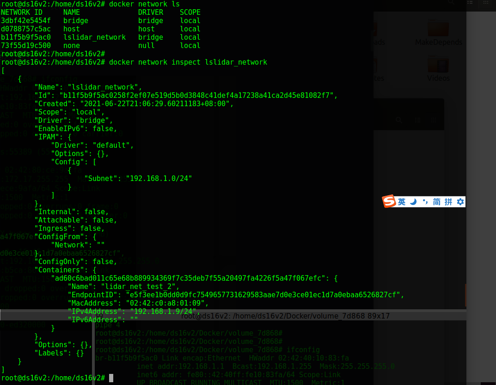
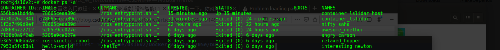

# docker + ros + lidarC16

[toc]


---

## 20210624 操作

目标：xingyun 小车上 使用 docker host network 模式，rostopic 接收 lslidar 数据

### 尝试 1


---

## 20210623 操作

目标：双系统中实现 docker rostopic 的 lslidar 数据读取

关联：20210622 操作，docker network


### 尝试 1： 使用 docker bridge network 模式，rostopic 接收 lslidar 数据（不成功）

在执行完 docker network 操作之后，当前 docker 与 host 信息

```
REPOSITORY        TAG             IMAGE ID       CREATED        SIZE
ros_lslidar_c16   v1.5            78665ceaa89d   15 hours ago   2.24GB
```


```
CONTAINER ID   IMAGE            CREATED        STATUS                    NAMES               anchor
ad60c6bad011   78665ceaa89d     12 hours ago   Up 12 hours               lidar_net_test_2    **
691fe6d862d3   78665ceaa89d     13 hours ago   Exited (0) 13 hours ago   lidar_net_test      x
1f3d7499d9ef   78665ceaa89d     14 hours ago   Exited (0) 14 hours ago   nifty_saha          *
7d8685722712   5205e9ce027e     5 days ago     Exited (0) 16 hours ago   awesome_noether     **
7138b0a9f2eb   5205e9ce027e     5 days ago     Exited (0) 5 days ago     angry_carson        **
```

ImageID 78665ceaa89d 是通过 containerID 7d8685722712 创建而来（see anchor information），containerID ad60c6bad011 是目标版本（包含配置好的 net_work: 192.168.1.9，volume: catkin_ws，ros-kinetic）。


`rospack list`


`ifconfig`


`roslaunch lslidar_c16_decoder lslidar_c16.launch --screen`

问题：

host 中的 网络配置，br-b11f5b9f5ac0 的地址 192.168.1.1


docker network lslidar_network，




### 尝试 2：使用 docker host network 模式，rostopic 接收 lslidar 数据（done）



创建了一个 使用 host network 模式的 container：container_lslidar_host，IP 对比，共享同一组网络配置


在 docker 与 host 中访问 `ping 192.168.1.200` lslidar 地址


`rospack list`


`roslaunch lslidar_c16_decoder lslidar_c16.launch --screen`

```
root@ds16v2:~/catkin_ws# roslaunch lslidar_c16_decoder lslidar_c16.launch --screen
... logging to /root/.ros/log/65b54702-d407-11eb-8053-8c164547794a/roslaunch-ds16v2-906.log
Checking log directory for disk usage. This may take awhile.
Press Ctrl-C to interrupt
Done checking log file disk usage. Usage is <1GB.

started roslaunch server http://ds16v2:35555/

SUMMARY
========

PARAMETERS
 * /lslidar_c16_decoder_node/angle3_disable_max: 0
 * /lslidar_c16_decoder_node/angle3_disable_min: 0
 * /lslidar_c16_decoder_node/angle_disable_max: 0
 * /lslidar_c16_decoder_node/angle_disable_min: 0
 * /lslidar_c16_decoder_node/channel_num: 8
 * /lslidar_c16_decoder_node/frame_id: laser_link
 * /lslidar_c16_decoder_node/frequency: 10.0
 * /lslidar_c16_decoder_node/max_range: 150.0
 * /lslidar_c16_decoder_node/min_range: 0.15
 * /lslidar_c16_decoder_node/point_num: 2000
 * /lslidar_c16_decoder_node/publish_point_cloud: True
 * /lslidar_c16_decoder_node/publish_scan: True
 * /lslidar_c16_decoder_node/use_gps_ts: False
 * /lslidar_c16_driver_node/add_multicast: False
 * /lslidar_c16_driver_node/device_port: 2368
 * /lslidar_c16_driver_node/group_ip: 224.1.1.2
 * /lslidar_c16_driver_node/lidar_ip: 192.168.1.200
 * /rosdistro: kinetic
 * /rosversion: 1.12.17

NODES
  /
    lslidar_c16_decoder_node (lslidar_c16_decoder/lslidar_c16_decoder_node)
    lslidar_c16_driver_node (lslidar_c16_driver/lslidar_c16_driver_node)

auto-starting new master
process[master]: started with pid [916]
ROS_MASTER_URI=http://localhost:11311

setting /run_id to 65b54702-d407-11eb-8053-8c164547794a
process[rosout-1]: started with pid [929]
started core service [/rosout]
process[lslidar_c16_driver_node-2]: started with pid [939]
[ INFO] [1624441382.274420122]: namespace is /lslidar_c16_driver_node
[ INFO] [1624441382.279898681]: Opening UDP socket: address 192.168.1.200
[ INFO] [1624441382.279930948]: Opening UDP socket: port 2368
[ INFO] [1624441382.279964069]: expected frequency: 833.333 (Hz)
[ INFO] [1624441382.281011660]: Opening UDP socket: port 2368
[ INFO] [1624441382.281055066]: Initialised lslidar c16 without error
process[lslidar_c16_decoder_node-3]: started with pid [947]
[ WARN] [1624441382.770269639]: discard Point cloud angle from 0.00 to 0.00
[ WARN] [1624441382.770322007]: switch angle from 6.28 to 6.28 in left hand rule
[ WARN] [1624441382.775717891]: Using GPS timestamp or not 0
[ INFO] [1624441382.775738516]: require to publish scan type message
[ INFO] [1624441383.132946219]: default channel is 8

```


`root@ds16v2:~/catkin_ws# rostopic echo /lslidar_point_cloud > point_cloud.txt`


完成：使用 host address 可以在 docker 下获取 lslidar 数据


---

## 20210622 操作

目标：双系统中实现 docker rostopic 的 lslidar 数据读取

关联：2. docker volume

问题：是否可以不启动 docker 单独操作 docker volume？ docker 中绑定的 volume 与 host 中的 volume 是同步的，即使在不启动  docker 单独操作 host volume，在启动 docker 之后，docker volume 会自动与 host volume 同步。


### 尝试 1：启动 docker container，然后在docker container volume 目录中创建 特定文件，查看 主机同步 volume 目录中是否同时创建 特定文件（是）

```
# 1. 使用镜像创建（docker create）一个 container 然后启动（docker start）这个 container，
# 2. 在这个 container 中创建一个 volume（-v）/root/catkin_ws，并将这个 volume 与主机目录绑定 
# /home/ds16v2/Docker/volume_5205e
docker run -i -t -v /home/ds16v2/Docker/volume_5205e:/root/catkin_ws 5205e9ce027e /bin/bash

# 在 container volume /root/catkin_ws 下创建一个目标文件夹 test_0622，可以看见在 主机目录下同时生成了
# 目标文件夹 test_0622
```


### 尝试 2：启动 docker container，然后在挂载的主机 volume 目录中创建 特定文件，查看 container 同步 volume 目录中是否同时创建 特定文件（是），目标文件 test_0622_loc

 

### 尝试 3：关闭 docker container，然后在挂载的主机 volume 目录中创建 特定文件，查看 container 同步 volume 目录中是否同时创建 特定文件（是），目标文件 test_0622_loc

```
# 在 主机目录下
mkdir test_0622_loc_cOff

# 启动 docker
docker container start 7d8685722712 -i

# 在 container 的 /root/catkin_ws 中可以发现 特定文件夹 test_0622_loc_cOff
```


但是应该不能在主机下编译 src，因为退出 docker 之后，ros 使用主机的编译环境，而 主机上的 volume 使用的 docker ros 编译环境。


```
# 进入 docker： docker exec -i -t containerID /bin/bash
apt-get update
apt-get install iputils-ping
```


### 尝试 4：在 双系统中 离线 启动 lslidar_c16

```
rospack list 									# 查看 编译的 ros package

roslaunch [package name] <file_name>			# 启动 ros 文件

rostopic list									# 查看启发布的 topic
```


可以看见：/lslidar_point_cloud topic 存在（下午可以接线看一下接收到的数据）

```
root@7d8685722712:~/catkin_ws# roslaunch lslidar_c16_decoder lslidar_c16.launch --screen
... logging to /root/.ros/log/e55cf272-d30b-11eb-a827-0242ac110002/roslaunch-7d8685722712-1549.log
Checking log directory for disk usage. This may take awhile.
Press Ctrl-C to interrupt
Done checking log file disk usage. Usage is <1GB.

started roslaunch server http://7d8685722712:45127/

SUMMARY
========

PARAMETERS
 * /lslidar_c16_decoder_node/angle3_disable_max: 0
 * /lslidar_c16_decoder_node/angle3_disable_min: 0
 * /lslidar_c16_decoder_node/angle_disable_max: 0
 * /lslidar_c16_decoder_node/angle_disable_min: 0
 * /lslidar_c16_decoder_node/channel_num: 8
 * /lslidar_c16_decoder_node/frame_id: laser_link
 * /lslidar_c16_decoder_node/frequency: 10.0
 * /lslidar_c16_decoder_node/max_range: 150.0
 * /lslidar_c16_decoder_node/min_range: 0.15
 * /lslidar_c16_decoder_node/point_num: 2000
 * /lslidar_c16_decoder_node/publish_point_cloud: True
 * /lslidar_c16_decoder_node/publish_scan: True
 * /lslidar_c16_decoder_node/use_gps_ts: False
 * /lslidar_c16_driver_node/add_multicast: False
 * /lslidar_c16_driver_node/device_port: 2368
 * /lslidar_c16_driver_node/group_ip: 224.1.1.2
 * /lslidar_c16_driver_node/lidar_ip: 192.168.1.200
 * /rosdistro: kinetic
 * /rosversion: 1.12.17

NODES
  /
    lslidar_c16_decoder_node (lslidar_c16_decoder/lslidar_c16_decoder_node)
    lslidar_c16_driver_node (lslidar_c16_driver/lslidar_c16_driver_node)

ROS_MASTER_URI=http://localhost:11311

process[lslidar_c16_driver_node-1]: started with pid [1566]
[ INFO] [1624336490.983828978]: namespace is /lslidar_c16_driver_node
[ INFO] [1624336490.990992613]: Opening UDP socket: address 192.168.1.200
[ INFO] [1624336490.991021298]: Opening UDP socket: port 2368
[ INFO] [1624336490.991037285]: expected frequency: 833.333 (Hz)
[ INFO] [1624336490.991883920]: Opening UDP socket: port 2368
[ INFO] [1624336490.991909172]: Initialised lslidar c16 without error
process[lslidar_c16_decoder_node-2]: started with pid [1567]
[ WARN] [1624336491.527623481]: discard Point cloud angle from 0.00 to 0.00
[ WARN] [1624336491.527676338]: switch angle from 6.28 to 6.28 in left hand rule
[ WARN] [1624336491.533179798]: Using GPS timestamp or not 0
[ INFO] [1624336491.533202499]: require to publish scan type message
[ WARN] [1624336492.994084799]: lslidar poll() timeout
[ WARN] [1624336494.996root@7d8685722712:~/catkin_ws# roslaunch lslidar_c16_decoder lslidar_c16.launch --screen
... logging to /root/.ros/log/e55cf272-d30b-11eb-a827-0242ac110002/roslaunch-7d8685722712-1549.log
Checking log directory for disk usage. This may take awhile.
Press Ctrl-C to interrupt
Done checking log file disk usage. Usage is <1GB.

started roslaunch server http://7d8685722712:45127/

SUMMARY
========

PARAMETERS
 * /lslidar_c16_decoder_node/angle3_disable_max: 0
 * /lslidar_c16_decoder_node/angle3_disable_min: 0
 * /lslidar_c16_decoder_node/angle_disable_max: 0
 * /lslidar_c16_decoder_node/angle_disable_min: 0
 * /lslidar_c16_decoder_node/channel_num: 8
 * /lslidar_c16_decoder_node/frame_id: laser_link
 * /lslidar_c16_decoder_node/frequency: 10.0
 * /lslidar_c16_decoder_node/max_range: 150.0
 * /lslidar_c16_decoder_node/min_range: 0.15
 * /lslidar_c16_decoder_node/point_num: 2000
 * /lslidar_c16_decoder_node/publish_point_cloud: True
 * /lslidar_c16_decoder_node/publish_scan: True
 * /lslidar_c16_decoder_node/use_gps_ts: False
 * /lslidar_c16_driver_node/add_multicast: False
 * /lslidar_c16_driver_node/device_port: 2368
 * /lslidar_c16_driver_node/group_ip: 224.1.1.2
 * /lslidar_c16_driver_node/lidar_ip: 192.168.1.200
 * /rosdistro: kinetic
 * /rosversion: 1.12.17

NODES
  /
    lslidar_c16_decoder_node (lslidar_c16_decoder/lslidar_c16_decoder_node)
    lslidar_c16_driver_node (lslidar_c16_driver/lslidar_c16_driver_node)

ROS_MASTER_URI=http://localhost:11311

process[lslidar_c16_driver_node-1]: started with pid [1566]
[ INFO] [1624336490.983828978]: namespace is /lslidar_c16_driver_node
[ INFO] [1624336490.990992613]: Opening UDP socket: address 192.168.1.200
[ INFO] [1624336490.991021298]: Opening UDP socket: port 2368
[ INFO] [1624336490.991037285]: expected frequency: 833.333 (Hz)
[ INFO] [1624336490.991883920]: Opening UDP socket: port 2368
[ INFO] [1624336490.991909172]: Initialised lslidar c16 without error
process[lslidar_c16_decoder_node-2]: started with pid [1567]
[ WARN] [1624336491.527623481]: discard Point cloud angle from 0.00 to 0.00
[ WARN] [1624336491.527676338]: switch angle from 6.28 to 6.28 in left hand rule
[ WARN] [1624336491.533179798]: Using GPS timestamp or not 0
[ INFO] [1624336491.533202499]: require to publish scan type message
[ WARN] [1624336492.994084799]: lslidar poll() timeout
[ WARN] [1624336494.996362076]: lslidar poll() timeout
^C[lslidar_c16_decoder_node-2] killing on exit
[lslidar_c16_driver_node-1] killing on exit
[lslidar_c16_driver_node-1] escalating to SIGTERM
shutting down processing monitor...
... shutting down processing monitor complete
done
root@7d8685722712:~/catkin_ws# 
362076]: lslidar poll() timeout
^C[lslidar_c16_decoder_node-2] killing on exit
[lslidar_c16_driver_node-1] killing on exit
[lslidar_c16_driver_node-1] escalating to SIGTERM
shutting down processing monitor...
... shutting down processing monitor complete
done
root@7d8685722712:~/catkin_ws# 

```


### 尝试 5：双系统中 ros 尝试 rostopic

`roslaunch`

```
ds16v2@ds16v2:~/catkin_x/lslidar_ws$ roslaunch lslidar_c16_decoder lslidar_c16.launch --screen

... logging to /home/ds16v2/.ros/log/0d4176f0-d31b-11eb-9da0-8c164547794a/roslaunch-ds16v2-17882.log
Checking log directory for disk usage. This may take awhile.
Press Ctrl-C to interrupt
Done checking log file disk usage. Usage is <1GB.

started roslaunch server http://ds16v2:43547/

SUMMARY
========

PARAMETERS
 * /lslidar_c16_decoder_node/angle3_disable_max: 0
 * /lslidar_c16_decoder_node/angle3_disable_min: 0
 * /lslidar_c16_decoder_node/angle_disable_max: 0
 * /lslidar_c16_decoder_node/angle_disable_min: 0
 * /lslidar_c16_decoder_node/channel_num: 8
 * /lslidar_c16_decoder_node/frame_id: laser_link
 * /lslidar_c16_decoder_node/frequency: 10.0
 * /lslidar_c16_decoder_node/max_range: 150.0
 * /lslidar_c16_decoder_node/min_range: 0.15
 * /lslidar_c16_decoder_node/point_num: 2000
 * /lslidar_c16_decoder_node/publish_point_cloud: True
 * /lslidar_c16_decoder_node/publish_scan: True
 * /lslidar_c16_decoder_node/use_gps_ts: False
 * /lslidar_c16_driver_node/add_multicast: False
 * /lslidar_c16_driver_node/device_port: 2368
 * /lslidar_c16_driver_node/group_ip: 224.1.1.2
 * /lslidar_c16_driver_node/lidar_ip: 192.168.1.200
 * /rosdistro: kinetic
 * /rosversion: 1.12.17

NODES
  /
    lslidar_c16_decoder_node (lslidar_c16_decoder/lslidar_c16_decoder_node)
    lslidar_c16_driver_node (lslidar_c16_driver/lslidar_c16_driver_node)

auto-starting new master
process[master]: started with pid [17901]
ROS_MASTER_URI=http://localhost:11311

setting /run_id to 0d4176f0-d31b-11eb-9da0-8c164547794a
process[rosout-1]: started with pid [17914]
started core service [/rosout]
process[lslidar_c16_driver_node-2]: started with pid [17917]
process[lslidar_c16_decoder_node-3]: started with pid [17923]
[ INFO] [1624339871.337362167]: namespace is /lslidar_c16_driver_node
[ INFO] [1624339871.346384364]: Opening UDP socket: address 192.168.1.200
[ INFO] [1624339871.346416896]: Opening UDP socket: port 2368
[ INFO] [1624339871.346439668]: expected frequency: 833.333 (Hz)
[ INFO] [1624339871.347702841]: Opening UDP socket: port 2368
[ INFO] [1624339871.347729156]: Initialised lslidar c16 without error
[ WARN] [1624339871.354927748]: discard Point cloud angle from 0.00 to 0.00
[ WARN] [1624339871.354972450]: switch angle from 6.28 to 6.28 in left hand rule
[ WARN] [1624339871.359768136]: Using GPS timestamp or not 0
[ INFO] [1624339871.359788375]: require to publish scan type message
[ INFO] [1624339871.608347073]: default channel is 8

```


`rostopic`

```
ds16v2@ds16v2:~/catkin_x/lslidar_ws$ rostopic list
/diagnostics
/layer_num
/lslidar_packet
/lslidar_point_cloud
/lslidar_sweep
/rosout
/rosout_agg
/scan
/scan_channel
ds16v2@ds16v2:~/catkin_x/lslidar_ws$ 


ds16v2@ds16v2:~/catkin_x/lslidar_ws$ rostopic echo /lslidar_point_cloud
```


### 尝试 6：双系统中 docker ros 尝试 rostopic

`ping 192.168.1.200`


`source devel/setup.bash`

`rospack list`


`docker 下的 ip`

```
root@7d8685722712:/# ifconfig
eth0      Link encap:Ethernet  HWaddr 02:42:ac:11:00:02  
          inet addr:172.17.0.2  Bcast:172.17.255.255  Mask:255.255.0.0
          UP BROADCAST RUNNING MULTICAST  MTU:1500  Metric:1
          RX packets:1727 errors:0 dropped:0 overruns:0 frame:0
          TX packets:1113 errors:0 dropped:0 overruns:0 carrier:0
          collisions:0 txqueuelen:0 
          RX bytes:3285243 (3.2 MB)  TX bytes:79227 (79.2 KB)

lo        Link encap:Local Loopback  
          inet addr:127.0.0.1  Mask:255.0.0.0
          UP LOOPBACK RUNNING  MTU:65536  Metric:1
          RX packets:5873 errors:0 dropped:0 overruns:0 frame:0
          TX packets:5873 errors:0 dropped:0 overruns:0 carrier:0
          collisions:0 txqueuelen:1000 
          RX bytes:823777 (823.7 KB)  TX bytes:823777 (823.7 KB)

-----------------------------------------------------------------

root@7d8685722712:/# ifconfig
eth0      Link encap:Ethernet  HWaddr 02:42:ac:11:00:02  
          inet addr:172.17.0.2  Bcast:172.17.255.255  Mask:255.255.0.0
          UP BROADCAST RUNNING MULTICAST  MTU:1500  Metric:1
          RX packets:1749 errors:0 dropped:0 overruns:0 frame:0
          TX packets:1122 errors:0 dropped:0 overruns:0 carrier:0
          collisions:0 txqueuelen:0 
          RX bytes:3287961 (3.2 MB)  TX bytes:79997 (79.9 KB)

lo        Link encap:Local Loopback  
          inet addr:127.0.0.1  Mask:255.0.0.0
          UP LOOPBACK RUNNING  MTU:65536  Metric:1
          RX packets:5873 errors:0 dropped:0 overruns:0 frame:0
          TX packets:5873 errors:0 dropped:0 overruns:0 carrier:0
          collisions:0 txqueuelen:1000 
          RX bytes:823777 (823.7 KB)  TX bytes:823777 (823.7 KB)

root@7d8685722712:/# 

-----------------------------------------------------------------

root@ds16v2:/home/ds16v2# docker inspect 7d8685722712


        "NetworkSettings": {
            "Bridge": "",
            "SandboxID": "22e96fc7ce6f0e07484e10071699af1e9bd5f4055cbf0fae6a55df25305a9b7a",
            "HairpinMode": false,
            "LinkLocalIPv6Address": "",
            "LinkLocalIPv6PrefixLen": 0,
            "Ports": {},
            "SandboxKey": "/var/run/docker/netns/22e96fc7ce6f",
            "SecondaryIPAddresses": null,
            "SecondaryIPv6Addresses": null,
            "EndpointID": "7f18dddeb433b60addabdb4ebf91929139fd83fa19e72b5525368c2c67484992",
            "Gateway": "172.17.0.1",
            "GlobalIPv6Address": "",
            "GlobalIPv6PrefixLen": 0,
            "IPAddress": "172.17.0.2",
            "IPPrefixLen": 16,
            "IPv6Gateway": "",
            "MacAddress": "02:42:ac:11:00:02",
            "Networks": {
                "bridge": {
                    "IPAMConfig": null,
                    "Links": null,
                    "Aliases": null,
                    "NetworkID": "3dbf42e5454f9f9b65a972b6df16b96e2706cc41cd2131e729ef2683be02f6e8",
                    "EndpointID": "7f18dddeb433b60addabdb4ebf91929139fd83fa19e72b5525368c2c67484992",
                    "Gateway": "172.17.0.1",
                    "IPAddress": "172.17.0.2",
                    "IPPrefixLen": 16,
                    "IPv6Gateway": "",
                    "GlobalIPv6Address": "",
                    "GlobalIPv6PrefixLen": 0,
                    "MacAddress": "02:42:ac:11:00:02",
                    "DriverOpts": null
                }
            }
        }


-----------------------------------------------------------------


root@ds16v2:/home/ds16v2# docker network ls
NETWORK ID     NAME      DRIVER    SCOPE
3dbf42e5454f   bridge    bridge    local
d0788757c5ac   host      host      local
73f55d19c500   none      null      local

```


---


## 20210621 操作

目标：完成 20210618 剩余步骤，在 ros rviz 中显示 lslidar_c16 的点云图。已经可以ping通 192.168.1.200

### 尝试 1：在 linux ros rviz 下显示 lslidar 点云（done）

```
source /opt/ros/kinetic/setup.bash
rosrun rviz rviz
```


### 尝试 2：在 linux docker ros 下通过 rostopic 获取点云数据（unsuccessful）


---

## 20210618 操作

目标：docker GUI，docker file，lslidar

节点：20210617-2-1

### 1. 启动 lidar，通过 rviz 查看

#### E-1: ROS “is neither a launch file in package”报错


原因： 没有找到 package 配置文件，使用 `rospack list, rospack find packageName` 查看需要的 package。


### 2. docker + ros + rviz + lslidar（todo）


---

## 20210617 操作


### 1. 关于 docker volume 的使用

总结：


docker 中 创建了 `ros_lslidar_c16:v1.0, [5205e9ce027e   2.11GB]` 的镜像，这个镜像包含了 ros 环境 + lslidar_c16 的驱动。此镜像作为当前雷达开发的 lower layer，作为只读层。


基于此镜像 创建了一个容器 `angry_carson [cID: 7138b0a9f2eb iID: 5205e9ce027e]`，作为开发 lslidar_c16 的环境备份，此 container 包含: 1. ros-kinetic 环境，2. lslidar_c16 驱动。


通过使用 `docker run`，相当于 `docker create + docker start`：

`/home/ds16v2/Docker# docker run -i -t -v /home/ds16v2/Docker/volume_5205e:/root/catkin_ws 5205e9ce027e /bin/bash`

使用 `5205e9ce027e` 镜像创建一个新的 container <cN: awesome_noether, cID: 7d8685722712>，与 container <cN: angry_carson, cID: 7138b0a9f2eb> 平行，但是这个container 用作 lslidar_c16 的主要开发容器。


这个容器实现了<主机跟容器之间的数据共享>，`-v /home/ds16v2/Docker/volume_5205e:/root/catkin_ws 5205e9ce027e`，抽象为 `-v A:B`；其中 A -- 主机上的地址，B -- 容器中的地址（这两个地址如果不存在会自动创建，一旦容器运行，A与B会完全同步）


* 修改 typora 图像位置 ``


### 2. docker + ros + gui（没有跑通）

#### 1. 安装 xhost

```
root@7d8685722712:~/catkin_ws# apt install xhost

Reading package lists... Done
Building dependency tree       
Reading state information... Done
Package xhost is not available, but is referred to by another package.
This may mean that the package is missing, has been obsoleted, or
is only available from another source
However the following packages replace it:
  x11-xserver-utils

E: Package 'xhost' has no installation candidate

root@7d8685722712:~/catkin_ws# apt install x11-xserver-utils
```


```
root@7d8685722712:~/catkin_ws# xhost
xhost:  unable to open display ""

root@7d8685722712:~/catkin_ws# 
```


---

## -----------------------


---

## 1. 当前基本配置

记录当前的 lslidar_c16 docker + ros 环境下的一些配置信息

> 在 docker 中，镜像（image）是只读的，容器（container）是可读可写的。

### 1. ros 镜像

   ```
   image id: 55f40ca92c5b
   docker images
   docker image ls [-a]
   ```

   

### 2. container ID

   ```
   container id: e3d519d0aa2a
   docker container ls [-a]
   ---
   docker container -h
   docker container stop containerID1 [containerID2] ...
   docker container rm containerID1 [containerID2] ...
   ```

   

### 3. lslidar_c16 相关路径

   ```
   docker container ls -a                                 # 查看所有container列表
   docker container start containerID                     # 启动一个已经停止的container，后台
   docker container exec -it containerID /bin/bash        # 使用交互模式进入一个container
   docker container logs -t containerID				   # 查看container的日志
   ---
   ls
   pwd
   cd													   # 进入container的home目录下，就是root
   ls													   # 可以看到lslidar_c16文件夹
   ---
   docker diff relaxed_hopper							   # 查看当前container与其image的不同
   
   ```

   

   

   `docker container logs -t containerID`

   

   

   `docker diff containerName/containerID`

   


### 4. 问，如何将此container作为一个基线版本？（commit、volume）

   * 创建一个新镜像 `docker commit`

   ```
   docker container ls -a								# 查看所有的container
   docker commit \										# 从修改的container中创建新image
   	 -a "jacob" \
   	 -m "ros for lslidar_c16" \
   	 e3d519d0aa2a \
   	 ros_lslidar_c16:v1.0
   docker image ls -a									# 查看新创建的image
   docker history ros_lslidar_c16:v1.0
   ```

   

   

   

   

   * 使用`volume` (todo)（见下一章）

   * docker 的文件系统

     docker 的安装目录是在 `/var/lib/docker`

     ```
     mkdir ~/Docker									# 在主机目录创建docker文件夹
     cp -r /var/lib/docker .							# root模式下将docker文件拷贝到当前目录
     chmod 777 -R docker								# 递归修改权限，使当前用户可以访问
     
     docker info										# 显示docker系统级的信息
     ```

     

     > docker 在系统中默认的文件目录位于 `/var/lib/docker` 下，container 文件系统 保存的位置在 `xxx/docker/overlay2/` 


----

## 2. docker volume

使用命令：

```
docker run -i -t -v /home/ds16v2/Docker/volume_5205e:/root/catkin_ws 5205e9ce027e /bin/bash
```

`-v /home/ds16v2/Docker/volume_5205e:/root/catkin_ws 5205e9ce027e`，抽象为 `-v A:B`；其中 A -- 主机上的地址，B -- 容器中的地址（这两个地址如果不存在会自动创建，一旦容器运行，A与B会完全同步）


---

## 3. docker file (todo)


---

## 4. docker network

关联：20210622 操作

目的：docker 下设置静态 ip，容器的跨主机访问。

参考：[docker 网络配置](https://www.jianshu.com/p/d84cdfe2ea86)


确定 container 7d8685722712 的 IP


创建一个 image fa27c853672a 用来实验 docker network


`root@ds16v2:~# docker run -it --network host fa27c853672a /bin/bash` 在 image fa27c853672a 上创建一个 container 79a02cc7f0fa，这个container 使用 host 的 IP address

```
# 创建一个子网络
root@ds16v2:~# docker network create --driver=bridge --subnet=192.168.1.9/24 net_lslidar_c16


# 从镜像创建并启动一个 container，包含 volume，指定的 IP，bash交互
root@ds16v2:~# docker run -i -t -v /home/ds16v2/Docker/volume_7d868:/root/catkin_ws --network net_lslidar_c16 78665ceaa89d /bin/bash
```


### 尝试：创建一个绑定特定 IP 的 container

目的：在 docker 中，创建一个网络，地址 IP：192.168.1.9，之后，创建并启动一个container，需要将此 container 与创建的 网络 IP 绑定；同时，在创建 container 时，需要绑定 volume。给定 image [ros_lslidar_c16；v1.5；78665ceaa89d]


A. 创建自定义网络（设置固定IP）（没有达到要求，docker container IP 与 host IP 相同才行）

```
root@ds16v2:~# docker network create --subnet=192.168.1.0/24 lslidar_net
Error response from daemon: Pool overlaps with other one on this address space
```


B. 创建 docker 容器（绑定 lslidar_network，绑定 /home/ds16v2/Docker/volume_78665:/root/catkin_ws）

```
root@ds16v2:~# docker run -i -t \
	-v /home/ds16v2/Docker/volume_78665:/root/catkin_ws \
	--name lidar_net_test_2 \
	--net lslidar_network \
	--ip 192.168.1.9  \
	78665ceaa89d \
	/bin/bash
```

`ifconfig` 查看 刚刚创建的 docker container **lidar_net_test_2** 的网络配置，IP 更改成功（192.168.1.9）


volume 绑定成功

完成，跳转 --> 20210623 操作（错误，ping 192.168.1.200 返回桥接网络 192.168.1.1）


### E: Error response from daemon: Pool overlaps with other one on this address space (配置docker IP，网段冲突，解决)

再次创建 docker network（192.168.1.9/24），报错，使用 `docker network ls + docker network inspect networkID`


可以看见 `lslidar_network` 的子网段是 `192.168.1.0-24`，网段被占用，通过 `docker network rm networkID` 删除该网段后再次创建网络，可以成功。


删除冲突的 docker network，解决问题。


### 尝试 2：使用 host 网络模式（todo）

```
root@ds16v2:~# docker run -it \
	--name=container_lslidar_host \
	-v /home/ds16v2/Docker/volume_78665:/root/catkin_ws \
	--network=host \ 
	78665ceaa89d \
	/bin/bash 
```


---


---

raw:

```
root@ds16v2:~# docker images
REPOSITORY        TAG             IMAGE ID       CREATED        SIZE
ros_lslidar_c16   v1.0            5205e9ce027e   41 hours ago   2.11GB
ros               kinetic-robot   55f40ca92c5b   2 weeks ago    1.21GB
hello-world       latest          d1165f221234   3 months ago   13.3kB
root@ds16v2:~# 

root@ds16v2:~# docker container ls -a
CONTAINER ID   IMAGE               COMMAND                  CREATED        STATUS                    PORTS     NAMES
7d8685722712   5205e9ce027e        "/ros_entrypoint.sh …"   17 hours ago   Up 17 hours                         awesome_noether
7138b0a9f2eb   5205e9ce027e        "/ros_entrypoint.sh …"   23 hours ago   Exited (0) 20 hours ago             angry_carson
e3d519d0aa2a   ros:kinetic-robot   "/ros_entrypoint.sh …"   2 days ago     Exited (0) 39 hours ago             relaxed_hopper
7953a5fc88a1   hello-world         "/hello"                 2 days ago     Exited (0) 2 days ago               interesting_newton
root@ds16v2:~# 

```


## APPENDIX I: IMAGE INFO

For registed image:

| REPOSITORY      | TAG           | IMAGE ID     | SIZE   | INFO                                 |
| --------------- | ------------- | ------------ | ------ | ------------------------------------ |
| ros             | kinetic-robot | 55f40ca92c5b | 1.21GB | 原生 ros-kinetic 环境                |
| ros_lslidar_c16 | v1.0          | 5205e9ce027e | 2.11GB | lslidar_c16 driver; ros-kinetic-pcl; |
|                 |               |              |        |                                      |


---

## APPENDIX II: CONTAINER INFO

| CONTAINER ID | IMAGE        | NAMES           | INFO                          |
| ------------ | ------------ | --------------- | ----------------------------- |
| 7138b0a9f2eb | 5205e9ce027e | angry_carson    | --                            |
| 7d8685722712 | 5205e9ce027e | awesome_noether | tree; volume->/root/catkin_ws |
|              |              |                 |                               |

