# lslidar_vslam

[toc]


---

## 20210629

目标：弄懂 package topic，可视化 topic

步骤：先按照 ryan 的回复update ticket，再尝试理解 hector_map 的 配置与 launch 文件。

突然对 .launch 文件感兴趣了，可以先


### 1. 分析 hector_slam_rfans.launch

离线启动 ：hector_slam_rfans.launch

>pkg： package 名称
>
>type：可执行文件名称
>
>name：可执行文件启动后节点名称

```xml
<!--
Maps the environment with RFANS LiDAR using Hector SLAM
No robot is necessary
-->
<launch>

    <arg name="scan_topic"         default="front/scan" />
    <arg name="use_odom"           default="false" />
    <arg name="map_frame"          default="map" />
    <arg name="base_frame"         default="base_footprint" />
    <arg name="odom_frame"         default="odom" />

    
    <!-- launch lslidar_c16 -->
    <node pkg="lslidar_c16_driver" type="lslidar_c16_driver_node" name="lslidar_c16_driver_node" output="screen">
      <param name="lidar_ip" value="192.168.1.200"/>
      <param name="device_port" value="2368"/>
      <param name="add_multicast" value="false"/>
      <param name="group_ip" value="224.1.1.2"/>
    </node>

    <node pkg="lslidar_c16_decoder" type="lslidar_c16_decoder_node" name="lslidar_c16_decoder_node" output="screen">
      <param name="frame_id" value="laser_link"/>
      <param name="point_num" value="2000"/>
      <param name="channel_num" value="8"/>
      <param name="angle_disable_min" value="0"/>
      <param name="angle_disable_max" value="0"/>
      <param name="angle3_disable_min" value="0"/>
      <param name="angle3_disable_max" value="0"/>
      <param name="min_range" value="0.15"/>
      <param name="max_range" value="150.0"/>
      <param name="frequency" value="10.0"/>
      <param name="publish_point_cloud" value="true"/>
      <param name="publish_scan" value="true"/>
      <param name="use_gps_ts" value="false"/>
    </node>
  

    <!-- PointCloud to laserscan -->
    <node pkg="pointcloud_to_laserscan" type="pointcloud_to_laserscan_node" name="pointcloud_to_laserscan">
      
      <!-- <remap from="cloud_in" to="/rfans_driver/rfans_points" /> -->
      <remap from="cloud_in" to="/lslidar_point_cloud" />
      <remap from="scan"     to="/front/scan" />

      <param name="target_frame"    value="rfans" />
      <param name="min_height"      value="0.0" />
      <param name="max_height"      value="1.0" />
      <param name="angle_min"       value="-3.14" />
      <param name="angle_max"       value="3.14" />
      <param name="angle_increment" value="0.00655" />
      <param name="scan_time"       value="0.0" />
      <param name="range_min"       value="0.45" />
      <param name="range_max"       value="100.0" />
      <param name="use_inf"         value="true" />
    </node>


    <!-- Hector SLAM -->
    <node pkg="hector_mapping" type="hector_mapping" name="hector_mapping" output="screen" >
      <param name="pub_map_odom_transform" value="true"/>
      <param name="map_frame" value="$(arg map_frame)" />
      <param name="base_frame" value="$(arg base_frame)" />
      <param name="map_size" value="2048" />
      <param if="$(arg use_odom)" name="odom_frame" value="$(arg odom_frame)" />
      <param unless="$(arg use_odom)" name="odom_frame" value="$(arg base_frame)" />
      <param name="scan_topic" value="$(arg scan_topic)" />
    </node>  


    <!-- visualize point cloud -->
<!--     <node name="rviz" pkg="rviz" type="rviz" 
        args="-d $(find hector_slam_pkg)/rviz/20210621_rviz_pointCloud.rviz" 
        output="screen"/> -->

    <!-- visualize hector mapping -->
<!--     <node name="rviz" pkg="rviz" type="rviz" 
        args="-d $(find hector_slam_pkg)/rviz/config_rviz.rviz" 
        output="screen"/> -->
    <node name="rviz" pkg="rviz" type="rviz" 
        output="screen"/>

</launch>

```

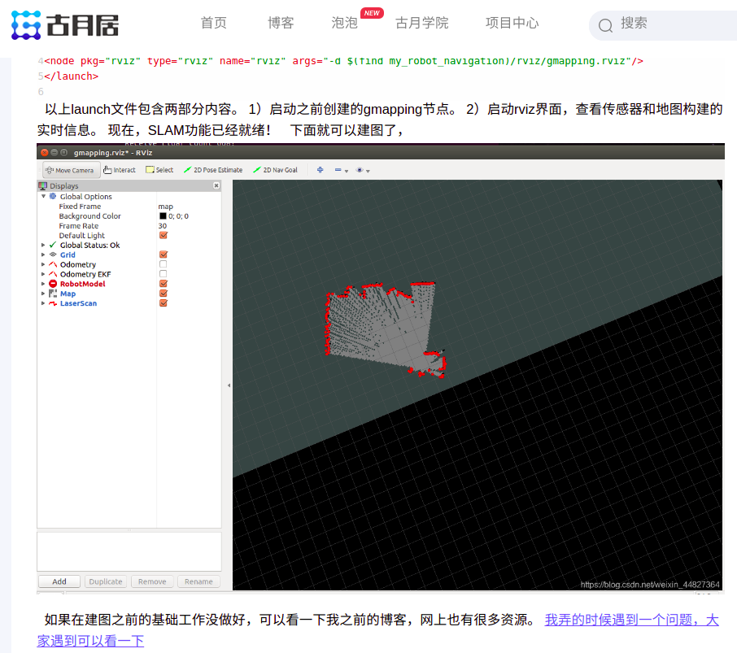


### 2. 学习 rqt，rqt_graph

what we have to do with rqt:

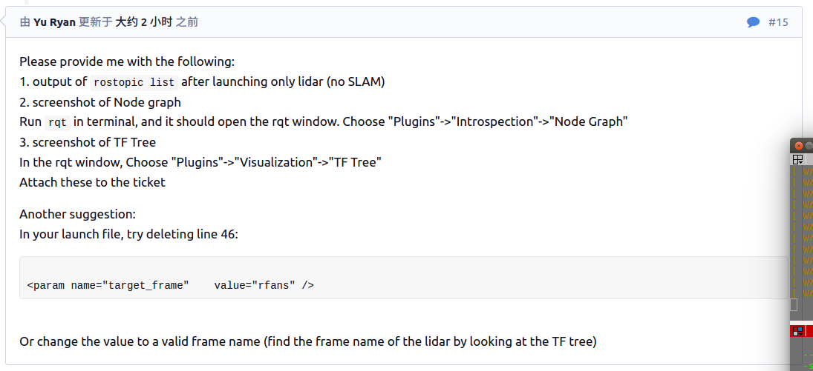


尝试使用 `rqt_graph`

```
## 启动激光雷达
$ roslaunch lslidar_c16_decoder lslidar_c16.launch --screen

## 启动 rqt_graph
$ rosrun rqt_graph rqt_graph
qt_gui_main() found no plugin matching "rqt_graph.ros_graph.RosGraph"
try passing the option "--force-discover"

ds16v2@ds16v2:~/catkin_x/lslidar_slam_ws$ rosrun rqt_graph rqt_graph --force-discover
```

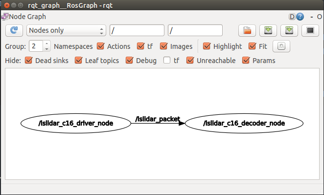

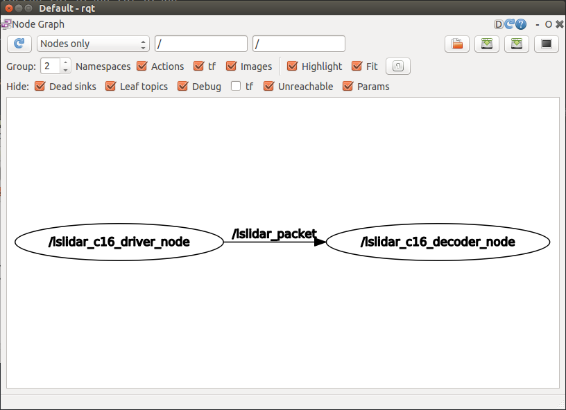


### 3. 尝试 5044-15  method 2


### ++ 参考

link: [Understanding ROS Topics](http://wiki.ros.org/ROS/Tutorials/UnderstandingTopics)

link: []()

link: []()

link: []()

link: []()

link: []()

link: []()

link: []()

---

## 20210628

目标：

MOOC ros

hector_mapping

chinese-english dic (done): [1.17 ubuntu下安装有道词典](https://porter.gitbook.io/deep-learning-series/index/1.17-ubuntu-xia-an-zhuang-you-dao-ci-dian)


### 1. 安装 ros-kinetic package 流程

1. 查看 ros-kinetic package 的内容：通过网址 [ROS packages for Kinetic](http://repositories.ros.org/status_page/ros_kinetic_default.html) 找出目标 package，比如 pointcloud_to_laserscan。

   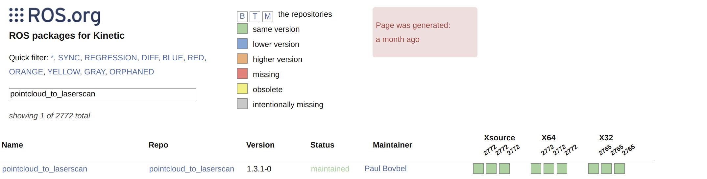

2. 在 CLI中通过 `sudo apt install ros-kinetic-[TAB]-[TAB]` 来安装 package，这样可以避免横线根下划线问题。

   ```
   ds16v2@ds16v2:~$ sudo apt install ros-kinetic-pointcloud-to-laserscan 
   ```

3. 有时候需要更新 ubuntu package list 才能找到目标package

   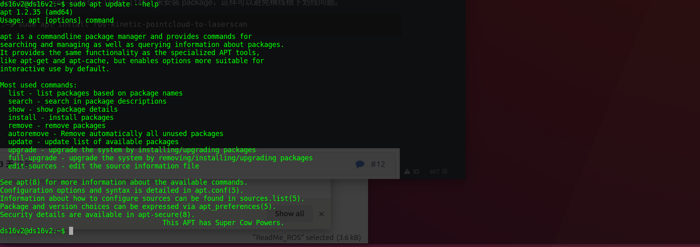

   通过 `sudo apt update 与 sudo apt upgrade`进行。


### 2. 回顾 5044

reference to 5044

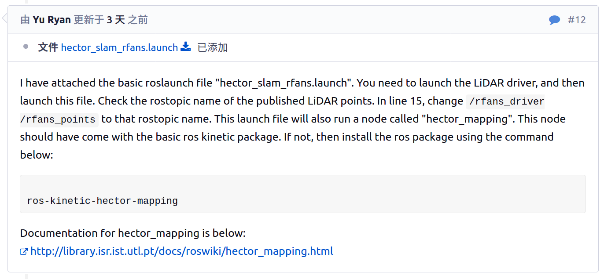


study this yaml file

```xml
<!--
Maps the environment with RFANS LiDAR using Hector SLAM
No robot is necessary
-->
<launch>

    <arg name="scan_topic"         default="front/scan" />			# 在 launch 文件中定义参数
    <arg name="use_odom"           default="false" />				# ...
    <arg name="map_frame"          default="map" />					# ...
    <arg name="base_frame"         default="base_footprint" />		# ...
    <arg name="odom_frame"         default="odom" />				# ...

    <!-- PointCloud to laserscan -->
    <node pkg="pointcloud_to_laserscan" 							# 要启动 pkg 名称 
    	  type="pointcloud_to_laserscan_node" 						# 节点可执行文件名称 
    	  name="pointcloud_to_laserscan">							# 可执行文件启动后节点名称 
      
      	<remap from="cloud_in" to="/rfans_driver/rfans_points" />	# 将功能包接口重命名
      	<remap from="scan"     to="/front/scan" />					# ...

      	<param name="target_frame"    value="rfans" />				# ROS 系统加载参数
      	<param name="min_height"      value="0.0" />
      	<param name="max_height"      value="1.0" />
      	<param name="angle_min"       value="-3.14" />
      	<param name="angle_max"       value="3.14" />
      	<param name="angle_increment" value="0.00655" />
      	<param name="scan_time"       value="0.0" />
      	<param name="range_min"       value="0.45" />
      	<param name="range_max"       value="100.0" />
      	<param name="use_inf"         value="true" />
    </node>

    <!-- Hector SLAM -->
    <node pkg="hector_mapping" 
    	  type="hector_mapping" 
    	  name="hector_mapping" 
    	  output="screen" >											# 输出在控制台，而不是日志
        <param name="pub_map_odom_transform" value="true"/>
        <param name="map_frame" value="$(arg map_frame)" />
        <param name="base_frame" value="$(arg base_frame)" />
        <param name="map_size" value="2048" />
        <param if="$(arg use_odom)" name="odom_frame" value="$(arg odom_frame)" />
        <param unless="$(arg use_odom)" name="odom_frame" value="$(arg base_frame)" />
        <param name="scan_topic" value="$(arg scan_topic)" />
    </node>  

</launch>

```


ros launch 文件标签：

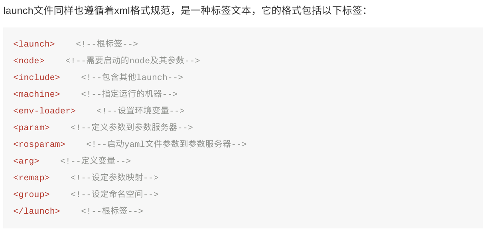

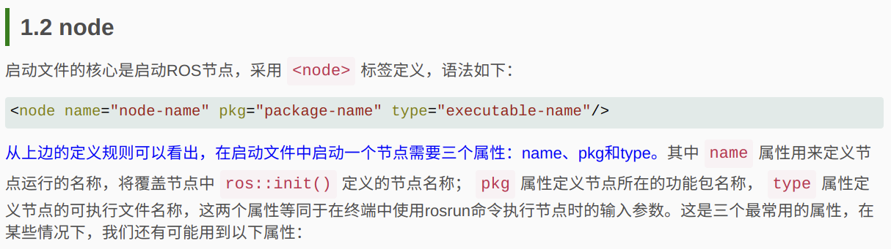

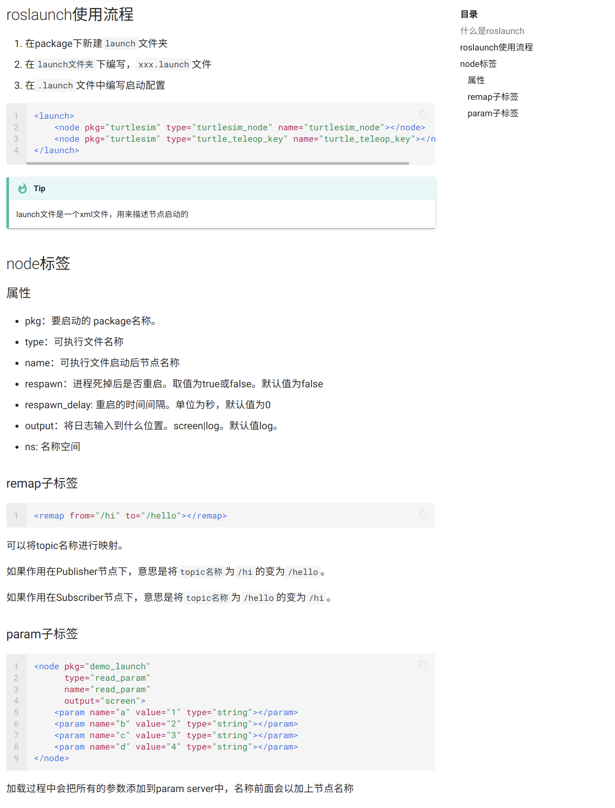

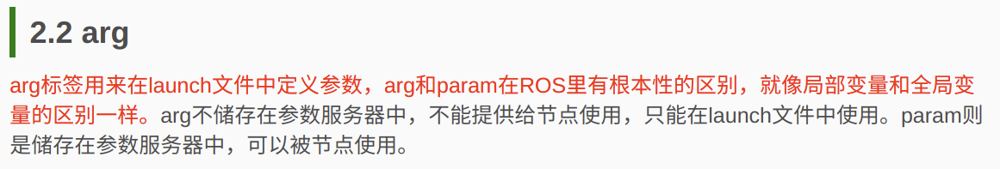

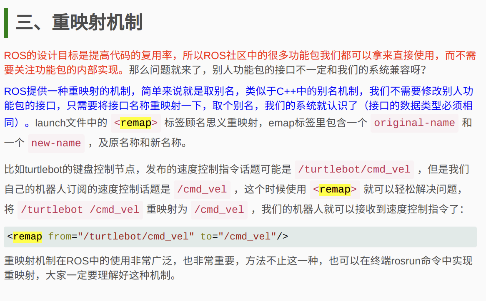

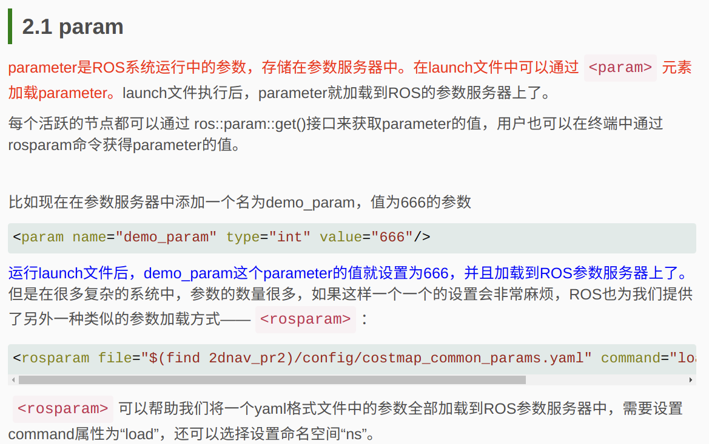


分清 node 与 package。

ros package: ros 工程结构中

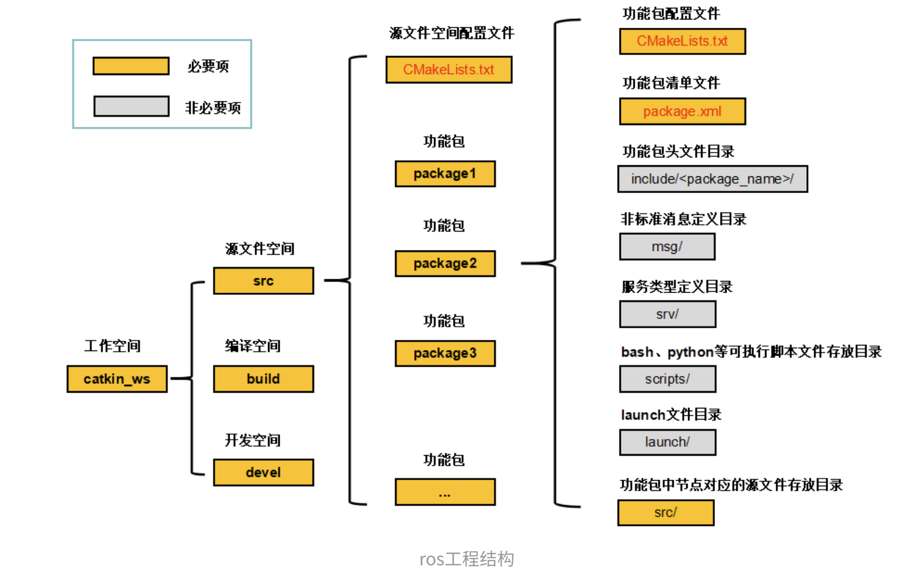

ros node: ros 通信结构中

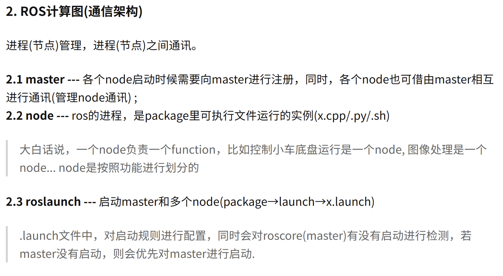


### 3. launch lslidar_c16 and hector_mapping

launch lslidar:

```
$ roslaunch lslidar_c16_decoder lslidar_c16.launch --screen

... logging to /home/ds16v2/.ros/log/2bd1bd1c-d7e6-11eb-90a5-a0c589ac1e85/roslaunch-ds16v2-19128.log
Checking log directory for disk usage. This may take awhile.
Press Ctrl-C to interrupt
Done checking log file disk usage. Usage is <1GB.

started roslaunch server http://ds16v2:40139/

SUMMARY
========

PARAMETERS
 * /lslidar_c16_decoder_node/angle3_disable_max: 0
 * /lslidar_c16_decoder_node/angle3_disable_min: 0
 * /lslidar_c16_decoder_node/angle_disable_max: 0
 * /lslidar_c16_decoder_node/angle_disable_min: 0
 * /lslidar_c16_decoder_node/channel_num: 8
 * /lslidar_c16_decoder_node/frame_id: laser_link
 * /lslidar_c16_decoder_node/frequency: 10.0
 * /lslidar_c16_decoder_node/max_range: 150.0
 * /lslidar_c16_decoder_node/min_range: 0.15
 * /lslidar_c16_decoder_node/point_num: 2000
 * /lslidar_c16_decoder_node/publish_point_cloud: True
 * /lslidar_c16_decoder_node/publish_scan: True
 * /lslidar_c16_decoder_node/use_gps_ts: False
 * /lslidar_c16_driver_node/add_multicast: False
 * /lslidar_c16_driver_node/device_port: 2368
 * /lslidar_c16_driver_node/group_ip: 224.1.1.2
 * /lslidar_c16_driver_node/lidar_ip: 192.168.1.200
 * /rosdistro: kinetic
 * /rosversion: 1.12.17

NODES
  /
    lslidar_c16_decoder_node (lslidar_c16_decoder/lslidar_c16_decoder_node)
    lslidar_c16_driver_node (lslidar_c16_driver/lslidar_c16_driver_node)

auto-starting new master
process[master]: started with pid [19138]
ROS_MASTER_URI=http://localhost:11311

setting /run_id to 2bd1bd1c-d7e6-11eb-90a5-a0c589ac1e85
process[rosout-1]: started with pid [19151]
started core service [/rosout]
process[lslidar_c16_driver_node-2]: started with pid [19164]
process[lslidar_c16_decoder_node-3]: started with pid [19169]
[ INFO] [1624866914.859522332]: namespace is /lslidar_c16_driver_node
[ INFO] [1624866914.868393193]: Opening UDP socket: address 192.168.1.200
[ INFO] [1624866914.868424101]: Opening UDP socket: port 2368
[ INFO] [1624866914.868447994]: expected frequency: 833.333 (Hz)
[ INFO] [1624866914.869468814]: Opening UDP socket: port 2368
[ INFO] [1624866914.869495731]: Initialised lslidar c16 without error
[ WARN] [1624866914.875587536]: discard Point cloud angle from 0.00 to 0.00
[ WARN] [1624866914.875635669]: switch angle from 6.28 to 6.28 in left hand rule
[ WARN] [1624866914.880432471]: Using GPS timestamp or not 0
[ INFO] [1624866914.880458672]: require to publish scan type message
[ INFO] [1624866915.112866150]: default channel is 8

```

launch hector_mapping

`hector_slam_rfans.launch` 文件安装在 

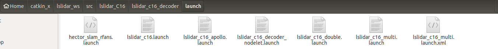

```
$ roslaunch lslidar_c16_decoder hector_slam_rfans.launch 

... logging to /home/ds16v2/.ros/log/2bd1bd1c-d7e6-11eb-90a5-a0c589ac1e85/roslaunch-ds16v2-19444.log
Checking log directory for disk usage. This may take awhile.
Press Ctrl-C to interrupt
Done checking log file disk usage. Usage is <1GB.

started roslaunch server http://ds16v2:38459/

SUMMARY
========

PARAMETERS
 * /hector_mapping/base_frame: base_footprint
 * /hector_mapping/map_frame: map
 * /hector_mapping/map_size: 2048
 * /hector_mapping/odom_frame: base_footprint
 * /hector_mapping/pub_map_odom_transform: True
 * /hector_mapping/scan_topic: front/scan
 * /pointcloud_to_laserscan/angle_increment: 0.00655
 * /pointcloud_to_laserscan/angle_max: 3.14
 * /pointcloud_to_laserscan/angle_min: -3.14
 * /pointcloud_to_laserscan/max_height: 1.0
 * /pointcloud_to_laserscan/min_height: 0.0
 * /pointcloud_to_laserscan/range_max: 100.0
 * /pointcloud_to_laserscan/range_min: 0.45
 * /pointcloud_to_laserscan/scan_time: 0.0
 * /pointcloud_to_laserscan/target_frame: rfans
 * /pointcloud_to_laserscan/use_inf: True
 * /rosdistro: kinetic
 * /rosversion: 1.12.17

NODES
  /
    hector_mapping (hector_mapping/hector_mapping)
    pointcloud_to_laserscan (pointcloud_to_laserscan/pointcloud_to_laserscan_node)

ROS_MASTER_URI=http://localhost:11311

process[pointcloud_to_laserscan-1]: started with pid [19461]
process[hector_mapping-2]: started with pid [19462]
HectorSM map lvl 0: cellLength: 0.025 res x:2048 res y: 2048
HectorSM map lvl 1: cellLength: 0.05 res x:1024 res y: 1024
HectorSM map lvl 2: cellLength: 0.1 res x:512 res y: 512
[ INFO] [1624866978.842879589]: HectorSM p_base_frame_: base_footprint
[ INFO] [1624866978.842927653]: HectorSM p_map_frame_: map
[ INFO] [1624866978.842939029]: HectorSM p_odom_frame_: base_footprint
[ INFO] [1624866978.842947495]: HectorSM p_scan_topic_: front/scan
[ INFO] [1624866978.842955816]: HectorSM p_use_tf_scan_transformation_: true
[ INFO] [1624866978.842963520]: HectorSM p_pub_map_odom_transform_: true
[ INFO] [1624866978.842971325]: HectorSM p_scan_subscriber_queue_size_: 5
[ INFO] [1624866978.842981261]: HectorSM p_map_pub_period_: 2.000000
[ INFO] [1624866978.842992785]: HectorSM p_update_factor_free_: 0.400000
[ INFO] [1624866978.843002369]: HectorSM p_update_factor_occupied_: 0.900000
[ INFO] [1624866978.843015893]: HectorSM p_map_update_distance_threshold_: 0.400000 
[ INFO] [1624866978.843029619]: HectorSM p_map_update_angle_threshold_: 0.900000
[ INFO] [1624866978.843044545]: HectorSM p_laser_z_min_value_: -1.000000
[ INFO] [1624866978.843069090]: HectorSM p_laser_z_max_value_: 1.000000


```

 

launch lslidar + hector_mapping + rviz (successfully), how to do slam?

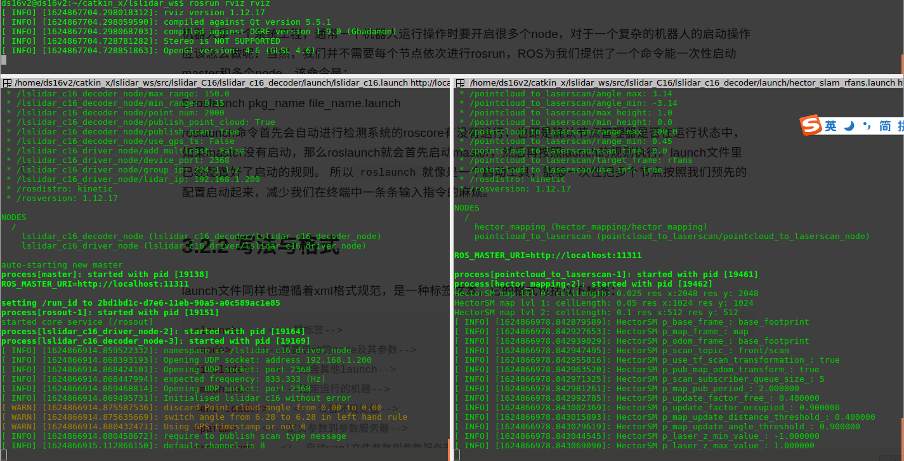

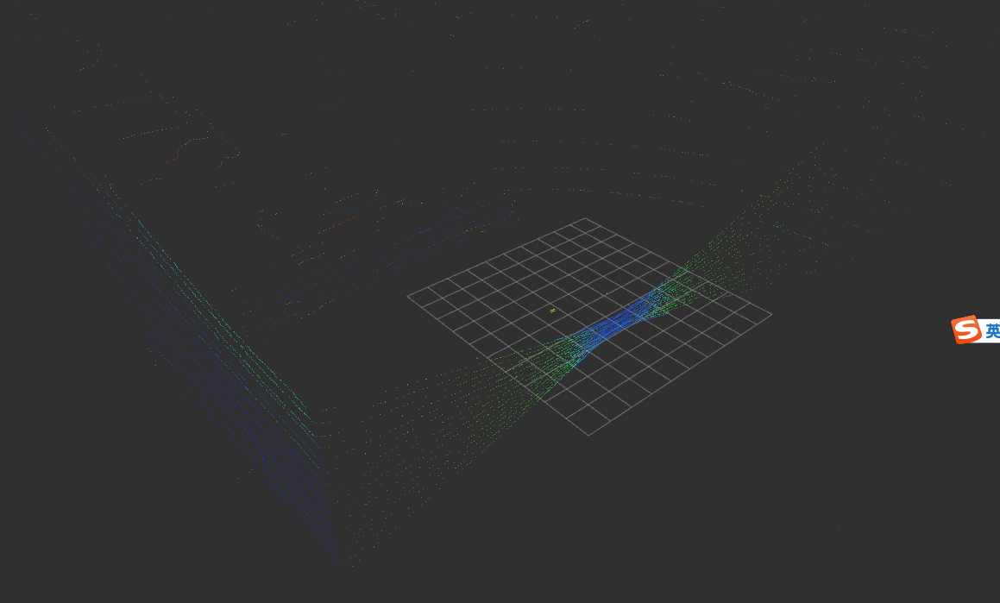


package: hector_slam_pkg

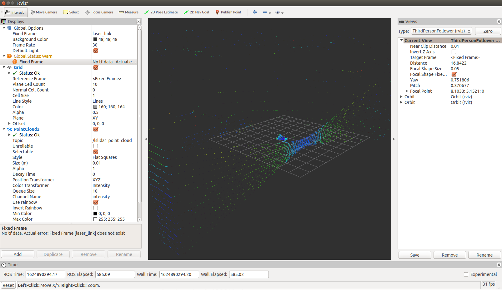

```
ds16v2@ds16v2:~/catkin_x/lslidar_slam_ws$ roslaunch hector_slam_pkg hector_slam_rfans.launch 
... logging to /home/ds16v2/.ros/log/3cd2fff6-d81b-11eb-8ca3-8c164547794a/roslaunch-ds16v2-24078.log
Checking log directory for disk usage. This may take awhile.
Press Ctrl-C to interrupt
Done checking log file disk usage. Usage is <1GB.

started roslaunch server http://ds16v2:37599/

SUMMARY
========

PARAMETERS
 * /hector_mapping/base_frame: base_footprint
 * /hector_mapping/map_frame: map
 * /hector_mapping/map_size: 2048
 * /hector_mapping/odom_frame: base_footprint
 * /hector_mapping/pub_map_odom_transform: True
 * /hector_mapping/scan_topic: front/scan
 * /lslidar_c16_decoder_node/angle3_disable_max: 0
 * /lslidar_c16_decoder_node/angle3_disable_min: 0
 * /lslidar_c16_decoder_node/angle_disable_max: 0
 * /lslidar_c16_decoder_node/angle_disable_min: 0
 * /lslidar_c16_decoder_node/channel_num: 8
 * /lslidar_c16_decoder_node/frame_id: laser_link
 * /lslidar_c16_decoder_node/frequency: 10.0
 * /lslidar_c16_decoder_node/max_range: 150.0
 * /lslidar_c16_decoder_node/min_range: 0.15
 * /lslidar_c16_decoder_node/point_num: 2000
 * /lslidar_c16_decoder_node/publish_point_cloud: True
 * /lslidar_c16_decoder_node/publish_scan: True
 * /lslidar_c16_decoder_node/use_gps_ts: False
 * /lslidar_c16_driver_node/add_multicast: False
 * /lslidar_c16_driver_node/device_port: 2368
 * /lslidar_c16_driver_node/group_ip: 224.1.1.2
 * /lslidar_c16_driver_node/lidar_ip: 192.168.1.200
 * /pointcloud_to_laserscan/angle_increment: 0.00655
 * /pointcloud_to_laserscan/angle_max: 3.14
 * /pointcloud_to_laserscan/angle_min: -3.14
 * /pointcloud_to_laserscan/max_height: 1.0
 * /pointcloud_to_laserscan/min_height: 0.0
 * /pointcloud_to_laserscan/range_max: 100.0
 * /pointcloud_to_laserscan/range_min: 0.45
 * /pointcloud_to_laserscan/scan_time: 0.0
 * /pointcloud_to_laserscan/target_frame: rfans
 * /pointcloud_to_laserscan/use_inf: True
 * /rosdistro: kinetic
 * /rosversion: 1.12.17

NODES
  /
    hector_mapping (hector_mapping/hector_mapping)
    lslidar_c16_decoder_node (lslidar_c16_decoder/lslidar_c16_decoder_node)
    lslidar_c16_driver_node (lslidar_c16_driver/lslidar_c16_driver_node)
    pointcloud_to_laserscan (pointcloud_to_laserscan/pointcloud_to_laserscan_node)
    rviz (rviz/rviz)

auto-starting new master
process[master]: started with pid [24088]
ROS_MASTER_URI=http://localhost:11311

setting /run_id to 3cd2fff6-d81b-11eb-8ca3-8c164547794a
process[rosout-1]: started with pid [24101]
started core service [/rosout]
process[lslidar_c16_driver_node-2]: started with pid [24118]
process[lslidar_c16_decoder_node-3]: started with pid [24119]
[ INFO] [1624889707.220541271]: namespace is /lslidar_c16_driver_node
process[pointcloud_to_laserscan-4]: started with pid [24125]
process[hector_mapping-5]: started with pid [24140]
[ INFO] [1624889707.233416000]: Opening UDP socket: address 192.168.1.200
[ INFO] [1624889707.233469753]: Opening UDP socket: port 2368
[ INFO] [1624889707.233516543]: expected frequency: 833.333 (Hz)
[ INFO] [1624889707.237631207]: Opening UDP socket: port 2368
[ INFO] [1624889707.237687393]: Initialised lslidar c16 without error
process[rviz-6]: started with pid [24155]
[ WARN] [1624889707.275141583]: discard Point cloud angle from 0.00 to 0.00
[ WARN] [1624889707.275236032]: switch angle from 6.28 to 6.28 in left hand rule
[ WARN] [1624889707.316231644]: Using GPS timestamp or not 0
[ INFO] [1624889707.316306775]: require to publish scan type message
HectorSM map lvl 0: cellLength: 0.025 res x:2048 res y: 2048
[ INFO] [1624889707.495431620]: rviz version 1.12.17
[ INFO] [1624889707.495525941]: compiled against Qt version 5.5.1
[ INFO] [1624889707.495548101]: compiled against OGRE version 1.9.0 (Ghadamon)
HectorSM map lvl 1: cellLength: 0.05 res x:1024 res y: 1024
HectorSM map lvl 2: cellLength: 0.1 res x:512 res y: 512
[ INFO] [1624889707.638721262]: default channel is 8
[ INFO] [1624889707.646940310]: HectorSM p_base_frame_: base_footprint
[ INFO] [1624889707.647062264]: HectorSM p_map_frame_: map
[ INFO] [1624889707.647108656]: HectorSM p_odom_frame_: base_footprint
[ INFO] [1624889707.647144517]: HectorSM p_scan_topic_: front/scan
[ INFO] [1624889707.647179380]: HectorSM p_use_tf_scan_transformation_: true
[ INFO] [1624889707.647251880]: HectorSM p_pub_map_odom_transform_: true
[ INFO] [1624889707.647295548]: HectorSM p_scan_subscriber_queue_size_: 5
[ INFO] [1624889707.647337684]: HectorSM p_map_pub_period_: 2.000000
[ INFO] [1624889707.647375416]: HectorSM p_update_factor_free_: 0.400000
[ INFO] [1624889707.647416812]: HectorSM p_update_factor_occupied_: 0.900000
[ INFO] [1624889707.647452430]: HectorSM p_map_update_distance_threshold_: 0.400000 
[ INFO] [1624889707.647489006]: HectorSM p_map_update_angle_threshold_: 0.900000
[ INFO] [1624889707.647523245]: HectorSM p_laser_z_min_value_: -1.000000
[ INFO] [1624889707.647555455]: HectorSM p_laser_z_max_value_: 1.000000
[ INFO] [1624889708.749552708]: Stereo is NOT SUPPORTED
[ INFO] [1624889708.749680556]: OpenGl version: 4.6 (GLSL 4.6).


```


### ++ 参考：

link: [深耕系列之深度学习笔记(非常好的深度学习总结博客)](https://porter.gitbook.io/deep-learning-series/)

link: [使用pointcloud_to_laserscan包将速腾聚创3d激光雷达转换成高质量2d激光雷达](http://community.bwbot.org/topic/521/%E4%BD%BF%E7%94%A8pointcloud_to_laserscan%E5%8C%85%E5%B0%86%E9%80%9F%E8%85%BE%E8%81%9A%E5%88%9B3d%E6%BF%80%E5%85%89%E9%9B%B7%E8%BE%BE%E8%BD%AC%E6%8D%A2%E6%88%90%E9%AB%98%E8%B4%A8%E9%87%8F2d%E6%BF%80%E5%85%89%E9%9B%B7%E8%BE%BE)

link: [Ubuntu install of ROS Kinetic](http://wiki.ros.org/kinetic/Installation/Ubuntu)

link: [ROS基础总结🤖🤖🤖](https://zhuanlan.zhihu.com/p/123240150)

link: [ROS学习笔记六：xxx.launch文件详解](https://www.cnblogs.com/linuxAndMcu/p/10648577.html)

link: [从零开始搭二维激光SLAM --- 简单重写 Hector SLAM](https://zhuanlan.zhihu.com/p/348702963)


---

## 20210626

todo


