# log: hector_mapping 20210629

[toc]

---

## 1. in response to 5044:

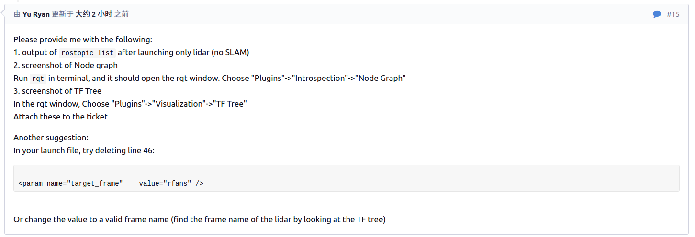

---


### reply for 1

lslidar_c16_tf.launch file used.

```xml
<launch>

  <!-- launch lslidar_c16 -->
  <node pkg="lslidar_c16_driver" 
        type="lslidar_c16_driver_node" 
        name="lslidar_c16_driver_node" 
        output="screen">
    <param name="lidar_ip" value="192.168.1.200"/>
    <param name="device_port" value="2368"/>
	  <param name="add_multicast" value="false"/>
	  <param name="group_ip" value="224.1.1.2"/>
  </node>

  <node pkg="lslidar_c16_decoder" 
        type="lslidar_c16_decoder_node" 
        name="lslidar_c16_decoder_node" 
        output="screen">
    <param name="frame_id" value="laser_link"/>
    <!-- <param name="point_num" value="2000"/> -->
    <param name="point_num" value="5000"/>
    <param name="channel_num" value="8"/>
    <param name="angle_disable_min" value="0"/>
    <param name="angle_disable_max" value="0"/>
    <param name="angle3_disable_min" value="0"/>
    <param name="angle3_disable_max" value="0"/>
    <param name="min_range" value="0.15"/>
    <param name="max_range" value="150.0"/>
    <!-- <param name="frequency" value="10.0"/> -->
    <param name="frequency" value="100.0"/>
    <param name="publish_point_cloud" value="true"/>
    <param name="publish_scan" value="true"/>
    <param name="use_gps_ts" value="false"/>
  </node>


  <!-- TF monitoring -->
  <node pkg="tf" type="static_transform_publisher" name="base_to_laser"
        args="0.0 0.0 1.4 0.0 0.0 0.0 base_link laser_link 100">
  </node>
  

  <!-- visualize point cloud -->
  <node name="rviz" pkg="rviz" type="rviz" 
        args="-d $(find hector_slam_pkg)/rviz/config_rviz_lslidar_tf_fixBase_0629.rviz" 
        output="screen"/>

</launch>
```


CLI output: `roslaunch hector_slam_pkg lslidar_c16_tf.launch --screen`

```
$ roslaunch hector_slam_pkg lslidar_c16_tf.launch --screen

... logging to /home/ds16v2/.ros/log/4f973c76-d8d7-11eb-851e-a0c589ac1e85/roslaunch-ds16v2-14552.log
Checking log directory for disk usage. This may take awhile.
Press Ctrl-C to interrupt
Done checking log file disk usage. Usage is <1GB.

started roslaunch server http://ds16v2:36779/

SUMMARY
========

PARAMETERS
 * /lslidar_c16_decoder_node/angle3_disable_max: 0
 * /lslidar_c16_decoder_node/angle3_disable_min: 0
 * /lslidar_c16_decoder_node/angle_disable_max: 0
 * /lslidar_c16_decoder_node/angle_disable_min: 0
 * /lslidar_c16_decoder_node/channel_num: 8
 * /lslidar_c16_decoder_node/frame_id: laser_link
 * /lslidar_c16_decoder_node/frequency: 100.0
 * /lslidar_c16_decoder_node/max_range: 150.0
 * /lslidar_c16_decoder_node/min_range: 0.15
 * /lslidar_c16_decoder_node/point_num: 5000
 * /lslidar_c16_decoder_node/publish_point_cloud: True
 * /lslidar_c16_decoder_node/publish_scan: True
 * /lslidar_c16_decoder_node/use_gps_ts: False
 * /lslidar_c16_driver_node/add_multicast: False
 * /lslidar_c16_driver_node/device_port: 2368
 * /lslidar_c16_driver_node/group_ip: 224.1.1.2
 * /lslidar_c16_driver_node/lidar_ip: 192.168.1.200
 * /rosdistro: kinetic
 * /rosversion: 1.12.17

NODES
  /
    base_to_laser (tf/static_transform_publisher)
    lslidar_c16_decoder_node (lslidar_c16_decoder/lslidar_c16_decoder_node)
    lslidar_c16_driver_node (lslidar_c16_driver/lslidar_c16_driver_node)
    rviz (rviz/rviz)

auto-starting new master
process[master]: started with pid [14562]
ROS_MASTER_URI=http://localhost:11311

setting /run_id to 4f973c76-d8d7-11eb-851e-a0c589ac1e85
process[rosout-1]: started with pid [14575]
started core service [/rosout]
process[lslidar_c16_driver_node-2]: started with pid [14582]
process[lslidar_c16_decoder_node-3]: started with pid [14593]
process[base_to_laser-4]: started with pid [14595]
[ INFO] [1624970483.673167284]: namespace is /lslidar_c16_driver_node
process[rviz-5]: started with pid [14616]
[ INFO] [1624970483.685240866]: Opening UDP socket: address 192.168.1.200
[ INFO] [1624970483.685269686]: Opening UDP socket: port 2368
[ INFO] [1624970483.685288398]: expected frequency: 833.333 (Hz)
[ INFO] [1624970483.686908285]: Opening UDP socket: port 2368
[ INFO] [1624970483.686940262]: Initialised lslidar c16 without error
[ WARN] [1624970483.694945045]: discard Point cloud angle from 0.00 to 0.00
[ WARN] [1624970483.694994583]: switch angle from 6.28 to 6.28 in left hand rule
[ WARN] [1624970483.703158191]: Using GPS timestamp or not 0
[ INFO] [1624970483.703196361]: require to publish scan type message
[ INFO] [1624970483.792509752]: rviz version 1.12.17
[ INFO] [1624970483.792550719]: compiled against Qt version 5.5.1
[ INFO] [1624970483.792559324]: compiled against OGRE version 1.9.0 (Ghadamon)
[ INFO] [1624970483.912675746]: default channel is 8
[ INFO] [1624970484.219912713]: Stereo is NOT SUPPORTED
[ INFO] [1624970484.219981682]: OpenGl version: 4.6 (GLSL 4.6).
^C[rviz-5] killing on exit
[base_to_laser-4] killing on exit
[lslidar_c16_decoder_node-3] killing on exit
[lslidar_c16_driver_node-2] killing on exit
[rosout-1] killing on exit
[master] killing on exit
shutting down processing monitor...
... shutting down processing monitor complete
done
ds16v2@ds16v2:~/catkin_x/lslidar_slam_ws$ roslaunch hector_slam_pkg lslidar_c16_tf.launch --screen
... logging to /home/ds16v2/.ros/log/339fdc84-d8d8-11eb-851e-a0c589ac1e85/roslaunch-ds16v2-14827.log
Checking log directory for disk usage. This may take awhile.
Press Ctrl-C to interrupt
Done checking log file disk usage. Usage is <1GB.

started roslaunch server http://ds16v2:43831/

SUMMARY
========

PARAMETERS
 * /lslidar_c16_decoder_node/angle3_disable_max: 0
 * /lslidar_c16_decoder_node/angle3_disable_min: 0
 * /lslidar_c16_decoder_node/angle_disable_max: 0
 * /lslidar_c16_decoder_node/angle_disable_min: 0
 * /lslidar_c16_decoder_node/channel_num: 8
 * /lslidar_c16_decoder_node/frame_id: laser_link
 * /lslidar_c16_decoder_node/frequency: 100.0
 * /lslidar_c16_decoder_node/max_range: 150.0
 * /lslidar_c16_decoder_node/min_range: 0.15
 * /lslidar_c16_decoder_node/point_num: 5000
 * /lslidar_c16_decoder_node/publish_point_cloud: True
 * /lslidar_c16_decoder_node/publish_scan: True
 * /lslidar_c16_decoder_node/use_gps_ts: False
 * /lslidar_c16_driver_node/add_multicast: False
 * /lslidar_c16_driver_node/device_port: 2368
 * /lslidar_c16_driver_node/group_ip: 224.1.1.2
 * /lslidar_c16_driver_node/lidar_ip: 192.168.1.200
 * /rosdistro: kinetic
 * /rosversion: 1.12.17

NODES
  /
    base_to_laser (tf/static_transform_publisher)
    lslidar_c16_decoder_node (lslidar_c16_decoder/lslidar_c16_decoder_node)
    lslidar_c16_driver_node (lslidar_c16_driver/lslidar_c16_driver_node)
    rviz (rviz/rviz)
-
auto-starting new master
process[master]: started with pid [14837]
ROS_MASTER_URI=http://localhost:11311

setting /run_id to 339fdc84-d8d8-11eb-851e-a0c589ac1e85
process[rosout-1]: started with pid [14850]
started core service [/rosout]
process[lslidar_c16_driver_node-2]: started with pid [14857]
process[lslidar_c16_decoder_node-3]: started with pid [14868]
[ INFO] [1624970866.253656925]: namespace is /lslidar_c16_driver_node
process[base_to_laser-4]: started with pid [14878]
[ INFO] [1624970866.263323714]: Opening UDP socket: address 192.168.1.200
[ INFO] [1624970866.263357449]: Opening UDP socket: port 2368
[ INFO] [1624970866.263378204]: expected frequency: 833.333 (Hz)
[ INFO] [1624970866.264967737]: Opening UDP socket: port 2368
[ INFO] [1624970866.264997584]: Initialised lslidar c16 without error
process[rviz-5]: started with pid [14897]
[ WARN] [1624970866.276564385]: discard Point cloud angle from 0.00 to 0.00
[ WARN] [1624970866.276614127]: switch angle from 6.28 to 6.28 in left hand rule
[ WARN] [1624970866.283796490]: Using GPS timestamp or not 0
[ INFO] [1624970866.283822872]: require to publish scan type message
[ INFO] [1624970866.375069769]: rviz version 1.12.17
[ INFO] [1624970866.375115846]: compiled against Qt version 5.5.1
[ INFO] [1624970866.375129498]: compiled against OGRE version 1.9.0 (Ghadamon)
[ INFO] [1624970866.492806518]: default channel is 8
[ INFO] [1624970866.792206008]: Stereo is NOT SUPPORTED
[ INFO] [1624970866.792286412]: OpenGl version: 4.6 (GLSL 4.6).


```

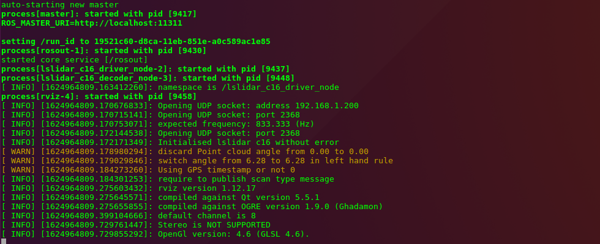


CLI output: `rostopic list`

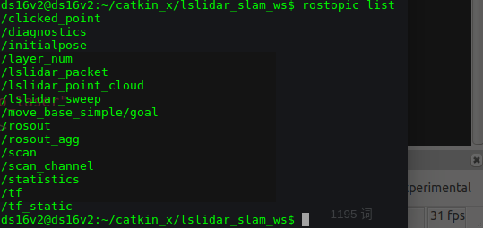

---

### reply for 2


note: when adding tf package node in .launch file
```xml
  <!-- TF monitoring -->
  <node pkg="tf" type="static_transform_publisher" name="base_to_laser"
        args="0.0 0.0 1.4 0.0 0.0 0.0 base_link laser_link 100">
  </node>
  
```

again run `rqt`, the /tf node will be displayed in rqt graph.

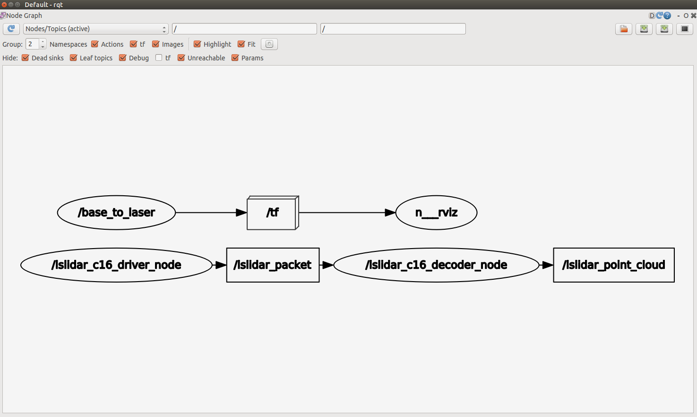

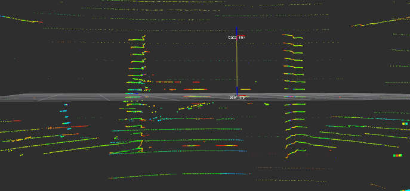

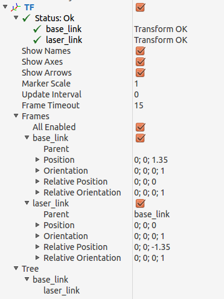


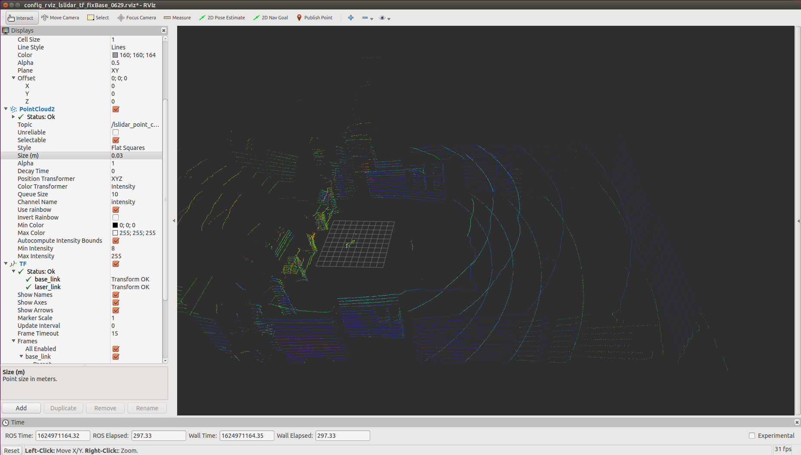

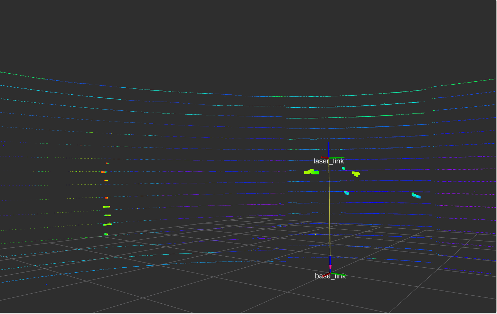


### reply for 3

in **plugin --> visualization**, only **image view** and **plot** options are there, there is no **TF trees** on drop down menu. 

when add package TF in .launch file, we can get the tf tree through rviz


---


## 2. attempts and modifications on new launch file

### 1. launch file: hector_slam_rfans_tf_2.launch

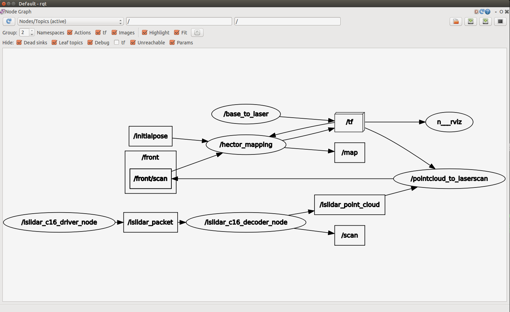

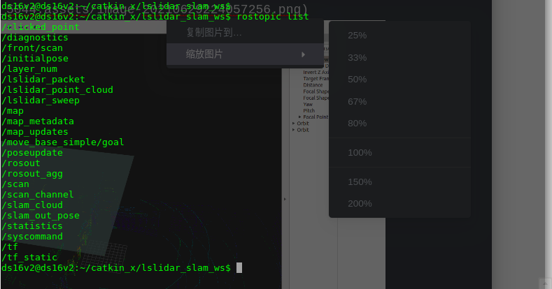

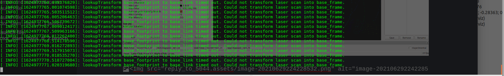

enable PointCloud2

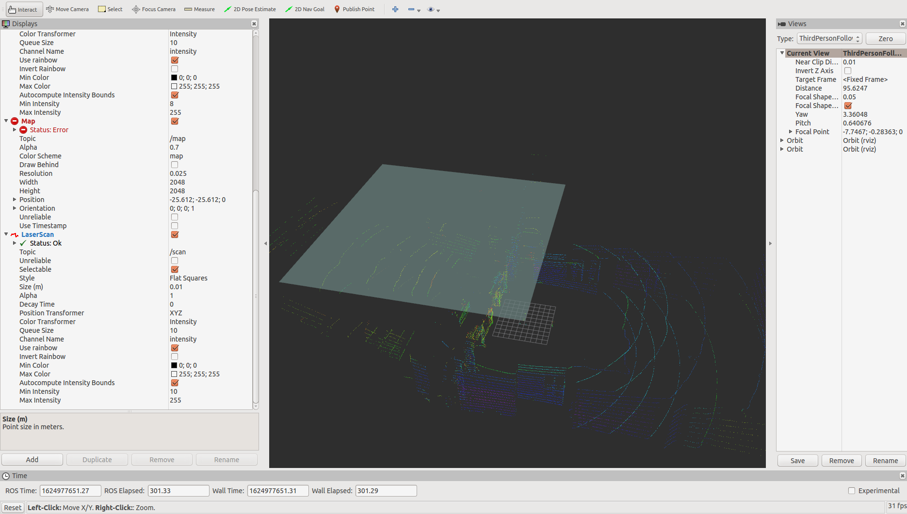

enable LaserScan, disable PointCloud2

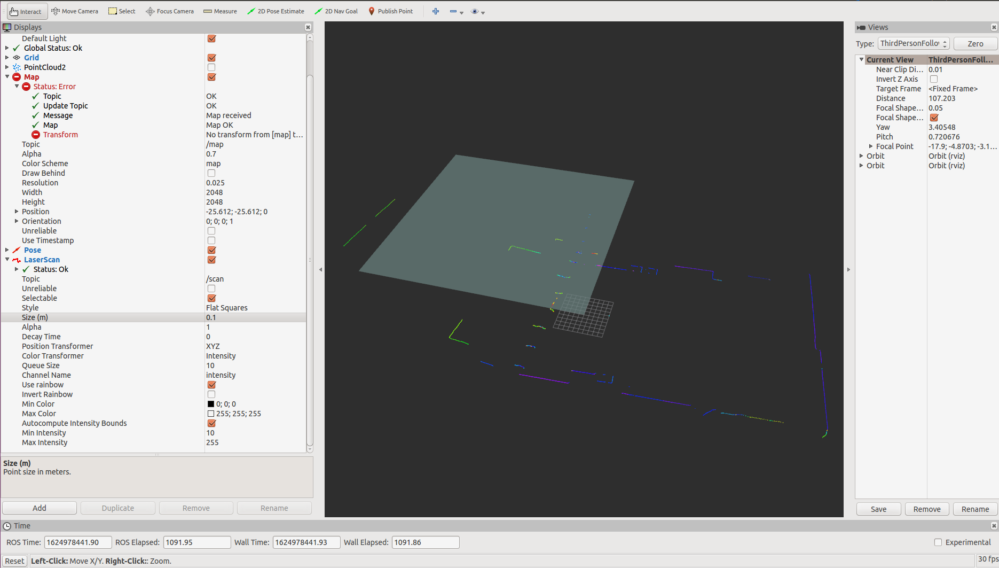

problems on Map

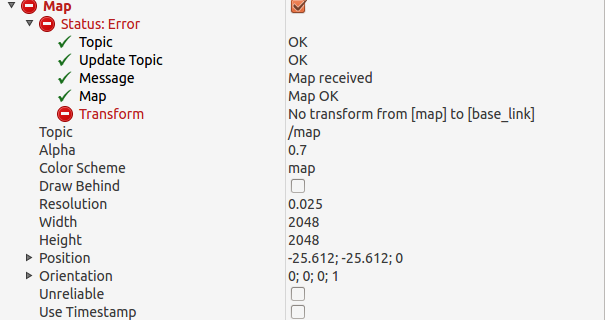

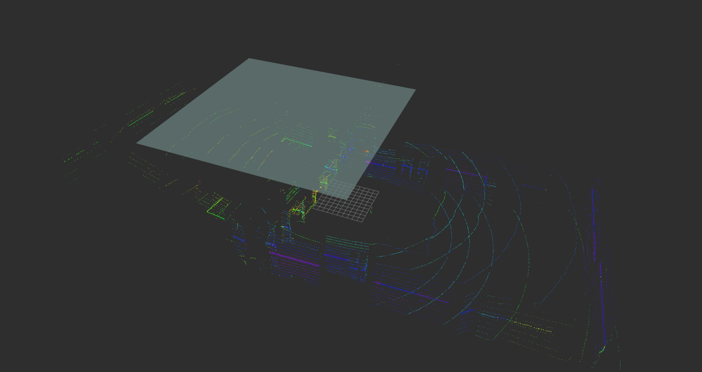
