# 20210630-log-hector-mapping

[toc]


--

## 1. what we have

hector_slam_rfans_tf_3.launch

```xml
<!--
Maps the environment with RFANS LiDAR using Hector SLAM
No robot is necessary
-->
<launch>

    <arg name="scan_topic"         default="front/scan" />
    <arg name="use_odom"           default="false" />
    <arg name="map_frame"          default="map" />
    <!-- <arg name="base_frame"         default="base_footprint" /> -->
    <arg name="base_frame"         default="base_link" />
    <arg name="odom_frame"         default="odom" />

    
    <!-- launch lslidar_c16 -->
    <node pkg="lslidar_c16_driver" 
          type="lslidar_c16_driver_node" 
          name="lslidar_c16_driver_node" 
          output="screen">
      <param name="lidar_ip" value="192.168.1.200"/>
      <param name="device_port" value="2368"/>
      <param name="add_multicast" value="false"/>
      <param name="group_ip" value="224.1.1.2"/>
    </node>

    <node pkg="lslidar_c16_decoder" 
          type="lslidar_c16_decoder_node" 
          name="lslidar_c16_decoder_node" 
          output="screen">
      <param name="frame_id" value="laser_link"/>
      <param name="point_num" value="2000"/>
      <param name="channel_num" value="8"/>
      <param name="angle_disable_min" value="0"/>
      <param name="angle_disable_max" value="0"/>
      <param name="angle3_disable_min" value="0"/>
      <param name="angle3_disable_max" value="0"/>
      <param name="min_range" value="0.15"/>
      <param name="max_range" value="150.0"/>
      <!-- <param name="frequency" value="10.0"/> -->
      <param name="frequency" value="100.0"/>
      <param name="publish_point_cloud" value="true"/>
      <param name="publish_scan" value="true"/>
      <param name="use_gps_ts" value="false"/>
    </node>
  

    <!-- PointCloud to laserscan -->
    <node pkg="pointcloud_to_laserscan" 
          type="pointcloud_to_laserscan_node" 
          name="pointcloud_to_laserscan">
      
      <!-- <remap from="cloud_in" to="/rfans_driver/rfans_points" /> -->
      <remap from="cloud_in" to="/lslidar_point_cloud" />
      <remap from="scan"     to="/front/scan" />

      <!-- <param name="target_frame"    value="rfans" /> -->
      <param name="target_frame"    value="base_link" />
      <param name="min_height"      value="0.0" />
      <param name="max_height"      value="1.0" />
      <param name="angle_min"       value="-3.14" />
      <param name="angle_max"       value="3.14" />
      <param name="angle_increment" value="0.00655" />
      <param name="scan_time"       value="0.0" />
      <param name="range_min"       value="0.45" />
      <param name="range_max"       value="100.0" />
      <param name="use_inf"         value="true" />
    </node>


    <!-- Hector SLAM -->
    <node pkg="hector_mapping" type="hector_mapping" name="hector_mapping" output="screen" >
      <param name="pub_map_odom_transform" value="true"/>
      <param name="map_frame" value="$(arg map_frame)" />
      <param name="base_frame" value="$(arg base_frame)" />
      <param name="map_resolution" value="0.025" />
      <param name="map_size" value="10000" />
      <param if="$(arg use_odom)" name="odom_frame" value="$(arg odom_frame)" />
      <param unless="$(arg use_odom)" name="odom_frame" value="$(arg base_frame)" />
      <param name="scan_topic" value="$(arg scan_topic)" />
    </node>  


    <!-- TF monitoring -->
    <node pkg="tf" type="static_transform_publisher" name="base_to_laser"
        args="0.0 0.0 1.4 0.0 0.0 0.0 base_link laser_link 100">
    </node>


    <!-- visualize point cloud -->
    <!-- <node name="rviz" pkg="rviz" type="rviz" 
        args="-d $(find hector_slam_pkg)/rviz/20210621_rviz_pointCloud.rviz" 
        output="screen"/> -->

    <!-- visualize hector mapping -->
    <!-- <node name="rviz" pkg="rviz" type="rviz" 
        args="-d $(find hector_slam_pkg)/rviz/config_rviz.rviz" 
        output="screen"/> -->
    <node name="rviz" pkg="rviz" type="rviz" output="screen"/>

</launch>

```


---

## 2. plan

1. use `hector_slam_rfans_tf_3.launch` to go a straight line during map generation. 
2. use `hector_slam_rfans_tf_4.launch` where in line 10, change `base_link` to `laser_link`, try out close loop and straight line. 
3. use `hector_slam_rfans_tf_5.launch` where in line 85, interchange `base_link` and `laser_link`, try out close loop and straight line. 


---

## 3. hector_mapping run. 

necessary command:

```
rosrun map_server map_saver ../../map_[]
```


### 1. plan 1

attempt 1:

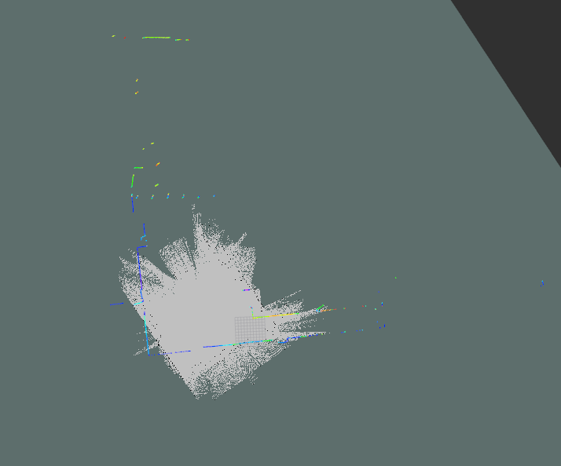


attempt 2:

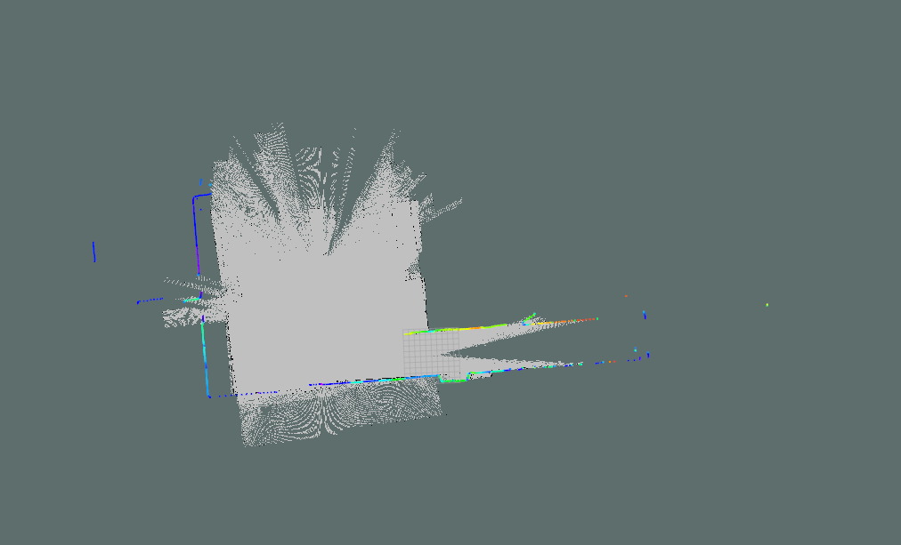

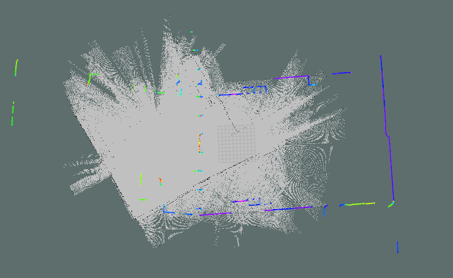

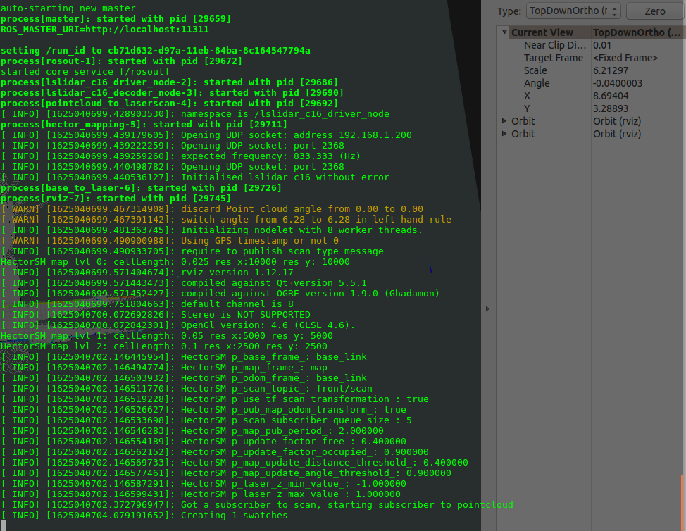

---

### 2. plan 2

attempt 1:


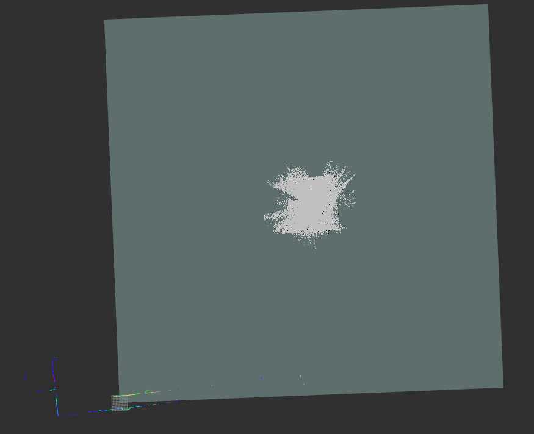

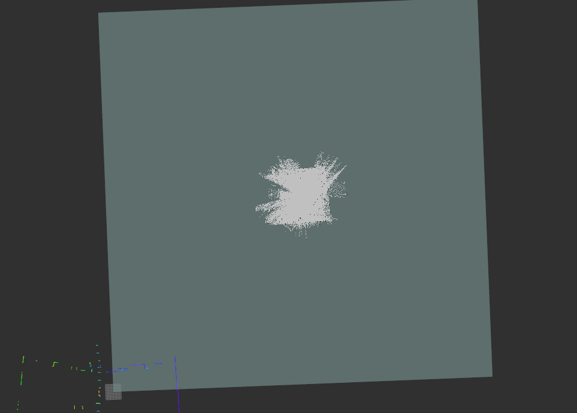

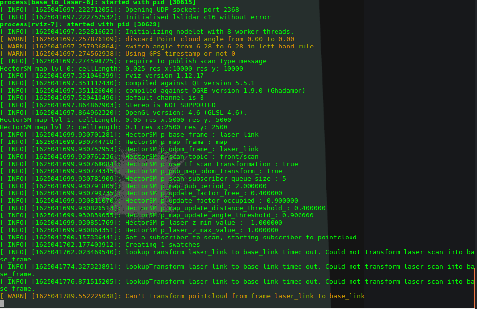


attempt 2:

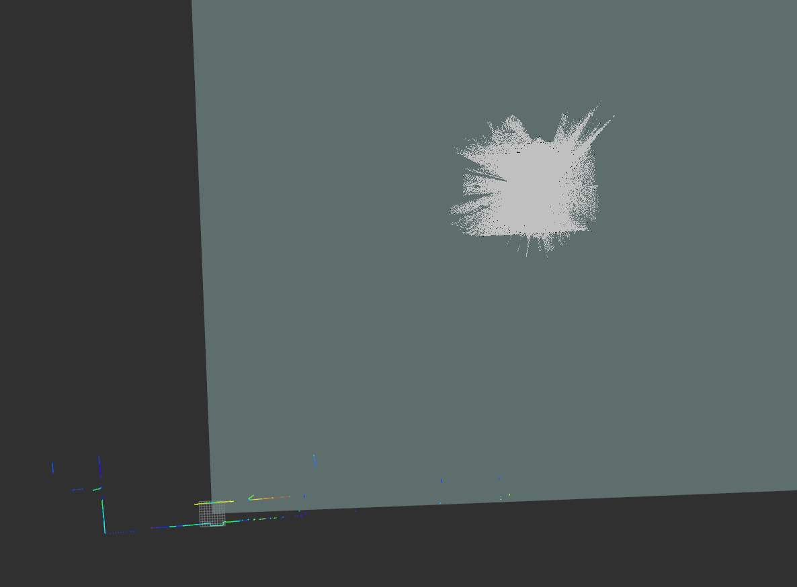


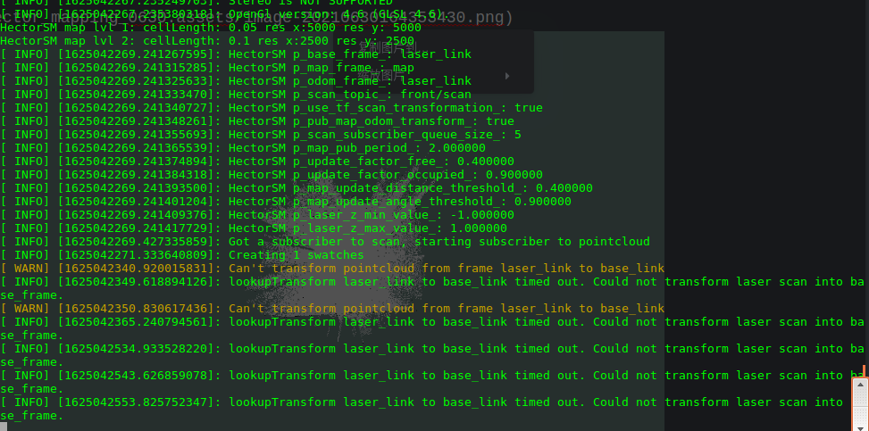


---

### 3. plan 3

attempt 1:

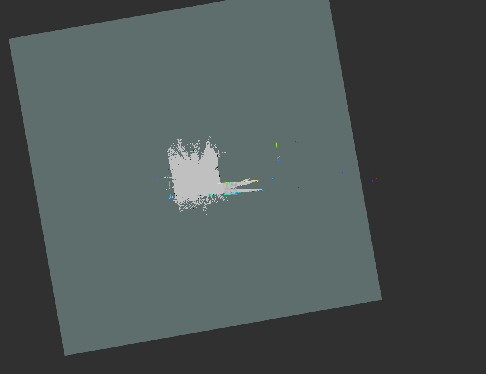

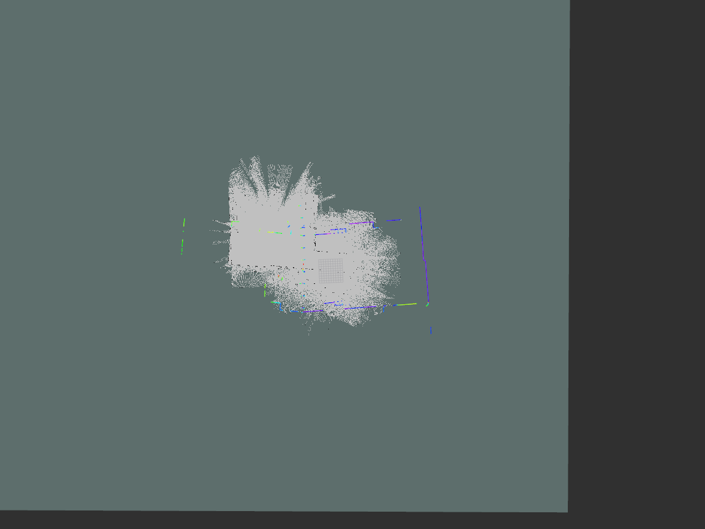

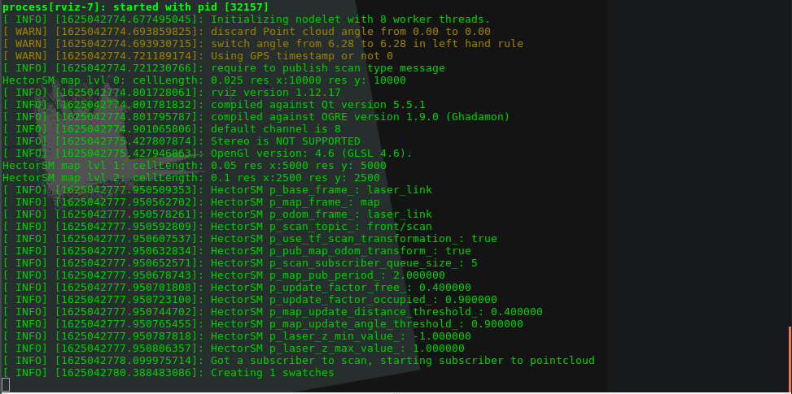