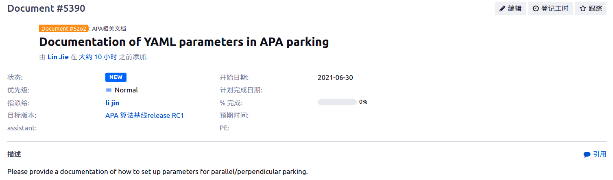

# 5390-Yaml-Doc

[toc]


---

---


**motto**: DDL is a primary productive force!

---

**target**:




---

---

## PC SIM

```yaml
      - key: APAReadTxt                            ## PC SIM, 读取 canbus.txt 文件
        ignore: 1  # DVR                           # 1: 跳过此功能，0：启用此功能
        input: H002_DVR/DVR_2/left.txt             # DVR 中 canbus.txt 所在路径
        output: txt_str_layer       
        accurate_time: 1      

      - key: APAInfoProcess                        ## PC SIM, 读取 canbus.txt 文件
        ignore: 1  # DVR                           # 1: 跳过此功能，0：启用此功能
        coordinate_cam_file:					   ## 环视相机标定文件
          left: H002_DVR/apa_left_cam.dat          # 标定文件 .dat 所在路径
          right: H002_DVR/apa_right_cam.dat        # 标定文件 .dat 所在路径
          rear: H002_DVR/apa_rear_cam.dat          # 标定文件 .dat 所在路径
          front: H002_DVR/apa_front_cam.dat        # 标定文件 .dat 所在路径
        car_param: H002_DVR/car_param.yaml         # DVR 中 car_param.yaml 所在路径
        video_file: 							   ## DVR 中环视录像文件
          left_h264: H002_DVR/DVR_2/left.h264      # DVR 中录像文件 .h264 所在路径
          left_hdr: H002_DVR/DVR_2/left.hdr        # DVR 中录像文件 .hdr 所在路径
          right_h264: H002_DVR/DVR_2/right.h264    # DVR 中录像文件 .h264 所在路径
          right_hdr: H002_DVR/DVR_2/right.hdr      # DVR 中录像文件 .hdr 所在路径
        #input_cam: [left_cam, right_cam]
        input_txt: txt_str_layer
        pub_pose: 1
        show_image: 1
        output_resolution: 0.2
        output: grid_map_layer
        enable_tsp: 1
```

注：`##`说明，`#`可以改动


---

## 4959 vertical parking


---

## 4459 parallel parking

