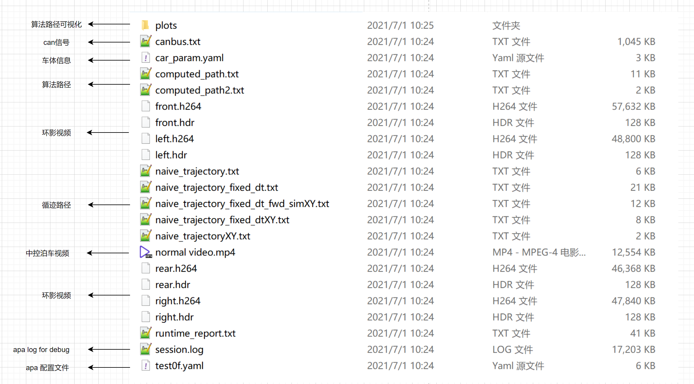

# 5390-Yaml-Doc

[toc]


---

---


**motto**: DDL is a primary productive force!

---

**target**:


---

---

## PC SIM

DVR structure：



注：环影标定文件 `.dat` 不在 DVR 中。 

test0f.yaml modification for PC SIM：
```yaml
      - key: APAReadTxt                            ## PC SIM, 读取 canbus.txt 文件
        ignore: 1  # DVR                           # 1：跳过此功能，0：启用此功能
        input: H002_DVR/DVR_2/left.txt             # DVR 中 canbus.txt 所在路径
        output: txt_str_layer       
        accurate_time: 1      

      - key: APAInfoProcess                        ## PC SIM, 读取 canbus.txt 文件
        ignore: 1  # DVR                           # 1：跳过此功能，0：启用此功能
        coordinate_cam_file:					   ## 环视相机标定文件
          left: H002_DVR/apa_left_cam.dat          # 标定文件 .dat 所在路径
          right: H002_DVR/apa_right_cam.dat        # 标定文件 .dat 所在路径
          rear: H002_DVR/apa_rear_cam.dat          # 标定文件 .dat 所在路径
          front: H002_DVR/apa_front_cam.dat        # 标定文件 .dat 所在路径
        car_param: H002_DVR/car_param.yaml         # DVR 中 car_param.yaml 所在路径
        video_file: 							   ## DVR 中环视录像文件
          left_h264: H002_DVR/DVR_2/left.h264      # DVR 中录像文件 .h264 所在路径
          left_hdr: H002_DVR/DVR_2/left.hdr        # DVR 中录像文件 .hdr 所在路径
          right_h264: H002_DVR/DVR_2/right.h264    # DVR 中录像文件 .h264 所在路径
          right_hdr: H002_DVR/DVR_2/right.hdr      # DVR 中录像文件 .hdr 所在路径
        #input_cam: [left_cam, right_cam]
        input_txt: txt_str_layer
        pub_pose: 1
        show_image: 1
        output_resolution: 0.2
        output: grid_map_layer
        enable_tsp: 1
```

注：`##`说明，`#`开放参数，可以改动。


---

## 4959 vertical parking

**car_param.yaml**

**car_param.yaml**

```yaml
HORIZONTAL_PARKING_OFFSET: 0.0					    # 水平车位向外偏移量（m）
FIX_RETURN_COORD: 1									# 启用二次识别修正车位坐标 AB
FIX_RETURN_COORD_CD: 1								# 启用二次识别修正车位坐标 CD
```


**test0f.yaml for vertical parking:**

relevant ticket: 4264, 4523

currently focus on #4959 vertical parking yaml. 

```yaml
      - key: ParkingMiddleGoals					   ## 垂直车位，多步停车模式
        #ignore: 1                                 # 1：跳过此功能，0：启用此功能
        output_path: expect_path
        log_level: 5							   # 日志级别，通常情况下数字越大，日志内容越多
        output: middle_goal_pose
        parking_mode: 5                            # 5: 垂直车位模式，#4264，#4959
        steering_angle: 0.3						   # 前轮转向角度，弧度，测试过 0.3 ~ 0.4，#4264
        parking_spot_width: 6.1 #add this          # 垂直车位宽度，长边长度
        lane_width: 3                              # 行车通道宽度
        perp_distance: 3                           # 替代，1.5*car_width，#4523
        para_distance: 4                           
        goal1_angle: 0.174                         # goal1 矫正角度，弧度，#4264
        angle_tolerance: 0.0 # 15 deg, 0.262       # final odom 与 final goal 容错值，#4264
        distance_tolerance: 0.3                    
        iterations: 1                              
        save_to_apa: 1                             
        update_goal: 1                             # 1：启用车位坐标更新， 0：禁止
        apa_mode: 1 #change this                   # 1：启用APA模式修改车位坐标，0：禁止
        use_astar: 0                               

	  - ...

      - key: ComputePath                           ## 计算起APA点到终点的全路径
        ignore: 1                                  # 1：跳过此功能，0：启用此功能
        input: middle_goal_pose
        eval_result: eval_result
        output: expect_path
        simple_path_type: RS
        #astar_mode: 1                             
        backward: 1
        max_steer: 0.42                            # use max steer to cumpute max curvature
        #check_collision: 2
        min_incr_dist: 0.05
        map_layer: gridmap_layer
        use_local: 0
        save_path: 1
        apa_mode: 1                                # 1：启用APA模式修改车位坐标，0：禁止
        wait_for_map: 0
        car_scale: 0.78
        smooth_path: 0                             # 1：启用平滑路线， 0：禁止平滑路线
        
      - ...
      
      - key: ComputeControlValue				   ## 依据当前位置+轨迹池轨迹计算车体控制值
        output: control_value
        expect_pose: expect_pose_layer
        traj_debug: traj_cache_layer
        delta_gain: 2
        slow_turn: 2			     # 当车偏离轨迹，0：不减速，1：依据偏移量减速，2：依据转向角度减速
        catchup_cache: 1						  
        min_speed: 0.1
        time_step: 0.05
        goal_correction: 1  # 4459-64          # 1：启用寻迹结束没有达到goal，重新计算轨迹，0：禁止
```

注：`##`说明，`#`开放参数，可以改动。


---

## 4459 parallel parking

**car_param.yaml**

```yaml
HORIZONTAL_PARKING_OFFSET: 1.0					    # 水平车位向外偏移量（m）
FIX_RETURN_COORD: 1									# 启用二次识别修正车位坐标 AB
FIX_RETURN_COORD_CD: 1								# 启用二次识别修正车位坐标 CD
```


**test0f.yaml for parallel parking:**

currently focus on #4959 vertical parking yaml. 

```yaml
      - key: ParkingMiddleGoals
        #ignore: 1
        output_path: expect_path
        log_level: 5
        output: middle_goal_pose
        parking_mode: 10						   # 10：垂直车位泊车模式
        steering_angle: 0.3
        parking_spot_width: 6.1 #add this
        lane_width: 3
        perp_distance: 3
        para_distance: 4
        goal1_angle: 0.174
        angle_tolerance: 0.0 # 10 deg
        distance_tolerance: 0.3
        iterations: 1
        save_to_apa: 1
        update_goal: 1
        apa_mode: 1 #change this
        use_astar: 0
        
      - ...
      
      - key: ComputeControlValue
        output: control_value
        expect_pose: expect_pose_layer
        traj_debug: traj_cache_layer
        delta_gain: 2
        slow_turn: 2			     # 当车偏离轨迹，0：不减速，1：依据偏移量减速，2：依据转向角度减速
        catchup_cache: 1
        min_speed: 0.1
        time_step: 0.05
        goal_correction: 1  # 4459-64          # 1：启用寻迹结束没有达到goal，重新计算轨迹，0：禁止
```

注：`##`说明，`#`开放参数，可以改动。其余可修改参数参考 #4959 垂直车位 yaml。

