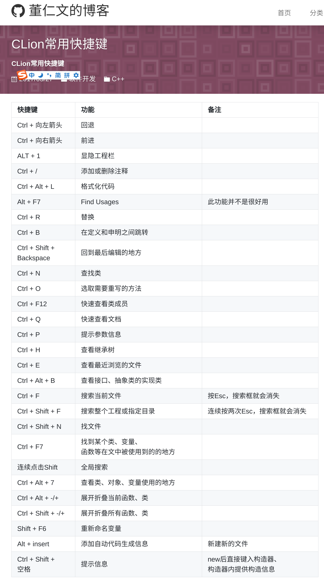
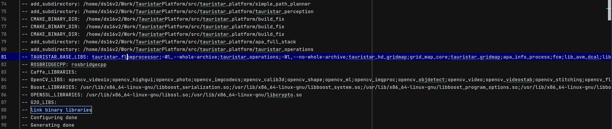

# log: 20210702

[toc]


----

## clion 快捷键




---


## processor_node cmake log

```
-- add_subdirectory: /home/ds16v2/Work/TauristarPlatform/src/tauristar_platform/simple_path_planner
-- add_subdirectory: /home/ds16v2/Work/TauristarPlatform/src/tauristar_platform/tauristar_perception
-- CMAKE_BINARY_DIR:  /home/ds16v2/Work/TauristarPlatform/src/tauristar_platform/build_fix
-- CMAKE_BINARY_DIR:  /home/ds16v2/Work/TauristarPlatform/src/tauristar_platform/build_fix
-- CMAKE_BINARY_DIR:  /home/ds16v2/Work/TauristarPlatform/src/tauristar_platform/build_fix
-- add_subdirectory: /home/ds16v2/Work/TauristarPlatform/src/tauristar_platform/apa_full_stack
-- add_subdirectory: /home/ds16v2/Work/TauristarPlatform/src/tauristar_platform/tauristar_operations
-- TAURISTAR_BASE_LIBS: tauristar_flowprocessor;-Wl,--whole-archive;tauristar_operations;-Wl,--no-whole-archive;tauristar_hd_gridmap;grid_map_core;tauristar_gridmap;apa_info_process;fcw;lib_avm_dcal;lib_avm;lib_avm_bvc;lib_avm_calib;lib_avm_algobase;lib_avm_util;motion_planner;tauristar_geometry;mpc_controller_lib;tauristar_procedure;drlib;basic_util;state_machine_lib;simple_path_planner;lanelet2_extension_lib;lanelet2_core;lanelet2_io;lanelet2_projection;lanelet2_routing;lanelet2_traffic_rules;GeographicLib_SHARED;pugixml
-- ROSBRIDGECPP: rosbridgecpp
-- Caffe_LIBRARIES: 
-- OpenCV_LIBS: opencv_videoio;opencv_highgui;opencv_photo;opencv_imgcodecs;opencv_calib3d;opencv_shape;opencv_ml;opencv_imgproc;opencv_objdetect;opencv_video;opencv_videostab;opencv_stitching;opencv_flann;opencv_superres;opencv_features2d;opencv_dnn;opencv_core
-- Boost_LIBRARIES: /usr/lib/x86_64-linux-gnu/libboost_serialization.so;/usr/lib/x86_64-linux-gnu/libboost_system.so;/usr/lib/x86_64-linux-gnu/libboost_program_options.so;/usr/lib/x86_64-linux-gnu/libboost_thread.so;/usr/lib/x86_64-linux-gnu/libboost_filesystem.so;/usr/lib/x86_64-linux-gnu/libboost_regex.so;/usr/lib/x86_64-linux-gnu/libboost_chrono.so;/usr/lib/x86_64-linux-gnu/libboost_date_time.so;/usr/lib/x86_64-linux-gnu/libboost_atomic.so;/usr/lib/x86_64-linux-gnu/libpthread.so
-- OPENSSL_LIBRARIES: /usr/lib/x86_64-linux-gnu/libssl.so;/usr/lib/x86_64-linux-gnu/libcrypto.so
-- G2O_LIBS: 
-- link binary libraries
-- Configuring done
-- Generating done
```

