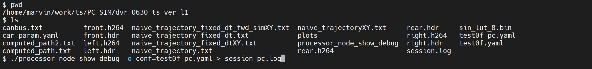
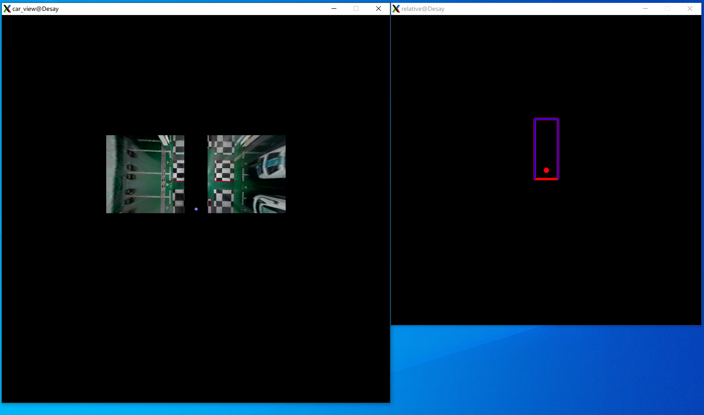
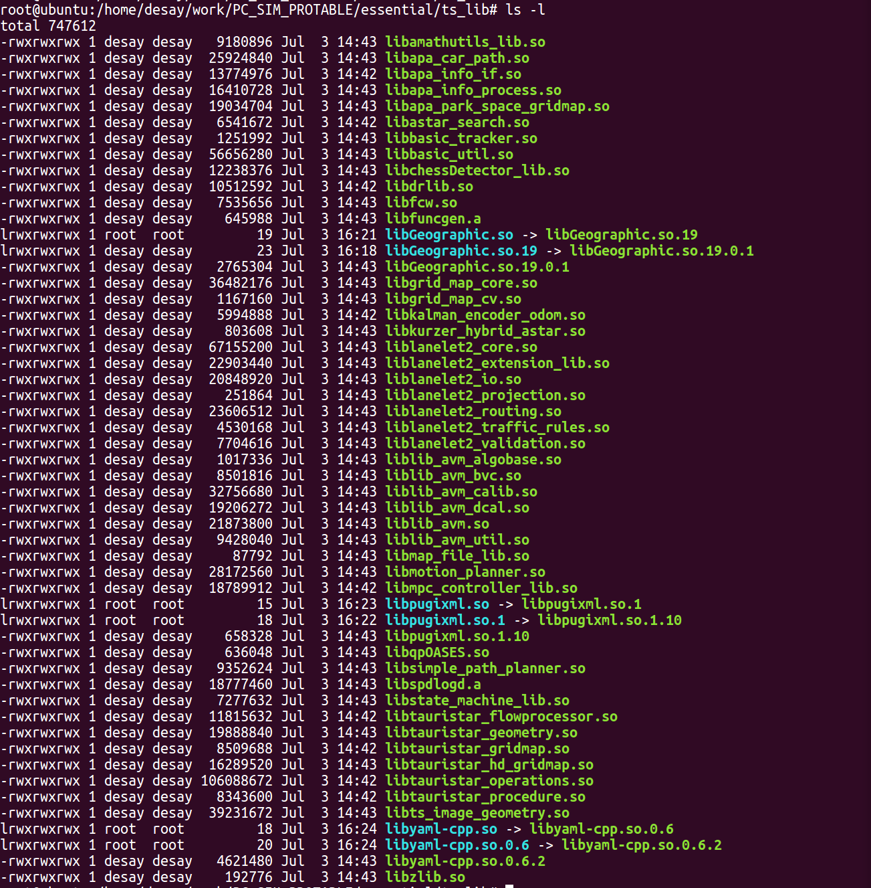
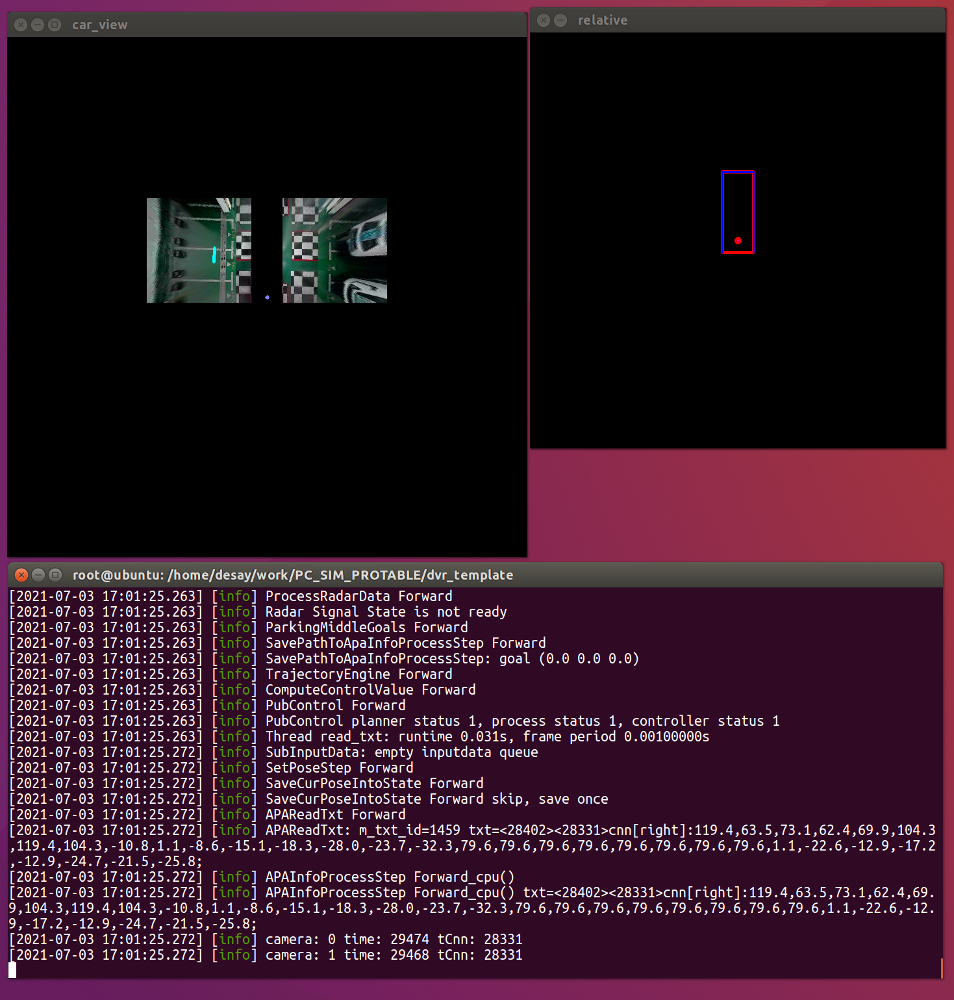

# PC_SIM how

[toc]


---

## 1. using mobaxterm

编译`processor_node_xxx`（算法）

```
git stash
git pull
git stash pop

git checkout -b dev

# TauristarPlatform/src/tauristar_platform/apa_full_stack/CMakeLists.txt
# option (show_image "show_image" ON) --> #4264

mkdir build_pc
cd build_pc
cmake .. -DCMAKE_BUILD_TYPE=Debug
make -j8
```


PC_SIM 文件路径：`/home/marvin/work/ts/PC_SIM`

```
.
├── dvr_0630_ts_ver_l1								# dvr 文件夹
│   ├── canbus.txt
│   ├── car_param.yaml
│   ├── computed_path2.txt
│   ├── computed_path.txt
│   ├── front.h264
│   ├── front.hdr
│   ├── left.h264
│   ├── left.hdr
│   ├── naive_trajectory_fixed_dt_fwd_simXY.txt
│   ├── naive_trajectory_fixed_dt.txt
│   ├── naive_trajectory_fixed_dtXY.txt
│   ├── naive_trajectory.txt
│   ├── naive_trajectoryXY.txt
│   ├── plots
│   │   ├── plot1.png
│   │   ├── plot2&3.png
│   │   ├── plot4.png
│   │   └── plot.log
│   ├── processor_node_show_debug					# processor_node 二进制文件
│   ├── rear.h264
│   ├── rear.hdr
│   ├── right.h264
│   ├── right.hdr
│   ├── session.log
│   ├── sin_lut_8.bin
│   ├── test0f_pc.yaml
│   └── test0f.yaml
├── dvr_template									# dvr 文件夹
│   ├── canbus.txt
|   |	.......
│   └── test0f.yaml
└── IC421											# IC421 的配置文件，如有更新，请替换如下文件
    ├── apa_front_cam.dat							# 环影镜头参数文件
    ├── apa_left_cam.dat							# 环影镜头参数文件
    ├── apa_rear_cam.dat							# 环影镜头参数文件
    ├── apa_right_cam.dat							# 环影镜头参数文件
    └── BV3D.xml									# 标定参数文件
```


`processor_node_xxx` 二进制文件需要先编译，然后再将其从

```
/home/marvin/work/ts/TauristarPlatform/src/tauristar_platform/build_xxx/bin/  
```

中拷贝到 `PC_SIM/dvr_xxx` 中。


运行 `processor_node_xxx`:

```
./processor_node_xxx -o conf=test0f_pc.yaml
```


关于 `test0f_pc.yaml`文件的修改，参考 `#5390`


运行效果图，通过 mobaxterm。





缺点：带宽不够，视频输出延时。


---

## 2. using vmware

```
export LD_LIBRARY_PATH=/usr/lib:/home/ds16v2/Work/TS_PC/PC_TEST_2/PC_SIM/lib:/usr/local/opencv/opencv-3.4.5/lib~

# 
# /usr/lib
# /home/ds16v2/Work/TS_PC/PC_TEST_2/PC_SIM/lib
# /usr/local/opencv/opencv-3.4.5/lib~
```


从服务器下载 PC_SIM_PROTABLE（包含processor_node 以及一些 .so 文件），服务器存放地址：`/disk3/PC_SIM_PROTABLE`

PC_SIM_PROTABLE 文件结构：

```
.
├── dvr_template									# dvr 模板文件，包含一个 processor_node 以及pc模拟必要文件
│   ├── canbus.txt
│   ├── car_param.yaml
│   ├── computed_path2.txt
│   ├── computed_path.txt
│   ├── front.h264
│   ├── front.hdr
│   ├── left.h264
│   ├── left.hdr
│   ├── naive_trajectory_fixed_dt_fwd_simXY.txt
│   ├── naive_trajectory_fixed_dt.txt
│   ├── naive_trajectory_fixed_dtXY.txt
│   ├── naive_trajectory.txt
│   ├── naive_trajectoryXY.txt
│   ├── plots
│   ├── processor_node_local						# 用于 pc 模拟的 二进制文件
│   ├── rear.h264
│   ├── rear.hdr
│   ├── right.h264
│   ├── right.hdr
│   ├── session.log
│   ├── session_pc.log
│   ├── sin_lut_8.bin
│   ├── test0f_pc.yaml
│   └── test0f.yaml
├── essential										# 必要的动态库文件集
│   ├── local_lib									# 需要挂载的本地的必要动态文件 .so
│   ├── opencv_lib									# 需要挂载的 opencv 动态文件 .so
│   └── ts_lib										# 需要挂载的 TS 平台动态文件 .so
├── IC421											# IC421 环影配置文件	
│   ├── apa_front_cam.dat
│   ├── apa_left_cam.dat
│   ├── apa_rear_cam.dat
│   ├── apa_right_cam.dat
│   └── BV3D.xml
└── path

```


下载到本地虚拟机的任意文件夹，并在 `/essental`中打开命令行输入如下命令，创建链接文件。

```
ln -s libyaml-cpp.so.0.6.2 libyaml-cpp.so.0.6
ln -s libyaml-cpp.so.0.6 libyaml-cpp.so

ln -s libpugixml.so.1.10 libpugixml.so.1
ln -s libpugixml.so.1 libpugixml.so

ln -s libGeographic.so.19.0.1 libGeographic.so.19
ln -s libGeographic.so.19 libGeographic.so
```

通过`ls -l`查看结果：




转到 `/dvr_template` 文件夹下：

```
sudo chmod 777 processor_node_local

./processor_node_local -o conf=test0f_pc.yaml  或
./processor_node_local -o conf=test0f_pc.yaml > session_pc.log
```

输出结果：

