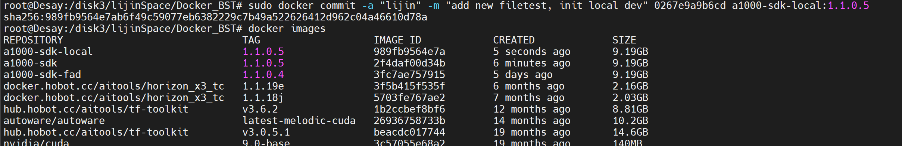
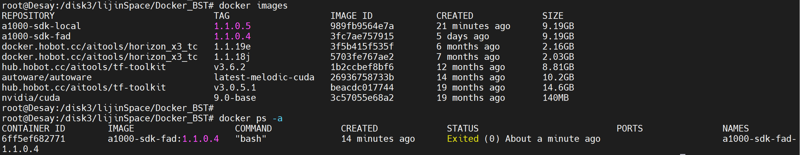
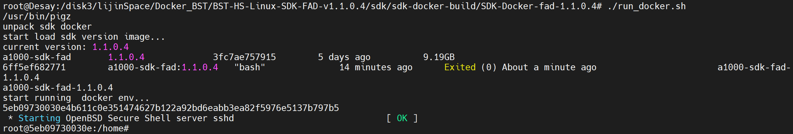
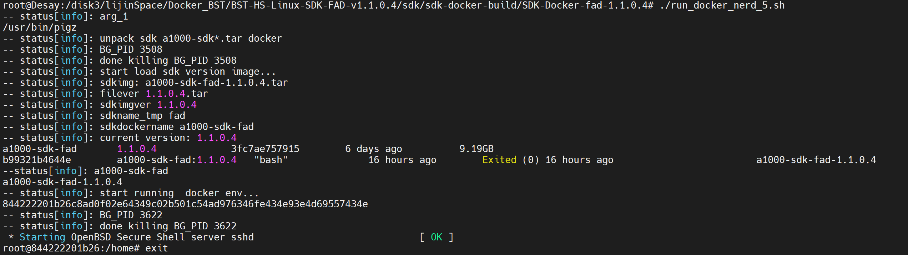
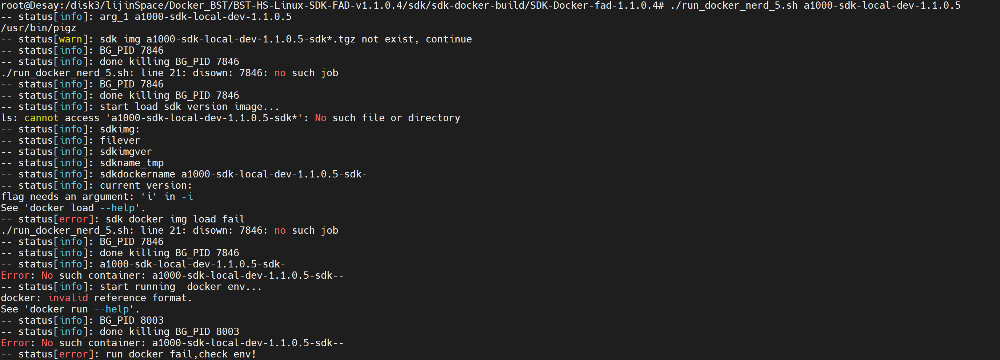
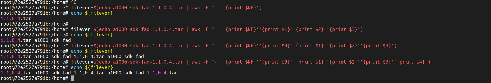

# 20210706: log bst docker 

[toc]

---

---

**aim**: cross make ts in bst docker

---

---


---

## log 0: create ground zero image for local development

```
root@Desay:/disk3/lijinSpace/Docker_BST# sudo docker commit -a "lijin" -m "add new filetest, init local dev" 0267e9a9b6cd a1000-sdk-local:1.1.0.5

```




以后此 image 为 local dev 的启动 image。


更新操作：

当前image + container。




使用 ./run_docker.sh，启动 container (id: 6ff5ef682771, image: a1000-sdk-fad:1.1.0.4, id: 3fc7ae757915)




排解问题，manual 指令 commit --> run_docker.sh没有办法从保存的 image 中启动 container，即没有办法保存数据。通过 run_docker.sh 查找原因。


```sh
#!/bin/bash
#******************************************************
#start single send...
function dots(){
seconds=${1:-5} 		# print a dot every 5 seconds by default, ${var:-word}，变量替换
while true				# 如果变量 var 为空或已被删除(unset)，那么返回 word，但不改变 var 的值
do
    sleep $seconds
    echo -n '.'
done
}

def_start_point(){

dots 10 &							# & bash命令的行尾, 该命令转到后台执行				
BG_PID=$!							# $! &分支出去的sub-shell的PID被存储在一个特殊的变量$!中
}

#trap "kill -9 $BG_PID" INT

def_kill(){
    disown $BG_PID
    kill -9 $BG_PID > /dev/null 2>&1	# 标准错误输出重定向等同于标准输出，直接搜 2>&1
}
#******************************************************

# start do real job
# judge precondition

if [ ! -n "${1}" ];then				# -n，检测字符串长度是否为0，不为0返回 true，${1} first arg
	ARCH="a1000"
else
	ARCH="$1"						# 变量名外面的花括号{ }是可选的，加不加都行
fi

which pigz
if [ $? != 0 ];then					# $? 上个命令的退出状态，或函数的返回值，成功 0 失败 1
    echo "first install pigz"
    def_kill
    exit 1
fi

def_start_point
if [ -f ./${ARCH}-sdk*.tar ];then	# [ -f $file ] 返回 true，检测文件是否是普通文件（既不是目	
    echo "unpack sdk docker"		# 录，也不是设备文件），如果是，则返回 true
    
elif [ -f ./*.tgz ];then
    echo "unpack sdk docker img"
    fileimg=`ls *.tgz`
    tar --use-compress-program=pigz -xvpf $fileimg
    rm ${fileimg}
else
    echo "no such file sdk docker img"
    def_kill
    exit 1
fi
def_kill

# docker load img 
echo "start load sdk version image..."
sdkimg=`ls ${ARCH}-sdk*`
if [ $? == 0 ];then
    filever=`echo $sdkimg|awk -F "-" '{print $NF}'`  # AWK 是一种处理文本文件的语言, 
    sdkimgver=`echo $filever|awk -F ".tar" '{print $1}'`  # F fs or --field-separator fs
    sdkname_tmp=`echo $sdkimg|awk -F "-" '{print $3}'`  # 指定输入文件折分隔符，fs是一个字符串
    sdkdockername="${ARCH}-sdk-${sdkname_tmp}"  # 或者是一个正则表达式
    echo "current version: $sdkimgver"  # $NF 表示的最后一个Field（列）
   
    sudo docker images $sdkdockername:${sdkimgver}| grep $sdkdockername
    if [ $? -ne 0 ] ;then	# -ne 检测两个数是否相等，不相等返回 true，[ $a -ne $b ] 返回 true
        sudo docker load -i $sdkimg
        if [ $? -ne 0 ];then
            echo "-- status[error]: sdk docker img load fail"
	    def_kill
            exit 1
        fi
    #else
        #echo -e "\033[31m ERROR: Can not find docker image ${ARCH}-sdk, please build it before run. \033[0m"
        #exit 1
    fi

else
    echo "not found sdk img"
    def_kill
    exit 1
fi

# docker -v mount dir 
#cd ~
#home_path=$(pwd)
#MAP_DIR="${home_path}/sdk_vol_dir"

#if [ ! -d $MAP_DIR ];then
#	echo "Create $MAP_DIR"
#	mkdir -p $MAP_DIR
#fi


# judge docker container exist
sudo docker ps  -a|grep $sdkdockername-${sdkimgver}
if [ $? == 0 ];then
    sudo docker rm -f $sdkdockername-${sdkimgver}
fi


#检测预设ssh端口212 vnc 5900 是否被占用
sudo netstat -anp |grep 212 |grep docker-proxy |grep LISTEN
if [ $? == 0 ];then
    echo "ssh port 212 被占用...exiting"
    def_kill
    exit 1
fi

#**************
# stop single send and kill process
#disown $BG_PID
#kill -9 $BG_PID 
#**************

def_start_point
echo "start running  docker env..."
sudo docker container run -idt \
    --name $sdkdockername-${sdkimgver} \
    --privileged  \
    --cap-add SYS_ADMIN \
    --cap-add NET_ADMIN \
    --device /dev/fuse \
    --security-opt apparmor:unconfined \
    --security-opt seccomp=unconfined  \
    -p 212:22  \
    -v /dev/bus/usb:/dev/bus/usb  \
    $sdkdockername:${sdkimgver} \
    bash

def_kill

sleep 5s
# docker login
sudo docker exec -it $sdkdockername-${sdkimgver} /bin/bash
if [ $? == 1 ];then
    echo "run docker fail,check env!"
    exit 1
fi

#echo "end..."

```


解构 shell：

```sh
#**************
# stop single send and kill process
#disown $BG_PID
#kill -9 $BG_PID 
#**************

def_start_point
echo "start running  docker env..."
sudo docker container run -idt \			# interactive, detach, tty (background)
    --name $sdkdockername-${sdkimgver} \	# assign a name to cntainer
    --privileged  \							# Give privileges to this container
    --cap-add SYS_ADMIN \					# Add Linux capabilities
    --cap-add NET_ADMIN \					# Add Linux capabilities
    --device /dev/fuse \					# add a host device to container
    --security-opt apparmor:unconfined \	# security options
    --security-opt seccomp=unconfined  \	# security options
    -p 212:22  \							# publish container's port to host
    -v /dev/bus/usb:/dev/bus/usb  \			# bind mount a volume
    $sdkdockername:${sdkimgver} \			# image:tag
    bash									# arg. 

def_kill

sleep 5s
# docker login
sudo docker exec -it $sdkdockername-${sdkimgver} /bin/bash
if [ $? == 1 ];then
    echo "run docker fail,check env!"
    exit 1
fi

#echo "end..."
```







```

```


