# 20210706: log bst docker 

[toc]

---

2021年7月10日

2021年7月9日

2021年7月8日

2021年7月7日

2021年7月6日

---

**aim**: cross make ts in bst docker

---

---

## log8: BST docker tsp: pack include, lib

2021年7月10日


参考 j3_demo 进行 dep 打包。


 `/home/work/TauristarPlatform/src/tauristar_platform/../../../j3_apa_demo/deps`


---


## log7: BST docker tsp: test bst gcc g++

2021年7月10日


使用 local make：本地需要 编译 dependencis（opencv，openssl，。。。）(halt)

使用 ti cross make：需要指定 dependencis 文件夹（header，.so，.a）


模仿 x3_cross_make.sh

x3_cross_make.sh (tool-chain--> aiexpress.cmake) --> aiexpress.cmake(DEPS_ROOT-->j3_apa_demo/deps) --> CMakeLists.txt


对应 bst cross make

bst_cross_make.sh --> bst_tools.cmake --> CMakeLists.txt


现在在 docker 下进行 bst cross make

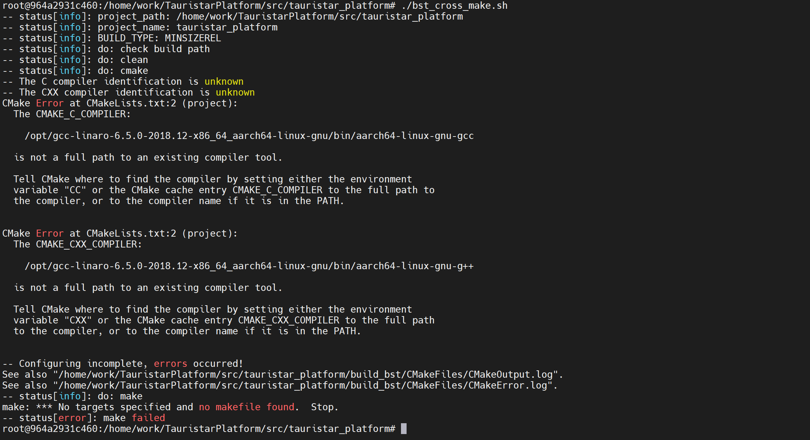

编译器没有配置对。

BST docker 中 g++ & gcc 路径

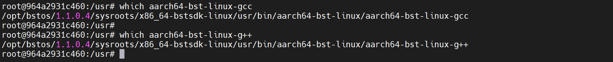


```
# which aarch64-bst-linux-gcc
/opt/bstos/1.1.0.4/sysroots/x86_64-bstsdk-linux/usr/bin/aarch64-bst-linux/aarch64-bst-linux-gcc


# which aarch64-bst-linux-g++
/opt/bstos/1.1.0.4/sysroots/x86_64-bstsdk-linux/usr/bin/aarch64-bst-linux/aarch64-bst-linux-g++
```


```
docker cp /disk3/try_shell/make_doc/ 964a2931c4607d1df0a084fa82948a320bff6e773033ebb8febe9a452b632b4b:/home/work/

```


server 上的 gcc，g++

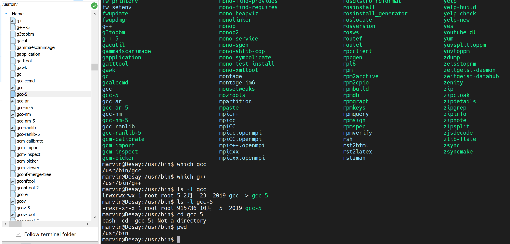


bst-os 的文件架构

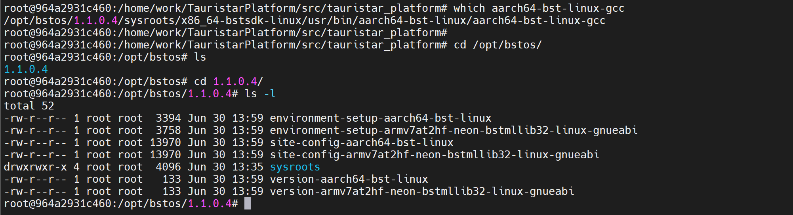

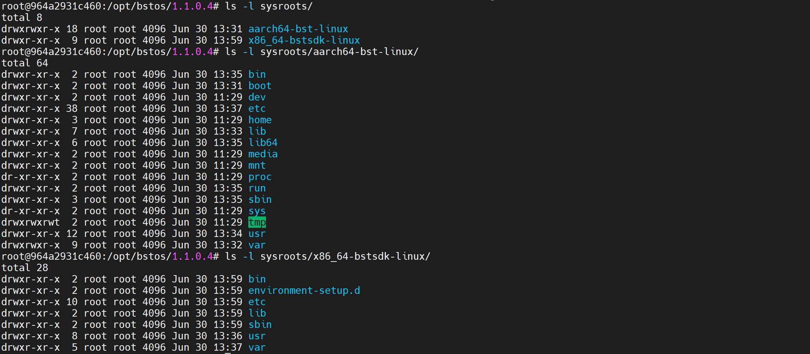

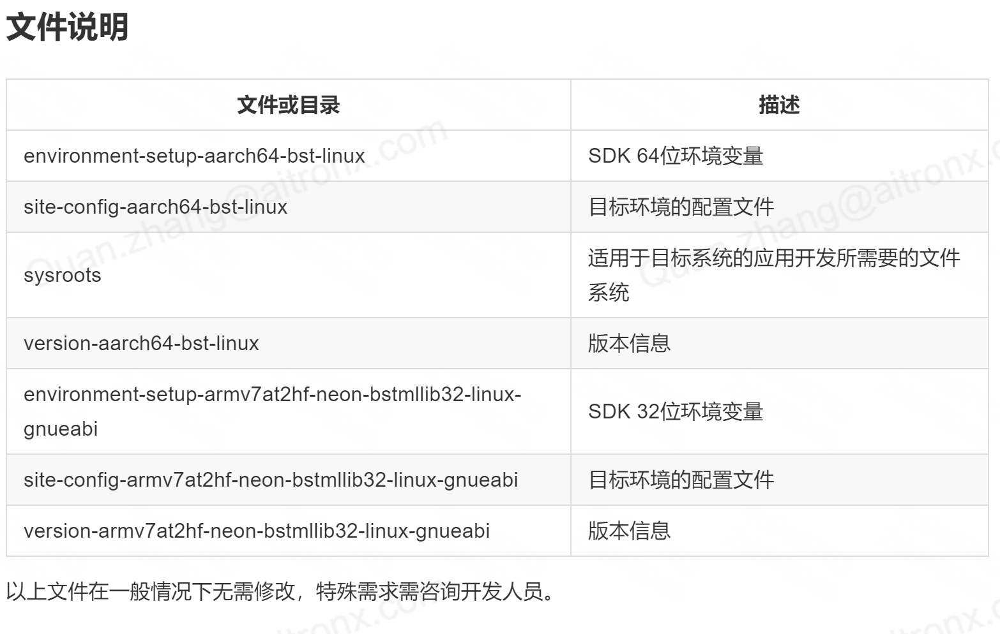

```
root@964a2931c460:/opt/bstos/1.1.0.4/sysroots/x86_64-bstsdk-linux/usr/bin/aarch64-bst-linux# which aarch64-bst-linux-gcc
/opt/bstos/1.1.0.4/sysroots/x86_64-bstsdk-linux/usr/bin/aarch64-bst-linux/aarch64-bst-linux-gcc

root@964a2931c460:/opt/bstos/1.1.0.4/sysroots/x86_64-bstsdk-linux/usr/bin/aarch64-bst-linux# which aarch64-bst-linux-g++
/opt/bstos/1.1.0.4/sysroots/x86_64-bstsdk-linux/usr/bin/aarch64-bst-linux/aarch64-bst-linux-g++

```

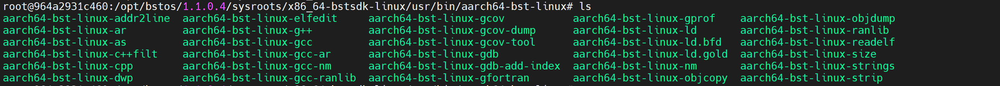


```
/opt/bstos/1.1.0.4/sysroots/x86_64-bstsdk-linux/usr/bin/aarch64-bst-linux/aarch64-bst-linux-gcc

/opt/bstos/1.1.0.4/sysroots/x86_64-bstsdk-linux/usr/bin/aarch64-bst-linux/aarch64-bst-linux-g++
```


在 bst_tools.cmake 中指定 bst-os 编译器路径后，报错：

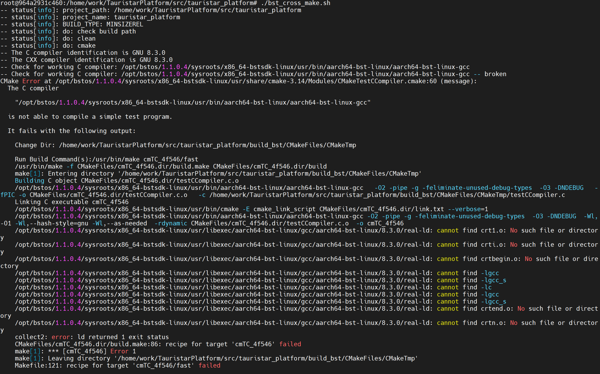

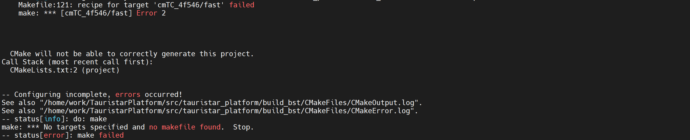


问题解决：

注释掉 bst_tools.cmake 中的 set gcc，set g++，使用默认编译器路径，编译器可以正常工作

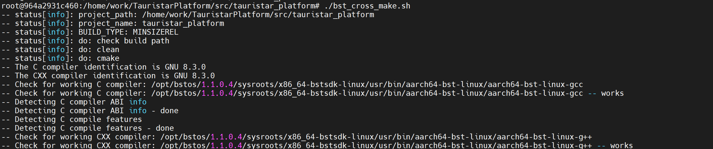


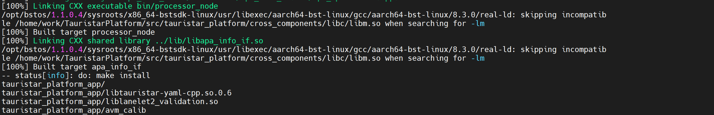


参考：

link: [分不清ARM和X86架构，别跟我说你懂CPU！](https://zhuanlan.zhihu.com/p/21266987)

---


## log6： BST docker ti cross make

2021年7月9日


ti compiler path:

```
/home/ti_compiler/TI_Build/gcc-linaro-5.3-2016.02-x86_64_arm-linux-gnueabihf
```


parse `CMakeLists.txt` path: (done)


> `./bst_cross_make.sh` error:

solution: cmake ........ -DCROSS_MAKE=ON 改成 -Dcross_make=ON

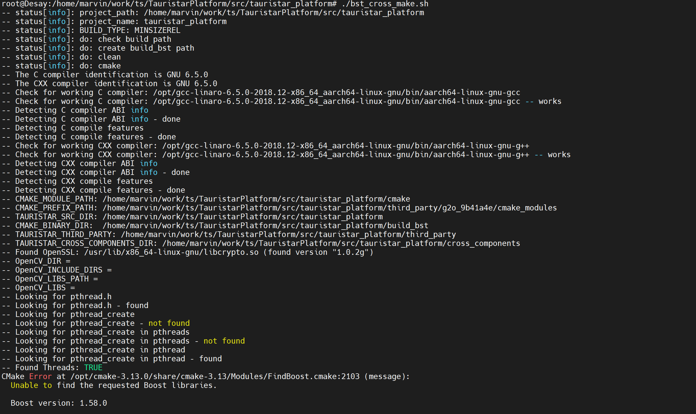


> `./x3_cross_make.sh` --> `aiexpress.cmake`

```
root@Desay:/home/marvin/work/ts/TauristarPlatform/src/tauristar_platform# ./x3_cross_make.sh
do:check build path
do:clean
do:cmake
CMake Warning (dev) at CMakeLists.txt:2 (project):
  Policy CMP0048 is not set: project() command manages VERSION variables.
  Run "cmake --help-policy CMP0048" for policy details.  Use the cmake_policy
  command to set the policy and suppress this warning.

  The following variable(s) would be set to empty:

    CMAKE_PROJECT_VERSION
    CMAKE_PROJECT_VERSION_MAJOR
    CMAKE_PROJECT_VERSION_MINOR
    CMAKE_PROJECT_VERSION_PATCH
This warning is for project developers.  Use -Wno-dev to suppress it.

-- CMAKE_C_COMPILER: /opt/gcc-linaro-6.5.0-2018.12-x86_64_aarch64-linux-gnu/bin/aarch64-linux-gnu-gcc
-- CMAKE_CXX_COMPILER: /opt/gcc-linaro-6.5.0-2018.12-x86_64_aarch64-linux-gnu/bin/aarch64-linux-gnu-g++
-- CMAKE_CURRENT_SOURCE_DIR: /home/marvin/work/ts/TauristarPlatform/src/tauristar_platform
-- DEPS_ROOT: /home/marvin/work/ts/TauristarPlatform/src/tauristar_platform/../../../j3_apa_demo/deps
-- CMAKE_MODULE_PATH: /home/marvin/work/ts/TauristarPlatform/src/tauristar_platform/cmake
-- CMAKE_PREFIX_PATH: /home/marvin/work/ts/TauristarPlatform/src/tauristar_platform/third_party/g2o_9b41a4e/cmake_modules
-- TAURISTAR_SRC_DIR: /home/marvin/work/ts/TauristarPlatform/src/tauristar_platform
-- CMAKE_BINARY_DIR:  /home/marvin/work/ts/TauristarPlatform/src/tauristar_platform/build_j3
-- TAURISTAR_THIRD_PARTY: /home/marvin/work/ts/TauristarPlatform/src/tauristar_platform/third_party
-- TAURISTAR_CROSS_COMPONENTS_DIR: /home/marvin/work/ts/TauristarPlatform/src/tauristar_platform/cross_components
-- current_folder: /home/marvin/work/ts/TauristarPlatform/src/tauristar_platform
-- BUILD_TDA2:
-- BUILD_TDA4:
-- BUILD_HORIZON: 1
-- TI_SW_ROOT:
-- Boost_LIBRARIES_PATH: /home/marvin/work/ts/TauristarPlatform/src/tauristar_platform/../../../j3_apa_demo/deps/boost/lib
-- Boost_INCLUDE_DIRS: /home/marvin/work/ts/TauristarPlatform/src/tauristar_platform/../../../j3_apa_demo/deps/boost/include
-- OpenCV_INCLUDE_DIRS: /home/marvin/work/ts/TauristarPlatform/src/tauristar_platform/../../../j3_apa_demo/deps/opencv/include
-- OpenCV_LIBS_PATH: /home/marvin/work/ts/TauristarPlatform/src/tauristar_platform/../../../j3_apa_demo/deps/opencv/lib
-- option: BUILD_WITH_ROS=OFF
-- option: BUILD_WITH_OPENCV=ON
-- option: BUILD_WITH_HDMAP=ON
-- option: BUILD_WITH_DATABASE=OFF
-- option: BUILD_WITH_LIBTORCH=OFF
-- option: BUILD_WITH_SOFARPC=OFF
-- option: BUILD_WITH_ROSBRIDGECPP=OFF
-- option: BUILD_WITH_CAFFE=OFF
-- option: BUILD_WITH_BSD=OFF
-- option: BUILD_WITH_RINGBUFFER=OFF
-- option: BUILD_WITH_NEW_UI=OFF
-- option: BUILD_CROSS_MAKE=ON
-- option: BUILD_WITH_MCU=OFF
-- option: BUILD_WITH_VSLAM=OFF
-- option: USE_PANGOLIN_VIEWER=OFF
-- option: BUILD_WITH_ZEROMQ=OFF
-- EIGEN3_INCLUDE_DIRS = /home/marvin/work/ts/TauristarPlatform/src/tauristar_platform/../../../j3_apa_demo/deps/eigen3/include/eigen3
-- add_subdirectory: /home/marvin/work/ts/TauristarPlatform/src/tauristar_platform/third_party
CMake Deprecation Warning at third_party/yaml-cpp/CMakeLists.txt:10 (cmake_policy):
  The OLD behavior for policy CMP0012 will be removed from a future version
  of CMake.

  The cmake-policies(7) manual explains that the OLD behaviors of all
  policies are deprecated and that a policy should be set to OLD only under
  specific short-term circumstances.  Projects should be ported to the NEW
  behavior and not rely on setting a policy to OLD.


CMake Deprecation Warning at third_party/yaml-cpp/CMakeLists.txt:14 (cmake_policy):
  The OLD behavior for policy CMP0015 will be removed from a future version
  of CMake.

  The cmake-policies(7) manual explains that the OLD behaviors of all
  policies are deprecated and that a policy should be set to OLD only under
  specific short-term circumstances.  Projects should be ported to the NEW
  behavior and not rely on setting a policy to OLD.


-- a--- Build type: release
-- Build spdlog: 1.4.2
-- Build spdlog shared library: ON
-- Build type: release
-- add_subdirectory: /home/marvin/work/ts/TauristarPlatform/src/tauristar_platform/tauristar_localization
-- Project binary dir: /home/marvin/work/ts/TauristarPlatform/src/tauristar_platform/build_j3/tauristar_localization
-- add_subdirectory: /home/marvin/work/ts/TauristarPlatform/src/tauristar_platform/tauristar_mpc_solver
-- add_subdirectory: /home/marvin/work/ts/TauristarPlatform/src/tauristar_platform/tauristar_geometry
-- add_subdirectory: /home/marvin/work/ts/TauristarPlatform/src/tauristar_platform/tauristar_motion_planner
-- add_subdirectory: /home/marvin/work/ts/TauristarPlatform/src/tauristar_platform/simple_path_planner
-- add_subdirectory: /home/marvin/work/ts/TauristarPlatform/src/tauristar_platform/tauristar_perception
-- CMAKE_BINARY_DIR:  /home/marvin/work/ts/TauristarPlatform/src/tauristar_platform/build_j3
PROJECT_SOURCE_DIR /home/marvin/work/ts/TauristarPlatform/src/tauristar_platform/tauristar_perception/tauristar_avm
-- CMAKE_BINARY_DIR:  /home/marvin/work/ts/TauristarPlatform/src/tauristar_platform/build_j3
PROJECT_SOURCE_DIR /home/marvin/work/ts/TauristarPlatform/src/tauristar_platform/tauristar_perception/tauristar_image_pipeline/ts_vision_opencv/chess_detector
-- CMAKE_BINARY_DIR:  /home/marvin/work/ts/TauristarPlatform/src/tauristar_platform/build_j3
PROJECT_SOURCE_DIR /home/marvin/work/ts/TauristarPlatform/src/tauristar_platform/tauristar_perception/tauristar_image_pipeline/ts_vision_opencv/image_geometry
-- add_subdirectory: /home/marvin/work/ts/TauristarPlatform/src/tauristar_platform/apa_full_stack
opencv: -lopencv_world
boost: -lboost_serialization;-lboost_system;-lboost_program_options;-lboost_thread;-lboost_filesystem;-lboost_regex;-lboost_date_time
-- add_subdirectory: /home/marvin/work/ts/TauristarPlatform/src/tauristar_platform/tauristar_operations
TAURISTAR_BASE_LIBS:  tauristar_flowprocessor;-Wl,--whole-archive;tauristar_operations;-Wl,--no-whole-archive;tauristar_hd_gridmap;grid_map_core;tauristar_gridmap;apa_info_process;fcw;lib_avm_dcal;lib_avm;lib_avm_bvc;lib_avm_calib;lib_avm_algobase;lib_avm_util;motion_planner;tauristar_geometry;mpc_controller_lib;tauristar_procedure;drlib;basic_util;state_machine_lib;simple_path_planner;lanelet2_extension_lib;lanelet2_core;lanelet2_io;lanelet2_projection;lanelet2_routing;lanelet2_traffic_rules;GeographicLib_SHARED;pugixml
Boost libraries:  -lboost_serialization;-lboost_system;-lboost_program_options;-lboost_thread;-lboost_filesystem;-lboost_regex;-lboost_date_time
-- Configuring done
-- Generating done
-- Build files have been written to: /home/marvin/work/ts/TauristarPlatform/src/tauristar_platform/build_j3
do:make
[  3%] Built target zlib
[  5%] Built target qpOASES
[  5%] Built target funcgen
[  6%] Built target spdlog
[ 12%] Built target yaml-cpp
[ 12%] Built target dr_mcu
[ 13%] Built target pugixml
[ 15%] Built target lib_avm_util
[ 15%] Built target amathutils_lib
[ 16%] Built target lib_avm_bvc
[ 22%] Built target tauristar-yaml-cpp
[ 23%] Built target kurzer_hybrid_astar
[ 23%] Built target lk_opticalflow
[ 24%] Built target state_machine_lib
[ 24%] Built target grid_map_cv
[ 27%] Built target lib_avm_algobase
[ 28%] Built target basic_tracker
[ 31%] Built target grid_map_core
[ 32%] Built target apa_car_path
[ 32%] Built target kalman_encoder_odom
[ 33%] Built target fcw
[ 37%] Built target simple_path_planner
[ 39%] Built target lib_avm_dcal
[ 39%] Built target astar_search
[ 39%] Built target tauristar_procedure
[ 40%] Built target lanelet2_validation
[ 42%] Built target drlib
[ 42%] Built target tauristar_gridmap
[ 43%] Built target ts_image_geometry
[ 46%] Built target lib_avm_calib
[ 48%] Built target lib_avm
[ 48%] Built target lanelet2_projection
[ 50%] Built target tauristar_flowprocessor
[ 51%] Built target tauristar_geometry
[ 51%] Built target dead_reckoning
[ 51%] Built target lanelet2_traffic_rules
[ 52%] Built target mpc_controller_lib
[ 54%] Built target chessDetector_lib
[ 55%] Built target lanelet2_io
[ 56%] Built target lanelet2_core
[ 58%] Built target lanelet2_extension_lib
[ 59%] Built target tauristar_hd_gridmap
[ 61%] Built target lanelet2_routing
[ 69%] Built target basic_util
[ 70%] Built target ipc_send_cmd
[ 73%] Built target apa_park_space_gridmap
[ 74%] Built target apa_info_process
[ 81%] Built target GeographicLib_SHARED
[ 81%] Built target apa_info_if
[ 85%] Built target motion_planner
[ 86%] Built target run_rv
[ 86%] Built target run_avm
[ 86%] Built target run_su
[ 86%] Built target run_ahd
[ 87%] Built target apa_data
[ 88%] Built target avm_dcal
[ 89%] Built target avm_bvc
[ 89%] Built target run_s3d
[ 89%] Built target bvs_calib
[ 89%] Built target d2t_conv
[ 90%] Built target avm_ris
[ 90%] Built target t2d_conv
[ 90%] Built target avm_ldw
[ 90%] Built target avm_dynamic_cal
[ 90%] Built target avm_calib
[100%] Built target tauristar_operations
[100%] Built target processor_node
do:strip
 *.so*
./x3_cross_make.sh: line 39: lib/libamathutils_lib.so: cannot execute binary file: Exec format error
do:make install
tauristar_platform_app/
tauristar_platform_app/libtauristar_geometry.so
tauristar_platform_app/bvs_calib
tauristar_platform_app/libamathutils_lib.so
tauristar_platform_app/avm_calib
tauristar_platform_app/avm_ris
tauristar_platform_app/libGeographic.so.19.0.1
tauristar_platform_app/libzlib.so
tauristar_platform_app/libchessDetector_lib.so
tauristar_platform_app/libtauristar_flowprocessor.so
tauristar_platform_app/libpugixml.so.1.10
tauristar_platform_app/libspdlog.so.1
tauristar_platform_app/liblanelet2_traffic_rules.so
tauristar_platform_app/libmotion_planner.so
tauristar_platform_app/ipc_send_cmd
tauristar_platform_app/liblanelet2_core.so
tauristar_platform_app/libkalman_encoder_odom.so
tauristar_platform_app/liblib_avm_calib.so
tauristar_platform_app/libstate_machine_lib.so
tauristar_platform_app/libyaml-cpp.so.0.6.2
tauristar_platform_app/run_su
tauristar_platform_app/libyaml-cpp.so.0.6
tauristar_platform_app/libpugixml.so.1
tauristar_platform_app/liblib_avm_bvc.so
tauristar_platform_app/libtauristar-yaml-cpp.so.0.6
tauristar_platform_app/libmpc_controller_lib.so
tauristar_platform_app/libbasic_util.so
tauristar_platform_app/apa_data
tauristar_platform_app/libGeographic.so.19
tauristar_platform_app/avm_bvc
tauristar_platform_app/libtauristar-yaml-cpp.so
tauristar_platform_app/libsimple_path_planner.so
tauristar_platform_app/run_s3d
tauristar_platform_app/libspdlog.so.1.4.2
tauristar_platform_app/liblib_avm_algobase.so
tauristar_platform_app/liblib_avm.so
tauristar_platform_app/liblib_avm_util.so
tauristar_platform_app/libkurzer_hybrid_astar.so
tauristar_platform_app/libtauristar-yaml-cpp.so.0.6.2
tauristar_platform_app/liblanelet2_validation.so
tauristar_platform_app/liblanelet2_routing.so
tauristar_platform_app/t2d_conv
tauristar_platform_app/libyaml-cpp.so
tauristar_platform_app/avm_ldw
tauristar_platform_app/liblanelet2_projection.so
tauristar_platform_app/libapa_park_space_gridmap.so
tauristar_platform_app/avm_dynamic_cal
tauristar_platform_app/libqpOASES.so
tauristar_platform_app/libfcw.so
tauristar_platform_app/processor_node
tauristar_platform_app/lk_opticalflow
tauristar_platform_app/libapa_info_if.so
tauristar_platform_app/run_rv
tauristar_platform_app/libdrlib.so
tauristar_platform_app/run_avm
tauristar_platform_app/libtauristar_gridmap.so
tauristar_platform_app/libpugixml.so
tauristar_platform_app/libgrid_map_core.so
tauristar_platform_app/libastar_search.so
tauristar_platform_app/libapa_car_path.so
tauristar_platform_app/libapa_info_process.so
tauristar_platform_app/libtauristar_hd_gridmap.so
tauristar_platform_app/libGeographic.so
tauristar_platform_app/libspdlog.so
tauristar_platform_app/libbasic_tracker.so
tauristar_platform_app/run_ahd
tauristar_platform_app/libgrid_map_cv.so
tauristar_platform_app/liblib_avm_dcal.so
tauristar_platform_app/libts_image_geometry.so
tauristar_platform_app/avm_dcal
tauristar_platform_app/d2t_conv
tauristar_platform_app/liblanelet2_extension_lib.so
tauristar_platform_app/libtauristar_procedure.so
tauristar_platform_app/liblanelet2_io.so
tauristar_platform_app/libtauristar_operations.so
do:success done

```


> `./bst_cross_make.sh` --> `bst_tools.cmake`

```
root@Desay:/home/marvin/work/ts/TauristarPlatform/src/tauristar_platform# ./bst_cross_make.sh
-- status[info]: project_path: /home/marvin/work/ts/TauristarPlatform/src/tauristar_platform
-- status[info]: project_name: tauristar_platform
-- status[info]: BUILD_TYPE: MINSIZEREL
-- status[info]: do: check build path
-- status[info]: do: clean
-- status[info]: do: cmake
CMake Warning (dev) at CMakeLists.txt:2 (project):
  Policy CMP0048 is not set: project() command manages VERSION variables.
  Run "cmake --help-policy CMP0048" for policy details.  Use the cmake_policy
  command to set the policy and suppress this warning.

  The following variable(s) would be set to empty:

    CMAKE_PROJECT_VERSION
    CMAKE_PROJECT_VERSION_MAJOR
    CMAKE_PROJECT_VERSION_MINOR
    CMAKE_PROJECT_VERSION_PATCH
This warning is for project developers.  Use -Wno-dev to suppress it.

-- CMAKE_MODULE_PATH: /home/marvin/work/ts/TauristarPlatform/src/tauristar_platform/cmake
-- CMAKE_PREFIX_PATH: /home/marvin/work/ts/TauristarPlatform/src/tauristar_platform/third_party/g2o_9b41a4e/cmake_modules
-- TAURISTAR_SRC_DIR: /home/marvin/work/ts/TauristarPlatform/src/tauristar_platform
-- CMAKE_BINARY_DIR:  /home/marvin/work/ts/TauristarPlatform/src/tauristar_platform/build_bst
-- TAURISTAR_THIRD_PARTY: /home/marvin/work/ts/TauristarPlatform/src/tauristar_platform/third_party
-- TAURISTAR_CROSS_COMPONENTS_DIR: /home/marvin/work/ts/TauristarPlatform/src/tauristar_platform/cross_components
-- current_folder: /home/marvin/work/ts/TauristarPlatform/src/tauristar_platform
-- BUILD_TDA2:
-- BUILD_TDA4:
-- BUILD_HORIZON: 1
-- TI_SW_ROOT:
-- Boost_LIBRARIES_PATH: /home/marvin/work/ts/TauristarPlatform/src/tauristar_platform/../../../j3_apa_demo/deps/boost/lib
-- Boost_INCLUDE_DIRS: /home/marvin/work/ts/TauristarPlatform/src/tauristar_platform/../../../j3_apa_demo/deps/boost/include
-- OpenCV_INCLUDE_DIRS: /home/marvin/work/ts/TauristarPlatform/src/tauristar_platform/../../../j3_apa_demo/deps/opencv/include
-- OpenCV_LIBS_PATH: /home/marvin/work/ts/TauristarPlatform/src/tauristar_platform/../../../j3_apa_demo/deps/opencv/lib
-- option: BUILD_WITH_ROS=OFF
-- option: BUILD_WITH_OPENCV=ON
-- option: BUILD_WITH_HDMAP=ON
-- option: BUILD_WITH_DATABASE=OFF
-- option: BUILD_WITH_LIBTORCH=OFF
-- option: BUILD_WITH_SOFARPC=OFF
-- option: BUILD_WITH_ROSBRIDGECPP=OFF
-- option: BUILD_WITH_CAFFE=OFF
-- option: BUILD_WITH_BSD=OFF
-- option: BUILD_WITH_RINGBUFFER=OFF
-- option: BUILD_WITH_NEW_UI=OFF
-- option: BUILD_CROSS_MAKE=ON
-- option: BUILD_WITH_MCU=OFF
-- option: BUILD_WITH_VSLAM=OFF
-- option: USE_PANGOLIN_VIEWER=OFF
-- option: BUILD_WITH_ZEROMQ=OFF
-- EIGEN3_INCLUDE_DIRS = /home/marvin/work/ts/TauristarPlatform/src/tauristar_platform/../../../j3_apa_demo/deps/eigen3/include/eigen3
-- add_subdirectory: /home/marvin/work/ts/TauristarPlatform/src/tauristar_platform/third_party
CMake Deprecation Warning at third_party/yaml-cpp/CMakeLists.txt:10 (cmake_policy):
  The OLD behavior for policy CMP0012 will be removed from a future version
  of CMake.

  The cmake-policies(7) manual explains that the OLD behaviors of all
  policies are deprecated and that a policy should be set to OLD only under
  specific short-term circumstances.  Projects should be ported to the NEW
  behavior and not rely on setting a policy to OLD.


CMake Deprecation Warning at third_party/yaml-cpp/CMakeLists.txt:14 (cmake_policy):
  The OLD behavior for policy CMP0015 will be removed from a future version
  of CMake.

  The cmake-policies(7) manual explains that the OLD behaviors of all
  policies are deprecated and that a policy should be set to OLD only under
  specific short-term circumstances.  Projects should be ported to the NEW
  behavior and not rely on setting a policy to OLD.


-- a--- Build type: release
-- Build spdlog: 1.4.2
-- Build spdlog shared library: ON
-- Build type: release
-- add_subdirectory: /home/marvin/work/ts/TauristarPlatform/src/tauristar_platform/tauristar_localization
-- Project binary dir: /home/marvin/work/ts/TauristarPlatform/src/tauristar_platform/build_bst/tauristar_localization
-- add_subdirectory: /home/marvin/work/ts/TauristarPlatform/src/tauristar_platform/tauristar_mpc_solver
-- add_subdirectory: /home/marvin/work/ts/TauristarPlatform/src/tauristar_platform/tauristar_geometry
-- add_subdirectory: /home/marvin/work/ts/TauristarPlatform/src/tauristar_platform/tauristar_motion_planner
-- add_subdirectory: /home/marvin/work/ts/TauristarPlatform/src/tauristar_platform/simple_path_planner
-- add_subdirectory: /home/marvin/work/ts/TauristarPlatform/src/tauristar_platform/tauristar_perception
-- CMAKE_BINARY_DIR:  /home/marvin/work/ts/TauristarPlatform/src/tauristar_platform/build_bst
PROJECT_SOURCE_DIR /home/marvin/work/ts/TauristarPlatform/src/tauristar_platform/tauristar_perception/tauristar_avm
-- CMAKE_BINARY_DIR:  /home/marvin/work/ts/TauristarPlatform/src/tauristar_platform/build_bst
PROJECT_SOURCE_DIR /home/marvin/work/ts/TauristarPlatform/src/tauristar_platform/tauristar_perception/tauristar_image_pipeline/ts_vision_opencv/chess_detector
-- CMAKE_BINARY_DIR:  /home/marvin/work/ts/TauristarPlatform/src/tauristar_platform/build_bst
PROJECT_SOURCE_DIR /home/marvin/work/ts/TauristarPlatform/src/tauristar_platform/tauristar_perception/tauristar_image_pipeline/ts_vision_opencv/image_geometry
-- add_subdirectory: /home/marvin/work/ts/TauristarPlatform/src/tauristar_platform/apa_full_stack
opencv: -lopencv_world
boost: -lboost_serialization;-lboost_system;-lboost_program_options;-lboost_thread;-lboost_filesystem;-lboost_regex;-lboost_date_time
-- add_subdirectory: /home/marvin/work/ts/TauristarPlatform/src/tauristar_platform/tauristar_operations
TAURISTAR_BASE_LIBS:  tauristar_flowprocessor;-Wl,--whole-archive;tauristar_operations;-Wl,--no-whole-archive;tauristar_hd_gridmap;grid_map_core;tauristar_gridmap;apa_info_process;fcw;lib_avm_dcal;lib_avm;lib_avm_bvc;lib_avm_calib;lib_avm_algobase;lib_avm_util;motion_planner;tauristar_geometry;mpc_controller_lib;tauristar_procedure;drlib;basic_util;state_machine_lib;simple_path_planner;lanelet2_extension_lib;lanelet2_core;lanelet2_io;lanelet2_projection;lanelet2_routing;lanelet2_traffic_rules;GeographicLib_SHARED;pugixml
Boost libraries:  -lboost_serialization;-lboost_system;-lboost_program_options;-lboost_thread;-lboost_filesystem;-lboost_regex;-lboost_date_time
-- Configuring done
-- Generating done
-- Build files have been written to: /home/marvin/work/ts/TauristarPlatform/src/tauristar_platform/build_bst
-- status[info]: do: make
[  1%] Built target pugixml
[  7%] Built target yaml-cpp
[ 13%] Built target tauristar-yaml-cpp
[ 16%] Built target grid_map_core
[ 17%] Built target state_machine_lib
[ 20%] Built target zlib
[ 20%] Built target lanelet2_projection
[ 21%] Built target tauristar_flowprocessor
[ 21%] Built target kalman_encoder_odom
[ 23%] Built target drlib
[ 23%] Built target funcgen
[ 25%] Built target qpOASES
[ 25%] Built target lanelet2_traffic_rules
[ 26%] Built target lanelet2_io
[ 26%] Built target tauristar_procedure
[ 27%] Built target kurzer_hybrid_astar
[ 30%] Built target lib_avm_algobase
[ 32%] Built target lib_avm_util
[ 32%] Built target astar_search
[ 36%] Built target simple_path_planner
[ 37%] Built target lib_avm_bvc
[ 38%] Built target tauristar_geometry
[ 40%] Built target lanelet2_core
[ 40%] Built target basic_tracker
[ 42%] Built target lib_avm
[ 45%] Built target lib_avm_calib
[ 47%] Built target lib_avm_dcal
[ 48%] Built target apa_car_path
[ 50%] Built target spdlog
[ 50%] Built target amathutils_lib
[ 50%] Built target grid_map_cv
[ 50%] Built target dr_mcu
[ 50%] Built target lk_opticalflow
[ 50%] Built target tauristar_gridmap
[ 50%] Built target dead_reckoning
[ 52%] Built target lanelet2_routing
[ 53%] Built target lanelet2_validation
[ 54%] Built target fcw
[ 55%] Built target ts_image_geometry
[ 56%] Built target mpc_controller_lib
[ 58%] Built target chessDetector_lib
[ 60%] Built target lanelet2_extension_lib
[ 61%] Built target tauristar_hd_gridmap
[ 68%] Built target GeographicLib_SHARED
[ 76%] Built target basic_util
[ 80%] Built target motion_planner
[ 81%] Built target ipc_send_cmd
[ 81%] Built target run_s3d
[ 81%] Built target run_ahd
[ 82%] Built target run_rv
[ 82%] Built target run_avm
[ 82%] Built target run_su
[ 85%] Built target apa_park_space_gridmap
[ 85%] Built target avm_ldw
[ 85%] Built target bvs_calib
[ 86%] Built target avm_bvc
[ 86%] Built target avm_calib
[ 87%] Built target apa_data
[ 87%] Built target d2t_conv
[ 88%] Built target avm_ris
[ 88%] Built target t2d_conv
[ 89%] Built target avm_dcal
[ 89%] Built target avm_dynamic_cal
[ 90%] Built target apa_info_process
[ 90%] Built target apa_info_if
[100%] Built target tauristar_operations
[100%] Built target processor_node
-- status[info]: do: make install
tauristar_platform_app/
tauristar_platform_app/libtauristar_geometry.so
tauristar_platform_app/bvs_calib
tauristar_platform_app/libamathutils_lib.so
tauristar_platform_app/avm_calib
tauristar_platform_app/avm_ris
tauristar_platform_app/libGeographic.so.19.0.1
tauristar_platform_app/libzlib.so
tauristar_platform_app/libchessDetector_lib.so
tauristar_platform_app/libtauristar_flowprocessor.so
tauristar_platform_app/libpugixml.so.1.10
tauristar_platform_app/libspdlog.so.1
tauristar_platform_app/liblanelet2_traffic_rules.so
tauristar_platform_app/libmotion_planner.so
tauristar_platform_app/ipc_send_cmd
tauristar_platform_app/liblanelet2_core.so
tauristar_platform_app/libkalman_encoder_odom.so
tauristar_platform_app/liblib_avm_calib.so
tauristar_platform_app/libstate_machine_lib.so
tauristar_platform_app/libyaml-cpp.so.0.6.2
tauristar_platform_app/run_su
tauristar_platform_app/libyaml-cpp.so.0.6
tauristar_platform_app/libpugixml.so.1
tauristar_platform_app/liblib_avm_bvc.so
tauristar_platform_app/libtauristar-yaml-cpp.so.0.6
tauristar_platform_app/libmpc_controller_lib.so
tauristar_platform_app/libbasic_util.so
tauristar_platform_app/apa_data
tauristar_platform_app/libGeographic.so.19
tauristar_platform_app/avm_bvc
tauristar_platform_app/libtauristar-yaml-cpp.so
tauristar_platform_app/libsimple_path_planner.so
tauristar_platform_app/run_s3d
tauristar_platform_app/libspdlog.so.1.4.2
tauristar_platform_app/liblib_avm_algobase.so
tauristar_platform_app/liblib_avm.so
tauristar_platform_app/liblib_avm_util.so
tauristar_platform_app/libkurzer_hybrid_astar.so
tauristar_platform_app/libtauristar-yaml-cpp.so.0.6.2
tauristar_platform_app/liblanelet2_validation.so
tauristar_platform_app/liblanelet2_routing.so
tauristar_platform_app/t2d_conv
tauristar_platform_app/libyaml-cpp.so
tauristar_platform_app/avm_ldw
tauristar_platform_app/liblanelet2_projection.so
tauristar_platform_app/libapa_park_space_gridmap.so
tauristar_platform_app/avm_dynamic_cal
tauristar_platform_app/libqpOASES.so
tauristar_platform_app/libfcw.so
tauristar_platform_app/processor_node
tauristar_platform_app/lk_opticalflow
tauristar_platform_app/libapa_info_if.so
tauristar_platform_app/run_rv
tauristar_platform_app/libdrlib.so
tauristar_platform_app/run_avm
tauristar_platform_app/libtauristar_gridmap.so
tauristar_platform_app/libpugixml.so
tauristar_platform_app/libgrid_map_core.so
tauristar_platform_app/libastar_search.so
tauristar_platform_app/libapa_car_path.so
tauristar_platform_app/libapa_info_process.so
tauristar_platform_app/libtauristar_hd_gridmap.so
tauristar_platform_app/libGeographic.so
tauristar_platform_app/libspdlog.so
tauristar_platform_app/libbasic_tracker.so
tauristar_platform_app/run_ahd
tauristar_platform_app/libgrid_map_cv.so
tauristar_platform_app/liblib_avm_dcal.so
tauristar_platform_app/libts_image_geometry.so
tauristar_platform_app/avm_dcal
tauristar_platform_app/d2t_conv
tauristar_platform_app/liblanelet2_extension_lib.so
tauristar_platform_app/libtauristar_procedure.so
tauristar_platform_app/liblanelet2_io.so
tauristar_platform_app/libtauristar_operations.so
-- status[info]: do: install complete

```

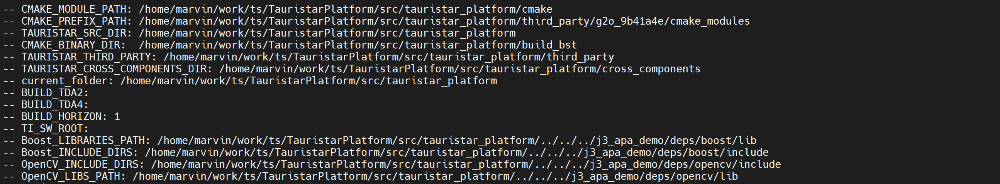


可以看见 opencv、boost、eigen 的位置都在 bst_tools.camke 中重置到

`/home/marvin/work/ts/TauristarPlatform/src/tauristar_platform/../../../j3_apa_demo/deps/eigen3/include/eigen3`


include_directory():

将指定目录添加到编译器的头文件搜索路径之下，指定的目录被解释成当前源码路径的相对路径。添加头文件（.h) 所在目录。


参考：

link: [shell中#*,##*,#*,##*,% *,%% *的含义及用法](https://blog.csdn.net/jiezi2016/article/details/79649382)

link: [[解决]/bin/bash^M: bad interpreter: No such file or directory](https://blog.csdn.net/kwu_ganymede/article/details/54134104)

link: [gcc 编译参数 -fPIC 的详解和一些问题](https://blog.csdn.net/a_ran/article/details/41943749)

link: [cmake交叉编译配置](https://blog.csdn.net/bytxl/article/details/50635788)

link: [Cmake命令之include_directories介绍](https://www.jianshu.com/p/e7de3de1b0fa)


---


## log5: BST docker --device option 尝试 h-d 文件传输

2021年7月9日


命令：从镜像创建并运行容器：

```shell
echo "start running  docker env..."
sudo docker container run -idt \
    --name $sdkdockername-${sdkimgver} \
    --privileged  \
    --cap-add SYS_ADMIN \
    --cap-add NET_ADMIN \
    --device /dev/fuse \
    --security-opt apparmor:unconfined \
    --security-opt seccomp=unconfined  \
    -p 212:22  \
    -v /dev/bus/usb:/dev/bus/usb  \
    ${sdkdockername}:${sdkimgver} \
    bash
```


根据参考link，可能无法实现 host volume 与 docker volume 的映射（map）。

能否在已有的镜像重新映射volume？通过 `docker container start --help`，这种方法不可行。

只能通过 docker cp 进行 host -- docker 文件的传输。


参考：

link: [Docker - a way to give access to a host USB or serial device?](https://stackoverflow.com/questions/24225647/docker-a-way-to-give-access-to-a-host-usb-or-serial-device)


---


## log4: BST docker cmake TSP

2021年7月9日


便捷栏：

```
root@Desay:/disk3/lijinSpace/Docker_BST# docker ps -a
CONTAINER ID        IMAGE                         COMMAND             CREATED             STATUS                    PORTS                 NAMES
964a2931c460        a1000-sdk-local-dev:1.1.0.6   "bash"              2 hours ago         Up 2 hours                0.0.0.0:212->22/tcp   a1000-sdk-local-dev-1.1.0.6
9fadb80add17        16a73ccac178                  "/bin/bash"         2 days ago          Exited (0) 2 days ago                           clever_sinoussi
495e2747bf02        3fc7ae757915                  "/bin/bash"         2 days ago          Exited (127) 2 days ago                         unruffled_jackson
root@Desay:/disk3/lijinSpace/Docker_BST# docker inspect -f '{{.Id}}' 964a2931c460
964a2931c4607d1df0a084fa82948a320bff6e773033ebb8febe9a452b632b4b

```

```
docker ps -a
docker inspect -f '{{.Id}}' 964a2931c460

```

```
关于使用的 docker container：
upper id: 964a2931c460
lower id: 964a2931c4607d1df0a084fa82948a320bff6e773033ebb8febe9a452b632b4b
name: a1000-sdk-local-dev-1.1.0.6
image: a1000-sdk-local-dev:1.1.0.6
```


在服务器中 cmake .. 信息

```
root@Desay:/home/marvin/work/ts/TauristarPlatform/src/tauristar_platform/build_pc_tmp# cmake .. > cmake_server_pc_log.log
CMake Deprecation Warning at third_party/yaml-cpp/CMakeLists.txt:10 (cmake_policy):
  The OLD behavior for policy CMP0012 will be removed from a future version
  of CMake.

  The cmake-policies(7) manual explains that the OLD behaviors of all
  policies are deprecated and that a policy should be set to OLD only under
  specific short-term circumstances.  Projects should be ported to the NEW
  behavior and not rely on setting a policy to OLD.


CMake Deprecation Warning at third_party/yaml-cpp/CMakeLists.txt:14 (cmake_policy):
  The OLD behavior for policy CMP0015 will be removed from a future version
  of CMake.

  The cmake-policies(7) manual explains that the OLD behaviors of all
  policies are deprecated and that a policy should be set to OLD only under
  specific short-term circumstances.  Projects should be ported to the NEW
  behavior and not rely on setting a policy to OLD.


boost: /usr/lib/x86_64-linux-gnu/libboost_serialization.so;/usr/lib/x86_64-linux-gnu/libboost_system.so;/usr/lib/x86_64-linux-gnu/libboost_program_options.so;/usr/lib/x86_64-linux-gnu/libboost_thread.so;-lpthread;/usr/lib/x86_64-linux-gnu/libboost_filesystem.so;/usr/lib/x86_64-linux-gnu/libboost_regex.so;/usr/lib/x86_64-linux-gnu/libboost_chrono.so;/usr/lib/x86_64-linux-gnu/libboost_date_time.so;/usr/lib/x86_64-linux-gnu/libboost_atomic.so
PROJECT_SOURCE_DIR /home/marvin/work/ts/TauristarPlatform/src/tauristar_platform/tauristar_perception/tauristar_avm
PROJECT_SOURCE_DIR /home/marvin/work/ts/TauristarPlatform/src/tauristar_platform/tauristar_perception/tauristar_image_pipeline/ts_vision_opencv/chess_detector
PROJECT_SOURCE_DIR /home/marvin/work/ts/TauristarPlatform/src/tauristar_platform/tauristar_perception/tauristar_image_pipeline/ts_vision_opencv/image_geometry
opencv: opencv_stitching;opencv_photo;opencv_imgcodecs;opencv_flann;opencv_calib3d;opencv_videoio;opencv_highgui;opencv_imgproc;opencv_core;opencv_features2d;opencv_dnn;opencv_video;opencv_superres;opencv_objdetect;opencv_ml;opencv_videostab;opencv_shape
boost: /usr/lib/x86_64-linux-gnu/libboost_serialization.so;/usr/lib/x86_64-linux-gnu/libboost_system.so;/usr/lib/x86_64-linux-gnu/libboost_program_options.so;/usr/lib/x86_64-linux-gnu/libboost_thread.so;-lpthread;/usr/lib/x86_64-linux-gnu/libboost_filesystem.so;/usr/lib/x86_64-linux-gnu/libboost_regex.so;/usr/lib/x86_64-linux-gnu/libboost_chrono.so;/usr/lib/x86_64-linux-gnu/libboost_date_time.so;/usr/lib/x86_64-linux-gnu/libboost_atomic.so
TAURISTAR_BASE_LIBS:  tauristar_flowprocessor;-Wl,--whole-archive;tauristar_operations;-Wl,--no-whole-archive;tauristar_hd_gridmap;grid_map_core;tauristar_gridmap;apa_info_process;fcw;lib_avm_dcal;lib_avm;lib_avm_bvc;lib_avm_calib;lib_avm_algobase;lib_avm_util;motion_planner;tauristar_geometry;mpc_controller_lib;tauristar_procedure;drlib;basic_util;state_machine_lib;simple_path_planner;lanelet2_extension_lib;lanelet2_core;lanelet2_io;lanelet2_projection;lanelet2_routing;lanelet2_traffic_rules;GeographicLib_SHARED;pugixml
Boost libraries:  /usr/lib/x86_64-linux-gnu/libboost_serialization.so;/usr/lib/x86_64-linux-gnu/libboost_system.so;/usr/lib/x86_64-linux-gnu/libboost_program_options.so;/usr/lib/x86_64-linux-gnu/libboost_thread.so;-lpthread;/usr/lib/x86_64-linux-gnu/libboost_filesystem.so;/usr/lib/x86_64-linux-gnu/libboost_regex.so;/usr/lib/x86_64-linux-gnu/libboost_chrono.so;/usr/lib/x86_64-linux-gnu/libboost_date_time.so;/usr/lib/x86_64-linux-gnu/libboost_atomic.so

```

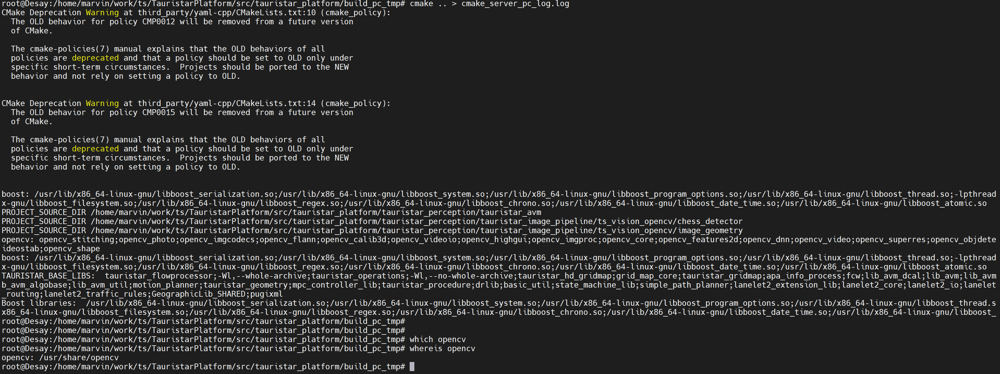


在BST docker 中 cmake ..

```
root@964a2931c460:/home/work/TauristarPlatform/src/tauristar_platform/build_docker_tsp# cmake .. > cmake_docker_pc_log.log
CMake Deprecation Warning at third_party/yaml-cpp/CMakeLists.txt:10 (cmake_policy):
  The OLD behavior for policy CMP0012 will be removed from a future version
  of CMake.

  The cmake-policies(7) manual explains that the OLD behaviors of all
  policies are deprecated and that a policy should be set to OLD only under
  specific short-term circumstances.  Projects should be ported to the NEW
  behavior and not rely on setting a policy to OLD.


CMake Deprecation Warning at third_party/yaml-cpp/CMakeLists.txt:14 (cmake_policy):
  The OLD behavior for policy CMP0015 will be removed from a future version
  of CMake.

  The cmake-policies(7) manual explains that the OLD behaviors of all
  policies are deprecated and that a policy should be set to OLD only under
  specific short-term circumstances.  Projects should be ported to the NEW
  behavior and not rely on setting a policy to OLD.


boost: /opt/bstos/1.1.0.4/sysroots/aarch64-bst-linux/usr/lib64/libboost_serialization-mt.so;/opt/bstos/1.1.0.4/sysroots/aarch64-bst-linux/usr/lib64/libboost_system-mt.so;/opt/bstos/1.1.0.4/sysroots/aarch64-bst-linux/usr/lib64/libboost_program_options-mt.so;/opt/bstos/1.1.0.4/sysroots/aarch64-bst-linux/usr/lib64/libboost_thread-mt.so;-lpthread;/opt/bstos/1.1.0.4/sysroots/aarch64-bst-linux/usr/lib64/libboost_filesystem-mt.so;/opt/bstos/1.1.0.4/sysroots/aarch64-bst-linux/usr/lib64/libboost_regex-mt.so;/opt/bstos/1.1.0.4/sysroots/aarch64-bst-linux/usr/lib64/libboost_chrono-mt.so;/opt/bstos/1.1.0.4/sysroots/aarch64-bst-linux/usr/lib64/libboost_date_time-mt.so;/opt/bstos/1.1.0.4/sysroots/aarch64-bst-linux/usr/lib64/libboost_atomic-mt.so
CMake Error at /opt/bstos/1.1.0.4/sysroots/x86_64-bstsdk-linux/usr/share/cmake-3.14/Modules/FindBoost.cmake:2132 (message):
  Unable to find the requested Boost libraries.

  Boost version: 1.68.0

  Boost include path:
  /opt/bstos/1.1.0.4/sysroots/aarch64-bst-linux/usr/include

  Could not find the following Boost libraries:

          boost_coroutine
          boost_context

  Some (but not all) of the required Boost libraries were found.  You may
  need to install these additional Boost libraries.  Alternatively, set
  BOOST_LIBRARYDIR to the directory containing Boost libraries or BOOST_ROOT
  to the location of Boost.
Call Stack (most recent call first):
  third_party/rosbridgecpp/Simple-WebSocket-Server/CMakeLists.txt:46 (find_package)


PROJECT_SOURCE_DIR /home/work/TauristarPlatform/src/tauristar_platform/tauristar_perception/tauristar_avm
PROJECT_SOURCE_DIR /home/work/TauristarPlatform/src/tauristar_platform/tauristar_perception/tauristar_image_pipeline/ts_vision_opencv/chess_detector
PROJECT_SOURCE_DIR /home/work/TauristarPlatform/src/tauristar_platform/tauristar_perception/tauristar_image_pipeline/ts_vision_opencv/image_geometry
opencv: opencv_calib3d;opencv_core;opencv_features2d;opencv_flann;opencv_highgui;opencv_imgcodecs;opencv_imgproc;opencv_ml;opencv_objdetect;opencv_photo;opencv_shape;opencv_stitching;opencv_superres;opencv_video;opencv_videoio;opencv_videostab
boost: /opt/bstos/1.1.0.4/sysroots/aarch64-bst-linux/usr/lib64/libboost_serialization-mt.so;/opt/bstos/1.1.0.4/sysroots/aarch64-bst-linux/usr/lib64/libboost_system-mt.so;/opt/bstos/1.1.0.4/sysroots/aarch64-bst-linux/usr/lib64/libboost_program_options-mt.so;/opt/bstos/1.1.0.4/sysroots/aarch64-bst-linux/usr/lib64/libboost_thread-mt.so;-lpthread;/opt/bstos/1.1.0.4/sysroots/aarch64-bst-linux/usr/lib64/libboost_filesystem-mt.so;/opt/bstos/1.1.0.4/sysroots/aarch64-bst-linux/usr/lib64/libboost_regex-mt.so;/opt/bstos/1.1.0.4/sysroots/aarch64-bst-linux/usr/lib64/libboost_chrono-mt.so;/opt/bstos/1.1.0.4/sysroots/aarch64-bst-linux/usr/lib64/libboost_date_time-mt.so;/opt/bstos/1.1.0.4/sysroots/aarch64-bst-linux/usr/lib64/libboost_atomic-mt.so
TAURISTAR_BASE_LIBS:  tauristar_flowprocessor;-Wl,--whole-archive;tauristar_operations;-Wl,--no-whole-archive;tauristar_hd_gridmap;grid_map_core;tauristar_gridmap;apa_info_process;fcw;lib_avm_dcal;lib_avm;lib_avm_bvc;lib_avm_calib;lib_avm_algobase;lib_avm_util;motion_planner;tauristar_geometry;mpc_controller_lib;tauristar_procedure;drlib;basic_util;state_machine_lib;simple_path_planner;lanelet2_extension_lib;lanelet2_core;lanelet2_io;lanelet2_projection;lanelet2_routing;lanelet2_traffic_rules;GeographicLib_SHARED;pugixml
Boost libraries:  /opt/bstos/1.1.0.4/sysroots/aarch64-bst-linux/usr/lib64/libboost_serialization-mt.so;/opt/bstos/1.1.0.4/sysroots/aarch64-bst-linux/usr/lib64/libboost_system-mt.so;/opt/bstos/1.1.0.4/sysroots/aarch64-bst-linux/usr/lib64/libboost_program_options-mt.so;/opt/bstos/1.1.0.4/sysroots/aarch64-bst-linux/usr/lib64/libboost_thread-mt.so;-lpthread;/opt/bstos/1.1.0.4/sysroots/aarch64-bst-linux/usr/lib64/libboost_filesystem-mt.so;/opt/bstos/1.1.0.4/sysroots/aarch64-bst-linux/usr/lib64/libboost_regex-mt.so;/opt/bstos/1.1.0.4/sysroots/aarch64-bst-linux/usr/lib64/libboost_chrono-mt.so;/opt/bstos/1.1.0.4/sysroots/aarch64-bst-linux/usr/lib64/libboost_date_time-mt.so;/opt/bstos/1.1.0.4/sysroots/aarch64-bst-linux/usr/lib64/libboost_atomic-mt.so

```

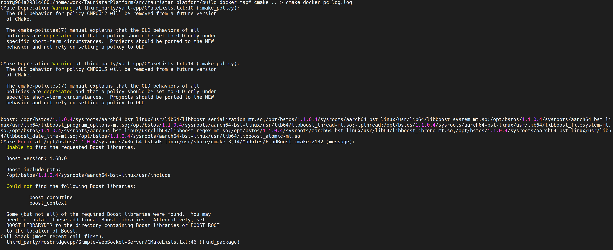

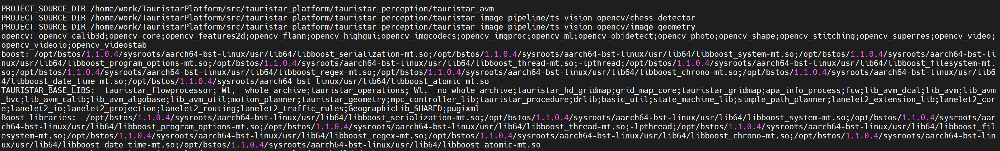


需要结构：TSP Cmakelists.txt


---


## log3: transfer TSP to BST docker /home/work

2021年7月8日


主机 TSP 路径：`/home/marvin/work/ts`

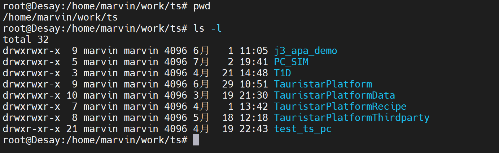


BST docker 路径：`/home/work`

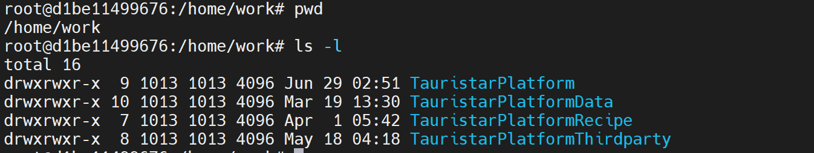


命令，参考 **log2**： 将 server 文件 cp 到 docker

```
$ docker cp -L /home/marvin/work/ts/TauristarPlatform d1be11499676fdc24dbe8bef1142116245b614720d04f4f4b8ac935389aeecae:/home/work

$ docker cp -L /home/marvin/work/ts/TauristarPlatformData d1be11499676fdc24dbe8bef1142116245b614720d04f4f4b8ac935389aeecae:/home/work

$ docker cp -L /home/marvin/work/ts/TauristarPlatformRecipe d1be11499676fdc24dbe8bef1142116245b614720d04f4f4b8ac935389aeecae:/home/work

$ docker cp -L /home/marvin/work/ts/TauristarPlatformThirdparty d1be11499676fdc24dbe8bef1142116245b614720d04f4f4b8ac935389aeecae:/home/work

```


总结：

**anchor_point:** `image_name: a1000-sdk-local-dev:1.1.0.6`

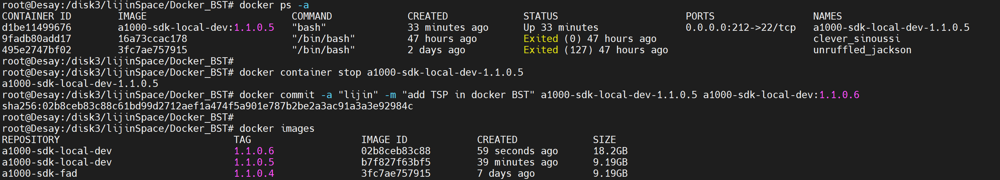

已此 image 为锚点，进行 BST_TSP 融合开发。


---

## log2: Doc. transfer b/w local_machine and docker 

2021年7月8日


步骤：

1. 通过脚本 `run_docker_local_nerd_x.sh`，在保存的镜像上创建并启动一个容器。

   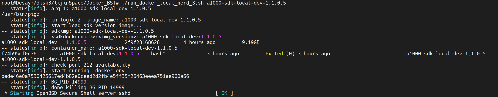

2. 在另外一个 CLI，查看目标容器名，id：`docker ps -a`。--> container_id。

   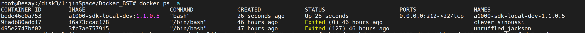

3. 在此 CLI，查看目标容器底层id：`docker inspect 点{{.Id}点 container_id` 。--> container_lower_id。

   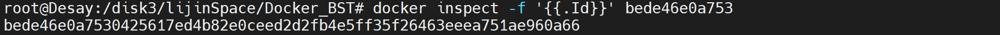

4. 在此 CLI，通过命令：`docker cp 主机文件路径 container_lower_id:docker文件路径 `

   

   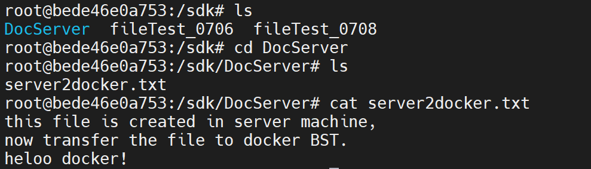


### 参考：

link: [Docker容器和本机之间的文件传输](https://blog.csdn.net/Leafage_M/article/details/72082011?utm_medium=distribute.pc_relevant.none-task-blog-2%7Edefault%7EBlogCommendFromMachineLearnPai2%7Edefault-2.baidujs&depth_1-utm_source=distribute.pc_relevant.none-task-blog-2%7Edefault%7EBlogCommendFromMachineLearnPai2%7Edefault-2.baidujs)


---

## log1: CLI command overview

2021年7月8日


create a new image from current container

```
### docker commit --help

Usage:  docker commit [OPTIONS] CONTAINER [REPOSITORY[:TAG]]

Create a new image from a container's changes

Options:
  -a, --author string    Author (e.g., "John Hannibal Smith <hannibal@a-team.com>")
  -c, --change list      Apply Dockerfile instruction to the created image
  -m, --message string   Commit message
  -p, --pause            Pause container during commit (default true)


$ sudo docker commit  \
	-a "author" \					# author
	-m "add new filetest" \			# message
	e31b46716cb6 \					# containerID or name
	a1000-sdk:${version}			# 新建镜像名, [repository:tag]
```

注：如果新建镜像名 [repository:tag] 等于已有镜像名称，则会覆盖，此后用 `run_docker.sh` 启动 BST 会在此 镜像上再次创建一个container


总结：BST 的使用流程：

1. 使用 `run_docker_local_nerd_x.sh` 在镜像上创建容器，并启动。
2. 操作容器。
3. 退出容器（是否需要停止容器后台运行）。需要。
4. 使用 `docker commit` 提交当前容器至新镜像，如果镜像名存在，则覆盖。


注1：

1. 对于3：最好先停止后台运行的容器，

   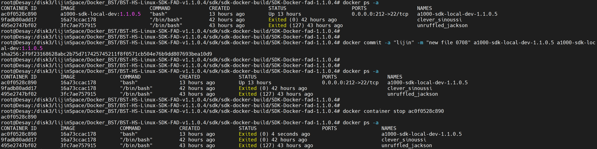

   可以看到在不停止容器的情况下创建新的镜像，在创建镜像之后，后台运行的容器的镜像名称会改变。

2. `docker commit` 参数格式：注意是`-`而不是`:`

   `./run_docker_local_nerd_3.sh a1000-sdk-local-dev-1.1.0.5`


注2：使用 `run_docker_local_nerd_x.sh` 创建并启动容器，在对容器做出修改后，必须要将修改过的容器进行镜像化，不然在下一次使用此启动脚本后，上一个被修改的容器会被删除。所有修改都会丢失！！！


---

## log 0: create ground zero image for local development

```
root@Desay:/disk3/lijinSpace/Docker_BST# sudo docker commit -a "lijin" -m "add new filetest, init local dev" 0267e9a9b6cd a1000-sdk-local:1.1.0.5

```


以后此 image 为 local dev 的启动 image。


更新操作：

当前image + container。


使用 ./run_docker.sh，启动 container (id: 6ff5ef682771, image: a1000-sdk-fad:1.1.0.4, id: 3fc7ae757915)


排解问题，manual 指令 commit --> run_docker.sh没有办法从保存的 image 中启动 container，即没有办法保存数据。通过 run_docker.sh 查找原因。


```sh
#!/bin/bash
#******************************************************
#start single send...
function dots(){
seconds=${1:-5} 		# print a dot every 5 seconds by default, ${var:-word}，变量替换
while true				# 如果变量 var 为空或已被删除(unset)，那么返回 word，但不改变 var 的值
do
    sleep $seconds
    echo -n '.'
done
}

def_start_point(){

dots 10 &							# & bash命令的行尾, 该命令转到后台执行				
BG_PID=$!							# $! &分支出去的sub-shell的PID被存储在一个特殊的变量$!中
}

#trap "kill -9 $BG_PID" INT

def_kill(){
    disown $BG_PID
    kill -9 $BG_PID > /dev/null 2>&1	# 标准错误输出重定向等同于标准输出，直接搜 2>&1
}
#******************************************************

# start do real job
# judge precondition

if [ ! -n "${1}" ];then				# -n，检测字符串长度是否为0，不为0返回 true，${1} first arg
	ARCH="a1000"
else
	ARCH="$1"						# 变量名外面的花括号{ }是可选的，加不加都行
fi

which pigz
if [ $? != 0 ];then					# $? 上个命令的退出状态，或函数的返回值，成功 0 失败 1
    echo "first install pigz"
    def_kill
    exit 1
fi

def_start_point
if [ -f ./${ARCH}-sdk*.tar ];then	# [ -f $file ] 返回 true，检测文件是否是普通文件（既不是目	
    echo "unpack sdk docker"		# 录，也不是设备文件），如果是，则返回 true
    
elif [ -f ./*.tgz ];then
    echo "unpack sdk docker img"
    fileimg=`ls *.tgz`
    tar --use-compress-program=pigz -xvpf $fileimg
    rm ${fileimg}
else
    echo "no such file sdk docker img"
    def_kill
    exit 1
fi
def_kill

# docker load img 
echo "start load sdk version image..."
sdkimg=`ls ${ARCH}-sdk*`
if [ $? == 0 ];then
    filever=`echo $sdkimg|awk -F "-" '{print $NF}'`  # AWK 是一种处理文本文件的语言, 
    sdkimgver=`echo $filever|awk -F ".tar" '{print $1}'`  # F fs or --field-separator fs
    sdkname_tmp=`echo $sdkimg|awk -F "-" '{print $3}'`  # 指定输入文件折分隔符，fs是一个字符串
    sdkdockername="${ARCH}-sdk-${sdkname_tmp}"  # 或者是一个正则表达式
    echo "current version: $sdkimgver"  # $NF 表示的最后一个Field（列）
   
    sudo docker images $sdkdockername:${sdkimgver}| grep $sdkdockername
    if [ $? -ne 0 ] ;then	# -ne 检测两个数是否相等，不相等返回 true，[ $a -ne $b ] 返回 true
        sudo docker load -i $sdkimg
        if [ $? -ne 0 ];then
            echo "-- status[error]: sdk docker img load fail"
	    def_kill
            exit 1
        fi
    #else
        #echo -e "\033[31m ERROR: Can not find docker image ${ARCH}-sdk, please build it before run. \033[0m"
        #exit 1
    fi

else
    echo "not found sdk img"
    def_kill
    exit 1
fi

# docker -v mount dir 
#cd ~
#home_path=$(pwd)
#MAP_DIR="${home_path}/sdk_vol_dir"

#if [ ! -d $MAP_DIR ];then
#	echo "Create $MAP_DIR"
#	mkdir -p $MAP_DIR
#fi


# judge docker container exist
sudo docker ps  -a|grep $sdkdockername-${sdkimgver}
if [ $? == 0 ];then
    sudo docker rm -f $sdkdockername-${sdkimgver}
fi


#检测预设ssh端口212 vnc 5900 是否被占用
sudo netstat -anp |grep 212 |grep docker-proxy |grep LISTEN
if [ $? == 0 ];then
    echo "ssh port 212 被占用...exiting"
    def_kill
    exit 1
fi

#**************
# stop single send and kill process
#disown $BG_PID
#kill -9 $BG_PID 
#**************

def_start_point
echo "start running  docker env..."
sudo docker container run -idt \
    --name $sdkdockername-${sdkimgver} \
    --privileged  \
    --cap-add SYS_ADMIN \
    --cap-add NET_ADMIN \
    --device /dev/fuse \
    --security-opt apparmor:unconfined \
    --security-opt seccomp=unconfined  \
    -p 212:22  \
    -v /dev/bus/usb:/dev/bus/usb  \
    $sdkdockername:${sdkimgver} \
    bash

def_kill

sleep 5s
# docker login
sudo docker exec -it $sdkdockername-${sdkimgver} /bin/bash
if [ $? == 1 ];then
    echo "run docker fail,check env!"
    exit 1
fi

#echo "end..."

```


解构 shell：

```sh
#**************
# stop single send and kill process
#disown $BG_PID
#kill -9 $BG_PID 
#**************

def_start_point
echo "start running  docker env..."
sudo docker container run -idt \			# interactive, detach, tty (background)
    --name $sdkdockername-${sdkimgver} \	# assign a name to cntainer
    --privileged  \							# Give privileges to this container
    --cap-add SYS_ADMIN \					# Add Linux capabilities
    --cap-add NET_ADMIN \					# Add Linux capabilities
    --device /dev/fuse \					# add a host device to container
    --security-opt apparmor:unconfined \	# security options
    --security-opt seccomp=unconfined  \	# security options
    -p 212:22  \							# publish container's port to host
    -v /dev/bus/usb:/dev/bus/usb  \			# bind mount a volume
    $sdkdockername:${sdkimgver} \			# image:tag
    bash									# arg. 

def_kill

sleep 5s
# docker login
sudo docker exec -it $sdkdockername-${sdkimgver} /bin/bash
if [ $? == 1 ];then
    echo "run docker fail,check env!"
    exit 1
fi

#echo "end..."
```


```

```


stable version of run_docker_local_nerd.sh

```shell
#!/bin/bash
#*******************************************************************************
# start single send...
function dots() {
  seconds=${1:-5} # print a dot every 5 seconds by default
  while true; do
    sleep $seconds
    echo -n '.'
  done
}

def_start_point() {
  dots 10 &
  BG_PID=$!
}

def_kill() {
  disown $BG_PID
  echo "-- status[info]: BG_PID ${BG_PID}"
  kill -9 $BG_PID >/dev/null 2>&1
  echo "-- status[info]: done killing BG_PID ${BG_PID}"
}
#*******************************************************************************

# check CLI args
if [ ! -n "${1}" ]; then # if arg=null
  # do logic 1
  ARCH="a1000"
else # if arg!=null
  # do logic 2
  ARCH="$1"
  IMG_ARG="${1}"
fi
echo "-- status[info]: arg_1: ${1}"

# check pigz, 3rd party
which pigz
if [ $? != 0 ]; then
  echo "-- status[error]: first install pigz"
  def_kill
  exit 1
fi

#*******************************************************************************
# main logic area
#*******************************************************************************

if [ ${ARCH} = "a1000" ]; then  # logic 1: unpack docker img, if ARCH="a1000", load image from file name
  echo "-- status[info]: in logic 1: a1000"
  # unpack .tgz
  def_start_point
  if [ -f ./${ARCH}-sdk*.tar ]; then
    echo "-- status[info]: unpack sdk ${ARCH}-sdk*.tar docker"
  elif [ -f ./*.tgz ]; then
    echo "-- status[info]: unpack sdk ${ARCH}-sdk*.tgz docker img"
    fileimg=$(ls *.tgz)
    tar --use-compress-program=pigz -xvpf $fileimg
    rm ${fileimg}
  else
    echo "-- status[warn]: sdk img ${ARCH}-sdk*.tgz not exist, continue"
    def_kill # exit dot process
    exit 1   # quit if .tgz not exists
  fi
  def_kill # exit dot process
  # docker: load img from current directory img.tar
  echo "-- status[info]: start load sdk version image..."
  sdkimg=$(ls ${ARCH}-sdk*)
  echo "-- status[info]: sdkimg: ${sdkimg}"
  if [ $? == 0 ]; then # . 有 .tar 文件，使用 文件名作为 image 名
    filever=$(echo $sdkimg | awk -F "-" '{print $NF}')
    sdkimgver=$(echo $filever | awk -F ".tar" '{print $1}')
    sdkname_tmp=$(echo $sdkimg | awk -F "-" '{print $3}')
    sdkdockername="${ARCH}-sdk-${sdkname_tmp}"
    echo "-- status[info]: <sdkdockername>:<sdkimgver>: ${sdkdockername}:${sdkimgver}"
    # docker: load image from .tar or stdin for docker
    sudo docker images ${sdkdockername}:${sdkimgver} | grep ${sdkdockername}  # list images
    if [ $? -ne 0 ]; then  # 0: success, if list image fails, load from .tar archive
      sudo docker load -i $sdkimg # Load an image from a tar archive, -i Read from tar archive file
      if [ $? -ne 0 ]; then
        echo "-- status[error]: sdk docker img load from .tar fail"
        def_kill
        exit 1
      else
        echo -e "-- status[error]: \033[31m Cannot find docker image ${ARCH}-sdk, please build it before run. \033[0m"
        exit 1
      fi
    fi  # we can add an else here for loading from STDIN !!! will tmp to put this logic elsewhere
  fi
  # docker: judge docker container for target image exist, if exist, then delete it. always create fresh container
  echo "-- status[info]: container_name: ${sdkdockername}-${sdkimgver}"
  sudo docker ps -a | grep ${sdkdockername}-${sdkimgver}
  if [ $? == 0 ]; then
    sudo docker rm -f ${sdkdockername}-${sdkimgver} # delect last container created from image
  fi
  # docker: 检测预设ssh端口212 vnc 5900 是否被占用
  echo "-- status[info]: check port 212 availability"
  sudo netstat -anp | grep 212 | grep docker-proxy | grep LISTEN
  if [ $? == 0 ]; then
    echo "-- status[error]: ssh port 212 被占用...exiting"
    def_kill
    exit 1
  fi
  # docker: create a new container from target image
  def_start_point
  echo "-- status[info]: start running  docker env..."
  sudo docker container run -idt \
              --name ${sdkdockername}-${sdkimgver} \
              --privileged \
              --cap-add SYS_ADMIN \
              --cap-add NET_ADMIN \
              --device /dev/fuse \
              --security-opt apparmor:unconfined \
              --security-opt seccomp=unconfined \
              -p 212:22 \
              -v /dev/bus/usb:/dev/bus/usb \
              ${sdkdockername}:${sdkimgver} \
              bash
  def_kill
  # docker: new background container login
  sleep 5s
  sudo docker exec -it ${sdkdockername}-${sdkimgver} /bin/bash
  if [ $? == 1 ]; then  # if login failed
    echo "-- status[error]: run docker fail,check env!"
    exit 1
  fi
else # logic 2: load image from CLI arg_1
  echo "-- status[info]: in logic 2: image_name: ${IMG_ARG}"
  # docker: load img from CLI IMG_ARG
  echo "-- status[info]: start load sdk version image..."
  sdkimg=${IMG_ARG}
  echo "-- status[info]: sdkimg: ${sdkimg}"
  if [ $? == 0 ]; then # . 有 IMG_ARG 输入，使用 文件名作为 image 名
    img_version=$(echo ${sdkimg} | awk -F "-" '{print $NF}')
    sdkdockername="a1000-sdk-local-dev"
    echo "-- status[info]: <sdkdockername>:<img_version>: ${sdkdockername}:${img_version}"
    # docker: load image from stdin for docker
    sudo docker images ${sdkdockername}:${img_version} | grep ${sdkdockername}  # list images
    if [ $? -ne 0 ]; then  # 0: success, 1: failed, if list image fails, load from .tar archive
      echo "-- status[error]: input image name not exists, exiting..."
      exit 1
    fi
  fi
  # docker: judge docker container for target image exist, if exist, then delete it. always create fresh container
  echo "-- status[info]: container_name: ${sdkdockername}-${img_version}"  # c: {c-name}-{v}, i:{i-name}:{v}
  sudo docker ps -a | grep ${sdkdockername}-${img_version}
  if [ $? == 0 ]; then
    sudo docker rm -f ${sdkdockername}-${img_version}  # delect last container created from image {c-name}-{version}
  fi
  # docker: 检测预设ssh端口212 vnc 5900 是否被占用
  echo "-- status[info]: check port 212 availability"
  sudo netstat -anp | grep 212 | grep docker-proxy | grep LISTEN
  if [ $? == 0 ]; then
    echo "-- status[error]: ssh port 212 被占用...exiting"
    def_kill
    exit 1
  fi
  # docker: create a new container from target image
  def_start_point
  echo "-- status[info]: start running  docker env..."
  sudo docker container run -idt \
              --name ${sdkdockername}-${img_version} \
              --privileged \
              --cap-add SYS_ADMIN \
              --cap-add NET_ADMIN \
              --device /dev/fuse \
              --security-opt apparmor:unconfined \
              --security-opt seccomp=unconfined \
              -p 212:22 \
              -v /dev/bus/usb:/dev/bus/usb \
              ${sdkdockername}:${img_version} \
              bash
  def_kill
  # docker: new background container login
  sleep 5s
  sudo docker exec -it ${sdkdockername}-${img_version} /bin/bash
  if [ $? == 1 ]; then  # if login failed
    echo "-- status[error]: run docker fail,check env!"
    exit 1
  fi
fi
echo "-- status[info]: shell ends..."


```

