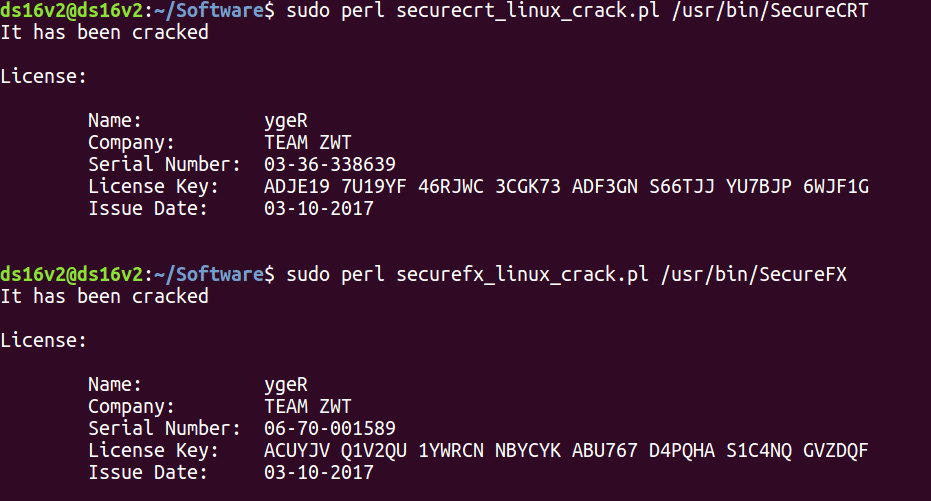
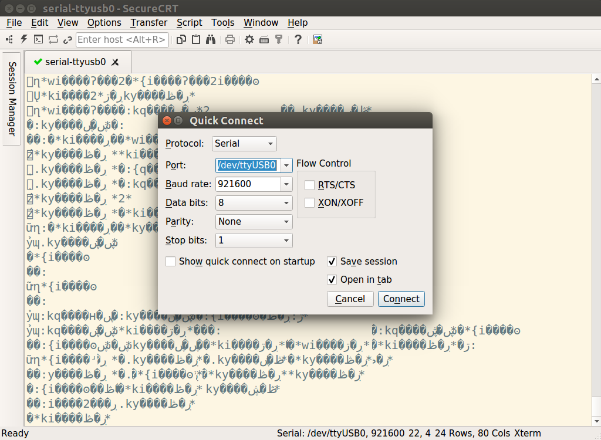

# log: 在 linux 上配置 secureCRT and secureFX

[toc]


---

## 1. 概念

**secureCRT**: SecureCRT是一款支持[SSH](https://baike.baidu.com/item/SSH)（SSH1和SSH2）的[终端仿真](https://baike.baidu.com/item/终端仿真/3441931)程序，简单地说是Windows下登录UNIX或Linux服务器主机的软件。

**secureFX**: SecureFX是一款由VanDyke Software, Inc.（中文译为：范戴克软件公司）研发生产的支持普通[FTP](https://baike.baidu.com/item/FTP/13839)标准和安全[数据传输标准](https://baike.baidu.com/item/数据传输标准/15711323)（SFTP 或者 在SSH2 上的FTP）的FTP客户端软件，有着易用的、类似于[资源管理器](https://baike.baidu.com/item/资源管理器/1951545)的[用户界面](https://baike.baidu.com/item/用户界面/6582461)。


---

## 2. ubuntu 16.04 下安装 secureCRT & secureFX

### 安装步骤

参考`link 1`进行安装，安装这两个文件，我们用的是组合包`scrt-sfx-8.3.4-1699.ubuntu16-64.x86_64.deb`，并下载破解脚本。必要操作：

```
$ sudo dpkg -i scrt-sfx-8.3.4-1699.ubuntu16-64.x86_64.deb 

===========================================================================

$ sudo apt-get install openssh-server

===========================================================================

$ sudo perl securecrt_linux_crack.pl /usr/bin/SecureCRT 
It has been cracked

License:

	Name:		ygeR
	Company:	TEAM ZWT
	Serial Number:	03-36-338639
	License Key:	ADJE19 7U19YF 46RJWC 3CGK73 ADF3GN S66TJJ YU7BJP 6WJF1G
	Issue Date:	03-10-2017

===========================================================================

$ sudo perl securefx_linux_crack.pl /usr/bin/SecureFX 
It has been cracked

License:

	Name:		ygeR
	Company:	TEAM ZWT
	Serial Number:	06-70-001589
	License Key:	ACUYJV Q1V2QU 1YWRCN NBYCYK ABU767 D4PQHA S1C4NQ GVZDQF
	Issue Date:	03-10-2017

```


通过命令行或图标打开 **secureCRT** 或 **secureFX**，需要输入 License 信息，可以选择赋值也可以选择手动输入。



运行界面：



点击闪电图标，按照截图方式配置，端口会自动弹出`/dev/ttyUSB0`。成功连接后会在主窗口中显示输出。

关于在linux下查看通信端口命令：

```
$ ls -l /dev/ttyUSB*
crw-rw-rw- 1 root dialout 188, 0 7月  13 17:53 /dev/ttyUSB0
```


### 问题 1：Unable to open serial port /dev/ttyUSB0

> ubuntu12.04使用USB转串口时出现权限不够问题，如下
>
> Unable to open serial port /dev/ttyUSB0
>
> 权限不够
>
> 解决办法：
>
> 通过增加udev规则来实现。步骤如下：
> 创建文件/etc/udev/rules.d/70-ttyusb.rules
> 在文件内增加一行
> KERNEL=="ttyUSB[0-9]*", MODE="0666"
> 重新插入USB转串口设备，普通用户就有权限访问了。

 

### 参考

link 1: [Ubuntu16.04下安装破解secureCRT和secureFX的操作记录](https://www.cnblogs.com/kevingrace/p/9353963.html)

link 2: [Unable to open serial port /dev/ttyUSB0](https://blog.csdn.net/qq_19175749/article/details/52699697?utm_medium=distribute.pc_relevant.none-task-blog-2%7Edefault%7EBlogCommendFromMachineLearnPai2%7Edefault-3.control&depth_1-utm_source=distribute.pc_relevant.none-task-blog-2%7Edefault%7EBlogCommendFromMachineLearnPai2%7Edefault-3.control)

link 3: []()

link 4: []()