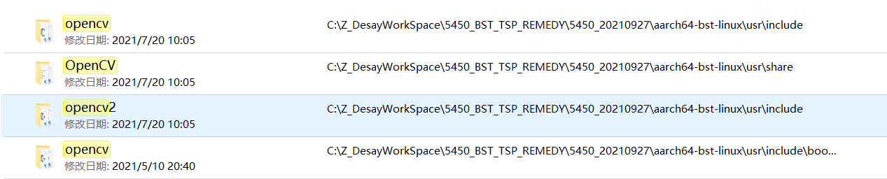
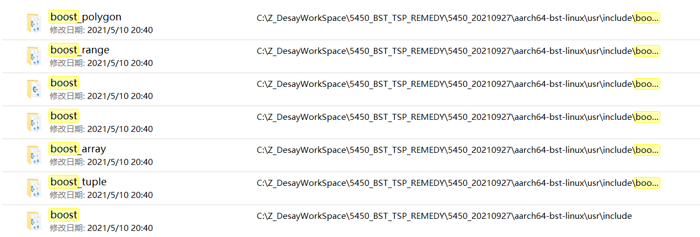
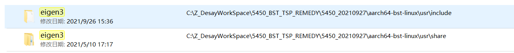
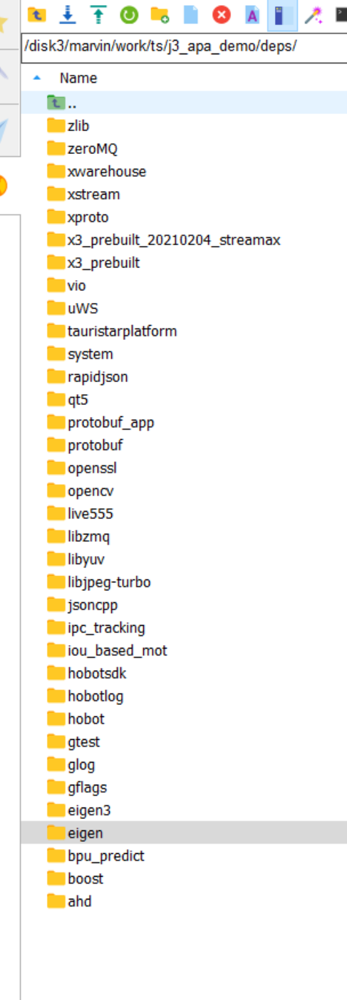

# BST_DOCKER: 2021年9月26日

[toc]


---

需要 启动 docker container

需要将 TSP 全家桶 拷贝到 container 下


---

## 1. docker 操作命令：

```
docker images

docker container ls -a

docker ps -a

docker start --help

docker start <container_id> -i

exit  # 退出并停止当前的 docker container.

docker commit \
	-a "lijin" \
	-m "#5450: 0926: create TSP workspace" \
	127695fedbec \								# <container_id>			
	a1000-sdk-fad:1.1.2.2  						# [repository:${tag}]
	

# Docker容器向宿主机传送文件
docker cp container_id:<docker容器内的路径> <本地保存文件的路径>

docker cp 10704c9eb7bb:/root/test.text /home/vagrant/test.txt

# 宿主机向Docker容器传送文件
docker cp 本地文件的路径 container_id:<docker容器内的路径>

docker cp  /home/vagrant/test.txt 10704c9eb7bb:/root/test.text
```


注01：每天结束，如果 container 有重要更新，需要基于此 container 创建一个新的 image，第二天需要在此 image 上重新创建一个 container。

注02：[Docker--从入门到实践](https://yeasy.gitbook.io/docker_practice/) 中建议用 dockerfile 代替 docker commit，但是操作有些复杂，先跳过（先使用 docker commit 用作备份）。


docker 内部操作命令：

```
# docker 中安装 package
apt install vim
apt install tree

# 查看 linux 下文件大小
du -sh *  # * --> 可以换成具体文件
```


---

## 2. 操作，将 TSP 全家桶移植到 docker 中（todo）：

在 `192.168.2.32` TSP 中，选定 TSP 全家桶：

* **TauristarPlatform**
  * commit: ad9ffdbff2a59fbde45ea7279369928771fbf24e
*  **TauristarPlatformData**
  * commit: d431876880b146d30345ae288708471de4c45c7a
* **TauristarPlatformRecipe**
  * commit: dee0d4159ca6a5297c10354ef38cd63916a70880
*  **TauristarPlatformThirdparty**
  * commit: 859201843e0ca6c56538bd2a96299d0d01bd74a5


以及完成 `cross_make.sh` + `x3_cross_make.sh` 的编译（successful）。


```
 TauristarPlatform
 TauristarPlatformData
 TauristarPlatformRecipe
 TauristarPlatformThirdparty
 TSP 编译器
```


使用：`du -sh *` 查看当前目录下所有文件的大小。

```
root@Desay:/home/marvin/work_ts/ts# du -sh *
1.8G    j3_apa_demo
412M    PC_SIM
4.1M    T1D
1.1G    TauristarPlatform
797M    TauristarPlatformData
1.6G    TauristarPlatformRecipe
6.0G    TauristarPlatformThirdparty
3.8G    test_ts_pc
```


---


## 3. 在 sever 或 虚拟机 中编译 cross_make（todo）


需要参考：

​	1：cross_make.sh + vsdk.cmake，

​	2：x3_cross_make.sh + aiexpress.cmake，

编写 

​	3：bst_cross_make.sh + bst_tools.cmake。


操作01：确定编译器路径（gcc，g++）

```
=+=+=+=+=+=+=+=+=+=+=+=+ tda2: gcc, g++ path，查看: vsdk.cmake

gcc:
${A15_TOOLCHAIN_PREFIX}gcc
${CODEGEN_PATH_A15}/bin/arm-linux-gnueabihf-gcc
${TI_SW_ROOT}/os_tools/linux/linaro/gcc-linaro-5.3-2016.02-x86_64_arm-linux-gnueabihf/bin/arm-linux-gnueabihf-gcc
${HOME}/PROCESSOR_SDK_VISION_03_05_00_00/ti_components/os_tools/linux/linaro/gcc-linaro-5.3-2016.02-x86_64_arm-linux-gnueabihf/bin/arm-linux-gnueabihf-gcc

完整路径：
/home/marvin/PROCESSOR_SDK_VISION_03_05_00_00/ti_components/os_tools/linux/linaro/gcc-linaro-5.3-2016.02-x86_64_arm-linux-gnueabihf/bin/arm-linux-gnueabihf-gcc

g++:
${A15_TOOLCHAIN_PREFIX}g++
${CODEGEN_PATH_A15}/bin/arm-linux-gnueabihf-g++
${TI_SW_ROOT}/os_tools/linux/linaro/gcc-linaro-5.3-2016.02-x86_64_arm-linux-gnueabihf/bin/arm-linux-gnueabihf-g++
${HOME}/PROCESSOR_SDK_VISION_03_05_00_00/ti_components/os_tools/linux/linaro/gcc-linaro-5.3-2016.02-x86_64_arm-linux-gnueabihf/bin/arm-linux-gnueabihf-g++

完整路径：
/home/marvin/PROCESSOR_SDK_VISION_03_05_00_00/ti_components/os_tools/linux/linaro/gcc-linaro-5.3-2016.02-x86_64_arm-linux-gnueabihf/bin/arm-linux-gnueabihf-g++


=+=+=+=+=+=+=+=+=+=+=+=+ j3: gcc, g++, 查看: aiexpress.cmake

gcc: 完整路径:
/opt/gcc-linaro-6.5.0-2018.12-x86_64_aarch64-linux-gnu/bin/aarch64-linux-gnu-gcc

g++: 完整路径:
/opt/gcc-linaro-6.5.0-2018.12-x86_64_aarch64-linux-gnu/bin/aarch64-linux-gnu-g++


=+=+=+=+=+=+=+=+=+=+=+=+ bst: gcc, g++, 查看: bst_tools.cmake

root@127695fedbec:/home/work/TauristarPlatform/src/tauristar_platform# which aarch64-bst-linux-gcc
完整路径:
/opt/bstos/1.1.2.1/sysroots/x86_64-bstsdk-linux/usr/bin/aarch64-bst-linux/aarch64-bst-linux-gcc

root@127695fedbec:/home/work/TauristarPlatform/src/tauristar_platform# which aarch64-bst-linux-g++
完整路径:
/opt/bstos/1.1.2.1/sysroots/x86_64-bstsdk-linux/usr/bin/aarch64-bst-linux/aarch64-bst-linux-g++
```


操作02：确定 Deps 的版本+路径：

需要修改 `tauristar_platform/CMakeLists.txt` 文件，参考 tda2 与 j3。

```
=+=+=+=+=+=+=+=+=+=+=+=+ tda2: cross_make.sh
cmake -DCMAKE_TOOLCHAIN_FILE=../vsdk.cmake -Dcross_make=ON -DCMAKE_BUILD_TYPE=${BUILD_TYPE}


=+=+=+=+=+=+=+=+=+=+=+=+ j3: x3_cross_make.sh
cmake -DCMAKE_TOOLCHAIN_FILE=../aiexpress.cmake -Dcross_make=ON -DCMAKE_BUILD_TYPE=${BUILD_TYPE} -DBUILD_HORIZON=1 ..


=+=+=+=+=+=+=+=+=+=+=+=+ bst: bst_cross_make.sh 模板。
cmake -DCMAKE_TOOLCHAIN_FILE=../aiexpress.cmake -Dcross_make=ON -DCMAKE_BUILD_TYPE=${BUILD_TYPE} -DBUILD_BST=1 ..

```


解构 CMakeLists.txt：

标记：`CROSS MARK | HORIZON MARK |`

```
root@Desay:/home/marvin/work_ts/ts/TauristarPlatform/src/tauristar_platform# ./x3_cross_make.sh > x3_cross_make.log
CMake Warning (dev) at CMakeLists.txt:2 (project):
  Policy CMP0048 is not set: project() command manages VERSION variables.
  Run "cmake --help-policy CMP0048" for policy details.  Use the cmake_policy
  command to set the policy and suppress this warning.

  The following variable(s) would be set to empty:

    CMAKE_PROJECT_VERSION
    CMAKE_PROJECT_VERSION_MAJOR
    CMAKE_PROJECT_VERSION_MINOR
    CMAKE_PROJECT_VERSION_PATCH
This warning is for project developers.  Use -Wno-dev to suppress it.

CMake Warning at CMakeLists.txt:94 (message):
  --> CROSS MARK 01


CMake Warning at CMakeLists.txt:97 (message):
  --> HORIZON MARK 01


CMake Warning at CMakeLists.txt:104 (message):
  --> HORIZON MARK 02


CMake Warning at CMakeLists.txt:195 (message):
  --> HORIZON MARK 03


CMake Warning at CMakeLists.txt:226 (message):
  --> HORIZON MARK 04


CMake Warning at CMakeLists.txt:268 (message):
  --> HORIZON MARK 05


CMake Warning at CMakeLists.txt:405 (message):
  --> CROSS MARK 03


CMake Warning at CMakeLists.txt:448 (message):
  --> CROSS MARK 04


CMake Warning at CMakeLists.txt:450 (message):
  --> HORIZON MARK 09


CMake Deprecation Warning at third_party/yaml-cpp/CMakeLists.txt:10 (cmake_policy):
  The OLD behavior for policy CMP0012 will be removed from a future version
  of CMake.

  The cmake-policies(7) manual explains that the OLD behaviors of all
  policies are deprecated and that a policy should be set to OLD only under
  specific short-term circumstances.  Projects should be ported to the NEW
  behavior and not rely on setting a policy to OLD.


CMake Deprecation Warning at third_party/yaml-cpp/CMakeLists.txt:14 (cmake_policy):
  The OLD behavior for policy CMP0015 will be removed from a future version
  of CMake.

  The cmake-policies(7) manual explains that the OLD behaviors of all
  policies are deprecated and that a policy should be set to OLD only under
  specific short-term circumstances.  Projects should be ported to the NEW
  behavior and not rely on setting a policy to OLD.


PROJECT_SOURCE_DIR /home/marvin/work_ts/ts/TauristarPlatform/src/tauristar_platform/tauristar_perception/tauristar_avm
PROJECT_SOURCE_DIR /home/marvin/work_ts/ts/TauristarPlatform/src/tauristar_platform/tauristar_perception/tauristar_image_pipeline/ts_vision_opencv/chess_detector
PROJECT_SOURCE_DIR /home/marvin/work_ts/ts/TauristarPlatform/src/tauristar_platform/tauristar_perception/tauristar_image_pipeline/ts_vision_opencv/image_geometry
opencv: -lopencv_world
boost: -lboost_serialization;-lboost_system;-lboost_program_options;-lboost_thread;-lboost_filesystem;-lboost_regex;-lboost_date_time
TAURISTAR_BASE_LIBS:  tauristar_flowprocessor;-Wl,--whole-archive;tauristar_operations;-Wl,--no-whole-archive;tauristar_hd_gridmap;grid_map_core;tauristar_gridmap;apa_info_process;fcw;lib_avm_dcal;lib_avm;lib_avm_bvc;lib_avm_calib;lib_avm_algobase;lib_avm_util;motion_planner;tauristar_geometry;mpc_controller_lib;tauristar_procedure;drlib;basic_util;state_machine_lib;simple_path_planner;lanelet2_extension_lib;lanelet2_core;lanelet2_io;lanelet2_projection;lanelet2_routing;lanelet2_traffic_rules;GeographicLib_SHARED;pugixml
Boost libraries:  -lboost_serialization;-lboost_system;-lboost_program_options;-lboost_thread;-lboost_filesystem;-lboost_regex;-lboost_date_time
CMake Warning at CMakeLists.txt:952 (message):
  --> CROSS MARK 05


CMake Warning:
  Manually-specified variables were not used by the project:

    CMAKE_TOOLCHAIN_FILE

```


---


## 4. 在 local 编译 `x3_cross_make.sh`(bst 版本)

了解 CMakeLists.txt 中 不同平台的编译框架（tda2x，tda4x，x3/j3<horizon>）。参考 cross_make + build_horizon 框架，编写 cross_make + build_bst。


框架 CMakeLists.txt：(fixed)

```cmake
cmake_minimum_required(VERSION 2.8.3)
project(tauristar_platform)

execute_process(
        COMMAND git rev-parse --abbrev-ref HEAD
        WORKING_DIRECTORY ${PROJECT_SOURCE_DIR}
        OUTPUT_VARIABLE TS_GIT_BRANCH
        OUTPUT_STRIP_TRAILING_WHITESPACE
)

execute_process(
        COMMAND git log -1 --format=%h
        WORKING_DIRECTORY ${PROJECT_SOURCE_DIR}
        OUTPUT_VARIABLE TS_GIT_COMMIT_HASH
        OUTPUT_STRIP_TRAILING_WHITESPACE
)

execute_process(
        COMMAND git ls-files -m
        WORKING_DIRECTORY ${PROJECT_SOURCE_DIR}
        OUTPUT_VARIABLE TS_GIT_UNCOMMITTED_LIST
        OUTPUT_STRIP_TRAILING_WHITESPACE
)

string(REGEX REPLACE "\n" " + " TS_GIT_UNCOMMITTED_LIST "${TS_GIT_UNCOMMITTED_LIST}")

add_compile_options(-std=c++11)
add_compile_options(-fext-numeric-literals)
# see https://gcc.gnu.org/onlinedocs/libstdc++/manual/using_dual_abi.html
#add_compile_options(-D__GLIBCXX_USE_CXX11_ABI=0)

list(APPEND CMAKE_MODULE_PATH ${PROJECT_SOURCE_DIR}/cmake)
#list(APPEND CMAKE_PREFIX_PATH ${PROJECT_SOURCE_DIR}/third_party)
list(APPEND CMAKE_PREFIX_PATH ${PROJECT_SOURCE_DIR}/third_party/g2o_9b41a4e/cmake_modules)

MESSAGE(STATUS "CMAKE_MODULE_PATH: ${CMAKE_MODULE_PATH}")
MESSAGE(STATUS "CMAKE_PREFIX_PATH: ${CMAKE_PREFIX_PATH}")


set(TAURISTAR_SRC_DIR ${CMAKE_CURRENT_SOURCE_DIR})
set(TAURISTAR_THIRD_PARTY ${PROJECT_SOURCE_DIR}/third_party)
SET(TAURISTAR_CORSS_COMPONENTS_DIR ${TAURISTAR_SRC_DIR}/cross_components)

SET(EXECUTABLE_OUTPUT_PATH ${CMAKE_BINARY_DIR}/bin)
SET(LIBRARY_OUTPUT_PATH ${CMAKE_BINARY_DIR}/lib)
SET(INCLUDE_OUTPUT_PATH ${CMAKE_BINARY_DIR}/include)

MESSAGE(STATUS "TAURISTAR_SRC_DIR: ${TAURISTAR_SRC_DIR}")
MESSAGE(STATUS "CMAKE_BINARY_DIR:  ${CMAKE_BINARY_DIR}")
MESSAGE(STATUS "TAURISTAR_THIRD_PARTY: ${TAURISTAR_THIRD_PARTY}")
MESSAGE(STATUS "TAURISTAR_CROSS_COMPONENTS_DIR: ${TAURISTAR_CORSS_COMPONENTS_DIR}")

# add_definitions(-DDEBUG)

include_directories(${INCLUDE_OUTPUT_PATH})

####################################
# Cmake options
####################################
OPTION(BUILD_STITCH "build stitch module" OFF)
OPTION(BUILD_WITH_OPENCV "build with opencv" ON)
OPTION(BUILD_WITH_HDMAP "build Lanelet2 HD map module" ON)
OPTION(BUILD_WITH_OLD_APA "build with apa_info_process" ON)
OPTION(BUILD_WITH_DATABASE "build database module" OFF)
OPTION(BUILD_WITH_LIBTORCH "build libtorch module PyTorch_c++_part" OFF) # Inference request Opencv temporally.
OPTION(BUILD_WITH_SOFARPC "build multi-server sofaRPC communication based on protobuf" OFF)
OPTION(BUILD_WITH_RINGBUFFER "input/output data buffer queue" OFF)
OPTION(BUILD_WITH_NEW_UI "build with new UI platform" OFF) ## sudo apt install libglfw3-dev libglfw3
OPTION(BUILD_WITH_BVS "build bvs" OFF)
OPTION(BUILD_WITH_BAG "build with tauristarbag libraries" OFF)
OPTION(BUILD_WITH_MCU "build with mcu library" OFF)
OPTION(BUILD_WITH_VSLAM "build with vslam libraries" OFF)
OPTION(USE_PANGOLIN_VIEWER "Enable Pangolin Viewer" OFF) ## need sudo apt install libglew-dev
OPTION(BUILD_WITH_ZEROMQ "build with zero mq and zmq_operations" OFF)
OPTION(BUILD_WITH_MNN "build with mnn" OFF)

####################################
# MNN support
####################################
IF (BUILD_WITH_MNN)
    set(MNN_INCLUDE_DIRS ${PROJECT_SOURCE_DIR}/third_party/MNN/x86/include)
    set(MNN_LIBRARIES_PATH ${PROJECT_SOURCE_DIR}/third_party/MNN/x86/lib)
    link_directories(${MNN_LIBRARIES_PATH})
    include_directories(${MNN_INCLUDE_DIRS})
    MESSAGE(STATUS "MNN_LIBRARIES_PATH: ${MNN_LIBRARIES_PATH}")
    MESSAGE(STATUS "MNN_INCLUDE_DIRS: ${MNN_INCLUDE_DIRS}")
    file(GLOB MNN_LIBS ${MNN_LIBRARIES_PATH}/*.so)
ENDIF ()

####################################
### cross_make
####################################
if (cross_make)
    message(WARNING "--> CROSS MARK 01")
    set(BUILD_CROSS_MAKE ON)
    if (BUILD_HORIZON)
        message(WARNING "--> HORIZON MARK 01")
    elseif (BUILD_BST)  # BST-M
        message(WARNING "--> BST MARK 01")
    else ()
        add_definitions("-DHAS_DRM")
    endif ()

    OPTION(BUILD_WITH_ROS "build ROS module" OFF)
    if (BUILD_HORIZON)
        message(WARNING "--> HORIZON MARK 02")
        OPTION(BUILD_WITH_ROSBRIDGECPP "build rosbridgecpp" OFF)
    elseif (BUILD_BST)  # BST-M
        message(WARNING "--> BST MARK 02")
        OPTION(BUILD_WITH_ROSBRIDGECPP "build rosbridgecpp" OFF)
    else ()
        OPTION(BUILD_WITH_ROSBRIDGECPP "build rosbridgecpp" ON)
    endif ()
    OPTION(BUILD_WITH_CAFFE "build caffe-jacinto app" OFF)
    OPTION(BUILD_WITH_BSD "build bsd app" OFF)

    #
    #build lib for linux arm running on a15 (vsdk)
    #
    # notes: regarding openssl
    #   PROCESSOR_SDK_VISION_03_05_00_00/ti_components/os_tools/linux/targetfs/usr/include/openssl
    #   find_package(OpenSSL REQUIRED) defines:
    #   ${OPENSSL_LIBRARIES} and ${OPENSSL_INCLUDE_DIR}
    #

    set(CURRENT_FOLDER ${CMAKE_CURRENT_SOURCE_DIR})
    MESSAGE(STATUS "current_folder: ${CURRENT_FOLDER}")
    MESSAGE(STATUS "BUILD_TDA2: ${BUILD_TDA2}")
    MESSAGE(STATUS "BUILD_TDA4: ${BUILD_TDA4}")
    MESSAGE(STATUS "BUILD_HORIZON: ${BUILD_HORIZON}")
    MESSAGE(STATUS "BUILD_BST: ${BUILD_BST}")  # BST-M
    MESSAGE(STATUS "TI_SW_ROOT: ${TI_SW_ROOT}")

    if (BUILD_TDA2)
        set(A15_Linux_OpenCV_PREBUILD_PATH ${TI_SW_ROOT}/open_compute/opencv/opencv-3.1.0)
        set(A15_Linux_OpenCV_INCLUDE_PATH ${A15_Linux_OpenCV_PREBUILD_PATH}/include)
        set(A15_Linux_OpenCV_LIB_PATH ${A15_Linux_OpenCV_PREBUILD_PATH}/psdk_opencv)
        set(Boost_INCLUDE_DIRS ${TAURISTAR_CORSS_COMPONENTS_DIR}/boost_1_60/include)
        set(Boost_LIBRARIES_PATH ${TAURISTAR_CORSS_COMPONENTS_DIR}/boost_1_60/lib)
        set(OPENSSL_INCLUDE_DIR ${TAURISTAR_CORSS_COMPONENTS_DIR}/openssl/include)
        set(OPENSSL_LIBRARIES_PATH ${TAURISTAR_CORSS_COMPONENTS_DIR}/openssl/lib)
        set(TIOVX_DIR ${TI_SW_ROOT}/ti_components/open_compute/tiovx_01_00_01_00)
        set(OpenVX_INCLUDE_DIRS
                ${TIOVX_DIR}/include
                ${TIOVX_DIR}/kernels/include
                ${TIOVX_DIR}/utils/include
                )
        set(OpenVX_LIBS_DIR ${TIOVX_DIR}/lib/TDAX/A15/LINUX/release)
        set(OpenVX_LIBS
                -lvx_tiovx_ivision_tests
                -lvx_tiovx_tests -lvx_conformance_tests -lvx_conformance_engine -lvx_conformance_tests_testmodule
                -lvx_vxu -lvx_framework
                -lvx_kernels_host_utils -lvx_kernels_ivision
                -lvx_platform_vision_sdk_linux
                -lvx_kernels_openvx_core
                -lvx_sample_usecases
                -lvx_tutorial
                )
        IF (BUILD_WITH_MNN)
            set(MNN_INCLUDE_DIRS ${PROJECT_SOURCE_DIR}/third_party/MNN/arm/include)
            set(MNN_LIBRARIES_PATH ${PROJECT_SOURCE_DIR}/third_party/MNN/arm/lib)
            link_directories(${MNN_LIBRARIES_PATH})
            include_directories(${MNN_INCLUDE_DIRS})
            MESSAGE(STATUS "MNN_LIBRARIES_PATH: ${MNN_LIBRARIES_PATH}")
            MESSAGE(STATUS "MNN_INCLUDE_DIRS: ${MNN_INCLUDE_DIRS}")
            file(GLOB MNN_LIBS ${MNN_LIBRARIES_PATH}/*.so)
        ENDIF ()
    endif ()

    if (BUILD_TDA4)
        set(TST_PREBUILD_PATH ${PROJECT_SOURCE_DIR}/third_party/install/aarch64)
        set(A15_Linux_OpenCV_PREBUILD_PATH ${TST_PREBUILD_PATH}/opencv_v3.4.5)
        set(A15_Linux_OpenCV_INCLUDE_PATH ${A15_Linux_OpenCV_PREBUILD_PATH}/include)
        set(A15_Linux_OpenCV_LIB_PATH ${A15_Linux_OpenCV_PREBUILD_PATH}/lib)
        set(Boost_INCLUDE_DIRS ${TST_PREBUILD_PATH}/boost_1_60_0/include)
        set(Boost_LIBRARIES_PATH ${TST_PREBUILD_PATH}/boost_1_60_0/lib)
        set(OPENSSL_INCLUDE_DIR ${TI_SW_ROOT}/targetfs/usr/include)
        set(OPENSSL_LIBRARIES_PATH ${TI_SW_ROOT}/targetfs/usr/lib)
        set(TIOVX_DIR ${TI_SW_ROOT}/tiovx)
        set(OpenVX_INCLUDE_DIRS
                ${TIOVX_DIR}/include
                ${TIOVX_DIR}/kernels/include
                ${TIOVX_DIR}/utils/include
                )
        set(OpenVX_LIBS_DIR ${TIOVX_DIR}/lib/J7/A72/LINUX/release)
        set(OpenVX_LIBS
                -lvx_tiovx_tests -lvx_conformance_tests -lvx_conformance_engine -lvx_conformance_tests_testmodule
                -lvx_vxu -lvx_framework
                -lvx_kernels_host_utils -lvx_kernels_target_utils
                -lvx_platform_psdk_j7_linux
                -lvx_kernels_openvx_core
                -lvx_kernels_test_kernels_tests -lvx_kernels_test_kernels
                -lvx_target_kernels_source_sink
                -lvx_utils
                -lvx_kernels_hwa_tests -lvx_kernels_hwa -lvx_tiovx_tidl_tests -lvx_kernels_tidl
                -lvx_tutorial
                )
    endif ()

    if (BUILD_HORIZON)
        message(WARNING "--> HORIZON MARK 03")
        set(Boost_INCLUDE_DIRS ${DEPS_ROOT}/boost/include)
        set(Boost_LIBRARIES_PATH ${DEPS_ROOT}/boost/lib)
        set(OPENSSL_INCLUDE_DIR ${DEPS_ROOT}/openssl/include)
        set(OPENSSL_LIBRARIES_PATH ${DEPS_ROOT}/openssl/lib)
        set(A15_Linux_OpenCV_INCLUDE_PATH ${DEPS_ROOT}/opencv/include)
        set(A15_Linux_OpenCV_LIB_PATH ${DEPS_ROOT}/opencv/lib)
    endif ()

    if (BUILD_BST)  # BST-M
        message(WARNING "--> BST MARK 03")
        set(Boost_INCLUDE_DIRS ${DEPS_ROOT}/boost/include)
        set(Boost_LIBRARIES_PATH ${DEPS_ROOT}/boost/lib)
        set(OPENSSL_INCLUDE_DIR ${DEPS_ROOT}/openssl/include)
        set(OPENSSL_LIBRARIES_PATH ${DEPS_ROOT}/openssl/lib)
        set(A15_Linux_OpenCV_INCLUDE_PATH ${DEPS_ROOT}/opencv/include)
        set(A15_Linux_OpenCV_LIB_PATH ${DEPS_ROOT}/opencv/lib)
    endif ()

    set(Boost_INCLUDE_DIR ${Boost_INCLUDE_DIRS})
    set(OpenCV_INCLUDE_DIRS ${A15_Linux_OpenCV_INCLUDE_PATH})

    set(OpenCV_LIBS_PATH ${A15_Linux_OpenCV_LIB_PATH})
    set(BOOST_LIBRARYDIR ${Boost_LIBRARIES_PATH})

    MESSAGE(STATUS "Boost_LIBRARIES_PATH: ${Boost_LIBRARIES_PATH}")
    MESSAGE(STATUS "Boost_INCLUDE_DIRS: ${Boost_INCLUDE_DIRS}")
    MESSAGE(STATUS "OpenCV_INCLUDE_DIRS: ${OpenCV_INCLUDE_DIRS}")
    MESSAGE(STATUS "OpenCV_LIBS_PATH: ${OpenCV_LIBS_PATH}")

    link_directories(${Boost_LIBRARIES_PATH})
    link_directories(${OpenCV_LIBS_PATH})
    link_directories(${TAURISTAR_CORSS_COMPONENTS_DIR}/libc)  #libm.so
    link_directories(${OPENSSL_LIBRARIES_PATH})

    include_directories(${Boost_INCLUDE_DIRS})
    include_directories(${OpenCV_INCLUDE_DIRS})
    include_directories(${OPENSSL_INCLUDE_DIR})

    add_compile_options(-fPIC)

    if (BUILD_HORIZON)
        message(WARNING "--> HORIZON MARK 04")
        set(CROSS_OpenCV_LIBS
                -lopencv_world
                )
        set(OpenCV_LIBS ${CROSS_OpenCV_LIBS})
    elseif (BUILD_BST)  # BST-M
        message(WARNING "--> BST MARK 04")
        set(CROSS_OpenCV_LIBS
                -lopencv_world
                )
    else ()
        set(CROSS_OpenCV_LIBS
                -lopencv_calib3d
                -lopencv_core
                -lopencv_imgproc
                -lopencv_imgcodecs
                -lopencv_highgui
                -lopencv_features2d
                -lopencv_video
                -lopencv_videoio
                -lopencv_imgproc
                -lopencv_flann
                )
        set(OpenCV_LIBS ${CROSS_OpenCV_LIBS})
    endif ()


    set(CROSS_Boost_LIBRARIES
            -lboost_serialization
            -lboost_system
            -lboost_program_options
            -lboost_thread
            -lboost_filesystem
            -lboost_regex
            -lboost_date_time
            )
    set(Boost_LIBRARIES ${CROSS_Boost_LIBRARIES})

    set(OPENSSL_LIBRARIES
            -lssl
            -lcrypto
            )

    ###################################
    # Tauristar UI Engine
    ###################################
    if (BUILD_HORIZON)
        message(WARNING "--> HORIZON MARK 05")
    elseif (BUILD_BST)  # BST
        message(WARNING "--> BST MARK 05")
    else ()
        #IF (BUILD_WITH_NEW_UI)
        set(VSDK_SYS_PATH ${TARGET_FS_PATH})
        set(VSDK_SYS_INCLUDE ${VSDK_SYS_PATH}/usr/include)
        set(VSDK_SYS_LIB_PATH
                ${VSDK_SYS_PATH}/usr/lib
                ${VSDK_SYS_PATH}/lib
                )

        link_directories(${VSDK_SYS_LIB_PATH})
        include_directories(${VSDK_SYS_INCLUDE})
        include_directories(${VSDK_SYS_INCLUDE}/drm)
        include_directories(${VSDK_SYS_INCLUDE}/libdrm)
        include_directories(${VSDK_SYS_INCLUDE}/omap)
        include_directories(${VSDK_SYS_INCLUDE}/gbm)

        set(CROSS_EGL_LIBRARYES
                -lEGL
                -lGLESv2
                -lIMGegl
                -ldrm
                -ldrm_omap
                -lgbm
                )
        set(EGL_LIBRARYES ${CROSS_EGL_LIBRARYES})
    endif ()
    #ENDIF()

else ()  #################################### cross_make
    message(WARNING "--> CROSS MARK 02")
    set(BUILD_CROSS_MAKE OFF)
    if (BUILD_HORIZON)
        message(WARNING "--> HORIZON MARK 06")
    elseif (BUILD_BST)  # BST-M
        message(WARNING "--> BST MARK 06")
    else ()
        set(TST_PREBUILD_PATH ${PROJECT_SOURCE_DIR}/third_party/install/x86_64)
    endif ()

    OPTION(BUILD_WITH_ROS "build ROS module" OFF)
    if (BUILD_HORIZON)
        message(WARNING "--> HORIZON MARK 07")
        OPTION(BUILD_WITH_ROSBRIDGECPP "build rosbridgecpp" OFF)
    elseif (BUILD_BST)  # BST-M
        message(WARNING "--> BST MARK 07")
        OPTION(BUILD_WITH_ROSBRIDGECPP "build rosbridgecpp" OFF)
    else ()
        OPTION(BUILD_WITH_ROSBRIDGECPP "build rosbridgecpp" ON)
    endif ()
    OPTION(BUILD_WITH_CAFFE "build caffe-jacinto app" OFF)
    OPTION(BUILD_WITH_BSD "build bsd app" OFF)

    ####################################
    # openssl
    ####################################
    if (APPLE)
        set(OPENSSL_ROOT_DIR "/usr/local/opt/openssl")
    endif ()
    find_package(OpenSSL REQUIRED)

    ####################################
    # Opencv
    ####################################
    #set(OpenCV_DIR "/home/marvin/work/ts/thirdparty/installdir/share/OpenCV")
    set(OpenCV_DIR "/usr/local/opencv/opencv-3.4.5/share/OpenCV")
    if (BUILD_HORIZON)
        message(WARNING "--> HORIZON MARK 08")
    elseif (BUILD_BST)  # BST-M
        message(WARNING "--> BST MARK 08")
    else ()
        find_package(OpenCV REQUIRED)
    endif ()
    #set(OpenCV_INCLUDE_DIRS ${TST_PREBUILD_PATH}/opencv_v3.4.5/include)
    #set(OpenCV_LIBS_PATH ${TST_PREBUILD_PATH}/opencv_v3.4.5/lib)
    #set(OpenCV_LIBS
    #  -lopencv_calib3d
    #  -lopencv_core
    #  -lopencv_imgproc
    #  -lopencv_imgcodecs
    #  -lopencv_highgui
    #  -lopencv_features2d
    #  -lopencv_video
    #  -lopencv_videoio
    #  -lopencv_imgproc
    #  -lopencv_flann
    #)

    include_directories(${OpenCV_INCLUDE_DIRS})
    message(STATUS "OpenCV_DIR = ${OpenCV_DIR}")
    message(STATUS "OpenCV_INCLUDE_DIRS = ${OpenCV_INCLUDE_DIRS}")
    message(STATUS "OpenCV_LIBS_PATH = ${OpenCV_LIBS_PATH}")
    message(STATUS "OpenCV_LIBS = ${OpenCV_LIBS}")

    ####################################
    # Boost
    ####################################
    find_package(Boost REQUIRED COMPONENTS serialization system program_options thread filesystem regex)

    ####################################
    # TIOVX
    ####################################
    set(TIOVX_DIR ${TAURISTAR_THIRD_PARTY}/openvx/tiovx)
    set(OpenVX_LIBS_DIR ${TIOVX_DIR}/lib/PC/x86_64/LINUX/release)
    set(OpenVX_INCLUDE_DIRS
            ${TIOVX_DIR}/include
            ${TIOVX_DIR}/kernels/include
            ${TIOVX_DIR}/utils/include
            )
    set(OpenVX_LIBS_DIR ${TIOVX_DIR}/lib/PC/x86_64/LINUX/release)
    set(OpenVX_LIBS
            -lvx_vxu
            -lvx_framework
            -lvx_platform_pc
            -lvx_kernels_openvx_core
            -lvx_target_kernels_openvx_core
            -lvx_kernels_host_utils
            -lvx_kernels_target_utils
            -lvx_kernels_tidl
            -lvx_kernels_hwa
            -lvx_kernels_hwa_tests
            -lvx_kernels_test_kernels
            -lvx_kernels_test_kernels_tests
            -lvx_target_kernels_tidl
            -lvx_target_kernels_c66
            -lvx_target_kernels_dmpac_dof
            -lvx_target_kernels_dmpac_sde
            -lvx_target_kernels_ivision_common
            -lvx_target_kernels_j7_arm
            -lvx_target_kernels_source_sink
            -lvx_target_kernels_tutorial
            -lvx_target_kernels_vpac_ldc
            -lvx_target_kernels_vpac_msc
            -lvx_target_kernels_vpac_nf
            -lvx_target_kernels_vpac_viss
            -lvx_sample_usecases
            -lvx_tiovx_tests
            -lvx_tiovx_tidl_tests
            -lvx_utils
            -lc6xsim_x86_64_C66
            -lvxlib_x86_64
            )

endif () ####################################  End of cross_make
message(WARNING "--> CROSS MARK 03")

set(CMAKE_CONFIG_FILE "${PROJECT_SOURCE_DIR}/basic_util/cmake_config.h")
set(CMAKE_CONFIG_FILE_OUT "${INCLUDE_OUTPUT_PATH}/cmake_config.h")
configure_file("${CMAKE_CONFIG_FILE}.in" "${CMAKE_CONFIG_FILE_OUT}")

configure_file(
        ${PROJECT_SOURCE_DIR}/version.h.in
        ${INCLUDE_OUTPUT_PATH}/tauristar_version.h
)

MESSAGE(STATUS "option: BUILD_WITH_ROS=${BUILD_WITH_ROS}")
MESSAGE(STATUS "option: BUILD_WITH_OPENCV=${BUILD_WITH_OPENCV}")
MESSAGE(STATUS "option: BUILD_WITH_HDMAP=${BUILD_WITH_HDMAP}")
MESSAGE(STATUS "option: BUILD_WITH_DATABASE=${BUILD_WITH_DATABASE}")
MESSAGE(STATUS "option: BUILD_WITH_LIBTORCH=${BUILD_WITH_LIBTORCH}")
MESSAGE(STATUS "option: BUILD_WITH_SOFARPC=${BUILD_WITH_SOFARPC}")
MESSAGE(STATUS "option: BUILD_WITH_ROSBRIDGECPP=${BUILD_WITH_ROSBRIDGECPP}")
MESSAGE(STATUS "option: BUILD_WITH_CAFFE=${BUILD_WITH_CAFFE}")
MESSAGE(STATUS "option: BUILD_WITH_BSD=${BUILD_WITH_BSD}")
MESSAGE(STATUS "option: BUILD_WITH_RINGBUFFER=${BUILD_WITH_RINGBUFFER}")
MESSAGE(STATUS "option: BUILD_WITH_NEW_UI=${BUILD_WITH_NEW_UI}")
MESSAGE(STATUS "option: BUILD_CROSS_MAKE=${BUILD_CROSS_MAKE}")
MESSAGE(STATUS "option: BUILD_WITH_MCU=${BUILD_WITH_MCU}")
MESSAGE(STATUS "option: BUILD_WITH_VSLAM=${BUILD_WITH_VSLAM}")
MESSAGE(STATUS "option: USE_PANGOLIN_VIEWER=${USE_PANGOLIN_VIEWER}")
MESSAGE(STATUS "option: BUILD_WITH_ZEROMQ=${BUILD_WITH_ZEROMQ}")
MESSAGE(STATUS "option: BUILD_WITH_MNN=${BUILD_WITH_MNN}")

####################################
# protobuf v2.6.1
#  ${PROTOBUF_LIBRARY}
####################################
#add_subdirectory (${PROJECT_SOURCE_DIR}/third_party/Protobuf)
#set(PROTOBUF_INCLUDE_DIR ${PROJECT_SOURCE_DIR}/third_party/Protobuf/protobuf/src/google/protobuf)
#set(PROTOBUF_LIBRARY libprotobuf)
#include_directories(${PROTOBUF_INCLUDE_DIR})


####################################
# Eigen 3.  Put Eigen at very early because most of thirdparty or tauristar libraries will need it.
####################################
if (cross_make)
    message(WARNING "--> CROSS MARK 04")
    if (BUILD_HORIZON)
        message(WARNING "--> HORIZON MARK 09")
        set(EIGEN3_INCLUDE_DIRS ${DEPS_ROOT}/eigen3/include/eigen3)
    elseif (BUILD_BST)  # BST-M
        message(WARNING "--> BST MARK 09")
        set(EIGEN3_INCLUDE_DIRS ${DEPS_ROOT}/eigen3/include/eigen3)
    else ()
        set(EIGEN3_INCLUDE_DIRS ${TAURISTAR_SRC_DIR}/cross_components/eigen3)
    endif ()
    set(EIGEN3_INCLUDE_DIR ${EIGEN3_INCLUDE_DIRS})
else ()
    set(EIGEN3_INCLUDE_DIRS ${PROJECT_SOURCE_DIR}/third_party/eigen3)
    set(EIGEN3_INCLUDE_DIR ${EIGEN3_INCLUDE_DIRS})
endif ()

include_directories(${EIGEN3_INCLUDE_DIRS})
message(STATUS "EIGEN3_INCLUDE_DIRS = ${EIGEN3_INCLUDE_DIRS}")


####################################
# Thirdparty: OpenVslam, TauristarBag.
####################################
IF (BUILD_WITH_VSLAM)
    include_directories("${PROJECT_SOURCE_DIR}/third_party/g2o_9b41a4e/g2o/core")
    include_directories("${PROJECT_SOURCE_DIR}/third_party/g2o_9b41a4e")
    include_directories("${PROJECT_BINARY_DIR}/third_party/g2o_9b41a4e")
    include_directories("${PROJECT_SOURCE_DIR}/third_party/DBoW2/include")
ENDIF () # BUILD_WITH_VSLAM
IF (BUILD_WITH_VSLAM OR BUILD_WITH_BAG)
    add_subdirectory(${PROJECT_SOURCE_DIR}/third_party)
ENDIF ()


####################################
# yaml cpp, 0.6.2
####################################
message(STATUS "add_subdirectory: " ${PROJECT_SOURCE_DIR}/third_party)
add_subdirectory(${PROJECT_SOURCE_DIR}/third_party/yaml-cpp)
include_directories("${PROJECT_SOURCE_DIR}/third_party/yaml-cpp/include")

add_subdirectory(${PROJECT_SOURCE_DIR}/third_party/spdlog)
include_directories("${PROJECT_SOURCE_DIR}/third_party/spdlog/include")

IF (BUILD_WITH_ROSBRIDGECPP)
    include_directories(${PROJECT_SOURCE_DIR}/third_party/rosbridgecpp)
    add_subdirectory(${PROJECT_SOURCE_DIR}/third_party/rosbridgecpp rosbridgecpp)
    set(ROSBRIDGECPP rosbridgecpp)
ENDIF ()

IF (BUILD_WITH_OPENCV)
    add_subdirectory(${PROJECT_SOURCE_DIR}/third_party/grid_map-1.6.0/grid_map_cv)
ENDIF ()

IF (BUILD_WITH_CAFFE)
    set(BUILD_WITH_CUDA ON)
    find_package(CUDA)
    find_package(Caffe)
    include_directories(${Caffe_INCLUDE_DIRS})
else ()
    set(BUILD_WITH_CUDA OFF)
ENDIF ()


####################################
# grid_map, 1.6.0
####################################
add_subdirectory(${PROJECT_SOURCE_DIR}/third_party/grid_map-1.6.0/grid_map_core)

include_directories(
        ${PROJECT_SOURCE_DIR}/third_party/grid_map-1.6.0/grid_map_core/include
)

####################################
# lanelet2 for hdmap support
####################################
IF (BUILD_WITH_HDMAP)
    add_subdirectory(${PROJECT_SOURCE_DIR}/third_party/lanelet2)
ENDIF ()


####################################
# basic includes
####################################

## A set of include directories.
include_directories("${PROJECT_SOURCE_DIR}")
include_directories("${PROJECT_SOURCE_DIR}/include/")
#include_directories ("${PROJECT_SOURCE_DIR}")
include_directories("${PROJECT_SOURCE_DIR}/basic_util/")
include_directories("${PROJECT_SOURCE_DIR}/basic_util/camera_util")
include_directories("${PROJECT_SOURCE_DIR}/basic_util/layer_util")
include_directories("${PROJECT_SOURCE_DIR}/basic_util/amathutils_lib/include")
include_directories("${PROJECT_SOURCE_DIR}/basic_util/state_machine_lib/include")
include_directories("${PROJECT_SOURCE_DIR}/basic_util/system_util/gzip-hpp/include")
include_directories("${PROJECT_SOURCE_DIR}/tauristar_geometry/include")
include_directories("${PROJECT_SOURCE_DIR}/procedure/")
include_directories("${PROJECT_SOURCE_DIR}/flow_processor/")
include_directories("${PROJECT_SOURCE_DIR}/tauristar_mpc_solver/src")
include_directories(${PROJECT_SOURCE_DIR}/apa_full_stack)
include_directories(${PROJECT_SOURCE_DIR}/tauristar_operations)
include_directories(${PROJECT_SOURCE_DIR}/tauristar_operations/opencv_module)

###################################
# CAFFE
###################################

IF (BUILD_WITH_CAFFE)
    add_definitions("-DUSE_CAFFE")
    include_directories(${PROJECT_SOURCE_DIR}/caffe_module)
    add_subdirectory(${PROJECT_SOURCE_DIR}/caffe_module)
ENDIF ()


##################################################
# IMPORTANT:
#   build order: basic/less dependent libs first
##################################################

####################################
# basic_util and procedure
####################################
add_subdirectory("${PROJECT_SOURCE_DIR}/basic_util")
set(TAURISTAR_BASE_LIBS
        basic_util
        state_machine_lib
        )

####################################
# mcu lib
####################################
IF (BUILD_WITH_MCU)
    add_subdirectory(${PROJECT_SOURCE_DIR}/mcu_util_lib)

    include_directories(
            ${PROJECT_SOURCE_DIR}/mcu_util_lib
    )


    # set(TAURISTAR_OPERATION_LIBS
    #     mcu_operations_lib
    #     ${TAURISTAR_OPERATION_LIBS}
    #     )

ENDIF ()

###################################
# Odoemtry Localization
###################################
message(STATUS "add_subdirectory: " ${PROJECT_SOURCE_DIR}/tauristar_localization)
add_subdirectory("${PROJECT_SOURCE_DIR}/tauristar_localization")
include_directories("${PROJECT_SOURCE_DIR}/tauristar_localization/library")
set(TAURISTAR_BASE_LIBS
        drlib
        ${TAURISTAR_BASE_LIBS}
        )

###################################
# tauristar processor
###################################
add_subdirectory("${PROJECT_SOURCE_DIR}/procedure")
set(TAURISTAR_BASE_LIBS
        tauristar_procedure
        ${TAURISTAR_BASE_LIBS}
        )

###################################
# MPC controller
###################################
message(STATUS "add_subdirectory: " ${PROJECT_SOURCE_DIR}/tauristar_mpc_solver)
add_subdirectory("${PROJECT_SOURCE_DIR}/tauristar_mpc_solver")
set(TAURISTAR_BASE_LIBS
        mpc_controller_lib
        ${TAURISTAR_BASE_LIBS}
        )

###################################
# Tauristar geometry
###################################
message(STATUS "add_subdirectory: " ${PROJECT_SOURCE_DIR}/tauristar_geometry)
add_subdirectory("${PROJECT_SOURCE_DIR}/tauristar_geometry")
set(TAURISTAR_BASE_LIBS
        tauristar_geometry
        ${TAURISTAR_BASE_LIBS}
        )

###################################
# Motion Planner
###################################
message(STATUS "add_subdirectory: " ${PROJECT_SOURCE_DIR}/tauristar_motion_planner)
add_subdirectory("${PROJECT_SOURCE_DIR}/tauristar_motion_planner")
include_directories("${PROJECT_SOURCE_DIR}/tauristar_motion_planner/include")
set(TAURISTAR_BASE_LIBS
        motion_planner
        ${TAURISTAR_BASE_LIBS}
        )


###################################
# Simple reeds_shepp planner
###################################
message(STATUS "add_subdirectory: " ${PROJECT_SOURCE_DIR}/simple_path_planner)
add_subdirectory("${PROJECT_SOURCE_DIR}/simple_path_planner")
include_directories("${PROJECT_SOURCE_DIR}/simple_path_planner/include")
set(TAURISTAR_BASE_LIBS
        ${TAURISTAR_BASE_LIBS}
        simple_path_planner
        )

###################################
# perception
###################################
message(STATUS "add_subdirectory: " ${PROJECT_SOURCE_DIR}/tauristar_perception)
add_subdirectory(${PROJECT_SOURCE_DIR}/tauristar_perception)

set(TAURISTAR_AVM_LIBS
        lib_avm_dcal
        lib_avm
        lib_avm_bvc
        lib_avm_calib
        lib_avm_algobase
        lib_avm_util
        )

IF (BUILD_WITH_BSD)
    set(TAURISTAR_BSD_LIBS
            bsdlib
            )
ENDIF ()

set(TAURISTAR_FCW_LIBS
        fcw
        )

set(TAURISTAR_BASE_LIBS
        ${TAURISTAR_FCW_LIBS}
        ${TAURISTAR_BSD_LIBS}
        ${TAURISTAR_AVM_LIBS}
        ${TAURISTAR_BASE_LIBS}
        )

###################################
# apa
###################################
message(STATUS "add_subdirectory: " ${PROJECT_SOURCE_DIR}/apa_full_stack)
add_subdirectory("${PROJECT_SOURCE_DIR}/apa_full_stack")
include_directories("${PROJECT_SOURCE_DIR}/tauristar_perception/tauristar_avm/library")
set(TAURISTAR_BASE_LIBS
        apa_info_process
        ${TAURISTAR_BASE_LIBS}
        )

###################################
# bvs
###################################
IF (BUILD_WITH_BVS)
    message(STATUS "add_subdirectory: " ${PROJECT_SOURCE_DIR}/tauristar_bvs)
    add_subdirectory("${PROJECT_SOURCE_DIR}/tauristar_bvs")
    set(TAURISTAR_BASE_LIBS
            bvs
            ${TAURISTAR_BASE_LIBS}
            )
ENDIF ()

####################################
# flow_processor
####################################

set(PROCESSOR_NODE "processor_node")
set(PROCESSOR_SRC_DIR "${PROJECT_SOURCE_DIR}/flow_processor/")

#set (PROCESSOR_APA "processor_apa")
#set (PROCESSOR_APA_SRC_DIR "${PROJECT_SOURCE_DIR}/apa_full_stack/")


########### Database module ###########
IF (BUILD_WITH_DATABASE)
    add_subdirectory(${PROJECT_SOURCE_DIR}/third_party/SQLiteCpp)
    add_subdirectory(${PROJECT_SOURCE_DIR}/database_module)
    include_directories(${PROJECT_SOURCE_DIR}/database_module)
    set(TAURISTAR_BASE_LIBS
            database_module
            ${TAURISTAR_BASE_LIBS}
            )

    ## There is some link problem, so not put the ops_src inside ADVANCE_LIBS.
    set(TAURISTAR_ADVANCE_OPS_SRC
            ${PROJECT_SOURCE_DIR}/database_module/sqlite_operations.cpp
            ${TAURISTAR_ADVANCE_OPS_SRC}
            )
ENDIF ()

########### c++ PyTorch module (LibTorch) ###########

# Temporally, LibTorch need Opencv
IF (BUILD_WITH_LIBTORCH)


    add_subdirectory(${PROJECT_SOURCE_DIR}/libtorch_module)
    include_directories(${PROJECT_SOURCE_DIR}/libtorch_module)
    set(TAURISTAR_BASE_LIBS
            libtorch_module
            ${TAURISTAR_BASE_LIBS}
            )
    ## There is some link problem, so not put the ops_src inside ADVANCE_LIBS.
    set(TAURISTAR_ADVANCE_OPS_SRC
            ${PROJECT_SOURCE_DIR}/libtorch_module/libtorch_operations.cpp
            ${TAURISTAR_ADVANCE_OPS_SRC}
            )
ENDIF ()


########### c++ SLAM module ###########
IF (BUILD_WITH_VSLAM)

    add_subdirectory(${PROJECT_SOURCE_DIR}/marker_slam_module)
    include_directories(${PROJECT_SOURCE_DIR}/marker_slam_module)

    add_subdirectory(${PROJECT_SOURCE_DIR}/visual_slam_module)
    include_directories(${PROJECT_SOURCE_DIR}/visual_slam_module)

    set(TAURISTAR_BASE_LIBS
            visual_slam_lib
            marker_slam_lib
            ${TAURISTAR_BASE_LIBS}
            )

ENDIF ()

####################################
# gridmap module
####################################
add_subdirectory(${PROJECT_SOURCE_DIR}/tauristar_gridmap)
include_directories(${PROJECT_SOURCE_DIR}/tauristar_gridmap)
set(TAURISTAR_BASE_LIBS
        tauristar_gridmap
        ${TAURISTAR_BASE_LIBS}
        )

####################################
# HD_gridmap module based on gridmap core 1.6.0
####################################

IF (BUILD_WITH_HDMAP)

    ###################################
    # Lanelet2 HD map based on lanelet2
    ###################################
    add_subdirectory(${PROJECT_SOURCE_DIR}/lanelet2_extension)

    # message(STATUS "add_subdirectory: " ${PROJECT_SOURCE_DIR}/third_party/grid_map_core)
    # add_subdirectory ("${PROJECT_SOURCE_DIR}/third_party/grid_map_core")

    add_subdirectory(${PROJECT_SOURCE_DIR}/tauristar_HDgridmap)
    include_directories(${PROJECT_SOURCE_DIR}/third_party/lanelet2/lanelet2_io/include)
    include_directories(${PROJECT_SOURCE_DIR}/third_party/lanelet2/lanelet2_core/include)
    include_directories(${PROJECT_SOURCE_DIR}/lanelet2_extension/include)
    include_directories(${PROJECT_SOURCE_DIR}/tauristar_HDgridmap)

    #add_definitions(-DBUILD_WITH_HDMAP)

    set(TAURISTAR_BASE_LIBS
            tauristar_hd_gridmap
            grid_map_core
            ${TAURISTAR_BASE_LIBS}
            lanelet2_extension_lib
            lanelet2_core
            lanelet2_io
            #     lanelet2_maps # no library for it.
            lanelet2_projection
            lanelet2_routing
            lanelet2_traffic_rules
            GeographicLib_SHARED
            pugixml
            )


ENDIF ()


###################################
# Tauristar operations
###################################
set(TAURISTAR_OPERATION_LIBS
        tauristar_operations
        ${TAURISTAR_OPERATION_LIBS}
        )

message(STATUS "add_subdirectory: " ${PROJECT_SOURCE_DIR}/tauristar_operations)
add_subdirectory("${PROJECT_SOURCE_DIR}/tauristar_operations")
set(TAURISTAR_BASE_LIBS
        -Wl,--whole-archive ${TAURISTAR_OPERATION_LIBS}
        -Wl,--no-whole-archive
        ${TAURISTAR_BASE_LIBS}
        )

###################################
# tauristar processor
###################################
add_subdirectory("${PROJECT_SOURCE_DIR}/flow_processor")
set(TAURISTAR_BASE_LIBS
        tauristar_flowprocessor
        ${TAURISTAR_BASE_LIBS}
        )


####################################
# ROS module
####################################

IF (BUILD_WITH_ROS)
    find_package(catkin REQUIRED COMPONENTS
            cmake_modules
            tauristar_msgs
            roscpp
            sensor_msgs
            cv_bridge
            std_msgs
            nav_msgs
            tf
            pcl_conversions
            pcl_ros
            )
    include_directories(${catkin_INCLUDE_DIRS})
    catkin_package(
            CATKIN_DEPENDS tauristar_msgs tauristar_generic roscpp cv_bridge sensor_msgs std_msgs nav_msgs tf
            DEPENDS Boost
    )
    include_directories("${PROJECT_SOURCE_DIR}/ros_module/")

    add_subdirectory(${PROJECT_SOURCE_DIR}/ros_module/)

ELSE ()

    set(ROS_OPERATION_SRC) ## Empty
ENDIF ()


###################################
# Tauristar UI Engine
###################################


IF (BUILD_WITH_NEW_UI)

    add_subdirectory("${PROJECT_SOURCE_DIR}/TauristarUI_Engine")

    set(TAURISTAR_OPERATION_LIBS
            ts_ui_operations
            ${TAURISTAR_OPERATION_LIBS}
            )
ENDIF ()

# Executable
#     "${PROCESSOR_SRC_DIR}/TauriStarTruck.cpp"
set(PROCESSOR_NODE_COMMON_SRC
        "${PROCESSOR_SRC_DIR}/main.cpp")

add_executable(${PROCESSOR_NODE}
        ${PROCESSOR_NODE_COMMON_SRC}
        )

message("TAURISTAR_BASE_LIBS:  ${TAURISTAR_BASE_LIBS}")
message("Boost libraries:  ${Boost_LIBRARIES}")

IF (BUILD_WITH_ROS)

    IF (BUILD_WITH_HDMAP)
        set(TAURISTAR_BASE_LIBS
                ros_lanelet2_ext_lib
                ${TAURISTAR_BASE_LIBS})
    ENDIF ()

    add_dependencies(${PROCESSOR_NODE} ${catkin_EXPORTED_TARGETS})
    target_link_libraries(${PROCESSOR_NODE}
            -Wl,--whole-archive ros_ops_lib
            -Wl,--no-whole-archive
            ros_module_lib # This library depends on some geometry lib like tauristar_geometry.
            ${TAURISTAR_BASE_LIBS}
            ${ROSBRIDGECPP}
            ${OPENSSL_LIBRARIES}
            pthread
            ${catkin_LIBRARIES}
            yaml-cpp
            ${OpenCV_LIBS}
            #/usr/lib/x86_64-linux-gnu/libtiff.so.5
            )
ELSE ()

    #add_executable (${PROCESSOR_APA}
    #    ${PROCESSOR_APA_SRC_DIR}/main_tsp.cpp
    #)

    #if(cross_make)
    #IF (BUILD_WITH_NEW_UI)
    ##bvs lib
    #set (PROCESSOR_NODE_BVS_LIB "bvs")
    #set (PROCESSOR_NODE_BVS_LIB_SRC
    #    "${PROCESSOR_SRC_DIR}/bvs_win.cpp")
    #
    #add_library(${PROCESSOR_NODE_BVS_LIB}
    #    ${PROCESSOR_NODE_BVS_LIB_SRC}
    #)
    #ENDIF()
    #endif()

    if (cross_make)   #################################### cross_make libraries.
        message(WARNING "--> CROSS MARK 05")
        target_link_libraries(${PROCESSOR_NODE}
                ${TAURISTAR_BASE_LIBS}
                ${ROSBRIDGECPP}
                ${OPENSSL_LIBRARIES}
                pthread
                tauristar-yaml-cpp
                ${CROSS_Boost_LIBRARIES}
                ${CROSS_OpenCV_LIBS}
                atomic
                )

        #IF (BUILD_WITH_NEW_UI)
        #target_link_libraries (
        #        ${TAURISTAR_BASE_LIBS}
        #        ${ROSBRIDGECPP}
        #        ${OPENSSL_LIBRARIES}
        #        pthread
        #        tauristar-yaml-cpp
        #        ${CROSS_Boost_LIBRARIES}
        #        ${CROSS_OpenCV_LIBS}
        #        ${CROSS_EGL_LIBRARYES}
        #        atomic
        #)
        #ENDIF()

        #target_link_libraries (${PROCESSOR_APA}
        #        ${TAURISTAR_BASE_LIBS}
        #        ${ROSBRIDGECPP}
        #        ${OPENSSL_LIBRARIES}
        #        pthread
        #        tauristar-yaml-cpp
        #        ${CROSS_Boost_LIBRARIES}
        #        ${CROSS_OpenCV_LIBS}
        #        atomic
        #)
    else () #################################### cross_make

        message(WARNING "--> CROSS MARK 06")
        MESSAGE(STATUS "link binary libraries")

        target_link_libraries(${PROCESSOR_NODE}
                ${TAURISTAR_BASE_LIBS}
                ${ROSBRIDGECPP}
                ${Caffe_LIBRARIES}
                ${OpenCV_LIBS}
                #/usr/lib/x86_64-linux-gnu/libtiff.so.5
                yaml-cpp
                ${Boost_LIBRARIES}
                ${OPENSSL_LIBRARIES}
                ${G2O_LIBS}
                pthread
                atomic
                )
        #target_link_libraries (${PROCESSOR_APA}
        #        ${TAURISTAR_BASE_LIBS}
        #        ${ROSBRIDGECPP}
        #        ${Caffe_LIBRARIES}
        #        ${OpenCV_LIBS}
        #        #/usr/lib/x86_64-linux-gnu/libtiff.so.5
        #        yaml-cpp
        #        ${Boost_LIBRARIES}
        #        ${OPENSSL_LIBRARIES}
        #        ${G2O_LIBS}
        #        pthread
        #        atomic
        #)
    endif () #################################### cross_make

ENDIF () #################################### BUILD_WITH_ROS


# Flags
set_target_properties(${PROCESSOR_NODE} PROPERTIES COMPILE_FLAGS "-Wall -Wfloat-equal -Wshadow")


# ROS requires the latest C++ standard to compile without warnings. Disable some of them explicitly.
set_target_properties(${PROCESSOR_NODE} PROPERTIES COMPILE_FLAGS "-Wno-variadic-macros -Wno-long-long")


#############
## Install ##
#############

IF (BUILD_WITH_ROS)

    install(TARGETS ${PROCESSOR_NODE} ${TS_QP_SOLVER}
            ARCHIVE DESTINATION ${CATKIN_PACKAGE_LIB_DESTINATION}
            LIBRARY DESTINATION ${CATKIN_PACKAGE_LIB_DESTINATION}
            RUNTIME DESTINATION ${CATKIN_PACKAGE_BIN_DESTINATION}
            )

ELSE ()
    # install(TARGETS ${PROCESSOR_NODE})
ENDIF ()

```


**TSP 需要关注的 point：**

| CROSS MARK | 01     |        | 03     | 04     | 05     |      |      |      |        |      |
| ---------- | ------ | ------ | ------ | ------ | ------ | ---- | ---- | ---- | ------ | ---- |
| **BST-M**  | **01** | **02** | **03** | **04** | **05** |      |      |      | **09** |      |
|            |        |        |        |        |        |      |      |      |        |      |


**BST docker 需要关注的 point：**

| S.NO. | ITEM    | LOCATION |
| ----- | ------- | -------- |
| 01    | gcc     |          |
| 02    | g++     |          |
| 03    | boost   |          |
| 04    | openssl |          |
| 05    | opencv  |          |

补充：

gcc-g++:

```
# 来源：
# BST-OS-SDK用户指南-v1.1.2：
# https://dev.bstai.top/b/BST-OS-SDK-user-guide-v1.1.2/index.html

GNU编译器套件包括gcc,g++;

aarch64-bst-linux-gcc (GCC) 8.3.0
aarch64-bst-linux-g++ (GCC) 8.3.0

which aarch64-bst-linux-gcc
/{install_path}/sysroots/x86_64-bstsdk-linux/usr/bin/aarch64-bst-linux/aarch64-bst-linux-gcc

which aarch64-bst-linux-g++
/{install_path}/sysroots/x86_64-bstsdk-linux/usr/bin/aarch64-bst-linux/aarch64-bst-linux-g++

root@127695fedbec:/# which aarch64-bst-linux-gcc
/opt/bstos/1.1.2.1/sysroots/x86_64-bstsdk-linux/usr/bin/aarch64-bst-linux/aarch64-bst-linux-gcc

root@127695fedbec:/# which aarch64-bst-linux-g++
/opt/bstos/1.1.2.1/sysroots/x86_64-bstsdk-linux/usr/bin/aarch64-bst-linux/aarch64-bst-linux-g++

```


模块：

```
# 来源：
# BST-Platform-SDK用户指南-v1.1.2
# https://dev.bstai.top/b/BST-platform-SDK-user-guide-v1.1.2/use/module.html

BST提供SDK的docker部署方式，假设SDK版本0.8.1，成功部署docker环境后：

	库文件目录：/opt/bstos/0.8.1/sysroots/aarch64-bst-linux/usr/lib64/，

	执行文件目录：/opt/bstos/0.8.1/sysroots/aarch64-bst-linux/usr/bin/，

	头文件目录：/opt/bstos/0.8.1/sysroots/aarch64-bst-linux/usr/include/，

	示例代码目录：/opt/bstos/0.8.1/sysroots/aarch64-bst-linux/usr/include/src/，

以default-image为例说明BST-Platform各个模块 ，包括模块运行依赖的所有库文件，执行文件，配置文件等，模块是否默认集成进BST-OS。


# opencv:
..aarch64-bst-linux\usr\include\opencv

# opencv2:
..aarch64-bst-linux\usr\include\opencv2

# openssl:
..aarch64-bst-linux\usr\include\openssl

# boost:
..aarch64-bst-linux\usr\include\boost

# eigen3: 
..aarch64-bst-linux\usr\include\eigen3
```

opencv:



openssl:


boost:



eigen:







**需要准备的文件：**

| S.NO. | ITEM              |      |
| ----- | ----------------- | ---- |
| 01    | BST_DEPS          | todo |
| 02    | bst_tools.cmake   | todo |
| 03    | bst_cross_make.sh | todo |

