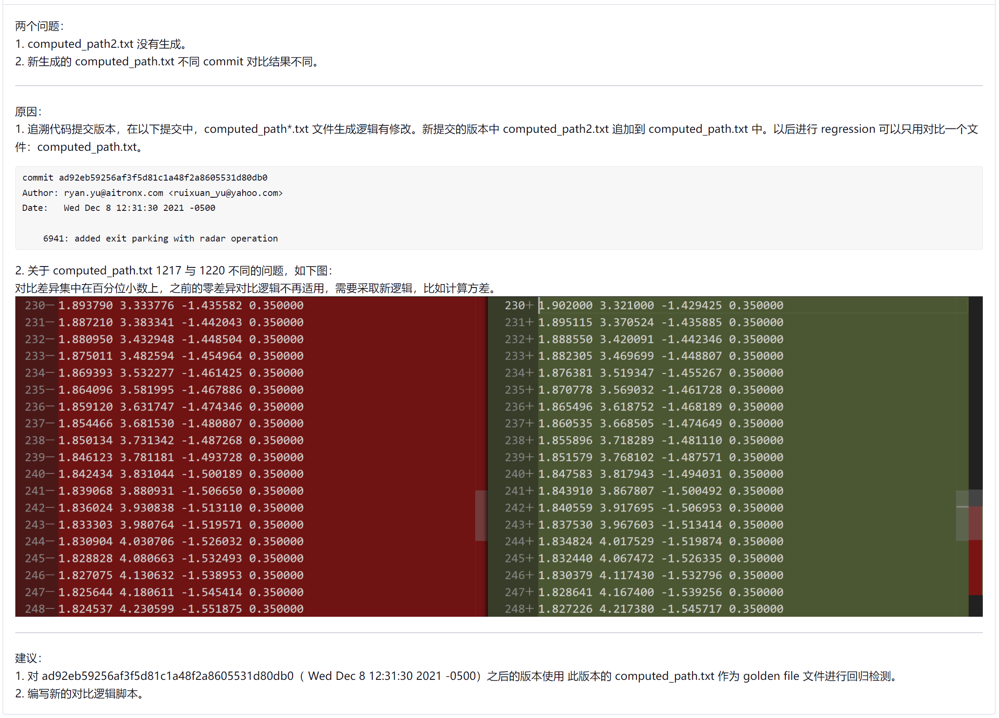
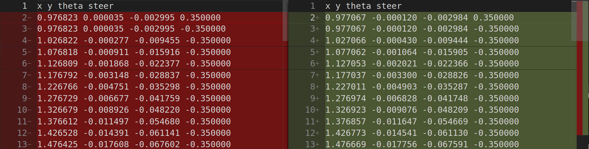
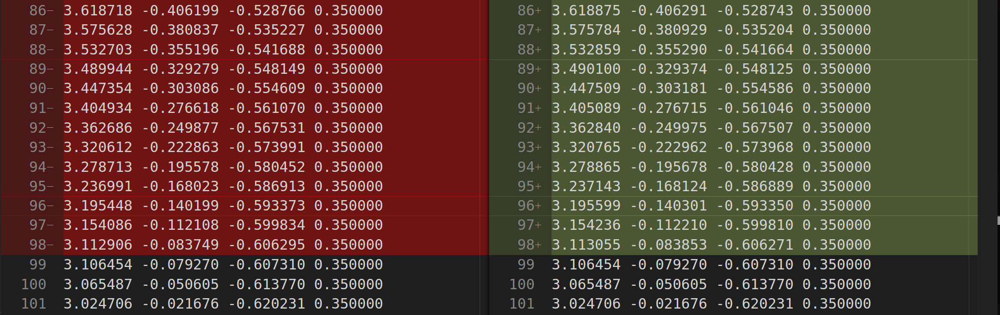
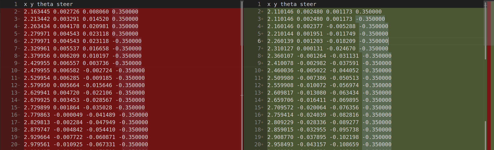
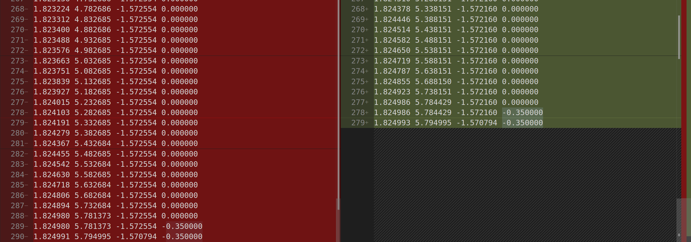

# 2021年12月20日：apa regression new

[toc]


---


## 00. 分析：

6248 apa regression 失败，情况简介：




其实 ryan 在 **6402** 中有一个自己的版本，这个版本可以用来取代我当前的版本。ryan 的版本更加稳健，因为他使用了方差方式进行对比，而不是我的版本中的零差异对比。


---


## 01. Ryan 中文件结构（整理后的）

```shell
../APA_COMPUTE_PATH_REGRESSION$ tree
.
├── APA_compute_path_regression.sh   # 主回归文件，生成回归文件，启动回归分析文件
└── regression_files				 # 回归文件包
    ├── computed_path_reg.txt		 # yaml 中指定生成的文件，与 golden 进行对比
    ├── compute_path.log    		 # 生成运行 log 文件（不用做对比）
    ├── compute_path_regression.yaml # 生成回归文件使用的 yaml
    ├── golden_computed_path.txt     # golden 文件（怎么生成的？）
    └── path_analysis.py			 # 回归分析文件

1 directory, 6 files
```


## 02. 使用 ryan 未修改的 regression 脚本


直接使用 ryan 的脚本，运行结果：

```shell
../TSP_RUN/6284_apa_regression/pc/APA_PARKING$ ./APA_compute_path_regression.sh 
Starting APA Compute Path Regression... 
Comparing computed_path
average squared error in x: 0.0000
average squared error in y: 0.0000
average squared error in theta: 0.0000
New computed path is the same as the old one
Regression analysis complete
```

使用 vscode 对比 `computed_path_reg.txt，golden_computed_path.txt`，结果如下：






但是 ryan 的这个 regression 脚本没有办法对 update_goal 后生成的 path 进行 regression。这是个问题。


## 03. 使用 ryan 修改后的 regression 脚本


```shell
../TSP_RUN/6284_apa_regression/pc/APA_PARKING$ ./APA_compute_path_regression.sh 
Starting APA Compute Path Regression... 
getTrajectoryNoCoordination()
The states are not separated enough. This is a core requirement for this function. (use tauristar_generic::minIncrementalDistancePath(), to fix your path), this path is saved as [traj_proc_fail.path].
The states are not separated enough. This is a core requirement for this function. (use tauristar_generic::minIncrementalDistancePath(), to fix your path), this path is saved as [traj_proc_fail.path].
The states are not separated enough. This is a core requirement for this function. (use tauristar_generic::minIncrementalDistancePath(), to fix your path), this path is saved as [traj_proc_fail.path].
The states are not separated enough. This is a core requirement for this function. (use tauristar_generic::minIncrementalDistancePath(), to fix your path), this path is saved as [traj_proc_fail.path].
The states are not separated enough. This is a core requirement for this function. (use tauristar_generic::minIncrementalDistancePath(), to fix your path), this path is saved as [traj_proc_fail.path].
getTrajectoryNoCoordination() - end
getTrajectoryNoCoordination()
trajectory_processor : invalid path(!) - should never happen
The states are not separated enough. This is a core requirement for this function. (use tauristar_generic::minIncrementalDistancePath(), to fix your path), this path is saved as [traj_proc_fail.path].
The states are not separated enough. This is a core requirement for this function. (use tauristar_generic::minIncrementalDistancePath(), to fix your path), this path is saved as [traj_proc_fail.path].
The states are not separated enough. This is a core requirement for this function. (use tauristar_generic::minIncrementalDistancePath(), to fix your path), this path is saved as [traj_proc_fail.path].
getTrajectoryNoCoordination() - end
log saved to regression_files/compute_path.log
Comparing computed_path
new computed_path is longer
average squared error in x: 0.0316
average squared error in y: 0.1442
average squared error in theta: 0.0022
New computed path is DIFFERENT from the old one!
Regression analysis complete
```


使用 vscode 对比 `computed_path_reg.txt，golden_computed_path.txt`，结果如下：






可以使用这个版本。

先制作一个 golden 文件。


---

## 参考