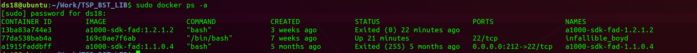
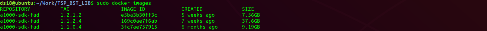
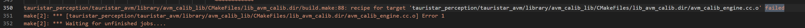
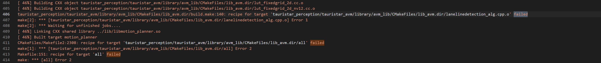

# bst docker 编译成功需要做的改动


## 0. 概览 bst docker 版本

docker container 版本：

```shell
CONTAINER ID        IMAGE                   COMMAND             CREATED             STATUS                      PORTS                 NAMES
13ba83a744e3        a1000-sdk-fad:1.2.1.2   "bash"              3 weeks ago         Exited (0) 22 minutes ago                         a1000-sdk-fad-1.2.1.2
77da538bab4a        169c0ae7f6ab            "/bin/bash"         7 weeks ago         Up 21 minutes               22/tcp                infallible_boyd
a1915faddbff        a1000-sdk-fad:1.1.0.4   "bash"              5 months ago        Exited (255) 5 months ago   0.0.0.0:212->22/tcp   a1000-sdk-fad-1.1.0.4

```




docker images 版本：




---


## 1. 编译 `13ba83a744e3` container 


对 docker 版本 `13ba83a744e3        a1000-sdk-fad:1.2.1.2`，编译出错，很奇怪。

`git status`

```shell
root@13ba83a744e3:/home/work_1/TauristarPlatform/src/tauristar_platform# git status
On branch master
Your branch is up to date with 'origin/master'.

Changes not staged for commit:
  (use "git add <file>..." to update what will be committed)
  (use "git checkout -- <file>..." to discard changes in working directory)

	modified:   CMakeLists.txt
	modified:   cmake/boost.cmake
	modified:   cmake/nl2sol.cmake
	modified:   cmake/opencv.cmake
	modified:   tauristar_perception/tauristar_avm/CMakeLists.txt
	modified:   tauristar_perception/tauristar_avm/library/avm_util/lens.cpp

```

git diff CMakeLists.txt 
```shell
---+---+---+---+---+---+---+---+---+---+---+---+---+---+---+---+---+---+

root@13ba83a744e3:/home/work_1/TauristarPlatform/src/tauristar_platform# git diff CMakeLists.txt 
diff --git a/src/tauristar_platform/CMakeLists.txt b/src/tauristar_platform/CMakeLists.txt
index dbadc113..63c0f29f 100755
--- a/src/tauristar_platform/CMakeLists.txt
+++ b/src/tauristar_platform/CMakeLists.txt
@@ -110,7 +110,7 @@ else()  #################################### cross_make
   if(BUILD_HORIZON)
     OPTION(BUILD_WITH_ROSBRIDGECPP "build rosbridgecpp" OFF)
   else()
-    OPTION(BUILD_WITH_ROSBRIDGECPP "build rosbridgecpp" ON)
+    OPTION(BUILD_WITH_ROSBRIDGECPP "build rosbridgecpp" OFF)
   endif()
   OPTION(BUILD_WITH_CAFFE "build caffe-jacinto app" OFF)
   OPTION(BUILD_WITH_BSD "build bsd app" OFF)
@@ -611,8 +611,9 @@ ENDIF()
 # Tauristar UI Engine
 ###################################
 
-
+message(STATUS "************ NEW UI ENTRY: ${BUILD_WITH_NEW_UI}")
 IF (BUILD_WITH_NEW_UI)
+  message(STATUS "************ NEW UI: ${BUILD_WITH_NEW_UI}")
 
   add_subdirectory("${PROJECT_SOURCE_DIR}/TauristarUI_Engine")

```

git diff cmake/boost.cmake 
```shell
---+---+---+---+---+---+---+---+---+---+---+---+---+---+---+---+---+---+

root@13ba83a744e3:/home/work_1/TauristarPlatform/src/tauristar_platform# git diff cmake/boost.cmake 
diff --git a/src/tauristar_platform/cmake/boost.cmake b/src/tauristar_platform/cmake/boost.cmake
index 4f1a2d2b..3a212e79 100644
--- a/src/tauristar_platform/cmake/boost.cmake
+++ b/src/tauristar_platform/cmake/boost.cmake
@@ -1,5 +1,6 @@
 
 if (cross_make)
+  message(STATUS "***** USING CROSS MAKE")
   if(BUILD_TDA2)
     set(Boost_INCLUDE_DIRS ${TAURISTAR_CORSS_COMPONENTS_DIR}/boost_1_60/include)
     set(Boost_LIBRARIES_PATH ${TAURISTAR_CORSS_COMPONENTS_DIR}/boost_1_60/lib)
@@ -26,6 +27,47 @@ if (cross_make)
     -lboost_atomic
     )
 else()
-  find_package(Boost REQUIRED COMPONENTS serialization system program_options thread filesystem regex)
+  message(STATUS "***** using normal make")
+  
+  #find_package(Boost REQUIRED COMPONENTS serialization system program_options thread filesystem regex)
+  
+  #find_package(Boost REQUIRED)
+   
+  #set(Boost_INCLUDE_DIRS ${DEPS_ROOT}/boost/include)
+  #set(Boost_LIBRARIES_PATH ${DEPS_ROOT}/boost/lib)
+ 
+  set(TST_PREBUILD_PATH ${PROJECT_SOURCE_DIR}/third_party/install/aarch64)
+  set(Boost_INCLUDE_DIRS ${TST_PREBUILD_PATH}/boost_1_60_0/include)
+  set(Boost_LIBRARIES_PATH ${TST_PREBUILD_PATH}/boost_1_60_0/lib)
+
+  message(STATUS "**** PROJECT_SOURCE_DIR: ${PROJECT_SOURCE_DIR}")
+  message(STATUS "**** TST_PREBUILD_PATH: ${TST_PREBUILD_PATH}")
+  message(STATUS "**** Boost_INCLUDE_DIRS: ${Boost_INCLUDE_DIRS}")
+  message(STATUS "**** Boost_LIBRARIES_PATH: ${Boost_LIBRARIES_PATH}")
+
+  #  if (Boost_FOUND)
+  #      message(STATUS "***** Boost_INCLUDE_DIR: ${Boost_INCLUDE_DIRS}")
+  #      message(STATUS "***** Boost_LIBRARIES: ${Boost_LIBRARIES}")
+  #      message(STATUS "***** Boost_LIB_VERSION = ${Boost_LIB_VERSION}")
+  #  else()
+  #      message(WARNING "***** BOOST NOT FOUND")
+  #  endif()
+  
+  link_directories(${Boost_LIBRARIES_PATH})
+  set(Boost_LIBRARIES
+    -lboost_serialization
+    -lboost_system
+    -lboost_program_options
+    -lboost_thread
+    -lboost_filesystem
+    -lboost_regex
+    -lboost_date_time
+    -lboost_atomic
+    )
+
+  message(STATUS "***** Boost_INCLUDE_DIR: ${Boost_INCLUDE_DIRS}")
+  message(STATUS "***** Boost_LIBRARIES: ${Boost_LIBRARIES}")
+  message(STATUS "***** Boost_LIB_VERSION = ${Boost_LIB_VERSION}")
+
 endif()

```

git diff cmake/nl2sol.cmake 
```shell
---+---+---+---+---+---+---+---+---+---+---+---+---+---+---+---+---+---+

root@13ba83a744e3:/home/work_1/TauristarPlatform/src/tauristar_platform# clear

root@13ba83a744e3:/home/work_1/TauristarPlatform/src/tauristar_platform# git diff cmake/nl2sol.cmake 
diff --git a/src/tauristar_platform/cmake/nl2sol.cmake b/src/tauristar_platform/cmake/nl2sol.cmake
index d9a29d57..41ad918c 100644
--- a/src/tauristar_platform/cmake/nl2sol.cmake
+++ b/src/tauristar_platform/cmake/nl2sol.cmake
@@ -10,7 +10,8 @@ if (cross_make)
     set(NL2SOL_LIBRARIES_PATH ${PROJECT_SOURCE_DIR}/third_party/nl2sol/install_horizon)
   endif()
 else()
-  set(NL2SOL_LIBRARIES_PATH ${PROJECT_SOURCE_DIR}/third_party/nl2sol/install_x86)
+  # set(NL2SOL_LIBRARIES_PATH ${PROJECT_SOURCE_DIR}/third_party/nl2sol/install_x86)
+  set(NL2SOL_LIBRARIES_PATH ${PROJECT_SOURCE_DIR}/third_party/nl2sol/install_horizon)
 endif()
 
 message("NL2SOL LIBRARIES PATH: ${NL2SOL_LIBRARIES_PATH}")

```

git diff cmake/opencv.cmake 
```shell
---+---+---+---+---+---+---+---+---+---+---+---+---+---+---+---+---+---+

root@13ba83a744e3:/home/work_1/TauristarPlatform/src/tauristar_platform# git diff cmake/opencv.cmake 
diff --git a/src/tauristar_platform/cmake/opencv.cmake b/src/tauristar_platform/cmake/opencv.cmake
index 788d2ee9..4944377a 100644
--- a/src/tauristar_platform/cmake/opencv.cmake
+++ b/src/tauristar_platform/cmake/opencv.cmake
@@ -38,5 +38,8 @@ if (cross_make)
   endif()
 else()
     #set(OpenCV_DIR "${PROJECT_SOURCE_DIR}/third_party/install/x86_64/opencv_v3.4.4/share/OpenCV")
-    find_package(OpenCV REQUIRED)
+    #find_package(OpenCV REQUIRED)
+    #@set(OpenCV_DIR "/usr/local/share/OpenCV")
+    set(OpenCV_DIR "/home/opencv344/opencv_install/share/OpenCV")
+    find_package(OpenCV REQUIRED PATHS /home/opencv344/opencv_install NO_DEFAULT_PATH)
 endif()

```

git diff tauristar_perception/tauristar_avm/CMakeLists.txt 
```shell
---+---+---+---+---+---+---+---+---+---+---+---+---+---+---+---+---+---+

root@13ba83a744e3:/home/work_1/TauristarPlatform/src/tauristar_platform# git diff tauristar_perception/tauristar_avm/CMakeLists.txt 
diff --git a/src/tauristar_platform/tauristar_perception/tauristar_avm/CMakeLists.txt b/src/tauristar_platform/tauristar_perception/tauristar_avm/CMakeLists.txt
index ba621d26..b9ba9661 100644
--- a/src/tauristar_platform/tauristar_perception/tauristar_avm/CMakeLists.txt
+++ b/src/tauristar_platform/tauristar_perception/tauristar_avm/CMakeLists.txt
@@ -7,7 +7,11 @@ MESSAGE(STATUS "CMAKE_BINARY_DIR:  ${CMAKE_BINARY_DIR}")
 MESSAGE(STATUS "PROJECT_SOURCE_DIR " ${PROJECT_SOURCE_DIR})
 
 IF (AVM_STANDALONE)
-  find_package(OpenCV REQUIRED)
+  # find_package(OpenCV REQUIRED)
+
+  set(OpenCV_DIR "/home/opencv344/opencv_install/share/OpenCV")
+  find_package(OpenCV REQUIRED PATHS /home/opencv344/opencv_install NO_DEFAULT_PATH)
+
   find_package(Boost REQUIRED COMPONENTS
     filesystem
   )
@@ -19,10 +23,10 @@ IF (AVM_STANDALONE)
   include_directories("${THIRD_PARTY_ROOT}/spdlog/include")
   include_directories("${THIRD_PARTY_ROOT}/yaml-cpp/include")
 
-  link_directories(${THIRD_PARTY_ROOT}/nl2sol/install_x86)
-  set(OPTIMIZER_ROOT ${PROJECT_SOURCE_DIR}/../../optimizers)
-  add_subdirectory(${OPTIMIZER_ROOT} optimizers)
-  include_directories(${OPTIMIZER_ROOT})
+  # link_directories(${THIRD_PARTY_ROOT}/nl2sol/install_x86)
+  # set(OPTIMIZER_ROOT ${PROJECT_SOURCE_DIR}/../../optimizers)
+  # add_subdirectory(${OPTIMIZER_ROOT} optimizers)
+  # include_directories(${OPTIMIZER_ROOT})
 
   SET(EXECUTABLE_OUTPUT_PATH ${CMAKE_BINARY_DIR}/bin)
   SET(LIBRARY_OUTPUT_PATH ${CMAKE_BINARY_DIR}/lib)
@@ -57,7 +61,7 @@ ENDIF()
 
 set (AVM_SYSTEM_LIBS
   ${AVM_SYSTEM_LIBS}
-  optimizer
+  # optimizer
   yaml-cpp
   ${OpenCV_LIBS}
   ${Boost_LIBRARIES}

```
git diff tauristar_perception/tauristar_avm/library/avm_util/lens.cpp 
```shell
---+---+---+---+---+---+---+---+---+---+---+---+---+---+---+---+---+---+

root@13ba83a744e3:/home/work_1/TauristarPlatform/src/tauristar_platform# git diff tauristar_perception/tauristar_avm/library/avm_util/lens.cpp 
diff --git a/src/tauristar_platform/tauristar_perception/tauristar_avm/library/avm_util/lens.cpp b/src/tauristar_platform/tauristar_perception/tauristar_avm/library/avm_util/lens.cpp
index 9a0ec248..27788b63 100644
--- a/src/tauristar_platform/tauristar_perception/tauristar_avm/library/avm_util/lens.cpp
+++ b/src/tauristar_platform/tauristar_perception/tauristar_avm/library/avm_util/lens.cpp
@@ -84,8 +84,10 @@ static std::unique_ptr<FakeLensData> static_fakelensdata;
 
 float *getLenData(int type)
 {
-    if (type < cameralensdata.CameraLensNum)
+    if (type < cameralensdata.CameraLensNum){
+        printf("**** 1. LenData[type]: %f, %f, %f\n", LenData[type][0], LenData[type][1], LenData[type][2]);
         return LenData[type];
+    }
 
     if (type > 10000) {
         if (!static_fakelensdata) {
@@ -145,6 +147,7 @@ void lensSet()
 {
     for (int i = 0; i != cameralensdata.CameraLensNum; i++) {
         LenData[i] = cameralensdata.lendisData[i];
+        printf("**** 2. LenData[i]: %f\n", LenData[i]);
     }
 }
 
@@ -176,8 +179,11 @@ bool AnalysisCameraLensDataBase(char const *lensDatpath)
     size_t sz = fread(&cameralensdata.CameraLensNum, sizeof(int), 1, fp);
     for (int i = 0; i<cameralensdata.CameraLensNum; i++) {
         sz = fread(&cameralensdata.SensorPara[i], sizeof(CameraParam), 1, fp);
+        printf("**** 3. cameralensdata.SensorPara[%d]: %d\n", cameralensdata.SensorPara[i].eyeW);
         sz = fread(&cameralensdata.datalength[i], sizeof(int), 1, fp);
+        printf("**** 4. cameralensdata.datalength[%d]: %d\n", cameralensdata.datalength[i]);
         sz = fread(&cameralensdata.lendisData[i], sizeof(float) * cameralensdata.datalength[i], 1, fp);
+        printf("**** 5. cameralensdata.lendisData[%d]: %d\n", cameralensdata.lendisData[i][3]);
     }
 
     fclose(fp);

```


编译结果：保存（很奇怪，之前没有问题啊。。。）

```
[100%] Linking CXX executable bin/processor_node
/opt/bstos/1.2.1.2/sysroots/x86_64-bstsdk-linux/usr/libexec/aarch64-bst-linux/gcc/aarch64-bst-linux/8.3.0/real-ld: lib/libbasic_util.so: undefined reference to `__atomic_store_16'
/opt/bstos/1.2.1.2/sysroots/x86_64-bstsdk-linux/usr/libexec/aarch64-bst-linux/gcc/aarch64-bst-linux/8.3.0/real-ld: lib/libbasic_util.so: undefined reference to `__atomic_load_16'
/opt/bstos/1.2.1.2/sysroots/x86_64-bstsdk-linux/usr/libexec/aarch64-bst-linux/gcc/aarch64-bst-linux/8.3.0/real-ld: lib/libbasic_util.so: undefined reference to `__atomic_compare_exchange_16'
collect2: error: ld returned 1 exit status
CMakeFiles/processor_node.dir/build.make:146: recipe for target 'bin/processor_node' failed
make[2]: *** [bin/processor_node] Error 1
CMakeFiles/Makefile2:109: recipe for target 'CMakeFiles/processor_node.dir/all' failed
make[1]: *** [CMakeFiles/processor_node.dir/all] Error 2
Makefile:151: recipe for target 'all' failed
make: *** [all] Error 2
```


---


## 2. 编译 `77da538bab4a` container

TS 版本：`4f0fb55ba3b306c81fb685fedbdece2c7a4836b8`

```shell
commit 4f0fb55ba3b306c81fb685fedbdece2c7a4836b8 (HEAD -> master, origin/master, origin/HEAD)
Author: yuwei <yuwei.dong@aitronx.com>
Date:   Mon Dec 6 08:39:42 2021 +0800

    ticket# 7159 fix sometime hor parkspace is too short

```


### 00. 需要做的修改


`git status`

```shell
root@77da538bab4a:/home/work_3/TauristarPlatform/src/tauristar_platform# git status
On branch master
Your branch is up to date with 'origin/master'.

Changes not staged for commit:
  (use "git add <file>..." to update what will be committed)
  (use "git checkout -- <file>..." to discard changes in working directory)

	modified:   CMakeLists.txt
	modified:   cmake/nl2sol.cmake
	modified:   cmake/opencv.cmake
	modified:   tauristar_perception/tauristar_avm/library/avm_util/lens.cpp

Untracked files:
  (use "git add <file>..." to include in what will be committed)

	../.idea/
	.idea/
	docker_build_bst.sh


```


`git diff CMakeLists.txt  `

```shell
root@77da538bab4a:/home/work_3/TauristarPlatform/src/tauristar_platform# git diff CMakeLists.txt 
diff --git a/src/tauristar_platform/CMakeLists.txt b/src/tauristar_platform/CMakeLists.txt
index dbadc113..b3bcd86e 100755
--- a/src/tauristar_platform/CMakeLists.txt
+++ b/src/tauristar_platform/CMakeLists.txt
@@ -110,7 +110,7 @@ else()  #################################### cross_make
   if(BUILD_HORIZON)
     OPTION(BUILD_WITH_ROSBRIDGECPP "build rosbridgecpp" OFF)
   else()
-    OPTION(BUILD_WITH_ROSBRIDGECPP "build rosbridgecpp" ON)
+    OPTION(BUILD_WITH_ROSBRIDGECPP "build rosbridgecpp" OFF)
   endif()
   OPTION(BUILD_WITH_CAFFE "build caffe-jacinto app" OFF)
   OPTION(BUILD_WITH_BSD "build bsd app" OFF)

```


`git diff cmake/nl2sol.cmake `

```shell
root@77da538bab4a:/home/work_3/TauristarPlatform/src/tauristar_platform# git diff cmake/nl2sol.cmake 
diff --git a/src/tauristar_platform/cmake/nl2sol.cmake b/src/tauristar_platform/cmake/nl2sol.cmake
index d9a29d57..41ad918c 100644
--- a/src/tauristar_platform/cmake/nl2sol.cmake
+++ b/src/tauristar_platform/cmake/nl2sol.cmake
@@ -10,7 +10,8 @@ if (cross_make)
     set(NL2SOL_LIBRARIES_PATH ${PROJECT_SOURCE_DIR}/third_party/nl2sol/install_horizon)
   endif()
 else()
-  set(NL2SOL_LIBRARIES_PATH ${PROJECT_SOURCE_DIR}/third_party/nl2sol/install_x86)
+  # set(NL2SOL_LIBRARIES_PATH ${PROJECT_SOURCE_DIR}/third_party/nl2sol/install_x86)
+  set(NL2SOL_LIBRARIES_PATH ${PROJECT_SOURCE_DIR}/third_party/nl2sol/install_horizon)
 endif()
 
 message("NL2SOL LIBRARIES PATH: ${NL2SOL_LIBRARIES_PATH}")

```


`git diff cmake/opencv.cmake `

```shell
root@77da538bab4a:/home/work_3/TauristarPlatform/src/tauristar_platform# git diff cmake/opencv.cmake 
diff --git a/src/tauristar_platform/cmake/opencv.cmake b/src/tauristar_platform/cmake/opencv.cmake
index 788d2ee9..2d2b0e2c 100644
--- a/src/tauristar_platform/cmake/opencv.cmake
+++ b/src/tauristar_platform/cmake/opencv.cmake
@@ -38,5 +38,7 @@ if (cross_make)
   endif()
 else()
     #set(OpenCV_DIR "${PROJECT_SOURCE_DIR}/third_party/install/x86_64/opencv_v3.4.4/share/OpenCV")
-    find_package(OpenCV REQUIRED)
+    #find_package(OpenCV REQUIRED)
+    set(OpenCV_DIR "/usr/local/share/OpenCV")
+    find_package(OpenCV REQUIRED PATHS /usr/local/ NO_DEFAULT_PATH)
 endif()
```


`git diff tauristar_perception/tauristar_avm/library/avm_util/lens.cpp `

```shell
root@77da538bab4a:/home/work_3/TauristarPlatform/src/tauristar_platform# git diff tauristar_perception/tauristar_avm/library/avm_util/lens.cpp 
diff --git a/src/tauristar_platform/tauristar_perception/tauristar_avm/library/avm_util/lens.cpp b/src/tauristar_platform/tauristar_perception/tauristar_avm/library/avm_util/lens.cpp
index 9a0ec248..27788b63 100644
--- a/src/tauristar_platform/tauristar_perception/tauristar_avm/library/avm_util/lens.cpp
+++ b/src/tauristar_platform/tauristar_perception/tauristar_avm/library/avm_util/lens.cpp
@@ -84,8 +84,10 @@ static std::unique_ptr<FakeLensData> static_fakelensdata;
 
 float *getLenData(int type)
 {
-    if (type < cameralensdata.CameraLensNum)
+    if (type < cameralensdata.CameraLensNum){
+        printf("**** 1. LenData[type]: %f, %f, %f\n", LenData[type][0], LenData[type][1], LenData[type][2]);
         return LenData[type];
+    }
 
     if (type > 10000) {
         if (!static_fakelensdata) {
@@ -145,6 +147,7 @@ void lensSet()
 {
     for (int i = 0; i != cameralensdata.CameraLensNum; i++) {
         LenData[i] = cameralensdata.lendisData[i];
+        printf("**** 2. LenData[i]: %f\n", LenData[i]);
     }
 }
 
@@ -176,8 +179,11 @@ bool AnalysisCameraLensDataBase(char const *lensDatpath)
     size_t sz = fread(&cameralensdata.CameraLensNum, sizeof(int), 1, fp);
     for (int i = 0; i<cameralensdata.CameraLensNum; i++) {
         sz = fread(&cameralensdata.SensorPara[i], sizeof(CameraParam), 1, fp);
+        printf("**** 3. cameralensdata.SensorPara[%d]: %d\n", cameralensdata.SensorPara[i].eyeW);
         sz = fread(&cameralensdata.datalength[i], sizeof(int), 1, fp);
+        printf("**** 4. cameralensdata.datalength[%d]: %d\n", cameralensdata.datalength[i]);
         sz = fread(&cameralensdata.lendisData[i], sizeof(float) * cameralensdata.datalength[i], 1, fp);
+        printf("**** 5. cameralensdata.lendisData[%d]: %d\n", cameralensdata.lendisData[i][3]);
     }
 
     fclose(fp);

```


## opencv400 问题







