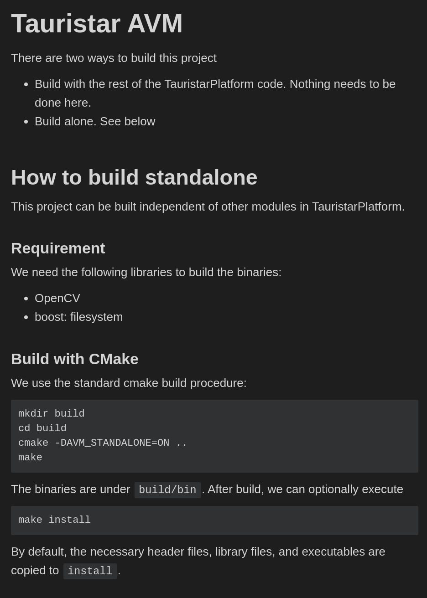
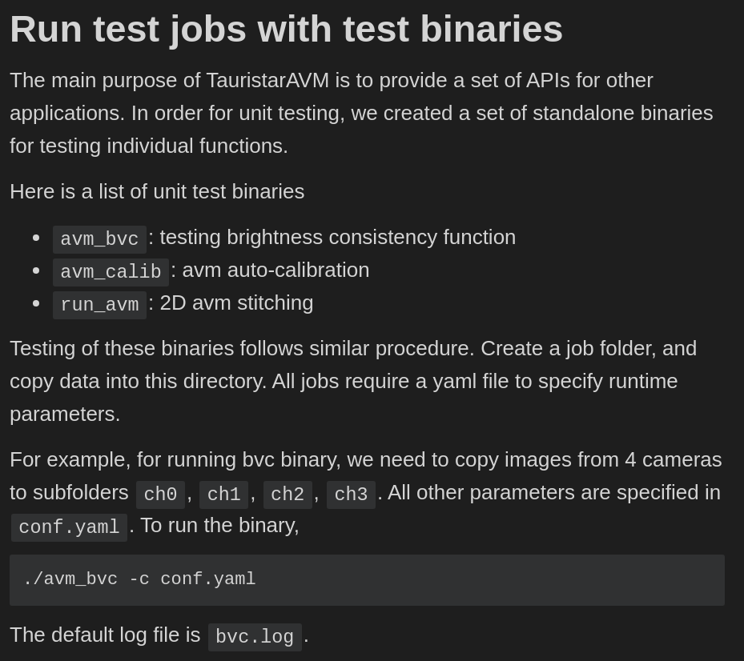

# 20211230: 详细记录 bst tsp all 编译修改


---


```shell
ds18@ubuntu:~/Work_DC$ sudo docker ps -a
[sudo] password for ds18: 
CONTAINER ID        IMAGE                   COMMAND             CREATED             STATUS                      PORTS                 NAMES
13ba83a744e3        a1000-sdk-fad:1.2.1.2   "bash"              3 weeks ago         Exited (0) 46 hours ago                           a1000-sdk-fad-1.2.1.2
77da538bab4a        169c0ae7f6ab            "/bin/bash"         7 weeks ago         Up 25 hours                 22/tcp                infallible_boyd
a1915faddbff        a1000-sdk-fad:1.1.0.4   "bash"              5 months ago        Exited (255) 5 months ago   0.0.0.0:212->22/tcp   a1000-sdk-fad-1.1.0.4

ds18@ubuntu:~/Work_DC$ sudo docker images
REPOSITORY          TAG                 IMAGE ID            CREATED             SIZE
a1000-sdk-fad       1.2.1.2             e5ba3b30ff3c        5 weeks ago         7.56GB
a1000-sdk-fad       1.1.2.4             169c0ae7f6ab        7 weeks ago         37.6GB
a1000-sdk-fad       1.1.0.4             3fc7ae757915        6 months ago        9.19GB

```


在 bst docker  1.1.2.1 <基础版本> 的 1.1.2.4 <当前升级版本> 中，`/home/work_3` 目录专门编译 cv344 的 tsp 全家桶和 avm standalone；`/home/work_4` 目录专门编译 cv400 的 tsp 全家桶和 avm standalone。


```
修改历史树：

-	BST cv344
		|-	AVM	cv344
-	BST cv400
		|-	AVM cv400
```


---


# 1. BST 下编译 TSP 全家桶（cv344）（成功）
---


[toc]


---

## 0. 基本信息：

```shell
TS 版本:

# git rev-parse HEAD
4f0fb55ba3b306c81fb685fedbdece2c7a4836b8

# git log
commit 4f0fb55ba3b306c81fb685fedbdece2c7a4836b8 (HEAD -> master, origin/master, origin/HEAD)
Author: yuwei <yuwei.dong@aitronx.com>
Date:   Mon Dec 6 08:39:42 2021 +0800

    ticket# 7159 fix sometime hor parkspace is too short

---+---+---+---+---+---+---+---+---+---+---+---+---+---+---+---+---+---+---+---+---+---+---+---+

BST docker 版本：

/opt/bstos/1.1.2.1/

---+---+---+---+---+---+---+---+---+---+---+---+---+---+---+---+---+---+---+---+---+---+---+---+

文件夹：

work_3

```


## 1. BST 下编译完整的 TSP 需要修改的文件（cv344）：


```shell
# git status
On branch master
Your branch is up to date with 'origin/master'.

Changes not staged for commit:
  (use "git add <file>..." to update what will be committed)
  (use "git checkout -- <file>..." to discard changes in working directory)

	modified:   CMakeLists.txt
	modified:   cmake/nl2sol.cmake
	modified:   cmake/opencv.cmake
	modified:   tauristar_perception/tauristar_avm/library/avm_util/lens.cpp

```


当前情况下，一共有4个文件需要修改（仅限于当前情况），如果之后有编译出错，可以使用当前的文件修改作为还原。


**文件1**： `CMakeLists.txt`

`build rosbridgecpp` 能否在 cmake 中作为选项指明。

```shell
root@77da538bab4a:/home/work_3/TauristarPlatform/src/tauristar_platform# git diff CMakeLists.txt 
diff --git a/src/tauristar_platform/CMakeLists.txt b/src/tauristar_platform/CMakeLists.txt
index dbadc113..b3bcd86e 100755
--- a/src/tauristar_platform/CMakeLists.txt
+++ b/src/tauristar_platform/CMakeLists.txt
@@ -110,7 +110,7 @@ else()  #################################### cross_make
   if(BUILD_HORIZON)
     OPTION(BUILD_WITH_ROSBRIDGECPP "build rosbridgecpp" OFF)
   else()
-    OPTION(BUILD_WITH_ROSBRIDGECPP "build rosbridgecpp" ON)
+    OPTION(BUILD_WITH_ROSBRIDGECPP "build rosbridgecpp" OFF)
   endif()
   OPTION(BUILD_WITH_CAFFE "build caffe-jacinto app" OFF)
   OPTION(BUILD_WITH_BSD "build bsd app" OFF)

```


**文件2**：`cmake/nl2sol.cmake`

这个文件暂时记录一下，之后不一定需要。

```shell
root@77da538bab4a:/home/work_3/TauristarPlatform/src/tauristar_platform# git diff CMakeLists.txt 
diff --git a/src/tauristar_platform/CMakeLists.txt b/src/tauristar_platform/CMakeLists.txt
index dbadc113..b3bcd86e 100755
--- a/src/tauristar_platform/CMakeLists.txt
+++ b/src/tauristar_platform/CMakeLists.txt
@@ -110,7 +110,7 @@ else()  #################################### cross_make
   if(BUILD_HORIZON)
     OPTION(BUILD_WITH_ROSBRIDGECPP "build rosbridgecpp" OFF)
   else()
-    OPTION(BUILD_WITH_ROSBRIDGECPP "build rosbridgecpp" ON)
+    OPTION(BUILD_WITH_ROSBRIDGECPP "build rosbridgecpp" OFF)
   endif()
   OPTION(BUILD_WITH_CAFFE "build caffe-jacinto app" OFF)
   OPTION(BUILD_WITH_BSD "build bsd app" OFF)
root@77da538bab4a:/home/work_3/TauristarPlatform/src/tauristar_platform# git diff cmake/nl2sol.cmake 
diff --git a/src/tauristar_platform/cmake/nl2sol.cmake b/src/tauristar_platform/cmake/nl2sol.cmake
index d9a29d57..41ad918c 100644
--- a/src/tauristar_platform/cmake/nl2sol.cmake
+++ b/src/tauristar_platform/cmake/nl2sol.cmake
@@ -10,7 +10,8 @@ if (cross_make)
     set(NL2SOL_LIBRARIES_PATH ${PROJECT_SOURCE_DIR}/third_party/nl2sol/install_horizon)
   endif()
 else()
-  set(NL2SOL_LIBRARIES_PATH ${PROJECT_SOURCE_DIR}/third_party/nl2sol/install_x86)
+  # set(NL2SOL_LIBRARIES_PATH ${PROJECT_SOURCE_DIR}/third_party/nl2sol/install_x86)
+  set(NL2SOL_LIBRARIES_PATH ${PROJECT_SOURCE_DIR}/third_party/nl2sol/install_horizon)
 endif()
 
 message("NL2SOL LIBRARIES PATH: ${NL2SOL_LIBRARIES_PATH}")

```


**文件3**：`cmake/opencv.cmake`

使用的是 `opencv 344` 版本。

```shell
root@77da538bab4a:/home/work_3/TauristarPlatform/src/tauristar_platform# git diff cmake/opencv.cmake 
diff --git a/src/tauristar_platform/cmake/opencv.cmake b/src/tauristar_platform/cmake/opencv.cmake
index 788d2ee9..2d2b0e2c 100644
--- a/src/tauristar_platform/cmake/opencv.cmake
+++ b/src/tauristar_platform/cmake/opencv.cmake
@@ -38,5 +38,7 @@ if (cross_make)
   endif()
 else()
     #set(OpenCV_DIR "${PROJECT_SOURCE_DIR}/third_party/install/x86_64/opencv_v3.4.4/share/OpenCV")
-    find_package(OpenCV REQUIRED)
+    #find_package(OpenCV REQUIRED)
+    set(OpenCV_DIR "/usr/local/share/OpenCV")
+    find_package(OpenCV REQUIRED PATHS /usr/local/ NO_DEFAULT_PATH)
 endif()

```


**文件4**：`tauristar_perception/tauristar_avm/library/avm_util/lens.cpp `

这个文件的修改只是用来debug。

```shell
# git diff tauristar_perception/tauristar_avm/library/avm_util/lens.cpp 
diff --git a/src/tauristar_platform/tauristar_perception/tauristar_avm/library/avm_util/lens.cpp b/src/tauristar_platform/tauristar_perception/tauristar_avm/library/avm_util/lens.cpp
index 9a0ec248..27788b63 100644
--- a/src/tauristar_platform/tauristar_perception/tauristar_avm/library/avm_util/lens.cpp
+++ b/src/tauristar_platform/tauristar_perception/tauristar_avm/library/avm_util/lens.cpp
@@ -84,8 +84,10 @@ static std::unique_ptr<FakeLensData> static_fakelensdata;
 
 float *getLenData(int type)
 {
-    if (type < cameralensdata.CameraLensNum)
+    if (type < cameralensdata.CameraLensNum){
+        printf("**** 1. LenData[type]: %f, %f, %f\n", LenData[type][0], LenData[type][1], LenData[type][2]);
         return LenData[type];
+    }
 
     if (type > 10000) {
         if (!static_fakelensdata) {
@@ -145,6 +147,7 @@ void lensSet()
 {
     for (int i = 0; i != cameralensdata.CameraLensNum; i++) {
         LenData[i] = cameralensdata.lendisData[i];
+        printf("**** 2. LenData[i]: %f\n", LenData[i]);
     }
 }
 
@@ -176,8 +179,11 @@ bool AnalysisCameraLensDataBase(char const *lensDatpath)
     size_t sz = fread(&cameralensdata.CameraLensNum, sizeof(int), 1, fp);
     for (int i = 0; i<cameralensdata.CameraLensNum; i++) {
         sz = fread(&cameralensdata.SensorPara[i], sizeof(CameraParam), 1, fp);
+        printf("**** 3. cameralensdata.SensorPara[%d]: %d\n", cameralensdata.SensorPara[i].eyeW);
         sz = fread(&cameralensdata.datalength[i], sizeof(int), 1, fp);
+        printf("**** 4. cameralensdata.datalength[%d]: %d\n", cameralensdata.datalength[i]);
         sz = fread(&cameralensdata.lendisData[i], sizeof(float) * cameralensdata.datalength[i], 1, fp);
+        printf("**** 5. cameralensdata.lendisData[%d]: %d\n", cameralensdata.lendisData[i][3]);
     }
 
     fclose(fp);

```


---


#  2. BST/Ubuntu AVM standalone 编译（cv344）（成功）


这个可能要借鉴一下最后一次编译的文件修改。


## 1. 尝试 ubuntu 18.04 下 stand alone 编译 `tauristar_avm`（完成）

路径：`src/tauristar_platform/tauristar_perception/tauristar_avm`


**编译操作：**

|  |  |
| ------------------------------------------------------------ | ------------------------------------------------------------ |
|                                                              |                                                              |


**编译命令：**

```cmake
# cmake 命令示例

cmake -DOpenCV_DIR=/root/usr/local/share/OpenCV -DBUILD_WITH_ROS=OFF -DBUILD_WITH_ROSBRIDGECPP=OFF ..


# 关于 opencv 路径
    #set(OpenCV_DIR "${PROJECT_SOURCE_DIR}/third_party/install/x86_64/opencv_v3.4.4/share/OpenCV")
    find_package(OpenCV REQUIRED)
    
    set(OpenCV_INCLUDE_DIRS ${DEPS_ROOT}/opencv/include)
    set(OpenCV_LIBS_PATH ${DEPS_ROOT}/opencv/lib
    link_directories(${OpenCV_LIBS_PATH})
    
# 关于 boost 路径
    find_package(Boost REQUIRED COMPONENTS serialization system program_options thread filesystem regex)
  
    set(Boost_INCLUDE_DIRS ${DEPS_ROOT}/boost/include)
    set(Boost_LIBRARIES_PATH ${DEPS_ROOT}/boost/lib)
    link_directories(${Boost_LIBRARIES_PATH})
```


**编译实操：**

```shell
# 在 /src/tauristar_platform/tauristar_perception/tauristar_avm 目录下

mkdir build
cd build

# 我的 opencv 路径 /usr/local/opencv-3.4.5/

cmake .. -DAVM_STANDALONE=ON -DOpenCV_DIR=/usr/local/opencv/opencv-3.4.5/share/OpenCV
make -j10

# 将头文件，库文件以及二进制文件拷贝到 install 目录下

make install

src/tauristar_platform/tauristar_perception/tauristar_avm$ tree . -L 1
.
├── app
├── build
├── CMakeLists.txt
├── install
├── library
└── README.md


src/tauristar_platform/tauristar_perception/tauristar_avm/install$ tree
.
├── bin
...
├── include
...
...
└── lib
    ├── cmake
    │   └── yaml-cpp
	...
    ├── liblib_avm_algobase.so					# bst 需要的 avm 库
    ├── liblib_avm_bvc.so						# bst 需要的 avm 库
    ├── liblib_avm_calib.so						# bst 需要的 avm 库
    ├── liblib_avm_dcal.so						# bst 需要的 avm 库
    ├── liblib_avm.so							# bst 需要的 avm 库
    ├── liblib_avm_util.so						# bst 需要的 avm 库
	...
    └── pkgconfig
		...

```


**所需要的头文件：**

```shell
ds18@ubuntu:~/Work/TSP_BST_DOC$ tree library/
library/
├── avm_algo_base
│   └── point2D.h
├── avm_bvclib
│   ├── avm_bvc_engine.h
│   └── bright_alg.h
├── avm_calib_lib
│   ├── bvsCalibAlg.h
│   ├── deavm_edgelet.h
│   └── preprocessing.h
├── avm_lib
│   ├── camerainit.h
│   ├── gl3DModel.h
│   ├── lut_fixedgrid_2d.h
│   ├── ResidueImageStitch.h
│   ├── rv3dmodel.h
│   ├── single3dmodel.h
│   └── singleudis.h
└── avm_util
    ├── bv3d_xml.h
    ├── lens.h
    └── xmlResolve.h

5 directories, 16 files

```


## 2. 尝试在 bst docker 下 standalone 编译 `tauristar_avm`

```shell
root@77da538bab4a:/home/work_3/TauristarPlatform/src/tauristar_platform/tauristar_perception/tauristar_avm/build# /opt/bstos/1.1.2.1/environment-setup-aarch64-bst-linux 

root@77da538bab4a:/home/work_3/TauristarPlatform/src/tauristar_platform/tauristar_perception/tauristar_avm/build# cmake .. -DAVM_STANDALONE=ON -DOpenCV_DIR=/usr/local/share/OpenCV

-- Toolchain file defaulted to '/opt/bstos/1.1.2.1/sysroots/x86_64-bstsdk-linux/usr/share/cmake/OEToolchainConfig.cmake'
-- The C compiler identification is GNU 8.3.0
-- The CXX compiler identification is GNU 8.3.0
-- Check for working C compiler: /opt/bstos/1.1.2.1/sysroots/x86_64-bstsdk-linux/usr/bin/aarch64-bst-linux/aarch64-bst-linux-gcc
-- Check for working C compiler: /opt/bstos/1.1.2.1/sysroots/x86_64-bstsdk-linux/usr/bin/aarch64-bst-linux/aarch64-bst-linux-gcc -- works
-- Detecting C compiler ABI info
-- Detecting C compiler ABI info - done
-- Detecting C compile features
-- Detecting C compile features - done
-- Check for working CXX compiler: /opt/bstos/1.1.2.1/sysroots/x86_64-bstsdk-linux/usr/bin/aarch64-bst-linux/aarch64-bst-linux-g++
-- Check for working CXX compiler: /opt/bstos/1.1.2.1/sysroots/x86_64-bstsdk-linux/usr/bin/aarch64-bst-linux/aarch64-bst-linux-g++ -- works
-- Detecting CXX compiler ABI info
-- Detecting CXX compiler ABI info - done
-- Detecting CXX compile features
-- Detecting CXX compile features - done
-- CMAKE_BINARY_DIR:  /home/work_3/TauristarPlatform/src/tauristar_platform/tauristar_perception/tauristar_avm/build
-- PROJECT_SOURCE_DIR /home/work_3/TauristarPlatform/src/tauristar_platform/tauristar_perception/tauristar_avm
-- Found OpenCV: /usr/local (found version "3.4.4") 
-- Boost version: 1.68.0
-- Found the following Boost libraries:
--   filesystem
--   system
CMake Deprecation Warning at /home/work_3/TauristarPlatform/src/tauristar_platform/third_party/yaml-cpp/CMakeLists.txt:10 (cmake_policy):
  The OLD behavior for policy CMP0012 will be removed from a future version
  of CMake.

  The cmake-policies(7) manual explains that the OLD behaviors of all
  policies are deprecated and that a policy should be set to OLD only under
  specific short-term circumstances.  Projects should be ported to the NEW
  behavior and not rely on setting a policy to OLD.


CMake Deprecation Warning at /home/work_3/TauristarPlatform/src/tauristar_platform/third_party/yaml-cpp/CMakeLists.txt:14 (cmake_policy):
  The OLD behavior for policy CMP0015 will be removed from a future version
  of CMake.

  The cmake-policies(7) manual explains that the OLD behaviors of all
  policies are deprecated and that a policy should be set to OLD only under
  specific short-term circumstances.  Projects should be ported to the NEW
  behavior and not rely on setting a policy to OLD.


-- Performing Test FLAG_WEXTRA
-- Performing Test FLAG_WEXTRA - Success
-- a--- Build type: 
-- b--- Build type: 
-- Build spdlog: 1.4.2
-- Looking for pthread.h
-- Looking for pthread.h - found
-- Looking for pthread_create
-- Looking for pthread_create - not found
-- Looking for pthread_create in pthreads
-- Looking for pthread_create in pthreads - not found
-- Looking for pthread_create in pthread
-- Looking for pthread_create in pthread - found
-- Found Threads: TRUE  
-- Build type: Release
-- CMAKE_INSTALL_PREFIX: /home/work_3/TauristarPlatform/src/tauristar_platform/tauristar_perception/tauristar_avm/install
AVM UTIL: STANDALONE
-- Configuring done
-- Generating done
-- Build files have been written to: /home/work_3/TauristarPlatform/src/tauristar_platform/tauristar_perception/tauristar_avm/build

```


### 遇到的问题：

#### 1. 报错：optimizer（已解决）

```
[ 11%] Linking CXX shared library liboptimizer.so
[ 12%] Building CXX object yaml-cpp/CMakeFiles/yaml-cpp.dir/src/convert.cpp.o
/opt/bstos/1.1.2.1/sysroots/x86_64-bstsdk-linux/usr/libexec/aarch64-bst-linux/gcc/aarch64-bst-linux/8.3.0/real-ld: skipping incompatible /home/work_3/TauristarPlatform/src/tauristar_platform/tauristar_perception/tauristar_avm/../../third_party/nl2sol/install_x86/libnl2sol.so when searching for -lnl2sol
/opt/bstos/1.1.2.1/sysroots/x86_64-bstsdk-linux/usr/libexec/aarch64-bst-linux/gcc/aarch64-bst-linux/8.3.0/real-ld: cannot find -lnl2sol
collect2: error: ld returned 1 exit status
optimizers/CMakeFiles/optimizer.dir/build.make:83: recipe for target 'optimizers/liboptimizer.so' failed
make[2]: *** [optimizers/liboptimizer.so] Error 1
CMakeFiles/Makefile2:299: recipe for target 'optimizers/CMakeFiles/optimizer.dir/all' failed
make[1]: *** [optimizers/CMakeFiles/optimizer.dir/all] Error 2
make[1]: *** Waiting for unfinished jobs....
[ 12%] Building CXX object library/avm_dcal_lib/CMakeFiles/lib_avm_dcal.dir/DynamicCalibEngine.cc.o

```

解决：

修改上级 `CMakeLists.txt`：将与 optimizer 有关的代码全部注释掉。

```shell
root@77da538bab4a:/home/work_3/TauristarPlatform/src/tauristar_platform/tauristar_perception/tauristar_avm/build# git diff ../CMakeLists.txt 
diff --git a/src/tauristar_platform/tauristar_perception/tauristar_avm/CMakeLists.txt b/src/tauristar_platform/tauristar_perception/tauristar_avm/CMakeLists.txt
index ba621d26..548bc85b 100644
--- a/src/tauristar_platform/tauristar_perception/tauristar_avm/CMakeLists.txt
+++ b/src/tauristar_platform/tauristar_perception/tauristar_avm/CMakeLists.txt
@@ -20,9 +20,9 @@ IF (AVM_STANDALONE)
   include_directories("${THIRD_PARTY_ROOT}/yaml-cpp/include")
 
   link_directories(${THIRD_PARTY_ROOT}/nl2sol/install_x86)
-  set(OPTIMIZER_ROOT ${PROJECT_SOURCE_DIR}/../../optimizers)
-  add_subdirectory(${OPTIMIZER_ROOT} optimizers)
-  include_directories(${OPTIMIZER_ROOT})
+  #set(OPTIMIZER_ROOT ${PROJECT_SOURCE_DIR}/../../optimizers)
+  #add_subdirectory(${OPTIMIZER_ROOT} optimizers)
+  #include_directories(${OPTIMIZER_ROOT})
 
   SET(EXECUTABLE_OUTPUT_PATH ${CMAKE_BINARY_DIR}/bin)
   SET(LIBRARY_OUTPUT_PATH ${CMAKE_BINARY_DIR}/lib)
@@ -57,7 +57,7 @@ ENDIF()
 
 set (AVM_SYSTEM_LIBS
   ${AVM_SYSTEM_LIBS}
-  optimizer
+  #optimizer
   yaml-cpp
   ${OpenCV_LIBS}
   ${Boost_LIBRARIES}

```

编译结果（编译完成）：

```shell
cc1plus: warning: include location "/usr/local/include" is unsafe for cross-compilation [-Wpoison-system-directories]
cc1plus: warning: include location "/usr/local/include/opencv" is unsafe for cross-compilation [-Wpoison-system-directories]
[ 96%] Linking CXX executable ../../bin/d2t_conv
[ 96%] Built target d2t_conv
[ 97%] Linking CXX executable ../../bin/t2d_conv
[ 97%] Built target t2d_conv
[ 97%] Linking CXX executable ../../bin/bvs_calib
[ 97%] Built target bvs_calib
[ 97%] Linking CXX executable ../../bin/avm_bvc
[ 97%] Built target avm_bvc
[ 97%] Linking CXX executable ../../bin/cvt_yuv
[ 97%] Built target cvt_yuv
[ 98%] Linking CXX executable ../../bin/avm_dynamic_cal
[ 98%] Built target avm_dynamic_cal
[100%] Linking CXX executable ../../bin/avm_dcal
[100%] Built target avm_dcal
[100%] Linking CXX executable ../../bin/avm_calib
[100%] Built target avm_calib

```


---


# 3. BST 下编译 TSP 全家桶（cv400）

## 0. 基本信息

```shell

# git rev-parse HEAD

4f0fb55ba3b306c81fb685fedbdece2c7a4836b8

# git log

commit 4f0fb55ba3b306c81fb685fedbdece2c7a4836b8 (HEAD -> master, origin/master, origin/HEAD)
Author: yuwei <yuwei.dong@aitronx.com>
Date:   Mon Dec 6 08:39:42 2021 +0800

    ticket# 7159 fix sometime hor parkspace is too short

---+---+---+---+---+---+---+---+---+---+---+---+---+---+---+---+---+---+---+---+---+---+---+---+

# BST docker 版本：

/opt/bstos/1.1.2.1/

---+---+---+---+---+---+---+---+---+---+---+---+---+---+---+---+---+---+---+---+---+---+---+---+

# 文件夹：

work_3

```


## 1. BST 下编译完整的 TSP 需要修改的文件（cv400）：

### 1. 文件概览：

```shell
	modified:   CMakeLists.txt
	modified:   apa_full_stack/APA_ParkSpaceGridmap/APA_ParkSpaceGridmap.h
	modified:   apa_full_stack/APA_ParkSpaceGridmap/RefinePoints.h
	modified:   apa_full_stack/mod/MOD.h
	modified:   basic_util/opencv_util.h
	modified:   cmake/nl2sol.cmake
	modified:   cmake/opencv.cmake
	modified:   tauristar_operations/opencv_module/fishimage_unwarp.h
	modified:   tauristar_operations/opencv_module/opencv_unwarp_fish.cpp
	modified:   tauristar_perception/apps/lk_cal/lk_cal.h
	modified:   tauristar_perception/basic_tracker_lib/recttools.hpp
	modified:   tauristar_perception/tauristar_avm/app/avm_ris/ris_app.cpp
	modified:   tauristar_perception/tauristar_avm/library/avm_calib_lib/FindCorners.h
	modified:   tauristar_perception/tauristar_avm/library/avm_calib_lib/TopImgProc.h
	modified:   tauristar_perception/tauristar_avm/library/avm_calib_lib/avm_calib_engine.h
	modified:   tauristar_perception/tauristar_avm/library/avm_calib_lib/calculation.h
	modified:   tauristar_perception/tauristar_avm/library/avm_calib_lib/ptsClassify.h
	modified:   tauristar_perception/tauristar_avm/library/avm_dcal_lib/dcal_lines.h
	modified:   tauristar_perception/tauristar_avm/library/avm_lib/lanelinedetection_alg.h
	modified:   tauristar_perception/tauristar_avm/library/avm_util/lens.cpp
	modified:   tauristar_perception/tauristar_fcw/fcw/desay_tracker/recttools.hpp
	modified:   tauristar_perception/tauristar_fcw/fcw_cal/cal_algo/ImageFilterEngine.cc
	modified:   tauristar_perception/tauristar_fcw/fcw_cal/cal_algo/fcwCalProcessor.h
	modified:   tauristar_perception/tauristar_fcw/fcw_cal/cal_algo/fcwcal_img.h
	modified:   tauristar_perception/tauristar_image_pipeline/ts_vision_opencv/chess_detector/chessDetector.hh
	modified:   tauristar_perception/tauristar_image_pipeline/ts_vision_opencv/chess_detector/find_blobs.hh

```


可以使用 `git stash` 命令来保存对文件所做的修改：

```shell
git stash save "20211231: BST TSP cv400 build pass file modifications"

---+---+---+---+---+---+---+---+---+---+---+---+---+---+---+---+---+---+---+---+---+---+---+---+

git stash list

stash@{0}: On master: 20211231: BST TSP cv400 build pass file modifications
stash@{1}: WIP on master: 7ae42da2 6544: send goal to sharestate optional parameter
stash@{2}: WIP on dev: d3db963b ticket #6275 fix error when input 161 dat
stash@{3}: WIP on (no branch): d635cc3 Revert "ticket #6033 rebuild defish and birdview to diff resolution and defish size"

---+---+---+---+---+---+---+---+---+---+---+---+---+---+---+---+---+---+---+---+---+---+---+---+

git stash show stash@{0}

 src/tauristar_platform/CMakeLists.txt                                                                                 | 2 +-
 src/tauristar_platform/apa_full_stack/APA_ParkSpaceGridmap/APA_ParkSpaceGridmap.h                                     | 4 ++++
 src/tauristar_platform/apa_full_stack/APA_ParkSpaceGridmap/RefinePoints.h                                             | 4 ++++
 src/tauristar_platform/apa_full_stack/mod/MOD.h                                                                       | 4 ++++
 src/tauristar_platform/basic_util/opencv_util.h                                                                       | 6 +++++-
 src/tauristar_platform/cmake/nl2sol.cmake                                                                             | 3 ++-
 src/tauristar_platform/cmake/opencv.cmake                                                                             | 2 ++
 src/tauristar_platform/tauristar_operations/opencv_module/fishimage_unwarp.h                                          | 4 ++++
 src/tauristar_platform/tauristar_operations/opencv_module/opencv_unwarp_fish.cpp                                      | 4 ++++
 src/tauristar_platform/tauristar_perception/apps/lk_cal/lk_cal.h                                                      | 4 ++++
 src/tauristar_platform/tauristar_perception/basic_tracker_lib/recttools.hpp                                           | 4 ++++
 src/tauristar_platform/tauristar_perception/tauristar_avm/app/avm_ris/ris_app.cpp                                     | 4 ++++
 src/tauristar_platform/tauristar_perception/tauristar_avm/library/avm_calib_lib/FindCorners.h                         | 4 ++++
 src/tauristar_platform/tauristar_perception/tauristar_avm/library/avm_calib_lib/TopImgProc.h                          | 3 +++
 src/tauristar_platform/tauristar_perception/tauristar_avm/library/avm_calib_lib/avm_calib_engine.h                    | 4 ++++
 src/tauristar_platform/tauristar_perception/tauristar_avm/library/avm_calib_lib/calculation.h                         | 4 ++++
 src/tauristar_platform/tauristar_perception/tauristar_avm/library/avm_calib_lib/ptsClassify.h                         | 4 ++++
 src/tauristar_platform/tauristar_perception/tauristar_avm/library/avm_dcal_lib/dcal_lines.h                           | 4 ++++
 src/tauristar_platform/tauristar_perception/tauristar_avm/library/avm_lib/lanelinedetection_alg.h                     | 4 ++++
 src/tauristar_platform/tauristar_perception/tauristar_avm/library/avm_util/lens.cpp                                   | 8 +++++++-
 src/tauristar_platform/tauristar_perception/tauristar_fcw/fcw/desay_tracker/recttools.hpp                             | 4 ++++
 src/tauristar_platform/tauristar_perception/tauristar_fcw/fcw_cal/cal_algo/ImageFilterEngine.cc                       | 4 ++++
 src/tauristar_platform/tauristar_perception/tauristar_fcw/fcw_cal/cal_algo/fcwCalProcessor.h                          | 4 ++++
 src/tauristar_platform/tauristar_perception/tauristar_fcw/fcw_cal/cal_algo/fcwcal_img.h                               | 4 ++++
 src/tauristar_platform/tauristar_perception/tauristar_image_pipeline/ts_vision_opencv/chess_detector/chessDetector.hh | 4 +++-
 src/tauristar_platform/tauristar_perception/tauristar_image_pipeline/ts_vision_opencv/chess_detector/find_blobs.hh    | 3 +++
 26 files changed, 98 insertions(+), 5 deletions(-)


```


### 2. 文件详细：

文件：`CMakeLists.txt`

```shell
root@77da538bab4a:/home/work_4/TauristarPlatform/src/tauristar_platform# git diff CMakeLists.txt 

diff --git a/src/tauristar_platform/CMakeLists.txt b/src/tauristar_platform/CMakeLists.txt
index dbadc113..b3bcd86e 100755
--- a/src/tauristar_platform/CMakeLists.txt
+++ b/src/tauristar_platform/CMakeLists.txt
@@ -110,7 +110,7 @@ else()  #################################### cross_make
   if(BUILD_HORIZON)
     OPTION(BUILD_WITH_ROSBRIDGECPP "build rosbridgecpp" OFF)
   else()
-    OPTION(BUILD_WITH_ROSBRIDGECPP "build rosbridgecpp" ON)
+    OPTION(BUILD_WITH_ROSBRIDGECPP "build rosbridgecpp" OFF)
   endif()
   OPTION(BUILD_WITH_CAFFE "build caffe-jacinto app" OFF)
   OPTION(BUILD_WITH_BSD "build bsd app" OFF)

```


文件：`apa_full_stack/APA_ParkSpaceGridmap/APA_ParkSpaceGridmap.h`

```shell
root@77da538bab4a:/home/work_4/TauristarPlatform/src/tauristar_platform# git diff 
apa_full_stack/APA_ParkSpaceGridmap/APA_ParkSpaceGridmap.h

diff --git a/src/tauristar_platform/apa_full_stack/APA_ParkSpaceGridmap/APA_ParkSpaceGridmap.h b/src/tauristar_platform/apa_full_stack/APA_ParkSpaceGridmap/APA_ParkSpaceGridmap.h
index b3fb7b45..2c4c111a 100644
--- a/src/tauristar_platform/apa_full_stack/APA_ParkSpaceGridmap/APA_ParkSpaceGridmap.h
+++ b/src/tauristar_platform/apa_full_stack/APA_ParkSpaceGridmap/APA_ParkSpaceGridmap.h
@@ -12,6 +12,10 @@
 #include "APA_ParkSpaceGridmap/Kernel_FindPoint.h"
 #include "APA_ParkSpaceGridmap/RefinePoints.h"
 
+#include <opencv2/imgproc/imgproc_c.h>
+#include <opencv2/imgproc/types_c.h>
+#include <opencv2/highgui/highgui_c.h>
+
 class APA_ParkSpaceGridmap
 {
 public:

```


文件：`apa_full_stack/APA_ParkSpaceGridmap/RefinePoints.h`

```shell
root@77da538bab4a:/home/work_4/TauristarPlatform/src/tauristar_platform# git diff apa_full_stack/APA_ParkSpaceGridmap/RefinePoints.h

diff --git a/src/tauristar_platform/apa_full_stack/APA_ParkSpaceGridmap/RefinePoints.h b/src/tauristar_platform/apa_full_stack/APA_ParkSpaceGridmap/RefinePoints.h
index bdbd5bb2..5c80c269 100644
--- a/src/tauristar_platform/apa_full_stack/APA_ParkSpaceGridmap/RefinePoints.h
+++ b/src/tauristar_platform/apa_full_stack/APA_ParkSpaceGridmap/RefinePoints.h
@@ -2,6 +2,10 @@
 #include <opencv2/opencv.hpp>
 #include "avm_calib_lib/deavm_edgelet.h"
 
+#include <opencv2/imgproc/imgproc_c.h>
+#include <opencv2/imgproc/types_c.h>
+#include <opencv2/highgui/highgui_c.h>
+
 class Refine_Points
 {
 public:

```


文件：`apa_full_stack/mod/MOD.h`

```shell
root@77da538bab4a:/home/work_4/TauristarPlatform/src/tauristar_platform# git diff apa_full_stack/mod/MOD.h

diff --git a/src/tauristar_platform/apa_full_stack/mod/MOD.h b/src/tauristar_platform/apa_full_stack/mod/MOD.h
index e15889ca..531a9330 100644
--- a/src/tauristar_platform/apa_full_stack/mod/MOD.h
+++ b/src/tauristar_platform/apa_full_stack/mod/MOD.h
@@ -9,6 +9,10 @@
 //using namespace cv;
 //using Eigen::MatrixXd;
 
+#include <opencv2/imgproc/imgproc_c.h>
+#include <opencv2/imgproc/types_c.h>
+#include <opencv2/highgui/highgui_c.h>
+
 namespace mod {
 
 enum STAGE {

```


文件：`basic_util/opencv_util.h`

```shell
root@77da538bab4a:/home/work_4/TauristarPlatform/src/tauristar_platform# git diff basic_util/opencv_util.h

diff --git a/src/tauristar_platform/basic_util/opencv_util.h b/src/tauristar_platform/basic_util/opencv_util.h
index e40ab603..a70d909f 100644
--- a/src/tauristar_platform/basic_util/opencv_util.h
+++ b/src/tauristar_platform/basic_util/opencv_util.h
@@ -5,6 +5,10 @@
 #include <opencv2/imgproc/imgproc.hpp>
 #include <opencv2/opencv.hpp>
 
+#include <opencv2/imgproc/imgproc_c.h>
+#include <opencv2/imgproc/types_c.h>
+#include <opencv2/highgui/highgui_c.h>
+
 // use_char: 1 means using uint8_t array instead of float.
 int convertMat2Layer(const cv::Mat& input, tauristar::LayerWrapper& output, int use_char=0, int timestamp=-1);
 
@@ -25,4 +29,4 @@ int addCV_Marker(const cv::Mat& input, cv::Mat& result, int mode, int id);
 void convertYUYV2BGR(uint8_t const *pinbuf, cv::Mat &src, int flag);
 
 
-#endif // _OPENCV_UTIL_H_
\ No newline at end of file
+#endif // _OPENCV_UTIL_H_

```


文件：`cmake/nl2sol.cmake`

```shell
root@77da538bab4a:/home/work_4/TauristarPlatform/src/tauristar_platform# git diff cmake/nl2sol.cmake 

diff --git a/src/tauristar_platform/cmake/nl2sol.cmake b/src/tauristar_platform/cmake/nl2sol.cmake
index d9a29d57..41ad918c 100644
--- a/src/tauristar_platform/cmake/nl2sol.cmake
+++ b/src/tauristar_platform/cmake/nl2sol.cmake
@@ -10,7 +10,8 @@ if (cross_make)
     set(NL2SOL_LIBRARIES_PATH ${PROJECT_SOURCE_DIR}/third_party/nl2sol/install_horizon)
   endif()
 else()
-  set(NL2SOL_LIBRARIES_PATH ${PROJECT_SOURCE_DIR}/third_party/nl2sol/install_x86)
+  # set(NL2SOL_LIBRARIES_PATH ${PROJECT_SOURCE_DIR}/third_party/nl2sol/install_x86)
+  set(NL2SOL_LIBRARIES_PATH ${PROJECT_SOURCE_DIR}/third_party/nl2sol/install_horizon)
 endif()
 
 message("NL2SOL LIBRARIES PATH: ${NL2SOL_LIBRARIES_PATH}")

```


文件：`cmake/opencv.cmake`

```shell
root@77da538bab4a:/home/work_4/TauristarPlatform/src/tauristar_platform# git diff cmake/opencv.cmake 

diff --git a/src/tauristar_platform/cmake/opencv.cmake b/src/tauristar_platform/cmake/opencv.cmake
index 788d2ee9..117a19ec 100644
--- a/src/tauristar_platform/cmake/opencv.cmake
+++ b/src/tauristar_platform/cmake/opencv.cmake
@@ -39,4 +39,6 @@ if (cross_make)
 else()
     #set(OpenCV_DIR "${PROJECT_SOURCE_DIR}/third_party/install/x86_64/opencv_v3.4.4/share/OpenCV")
     find_package(OpenCV REQUIRED)
+    #set(OpenCV_DIR "/usr/local/share/OpenCV")
+    find_package(OpenCV REQUIRED PATHS /usr/local/ NO_DEFAULT_PATH)
 endif()

```


文件：`tauristar_operations/opencv_module/fishimage_unwarp.h`

```shell
root@77da538bab4a:/home/work_4/TauristarPlatform/src/tauristar_platform# git diff tauristar_operations/opencv_module/fishimage_unwarp.h

diff --git a/src/tauristar_platform/tauristar_operations/opencv_module/fishimage_unwarp.h b/src/tauristar_platform/tauristar_operations/opencv_module/fishimage_unwarp.h
index 391c7cd3..f5446d69 100644
--- a/src/tauristar_platform/tauristar_operations/opencv_module/fishimage_unwarp.h
+++ b/src/tauristar_platform/tauristar_operations/opencv_module/fishimage_unwarp.h
@@ -3,6 +3,10 @@
 
 #include <opencv2/core/core.hpp>
 
+#include <opencv2/imgproc/imgproc_c.h>
+#include <opencv2/imgproc/types_c.h>
+#include <opencv2/highgui/highgui_c.h>
+
 namespace YAML
 {
     class Node;

```


文件：`tauristar_operations/opencv_module/opencv_unwarp_fish.cpp`

```shell
root@77da538bab4a:/home/work_4/TauristarPlatform/src/tauristar_platform# git diff tauristar_operations/opencv_module/opencv_unwarp_fish.cpp 

diff --git a/src/tauristar_platform/tauristar_operations/opencv_module/opencv_unwarp_fish.cpp b/src/tauristar_platform/tauristar_operations/opencv_module/opencv_unwarp_fish.cpp
index 69c450cd..0d3f0610 100644
--- a/src/tauristar_platform/tauristar_operations/opencv_module/opencv_unwarp_fish.cpp
+++ b/src/tauristar_platform/tauristar_operations/opencv_module/opencv_unwarp_fish.cpp
@@ -35,6 +35,10 @@ Email: sumandeep.banerjee@gmail.com
 #include <string>
 #include <opencv2/opencv.hpp>
 
+#include <opencv2/imgproc/imgproc_c.h>
+#include <opencv2/imgproc/types_c.h>
+#include <opencv2/highgui/highgui_c.h>
+
 using namespace std;
 using namespace cv;
 

```


文件：`tauristar_perception/apps/lk_cal/lk_cal.h`

```shell
root@77da538bab4a:/home/work_4/TauristarPlatform/src/tauristar_platform# git diff tauristar_perception/apps/lk_cal/lk_cal.h

diff --git a/src/tauristar_platform/tauristar_perception/apps/lk_cal/lk_cal.h b/src/tauristar_platform/tauristar_perception/apps/lk_cal/lk_cal.h
index 006f16e3..9c20ca40 100644
--- a/src/tauristar_platform/tauristar_perception/apps/lk_cal/lk_cal.h
+++ b/src/tauristar_platform/tauristar_perception/apps/lk_cal/lk_cal.h
@@ -2,4 +2,8 @@
 #include <opencv2/opencv.hpp>
 #include <vector>
 
+#include <opencv2/imgproc/imgproc_c.h>^M
+#include <opencv2/imgproc/types_c.h>^M
+#include <opencv2/highgui/highgui_c.h>^M
+^M

```


文件：`tauristar_perception/basic_tracker_lib/recttools.hpp`

```shell
root@77da538bab4a:/home/work_4/TauristarPlatform/src/tauristar_platform# git diff tauristar_perception/basic_tracker_lib/recttools.hpp 

diff --git a/src/tauristar_platform/tauristar_perception/basic_tracker_lib/recttools.hpp b/src/tauristar_platform/tauristar_perception/basic_tracker_lib/recttools.hpp
index 4388a508..a1638cb8 100644
--- a/src/tauristar_platform/tauristar_perception/basic_tracker_lib/recttools.hpp
+++ b/src/tauristar_platform/tauristar_perception/basic_tracker_lib/recttools.hpp
@@ -38,6 +38,10 @@ the use of this software, even if advised of the possibility of such damage.
 //#include <cv.h>
 #include <math.h>
 
+#include <opencv2/imgproc/imgproc_c.h>
+#include <opencv2/imgproc/types_c.h>
+#include <opencv2/highgui/highgui_c.h>
+
 #ifndef _OPENCV_RECTTOOLS_HPP_
 #define _OPENCV_RECTTOOLS_HPP_
 #endif

```


文件：`tauristar_perception/tauristar_avm/app/avm_ris/ris_app.cpp`

```shell
root@77da538bab4a:/home/work_4/TauristarPlatform/src/tauristar_platform# git diff tauristar_perception/tauristar_avm/app/avm_ris/ris_app.cpp 

diff --git a/src/tauristar_platform/tauristar_perception/tauristar_avm/app/avm_ris/ris_app.cpp b/src/tauristar_platform/tauristar_perception/tauristar_avm/app/avm_ris/ris_app.cpp
index 2b82511e..063e8083 100644
--- a/src/tauristar_platform/tauristar_perception/tauristar_avm/app/avm_ris/ris_app.cpp
+++ b/src/tauristar_platform/tauristar_perception/tauristar_avm/app/avm_ris/ris_app.cpp
@@ -13,6 +13,10 @@
 #include "avm_util/xmlResolve.h"
 #include <opencv2/opencv.hpp>
 
+#include <opencv2/imgproc/imgproc_c.h>
+#include <opencv2/imgproc/types_c.h>
+#include <opencv2/highgui/highgui_c.h>
+
 using namespace std;
 using namespace deavm;

```


文件：`tauristar_perception/tauristar_avm/library/avm_calib_lib/FindCorners.h`

```shell
root@77da538bab4a:/home/work_4/TauristarPlatform/src/tauristar_platform# git diff tauristar_perception/tauristar_avm/library/avm_calib_lib/FindCorners.h

diff --git a/src/tauristar_platform/tauristar_perception/tauristar_avm/library/avm_calib_lib/FindCorners.h b/src/tauristar_platform/tauristar_perception/tauristar_avm/library/avm_calib_lib/FindCorners.h
index 7bd95ed5..f005fc06 100644
--- a/src/tauristar_platform/tauristar_perception/tauristar_avm/library/avm_calib_lib/FindCorners.h
+++ b/src/tauristar_platform/tauristar_perception/tauristar_avm/library/avm_calib_lib/FindCorners.h
@@ -4,6 +4,10 @@
 #include <opencv2/core/core.hpp>
 #include <vector>
 
+#include <opencv2/imgproc/imgproc_c.h>
+#include <opencv2/imgproc/types_c.h>
+#include <opencv2/highgui/highgui_c.h> 
+
 namespace deavm
 {
 class XPoints;

```


文件：`tauristar_perception/tauristar_avm/library/avm_calib_lib/TopImgProc.h`

```shell
root@77da538bab4a:/home/work_4/TauristarPlatform/src/tauristar_platform# git diff tauristar_perception/tauristar_avm/library/avm_calib_lib/TopImgProc.h

diff --git a/src/tauristar_platform/tauristar_perception/tauristar_avm/library/avm_calib_lib/TopImgProc.h b/src/tauristar_platform/tauristar_perception/tauristar_avm/library/avm_calib_lib/TopImgProc.h
index 5838607f..ef02ddf3 100644
--- a/src/tauristar_platform/tauristar_perception/tauristar_avm/library/avm_calib_lib/TopImgProc.h
+++ b/src/tauristar_platform/tauristar_perception/tauristar_avm/library/avm_calib_lib/TopImgProc.h
@@ -5,6 +5,9 @@
 #include <opencv2/core/core.hpp>
 #include "avm_calib_lib/avmCalTypes.h"
 
+#include <opencv2/imgproc/imgproc_c.h>
+#include <opencv2/imgproc/types_c.h>
+#include <opencv2/highgui/highgui_c.h> 
 
 namespace deavm
 {

```


文件：`tauristar_perception/tauristar_avm/library/avm_calib_lib/avm_calib_engine.h`

```shell
root@77da538bab4a:/home/work_4/TauristarPlatform/src/tauristar_platform# git diff tauristar_perception/tauristar_avm/library/avm_calib_lib/avm_calib_engine.h

diff --git a/src/tauristar_platform/tauristar_perception/tauristar_avm/library/avm_calib_lib/avm_calib_engine.h b/src/tauristar_platform/tauristar_perception/tauristar_avm/library/avm_calib_lib/avm_calib_engine.h
index 3f5f54f5..fe17c442 100644
--- a/src/tauristar_platform/tauristar_perception/tauristar_avm/library/avm_calib_lib/avm_calib_engine.h
+++ b/src/tauristar_platform/tauristar_perception/tauristar_avm/library/avm_calib_lib/avm_calib_engine.h
@@ -5,6 +5,10 @@
 #include "avm_calib_lib/avmCalTypes.h"
 #include <opencv2/core/core.hpp>
 
+#include <opencv2/imgproc/imgproc_c.h>
+#include <opencv2/imgproc/types_c.h>
+#include <opencv2/highgui/highgui_c.h> 
+
 namespace deavm
 {
 

```


文件：`tauristar_perception/tauristar_avm/library/avm_calib_lib/calculation.h`

```shell
root@77da538bab4a:/home/work_4/TauristarPlatform/src/tauristar_platform# git diff tauristar_perception/tauristar_avm/library/avm_calib_lib/calculation.h

diff --git a/src/tauristar_platform/tauristar_perception/tauristar_avm/library/avm_calib_lib/calculation.h b/src/tauristar_platform/tauristar_perception/tauristar_avm/library/avm_calib_lib/calculation.h
index 3b65ddf7..a7bcb4fb 100644
--- a/src/tauristar_platform/tauristar_perception/tauristar_avm/library/avm_calib_lib/calculation.h
+++ b/src/tauristar_platform/tauristar_perception/tauristar_avm/library/avm_calib_lib/calculation.h
@@ -4,6 +4,10 @@
 #include <opencv2/core/core.hpp>
 #include "avm_algo_base/point2D.h"
 
+#include <opencv2/imgproc/imgproc_c.h>
+#include <opencv2/imgproc/types_c.h>
+#include <opencv2/highgui/highgui_c.h> 
+
 namespace deavm
 {
 class FishRectify;

```


文件：`tauristar_perception/tauristar_avm/library/avm_calib_lib/ptsClassify.h`

```shell
root@77da538bab4a:/home/work_4/TauristarPlatform/src/tauristar_platform# git diff tauristar_perception/tauristar_avm/library/avm_calib_lib/ptsClassify.h

diff --git a/src/tauristar_platform/tauristar_perception/tauristar_avm/library/avm_calib_lib/ptsClassify.h b/src/tauristar_platform/tauristar_perception/tauristar_avm/library/avm_calib_lib/ptsClassify.h
index deb64ee0..b640fd7c 100644
--- a/src/tauristar_platform/tauristar_perception/tauristar_avm/library/avm_calib_lib/ptsClassify.h
+++ b/src/tauristar_platform/tauristar_perception/tauristar_avm/library/avm_calib_lib/ptsClassify.h
@@ -7,6 +7,10 @@
 #include <set>
 #include <string>
 
+#include <opencv2/imgproc/imgproc_c.h>
+#include <opencv2/imgproc/types_c.h>
+#include <opencv2/highgui/highgui_c.h> 
+
 namespace deavm
 {
 class DbgParams;
```


文件：`tauristar_perception/tauristar_avm/library/avm_dcal_lib/dcal_lines.h`

```shell
root@77da538bab4a:/home/work_4/TauristarPlatform/src/tauristar_platform# git diff tauristar_perception/tauristar_avm/library/avm_dcal_lib/dcal_lines.h 

diff --git a/src/tauristar_platform/tauristar_perception/tauristar_avm/library/avm_dcal_lib/dcal_lines.h b/src/tauristar_platform/tauristar_perception/tauristar_avm/library/avm_dcal_lib/dcal_lines.h
index ddf2018f..7e1cb767 100644
--- a/src/tauristar_platform/tauristar_perception/tauristar_avm/library/avm_dcal_lib/dcal_lines.h
+++ b/src/tauristar_platform/tauristar_perception/tauristar_avm/library/avm_dcal_lib/dcal_lines.h
@@ -8,6 +8,10 @@
 #include <memory>
 #include "avm_calib_lib/deavm_edgelet.h"
 
+#include <opencv2/imgproc/imgproc_c.h>
+#include <opencv2/imgproc/types_c.h>
+#include <opencv2/highgui/highgui_c.h> 
+
 namespace deavm
 {
 

```


文件：`tauristar_perception/tauristar_avm/library/avm_lib/lanelinedetection_alg.h`

```shell
root@77da538bab4a:/home/work_4/TauristarPlatform/src/tauristar_platform# git diff tauristar_perception/tauristar_avm/library/avm_lib/lanelinedetection_alg.h

diff --git a/src/tauristar_platform/tauristar_perception/tauristar_avm/library/avm_lib/lanelinedetection_alg.h b/src/tauristar_platform/tauristar_perception/tauristar_avm/library/avm_lib/lanelinedetection_alg.h
index 75151f67..516d5907 100644
--- a/src/tauristar_platform/tauristar_perception/tauristar_avm/library/avm_lib/lanelinedetection_alg.h
+++ b/src/tauristar_platform/tauristar_perception/tauristar_avm/library/avm_lib/lanelinedetection_alg.h
@@ -8,6 +8,10 @@
 #include <opencv2/opencv.hpp>
 #include "avm_algo_base/lsd.h"
 
+#include <opencv2/imgproc/imgproc_c.h>
+#include <opencv2/imgproc/types_c.h>
+#include <opencv2/highgui/highgui_c.h> 
+
 using namespace cv;
 #define LINELENGTH 300

```


文件：`tauristar_perception/tauristar_avm/library/avm_util/lens.cpp`

这个文件不一定要修改。

```shell
root@77da538bab4a:/home/work_4/TauristarPlatform/src/tauristar_platform# git diff tauristar_perception/tauristar_avm/library/avm_util/lens.cpp 

diff --git a/src/tauristar_platform/tauristar_perception/tauristar_avm/library/avm_util/lens.cpp b/src/tauristar_platform/tauristar_perception/tauristar_avm/library/avm_util/lens.cpp
index 9a0ec248..27788b63 100644
--- a/src/tauristar_platform/tauristar_perception/tauristar_avm/library/avm_util/lens.cpp
+++ b/src/tauristar_platform/tauristar_perception/tauristar_avm/library/avm_util/lens.cpp
@@ -84,8 +84,10 @@ static std::unique_ptr<FakeLensData> static_fakelensdata;
 
 float *getLenData(int type)
 {
-    if (type < cameralensdata.CameraLensNum)
+    if (type < cameralensdata.CameraLensNum){
+        printf("**** 1. LenData[type]: %f, %f, %f\n", LenData[type][0], LenData[type][1], LenData[type][2]);
         return LenData[type];
+    }
 
     if (type > 10000) {
         if (!static_fakelensdata) {
@@ -145,6 +147,7 @@ void lensSet()
 {
     for (int i = 0; i != cameralensdata.CameraLensNum; i++) {
         LenData[i] = cameralensdata.lendisData[i];
+        printf("**** 2. LenData[i]: %f\n", LenData[i]);
     }
 }
 
@@ -176,8 +179,11 @@ bool AnalysisCameraLensDataBase(char const *lensDatpath)
     size_t sz = fread(&cameralensdata.CameraLensNum, sizeof(int), 1, fp);
     for (int i = 0; i<cameralensdata.CameraLensNum; i++) {
         sz = fread(&cameralensdata.SensorPara[i], sizeof(CameraParam), 1, fp);
+        printf("**** 3. cameralensdata.SensorPara[%d]: %d\n", cameralensdata.SensorPara[i].eyeW);
         sz = fread(&cameralensdata.datalength[i], sizeof(int), 1, fp);
+        printf("**** 4. cameralensdata.datalength[%d]: %d\n", cameralensdata.datalength[i]);
         sz = fread(&cameralensdata.lendisData[i], sizeof(float) * cameralensdata.datalength[i], 1, fp);
+        printf("**** 5. cameralensdata.lendisData[%d]: %d\n", cameralensdata.lendisData[i][3]);
     }
 
     fclose(fp);

```


文件：`tauristar_perception/tauristar_fcw/fcw/desay_tracker/recttools.hpp`

```shell
root@77da538bab4a:/home/work_4/TauristarPlatform/src/tauristar_platform# git diff tauristar_perception/tauristar_fcw/fcw/desay_tracker/recttools.hpp 

diff --git a/src/tauristar_platform/tauristar_perception/tauristar_fcw/fcw/desay_tracker/recttools.hpp b/src/tauristar_platform/tauristar_perception/tauristar_fcw/fcw/desay_tracker/recttools.hpp
index 55917da6..07bbef04 100755
--- a/src/tauristar_platform/tauristar_perception/tauristar_fcw/fcw/desay_tracker/recttools.hpp
+++ b/src/tauristar_platform/tauristar_perception/tauristar_fcw/fcw/desay_tracker/recttools.hpp
@@ -38,6 +38,10 @@ the use of this software, even if advised of the possibility of such damage.
 //#include <cv.h>
 #include <math.h>
 
+#include <opencv2/imgproc/imgproc_c.h>
+#include <opencv2/imgproc/types_c.h>
+#include <opencv2/highgui/highgui_c.h>
+
 #ifndef _OPENCV_RECTTOOLS_HPP_
 #define _OPENCV_RECTTOOLS_HPP_
 #endif

```


文件：`tauristar_perception/tauristar_fcw/fcw_cal/cal_algo/ImageFilterEngine.cc`

```shell
root@77da538bab4a:/home/work_4/TauristarPlatform/src/tauristar_platform# git diff tauristar_perception/tauristar_fcw/fcw_cal/cal_algo/ImageFilterEngine.cc 

diff --git a/src/tauristar_platform/tauristar_perception/tauristar_fcw/fcw_cal/cal_algo/ImageFilterEngine.cc b/src/tauristar_platform/tauristar_perception/tauristar_fcw/fcw_cal/cal_algo/ImageFilterEngine.cc
index de980a63..b3e04651 100644
--- a/src/tauristar_platform/tauristar_perception/tauristar_fcw/fcw_cal/cal_algo/ImageFilterEngine.cc
+++ b/src/tauristar_platform/tauristar_perception/tauristar_fcw/fcw_cal/cal_algo/ImageFilterEngine.cc
@@ -3,6 +3,10 @@
 #include <opencv2/imgproc/imgproc.hpp>
 #include "cal_algo/cal_util.h"
 
+#include <opencv2/imgproc/imgproc_c.h>
+#include <opencv2/imgproc/types_c.h>
+#include <opencv2/highgui/highgui_c.h> 
+
 using namespace std;
 
 namespace fcw_cal

```


文件：`tauristar_perception/tauristar_fcw/fcw_cal/cal_algo/fcwCalProcessor.h`

```shell
root@77da538bab4a:/home/work_4/TauristarPlatform/src/tauristar_platform# git diff tauristar_perception/tauristar_fcw/fcw_cal/cal_algo/fcwCalProcessor.h 

diff --git a/src/tauristar_platform/tauristar_perception/tauristar_fcw/fcw_cal/cal_algo/fcwCalProcessor.h b/src/tauristar_platform/tauristar_perception/tauristar_fcw/fcw_cal/cal_algo/fcwCalProcessor.h
index d18ad43f..4ee31235 100644
--- a/src/tauristar_platform/tauristar_perception/tauristar_fcw/fcw_cal/cal_algo/fcwCalProcessor.h
+++ b/src/tauristar_platform/tauristar_perception/tauristar_fcw/fcw_cal/cal_algo/fcwCalProcessor.h
@@ -8,6 +8,10 @@
 #include <map>
 #include <memory>
 
+#include <opencv2/imgproc/imgproc_c.h>
+#include <opencv2/imgproc/types_c.h>
+#include <opencv2/highgui/highgui_c.h>
+
 namespace cv
 {
     class Mat;

```


文件：`tauristar_perception/tauristar_fcw/fcw_cal/cal_algo/fcwcal_img.h`

```shell
root@77da538bab4a:/home/work_4/TauristarPlatform/src/tauristar_platform# git diff tauristar_perception/tauristar_fcw/fcw_cal/cal_algo/fcwcal_img.h

diff --git a/src/tauristar_platform/tauristar_perception/tauristar_fcw/fcw_cal/cal_algo/fcwcal_img.h b/src/tauristar_platform/tauristar_perception/tauristar_fcw/fcw_cal/cal_algo/fcwcal_img.h
index da3cecd8..b857b136 100644
--- a/src/tauristar_platform/tauristar_perception/tauristar_fcw/fcw_cal/cal_algo/fcwcal_img.h
+++ b/src/tauristar_platform/tauristar_perception/tauristar_fcw/fcw_cal/cal_algo/fcwcal_img.h
@@ -3,6 +3,10 @@
 #include <opencv2/core/core.hpp>
 #include <string>
 
+#include <opencv2/imgproc/imgproc_c.h>
+#include <opencv2/imgproc/types_c.h>
+#include <opencv2/highgui/highgui_c.h>
+
 namespace fcw_cal
 {
 

```


文件：`tauristar_perception/tauristar_image_pipeline/ts_vision_opencv/chess_detector/chessDetector.hh`

```shell
root@77da538bab4a:/home/work_4/TauristarPlatform/src/tauristar_platform# git diff tauristar_perception/tauristar_image_pipeline/ts_vision_opencv/chess_detector/chessDetector.hh 

diff --git a/src/tauristar_platform/tauristar_perception/tauristar_image_pipeline/ts_vision_opencv/chess_detector/chessDetector.hh b/src/tauristar_platform/tauristar_perception/tauristar_image_pipeline/ts_vision_opencv/chess_detector/chessDetector.hh
index d2073733..1b1e7400 100644
--- a/src/tauristar_platform/tauristar_perception/tauristar_image_pipeline/ts_vision_opencv/chess_detector/chessDetector.hh
+++ b/src/tauristar_platform/tauristar_perception/tauristar_image_pipeline/ts_vision_opencv/chess_detector/chessDetector.hh
@@ -4,7 +4,9 @@
 #include <vector>
 #include "points_layer.h"
 
-
+#include <opencv2/imgproc/imgproc_c.h>
+#include <opencv2/imgproc/types_c.h>
+#include <opencv2/highgui/highgui_c.h>
 
 #define FIND_GRID_SCALE 1000 /* Voronoi diagram is integer-only, so I scale-up
                                 to get more resolution */

```


文件：`tauristar_perception/tauristar_image_pipeline/ts_vision_opencv/chess_detector/find_blobs.hh`

```shell
root@77da538bab4a:/home/work_4/TauristarPlatform/src/tauristar_platform# git diff tauristar_perception/tauristar_image_pipeline/ts_vision_opencv/chess_detector/find_blobs.hh 

diff --git a/src/tauristar_platform/tauristar_perception/tauristar_image_pipeline/ts_vision_opencv/chess_detector/find_blobs.hh b/src/tauristar_platform/tauristar_perception/tauristar_image_pipeline/ts_vision_opencv/chess_detector/find_blobs.hh
index 23c749ae..b77254ca 100644
--- a/src/tauristar_platform/tauristar_perception/tauristar_image_pipeline/ts_vision_opencv/chess_detector/find_blobs.hh
+++ b/src/tauristar_platform/tauristar_perception/tauristar_image_pipeline/ts_vision_opencv/chess_detector/find_blobs.hh
@@ -4,6 +4,9 @@
 #include <opencv2/core/core.hpp>
 #include "points_layer.h"
 
+#include <opencv2/imgproc/imgproc_c.h>
+#include <opencv2/imgproc/types_c.h>
+#include <opencv2/highgui/highgui_c.h>
 
 // I look for white-on-black dots
 

```


---


# 4. BVT AVM standalone 编译（cv400）（成功）

编译命令参考：

```shell
root@77da538bab4a:/home/work_3/TauristarPlatform/src/tauristar_platform/tauristar_perception/tauristar_avm/build# /opt/bstos/1.1.2.1/environment-setup-aarch64-bst-linux 

root@77da538bab4a:/home/work_3/TauristarPlatform/src/tauristar_platform/tauristar_perception/tauristar_avm/build# cmake .. -DAVM_STANDALONE=ON -DOpenCV_DIR=/usr/local/share/OpenCV
```


opencv400 的路径：

```shell
/opt/bstos/1.1.2.1/sysroots/aarch64-bst-linux/usr/share/OpenCV/

root@77da538bab4a:/home/work_4/TauristarPlatform/src/tauristar_platform/tauristar_perception/tauristar_avm# ls /opt/bstos/1.1.2.1/sysroots/aarch64-bst-linux/usr/share/OpenCV/
OpenCVConfig-version.cmake  OpenCVConfig.cmake  OpenCVModules-release.cmake  OpenCVModules.cmake

```


boost 路径：

```cmake
    set(Boost_INCLUDE_DIRS ${DEPS_ROOT}/boost/include)
    set(Boost_LIBRARIES_PATH ${DEPS_ROOT}/boost/lib)
    
    link_directories(${Boost_LIBRARIES_PATH})
    
    # Add directories in which the linker will look for libraries.
    # 添加链接器将在其中查找库的目录。  .so 文件
```


AVM standalone 独立编译 `CMakeLists.txt`：

```cmake
cmake_minimum_required(VERSION 2.8.3)
project(tauristar_avm)

set(CMAKE_CXX_STANDARD 11)

MESSAGE(STATUS "CMAKE_BINARY_DIR:  ${CMAKE_BINARY_DIR}")
MESSAGE(STATUS "PROJECT_SOURCE_DIR " ${PROJECT_SOURCE_DIR})

IF (AVM_STANDALONE)
  find_package(OpenCV REQUIRED)
  find_package(Boost REQUIRED COMPONENTS
    filesystem
  )

  SET(THIRD_PARTY_ROOT ${PROJECT_SOURCE_DIR}/../../third_party)
  add_subdirectory(${THIRD_PARTY_ROOT}/yaml-cpp yaml-cpp)
  add_subdirectory(${THIRD_PARTY_ROOT}/spdlog spdlog)

  include_directories("${THIRD_PARTY_ROOT}/spdlog/include")
  include_directories("${THIRD_PARTY_ROOT}/yaml-cpp/include")

  link_directories(${THIRD_PARTY_ROOT}/nl2sol/install_x86)
  set(OPTIMIZER_ROOT ${PROJECT_SOURCE_DIR}/../../optimizers)
  add_subdirectory(${OPTIMIZER_ROOT} optimizers)
  include_directories(${OPTIMIZER_ROOT})

  SET(EXECUTABLE_OUTPUT_PATH ${CMAKE_BINARY_DIR}/bin)
  SET(LIBRARY_OUTPUT_PATH ${CMAKE_BINARY_DIR}/lib)
  SET(INCLUDE_OUTPUT_PATH ${CMAKE_BINARY_DIR}/include)

  IF (CMAKE_INSTALL_PREFIX_INITIALIZED_TO_DEFAULT)
    SET(CMAKE_INSTALL_PREFIX ${PROJECT_SOURCE_DIR}/install)
  ENDIF(CMAKE_INSTALL_PREFIX_INITIALIZED_TO_DEFAULT)
ENDIF()
MESSAGE(STATUS "CMAKE_INSTALL_PREFIX: ${CMAKE_INSTALL_PREFIX}")

include_directories(
  ${OpenCV_INCLUDE_DIRS}
  ${Boost_INCLUDE_DIRS}
)

configure_file (${PROJECT_SOURCE_DIR}/library/avm_util/avm_cmake_config.h.in ${INCLUDE_OUTPUT_PATH}/avm_cmake_config.h)

include_directories (${INCLUDE_OUTPUT_PATH})
include_directories ("${PROJECT_SOURCE_DIR}/spdlog/include")
include_directories ("${PROJECT_SOURCE_DIR}/library/")

IF(NOT AVM_STANDALONE)
  set (AVM_SYSTEM_LIBS
    ${TAURISTAR_BASE_LIBS}
 #       layer_util_lib
 #       camera_util_lib
 #       basic_util
 #       state_machine_lib
  )
ENDIF()

set (AVM_SYSTEM_LIBS
  ${AVM_SYSTEM_LIBS}
  optimizer
  yaml-cpp
  ${OpenCV_LIBS}
  ${Boost_LIBRARIES}
  pthread
  atomic
  )

set (AVM_BASE_LIBS
  lib_avm_algobase
  lib_avm_util
  )

set (AVM_LIBS
  lib_avm_dcal
  lib_avm
  lib_avm_bvc
  lib_avm_calib
  ${AVM_BASE_LIB}
)


add_subdirectory(library)
add_subdirectory(app)

```


cmake 结果：

```shell
root@77da538bab4a:/home/work_4/TauristarPlatform/src/tauristar_platform/tauristar_perception/tauristar_avm/build# cmake .. -DAVM_STANDALONE=ON

-- Toolchain file defaulted to '/opt/bstos/1.1.2.1/sysroots/x86_64-bstsdk-linux/usr/share/cmake/OEToolchainConfig.cmake'
-- The C compiler identification is GNU 8.3.0
-- The CXX compiler identification is GNU 8.3.0
-- Check for working C compiler: /opt/bstos/1.1.2.1/sysroots/x86_64-bstsdk-linux/usr/bin/aarch64-bst-linux/aarch64-bst-linux-gcc
-- Check for working C compiler: /opt/bstos/1.1.2.1/sysroots/x86_64-bstsdk-linux/usr/bin/aarch64-bst-linux/aarch64-bst-linux-gcc -- works
-- Detecting C compiler ABI info
-- Detecting C compiler ABI info - done
-- Detecting C compile features
-- Detecting C compile features - done
-- Check for working CXX compiler: /opt/bstos/1.1.2.1/sysroots/x86_64-bstsdk-linux/usr/bin/aarch64-bst-linux/aarch64-bst-linux-g++
-- Check for working CXX compiler: /opt/bstos/1.1.2.1/sysroots/x86_64-bstsdk-linux/usr/bin/aarch64-bst-linux/aarch64-bst-linux-g++ -- works
-- Detecting CXX compiler ABI info
-- Detecting CXX compiler ABI info - done
-- Detecting CXX compile features
-- Detecting CXX compile features - done
-- CMAKE_BINARY_DIR:  /home/work_4/TauristarPlatform/src/tauristar_platform/tauristar_perception/tauristar_avm/build
-- PROJECT_SOURCE_DIR /home/work_4/TauristarPlatform/src/tauristar_platform/tauristar_perception/tauristar_avm
-- Found OpenCV: /opt/bstos/1.1.2.1/sysroots/aarch64-bst-linux/usr (found version "4.0.0") 
-- Boost version: 1.68.0
-- Found the following Boost libraries:
--   filesystem
--   system
CMake Deprecation Warning at /home/work_4/TauristarPlatform/src/tauristar_platform/third_party/yaml-cpp/CMakeLists.txt:10 (cmake_policy):
  The OLD behavior for policy CMP0012 will be removed from a future version
  of CMake.

  The cmake-policies(7) manual explains that the OLD behaviors of all
  policies are deprecated and that a policy should be set to OLD only under
  specific short-term circumstances.  Projects should be ported to the NEW
  behavior and not rely on setting a policy to OLD.


CMake Deprecation Warning at /home/work_4/TauristarPlatform/src/tauristar_platform/third_party/yaml-cpp/CMakeLists.txt:14 (cmake_policy):
  The OLD behavior for policy CMP0015 will be removed from a future version
  of CMake.

  The cmake-policies(7) manual explains that the OLD behaviors of all
  policies are deprecated and that a policy should be set to OLD only under
  specific short-term circumstances.  Projects should be ported to the NEW
  behavior and not rely on setting a policy to OLD.


-- Performing Test FLAG_WEXTRA
-- Performing Test FLAG_WEXTRA - Success
-- a--- Build type: 
-- b--- Build type: 
-- Build spdlog: 1.4.2
-- Looking for pthread.h
-- Looking for pthread.h - found
-- Looking for pthread_create
-- Looking for pthread_create - not found
-- Looking for pthread_create in pthreads
-- Looking for pthread_create in pthreads - not found
-- Looking for pthread_create in pthread
-- Looking for pthread_create in pthread - found
-- Found Threads: TRUE  
-- Build type: Release
-- CMAKE_INSTALL_PREFIX: /home/work_4/TauristarPlatform/src/tauristar_platform/tauristar_perception/tauristar_avm/install
AVM UTIL: STANDALONE
-- Configuring done
-- Generating done
-- Build files have been written to: /home/work_4/TauristarPlatform/src/tauristar_platform/tauristar_perception/tauristar_avm/build

```


## 1. 需要修改的文件概览

```shell
	modified:   ../CMakeLists.txt
	modified:   ../app/avm_ris/ris_app.cpp
	modified:   ../library/avm_calib_lib/FindCorners.h
	modified:   ../library/avm_calib_lib/TopImgProc.h
	modified:   ../library/avm_calib_lib/avm_calib_engine.h
	modified:   ../library/avm_calib_lib/calculation.h
	modified:   ../library/avm_calib_lib/ptsClassify.h
	modified:   ../library/avm_dcal_lib/dcal_lines.h
	modified:   ../library/avm_lib/lanelinedetection_alg.h
```


## 2. 修改详细

文件：`../CMakeLists.txt`

```shell
root@77da538bab4a:/home/work_4/TauristarPlatform/src/tauristar_platform/tauristar_perception/tauristar_avm# git diff CMakeLists.txt

diff --git a/src/tauristar_platform/tauristar_perception/tauristar_avm/CMakeLists.txt b/src/tauristar_platform/tauristar_perception/tauristar_avm/CMakeLists.txt
index ba621d26..548bc85b 100644
--- a/src/tauristar_platform/tauristar_perception/tauristar_avm/CMakeLists.txt
+++ b/src/tauristar_platform/tauristar_perception/tauristar_avm/CMakeLists.txt
@@ -20,9 +20,9 @@ IF (AVM_STANDALONE)
   include_directories("${THIRD_PARTY_ROOT}/yaml-cpp/include")
 
   link_directories(${THIRD_PARTY_ROOT}/nl2sol/install_x86)
-  set(OPTIMIZER_ROOT ${PROJECT_SOURCE_DIR}/../../optimizers)
-  add_subdirectory(${OPTIMIZER_ROOT} optimizers)
-  include_directories(${OPTIMIZER_ROOT})
+  #set(OPTIMIZER_ROOT ${PROJECT_SOURCE_DIR}/../../optimizers)
+  #add_subdirectory(${OPTIMIZER_ROOT} optimizers)
+  #include_directories(${OPTIMIZER_ROOT})
 
   SET(EXECUTABLE_OUTPUT_PATH ${CMAKE_BINARY_DIR}/bin)
   SET(LIBRARY_OUTPUT_PATH ${CMAKE_BINARY_DIR}/lib)
@@ -57,7 +57,7 @@ ENDIF()
 
 set (AVM_SYSTEM_LIBS
   ${AVM_SYSTEM_LIBS}
-  optimizer
+  #optimizer
   yaml-cpp
   ${OpenCV_LIBS}
   ${Boost_LIBRARIES}

```

文件：`../app/avm_ris/ris_app.cpp`

```shell
root@77da538bab4a:/home/work_4/TauristarPlatform/src/tauristar_platform/tauristar_perception/tauristar_avm# git diff app/avm_ris/ris_app.cpp 

diff --git a/src/tauristar_platform/tauristar_perception/tauristar_avm/app/avm_ris/ris_app.cpp b/src/tauristar_platform/tauristar_perception/tauristar_avm/app/avm_ris/ris_app.cpp
index 2b82511e..063e8083 100644
--- a/src/tauristar_platform/tauristar_perception/tauristar_avm/app/avm_ris/ris_app.cpp
+++ b/src/tauristar_platform/tauristar_perception/tauristar_avm/app/avm_ris/ris_app.cpp
@@ -13,6 +13,10 @@
 #include "avm_util/xmlResolve.h"
 #include <opencv2/opencv.hpp>
 
+#include <opencv2/imgproc/imgproc_c.h>
+#include <opencv2/imgproc/types_c.h>
+#include <opencv2/highgui/highgui_c.h>
+
 using namespace std;
 using namespace deavm;

```

文件：`../library/avm_calib_lib/FindCorners.h`

```shell
root@77da538bab4a:/home/work_4/TauristarPlatform/src/tauristar_platform/tauristar_perception/tauristar_avm# git diff library/avm_calib_lib/FindCorners.h

diff --git a/src/tauristar_platform/tauristar_perception/tauristar_avm/library/avm_calib_lib/FindCorners.h b/src/tauristar_platform/tauristar_perception/tauristar_avm/library/avm_calib_lib/FindCorners.h
index 7bd95ed5..984d3da4 100644
--- a/src/tauristar_platform/tauristar_perception/tauristar_avm/library/avm_calib_lib/FindCorners.h
+++ b/src/tauristar_platform/tauristar_perception/tauristar_avm/library/avm_calib_lib/FindCorners.h
@@ -4,6 +4,10 @@
 #include <opencv2/core/core.hpp>
 #include <vector>
 
+#include <opencv2/imgproc/imgproc_c.h>
+#include <opencv2/imgproc/types_c.h>
+#include <opencv2/highgui/highgui_c.h>
+
 namespace deavm
 {
 class XPoints;

```

文件：`../library/avm_calib_lib/TopImgProc.h`

```shell
root@77da538bab4a:/home/work_4/TauristarPlatform/src/tauristar_platform/tauristar_perception/tauristar_avm# git diff library/avm_calib_lib/TopImgProc.h

diff --git a/src/tauristar_platform/tauristar_perception/tauristar_avm/library/avm_calib_lib/TopImgProc.h b/src/tauristar_platform/tauristar_perception/tauristar_avm/library/avm_calib_lib/TopImgProc.h
index 5838607f..567f906c 100644
--- a/src/tauristar_platform/tauristar_perception/tauristar_avm/library/avm_calib_lib/TopImgProc.h
+++ b/src/tauristar_platform/tauristar_perception/tauristar_avm/library/avm_calib_lib/TopImgProc.h
@@ -5,6 +5,9 @@
 #include <opencv2/core/core.hpp>
 #include "avm_calib_lib/avmCalTypes.h"
 
+#include <opencv2/imgproc/imgproc_c.h>
+#include <opencv2/imgproc/types_c.h>
+#include <opencv2/highgui/highgui_c.h>
 
 namespace deavm
 {

```

文件：`../library/avm_calib_lib/avm_calib_engine.h`

```shell
root@77da538bab4a:/home/work_4/TauristarPlatform/src/tauristar_platform/tauristar_perception/tauristar_avm# git diff library/avm_calib_lib/avm_calib_engine.h

diff --git a/src/tauristar_platform/tauristar_perception/tauristar_avm/library/avm_calib_lib/avm_calib_engine.h b/src/tauristar_platform/tauristar_perception/tauristar_avm/library/avm_calib_lib/avm_calib_engine.h
index 3f5f54f5..085c40ce 100644
--- a/src/tauristar_platform/tauristar_perception/tauristar_avm/library/avm_calib_lib/avm_calib_engine.h
+++ b/src/tauristar_platform/tauristar_perception/tauristar_avm/library/avm_calib_lib/avm_calib_engine.h
@@ -5,6 +5,10 @@
 #include "avm_calib_lib/avmCalTypes.h"
 #include <opencv2/core/core.hpp>
 
+#include <opencv2/imgproc/imgproc_c.h>
+#include <opencv2/imgproc/types_c.h>
+#include <opencv2/highgui/highgui_c.h>
+
 namespace deavm
 {
 

```

文件：`../library/avm_calib_lib/calculation.h`

```shell
root@77da538bab4a:/home/work_4/TauristarPlatform/src/tauristar_platform/tauristar_perception/tauristar_avm# git diff library/avm_calib_lib/calculation.h

diff --git a/src/tauristar_platform/tauristar_perception/tauristar_avm/library/avm_calib_lib/calculation.h b/src/tauristar_platform/tauristar_perception/tauristar_avm/library/avm_calib_lib/calculation.h
index 3b65ddf7..8f0a0ab8 100644
--- a/src/tauristar_platform/tauristar_perception/tauristar_avm/library/avm_calib_lib/calculation.h
+++ b/src/tauristar_platform/tauristar_perception/tauristar_avm/library/avm_calib_lib/calculation.h
@@ -4,6 +4,10 @@
 #include <opencv2/core/core.hpp>
 #include "avm_algo_base/point2D.h"
 
+#include <opencv2/imgproc/imgproc_c.h>
+#include <opencv2/imgproc/types_c.h>
+#include <opencv2/highgui/highgui_c.h>
+
 namespace deavm
 {
 class FishRectify;

```

文件：`../library/avm_calib_lib/ptsClassify.h`

```shell
root@77da538bab4a:/home/work_4/TauristarPlatform/src/tauristar_platform/tauristar_perception/tauristar_avm# git diff library/avm_calib_lib/ptsClassify.h

diff --git a/src/tauristar_platform/tauristar_perception/tauristar_avm/library/avm_calib_lib/ptsClassify.h b/src/tauristar_platform/tauristar_perception/tauristar_avm/library/avm_calib_lib/ptsClassify.h
index deb64ee0..8325cc14 100644
--- a/src/tauristar_platform/tauristar_perception/tauristar_avm/library/avm_calib_lib/ptsClassify.h
+++ b/src/tauristar_platform/tauristar_perception/tauristar_avm/library/avm_calib_lib/ptsClassify.h
@@ -7,6 +7,10 @@
 #include <set>
 #include <string>
 
+#include <opencv2/imgproc/imgproc_c.h>
+#include <opencv2/imgproc/types_c.h>
+#include <opencv2/highgui/highgui_c.h>
+
 namespace deavm
 {
 class DbgParams;

```

文件：`../library/avm_dcal_lib/dcal_lines.h`

```shell
root@77da538bab4a:/home/work_4/TauristarPlatform/src/tauristar_platform/tauristar_perception/tauristar_avm# git diff library/avm_dcal_lib/dcal_lines.h

diff --git a/src/tauristar_platform/tauristar_perception/tauristar_avm/library/avm_dcal_lib/dcal_lines.h b/src/tauristar_platform/tauristar_perception/tauristar_avm/library/avm_dcal_lib/dcal_lines.h
index ddf2018f..4e0f4a4e 100644
--- a/src/tauristar_platform/tauristar_perception/tauristar_avm/library/avm_dcal_lib/dcal_lines.h
+++ b/src/tauristar_platform/tauristar_perception/tauristar_avm/library/avm_dcal_lib/dcal_lines.h
@@ -8,6 +8,10 @@
 #include <memory>
 #include "avm_calib_lib/deavm_edgelet.h"
 
+#include <opencv2/imgproc/imgproc_c.h>
+#include <opencv2/imgproc/types_c.h>
+#include <opencv2/highgui/highgui_c.h>
+
 namespace deavm
 {
 

```

文件：`../library/avm_lib/lanelinedetection_alg.h`

```shell
root@77da538bab4a:/home/work_4/TauristarPlatform/src/tauristar_platform/tauristar_perception/tauristar_avm# git diff library/avm_lib/lanelinedetection_alg.h

diff --git a/src/tauristar_platform/tauristar_perception/tauristar_avm/library/avm_lib/lanelinedetection_alg.h b/src/tauristar_platform/tauristar_perception/tauristar_avm/library/avm_lib/lanelinedetection_alg.h
index 75151f67..efd55037 100644
--- a/src/tauristar_platform/tauristar_perception/tauristar_avm/library/avm_lib/lanelinedetection_alg.h
+++ b/src/tauristar_platform/tauristar_perception/tauristar_avm/library/avm_lib/lanelinedetection_alg.h
@@ -8,6 +8,10 @@
 #include <opencv2/opencv.hpp>
 #include "avm_algo_base/lsd.h"
 
+#include <opencv2/imgproc/imgproc_c.h>
+#include <opencv2/imgproc/types_c.h>
+#include <opencv2/highgui/highgui_c.h>
+
 using namespace cv;
 #define LINELENGTH 300
 

```


# 参考：

link：[OpenCV 4.x不再提供IplImage类型支持了？不再支持CvvImage类库？来看具体细节]([OpenCV 4.x不再提供IplImage类型支持了？不再支持CvvImage类库？来看具体细节_$firecat全宏的代码足迹$-CSDN博客_iplimage opencv4](https://blog.csdn.net/libaineu2004/article/details/104454933))

