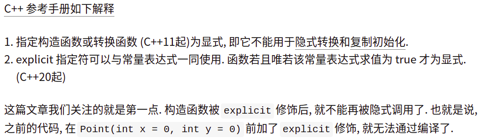

# CPP_explicit

[toc]

---

link: [explicit 说明符](https://zh.cppreference.com/w/cpp/language/explicit)

---

## 20210701

link: [https://zhuanlan.zhihu.com/p/52152355](https://zhuanlan.zhihu.com/p/52152355)

