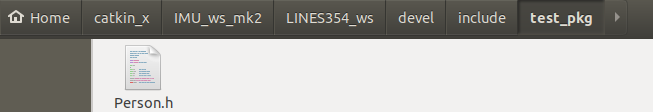

# 20211213_CHAP_02_ROS_COMMU

[TOC]

---

LOGS:

2021年12月13日：ros 通信


---


## 00. SOME POINTS

> 机器人是一种高度复杂的系统性实现，为了解耦合，在ROS中每一个功能点都是一个单独的进程，每一个进程都是独立运行的。
>
> **ROS是进程（也称为*****Nodes*****）的分布式框架。**
>
> 不同的进程是如何通信的？也即不同进程间如何实现数据交换的？

> ROS 中的基本通信机制主要有如下三种实现策略:
>
> - 话题通信(发布订阅模式)：topic -- talker <publish> + listener <subscrib>
> - 服务通信(请求响应模式)：service -- server <respond> + client <request> 
> - 参数服务器(参数共享模式)：parameter server


---

## 01. TOPIC (话题通信)

>话题通信是ROS中使用频率最高的一种通信模式，话题通信是基于**发布订阅**模式的，也即:一个节点发布消息，另一个节点订阅该消息。


>**概念**：以发布订阅的方式实现不同节点之间数据交互的通信模式。
>
>**作用**：用于不断更新的、少逻辑处理的数据传输场景。


### 01：理论模型（略）

> 该模型中涉及到三个角色:
>
> - ROS Master (管理者)
> - Talker (发布者)
> - Listener (订阅者)
>
> ROS Master 负责保管 Talker 和 Listener 注册的信息，并匹配话题相同的 Talker 与 Listener，帮助 Talker 与 Listener 建立连接，连接建立后，Talker 可以发布消息，且发布的消息会被 Listener 订阅。


参考：

link00: [2.1.1 话题通信理论模型 · GitBook (autolabor.com.cn)](http://www.autolabor.com.cn/book/ROSTutorials/di-2-zhang-ros-jia-gou-she-ji/22hua-ti-tong-xin/211-li-lun-mo-xing.html)


---


### 02：TOPIC 通信代码（cpp）

编写 TOPIC 通信代码，从设计到实现的流程：

1. 需求
2. 分析
3. 流程
4. 代码实现（发布方，talker）
5. 代码实现（接收方，listener）


#### 1. 需求：

> 1. 编写发布订阅实现
>
> 2. 发布方以10HZ(每秒10次)的频率发布文本消息
>
> 3. 订阅方订阅消息并将消息内容打印输出。


#### 2. 分析：

> 在模型实现中，需要关注的关键点有三个:
>
> 1. 发布方：talker/publisher（advertise）
> 2. 接收方：listener/subscriber（subscribe）
> 3. 数据（此处为普通文本）


#### 3. 流程：

>1. 编写发布方实现；
>2. 编写订阅方实现；
>3. 编辑配置文件；
>4. 编译并执行。


**文件结构：**

```shell
buntu:~/catkin_x/IMU_ws_mk2/LINES354_ws/src/test_pkg$ tree
.
├── CMakeLists.txt
├── include
│   └── test_pkg
├── package.xml
└── src
    ├── demo_01_topic_listener_node.cpp
    └── demo_01_topic_talker_node.cpp

3 directories, 4 files
```


#### 4. 代码实现（发布方，talker）★

```cpp
//
// Created by ds18 on 12/12/21.
//

/*
    需求: 实现基本的话题通信，一方发布数据，一方接收数据，
         实现的关键点:
         1.发送方
         2.接收方
         3.数据(此处为普通文本)

         PS: 二者需要设置相同的话题


    消息发布方:
        循环发布信息:HelloWorld 后缀数字编号

    实现流程:
        1.包含头文件
        2.初始化 ROS 节点:命名(唯一)
        3.实例化 ROS 句柄
        4.实例化 发布者 对象
        5.组织被发布的数据，并编写逻辑发布数据
*/


// 1.包含头文件
#include "ros/ros.h"
#include "std_msgs/String.h" //普通文本类型的消息
#include <sstream>

int main(int argc, char *argv[]) {
    //设置编码
    setlocale(LC_ALL, "");

    // 2.初始化 ROS 节点:命名(唯一)
    // 参数1和参数2 后期为节点传值会使用
    // 参数3 是节点名称，是一个标识符，需要保证运行后，在 ROS 网络拓扑中唯一
    ros::init(argc, argv, "demo_01_talker");

    // 3.实例化 ROS 句柄
    ros::NodeHandle nh;	//该类封装了 ROS 中的一些常用功能

    // 4.实例化 发布者 对象
    // 泛型: 发布的消息类型
    // 参数1: 要发布到的话题
    // 参数2: 队列中最大保存的消息数，超出此阀值时，先进的先销毁(时间早的先销毁)
    ros::Publisher pub = nh.advertise<std_msgs::String>("chatter", 10);

    // 5.组织被发布的数据，并编写逻辑发布数据
    // 数据(动态组织)
    std_msgs::String msg;
    // msg.data = "你好啊！！！";
    std::string msg_front = "Hello 你好！"; //消息前缀
    int count = 0; //消息计数器

    //逻辑(一秒10次)
    ros::Rate r(1);

    //节点不死
    while (ros::ok()) {
        //使用 stringstream 拼接字符串与编号
        std::stringstream ss;
        ss << msg_front << count;
        msg.data = ss.str();
        //发布消息
        pub.publish(msg);
        //加入调试，打印发送的消息
        ROS_INFO("发送的消息:%s", msg.data.c_str());

        //根据前面制定的发送贫频率自动休眠 休眠时间 = 1/频率；
        r.sleep();
        count++;//循环结束前，让 count 自增
        //暂无应用
        ros::spinOnce();
    }

    return 0;
}
```


**代码解释：**

定义消息内容：

```cpp
    std_msgs::String msg;
    std::string msg_front = "Hello 你好！"; 	 	// 消息前缀
    int count = 0; 							  	  // 消息计数器
```

处理并发布消息：

```cpp
        // 消息处理：使用 stringstream 拼接字符串与编号
        std::stringstream ss;
        ss << msg_front << count;
        msg.data = ss.str();					 // 给消息对象赋值内容
        
		// 发布消息
        pub.publish(msg);
```


#### 5. 代码实现（接收方，listener）★

```cpp
//
// Created by ds18 on 12/12/21.
//

/*
    需求: 实现基本的话题通信，一方发布数据，一方接收数据，
         实现的关键点:
         1.发送方
         2.接收方
         3.数据(此处为普通文本)


    消息订阅方:
        订阅话题并打印接收到的消息

    实现流程:
        1.包含头文件
        2.初始化 ROS 节点:命名(唯一)
        3.实例化 ROS 句柄
        4.实例化 订阅者 对象
        5.处理订阅的消息(回调函数)
        6.设置循环调用回调函数

*/

// 1.包含头文件
#include "ros/ros.h"
#include "std_msgs/String.h"

// 回调函数
void doMsg(const std_msgs::String::ConstPtr &msg_p) {
    ROS_INFO("我听见:%s", msg_p->data.c_str());
    // ROS_INFO("我听见:%s",(*msg_p).data.c_str());
}

int main(int argc, char *argv[]) {
    setlocale(LC_ALL, "");
    // 2.初始化 ROS 节点:命名(唯一)
    ros::init(argc, argv, "demo_01_listener");

    // 3.实例化 ROS 句柄
    ros::NodeHandle nh;

    // 4.实例化 订阅者 对象
    // 5.处理订阅的消息(回调函数)
    ros::Subscriber sub = nh.subscribe<std_msgs::String>("chatter", 10, doMsg);

    // 6.设置循环调用回调函数
    ros::spin();//循环读取接收的数据，并调用回调函数处理

    return 0;
}
```


**代码解释：**

创建一个 subscriber 对象用来订阅消息。当订阅者订阅消息（`nh.subscribe`）的时候：

1. 消息的类型 `std_msgs::String`，
2. 这个消息的话题名称（`topic name`）chatter，
3. 处理消息的队列长度 10，
4. 函数指针（回调函数）用来处理消息。

注：话题名称 `chatter`，对应的 talker 与 listener 必须相同。

```cpp
    ros::Subscriber sub = nh.subscribe<std_msgs::String>("chatter", 10, doMsg);
```

接收 `chatter` 中的 `std_msgs::String` 类型消息，使用指针的方式。然后对其进行处理。

```cpp
// 回调函数
void doMsg(const std_msgs::String::ConstPtr &msg_p) {
    ROS_INFO("我听见:%s", msg_p->data.c_str());
    // ROS_INFO("我听见:%s",(*msg_p).data.c_str());
}
```


#### 6. 修改 `CMakeLists.txt` ★

注：只显示需要修改的地方。

```cmake
add_executable(demo_01_topic_talker_node
        src/demo_01_topic_talker_node.cpp
        )

add_executable(demo_01_topic_listener_node
        src/demo_01_topic_listener_node.cpp
        )


target_link_libraries(demo_01_topic_talker_node
        ${catkin_LIBRARIES}
        )

target_link_libraries(demo_01_topic_listener_node
        ${catkin_LIBRARIES}
        )
```


##### cmake 讲解


```cmake
target_link_libraries(<target> ... <item>... ...)
```

>Specify libraries or flags to use when linking a given target and/or its dependents.
>
>指定 **连接给定目标和/或其依赖项时** 要使用的库或标志。  
>
>目标可以是可执行文件，或者是动态库文件；
>
>**即，指定目标可执行文件或动态库文件要使用的库或标志。**
>
>The named `<target>` must have been created by a command such as [`add_executable()`](https://cmake.org/cmake/help/v3.16/command/add_executable.html#command:add_executable) or [`add_library()`](https://cmake.org/cmake/help/v3.16/command/add_library.html#command:add_library) and must not be an [ALIAS target](https://cmake.org/cmake/help/v3.16/manual/cmake-buildsystem.7.html#alias-targets).
>
>命名的<目标>必须是由add_executable()或add_library()之类的命令创建的，并且不能是ALIAS目标。  


#### 7. 运行结果：★

使用命令：

```shell
roscore									# 启动 ros master, 参数服务器，rosout

rospack find package_name   			# 找到目标功能包
rosls package_name						# 列出包下所有
rosrun package_name binary_file_name	# 运行指定 ros 节点（二进制文件）
```

运行结果：

```shell
ds18@ubuntu:~/catkin_x/IMU_ws_mk2/LINES354_ws$ rosrun test_pkg demo_01_topic_talker_node
[ INFO] [1639377415.743590343]: 发送的消息:Hello 你好！0
[ INFO] [1639377416.743835548]: 发送的消息:Hello 你好！1
[ INFO] [1639377417.744560726]: 发送的消息:Hello 你好！2
...
[ INFO] [1639377456.744490916]: 发送的消息:Hello 你好！41
[ INFO] [1639377457.744019092]: 发送的消息:Hello 你好！42
[ INFO] [1639377458.744275328]: 发送的消息:Hello 你好！43
[ INFO] [1639377459.744033023]: 发送的消息:Hello 你好！44
[ INFO] [1639377460.744089046]: 发送的消息:Hello 你好！45

---+---+---+---+---+---+---+---+---+---+---+---+---+---+---+---+---+

ds18@ubuntu:~/catkin_x/IMU_ws_mk2/LINES354_ws$ rosrun test_pkg demo_01_topic_listener_node
[ INFO] [1639377453.744677739]: 我听见:Hello 你好！38
[ INFO] [1639377454.744289378]: 我听见:Hello 你好！39
[ INFO] [1639377455.744908755]: 我听见:Hello 你好！40
[ INFO] [1639377456.744991311]: 我听见:Hello 你好！41
[ INFO] [1639377457.745011029]: 我听见:Hello 你好！42
[ INFO] [1639377458.744579772]: 我听见:Hello 你好！43
[ INFO] [1639377459.744694963]: 我听见:Hello 你好！44
```


---


### 04：TOPIC 话题通信 自定义 msg ★

> **需求：**创建自定义消息，该消息包含人的信息：姓名、身高、年龄等。
>
> **流程：**
>
> 1. 按照固定格式创建 msg 文件
> 2. 编辑配置文件
> 3. 编译生成可以被 Python 或 C++ 调用的中间文件


#### 1. 自定义 msg 流程

文件结构：

```shell
mkdir msg
cd msg
touch Person.msg

ds18@ubuntu:~/catkin_x/IMU_ws_mk2/LINES354_ws/src/test_pkg$ tree
.
├── CMakeLists.txt
├── include
│   └── test_pkg
├── msg
│   └── Person.msg
├── package.xml
└── src
    ├── demo_01_topic_listener_node.cpp
    └── demo_01_topic_talker_node.cpp

4 directories, 5 files
```


1. **定义 msg 文件**

   `Person.msg`

   ```
   string name
   uint16 age
   float64 height
   ```

   

2. **编辑配置文件 `package.xml`**

   追加编译依赖与执行依赖

   ```xml
     <build_depend>message_generation</build_depend>
     <exec_depend>message_runtime</exec_depend>
   ```

   

3. **编辑配置文件 `CMakeLists.txt`**

   ```cmake
   ## 1. 在 find_package 中添加 message_generation 包依赖
   find_package(catkin REQUIRED COMPONENTS
     roscpp
     rospy
     std_msgs
     message_generation  # 需要加入 message_generation,必须有 std_msgs
   )
   
   
   ## 2. 声明要构建哪些消息，配置 msg 源文件
   add_message_files(
       FILES
       Person.msg
   )
   
   
   ## 3. 声明生成上述消息、服务需要依赖的消息以及服务
   generate_messages(
       DEPENDENCIES
       std_msgs  # 生成消息时依赖于 std_msgs
   )
   
   
   ## 4. 声明运行时依赖项
   catkin_package(
   #  INCLUDE_DIRS include
   #  LIBRARIES test_pkg
       CATKIN_DEPENDS roscpp rospy std_msgs message_runtime  #执行时依赖
   #  DEPENDS system_lib
   )
   ```

   


4. **编译工作空间**

   ```shell
   cd Xxx_ws
   catkin_make
   ```

   完成编译后，会在 `.../Xxx_ws/devel/include/package_name/` 下自动生成 `Person.h`:

   
   
   这个是 CPP 源码中需要调用的中间文件（自定义消息头文件）。
   
   ```cpp
   // Person.h
   // Generated by gencpp from file test_pkg/Person.msg
   // DO NOT EDIT!
   
   
   #ifndef TEST_PKG_MESSAGE_PERSON_H
   #define TEST_PKG_MESSAGE_PERSON_H
   
   
   #include <string>
   #include <vector>
   #include <map>
   
   #include <ros/types.h>
   #include <ros/serialization.h>
   #include <ros/builtin_message_traits.h>
   #include <ros/message_operations.h>
   
   
   namespace test_pkg
   {
   template <class ContainerAllocator>
   struct Person_
   {
     typedef Person_<ContainerAllocator> Type;
   
     Person_()
       : name()
       , age(0)
       , height(0.0)  {
       }
     Person_(const ContainerAllocator& _alloc)
       : name(_alloc)
       , age(0)
       , height(0.0)  {
     (void)_alloc;
       }
   
   
   
      typedef std::basic_string<char, std::char_traits<char>, typename ContainerAllocator::template rebind<char>::other >  _name_type;
     _name_type name;
   
      typedef uint16_t _age_type;
     _age_type age;
   
      typedef double _height_type;
     _height_type height;
   
   
   
   
   
     typedef boost::shared_ptr< ::test_pkg::Person_<ContainerAllocator> > Ptr;
     typedef boost::shared_ptr< ::test_pkg::Person_<ContainerAllocator> const> ConstPtr;
   
   }; // struct Person_
   
   typedef ::test_pkg::Person_<std::allocator<void> > Person;
   
   typedef boost::shared_ptr< ::test_pkg::Person > PersonPtr;
   typedef boost::shared_ptr< ::test_pkg::Person const> PersonConstPtr;
   
   // constants requiring out of line definition
   
   
   
   template<typename ContainerAllocator>
   std::ostream& operator<<(std::ostream& s, const ::test_pkg::Person_<ContainerAllocator> & v)
   {
   ros::message_operations::Printer< ::test_pkg::Person_<ContainerAllocator> >::stream(s, "", v);
   return s;
   }
   
   
   template<typename ContainerAllocator1, typename ContainerAllocator2>
   bool operator==(const ::test_pkg::Person_<ContainerAllocator1> & lhs, const ::test_pkg::Person_<ContainerAllocator2> & rhs)
   {
     return lhs.name == rhs.name &&
       lhs.age == rhs.age &&
       lhs.height == rhs.height;
   }
   
   template<typename ContainerAllocator1, typename ContainerAllocator2>
   bool operator!=(const ::test_pkg::Person_<ContainerAllocator1> & lhs, const ::test_pkg::Person_<ContainerAllocator2> & rhs)
   {
     return !(lhs == rhs);
   }
   
   
   } // namespace test_pkg
   
   namespace ros
   {
   namespace message_traits
   {
   
   
   
   
   
   template <class ContainerAllocator>
   struct IsFixedSize< ::test_pkg::Person_<ContainerAllocator> >
     : FalseType
     { };
   
   template <class ContainerAllocator>
   struct IsFixedSize< ::test_pkg::Person_<ContainerAllocator> const>
     : FalseType
     { };
   
   template <class ContainerAllocator>
   struct IsMessage< ::test_pkg::Person_<ContainerAllocator> >
     : TrueType
     { };
   
   template <class ContainerAllocator>
   struct IsMessage< ::test_pkg::Person_<ContainerAllocator> const>
     : TrueType
     { };
   
   template <class ContainerAllocator>
   struct HasHeader< ::test_pkg::Person_<ContainerAllocator> >
     : FalseType
     { };
   
   template <class ContainerAllocator>
   struct HasHeader< ::test_pkg::Person_<ContainerAllocator> const>
     : FalseType
     { };
   
   
   template<class ContainerAllocator>
   struct MD5Sum< ::test_pkg::Person_<ContainerAllocator> >
   {
     static const char* value()
     {
       return "81ccf2097ef38ca6466e5a60ea1f8e49";
     }
   
     static const char* value(const ::test_pkg::Person_<ContainerAllocator>&) { return value(); }
     static const uint64_t static_value1 = 0x81ccf2097ef38ca6ULL;
     static const uint64_t static_value2 = 0x466e5a60ea1f8e49ULL;
   };
   
   template<class ContainerAllocator>
   struct DataType< ::test_pkg::Person_<ContainerAllocator> >
   {
     static const char* value()
     {
       return "test_pkg/Person";
     }
   
     static const char* value(const ::test_pkg::Person_<ContainerAllocator>&) { return value(); }
   };
   
   template<class ContainerAllocator>
   struct Definition< ::test_pkg::Person_<ContainerAllocator> >
   {
     static const char* value()
     {
       return "string name\n"
   "uint16 age\n"
   "float64 height\n"
   ;
     }
   
     static const char* value(const ::test_pkg::Person_<ContainerAllocator>&) { return value(); }
   };
   
   } // namespace message_traits
   } // namespace ros
   
   namespace ros
   {
   namespace serialization
   {
   
     template<class ContainerAllocator> struct Serializer< ::test_pkg::Person_<ContainerAllocator> >
     {
       template<typename Stream, typename T> inline static void allInOne(Stream& stream, T m)
       {
         stream.next(m.name);
         stream.next(m.age);
         stream.next(m.height);
       }
   
       ROS_DECLARE_ALLINONE_SERIALIZER
     }; // struct Person_
   
   } // namespace serialization
   } // namespace ros
   
   namespace ros
   {
   namespace message_operations
   {
   
   template<class ContainerAllocator>
   struct Printer< ::test_pkg::Person_<ContainerAllocator> >
   {
     template<typename Stream> static void stream(Stream& s, const std::string& indent, const ::test_pkg::Person_<ContainerAllocator>& v)
     {
       s << indent << "name: ";
       Printer<std::basic_string<char, std::char_traits<char>, typename ContainerAllocator::template rebind<char>::other > >::stream(s, indent + "  ", v.name);
       s << indent << "age: ";
       Printer<uint16_t>::stream(s, indent + "  ", v.age);
       s << indent << "height: ";
       Printer<double>::stream(s, indent + "  ", v.height);
     }
   };
   
   } // namespace message_operations
   } // namespace ros
   
   #endif // TEST_PKG_MESSAGE_PERSON_H
   
   ```
   
   


---


### 05：TOPIC 话题通信 自定义 msg 调用（cpp）★

#### 1. 需求：

>1. 编写发布（talker/publisher: advertise）订阅（listener/subscriber: subscribe）实现，
>
>2. 要求发布方（talker/publisher）以10HZ（每秒10次，`ros::Rate r(10)`）的频率发布自定义消息，
>
>3. 订阅方订阅自定义消息并将消息内容打印输出。

#### 2. 分析：


#### 3. 流程：


#### 4. 代码实现（发布方，talker）：


#### 5. 代码实现（接收方，listener）：


#### 6. 修改 `CMakeLists.txt`：


#### 7. 运行结果：


---

## 02. SERVICE (服务通信)


---

## 03. PARAMETER SERVER (参数服务器)


---

## 04.  


---

## 参考

link01: [rosparam和ROS参数服务](https://blog.csdn.net/u014695839/article/details/78348600)

link02: [在ROS中处理yaml文件](https://blog.csdn.net/u014610460/article/details/79508869)

link03: [ROS下的CMakeList.txt编写](https://blog.csdn.net/TurboIan/article/details/74604052)

link04: []()

link05: []()

link06: []()

link07: []()


