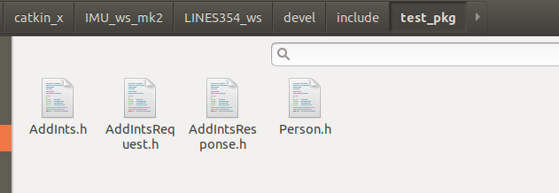

# 20211213_CHAP_02_ROS_COMMU

[TOC]

---

LOGS:

2021年12月13日：ros 通信


---


## 00. SOME POINTS

> 机器人是一种高度复杂的系统性实现，为了解耦合，在ROS中每一个功能点都是一个单独的进程，每一个进程都是独立运行的。
>
> **ROS是进程（也称为*****Nodes*****）的分布式框架。**
>
> 不同的进程是如何通信的？也即不同进程间如何实现数据交换的？

> ROS 中的基本通信机制主要有如下三种实现策略:
>
> - 话题通信(发布订阅模式)：topic -- talker <publish> + listener <subscrib>
> - 服务通信(请求响应模式)：service -- server <respond> + client <request> 
> - 参数服务器(参数共享模式)：parameter server


---

## 01. TOPIC (话题通信)

>**简介**：话题通信是ROS中使用频率最高的一种通信模式，话题通信是基于**发布订阅**模式的，也即:一个节点发布消息，另一个节点订阅该消息。

>**概念**：以发布订阅的方式实现不同节点之间数据交互的通信模式。
>
>**作用**：用于不断更新的、少逻辑处理的数据传输场景。


### 01：理论模型（略）

> 该模型中涉及到三个角色:
>
> - ROS Master (管理者)
> - Talker (发布者)
> - Listener (订阅者)
>
> ROS Master 负责保管 Talker 和 Listener 注册的信息，并匹配话题相同的 Talker 与 Listener，帮助 Talker 与 Listener 建立连接，连接建立后，Talker 可以发布消息，且发布的消息会被 Listener 订阅。


参考：

link00: [2.1.1 话题通信理论模型 · GitBook (autolabor.com.cn)](http://www.autolabor.com.cn/book/ROSTutorials/di-2-zhang-ros-jia-gou-she-ji/22hua-ti-tong-xin/211-li-lun-mo-xing.html)


---


### 02：TOPIC 通信代码（cpp）

编写 TOPIC 通信代码，从设计到实现的流程：

1. 需求
2. 分析
3. 流程
4. 代码实现（发布方，talker）
5. 代码实现（接收方，listener）


#### 1. 需求：

> 1. 编写发布订阅实现
>
> 2. 发布方以10HZ(每秒10次)的频率发布文本消息
>
> 3. 订阅方订阅消息并将消息内容打印输出。


#### 2. 分析：

> 在模型实现中，需要关注的关键点有三个:
>
> 1. 发布方：talker/publisher（advertise）
> 2. 接收方：listener/subscriber（subscribe）
> 3. 数据（此处为普通文本）


#### 3. 流程：

>1. 编写发布方实现；
>2. 编写订阅方实现；
>3. 编辑配置文件；
>4. 编译并执行。


**文件结构：**

```shell
buntu:~/catkin_x/IMU_ws_mk2/LINES354_ws/src/test_pkg$ tree
.
├── CMakeLists.txt
├── include
│   └── test_pkg
├── package.xml
└── src
    ├── demo_01_topic_listener_node.cpp
    └── demo_01_topic_talker_node.cpp

3 directories, 4 files
```


#### 4. 代码实现（发布方，talker）★

```cpp
//
// Created by ds18 on 12/12/21.
//

/*
    需求: 实现基本的话题通信，一方发布数据，一方接收数据，
         实现的关键点:
         1.发送方
         2.接收方
         3.数据(此处为普通文本)

         PS: 二者需要设置相同的话题


    消息发布方:
        循环发布信息:HelloWorld 后缀数字编号

    实现流程:
        1.包含头文件
        2.初始化 ROS 节点:命名(唯一)
        3.实例化 ROS 句柄
        4.实例化 发布者 对象
        5.组织被发布的数据，并编写逻辑发布数据
*/


// 1.包含头文件
#include "ros/ros.h"
#include "std_msgs/String.h" //普通文本类型的消息
#include <sstream>

int main(int argc, char *argv[]) {
    //设置编码
    setlocale(LC_ALL, "");

    // 2.初始化 ROS 节点:命名(唯一)
    // 参数1和参数2 后期为节点传值会使用
    // 参数3 是节点名称，是一个标识符，需要保证运行后，在 ROS 网络拓扑中唯一
    ros::init(argc, argv, "demo_01_talker");

    // 3.实例化 ROS 句柄
    ros::NodeHandle nh;	//该类封装了 ROS 中的一些常用功能

    // 4.实例化 发布者 对象
    // 泛型: 发布的消息类型
    // 参数1: 要发布到的话题
    // 参数2: 队列中最大保存的消息数，超出此阀值时，先进的先销毁(时间早的先销毁)
    ros::Publisher pub = nh.advertise<std_msgs::String>("chatter", 10);

    // 5.组织被发布的数据，并编写逻辑发布数据
    // 数据(动态组织)
    std_msgs::String msg;
    // msg.data = "你好啊！！！";
    std::string msg_front = "Hello 你好！"; //消息前缀
    int count = 0; //消息计数器

    //逻辑(一秒10次)
    ros::Rate r(1);

    //节点不死
    while (ros::ok()) {
        //使用 stringstream 拼接字符串与编号
        std::stringstream ss;
        ss << msg_front << count;
        msg.data = ss.str();
        //发布消息
        pub.publish(msg);
        //加入调试，打印发送的消息
        ROS_INFO("发送的消息:%s", msg.data.c_str());

        //根据前面制定的发送贫频率自动休眠 休眠时间 = 1/频率；
        r.sleep();
        count++;//循环结束前，让 count 自增
        //暂无应用
        ros::spinOnce();
    }

    return 0;
}
```


**代码解释：**

定义消息内容：

```cpp
    std_msgs::String msg;
    std::string msg_front = "Hello 你好！"; 	 	// 消息前缀
    int count = 0; 							  	  // 消息计数器
```

处理并发布消息：

```cpp
        // 消息处理：使用 stringstream 拼接字符串与编号
        std::stringstream ss;
        ss << msg_front << count;
        msg.data = ss.str();					 // 给消息对象赋值内容
        
		// 发布消息
        pub.publish(msg);
```


#### 5. 代码实现（接收方，listener）★

```cpp
//
// Created by ds18 on 12/12/21.
//

/*
    需求: 实现基本的话题通信，一方发布数据，一方接收数据，
         实现的关键点:
         1.发送方
         2.接收方
         3.数据(此处为普通文本)


    消息订阅方:
        订阅话题并打印接收到的消息

    实现流程:
        1.包含头文件
        2.初始化 ROS 节点:命名(唯一)
        3.实例化 ROS 句柄
        4.实例化 订阅者 对象
        5.处理订阅的消息(回调函数)
        6.设置循环调用回调函数

*/

// 1.包含头文件
#include "ros/ros.h"
#include "std_msgs/String.h"

// 回调函数
void doMsg(const std_msgs::String::ConstPtr &msg_p) {
    ROS_INFO("我听见:%s", msg_p->data.c_str());
    // ROS_INFO("我听见:%s",(*msg_p).data.c_str());
}

int main(int argc, char *argv[]) {
    setlocale(LC_ALL, "");
    // 2.初始化 ROS 节点:命名(唯一)
    ros::init(argc, argv, "demo_01_listener");

    // 3.实例化 ROS 句柄
    ros::NodeHandle nh;

    // 4.实例化 订阅者 对象
    // 5.处理订阅的消息(回调函数)
    ros::Subscriber sub = nh.subscribe<std_msgs::String>("chatter", 10, doMsg);

    // 6.设置循环调用回调函数
    ros::spin();//循环读取接收的数据，并调用回调函数处理

    return 0;
}
```


**代码解释：**

创建一个 subscriber 对象用来订阅消息。当订阅者订阅消息（`nh.subscribe`）的时候：

1. 消息的类型 `std_msgs::String`，
2. 这个消息的话题名称（`topic name`）chatter，
3. 处理消息的队列长度 10，
4. 函数指针（回调函数）用来处理消息。

注：话题名称 `chatter`，对应的 talker 与 listener 必须相同。

```cpp
    ros::Subscriber sub = nh.subscribe<std_msgs::String>("chatter", 10, doMsg);
```

接收 `chatter` 中的 `std_msgs::String` 类型消息，使用指针的方式。然后对其进行处理。

```cpp
// 回调函数
void doMsg(const std_msgs::String::ConstPtr &msg_p) {
    ROS_INFO("我听见:%s", msg_p->data.c_str());
    // ROS_INFO("我听见:%s",(*msg_p).data.c_str());
}
```


#### 6. 修改 `CMakeLists.txt` ★

注：只显示需要修改的地方。

```cmake
add_executable(demo_01_topic_talker_node
        src/demo_01_topic_talker_node.cpp
        )

add_executable(demo_01_topic_listener_node
        src/demo_01_topic_listener_node.cpp
        )


target_link_libraries(demo_01_topic_talker_node
        ${catkin_LIBRARIES}
        )

target_link_libraries(demo_01_topic_listener_node
        ${catkin_LIBRARIES}
        )
```


##### cmake 讲解


```cmake
target_link_libraries(<target> ... <item>... ...)
```

>Specify libraries or flags to use when linking a given target and/or its dependents.
>
>指定 **连接给定目标和/或其依赖项时** 要使用的库或标志。  
>
>目标可以是可执行文件，或者是动态库文件；
>
>**即，指定目标可执行文件或动态库文件要使用的库或标志。**
>
>The named `<target>` must have been created by a command such as [`add_executable()`](https://cmake.org/cmake/help/v3.16/command/add_executable.html#command:add_executable) or [`add_library()`](https://cmake.org/cmake/help/v3.16/command/add_library.html#command:add_library) and must not be an [ALIAS target](https://cmake.org/cmake/help/v3.16/manual/cmake-buildsystem.7.html#alias-targets).
>
>命名的<目标>必须是由add_executable()或add_library()之类的命令创建的，并且不能是ALIAS目标。  


#### 7. 运行结果：

使用命令：

```shell
roscore									# 启动 ros master, 参数服务器，rosout

rospack find package_name   			# 找到目标功能包
rosls package_name						# 列出包下所有
rosrun package_name binary_file_name	# 运行指定 ros 节点（二进制文件）
```

运行结果：

```shell
ds18@ubuntu:~/catkin_x/IMU_ws_mk2/LINES354_ws$ rosrun test_pkg demo_01_topic_talker_node
[ INFO] [1639377415.743590343]: 发送的消息:Hello 你好！0
[ INFO] [1639377416.743835548]: 发送的消息:Hello 你好！1
[ INFO] [1639377417.744560726]: 发送的消息:Hello 你好！2
...
[ INFO] [1639377456.744490916]: 发送的消息:Hello 你好！41
[ INFO] [1639377457.744019092]: 发送的消息:Hello 你好！42
[ INFO] [1639377458.744275328]: 发送的消息:Hello 你好！43
[ INFO] [1639377459.744033023]: 发送的消息:Hello 你好！44
[ INFO] [1639377460.744089046]: 发送的消息:Hello 你好！45

---+---+---+---+---+---+---+---+---+---+---+---+---+---+---+---+---+

ds18@ubuntu:~/catkin_x/IMU_ws_mk2/LINES354_ws$ rosrun test_pkg demo_01_topic_listener_node
[ INFO] [1639377453.744677739]: 我听见:Hello 你好！38
[ INFO] [1639377454.744289378]: 我听见:Hello 你好！39
[ INFO] [1639377455.744908755]: 我听见:Hello 你好！40
[ INFO] [1639377456.744991311]: 我听见:Hello 你好！41
[ INFO] [1639377457.745011029]: 我听见:Hello 你好！42
[ INFO] [1639377458.744579772]: 我听见:Hello 你好！43
[ INFO] [1639377459.744694963]: 我听见:Hello 你好！44
```


---


### 04：TOPIC 话题通信 自定义 msg ★

> **需求：**创建自定义消息，该消息包含人的信息：姓名、身高、年龄等。
>
> **流程：**
>
> 1. 按照固定格式创建 msg 文件
> 2. 编辑配置文件
> 3. 编译生成可以被 Python 或 C++ 调用的中间文件


文件结构：

```shell
mkdir msg
cd msg
touch Person.msg

ds18@ubuntu:~/catkin_x/IMU_ws_mk2/LINES354_ws/src/test_pkg$ tree
.
├── CMakeLists.txt
├── include
│   └── test_pkg
├── msg
│   └── Person.msg
├── package.xml
└── src
    ├── demo_01_topic_listener_node.cpp
    └── demo_01_topic_talker_node.cpp

4 directories, 5 files
```


#### 1. **定义 msg 文件**

`Person.msg`

```
string name
uint16 age
float64 height
```

   

#### 2. **编辑配置文件 `package.xml`**

追加编译依赖与执行依赖

```xml
<build_depend>message_generation</build_depend>
<exec_depend>message_runtime</exec_depend>
```

   

#### 3. **编辑配置文件 `CMakeLists.txt`**

```cmake
## 1. 在 find_package 中添加 message_generation 包依赖
find_package(catkin REQUIRED COMPONENTS
	roscpp
	rospy
	std_msgs
	message_generation  # 需要加入 message_generation,必须有 std_msgs
)


## 2. 声明要构建哪些消息，配置 msg 源文件
add_message_files(
	FILES
	Person.msg
)


## 3. 声明生成上述消息、服务需要依赖的消息以及服务
generate_messages(
	DEPENDENCIES
	std_msgs  # 生成消息时依赖于 std_msgs
)


## 4. 声明运行时依赖项
catkin_package(
#  INCLUDE_DIRS include
#  LIBRARIES test_pkg
	CATKIN_DEPENDS roscpp rospy std_msgs message_runtime  #执行时依赖
#  DEPENDS system_lib
)
```

   


#### 4. **编译工作空间**

```shell
cd Xxx_ws
catkin_make
```

完成编译后，会在 `.../Xxx_ws/devel/include/package_name/` 下自动生成 `Person.h`:


这个是 CPP 源码中需要调用的中间文件（自定义消息头文件）。

   ```cpp
   // Person.h
   // Generated by gencpp from file test_pkg/Person.msg
   // DO NOT EDIT!
   
   
   #ifndef TEST_PKG_MESSAGE_PERSON_H
   #define TEST_PKG_MESSAGE_PERSON_H
   
   
   #include <string>
   #include <vector>
   #include <map>
   
   #include <ros/types.h>
   #include <ros/serialization.h>
   #include <ros/builtin_message_traits.h>
   #include <ros/message_operations.h>
   
   
   namespace test_pkg
   {
   template <class ContainerAllocator>
   struct Person_
   {
     typedef Person_<ContainerAllocator> Type;
   
     Person_()
       : name()
       , age(0)
       , height(0.0)  {
       }
     Person_(const ContainerAllocator& _alloc)
       : name(_alloc)
       , age(0)
       , height(0.0)  {
     (void)_alloc;
       }
   
   
   
      typedef std::basic_string<char, std::char_traits<char>, typename ContainerAllocator::template rebind<char>::other >  _name_type;
     _name_type name;
   
      typedef uint16_t _age_type;
     _age_type age;
   
      typedef double _height_type;
     _height_type height;
   
   
   
   
   
     typedef boost::shared_ptr< ::test_pkg::Person_<ContainerAllocator> > Ptr;
     typedef boost::shared_ptr< ::test_pkg::Person_<ContainerAllocator> const> ConstPtr;
   
   }; // struct Person_
   
   typedef ::test_pkg::Person_<std::allocator<void> > Person;
   
   typedef boost::shared_ptr< ::test_pkg::Person > PersonPtr;
   typedef boost::shared_ptr< ::test_pkg::Person const> PersonConstPtr;
   
   // constants requiring out of line definition
   
   
   
   template<typename ContainerAllocator>
   std::ostream& operator<<(std::ostream& s, const ::test_pkg::Person_<ContainerAllocator> & v)
   {
   ros::message_operations::Printer< ::test_pkg::Person_<ContainerAllocator> >::stream(s, "", v);
   return s;
   }
   
   
   template<typename ContainerAllocator1, typename ContainerAllocator2>
   bool operator==(const ::test_pkg::Person_<ContainerAllocator1> & lhs, const ::test_pkg::Person_<ContainerAllocator2> & rhs)
   {
     return lhs.name == rhs.name &&
       lhs.age == rhs.age &&
       lhs.height == rhs.height;
   }
   
   template<typename ContainerAllocator1, typename ContainerAllocator2>
   bool operator!=(const ::test_pkg::Person_<ContainerAllocator1> & lhs, const ::test_pkg::Person_<ContainerAllocator2> & rhs)
   {
     return !(lhs == rhs);
   }
   
   
   } // namespace test_pkg
   
   namespace ros
   {
   namespace message_traits
   {
   
   
   
   
   
   template <class ContainerAllocator>
   struct IsFixedSize< ::test_pkg::Person_<ContainerAllocator> >
     : FalseType
     { };
   
   template <class ContainerAllocator>
   struct IsFixedSize< ::test_pkg::Person_<ContainerAllocator> const>
     : FalseType
     { };
   
   template <class ContainerAllocator>
   struct IsMessage< ::test_pkg::Person_<ContainerAllocator> >
     : TrueType
     { };
   
   template <class ContainerAllocator>
   struct IsMessage< ::test_pkg::Person_<ContainerAllocator> const>
     : TrueType
     { };
   
   template <class ContainerAllocator>
   struct HasHeader< ::test_pkg::Person_<ContainerAllocator> >
     : FalseType
     { };
   
   template <class ContainerAllocator>
   struct HasHeader< ::test_pkg::Person_<ContainerAllocator> const>
     : FalseType
     { };
   
   
   template<class ContainerAllocator>
   struct MD5Sum< ::test_pkg::Person_<ContainerAllocator> >
   {
     static const char* value()
     {
       return "81ccf2097ef38ca6466e5a60ea1f8e49";
     }
   
     static const char* value(const ::test_pkg::Person_<ContainerAllocator>&) { return value(); }
     static const uint64_t static_value1 = 0x81ccf2097ef38ca6ULL;
     static const uint64_t static_value2 = 0x466e5a60ea1f8e49ULL;
   };
   
   template<class ContainerAllocator>
   struct DataType< ::test_pkg::Person_<ContainerAllocator> >
   {
     static const char* value()
     {
       return "test_pkg/Person";
     }
   
     static const char* value(const ::test_pkg::Person_<ContainerAllocator>&) { return value(); }
   };
   
   template<class ContainerAllocator>
   struct Definition< ::test_pkg::Person_<ContainerAllocator> >
   {
     static const char* value()
     {
       return "string name\n"
   "uint16 age\n"
   "float64 height\n"
   ;
     }
   
     static const char* value(const ::test_pkg::Person_<ContainerAllocator>&) { return value(); }
   };
   
   } // namespace message_traits
   } // namespace ros
   
   namespace ros
   {
   namespace serialization
   {
   
     template<class ContainerAllocator> struct Serializer< ::test_pkg::Person_<ContainerAllocator> >
     {
       template<typename Stream, typename T> inline static void allInOne(Stream& stream, T m)
       {
         stream.next(m.name);
         stream.next(m.age);
         stream.next(m.height);
       }
   
       ROS_DECLARE_ALLINONE_SERIALIZER
     }; // struct Person_
   
   } // namespace serialization
   } // namespace ros
   
   namespace ros
   {
   namespace message_operations
   {
   
   template<class ContainerAllocator>
   struct Printer< ::test_pkg::Person_<ContainerAllocator> >
   {
     template<typename Stream> static void stream(Stream& s, const std::string& indent, const ::test_pkg::Person_<ContainerAllocator>& v)
     {
       s << indent << "name: ";
       Printer<std::basic_string<char, std::char_traits<char>, typename ContainerAllocator::template rebind<char>::other > >::stream(s, indent + "  ", v.name);
       s << indent << "age: ";
       Printer<uint16_t>::stream(s, indent + "  ", v.age);
       s << indent << "height: ";
       Printer<double>::stream(s, indent + "  ", v.height);
     }
   };
   
   } // namespace message_operations
   } // namespace ros
   
   #endif // TEST_PKG_MESSAGE_PERSON_H
   
   ```

   


---


### 05：TOPIC 话题通信 自定义 msg 调用（cpp）★

#### 1. 需求：

>1. 编写发布（talker/publisher: advertise）订阅（listener/subscriber: subscribe）实现，
>
>2. 要求发布方（talker/publisher）以10HZ（每秒10次，`ros::Rate r(10)`）的频率发布自定义消息，
>
>3. 订阅方订阅自定义消息并将消息内容打印输出。

#### 2. 分析：

> 在模型实现中，需要关注的关键点有三个:
>
> 1. 发布方
> 2. 接收方
> 3. 数据(此处为自定义消息)

#### 3. 流程：

>1. 编写发布方实现；
>2. 编写订阅方实现；
>3. 编辑配置文件；
>4. 编译并执行。

#### 4. 代码实现（发布方，talker）：★

流程：

> 1. 初始化 ROS 节点：`ros::init(argc, argv, "节点名称")`
> 2. 创建 ROS 节点句柄：`ros::nodeHandle nh`
> 3. 创建发布者对象：`ros::Publisher pub = nh.advertise<消息类型>("话题名称"，消息队列大小)`
> 4. 编辑消息内容：`消息类型 消息对象`，`消息对象.消息对象成员`
> 5. 循环发布消息：`pub.publish(消息对象)`

```cpp
/*
    需求: 循环发布人的信息
*/

#include "ros/ros.h"
//#include "demo_02_talker_listener/Person.h"
#include "test_pkg/Person.h"    // package_name/msg_name.h

int main(int argc, char *argv[]) {
    setlocale(LC_ALL, "");

    //1.初始化 ROS 节点
    ros::init(argc, argv, "talker_person");

    //2.创建 ROS 句柄
    ros::NodeHandle nh;

    //3.创建发布者对象
    ros::Publisher pub = nh.advertise<test_pkg::Person>("chatter_person", 1000);

    //4.组织被发布的消息，编写发布逻辑并发布消息
    test_pkg::Person p;
    p.name = "sunwukong";
    p.age = 2000;
    p.height = 1.45;

    ros::Rate r(1);
    while (ros::ok()) {
        pub.publish(p);
        p.age += 1;
        ROS_INFO("我叫:%s,今年%d岁,高%.2f米", p.name.c_str(), p.age, p.height);

        r.sleep();
        ros::spinOnce();	// process a single round of callbacks
    }


    return 0;
}
```

**代码解释：**

包含的消息头文件：`test_pkg/Person.h`，这个文件的路径查找可以通过以下方式：

```shell
# 这个是生成的 .h 文件所在包
ds18@ubuntu:~/catkin_x/IMU_ws_mk2/LINES354_ws/devel/include/test_pkg$ pwd
/home/ds18/catkin_x/IMU_ws_mk2/LINES354_ws/devel/include/test_pkg

# 这个是 .h 文件名
ds18@ubuntu:~/catkin_x/IMU_ws_mk2/LINES354_ws/devel/include/test_pkg$ ls
Person.h
```

如何使用自定义消息：

```cpp
    test_pkg::Person p;				// 创建自定义消息对象
    p.name = "sunwukong";			// 根据消息结构体进行赋值
    p.age = 2000;					// 根据消息结构体进行赋值
    p.height = 1.45;				// 根据消息结构体进行赋值


// 消息结构体
namespace test_pkg
{
template <class ContainerAllocator>
struct Person_
{
  typedef Person_<ContainerAllocator> Type;

  Person_()
    : name()
    , age(0)
    , height(0.0)  {
    }
  Person_(const ContainerAllocator& _alloc)
    : name(_alloc)
    , age(0)
    , height(0.0)  {
  (void)_alloc;
    }
    
    ...
        
}	// end of namespace test_pkg
```

如何发布自定义消息：

```cpp
pub.publish(p);			// talker 发布消息
```


#### 5. 代码实现（接收方，listener）：★

流程：

> 1. 初始化 ROS 节点：`ros::init(argc, argv, "节点名称")`
> 2. 创建 ROS 节点句柄：`ros::nodeHandle nh`
> 3. 创建订阅者对象：`ros::subscriber sub = nh.subscribe<消息类型>(话题名称，消息队列长度，消息处理回调函数)`
> 4. 同时在订阅者对象订阅函数中使用回调函数处理消息：`回调函数`

```cpp
/*
    需求: 订阅人的信息
*/

#include "ros/ros.h"
//#include "demo02_talker_listener/Person.h"
#include "test_pkg/Person.h"

// 回调函数
void doPerson(const test_pkg::Person::ConstPtr &person_p) {
    ROS_INFO("订阅的人信息:%s, %d, %.2f", person_p->name.c_str(), person_p->age, person_p->height);
}

int main(int argc, char *argv[]) {
    setlocale(LC_ALL, "");

    //1.初始化 ROS 节点
    ros::init(argc, argv, "listener_person");
    
    //2.创建 ROS 句柄
    ros::NodeHandle nh;
    
    //3.创建订阅对象
    //4.回调函数中处理 person
    ros::Subscriber sub = nh.subscribe<test_pkg::Person>("chatter_person", 10, doPerson);

    //5.ros::spin();
    ros::spin();
    return 0;
}
```

**代码解释：**

订阅者订阅自定义消息话题：

```cpp
// 订阅函数：节点句柄对象.subscribe
// 消息类型：test_pkg::Person
// 话题名称：chatter_persion
// 消息处理函数：doPerson

ros::Subscriber sub = nh.subscribe<test_pkg::Person>("chatter_person", 10, doPerson);

// ---+---+---+---+---+---+---+---+---+---+---+---+---+---+---+---+---+---+---+
    
// 回调函数
// 参数：消息指针：test_pkg::Person::ConstPtr
void doPerson(const test_pkg::Person::ConstPtr &person_p) {
    ROS_INFO("订阅的人信息:%s, %d, %.2f", person_p->name.c_str(), person_p->age, person_p->height);
}

```


#### 6. 修改 `CMakeLists.txt`：★

注：只显示需要修改的地方。

```cmake
## Generate added messages and services with any dependencies listed here
# 生成的文件在哪儿？
generate_messages(
    DEPENDENCIES
    std_msgs  # 生成消息时依赖于 std_msgs
)

# 添加一个 demo_02_topic_talker_node 的可执行目标
# 使用的 src/demo_02_topic_talker_node.cpp 源文件
add_executable(demo_02_topic_talker_node
        src/demo_02_topic_talker_node.cpp
        )

add_executable(demo_02_topic_listener_node
        src/demo_02_topic_listener_node.cpp
        )
        

# 使顶级 <目标：demo_02_topic_talker_node> 依赖于其他顶级目标
# 这里的依赖目标为 test_pkg_generate_messages_cpp
# 以确保这些依赖目标在 <目标：demo_02_topic_talker_node> 之前构建。
# 对于 ${PROJECT_NAME}_generate_messages_cpp
# 他是由 generate_messages() 生成
add_dependencies(demo_02_topic_talker_node
        ${PROJECT_NAME}_generate_messages_cpp
        )

add_dependencies(demo_02_topic_listener_node
        ${PROJECT_NAME}_generate_messages_cpp
        )
        

# 指定 连接给定目标和/或其依赖项时 要使用的库或标志。 
target_link_libraries(demo_02_topic_talker_node
        ${catkin_LIBRARIES}
        )

target_link_libraries(demo_02_topic_listener_node
        ${catkin_LIBRARIES}
        )
```

##### cmake 讲解


```cmake
project(<PROJECT-NAME> [<language-name>...])
```

>Sets the name of the project, and stores it in the variable [`PROJECT_NAME`](https://cmake.org/cmake/help/v3.16/variable/PROJECT_NAME.html#variable:PROJECT_NAME). When called from the top-level `CMakeLists.txt` also stores the project name in the variable [`CMAKE_PROJECT_NAME`](https://cmake.org/cmake/help/v3.16/variable/CMAKE_PROJECT_NAME.html#variable:CMAKE_PROJECT_NAME).
>
>设置项目的名称，并将其存储在变量 PROJECT_NAME 中。 当从顶级 CMakeLists.txt 中调用时，它还将项目名称存储在变量 CMAKE_PROJECT_NAME中。  


```cmake
add_executable(<name> [WIN32] [MACOSX_BUNDLE]
               [EXCLUDE_FROM_ALL]
               [source1] [source2 ...])
```

>Adds an executable target called `<name>` to be built from the source files listed in the command invocation.
>
>添加一个名为<name>的可执行目标，从命令调用中列出的源文件构建。


```cmake
add_dependencies(<target> [<target-dependency>]...)
```

>Makes a top-level `<target>` depend on other top-level targets to ensure that they build before `<target>` does. 
>
>使顶级<目标>依赖于其他顶级目标，以确保它们（其他顶级目标）在<目标>之前构建。  
>
>A top-level target is one created by one of the [`add_executable()`](https://cmake.org/cmake/help/v3.16/command/add_executable.html#command:add_executable), [`add_library()`](https://cmake.org/cmake/help/v3.16/command/add_library.html#command:add_library), or [`add_custom_target()`](https://cmake.org/cmake/help/v3.16/command/add_custom_target.html#command:add_custom_target) commands (but not targets generated by CMake like `install`).
>
>顶级目标是由 `add_executable()`、`add_library()` 或 `add_custom_target()` 命令创建的（但不是由CMake生成的目标，比如`install`）。  


```cmake
target_link_libraries(<target> ... <item>... ...)
```

>Specify libraries or flags to use when linking a given target and/or its dependents.
>
>指定连接给定目标和/或其依赖项时要使用的库或标志。 


#### 7. 运行结果：

```shell
ds18@ubuntu:~/catkin_x/IMU_ws_mk2/LINES354_ws$ rosrun test_pkg demo_02_topic_talker_node 
[ INFO] [1639447619.331090132]: 我叫:sunwukong,今年2001岁,高1.45米
[ INFO] [1639447620.331968961]: 我叫:sunwukong,今年2002岁,高1.45米
[ INFO] [1639447621.332200680]: 我叫:sunwukong,今年2003岁,高1.45米
[ INFO] [1639447622.332160216]: 我叫:sunwukong,今年2004岁,高1.45米
[ INFO] [1639447623.332250742]: 我叫:sunwukong,今年2005岁,高1.45米
[ INFO] [1639447624.332129285]: 我叫:sunwukong,今年2006岁,高1.45米
[ INFO] [1639447625.331337186]: 我叫:sunwukong,今年2007岁,高1.45米
[ INFO] [1639447626.331314026]: 我叫:sunwukong,今年2008岁,高1.45米
[ INFO] [1639447627.331524543]: 我叫:sunwukong,今年2009岁,高1.45米


---+---+---+---+---+---+---+---+---+---+---+---+---+---+---+---+


ds18@ubuntu:~/catkin_x/IMU_ws_mk2/LINES354_ws$ rosrun test_pkg demo_02_topic_listener_node 
[ INFO] [1639447627.331833388]: 订阅的人信息:sunwukong, 2008, 1.45
[ INFO] [1639447628.332839181]: 订阅的人信息:sunwukong, 2009, 1.45
[ INFO] [1639447629.332686048]: 订阅的人信息:sunwukong, 2010, 1.45
[ INFO] [1639447630.331821972]: 订阅的人信息:sunwukong, 2011, 1.45
[ INFO] [1639447631.332084299]: 订阅的人信息:sunwukong, 2012, 1.45
[ INFO] [1639447632.332213198]: 订阅的人信息:sunwukong, 2013, 1.45
[ INFO] [1639447633.332183324]: 订阅的人信息:sunwukong, 2014, 1.45
[ INFO] [1639447634.331879931]: 订阅的人信息:sunwukong, 2015, 1.45
```

使用 clion-ide 的调试运行也可以：

|  |  |
| ------------------------------------------------------------ | ------------------------------------------------------------ |


---

## 02. SERVICE (服务通信)

>**简介**：ROS中一种极其常用的通信模式，服务通信是基于**请求响应**模式的，是一种应答机制。一个节点A向另一个节点B发送请求，B接收处理请求并产生响应结果返回给A

>**概念**：以请求响应的方式实现不同节点之间数据交互的通信模式。
>
>**作用**：偶然的、对时时性有要求、有一定逻辑处理需求的数据传输场景。


### 01：理论模型（略）

> 服务通信较之于话题通信更简单些，该模型中涉及到三个角色:
>
> - ROS master(管理者)
> - Server(服务端)
> - Client(客户端)
>
> ROS Master 负责保管 Server 和 Client 注册的信息。
>
> 匹配话题相同的 Server 与 Client ，帮助 Server 与 Client 建立连接。
>
> 连接建立后，Client 发送请求信息（request），Server 返回响应信息（respond）


---

### 02：SERVICE 通信 自定义 srv ★

**需求：**

**流程：**


**文件结构：**

```shell
ds18@ubuntu:~/catkin_x/IMU_ws_mk2/LINES354_ws/src/test_pkg$ tree
.
├── CMakeLists.txt
├── include
│   └── test_pkg
├── msg
│   └── Person.msg
├── package.xml
├── src
│   ├── demo_01_topic_listener_node.cpp
│   ├── demo_01_topic_talker_node.cpp
│   ├── demo_02_topic_listener_node.cpp
│   └── demo_02_topic_talker_node.cpp
└── srv
    └── AddInts.srv

5 directories, 8 files
```


#### 1. 定义 srv 文件

```yaml
# 客户端请求时发送的两个数字（client：request）
int32 num1
int32 num2
---
# 服务器响应发送的数据（server：respond）
int32 sum
```


#### 2. 编辑配置文件 `package.xml`

这两段代码`.msg`与`.srv`是公用的。

```xml
  <!-- for .msg and .srv -->
  <build_depend>message_generation</build_depend>
  <exec_depend>message_runtime</exec_depend>
```


#### 3. 编辑配置文件 `CMakeLists.txt`

这里 `find_package，generate_messages，catkin_package`，`.msg` 与 `.srv` 是共用的。

```cmake
find_package(catkin REQUIRED COMPONENTS
  roscpp
  rospy
  std_msgs
  message_generation  # 需要加入 message_generation,必须有 std_msgs
)

add_service_files(
    FILES
    AddInts.srv		  # 刚刚定义的 AddInts.srv 服务，将其追加到 FILES 变量中
)

generate_messages(
    DEPENDENCIES
    std_msgs  		  # 生成消息时依赖于 std_msgs，将其追加到 DEPENDENCIES 变量中
)

catkin_package(
#  INCLUDE_DIRS include
#  LIBRARIES test_pkg
    CATKIN_DEPENDS roscpp rospy std_msgs message_runtime  #执行时依赖
#  DEPENDS system_lib
)
```

##### cmake 讲解

> 1. `find_package()`
>
>    从外部项目中查找并加载设置。 `<PackageName>_FOUND` 将被设置为指示是否找到包。
>
> 2. `add_service_files()`
>
>    添加 .srv 服务
>
> 3. `generate_messages()`
>
>    生成消息或服务
>
> 4. `catkin_package()`
>
>    The catkin_package macro generates cmake config files for your package。
>
>    catkin_package 宏生成 包的 cmake 配置文件


#### 4. 编译工作空间

> `my_package/srv/Foo.srv` →
>
> - `my_package::Foo`
> - `my_package::Foo::Request`
> - `my_package::Foo::Response`




---

### 03：SERVICE 通信 自定义 srv 调用（cpp）★


#### 1. 需求：

>服务通信中，客户端提交两个整数至服务端，服务端求和并响应结果到客户端，请创建服务器与客户端通信的数据载体。


#### 2. 分析 + 流程：

> srv 实现流程与自定义 msg 实现流程类似:
>
> 1. 按照固定格式创建srv文件
> 2. 编辑配置文件
> 3. 编译生成中间文件


#### 4. 代码实现（服务端，server）：★

```cpp
/*
    需求:
        编写两个节点实现服务通信，客户端节点需要提交两个整数到服务器
        服务器需要解析客户端提交的数据，相加后，将结果响应回客户端，
        客户端再解析

    服务器实现:
        1.包含头文件
        2.初始化 ROS 节点
        3.创建 ROS 句柄
        4.创建 服务 对象
        5.回调函数处理请求并产生响应
        6.由于请求有多个，需要调用 ros::spin()
*/

// 1.包含头文件
#include "ros/ros.h"
#include "test_pkg/AddInts.h"	// package_name/srv_name.h

// bool 返回值由于标志是否处理成功
bool doReq(test_pkg::AddInts::Request &req,
           test_pkg::AddInts::Response &resp) {
    
    int num1 = req.num1;
    int num2 = req.num2;

    ROS_INFO("服务器接收到的请求数据为:num1 = %d, num2 = %d", num1, num2);

    //逻辑处理
    if (num1 < 0 || num2 < 0) {
        ROS_ERROR("提交的数据异常:数据不可以为负数");
        return false;
    }

    //如果没有异常，那么相加并将结果赋值给 resp
    resp.sum = num1 + num2;
    return true;
}


int main(int argc, char *argv[]) {
    setlocale(LC_ALL, "");

    // 2.初始化 ROS 节点
    ros::init(argc, argv, "AddInts_Server");

    // 3.创建 ROS 句柄
    ros::NodeHandle nh;

    // 4.创建 服务 对象
    // 5.回调函数处理请求并产生响应
    ros::ServiceServer server = nh.advertiseService("AddInts", doReq);
    ROS_INFO("服务已经启动....");

    // 6.由于请求有多个，需要调用 ros::spin()
    ros::spin();
    return 0;
}
```

代码理解：

创建服务服务器对象，并发布服务，服务端的主功能函数：`advertiseServie()`：

```cpp
// AddInts 是我们自定义的 service
// doReq 是回调函数，用来处理自定义的 service
ros::ServiceServer server = nh.advertiseService("AddInts", doReq);
```

服务处理的回调函数：

```cpp
// bool 返回值由于标志是否处理成功
bool doReq(test_pkg::AddInts::Request &req,		// package_name::srv_name::Request
           test_pkg::AddInts::Response &resp) 	// package_name::srv_name::Response
{
    
    ROS_INFO("服务器接收到的请求数据为:num1 = %d, num2 = %d", num1, num2);

    //逻辑处理
    if (num1 < 0 || num2 < 0) {
        ROS_ERROR("提交的数据异常:数据不可以为负数");
        return false;
    }
}
```


#### 5. 代码实现（客户端，client）：★

```cpp
/*
    需求:
        编写两个节点实现服务通信，客户端节点需要提交两个整数到服务器
        服务器需要解析客户端提交的数据，相加后，将结果响应回客户端，
        客户端再解析

    服务器实现:
        1.包含头文件
        2.初始化 ROS 节点
        3.创建 ROS 句柄
        4.创建 客户端 对象
        5.请求服务，接收响应
*/

// 1.包含头文件
#include "ros/ros.h"
#include "test_pkg/AddInts.h"   // package_name/srv_name.h


int main(int argc, char *argv[]) {
    setlocale(LC_ALL, "");

    // 调用时动态传值,如果通过 launch 的 args 传参，需要传递的参数个数 +3
    if (argc != 3)
    // if (argc != 5)  //launch 传参(0-文件路径 1传入的参数 2传入的参数 3节点名称 4日志路径)
    {
        ROS_ERROR("请提交两个整数");
        return 1;
    }


    // 2.初始化 ROS 节点
    ros::init(argc, argv, "AddInts_Client");

    // 3.创建 ROS 句柄
    ros::NodeHandle nh;

    // 4.创建 客户端 对象
    ros::ServiceClient client = nh.serviceClient<test_pkg::AddInts>("AddInts");

    //等待服务启动成功
    //方式1
    ros::service::waitForService("AddInts");
    //方式2
    // client.waitForExistence();

    // 5.组织请求数据
    test_pkg::AddInts ai;
    ai.request.num1 = atoi(argv[1]);
    ai.request.num2 = atoi(argv[2]);

    // 6.发送请求,返回 bool 值，标记是否成功
    bool flag = client.call(ai);

    // 7.处理响应
    if (flag) {
        ROS_INFO("请求正常处理,响应结果:%d", ai.response.sum);
    } else {
        ROS_ERROR("请求处理失败....");
        return 1;
    }

    return 0;
}

```

代码理解：

创建服务客户端对象，并等待服务。创建客户端对象的时候，需要指定服务的类型：`package_name::srv_name`

```cpp
// 需要指明：1. 服务的类型：test_pkg::AddInts，2. 服务的名称：AddInts（srv 目录下的名称）
ros::ServiceClient client = nh.serviceClient<test_pkg::AddInts>("AddInts");
```

等待服务端启动：

方式一：服务通信调动等待服务机制：`ros::service::waitForService()`

```cpp
// wait for a service to be advertised and available. Blocks until it is. 
ros::service::waitForService("AddInts");
```

方式二：客户端调用等待服务函数：`client.waitForExistence()`

```cpp
// wait for a service to be advertised and available. Blocks until it is. 
client.waitForExistence();
```


#### 6. 修改 `CMakeLists.txt` ★

注：只记录有用的修改。

```cmake
## 将源文件生成可执行文件
add_executable(demo_03_service_server_node
        src/demo_03_service_server_node.cpp
        )

add_executable(demo_03_service_client_node
        src/demo_03_service_client_node.cpp
        )
        
## 为生成的可执行文件添加依赖，这个依赖需要先于可执行文件之前生成 
add_dependencies(demo_03_service_server_node
        ${PROJECT_NAME}_gencpp
        )

add_dependencies(demo_03_service_client_node
        ${PROJECT_NAME}_gencpp
        )

## 将可执行文件与依赖库链接
target_link_libraries(demo_03_service_server_node
        ${catkin_LIBRARIES}
        )

target_link_libraries(demo_03_service_client_node
        ${catkin_LIBRARIES}
        )
```


#### 7. 运行结果：

服务端一直是开启状态，客户端可以一直发送请求。

```shell
$ rosrun test_pkg demo_03_service_server_node 
[ INFO] [1639469298.860130401]: 服务已经启动....
[ INFO] [1639469314.209954082]: 服务器接收到的请求数据为:num1 = 6, num2 = 8
[ INFO] [1639469334.873930572]: 服务器接收到的请求数据为:num1 = 7, num2 = 3


---+---+---+---+---+---+---+---+---+---+---+---+---+---+---+---+---+---+---+

$ rosrun test_pkg demo_03_service_client_node 6 8
[ INFO] [1639469314.210227490]: 请求正常处理,响应结果:14

$ rosrun test_pkg demo_03_service_client_node 7 3
[ INFO] [1639469334.874144311]: 请求正常处理,响应结果:10
```


---

## 03. PARAMETER SERVER (参数服务器)

### 00. Some Points

>参数服务器在ROS中主要用于实现不同节点之间的数据共享。
>
>参数服务器（相当于）是独立于所有节点的一个公共容器，可以将数据存储在该容器中，被不同的节点调用，当然不同的节点也可以往其中存储数据。

>**举例**：
>
>全局路径规划，设计一个从出发点到目标点的大致路径。
>
>本地路径规划，会根据当前路况生成时时的行进路径。
>
>全局路径规划和本地路径规划时，就会使用到参数服务器：
>
>1. 小车的尺寸信息存储到参数服务器
>
>全局路径规划节点与本地路径规划节点都可以从参数服务器中调用这些参数。
>
>参数服务器，一般适用于存在数据共享的一些应用场景。

> **概念：**以共享的方式实现不同节点之间数据交互的通信模式。
>
> **作用：**存储一些多节点共享的数据，类似于全局变量。
>
> **操作：**实现参数增删改查操作。


---

### 01. 理论模型

> 该模型中涉及到三个角色:
>
> - ROS Master (管理者)
> - Talker (参数设置者)
> - Listener (参数调用者)
>
> ROS Master 作为一个公共容器保存参数，Talker 可以向容器中设置参数，Listener 可以获取参数。


---

### 02.  参数操作 ★

#### 1. 增、改（add, edit）★

```cpp
/*
    参数服务器操作之新增与修改(二者API一样)_C++实现:
    在 roscpp 中提供了两套 API 实现参数操作
    ros::NodeHandle
        setParam("键",值)

    *********** 首选这种复制赋值方法 ***********
    ros::param
        set("键","值")

    示例:分别设置整形、浮点、字符串、bool、列表、字典等类型参数
        修改(相同的键，不同的值)
*/


#include "ros/ros.h"

int main(int argc, char *argv[]) {

    // 1. 初始化 ROS 节点，节点名称唯一
    ros::init(argc, argv, "set_update_param");

    std::vector<std::string> stus;
    stus.push_back("zhangsan");
    stus.push_back("李四");
    stus.push_back("王五");
    stus.push_back("孙大脑袋");

    std::map<std::string, std::string> friends;
    friends["guo"] = "huang";
    friends["yuang"] = "xiao";

    //NodeHandle--------------------------------------------------------
    ros::NodeHandle nh;
    nh.setParam("nh_int", 10);                        // 整型
    nh.setParam("nh_double", 3.14);                   // 浮点型
    nh.setParam("nh_bool", true);                     // bool
    nh.setParam("nh_string", "hello NodeHandle");     // 字符串
    nh.setParam("nh_vector", stus);                   // vector
    nh.setParam("nh_map", friends);                   // map

    //修改演示(相同的键，不同的值)
    nh.setParam("nh_int", 10000);

    //首选这种方式 ！！！
    //param--------------------------------------------------------
    ros::param::set("param_int", 20);
    ros::param::set("param_double", 3.14);
    ros::param::set("param_string", "Hello Param");
    ros::param::set("param_bool", false);
    ros::param::set("param_vector", stus);
    ros::param::set("param_map", friends);

    //修改演示(相同的键，不同的值)
    ros::param::set("param_int", 20000);

    return 0;
}
```

代码理解：

以字典的方式向参数服务器设置参数：<参数名：参数值> 或 <键：值>

```cpp
// set a value on the parameter server
// value type: 浮点、字符串、bool、列表、字典等类型参数
ros::param::set("参数名", 值);		// set(“键”, 值) 
```


#### 2. 查（find）★

```cpp
/*
    参数服务器操作之查询_C++实现:
    在 roscpp 中提供了两套 API 实现参数操作
    ros::NodeHandle

        param(键,默认值)
            存在，返回对应结果，否则返回默认值

        getParam(键,存储结果的变量)
            存在,返回 true,且将值赋值给参数2
            若果键不存在，那么返回值为 false，且不为参数2赋值

        getParamCached键,存储结果的变量)--提高变量获取效率
            存在,返回 true,且将值赋值给参数2
            若果键不存在，那么返回值为 false，且不为参数2赋值

        getParamNames(std::vector<std::string>)
            获取所有的键,并存储在参数 vector 中

        hasParam(键)
            是否包含某个键，存在返回 true，否则返回 false

        searchParam(参数1，参数2)
            搜索键，参数1是被搜索的键，参数2存储搜索结果的变量

    ros::param ----- 与 NodeHandle 类似
*/

#include "ros/ros.h"

int main(int argc, char *argv[]) {

    setlocale(LC_ALL, "");

    ros::init(argc, argv, "get_param");

    //NodeHandle--------------------------------------------------------
    /*
    ros::NodeHandle nh;
    // param 函数
    int res1 = nh.param("nh_int",100); // 键存在
    int res2 = nh.param("nh_int2",100); // 键不存在
    ROS_INFO("param获取结果:%d,%d",res1,res2);

    // getParam 函数
    int nh_int_value;
    double nh_double_value;
    bool nh_bool_value;
    std::string nh_string_value;
    std::vector<std::string> stus;
    std::map<std::string, std::string> friends;

    nh.getParam("nh_int",nh_int_value);
    nh.getParam("nh_double",nh_double_value);
    nh.getParam("nh_bool",nh_bool_value);
    nh.getParam("nh_string",nh_string_value);
    nh.getParam("nh_vector",stus);
    nh.getParam("nh_map",friends);

    ROS_INFO("getParam获取的结果:%d,%.2f,%s,%d",
            nh_int_value,
            nh_double_value,
            nh_string_value.c_str(),
            nh_bool_value
            );
    for (auto &&stu : stus)
    {
        ROS_INFO("stus 元素:%s",stu.c_str());
    }

    for (auto &&f : friends)
    {
        ROS_INFO("map 元素:%s = %s",f.first.c_str(), f.second.c_str());
    }

    // getParamCached()
    nh.getParamCached("nh_int",nh_int_value);
    ROS_INFO("通过缓存获取数据:%d",nh_int_value);

    //getParamNames()
    std::vector<std::string> param_names1;
    nh.getParamNames(param_names1);
    for (auto &&name : param_names1)
    {
        ROS_INFO("名称解析name = %s",name.c_str());
    }
    ROS_INFO("----------------------------");

    ROS_INFO("存在 nh_int 吗? %d",nh.hasParam("nh_int"));
    ROS_INFO("存在 nh_intttt 吗? %d",nh.hasParam("nh_intttt"));

    std::string key;
    nh.searchParam("nh_int",key);
    ROS_INFO("搜索键:%s",key.c_str());
    */

    // 推荐使用 ros::param 的方式
    // param--------------------------------------------------------
    ROS_INFO("++++++++++++++++++++++++++++++++++++++++");
    int res3 = ros::param::param("param_int", 20); //存在
    int res4 = ros::param::param("param_int2", 30); // 不存在返回默认
    ROS_INFO("param获取结果:%d,%d", res3, res4);

    // getParam 函数									   // 参数服务器可以存放的变量类型
    int param_int_value;								// 整型
    double param_double_value;							// 双精度型
    bool param_bool_value;								// 布尔型
    std::string param_string_value;						// 字符串行
    std::vector<std::string> param_stus;				// 向量
    std::map<std::string, std::string> param_friends;	// 字典

    ros::param::get("param_int", param_int_value);
    ros::param::get("param_double", param_double_value);
    ros::param::get("param_bool", param_bool_value);
    ros::param::get("param_string", param_string_value);
    ros::param::get("param_vector", param_stus);
    ros::param::get("param_map", param_friends);

    ROS_INFO("getParam获取的结果:%d,%.2f,%s,%d",
             param_int_value,
             param_double_value,
             param_string_value.c_str(),
             param_bool_value
    );
    for (auto &&stu: param_stus) {
        ROS_INFO("stus 元素:%s", stu.c_str());
    }

    for (auto &&f: param_friends) {
        ROS_INFO("map 元素:%s = %s", f.first.c_str(), f.second.c_str());
    }

    // getParamCached()
    ros::param::getCached("param_int", param_int_value);
    ROS_INFO("通过缓存获取数据:%d", param_int_value);

    // getParamNames()
    std::vector<std::string> param_names2;
    ros::param::getParamNames(param_names2);
    for (auto &&name: param_names2) {
        ROS_INFO("名称解析name = %s", name.c_str());
    }
    ROS_INFO("----------------------------");

    ROS_INFO("存在 param_int 吗? %d", ros::param::has("param_int"));
    ROS_INFO("存在 param_intttt 吗? %d", ros::param::has("param_intttt"));

    std::string key;
    ros::param::search("param_int", key);
    ROS_INFO("搜索键:%s", key.c_str());

    return 0;
}
```

代码理解：

```cpp
// return value from parameter server, or default if unavailable.
res3 = ros::param::param("param_int", 20);

// get a value of a type from the parameter server
// return true: value retrieved, false otherwise
ros::param::get("param_int", param_int_value);

// get a value of a type from the parameter server, with local caching
// return true: value retrieved, false otherwise
ros::param::getCached("param_int", param_int_value);

// get the list of all parameters in the server
// return true: list of parameter names, false otherwise
ros::param::getParamNames(param_names2);

// search up the tree for a parameter with a given key. 
// return true: parameter found, false otherwise
ros::param::search("param_int", key);
```


#### 3. 删（delete）★

```cpp
/*
    参数服务器操作之删除_C++实现:

    ros::NodeHandle
        deleteParam("键")
        根据键删除参数，删除成功，返回 true，否则(参数不存在)，返回 false

    ros::param
        del("键")
        根据键删除参数，删除成功，返回 true，否则(参数不存在)，返回 false
*/


#include "ros/ros.h"


int main(int argc, char *argv[]) {
    
    setlocale(LC_ALL, "");
    
    ros::init(argc, argv, "delete_param");

    ros::NodeHandle nh;
    bool r1 = nh.deleteParam("nh_int");
    ROS_INFO("nh 删除结果:%d", r1);

    // 推荐使用这个语法 ros::param
    bool r2 = ros::param::del("param_int");
    ROS_INFO("param 删除结果:%d", r2);

    return 0;
}
```

代码理解：

```cpp
// delete a parameter from the parameter server
// return true: deletion succeeded, false otherwise
bool r2 = ros::param::del("param_int");
```


#### 运行结果：

```shell
$ rosrun test_pkg demo_04_parameterServer_add_edit_node 

$ rosrun test_pkg demo_04_parameterServer_find_node 
[ INFO] [1639479465.655686436]: ++++++++++++++++++++++++++++++++++++++++
[ INFO] [1639479465.657520571]: param获取结果:20000,20
[ INFO] [1639479465.662262940]: getParam获取的结果:20000,3.14,Hello Param,0
[ INFO] [1639479465.662288648]: stus 元素:zhangsan
[ INFO] [1639479465.662294173]: stus 元素:李四
[ INFO] [1639479465.662297680]: stus 元素:王五
[ INFO] [1639479465.662314976]: stus 元素:孙大脑袋
[ INFO] [1639479465.662321543]: map 元素:guo = huang
[ INFO] [1639479465.662326799]: map 元素:yuang = xiao
[ INFO] [1639479465.663057656]: 通过缓存获取数据:20000
[ INFO] [1639479465.663411017]: 名称解析name = /roslaunch/uris/host_ubuntu__36429
[ INFO] [1639479465.663434587]: 名称解析name = /param_double
[ INFO] [1639479465.663439932]: 名称解析name = /param_int
[ INFO] [1639479465.663443400]: 名称解析name = /rosversion
[ INFO] [1639479465.663446882]: 名称解析name = /run_id
[ INFO] [1639479465.663450168]: 名称解析name = /param_bool
[ INFO] [1639479465.663453427]: 名称解析name = /nh_int
[ INFO] [1639479465.663456699]: 名称解析name = /param_vector
[ INFO] [1639479465.663460015]: 名称解析name = /nh_map/guo
[ INFO] [1639479465.663463277]: 名称解析name = /nh_map/yuang
[ INFO] [1639479465.663466563]: 名称解析name = /nh_vector
[ INFO] [1639479465.663470027]: 名称解析name = /nh_bool
[ INFO] [1639479465.663495145]: 名称解析name = /nh_string
[ INFO] [1639479465.663511121]: 名称解析name = /param_map/guo
[ INFO] [1639479465.663526766]: 名称解析name = /param_map/yuang
[ INFO] [1639479465.663542323]: 名称解析name = /rosdistro
[ INFO] [1639479465.663557773]: 名称解析name = /nh_double
[ INFO] [1639479465.663573142]: 名称解析name = /param_string
[ INFO] [1639479465.663589383]: ----------------------------
[ INFO] [1639479465.663916243]: 存在 param_int 吗? 1
[ INFO] [1639479465.664248872]: 存在 param_intttt 吗? 0
[ INFO] [1639479465.664605635]: 搜索键:/param_int


$ rosrun test_pkg demo_04_parameterServer_delete_node 
[ INFO] [1639480356.875872258]: nh 删除结果:1
[ INFO] [1639480356.877019018]: param 删除结果:1
```


---

## 04.  COMMON COMMANDS

### 01: rosnode（操作节点）

```shell
rosnode ping    	测试到节点的连接状态
rosnode list    	列出活动节点
rosnode info    	打印节点信息
rosnode machine     列出指定设备上节点
rosnode kill    	杀死某个节点
rosnode cleanup     清除不可连接的节点
```


### 02: rostopic（操作话题）

```shell
rostopic bw     	显示主题使用的带宽
rostopic delay  	显示带有 header 的主题延迟
rostopic echo   	打印消息到屏幕
rostopic find   	根据类型查找主题
rostopic hz     	显示主题的发布频率
rostopic info   	显示主题相关信息
rostopic list   	显示所有活动状态下的主题
rostopic pub    	将数据发布到主题
rostopic type   	打印主题类型
```


### 03: rosservice（操作服务）

```shell
rosmsg show    		显示消息描述
rosmsg info    		显示消息信息
rosmsg list    		列出所有消息
rosmsg md5    		显示 md5 加密后的消息
rosmsg package    	显示某个功能包下的所有消息
rosmsg packages     列出包含消息的功能包
```


### 04: rosmsg（操作msg消息）

```shell
rosservice args 	打印服务参数
rosservice call     使用提供的参数调用服务
rosservice find     按照服务类型查找服务
rosservice info     打印有关服务的信息
rosservice list     列出所有活动的服务
rosservice type     打印服务类型
rosservice uri      打印服务的 ROSRPC uri
```


### 05: rossrv（操作srv消息）

```shell
rossrv show    		显示服务消息详情
rossrv info    		显示服务消息相关信息
rossrv list    		列出所有服务信息
rossrv md5    		显示 md5 加密后的服务消息
rossrv package    	显示某个包下所有服务消息
rossrv packages     显示包含服务消息的所有包
```


### 06: rosparam（操作参数）

```shell
rosparam set    	设置参数
rosparam get    	获取参数
rosparam load    	从外部文件加载参数
rosparam dump    	将参数写出到外部文件
rosparam delete     删除参数
rosparam list    	列出所有参数
```


---


## 05. ROS COMMU. PRACTICE（略）★

### 01. TOPIC ADVERTISE（话题发布）

**流程：**

```
1.话题与消息获取
	1.1 话题获取
		
		通过计算图查看话题，启动计算图:
		rqt_graph
		
		或者通过 rostopic 列出话题:
		rostopic list
	
	1.2 消息获取
		
		获取消息类型:
		rostopic type /turtle1/cmd_vel
		
		获取消息格式:
		rosmsg info geometry_msgs/Twist
		
2.实现发布节点
```


### 02. TOPIC SUBSCRIBE（话题订阅）

**流程：**

```
同上
```


### 03. SERVICE CALL（服务调用）

**流程：**

```
1.服务名称与服务消息获取
	1.1 获取话题
		rosservice list
	
	1.2 获取消息类型
		rosservice type /spawn
	
	1.3 获取消息格式
		rossrv info turtlesim/Spawn
		
2.服务客户端实现
```


### 04. PARAMETER SETTING（参数设置）

**流程：**

```
1.参数名获取
	1.1 获取参数列表
		rosparam list
		
2.参数修改
```


---


## 06. 通信机制比较

> **三种通信机制，是ROS中最基础也是应用最为广泛的通信机制：**
>
> 1. 话题通信：在不同的节点之间传递数据。
> 2. 服务通信：在不同的节点之间传递数据。
> 3. 参数服务器：数据共享机制，可以在不同的节点之间共享数据。
>
> ---
>
> **话题通信 vs 服务通信**
>
> |       |                     | TOPIC      | SERVICE |
> | ----- | ------------------- | ---------- | ------- |
> | 要素1 | 消息的发布方/客户端 | Publisher  | Client  |
> | 要素2 | 消息的订阅方/服务端 | Subscriber | Server  |
> | 要素3 | 话题名称            | Topic      | Service |
> | 要素4 | 数据载体            | .msg       | .srv    |


---

## 参考

link01: [rosparam和ROS参数服务](https://blog.csdn.net/u014695839/article/details/78348600)

link02: [在ROS中处理yaml文件](https://blog.csdn.net/u014610460/article/details/79508869)

link03: [ROS下的CMakeList.txt编写](https://blog.csdn.net/TurboIan/article/details/74604052)

link04: [**{PKG_NAME}_generate_messages_cpp vs {PKG_NAME}_gencpp**](https://answers.ros.org/question/60994/pkg_name_generate_messages_cpp-vs-pkg_name_gencpp/)

link05: [Creating a ROS msg and srv](https://wiki.ros.org/ROS/Tutorials/CreatingMsgAndSrv#Using_srv)

link06: [CMakeLists.txt  -- for ROS](http://wiki.ros.org/action/fullsearch/catkin/CMakeLists.txt?action=fullsearch&context=180&value=linkto%3A"catkin%2FCMakeLists.txt")

link07: [Services -- for ROS](http://wiki.ros.org/action/fullsearch/roscpp/Overview/Services?action=fullsearch&context=180&value=linkto%3A"roscpp%2FOverview%2FServices")

link08: [WritingServiceClient(c++)](http://wiki.ros.org/action/fullsearch/cn/ROS/Tutorials/WritingServiceClient(c%2B%2B)?action=fullsearch&context=180&value=linkto%3A"cn%2FROS%2FTutorials%2FWritingServiceClient(c%2B%2B)")

link09: [《ROS理论与实践》第8、9章--ROS机器人操作系统 -- 给力哦]([【赵虚左】《ROS理论与实践》第8、9章--ROS机器人操作系统_哔哩哔哩_bilibili](https://www.bilibili.com/video/BV1Ub4y1a7PH/?spm_id_from=333.788.video.desc.click))

