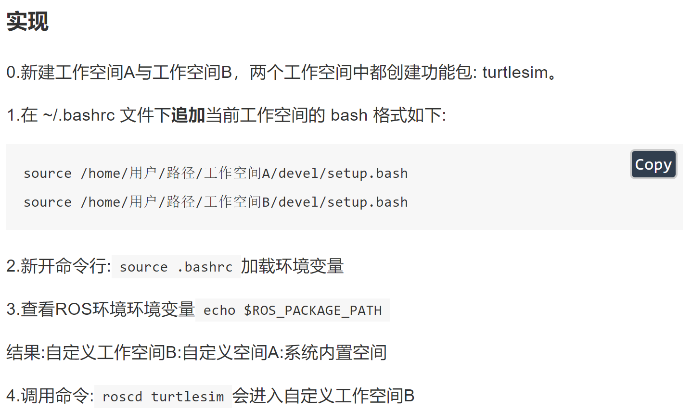
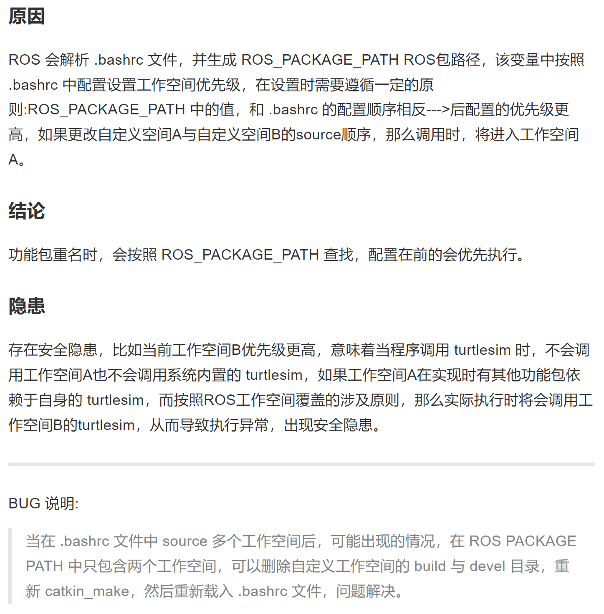

#  20211218_CHAP_04_ROS_RUNTIME_MANAG

[TOC]


---

LOGS:

2021年12月18日：init. chapter 04


---


## 00. Some Points Noted

> ---
>
> ROS是多进程(节点)的分布式框架，一个完整的ROS系统实现：
>
> * 含多台**主机**（main frame）；
>
> * 每台主机上有多个**工作空间**（workspace）；
>
> * 每个的工作空间中包含多个**功能包**（package）；
>
> * 每个功能包包含多个**节点**（Node），不同的节点都有自己的节点名称；
>
> * 每个节点会设置一个或多个**话题**（topic）...
>
> ---
>
> ROS中的问题：
>
> * 如何关联不同的功能包？
>
> * 繁多的ROS节点应该如何启动？
>
> * 功能包、节点、话题、参数重名时应该如何处理？
>
> * 不同主机上的节点如何通信？
>
> ---
>
> 解决策略：
>
> - 掌握元功能包使用语法；
> - 掌握launch文件的使用语法；
> - 理解什么是ROS工作空间覆盖，以及存在什么安全隐患；
> - 掌握节点名称重名时的处理方式；
> - 掌握话题名称重名时的处理方式；
> - 掌握参数名称重名时的处理方式；
> - 能够实现ROS分布式通信
>
> ---


---

## 01. ROS 元功能包（metapackage）（略）


## 02. ROS node launch file

> ---
>
> #### **概念**
>
> launch 文件是一个 XML 格式的文件，可以**启动本地和远程的多个节点**，还可以在**参数服务器中设置**参数。
>
> #### **作用**
>
> 简化节点的配置与启动，提高ROS程序的启动效率。
>
> ---


### 01. 创建 launch 文件流程

> ---
>
> 1. 在 package/ 下创建 launch/
> 2. 在 launch/ 下创建 Xxx.launch
> 3. 编辑 Xxx.launch 文件
>
> ---


**文件结构：**

```shell
ds18@ubuntu:~/catkin_x2/IMU_ws_mk2/IMU_ws_mk2/LINES354_ws/src/lines354_pkg$ tree .
.
├── CMakeLists.txt
├── CMakeLists.txt.original
├── include
│   └── lines354_pkg
│       ├── linesTechImu.h
│       └── linesTechTest.h
├── launch
│   └── lines_imu_driver.launch
├── package.xml
├── rviz
│   └── lines354.rviz
├── src
│   ├── linesTechImu.cpp
│   └── linesTechTest.cpp
└── test
	...
    └── imu_test_linesTech.cpp
```


**编写 `launch/lines_imu_driver.launch`**

```xml
<launch>
    <!-- launch imu driver node -->
    <node pkg="lines354_pkg" type="ImuTestLinesTech" name="linesTech_imu_node" output="screen"/>

    <!-- launch rviz -->
    <node pkg="rviz" type="rviz" name="rviz" args="-d $(find lines354_pkg)/rviz/lines354.rviz"/>
</launch>
```

> 注：rviz 中的 `args="-d $(find lines354_pkg)/rviz/lines354.rviz"`，其中 lines354_pkg 是功能包的名字，需要指明。
>
> 注：node 中的 pkg 指：功能包名称。
>
> 注：node 中的 type 指：功能包中可执行文件名称，可以通过查找`add_executable()` 找到。
>
> 注：node 中的 name 指：ros node 名称，其是在 `ros::init(argc, argv, "node_name")`指定。


### 02. 调用 `.launch` 文件

```shell
roslaunch package_name Xxx.launch

roslaunch lines354_pkg lines_imu_driver.launch
```

> 注：roslaunch 命令执行launch文件时，首先会判断是否启动了 roscore,如果启动了，则不再启动，否则，会自动调用 roscore。


运行结果：

```shell
ds18@ubuntu:~/catkin_x2/IMU_ws_mk2/IMU_ws_mk2/LINES354_ws$ roslaunch lines354_pkg lines_imu_driver.launch 
... logging to /home/ds18/.ros/log/c22eae60-5bd9-11ec-90e2-000c29bd4b3b/roslaunch-ubuntu-94717.log
Checking log directory for disk usage. This may take a while.
Press Ctrl-C to interrupt
Done checking log file disk usage. Usage is <1GB.

started roslaunch server http://ubuntu:45735/

SUMMARY
========

PARAMETERS
 * /rosdistro: melodic
 * /rosversion: 1.14.11

NODES
  /
    linesTech_imu_node (lines354_pkg/ImuTestLinesTech)
    rviz (rviz/rviz)

ROS_MASTER_URI=http://localhost:11311

process[linesTech_imu_node-1]: started with pid [94732]
process[rviz-2]: started with pid [94733]
[ERROR] [1639807908.108869007]: Unable to open port!...
[linesTech_imu_node-1] process has finished cleanly
log file: /home/ds18/.ros/log/c22eae60-5bd9-11ec-90e2-000c29bd4b3b/linesTech_imu_node-1*.log

```


### 03. launch 文件标签

> 注：根据实用的角度进行记录。


---


#### 1. 标签：`launch`

> `<launch>`标签：所有 launch 文件的根标签，充当其他标签的容器。


**属性：**

|      | 属性                      | 说明                             |
| ---- | ------------------------- | -------------------------------- |
| 1    | `deprecated = "弃用声明"` | 告知用户当前 launch 文件已经弃用 |


**子级标签：**

所有其它标签都是launch的子级。


---


#### 2. 标签：`node`

> `<node> `标签用于指定 ROS 节点，最常见的标签， **roslaunch 命令不能保证按照 node 的声明顺序来启动节点（节点的启动是多进程的）。**


**属性：**

|      | 属性                                 | 说明                                                         |
| ---- | ------------------------------------ | ------------------------------------------------------------ |
| 1    | pkg="包名"                           | 节点所属的包                                                 |
| 2    | type="nodeType"                      | 节点类型（与之相同名称的 **可执行文件**）                    |
| 3    | name="nodeName"                      | 节点名称（在 ROS 网络拓扑中节点的名称）                      |
| 4    | args="xxx xxx xxx"（可选）           | 将参数传递给节点                                             |
| 5    | machine="机器名"                     | 在指定机器上启动节点                                         |
| 6    | respawn="true \| false"（可选）      | 如果节点退出，是否自动重启                                   |
| 7    | respawn_delay=" N"（可选）           | 如果 respawn 为 true, 那么延迟 N 秒后启动节点                |
| 8    | required="true \| false"（可选）     | 该节点是否必须，如果为 true,那么如果该节点退出，将杀死整个 roslaunch |
| 9    | ns="xxx" (可选)                      | 在指定命名空间 xxx 中启动节点                                |
| 10   | clear_params="true \| false"（可选） | 在启动前，删除节点的私有空间的所有参数                       |
| 11   | output="true \| false"（可选）       | 日志发送目标，可以设置为 log 日志文件，或 screen 屏幕,默认是 log |


**子级标签：**

|      | 属性     | 说明           |
| ---- | -------- | -------------- |
| 1    | env      | 环境变量设置   |
| 2    | remap    | 重映射节点名称 |
| 3    | rosparam | 参数设置       |
| 4    | param    | 参数设置       |


---


#### 3. 标签：`include`

> `include`标签用于 将另一个 xml 格式的 launch 文件导入到当前文件。
>
> **导入 launch 文件到此 launch 文件。**


**属性：**

|      | 属性                               | 说明                   |
| ---- | ---------------------------------- | ---------------------- |
| 1    | file="$(find 包名)/xxx/xxx.launch" | 要包含的文件路径       |
| 2    | ns="xxx" (可选)                    | 在指定命名空间导入文件 |


**子级标签：**

|      | 属性 | 说明                     |
| ---- | ---- | ------------------------ |
| 1    | env  | 环境变量设置             |
| 2    | arg  | 将参数传递给被包含的文件 |


---


#### 4. 标签：`remap`

> 话题重命名。


**属性：**

|      | 属性       | 说明         |
| ---- | ---------- | ------------ |
| 1    | from="xxx" | 原始话题名称 |
| 2    | to="yyy"   | 目标名称     |


**子级标签：**

|      | 属性 | 说明 |
| ---- | ---- | ---- |
|      |      |      |


---


#### 5. 标签：`param`

> `<param>`标签主要用于**在参数服务器上设置参数**，**参数源可以在标签中通过 value 指定，也可以通过外部文件加载（`.yaml`文件？）**，在`<node>`标签中时，相当于私有命名空间。


**属性：**

|      | 属性                                                | 说明                                                         |
| ---- | --------------------------------------------------- | ------------------------------------------------------------ |
| 1    | name="命名空间/参数名"                              | 参数名称，可以包含命名空间                                   |
| 2    | value="xxx" (可选)                                  | 定义参数值，如果此处省略，必须指定外部文件作为参数源         |
| 3    | type="str \| int \| double \| bool \| yaml"（可选） |  |


**子级标签：**

|      | 属性 | 说明 |
| ---- | ---- | ---- |
|      |      |      |


---


#### 6. 标签：`rosparam`

>`<rosparam>`标签可以**从 YAML 文件导入参数**，或**将参数导出到 YAML 文件**，也可以用来删除参数，`<rosparam>`标签在`<node>`标签中时被视为私有。


**属性：**

|      | 属性                                               | 说明                     |
| ---- | -------------------------------------------------- | ------------------------ |
| 1    | command="load \| dump \| delete" (可选，默认 load) | 加载、导出或删除参数     |
| 2    | file="$(find xxxxx)/xxx/yyy...."                   | 加载或导出到的 yaml 文件 |
| 3    | param="参数名称"                                   |                          |
| 4    | ns="命名空间" (可选)                               |                          |


**子级标签：**

|      | 属性 | 说明 |
| ---- | ---- | ---- |
|      |      |      |


---


#### 7. 标签：`group`

> `<group>`标签可以**对节点分组**，**具有 ns 属性，可以让节点归属某个命名空间**


**属性：**

|      | 属性                                | 说明                                                     |
| ---- | ----------------------------------- | -------------------------------------------------------- |
| 1    | ns="名称空间" (可选)                |                                                          |
| 2    | clear_params="true \| false" (可选) | 启动前，是否删除组名称空间的所有参数(慎用....此功能危险) |


**子级标签：**

|      | 属性                        | 说明 |
| ---- | --------------------------- | ---- |
| 1    | 除了launch 标签外的其他标签 |      |


---


#### 8. 标签：`arg`

> `<arg>`标签是用于**动态传参**，类似于**函数的参数**，可以增强launch文件的灵活性。


**属性：**

|      | 属性                    | 说明                  |
| ---- | ----------------------- | --------------------- |
| 1    | name="参数名称"         |                       |
| 2    | default="默认值" (可选) |                       |
| 3    | value="数值" (可选)     | 不可以与 default 并存 |
| 4    | doc="描述"              | 参数说明              |


**子级标签：**

|      | 属性 | 说明 |
| ---- | ---- | ---- |
|      |      |      |


**示例：**

launch 文件传参语法：

```xml
<launch>
    <arg name="xxx" />
    <param name="param" value="$(arg xxx)" />
</launch>
```


命令行调用传参 launch 文件：

```shell
roslaunch hello.launch xxx:=值
```


---

## 03. ROS workspace coverage（工作空间覆盖）(略)


> ---
>
> 所谓工作空间覆盖，是指不同工作空间中，存在重名的功能包的情形。
>
> 如截图：
>
> ---
>
> 
>
> ---
>
> 
>
> ---


---


## 04. ROS node re-naming（节点名称重命名）

### 00. Some Points Noted

> ---
>
> ROS 中创建的节点是有名称的。
>
> C++初始化节点时通过API:`ros::init(argc,argv,"xxxx");`来定义节点名称。
>
> 在ROS的网络拓扑中，是不可以出现重名的节点的，因为假设可以重名存在，那么调用时会产生混淆。
>
> 不可以启动重名节点或者同一个节点启动多次，的确，在ROS中如果**启动重名节点的话**，之前已经存在的节点会被直接关闭，但是如果有这种需求的话，怎么优化呢？
>
> **在ROS中给出的解决策略是使用命名空间或名称重映射。**
>
> ---


**节点名称重命名三种方法**：

1. rousrun 节点名称设置
2. launch 节点名称设置
3. 源码 节点名称设置


**案例：**

启动两个 turtlesim_node 节点，当然如果直接打开两个终端，直接启动，那么第一次启动的节点会关闭，并给出提示:

>[ WARN] [1578812836.351049332]: Shutdown request received.
>[ WARN] [1578812836.351207362]: Reason given for shutdown: [new node registered with same name]

因为两个节点不能重名，接下来将会介绍解决重名问题的多种方案。


### 01. rosrun 设置命名空间与重映射

#### 1. rosrun 设置命名空间

**设置命名空间：**

`语法: rosrun 包名 节点名 __ns:=新名称`

```shell
rosrun turtlesim turtlesim_node __ns:=/xxx

rosrun turtlesim turtlesim_node __ns:=/yyy
```

**运行结果：**

正常运行。

```shell
rosnode list			# 查看当前节点信息

/xxx/turtlesim
/yyy/turtlesim
```


#### 2. rosrun 名称重映射

**给节点起别名：**

`语法: rosrun 包名 节点名 __name:=新名称`

```shell
rosrun turtlesim  turtlesim_node __name:=t1 或  
rosrun turtlesim   turtlesim_node /turtlesim:=t1(不适用于python)

rosrun turtlesim  turtlesim_node __name:=t2 或  
rosrun turtlesim   turtlesim_node /turtlesim:=t2(不适用于python)
```

**运行结果：**

```shell
rosnode list			# 查看当前节点信息

/t1
/t2
```


#### 3. rosrun 命名空间与名称重映射叠加

**设置命名空间同时名称重映射：**

`语法: rosrun 包名 节点名 __ns:=新名称 __name:=新名称`

```shell
rosrun turtlesim turtlesim_node __ns:=/xxx __name:=tn
```

**运行结果：**

```shell
rosnode list			# 查看当前节点信息

/xxx/tn
```


#### 4. 使用环境变量设置命名空间：

```shell
$ export ROS_NAMESPACE=xxxx
```


### 02. launch 文件设置话题重映射（这个没讲）

> launch 文件中， node 标签中有两个属性: name 和 ns，二者分别是用于实现名称重映射与命名空间设置的。

 

**示例：**

```xml
<launch>

    <node pkg="turtlesim" type="turtlesim_node" name="t1" />
    <node pkg="turtlesim" type="turtlesim_node" name="t2" />
    <node pkg="turtlesim" type="turtlesim_node" name="t1" ns="hello"/>

</launch>

```

>在 node 标签中，name 属性是必须的，ns 可选。


**运行：**

```shell
rosnode list			# 查看当前节点信息

/t1
/t2
/t1/hello
```


### 03. 编码设置话题名称

> 自定义节点实现，可以更灵活的设置命名空间与重映射实现。


#### 1. C++ 实现重映射

**源代码设置节点别名：**

```cpp
ros::init(argc, argv, "zhangsan", ros::init_options::AnonymousName);  // 节点名称 + 随机数
```

**运行结果：**

```shell
# 会在名称后面添加时间戳。
```


#### 2. C++ 实现命名空间

**源代码设置命名空间：**

```cpp
std::map<std::string, std::string> map;
map["__ns"] = "xxxx";
ros::init(map,"wangqiang");
```


**运行结果：**

```shell
# 节点名称设置了命名空间。
```


---


## 05. ROS 话题名称设置

### 00. Some Points Noted

> ---
>
> 在ROS中节点名称可能出现重名的情况，同理话题名称也可能重名。
>
> **情况一：**不同的节点之间通信都依赖于话题。话题名称也可能出现重复的情况，这种情况下，系统虽然不会抛出异常，但是可能导致订阅的消息非预期的，从而导致节点运行异常。这种情况下需要将两个节点的话题名称由相同修改为不同。
>
> **情况二：**或者，两个节点是可以通信的，两个节点之间使用了相同的消息类型，但是由于，话题名称不同，导致通信失败。这种情况下需要将两个节点的话题名称由不同修改为相同。
>
> ---
>
> 些时候可能需要将相同的话题名称设置为不同，也有可能将不同的话题名设置为相同。
>
> 在ROS中给出的解决策略与节点名称重命类似：使用名称重映射或为名称添加前缀。根据前缀不同，有全局、相对、和私有三种类型之分。
>
> - **全局**（参数名称直接参考ROS系统，与节点命名空间平级）
> - **相对**（参数名称参考的是节点的命名空间，与节点名称平级）
> - **私有**（参数名称参考节点名称，是节点名称的子级）
>
> ---
>
> 话题名称重映射是为名称起别名，为名称添加前缀。
>
> 不单是使用**命名空间**作为前缀、还可以使用**节点名称**最为前缀。两种策略的实现途径有多种:
>
> - rosrun 命令
> - launch 文件
> - 编码实现
>
> ---


### 01. rosrun 话题名称设置

**rosrun 名称重映射语法:** 

```shell
rorun 包名 节点名 话题名:=新话题名称
```


**实操1：**

```shell
# teleop_twist_keyboard 节点的话题设置为 /turtle1/cmd_vel

# 启动键盘控制节点:
rosrun teleop_twist_keyboard teleop_twist_keyboard.py /cmd_vel:=/turtle1/cmd_vel

# 启动乌龟显示节点: 
rosrun turtlesim turtlesim_node

# 二者可以实现正常通信
```


**实操2：**

```shell
# 乌龟显示节点的话题设置为 /cmd_vel

# 启动键盘控制节点:
rosrun teleop_twist_keyboard teleop_twist_keyboard.py

# 启动乌龟显示节点: 
rosrun turtlesim turtlesim_node /turtle1/cmd_vel:=/cmd_vel

# 二者可以实现正常通信
```


### 02. launch 文件 话题名称设置

**launch 文件设置话题重映射语法:**

```xml
<node pkg="xxx" type="xxx" name="xxx">
    <remap from="原话题" to="新话题" />
</node>
```

> 实现teleop_twist_keyboard与乌龟显示节点通信方案由两种：

##### 

**实操1：**

将 teleop_twist_keyboard 节点的话题设置为`/turtle1/cmd_vel`。

二者可以实现正常通信。

```xml
<launch>

    <node pkg="turtlesim" type="turtlesim_node" name="t1" />
    <node pkg="teleop_twist_keyboard" type="teleop_twist_keyboard.py" name="key">
        <remap from="/cmd_vel" to="/turtle1/cmd_vel" />
    </node>

</launch>
```


**实操2：**

将乌龟显示节点的话题设置为 `/cmd_vel`。

二者可以实现正常通信。

```shell
<launch>
    <node pkg="turtlesim" type="turtlesim_node" name="t1">
        <remap from="/turtle1/cmd_vel" to="/cmd_vel" />
    </node>
    <node pkg="teleop_twist_keyboard" type="teleop_twist_keyboard.py" name="key" />

</launch>
```


### 03. 源码 话题名称设置

>话题名称大致可以分为三种类型:
>
>- 全局 (话题参考ROS系统，与节点命名空间平级)
>- 相对 (话题参考的是节点的命名空间，与节点名称平级)
>- 私有 (话题参考节点名称，是节点名称的子级)


#### 0. 准备

```cpp
// 1.初始化节点设置一个节点名称

ros::init(argc,argv,"hello")

// 2.设置不同类型的话题

// 3.启动节点时，传递一个 __ns:= xxx

// 4.节点启动后，使用 rostopic 查看话题信息
```


#### 1. **全局名称**

> **格式：**以`/`开头的名称，和节点名称无关。
>
> **比如：**/xxx/yyy/zzz。

```cpp
// **示例1:**`
ros::Publisher pub = nh.advertise<std_msgs::String>("/chatter",1000);

// **结果1:** /chatter

---+---+---+---+---+---+---+---+---+---+---+---+---+---+---+---+

// **示例2:**`
ros::Publisher pub = nh.advertise<std_msgs::String>("/chatter/money",1000);

// **结果2:** /chatter/money
```


#### 2. 相对名称

> **格式：**非`/`开头的名称,参考命名空间 (与节点名称平级) 来确定话题名称。

```cpp
// **示例1:**
ros::Publisher pub = nh.advertise<std_msgs::String>("chatter",1000);

// **结果1:** xxx/chatter

// **示例2:**
ros::Publisher pub = nh.advertise<std_msgs::String>("chatter/money",1000);

// **结果2:** xxx/chatter/money
```


#### 3. **私有名称**

> **格式：**以`~`开头的名称。

```cpp
// **示例1:**

ros::NodeHandle nh("~");
ros::Publisher pub = nh.advertise<std_msgs::String>("chatter",1000);

// **结果1:** /xxx/hello/chatter

---+---+---+---+---+---+---+---+---+---+---+---+---+---+---+---+---+

// **示例2:**

ros::NodeHandle nh("~");
ros::Publisher pub = nh.advertise<std_msgs::String>("chatter/money",1000);

// **结果2:** /xxx/hello/chatter/money

// *PS:当使用*`~`*,而话题名称有时*`/`*开头时，那么话题名称是绝对的*

---+---+---+---+---+---+---+---+---+---+---+---+---+---+---+---+---+

// **示例3:**

ros::NodeHandle nh("~");
ros::Publisher pub = nh.advertise<std_msgs::String>("/chatter/money",1000);

// **结果3:** /chatter/money
```


---


## 06. ROS 参数名称设置


### 00. Some Points Noted

>---
>
>在ROS中节点名称话题名称可能出现重名的情况，同理参数名称也可能重名。
>
>参数重名的处理，没有重映射实现，为了尽量的避免参数重名，都是使用为参数名添加前缀的方式，实现类似于话题名称，有全局、相对、和私有三种类型之分。
>
>- 全局（参数名称直接参考ROS系统，与节点命名空间平级）
>- 相对（参数名称参考的是节点的命名空间，与节点名称平级）
>- 私有（参数名称参考节点名称，是节点名称的子级）
>
>---
>
>设置参数的方式也有三种:
>
>- rosrun 命令
>- launch 文件
>- 编码实现
>
>---
>
>#### 案例
>
>启动节点时，为参数服务器添加参数（需要注意参数名称设置）。
>
>---


### 01. rosrun 参数名称设置

> rosrun 在启动节点时，可以设置参数:

> **语法:** rosrun 包名 节点名称 _参数名:=参数值

#### 1.设置参数

启动乌龟显示节点，并设置参数 A = 100

```
rosrun turtlesim turtlesim_node _A:=100
Copy
```

#### 2.运行

`rosparam list`查看节点信息,显示结果:

```
/turtlesim/A
/turtlesim/background_b
/turtlesim/background_g
/turtlesim/background_r
Copy
```

结果显示，参数A前缀节点名称，也就是说rosrun执行 设置参数 参数名使用的是私有模式（？）。


###  02. launch 文件 参数名称设置

> 通过 launch 文件设置参数的方式前面已经介绍过了，可以在 node 标签外，或 node 标签中通过 param 或 rosparam 来设置参数。
>
> 在 node 标签外设置的参数是全局性质的，参考的是 `/` ，在 node 标签中设置的参数是私有性质的，参考的是 `/命名空间/节点名称`。


**设置参数：**

```xml
<launch>

    <param name="p1" value="100" />	<!-- 全局 / -->
    
    <node pkg="turtlesim" type="turtlesim_node" name="t1">
        <param name="p2" value="100" /> <!--私有 /命名空间/节点名称-->
    </node>

</launch>
```


**运行：**

```shell
/p1
/t1/p1
```


### 03. 源码 参数名称设置 ★

>编码的方式可以更方便的设置**:全局、相对与私有**参数。


#### 1. C++ 源码 实现参数名称设置 ★

> 在 C++ 中，可以使用 `ros::param` 或者 `ros::NodeHandle` 来设置参数。


##### 1. ros::param设置参数 ★

设置参数调用API是 `ros::param::set(参数1, 参数2)`，该函数中，`参数1`传入参数名称，`参数2`是传入参数值，`参数1`中参数名称设置时，如果以 `/` 开头，那么就是全局参数，如果以 `~` 开头，那么就是私有参数，既不以 `/` 也不以 `~` 开头，那么就是相对参数。代码示例：

```cpp
ros::param::set("/set_A",100); 	//全局,和命名空间以及节点名称无关
ros::param::set("set_B",100); 	//相对,参考命名空间
ros::param::set("~set_C",100); 	//私有,参考命名空间与节点名称
```

运行时，假设设置的 `namespace` 为 `xxx`，节点名称为 `yyy`，使用 `rosparam list` 查看:

```
/set_A
/xxx/set_B
/xxx/yyy/set_C
```


##### 2 ros::NodeHandle设置参数（不考虑）

设置参数时，首先需要创建 `NodeHandle` 对象，然后调用该对象的 `setParam(参数1, 参数2)` 函数，该函数`参数1`为参数名，`参数2`为要设置的参数值，如果参数名以 `/` 开头，那么就是全局参数，如果参数名不以 `/` 开头，那么，该参数是相对参数还是私有参数与`NodeHandle` 对象有关，如果`NodeHandle` 对象创建时如果是调用的默认的无参构造，那么该参数是相对参数，如果`NodeHandle` 对象创建时是使用:`ros::NodeHandle nh("~")`，那么该参数就是私有参数。

代码示例:

```cpp
ros::NodeHandle nh;
nh.setParam("/nh_A",100); 			//全局,和命名空间以及节点名称无关

nh.setParam("nh_B",100); 			//相对,参考命名空间

ros::NodeHandle nh_private("~");
nh_private.setParam("nh_C",100);	//私有,参考命名空间与节点名称
```

运行时，假设设置的 namespace 为 xxx，节点名称为 yyy，使用 rosparam list 查看:

```
/nh_A
/xxx/nh_B
/xxx/yyy/nh_C
```


---


## 07. ROS distributed communication（分布式通信）


**Some Points Noted:**

> ROS是一个分布式计算环境。一个运行中的ROS系统可以包含分布在多台计算机上多个节点。
>
> 根据系统的配置方式，任何节点可能随时需要与任何其他节点进行通信。
>
> 因此，ROS对**网络配置**有某些要求：
>
> - 所有端口上的所有机器之间必须有**完整的双向连接**。
> - 每台计算机必须通过**所有其他计算机都可以解析的名称**来**公告**自己。


**实现：**

> ---
>
> 1. 准备
> 2. 配置文件修改
> 3. 配置主机 IP
> 4. 配置从机 IP
> 5. 测试
>
> ---


##### 1.准备

> 先要保证不同计算机处于同一网络中，
>
> 最好分别设置固定IP，
>
> 如果为虚拟机，需要将网络适配器改为桥接模式；


##### 2.配置文件修改

> 分别修改不同计算机的 `/etc/hosts` 文件，在该文件中加入对方的IP地址和计算机名:


主机端:

```
从机的IP    从机计算机名
```


从机端:

```
主机的IP    主机计算机名
```


设置完毕，可以通过 ping 命令测试网络通信是否正常。

> IP地址查看名: ifconfig
>
> 计算机名称查看: hostname


##### 3.配置主机IP

> 配置主机的 IP 地址
>
> ~/.bashrc 追加

```shell
export ROS_MASTER_URI=http://主机IP:11311
export ROS_HOSTNAME=主机IP
```


##### 4. 配置从机IP

> 配置从机的 IP 地址，从机可以有多台，每台都做如下设置:
>
> ~/.bashrc 追加

```shell
export ROS_MASTER_URI=http://主机IP:11311
export ROS_HOSTNAME=从机IP
```


##### 5. **测试**

1.主机启动 roscore(必须)

2.主机启动订阅节点，从机启动发布节点，测试通信是否正常

3.反向测试，主机启动发布节点，从机启动订阅节点，测试通信是否正常


---


## 08. 小结


本章主要介绍了ROS的运行管理机制，内容如下:

- 如何通过元功能包关联工作空间下的不同功能包
- 使用 launch 文件来管理维护 ROS 中的节点
- 在 ROS 中重名是经常出现的，重名时会导致什么情况？以及怎么避免重名？
- 如何实现 ROS 分布式通信？


本章的重点是"重名"相关的内容：

- 包名重复，会导致覆盖。
- 节点名称重复，会导致先启动的节点关闭
- 话题名称重复，无语法异常，但是可能导致通信实现出现逻辑问题
- 参数名称重复，会导致参数设置的覆盖


解决重名问题的实现方案有两种:

- 重映射(重新起名字)
- 为命名添加前缀


本章介绍的内容还是偏向语法层面的实现，下一章将开始介绍ROS中内置的一些较为实用的组件。


---


## 参考

