# 20211220_CHAP_05_COMMON_TOOLS

[TOC]


---


## 01. ROS TF (transform frame)

### 00. Some Points Noted

> ---
>
> 在明确了不同坐标系之间的的相对关系，就可以实现任何坐标点在不同坐标系之间的转换，但是该计算实现是较为常用的，且算法也有点复杂，因此在 ROS 中直接封装了相关的模块: 坐标变换(TF)。
>
> ---
>
> **坐标系:**
>
> ROS 中是通过坐标系统来标定物体的，确切的将是通过**右手坐标系**来标定的。
>
> #### **作用**
>
> 在 ROS 中用于实现**不同坐标系之间的点或向量的转换**。
>
> ---


---


### 01. geometry_msgs（坐标msg消息）

> 在坐标转换实现中常用的 msg:
>
> `geometry_msgs/TransformStamped`：传输坐标系相关位置信息。
> `geometry_msgs/PointStamped`：传输某个坐标系内坐标点的信息。
>
> 在坐标变换中，频繁的需要使用到坐标系的相对关系以及坐标点信息。


#### 1. `geometry_msgs/TransformStamped`

传输坐标系相关位置信息。

```shell
rosmsg info geometry_msgs/TransformStamped

std_msgs/Header header                       #头信息
  uint32 seq                                 #|-- 序列号
  time stamp                                 #|-- 时间戳
  string frame_id                            #|-- 所属坐标系的 id
string child_frame_id                        #子坐标系的 id
geometry_msgs/Transform transform            #坐标信息
  geometry_msgs/Vector3 translation          #偏移量
    float64 x                                #|-- X 方向的偏移量
    float64 y                                #|-- Y 方向的偏移量
    float64 z                                #|-- Z 方向上的偏移量
  geometry_msgs/Quaternion rotation          #四元数：四元数用于表示坐标的相对姿态
    float64 x                                
    float64 y                                
    float64 z                                
    float64 w
```


#### 2. `geometry_msgs/PointStamped`

传输**某个坐标系内坐标点**的信息。

```shell
rosmsg info geometry_msgs/PointStamped

std_msgs/Header header                    	 #头信息
  uint32 seq                                 #|-- 序号
  time stamp                                 #|-- 时间戳
  string frame_id                            #|-- 所属坐标系的 id
geometry_msgs/Point point                    #点坐标
  float64 x                                  #|-- x y z 坐标
  float64 y
  float64 z
```


---


### 02. Static TF（静态坐标变换）

#### 0. Some Points Noted

>---
>
>**静态坐标变换**，是指两个坐标系之间的相对位置是固定的。
>
>---


#### 1. 需求与流程

> **需求：**
>
> ---
>
> 一机器人模型，核心构成包含主体与雷达，各对应一坐标系。
>
> 坐标系的原点分别位于主体与雷达的物理中心。
>
> 已知雷达原点相对于主体原点位移关系如下: `x: 0.2, y: 0.0, z: 0.5`。当前雷达检测到一障碍物，在雷达坐标系中障碍物的坐标为 `(2.0, 3.0, 5.0)`，请问，该障碍物相对于主体的坐标是多少？
>
> ---


> **实现分析:**
>
> ---
>
> 1. 坐标系相对关系，可以通过发布方发布
> 2. 订阅方，订阅到发布的坐标系相对关系，再传入坐标点信息(可以写死)，然后借助于 tf 实现坐标变换，并将结果输出
>
> ---


> **实现流程:**
>
> ---
>
> 1. 新建功能包，添加依赖（依赖就是包，使用 `rospack find` 找）
> 2. 编写发布方实现
> 3. 编写订阅方实现
> 4. 执行并查看结果
>
> ---


#### 2. C++ 实现 ★

创建项目功能包依赖于 
```
tf2
tf2_ros
tf2_geometry_msgs
roscpp 
rospy 
std_msgs 
geometry_msgs
```


##### 1. 发布方（talker）★

`demo_06_tf_talker_node.cpp`

```cpp
//
// Created by ds18 on 12/20/21.
//

/*
    静态坐标变换发布方:
        发布关于 laser 坐标系的位置信息

    实现流程:
        1.包含头文件
        2.初始化 ROS 节点
        3.创建静态坐标转换广播器
        4.创建坐标系信息
        5.广播器发布坐标系信息
        6.spin()
*/


// 1.包含头文件
#include "ros/ros.h"
#include "tf2_ros/static_transform_broadcaster.h"
#include "geometry_msgs/TransformStamped.h"
#include "tf2/LinearMath/Quaternion.h"

int main(int argc, char *argv[]) {
    setlocale(LC_ALL, "");

    // 2.初始化 ROS 节点
    ros::init(argc, argv, "demo_06_tf_static_broadcast");

    // 3.创建静态坐标转换广播器
    tf2_ros::StaticTransformBroadcaster broadcaster;

    // 4.创建坐标系信息（加印花的TF，也就是时间戳）
    geometry_msgs::TransformStamped ts;

    //----设置头信息
    ts.header.seq = 100;
    ts.header.stamp = ros::Time::now();
    ts.header.frame_id = "base_link";
    //----设置子级坐标系
    ts.child_frame_id = "laser";
    //----设置子级相对于父级的偏移量
    ts.transform.translation.x = 0.2;
    ts.transform.translation.y = 0.0;
    ts.transform.translation.z = 0.5;
    //----设置四元数:将 欧拉角数据转换成四元数
    tf2::Quaternion qtn;
    qtn.setRPY(0, 0, 0);
    ts.transform.rotation.x = qtn.getX();
    ts.transform.rotation.y = qtn.getY();
    ts.transform.rotation.z = qtn.getZ();
    ts.transform.rotation.w = qtn.getW();

    // 5.广播器发布坐标系信息
    broadcaster.sendTransform(ts);

    // 进入循环执行回调函数
    ros::spin();
    return 0;
}

```

###### 代码解释

```cpp
// 1. 确定代码流程。1, 2, 3, 4, 5

// 2. 需要创建静态坐标转换广播器，用来发布 静态坐标系
tf2_ros::StaticTransformBroadcaster broadcaster;

// 3. 创建静态坐标系转换信息，包含时间戳（加印花的TF，也就是时间戳）
geometry_msgs::TransformStamped ts;

/*
rosmsg info geometry_msgs/TransformStamped

std_msgs/Header header                       ## 头信息
  uint32 seq                                 # |-- 序列号
  time stamp                                 # |-- 时间戳
  string frame_id                            # |-- 所属坐标系的 id
string child_frame_id                        ## 子坐标系的 id
geometry_msgs/Transform transform            ## 坐标信息
  geometry_msgs/Vector3 translation          # 偏移量
    float64 x                                # |-- X 方向的偏移量
    float64 y                                # |-- Y 方向的偏移量
    float64 z                                # |-- Z 方向上的偏移量
  geometry_msgs/Quaternion rotation          # 四元数：四元数用于表示坐标的相对姿态
    float64 x                                
    float64 y                                
    float64 z                                
    float64 w
*/

// 4. 广播器发布静态坐标系转换信息
/*
send a transfomStamped msg. the stamped data structure includes frame_id, time, parent_id...
*/
broadcaster.sendTransform(ts);
```


##### 2. 订阅方（listener）★

`demo_06_tf_listener_node.cpp`

```cpp
//
// Created by ds18 on 12/20/21.
//

/*
    订阅坐标系信息，生成一个相对于 子级坐标系的坐标点数据，转换成父级坐标系中的坐标点

    实现流程:
        1.包含头文件
        2.初始化 ROS 节点
        3.创建 TF 订阅节点
        4.生成一个坐标点(相对于子级坐标系)
        5.转换坐标点(相对于父级坐标系)
        6.spin()
*/

//1.包含头文件
#include "ros/ros.h"
#include "tf2_ros/transform_listener.h"
#include "tf2_ros/buffer.h"
#include "geometry_msgs/PointStamped.h"
#include "tf2_geometry_msgs/tf2_geometry_msgs.h" //注意: 调用 transform 必须包含该头文件

int main(int argc, char *argv[]) {
    setlocale(LC_ALL, "");

    // 2.初始化 ROS 节点
    ros::init(argc, argv, "demo_06_tf_static_subcribe");
    ros::NodeHandle nh;

    // 3.创建 TF 订阅节点
    tf2_ros::Buffer buffer;
    tf2_ros::TransformListener listener(buffer);

    ros::Rate r(1);
    while (ros::ok()) {

        // 4.生成一个坐标点(相对于子级坐标系)
        geometry_msgs::PointStamped point_laser;
        point_laser.header.frame_id = "laser";
        point_laser.header.stamp = ros::Time::now();
        point_laser.point.x = 1;
        point_laser.point.y = 2;
        point_laser.point.z = 7.3;

        // 5.转换坐标点(相对于父级坐标系)
        //新建一个坐标点，用于接收转换结果
        //--使用 try 语句或休眠，否则可能由于缓存接收延迟而导致坐标转换失败--
        try {
            geometry_msgs::PointStamped point_base;
            point_base = buffer.transform(point_laser, "base_link");
            ROS_INFO("转换后的数据:(%.2f, %.2f, %.2f),参考的坐标系是: %s", point_base.point.x, point_base.point.y, point_base.point.z,
                     point_base.header.frame_id.c_str());

        }
        catch (const std::exception &e) {
            // std::cerr << e.what() << '\n';
            ROS_INFO("程序异常.....");
        }

        r.sleep();
        // 执行一次回调函数(没有循环)
        ros::spinOnce();
    }

    return 0;
}
```

###### 代码解释

```shell
rosrun rqt_graph rqt_graph

rosrun rqt_tf_tree rqt_tf_tree
```


```cpp
// 1. 确定业务流程

// 3. 创建 TF 对象
// 创建一个 buffer 用来存储一个坐标系，并启动一个服务 tf_frames
// 创建一个 listener 来 request 和 receive 坐标系转换信息
/*
Stores known frames and offers a ROS service, "tf_frames", which responds to client requests with a response containing a tf2_msgs::FrameGraph representing the relationship of known frames.
存储一个已知的坐标系，同时提供一个 ROS 服务："tf_frames"。
*/
tf2_ros::Buffer buffer;
/*
provides an easy way to request and receive coordinate frame transform information

// constructor for transform listener
TransformListener(tf2::BufferCore& buffer, bool spin_thread = true);
*/
tf2_ros::TransformListener listener(buffer);

// 4.生成一个坐标点(相对于子级坐标系, laser)
/*
$ rosmsg info geometry_msgs/PointStamped 
std_msgs/Header header
  uint32 seq
  time stamp
  string frame_id
geometry_msgs/Point point
  float64 x
  float64 y
  float64 z
*/
geometry_msgs::PointStamped point_laser;  	// 创建带时间戳的坐标点对象 point_laser
point_laser.header.frame_id = "laser";		// 设定坐标点 坐标系为 laser
point_laser.header.stamp = ros::Time::now();// 设定坐标点 时间戳为 now
point_laser.point.x = 1;					// 设定坐标点的 x 坐标相对 laser 坐标系为 1
point_laser.point.y = 2;					// 设定坐标点的 y 坐标相对 laser 坐标系为 2
point_laser.point.z = 7.3;					// 设定坐标点的 z 坐标相对 laser 坐标系为 7.3


// 5.转换坐标点(相对于父级坐标系, base_link)		
geometry_msgs::PointStamped point_base;		// 创建带时间戳的坐标点对象 point_base
/*
Transform an input into the target frame and convert to a specified output type. It is templated on two types: the type of the input object and the type of the transformed output.
将 input 转换到 目标坐标系下，同时转换到特定的 output 类型。
以两种类型模板化：input 对象类型，转换的 output 对象类型。

Template Parameters
A: The type of the object to transform.
B: The type of the transformed output.

Parameters
in: The object to transform
out: The transformed output, converted to the specified type.
target_frame: The string identifer for the frame to transform into.
timeout: How long to wait for the target frame. Default value is zero (no blocking).

Returns
The transformed output, converted to the specified type.

  template <class A, class B>
    B& transform(const A& in, B& out,
        const std::string& target_frame, ros::Duration timeout=ros::Duration(0.0)) const
  {
    A copy = transform(in, target_frame, timeout);
    tf2::convert(copy, out);
    return out;
  }
  
---+---+---+---+---+---+---+---+---+---+---+---+---+
这段代码中：
in: 	point_laser: geometry_msgs::PointStamped
out:	point_base:  geometry_msgs::PointStamped	
target_frame: "base_link"
*/
point_base = buffer.transform(point_laser, "base_link");
```


##### 3. 配置文件 ★

由于使用的是标准消息，所以不需要配置`package.xml`文件。

配置`CMakeLists.txt`：

只显示相关修改：

```cmake
find_package(catkin REQUIRED COMPONENTS
        roscpp
        rospy
        std_msgs
        message_generation  # 需要加入 message_generation,必须有 std_msgs

        geometry_msgs       # demo_06 tf
        tf2                 # demo_06 tf
        tf2_ros             # demo_06 tf
        tf2_geometry_msgs   # demo_06 tf
        )


## demo_06: tf talker
add_executable(demo_06_tf_talker
        src/demo_06_tf_talker_node.cpp
        )

## demo_06: tf listener
add_executable(demo_06_tf_listener
        src/demo_06_tf_listener_node.cpp
        )
        

## demo_06: tf talker
target_link_libraries(demo_06_tf_talker
        ${catkin_LIBRARIES}
        )

## demo_06: tf listener
target_link_libraries(demo_06_tf_listener
        ${catkin_LIBRARIES}
        )
```

###### cmake 讲解

```
（暂时略）
```


#### 3. 实现结果

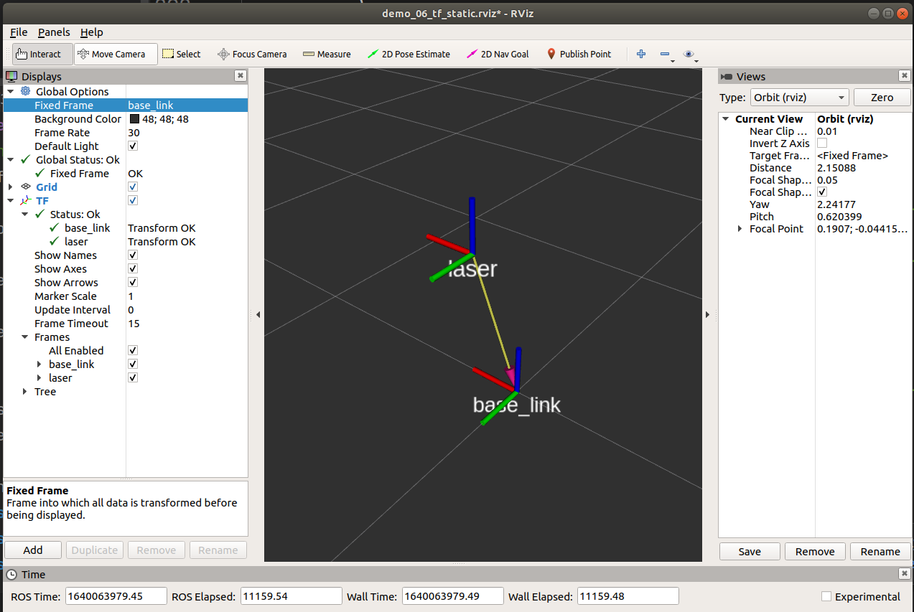

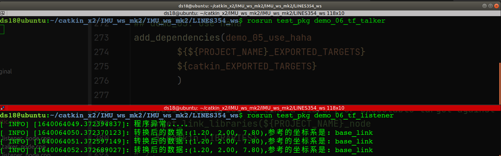

```SHELL
$ rosnode list

/demo_06_tf_static_broadcast
/demo_06_tf_static_subscribe


$ rostopic list

/clicked_point					
/initialpose				# Type: geometry_msgs/PoseWithCovarianceStamped
/move_base_simple/goal		# Type: geometry_msgs/PoseStamped
/rosout						
/rosout_agg
/tf							# Type: tf2_msgs/TFMessage
/tf_static					# Type: tf2_msgs/TFMessage
```

查看相关的 rosnode 信息：`rosnode info`

```shell
$ rosnode info /demo_06_tf_static_broadcast 
--------------------------------------------------------------------------------
Node [/demo_06_tf_static_broadcast]
Publications: 
 * /rosout [rosgraph_msgs/Log]
 * /tf_static [tf2_msgs/TFMessage]

Subscriptions: None

Services: 
 * /demo_06_tf_static_broadcast/get_loggers
 * /demo_06_tf_static_broadcast/set_logger_level


contacting node http://ubuntu:41321/ ...
Pid: 107039
Connections:
 * topic: /rosout
    * to: /rosout
    * direction: outbound (34193 - 127.0.0.1:40940) [12]
    * transport: TCPROS
 * topic: /tf_static
    * to: /rviz_1640052818025969474
    * direction: outbound (34193 - 127.0.0.1:40938) [10]
    * transport: TCPROS
 * topic: /tf_static
    * to: /demo_06_tf_static_subscribe
    * direction: outbound (34193 - 127.0.0.1:40950) [13]
    * transport: TCPROS

---+---+---+---+---+---+---+---+---+---+---+---+---+---+---+---+


$ rosnode info /demo_06_tf_static_subscribe 
--------------------------------------------------------------------------------
Node [/demo_06_tf_static_subscribe]
Publications: 
 * /rosout [rosgraph_msgs/Log]

Subscriptions: 
 * /tf [unknown type]
 * /tf_static [tf2_msgs/TFMessage]

Services: 
 * /demo_06_tf_static_subscribe/get_loggers
 * /demo_06_tf_static_subscribe/set_logger_level


contacting node http://ubuntu:43257/ ...
Pid: 107128
Connections:
 * topic: /rosout
    * to: /rosout
    * direction: outbound (42035 - 127.0.0.1:40484) [13]
    * transport: TCPROS
 * topic: /tf_static
    * to: /demo_06_tf_static_broadcast (http://ubuntu:41321/)
    * direction: inbound (40950 - ubuntu:34193) [12]
    * transport: TCPROS
```

与 tf 相关的 topic：

```shell
$ rostopic info /initialpose
Type: geometry_msgs/PoseWithCovarianceStamped

Publishers: 
 * /rviz_1640052818025969474 (http://ubuntu:34477/)

Subscribers: None

---+---+---+---+---+---+---+---+---+---+---+---+---+---+---+---+

$ rostopic info /move_base_simple/goal
Type: geometry_msgs/PoseStamped

Publishers: 
 * /rviz_1640052818025969474 (http://ubuntu:34477/)

Subscribers: None

---+---+---+---+---+---+---+---+---+---+---+---+---+---+---+---+

$ rostopic info /tf
Type: tf2_msgs/TFMessage

Publishers: None

Subscribers: 
 * /rviz_1640052818025969474 (http://ubuntu:34477/)
 * /demo_06_tf_static_subscribe (http://ubuntu:43257/)

---+---+---+---+---+---+---+---+---+---+---+---+---+---+---+---+

$ rostopic info /tf_static
Type: tf2_msgs/TFMessage

Publishers: 
 * /demo_06_tf_static_broadcast (http://ubuntu:41321/)

Subscribers: 
 * /rviz_1640052818025969474 (http://ubuntu:34477/)
 * /demo_06_tf_static_subscribe (http://ubuntu:43257/)
```


##### 关于如何查看一个 rosnode 中的所包含的消息信息：

这样就可以避免盲查。

**就当前程序来说，查看消息的流程：**

```shell
# 1. 使用 rosnode list 查看当前运行的 node 节点，可以使用 rosnode cleanup 进行清理。

# 2. 使用 rosnode info 查看目标 node 节点信息。

# 3.1. 在结果的 Publications、Subscriptions 中可以得到 
#	1. 此 node 节点发布、订阅的 topic 列表，以及 这些 topic 说使用的消息类别。
#   2. 此 node 节点包含的服务 Services 列表中。
# 3.2. 同样的，也可以获取 目标 node 中连接的对象信息 Connections，比如 topic。

# 4. 在 3.2 中，可以使用 rostopic type topic_name 获取 topic 包含的消息类型 <message type>

# 5. 使用 rosmsg info <message type> 查看消息的信息
```

**示例：**

> ---
>
> **步骤1：**rosnode list
>
> ```shell
> $ rosnode list
> /demo_06_tf_static_broadcast
> /demo_06_tf_static_subscribe
> /rosout
> /rviz_1640052818025969474
> 
> ```
>
> ---
>
> **步骤2：**rosnode info 查看目标 node：/demo_06_tf_static_broadcast 节点信息
>
> ```shell
> $ rosnode info /demo_06_tf_static_broadcast 
> --------------------------------------------------------------------------------
> Node [/demo_06_tf_static_broadcast]
> Publications: 
>  * /rosout [rosgraph_msgs/Log]
>  * /tf_static [tf2_msgs/TFMessage]
> 
> Subscriptions: None
> 
> Services: 
>  * /demo_06_tf_static_broadcast/get_loggers
>  * /demo_06_tf_static_broadcast/set_logger_level
> 
> 
> contacting node http://ubuntu:41321/ ...
> Pid: 107039
> Connections:
>  * topic: /rosout
>     * to: /rosout
>     * direction: outbound (34193 - 127.0.0.1:40940) [12]
>     * transport: TCPROS
>  * topic: /tf_static
>     * to: /rviz_1640052818025969474
>     * direction: outbound (34193 - 127.0.0.1:40938) [10]
>     * transport: TCPROS
>  * topic: /tf_static
>     * to: /demo_06_tf_static_subscribe
>     * direction: outbound (34193 - 127.0.0.1:40950) [13]
>     * transport: TCPROS
> 
> ```
>
> ---
>
> **步骤3：**从 Publications、Subscriptions、Services 以及 Connections 查看 包含的 topic 或 消息。这里可以确定是 topic 是：/tf_static，topic 中的通信数据是：/tf2_msgs/TFMessage
>
> ---
>
> **步骤4：**在确定目标 node 节点 的目标 topic 名称之后，就可以查阅 这个 topic 使用的消息类别：rostopic type topic_name，获得的结果是 消息类型 `<message_type>`
>
> ```shell
> $ rostopic type /tf_static
> tf2_msgs/TFMessage
> ```
>
> ---
>
> **步骤5：**使用 `rosmsg info <message_type>` 查看消息信息：
>
> ```shell
> $ rosmsg info tf2_msgs/TFMessage
> geometry_msgs/TransformStamped[] transforms
>   std_msgs/Header header
>     uint32 seq
>     time stamp
>     string frame_id
>   string child_frame_id
>   geometry_msgs/Transform transform
>     geometry_msgs/Vector3 translation
>       float64 x
>       float64 y
>       float64 z
>     geometry_msgs/Quaternion rotation
>       float64 x
>       float64 y
>       float64 z
>       float64 w
> ```
>
> ---


#### 4. 补充

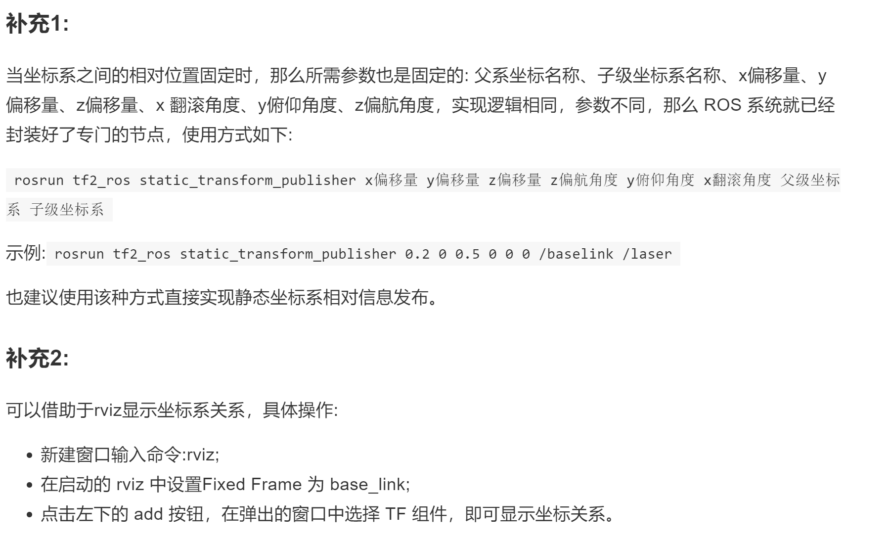


---


### 03. Dynamic TF（动态坐标转换）

#### 0. Some Ponts Noted

> ---
>
> **动态坐标变换，是指两个坐标系之间的相对位置是变化的。**
>
> ---


#### 1. 需求与流程

> ---
>
> **需求描述:**
>
> 启动 turtlesim_node，该节点中窗体有一个世界坐标系（world）（左下角为坐标系原点），乌龟是另一个坐标系（turtle1），键盘控制乌龟运动，将两个坐标系的相对位置动态发布。
>
> ---
>
> **实现分析:**
>
> 1. 乌龟本身不但可以看作坐标系，也是世界坐标系中的一个坐标点
>
>    乌龟自身是坐标系，也是世界坐标系的点。
>
> 2. 订阅 turtle1/pose,可以获取乌龟在**世界坐标系**的 x坐标、y坐标、偏移量以及线速度和角速度
>
> 3. 将 pose 信息转换成 坐标系相对信息并发布（怎么转，转出的数据代表什么？）
>
> ---
>
> **实现流程：**C++ 与 Python 实现流程一致
>
> 1. 新建功能包，添加依赖
> 2. 创建**坐标相对关系发布方**(同时需要订阅乌龟位姿信息)
> 3. 创建**坐标相对关系订阅方**
> 4. 执行
>
> ---


#### 2. C++ 实现 ★

##### 1. 发布方（talker）

**`demo_07_tf_dynamic_talker_node.cpp`**

````cpp
//
// Created by ds18 on 12/21/21.
//

/*
    动态的坐标系相对姿态发布(一个坐标系相对于另一个坐标系的相对姿态是不断变动的)

    需求: 启动 turtlesim_node,该节点中窗体有一个世界坐标系(左下角为坐标系原点)，乌龟是另一个坐标系，键盘
    控制乌龟运动，将两个坐标系的相对位置动态发布

    实现分析:
        1.乌龟本身不但可以看作坐标系，也是世界坐标系中的一个坐标点
        2.订阅 turtle1/pose,可以获取乌龟在世界坐标系的 x坐标、y坐标、偏移量以及线速度和角速度
        3.将 pose 信息转换成 坐标系相对信息并发布

    实现流程:
        1.包含头文件
        2.初始化 ROS 节点
        3.创建 ROS 句柄
        4.创建订阅对象
        5.回调函数处理订阅到的数据(实现TF广播)
            5-1.创建 TF 广播器
            5-2.创建 广播的数据(通过 pose 设置)
            5-3.广播器发布数据
        6.spin
*/

// 1.包含头文件
#include "ros/ros.h"
#include "turtlesim/Pose.h"
#include "tf2_ros/transform_broadcaster.h"
#include "geometry_msgs/TransformStamped.h"
#include "tf2/LinearMath/Quaternion.h"

void doPose(const turtlesim::Pose::ConstPtr &pose) {
    //  5-1.创建 TF 广播器
    static tf2_ros::TransformBroadcaster broadcaster;

    //  5-2.创建 广播的数据(通过 pose 设置)
    geometry_msgs::TransformStamped tfs;

    //  |----头设置
    tfs.header.frame_id = "world";
    tfs.header.stamp = ros::Time::now();

    //  |----坐标系 ID
    tfs.child_frame_id = "turtle1";

    //  |----坐标系相对信息设置
    tfs.transform.translation.x = pose->x;
    tfs.transform.translation.y = pose->y;
    tfs.transform.translation.z = 0.0; 	// 二维实现，pose 中没有z，z 是 0

    //  |--------- 四元数设置
    tf2::Quaternion qtn;
    qtn.setRPY(0, 0, pose->theta);		// r, p, y 值可以计算 x, y, z, w
    tfs.transform.rotation.x = qtn.getX();
    tfs.transform.rotation.y = qtn.getY();
    tfs.transform.rotation.z = qtn.getZ();
    tfs.transform.rotation.w = qtn.getW();

    //  5-3.广播器发布数据
    broadcaster.sendTransform(tfs);
}

int main(int argc, char *argv[]) {
    setlocale(LC_ALL, "");

    // 2.初始化 ROS 节点
    ros::init(argc, argv, "demo_07_dynamic_tf_pub");

    // 3.创建 ROS 句柄
    ros::NodeHandle nh;

    // 4.创建订阅对象
    // 5.回调函数处理订阅到的数据(实现TF广播)
    // 订阅的 topic：/turtle1/pose 是由 /turtlesim 发布的（龟龟模拟器）
    ros::Subscriber sub = nh.subscribe<turtlesim::Pose>("/turtle1/pose", 1000, doPose);

    // 6.spin
    ros::spin();
    return 0;
}

````

###### 代码解释

```cpp
/**************************************************
	1. 这个是发布方源码，他有两个功能
		1. 订阅 节点 /turtlesim_node 发布的 话题 /turtle1/pose
		2. 进行一个 tf 转换，从 header 坐标系到 child 坐标系，并发布这个 tf 转换	
**************************************************/


/**************************************************
	2. 创建了一个订阅对象，这个订阅对象订阅一个话题。
	This method connects to the master to register interest in a given topic. The node will automatically be connected with publishers on this topic.
    包含此订阅对象的节点自动的连接到这个话题的发布者上。
	On each message receipt, callback is invoked and passed a shared pointer to the message received. 
	对于每一个接收到的信息，会调用一个回调函数，这个回调函数会给接收到的消息传递一个共享指针。
	This message should not be changed in place, as it is shared with any other subscriptions to this topic.
    这个消息不应该在适当的位置更改，因为他与其他订阅此话题的订阅者共享。
	This version of subscribe allows anything bindable to a boost::function object
**************************************************/
    // 4.创建订阅对象
    // 5.回调函数处理订阅到的数据(实现TF广播)
    // 订阅的 topic：/turtle1/pose 是由 /turtlesim 发布的（龟龟模拟器）
    ros::Subscriber sub = nh.subscribe<turtlesim::Pose>("/turtle1/pose", 1000, doPose);  // 订阅者 订阅 一个话题，并接收消息。并给接收到的消息传递一个共享指针函数。


/**************************************************
	3. 在回调函数中处理接收到的消息
	
	第一步：创建广播器对象（静态）：tf2_ros::TransformBroadcaster。
	This class provides an easy way to publish coordinate frame transform information.
    一个简单的发布 坐标系转换信息的 方式。
	It will handle all the messaging and stuffing of messages. And the function prototypes lay out all the necessary data needed for each message.
	
	第二步：创建 坐标系转换信息的消息 对象：geometry_msgs::TransformStamped
	# This expresses a transform from coordinate frame header.frame_id
	# to the coordinate frame child_frame_id
	# This message is mostly used by the 
	# tf package. 
	这个消息会被 广播器对象发布。
	这个消息 表示了一个 从 header.frame_id 坐标系 到 child_frame_id 坐标系的一个转换。
	也就是 header.frame_id 坐标系 ---（tf msgs）---》 child_frame_id 坐标系。
	
	$ rosnode info /demo_07_dynamic_tf_pub 
	-----------------------------------------
	Node [/demo_07_dynamic_tf_pub]
	Publications: 
 	* /rosout [rosgraph_msgs/Log]
 	* /tf [tf2_msgs/TFMessage] # 可以看出发布者发布了这个消息：/tf

	Subscriptions: 
 	* /turtle1/pose [turtlesim/Pose]  # 发布者订阅了这个消息：/turtle1/pose
 	
 	void doPose(const turtlesim::Pose::ConstPtr &pose) {
    //  5-1.创建 TF 广播器
    static tf2_ros::TransformBroadcaster broadcaster;

    //  5-2.创建 广播的数据(通过 pose 设置)
    geometry_msgs::TransformStamped tfs;

    //  |----头设置
    tfs.header.frame_id = "world";
    tfs.header.stamp = ros::Time::now();

    //  |----坐标系 ID
    tfs.child_frame_id = "turtle1";

    //  |----坐标系相对信息设置
    tfs.transform.translation.x = pose->x;
    tfs.transform.translation.y = pose->y;
    tfs.transform.translation.z = 0.0; // 二维实现，pose 中没有z，z 是 0

    //  |--------- 四元数设置，这个不太懂
    tf2::Quaternion qtn;
    qtn.setRPY(0, 0, pose->theta);
    tfs.transform.rotation.x = qtn.getX();
    tfs.transform.rotation.y = qtn.getY();
    tfs.transform.rotation.z = qtn.getZ();
    tfs.transform.rotation.w = qtn.getW();

    //  5-3.广播器发布数据
    broadcaster.sendTransform(tfs);
}

**************************************************/


/**************************************************

	4. 四元数的设置
	通过 
	
    //  |--------- 四元数设置，这个不太懂
    tf2::Quaternion qtn;
    qtn.setRPY(0, 0, pose->theta);

   * @brief Set the quaternion using fixed axis RPY
   * @param roll Angle around X 
   * @param pitch Angle around Y
   * @param yaw Angle around Z
  
void setRPY(const tf2Scalar& roll, const tf2Scalar& pitch, const tf2Scalar& yaw)
{
	tf2Scalar halfYaw = tf2Scalar(yaw) * tf2Scalar(0.5);  
	tf2Scalar halfPitch = tf2Scalar(pitch) * tf2Scalar(0.5);  	
	tf2Scalar halfRoll = tf2Scalar(roll) * tf2Scalar(0.5);  
	tf2Scalar cosYaw = tf2Cos(halfYaw);
	tf2Scalar sinYaw = tf2Sin(halfYaw);
	tf2Scalar cosPitch = tf2Cos(halfPitch);
	tf2Scalar sinPitch = tf2Sin(halfPitch);
	tf2Scalar cosRoll = tf2Cos(halfRoll);
	tf2Scalar sinRoll = tf2Sin(halfRoll);
	setValue(
		sinRoll * cosPitch * cosYaw - cosRoll * sinPitch * sinYaw, // x
        cosRoll * sinPitch * cosYaw + sinRoll * cosPitch * sinYaw, // y
        cosRoll * cosPitch * sinYaw - sinRoll * sinPitch * cosYaw, // z
        cosRoll * cosPitch * cosYaw + sinRoll * sinPitch * sinYaw  // w
        ); //formerly yzx
	}
	
	
	//  |--------- 四元数设置，这个不太懂
    tf2::Quaternion qtn;
    qtn.setRPY(0, 0, pose->theta);
    tfs.transform.rotation.x = qtn.getX();
    tfs.transform.rotation.y = qtn.getY();
    tfs.transform.rotation.z = qtn.getZ();
    tfs.transform.rotation.w = qtn.getW();
	
**************************************************/

```


这个是 topic：`/turtle1/pose` 与 `/tf`的关系截图：

> 通过上面的代码详解，可以知道 /turtle1/Pose 消息中的 x, y, theta 值会被 doPose() 函数处理，这三个值分别用来计算 /tf 中的 x, y, 以及四元数的 rotation（这个四元数rotation 是通过 /turtle1/Pose 中的 theta 计算的）。
>
> 也就是说 world 坐标系 与 turtle1 坐标系的相对位置关系是 Pose 值。

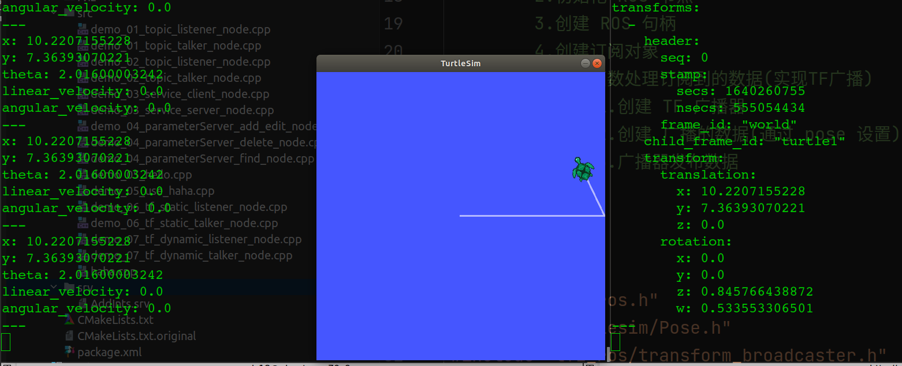

```shell
# 关于如何查阅 topic 中的消息信息
# 此发布者节点中 它将订阅的 /turtle1/pose -- turtlesim/Pose 消息数据进行处理 doPOse()
# 在 doPose() 回调函数中，geometry_msgs::TransformStamped 对象使用 turtlesim/Pose 
# 消息数据，进行 header坐标系 到 child坐标系的转换，并将这个动态的 tf 进行发布。

# ----- /turtle1/pose ----- turtlesim/Pose

$ rostopic type /turtle1/pose 
turtlesim/Pose

$ rosmsg 
list      md5       package   packages  show      

$ rosmsg show turtlesim/Pose 
float32 x
float32 y
float32 theta
float32 linear_velocity
float32 angular_velocity


# ----- /tf ----- tf2_msgs/TFMessage

ds18@ubuntu:~$ rostopic type /tf
tf2_msgs/TFMessage
ds18@ubuntu:~$ rosmsg show tf2_msgs/TFMessage 
geometry_msgs/TransformStamped[] transforms
  std_msgs/Header header
    uint32 seq
    time stamp
    string frame_id
  string child_frame_id
  geometry_msgs/Transform transform
    geometry_msgs/Vector3 translation
      float64 x
      float64 y
      float64 z
    geometry_msgs/Quaternion rotation
      float64 x
      float64 y
      float64 z
      float64 w

```


##### 2. 订阅方（listener）

**`demo_07_tf_dynamic_listener_node.cpp`**

````cpp
//
// Created by ds18 on 12/21/21.
//

//1.包含头文件
#include "ros/ros.h"
#include "tf2_ros/transform_listener.h"
#include "tf2_ros/buffer.h"
#include "geometry_msgs/PointStamped.h"
#include "tf2_geometry_msgs/tf2_geometry_msgs.h" //注意: 调用 transform 必须包含该头文件

int main(int argc, char *argv[]) {
    setlocale(LC_ALL, "");

    // 2.初始化 ROS 节点
    ros::init(argc, argv, "demo_07_dynamic_tf_sub");
    ros::NodeHandle nh;

    // 3.创建 TF 订阅节点
    tf2_ros::Buffer buffer;
    tf2_ros::TransformListener listener(buffer);

    ros::Rate r(1);
    while (ros::ok()) {
        // 4.生成一个坐标点(相对于子级坐标系)
        geometry_msgs::PointStamped point_laser;
        point_laser.header.frame_id = "turtle1";
        point_laser.header.stamp = ros::Time();
        point_laser.point.x = 1;
        point_laser.point.y = 1;
        point_laser.point.z = 0;

        // 5.转换坐标点(相对于父级坐标系)
        //新建一个坐标点，用于接收转换结果
        //--使用 try 语句或休眠，否则可能由于缓存接收延迟而导致坐标转换失败--
        try {
            geometry_msgs::PointStamped point_base;
            point_base = buffer.transform(point_laser, "world");
            ROS_INFO("坐标点相对于 world 的坐标为:(%.2f,%.2f,%.2f)", point_base.point.x, point_base.point.y, point_base.point.z);
        }
        catch (const std::exception &e) {
            // std::cerr << e.what() << '\n';
            ROS_INFO("程序异常:%s", e.what());
        }

        r.sleep();
        ros::spinOnce();
    }

    return 0;
}

````

###### 代码解释

```cpp
/**************************************************
**************************************************/

/**************************************************

	1. 之前 发布者 已经确定了 world 坐标系 与 turtle1 坐标系的关系。
	   现在 在 turtle1 坐标系下创建一个点，要求出 此点在 world 坐标系下的位置

**************************************************/


/**************************************************
	
	* 先提一个问题，如果使用 roslaunch，那么如果每一个 node 程序都有 log 输出，那么这些 log 将会如何在一个窗口中排版？可以从下面的截图中看出，talker 与 listener 都有 log 输出，那么当使用一个窗口时，是如何显示的呢？
	* 答：所有的 log 会输出到同一个命令行窗口下。
[ INFO] [1640268338.875076518]: Processing Pose values...					# talker
[ INFO] [1640268338.891580859]: Processing Pose values...					# talker
[ INFO] [1640268338.893761165]: 坐标点相对于 world 的坐标为:(6.54,7.54,0.00)	 # listener

	
	
**************************************************/


/**************************************************

	// 3.创建 TF 订阅节点
	// 存储坐标系，并提供服务，响应客户端请求。
	// 接收坐标系转换信息
	
	Standard implementation of the tf2_ros::BufferInterface abstract data type.
Inherits tf2_ros::BufferInterface and tf2::BufferCore. 
	Stores known frames and offers a ROS service, "tf_frames", which responds to client requests with a response containing a tf2_msgs::FrameGraph representing the relationship of known
	创建一个 Buffer 对象 存储已知坐标系并提供一个ROS服务“tf_frames”，该服务（srv）响应客户端请求（request），其中包含一个代表已知关系的tf2_msgs::FrameGraph  
	
    tf2_ros::Buffer buffer;
    
   	This class provides an easy way to request and receive coordinate frame transform information.
   	此类提供了一个便捷的方法请求与接收 坐标系转换信息。
    
    tf2_ros::TransformListener listener(buffer);

**************************************************/


/**************************************************

	// 4.生成一个坐标点(相对于子级坐标系)
	// 就是在 turtle1 坐标系下创建一个 点
    geometry_msgs::PointStamped point_laser;
    point_laser.header.frame_id = "turtle1";
    
            

**************************************************/


/**************************************************

    // 5.转换坐标点(相对于父级坐标系)
    //新建一个坐标点，用于接收转换结果
    //--使用 try 语句或休眠，否则可能由于缓存接收延迟而导致坐标转换失败--
    // 创建一个 坐标点。
    // 这个坐标点的值是通过 transfrom 函数计算出来的。
        
    buffer.transform() 
    template <class T>
    T transform(
    	const T& in,
		const std::string& target_frame, 
		ros::Duration timeout=ros::Duration(0.0)) const
	
	Transform an input into the target frame. This function is templated and can take as input any valid mathematical object that tf knows how to apply a transform to, by way of the templated math conversions interface.
    将 input 转换到 目标 坐标系中，即，将 point_laser 转换到 world 坐标系中，结果就是 point_base。这个转换应该是 旋转 + 平移。
	For example, the template type could be a Transform, Pose, Vector, or Quaternion message type (as defined in geometry_msgs).
    
    try {
        geometry_msgs::PointStamped point_base;
        point_base = buffer.transform(point_laser, "world");
		...
	}
	
	
	
**************************************************/
```

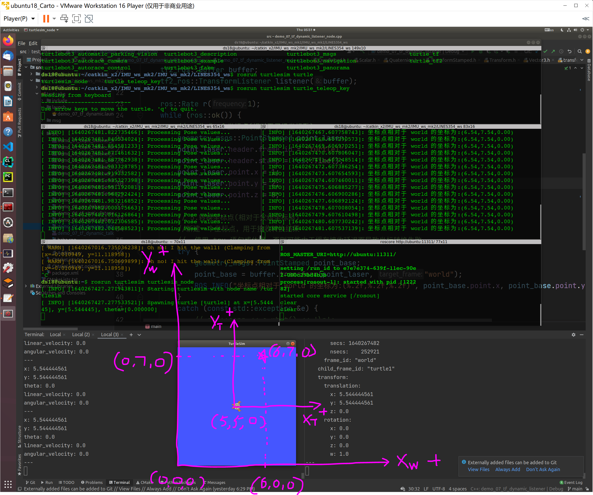

> 从截图中可以看见，Pose 的 x=5.54，y=5.54，那么使用这个 Pose 的值进行 **world 坐标系** 到 **turtle 坐标系** 的转换（**这里不考虑旋转**），如果以 world 为 fixed frame，即 world (x=0, y=0 , z=0)，那么 转换后的 turtle 为 turtle (x=5.54, y=5.54, z=0)，龟龟头的方向是 x 正向，左侧为 y 正向。
>
> 在 listener 代码中 创建了 一个 点 laser，这个点 laser 相对于 turtle 坐标系的 坐标的为 point|t (x=1, y=2, z=0)。经过转换，点 laser 相对于 world 坐标系的 坐标为 point|w (x=6.54, y=7.54, z=0)。
>
> 因为 turtle 坐标系是可以相对于 world 坐标系进行旋转的，所以 点 laser 主要映射到 world 坐标系下，需要进行 **平移+旋转**。


**如何自己实现这种变换函数**（需要看视觉14讲）。


##### 3. 配置文件 ★

只记录修改项。

`CMakeLists.txt`

```cmake
## Find catkin macros and libraries
## if COMPONENTS list like find_package(catkin REQUIRED COMPONENTS xyz)
## is used, also find other catkin packages
find_package(catkin REQUIRED COMPONENTS
        roscpp
        rospy
        std_msgs
        message_generation  # 需要加入 message_generation,必须有 std_msgs

        geometry_msgs       # demo_06 tf static
        tf2                 # demo_06 tf static
        tf2_ros             # demo_06 tf static
        tf2_geometry_msgs   # demo_06 tf static

        turtlesim           # demo_07 tf dynamic
        )


######################################################################


## demo_07: tf dynamic talker
add_executable(demo_07_tf_dynamic_talker
        src/demo_07_tf_dynamic_talker_node.cpp
        )

## demo_07: tf dynamic listener
add_executable(demo_07_tf_dynamic_listener
        src/demo_07_tf_dynamic_listener_node.cpp
        )


######################################################################


## demo_07: tf dynamic talker
target_link_libraries(demo_07_tf_dynamic_talker
        ${catkin_LIBRARIES}
        )

## demo_07: tf dynamic listener
target_link_libraries(demo_07_tf_dynamic_listener
        ${catkin_LIBRARIES}
        )
```

###### cmake 讲解（略）


##### 4. launch 文件

```xml
<launch>

    <!-- run turtlesim_node node: turtlesim_node -->
    <node pkg="turtlesim" type="turtlesim_node" 
          name="demo_07_tutlesim_node" required="true"/>

    <!-- run turtle_teleop_key node: turtle_teleop_key ? -->
    <node pkg="turtlesim" type="turtle_teleop_key" 
          name="demo_07_turtle_teleop_key"/>

    <!-- run talker node: demo_07_dynamic_tf_pub -->
    <node pkg="test_pkg" type="demo_07_tf_dynamic_talker" 
          name="demo_07_dynamic_tf_pub" />

    <!-- run listener node: demo_07_dynamic_tf_sub -->
    <node pkg="test_pkg" type="demo_07_tf_dynamic_listener" 
          name="demo_07_dynamic_tf_sub" />

    <!-- run rviz -->
    <node pkg="rviz" type="rviz" 
          name="rviz" 
          args="-d $(find test_pkg)/rviz/demo_07_tf_dynamic.rviz"/>

</launch>

<!-- ----------------------------------
	node  --- 包含的某个节点
		pkg ----- 功能包: 使用 rospack find 查找到的 pkg_name
		type ---- 被运行的节点文件: add_executable 中的二进制名称
		name   -- 为节点命名: 使用 rosnode list 得到的 node 名称
		output  - 设置日志的输出目标
----------------------------------- -->
```

###### 代码解释：

> ---
>
> 通过 launch 文件设置参数的方式前面已经介绍过了。
>
> 可以在 node 标签外，或 node 标签中通过 param 或 rosparam 来设置参数。
>
> 在 node 标签外设置的参数是全局性质的，参考的是 `/` 。
>
> 在 node 标签中设置的参数是私有性质的，参考的是 `/命名空间/节点名称`。
>
> ---
>
> 
>
> ```xml
> <launch>
> 
>     <param name="p1" value="100" />
>     <node pkg="turtlesim" type="turtlesim_node" name="t1">
>         <param name="p2" value="100" />
>     </node>
> 
> </launch>
> ```
>
> ---


#### 3. 实现结果与调试：

**`rosrun rqt_tf_tree rqt_tf_tree`**

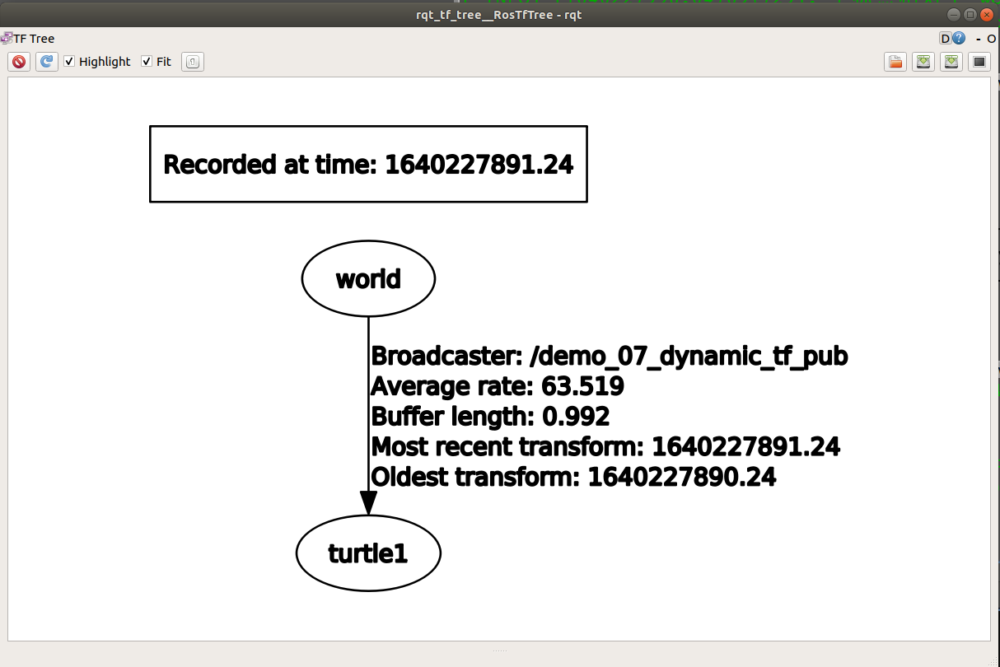

**`rqt_graph`**

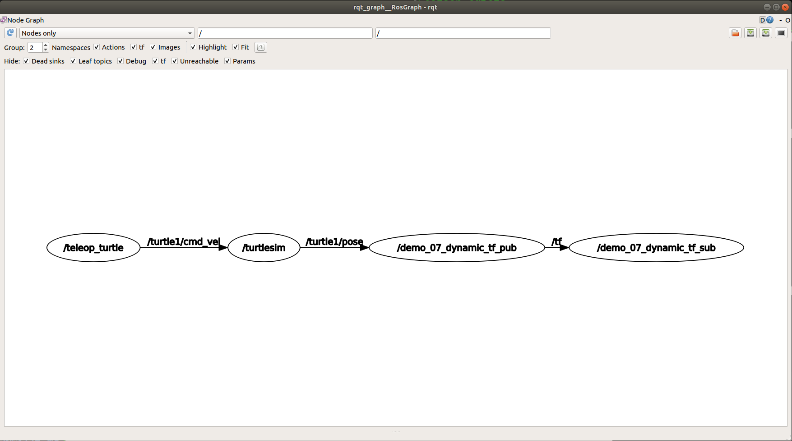

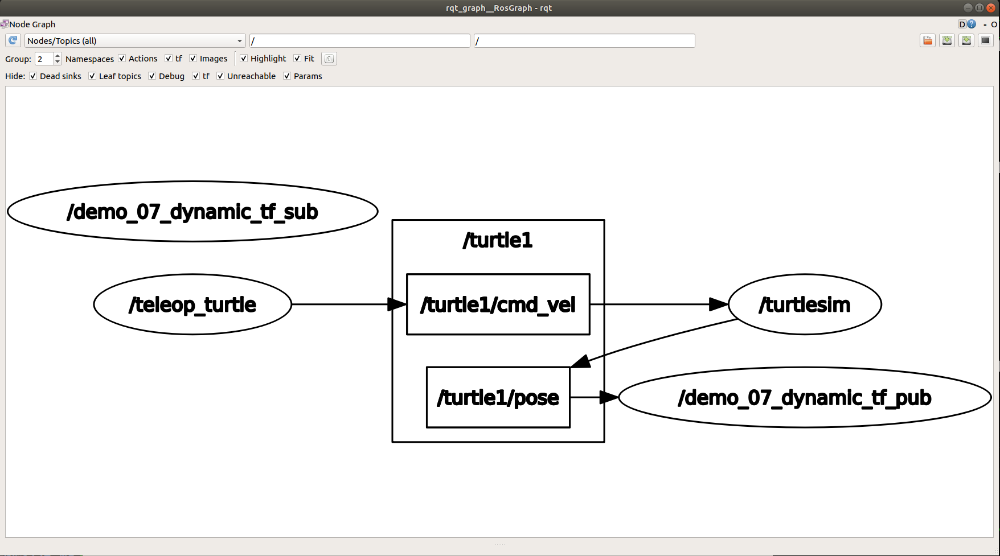


```shell
$ rosnode list

/demo_07_dynamic_tf_pub
/demo_07_dynamic_tf_sub
/rosout
/teleop_turtle
/turtlesim


---+---+---+---+---+---+---+---+---+---+---+---+---+---+---+


ds18@ubuntu:~/catkin_x2/IMU_ws_mk2/IMU_ws_mk2/LINES354_ws$ rosnode info /demo_07_dynamic_tf_pub 
--------------------------------------------------------------------------------
Node [/demo_07_dynamic_tf_pub]
Publications: 
 * /rosout [rosgraph_msgs/Log]
 * /tf [tf2_msgs/TFMessage]

Subscriptions: 
 * /turtle1/pose [turtlesim/Pose]

Services: 
 * /demo_07_dynamic_tf_pub/get_loggers
 * /demo_07_dynamic_tf_pub/set_logger_level


contacting node http://ubuntu:42885/ ...
Pid: 121306
Connections:
 * topic: /rosout
    * to: /rosout
    * direction: outbound (50609 - 127.0.0.1:59432) [13]
    * transport: TCPROS
 * topic: /tf
    * to: /demo_07_dynamic_tf_sub
    * direction: outbound (50609 - 127.0.0.1:59442) [11]
    * transport: TCPROS
 * topic: /turtle1/pose
    * to: /turtlesim (http://ubuntu:38797/)
    * direction: inbound (38568 - ubuntu:51303) [12]
    * transport: TCPROS


---+---+---+---+---+---+---+---+---+---+---+---+---+---+---+

    
ds18@ubuntu:~/catkin_x2/IMU_ws_mk2/IMU_ws_mk2/LINES354_ws$ rosnode info /demo_07_dynamic_tf_sub 
--------------------------------------------------------------------------------
Node [/demo_07_dynamic_tf_sub]
Publications: 
 * /rosout [rosgraph_msgs/Log]

Subscriptions: 
 * /tf [tf2_msgs/TFMessage]
 * /tf_static [unknown type]

Services: 
 * /demo_07_dynamic_tf_sub/get_loggers
 * /demo_07_dynamic_tf_sub/set_logger_level


contacting node http://ubuntu:44661/ ...
Pid: 121409
Connections:
 * topic: /rosout
    * to: /rosout
    * direction: outbound (55439 - 127.0.0.1:44052) [13]
    * transport: TCPROS
 * topic: /tf
    * to: /demo_07_dynamic_tf_pub (http://ubuntu:42885/)
    * direction: inbound (59442 - ubuntu:50609) [12]
    * transport: TCPROS

```


---


### 04. Multi-cord. TF（多坐标变换）


#### 0. Some Points Noted（略）


#### 1. 需求与流程

>现有坐标系统，父级坐标系统 world,下有两子级系统 son1，son2。
>
>son1 相对于 world，以及 son2 相对于 world 的关系是已知的。
>
>求 son1原点在 son2中的坐标。
>
>又已知在 son1中一点的坐标，要求求出该点在 son2 中的坐标

> **实现分析:**
>
> 1. 首先，需要发布 son1 相对于 world，以及 son2 相对于 world 的坐标消息
> 2. 然后，需要订阅坐标发布消息，并取出订阅的消息，借助于 tf2 实现 son1 和 son2 的转换
> 3. 最后，还要实现坐标点的转换
>
> **实现流程:**C++ 与 Python 实现流程一致
>
> 1. 新建功能包，添加依赖
> 2. 创建坐标相对关系发布方(需要发布两个坐标相对关系)
> 3. 创建坐标相对关系订阅方
> 4. 执行


#### 2. C++ 实现

##### 1. 发布方（talker）

`demo_08_tf_multi.launch`

```xml
    <!-- talker/publisher -->

    <!--x, y, z, r, p, y-->
    <node pkg="tf2_ros" type="static_transform_publisher" name="demo_08_son1"
          args="0.2 0.8 0.3 0 0 0 /world /son1"
          output="screen"/>

    <node pkg="tf2_ros" type="static_transform_publisher" name="demo_08_son2"
          args="0.5 0 0 0 0 0 /world /son2"
          output="screen"/>
```


##### 2. 订阅方（listener）

`demo_08_tf_multi_sub.cpp`

```cpp
//
// Created by ds18 on 12/23/21.
//

/*

需求:
    现有坐标系统，父级坐标系统 world,下有两子级系统 son1，son2，
    son1 相对于 world，以及 son2 相对于 world 的关系是已知的，
    求 son1 与 son2中的坐标关系，又已知在 son1中一点的坐标，要求求出该点在 son2 中的坐标
实现流程:
    1.包含头文件
    2.初始化 ros 节点
    3.创建 ros 句柄
    4.创建 TF 订阅对象
    5.解析订阅信息中获取 son1 坐标系原点在 son2 中的坐标
      解析 son1 中的点相对于 son2 的坐标
    6.spin

*/

// 1.包含头文件
#include "ros/ros.h"
#include "tf2_ros/transform_listener.h"
#include "tf2/LinearMath/Quaternion.h"
#include "tf2_geometry_msgs/tf2_geometry_msgs.h"
#include "geometry_msgs/TransformStamped.h"
#include "geometry_msgs/PointStamped.h"


int main(int argc, char *argv[]) {

    setlocale(LC_ALL, "");

    // 2.初始化 ros 节点
    ros::init(argc, argv, "demo_08_listener_sub_frames_node");

    // 3.创建 ros 句柄
    ros::NodeHandle nh;

    // 4.创建 TF 订阅对象
    tf2_ros::Buffer buffer;
    tf2_ros::TransformListener listener(buffer);

    // 5.解析订阅信息中获取 son1 坐标系原点在 son2 中的坐标
    ros::Rate r(1);
    while (ros::ok()) {
        try {
            // 解析 son1 中的点相对于 son2 的坐标
            geometry_msgs::TransformStamped tfs = buffer.lookupTransform("son2", "son1", ros::Time(0));
            ROS_INFO("Son1 相对于 Son2 的坐标关系:父坐标系ID=%s", tfs.header.frame_id.c_str());
            ROS_INFO("Son1 相对于 Son2 的坐标关系:子坐标系ID=%s", tfs.child_frame_id.c_str());
            ROS_INFO("Son1 相对于 Son2 的坐标关系:x=%.2f,y=%.2f,z=%.2f",
                     tfs.transform.translation.x,
                     tfs.transform.translation.y,
                     tfs.transform.translation.z
            );

            // 坐标点解析
            // 在 son1 坐标系下定义一个点 ps
            geometry_msgs::PointStamped ps;
            ps.header.frame_id = "son1";
            ps.header.stamp = ros::Time::now();
            ps.point.x = 1.0;
            ps.point.y = 2.0;
            ps.point.z = 3.0;

            // 
            geometry_msgs::PointStamped psAtSon2;
            psAtSon2 = buffer.transform(ps, "son2");
            ROS_INFO("在 Son2 中的坐标:x=%.2f,y=%.2f,z=%.2f",
                     psAtSon2.point.x,
                     psAtSon2.point.y,
                     psAtSon2.point.z
            );
        }
        catch (const std::exception &e) {
            // std::cerr << e.what() << '\n';
            ROS_INFO("异常信息:%s", e.what());
        }

        r.sleep();
        // 6.spin
        ros::spinOnce();
    }
    return 0;
}

```

代码解释：

> 这个代码实现了几个功能。
>
> 1. 确定了 son1 坐标系原点 在 son2 坐标系下的位置。
>
> 2. 在 son1 坐标系下定义了一个点 ps。
>
>    [ INFO] [1640332328.852339810]: Son1 相对于 Son2 的坐标关系:父坐标系ID=son2
>    [ INFO] [1640332328.852908173]: Son1 相对于 Son2 的坐标关系:子坐标系ID=son1
>    [ INFO] [1640332328.853316122]: Son1 相对于 Son2 的坐标关系:x=-0.30,y=0.80,z=0.30
>
> 3. 将 son1 坐标系下的点 ps 转换到 son2 坐标系下的 psAtSon2
>
>    [ INFO] [1640332327.854015209]: 在 Son2 中的坐标:x=0.70,y=2.80,z=3.30

```cpp
// 解析 son1 中的点相对于 son2 的坐标
/*
	这个代码的功能实现了：
	确定了 son1 坐标系原点 在 son2 坐标系下的位置。
	
	Get the transform between two frames by frame ID.
	
	Parameters

	target_frame
		The frame to which data should be transformed

	source_frame
		The frame where the data originated

	time
		The time at which the value of the transform is desired. (0 will get the latest)
	
	Returns

		The transform between the frames
	
	Possible exceptions tf2::LookupException, tf2::ConnectivityException, 		tf2::ExtrapolationException, tf2::InvalidArgumentException
	
*/
geometry_msgs::TransformStamped tfs = buffer.lookupTransform(
    "son2", "son1", ros::Time(0));
```

```cpp
/*
这个代码的功能实现了：
在 son1 坐标系下定义了一个点 ps。
*/

// 坐标点解析
// 在 son1 坐标系下定义一个点 ps
geometry_msgs::PointStamped ps;
ps.header.frame_id = "son1";
ps.header.stamp = ros::Time::now();
ps.point.x = 1.0;
ps.point.y = 2.0;
ps.point.z = 3.0;
```

```cpp
/*
	这段代码实现了:
	将 son1 坐标系下的点 ps 转换到 son2 坐标系下的 psAtSon2
	
	Transform an input into the target frame.
    将 input 转换到 target 坐标系
	This function is templated and can take as input any valid mathematical object that tf knows how to apply a transform to, by way of the templated math conversions interface. For example, the template type could be a Transform, Pose, Vector, or Quaternion message type (as defined in geometry_msgs).
Template Parameters

T
The type of the object to transform.
Parameters

in
The object to transform.

target_frame
The string identifer for the frame to transform into.

timeout
How long to wait for the target frame. Default value is zero (no blocking).
Returns

The transformed output.
*/
geometry_msgs::PointStamped psAtSon2;
psAtSon2 = buffer.transform(ps, "son2");
ROS_INFO("在 Son2 中的坐标:x=%.2f,y=%.2f,z=%.2f",
	psAtSon2.point.x,
	psAtSon2.point.y,
	psAtSon2.point.z
```


##### 3. 配置文件

只对修改的部分进行记录。

配置文件只修改了`CMakeLists.txt`。

`CMakeLists.txt`

```cmake
## demo_08: tf multi listener
add_executable(demo_08_tf_multi_listener
        src/demo_08_tf_multi_sub.cpp
        )
        
        
## demo_08: tf multi listener
target_link_libraries(demo_08_tf_multi_listener
        ${catkin_LIBRARIES}
        )
```


##### 4. launch 文件

`demo_08_tf_multi.launch`

```xml
<launch>

    <!-- talker/publisher -->

    <!--x, y, z, r, p, y-->
    <node pkg="tf2_ros" type="static_transform_publisher" name="demo_08_son1"
          args="0.2 0.8 0.3 0 0 0 /world /son1"
          output="screen"/>

    <node pkg="tf2_ros" type="static_transform_publisher" name="demo_08_son2"
          args="0.5 0 0 0 0 0 /world /son2"
          output="screen"/>

    <!-- listener/subscriber -->
    <node pkg="test_pkg" type="demo_08_tf_multi_listener" name="demo_08_listener_sub_frames_node"
          output="screen"/>

</launch>

```


#### 3. 实现结果与调试

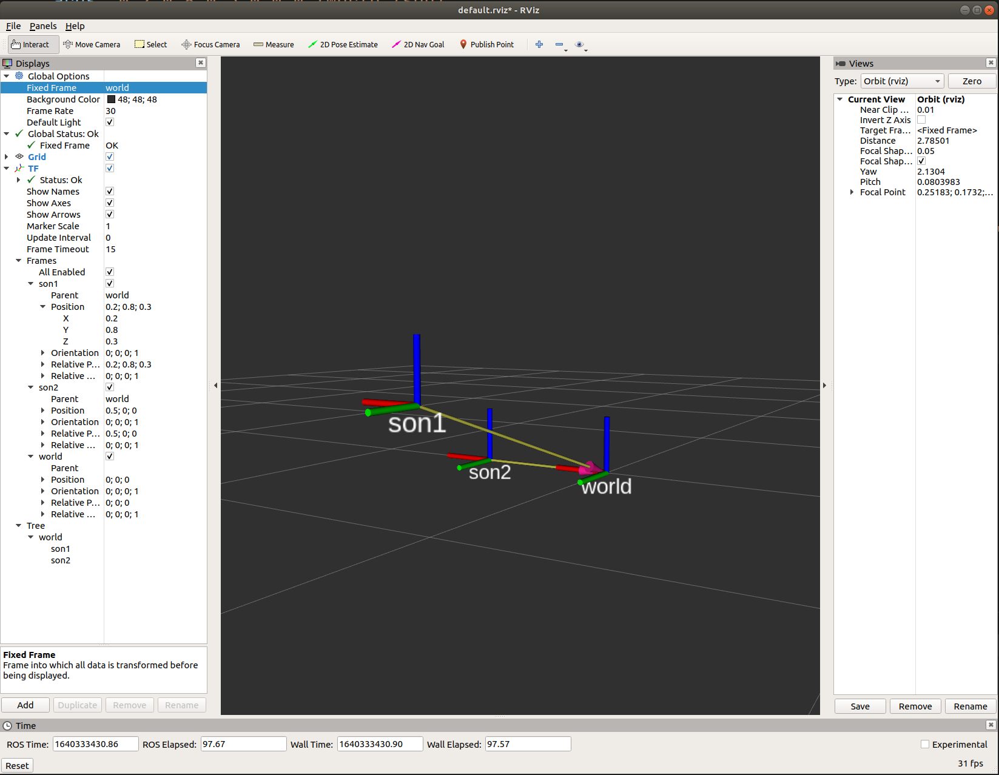

```
[ INFO] [1640332326.852381489]: Son1 相对于 Son2 的坐标关系:父坐标系ID=son2
[ INFO] [1640332326.852849971]: Son1 相对于 Son2 的坐标关系:子坐标系ID=son1
[ INFO] [1640332326.853126984]: Son1 相对于 Son2 的坐标关系:x=-0.30,y=0.80,z=0.30
[ INFO] [1640332326.853487339]: 在 Son2 中的坐标:x=0.70,y=2.80,z=3.30
[ INFO] [1640332327.852615377]: Son1 相对于 Son2 的坐标关系:父坐标系ID=son2
[ INFO] [1640332327.853071496]: Son1 相对于 Son2 的坐标关系:子坐标系ID=son1
[ INFO] [1640332327.853414112]: Son1 相对于 Son2 的坐标关系:x=-0.30,y=0.80,z=0.30
[ INFO] [1640332327.854015209]: 在 Son2 中的坐标:x=0.70,y=2.80,z=3.30
[ INFO] [1640332328.852339810]: Son1 相对于 Son2 的坐标关系:父坐标系ID=son2
[ INFO] [1640332328.852908173]: Son1 相对于 Son2 的坐标关系:子坐标系ID=son1
[ INFO] [1640332328.853316122]: Son1 相对于 Son2 的坐标关系:x=-0.30,y=0.80,z=0.30
```


---


### 05. 坐标系关系查看

**Some Points Noted**

> 在机器人系统中，涉及的坐标系有多个。
>
> 为了方便查看，ros 提供了专门的工具，可以用于生成显示坐标系关系的 pdf 文件，该文件包含树形结构的坐标系图谱。
>
> ---
>
> 安装 tf2_tools
>
> ```shell
> sudo apt install ros-noetic-tf2-tools
> ```
>
> ---
>
> 使用：
>
> 确定坐标系广播程序启动：
>
> ```cpp
> static tf2_ros::TransformBroadcaster broadcaster;
> broadcaster.sendTransform(tfs);
> ```
>
> ---
>
> 生成 坐标系转换关系 pdf 文件：
>
> 选择或创建一个目录用来存放生成的 坐标系关系 pdf。
>
> ```shell
> rosrun tf2_tools view_frames.py
> 
> # ---+ 输出 ---+---+---+---+---+---+---+---+---+---+---+---+---+---+---+：
> 
> [INFO] [1592920556.827549]: Listening to tf data during 5 seconds...
> [INFO] [1592920561.841536]: Generating graph in frames.pdf file...
> ```
>
> ---
>
> 生成的文件：
>
> 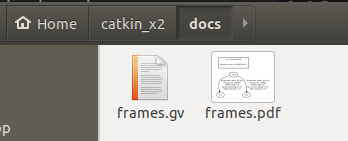
>
> 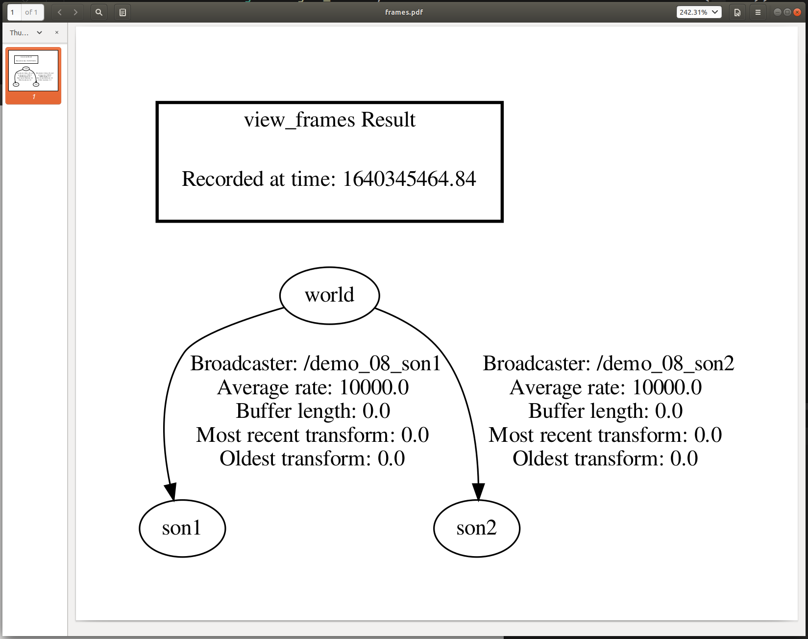
>
> ---


---


### 06. TF 坐标系变换 Practice ★

#### 0. Some Points Noted


#### 1. 需求与流程

> **实现分析:**
>
> 乌龟跟随实现的核心，是乌龟A和B都要发布相对世界坐标系的坐标信息，然后，订阅到该信息需要转换获取A相对于B坐标系的信息，最后，再生成速度信息，并控制B运动。
>
> 1. 启动乌龟显示节点
> 2. 在乌龟显示窗体中生成一只新的乌龟(需要使用服务)
> 3. 编写两只乌龟发布坐标信息的节点
> 4. 编写订阅节点订阅坐标信息并生成新的相对关系生成速度信息


> **实现流程:**C++ 与 Python 实现流程一致
>
> 1. 新建功能包，添加依赖
> 2. 编写服务客户端，用于生成一只新的乌龟
> 3. 编写发布方，发布两只乌龟的坐标信息
> 4. 编写订阅方，订阅两只乌龟信息，生成速度信息并发布
> 5. 运行


#### 2. C++ 实现 ★

##### 0. 服务客户端 ★

`demo_09_tf_practice_turtleSpawn.cpp`

```cpp
//
// Created by ds18 on 12/25/21.
//

/*
 * 创建第二只小乌龟
 */
#include "ros/ros.h"
#include "turtlesim/Spawn.h"

int main(int argc, char *argv[]) {

    setlocale(LC_ALL, "");

    //执行初始化
    ros::init(argc, argv, "demo_09_create_turtle_node");
    //创建节点
    ros::NodeHandle nh;

    // 1. 创建服务客户端
    ros::ServiceClient client = nh.serviceClient<turtlesim::Spawn>("/spawn");

    // 2. 等待
    ros::service::waitForService("/spawn");
    turtlesim::Spawn spawn;
    spawn.request.name = "turtle2";
    spawn.request.x = 1.0;
    spawn.request.y = 2.0;
    spawn.request.theta = 3.12415926;
    
    // 3. 客户端发送请求
    bool flag = client.call(spawn);
    if (flag) {
        ROS_INFO("乌龟 %s 创建成功!", spawn.response.name.c_str());
    } else {
        ROS_INFO("乌龟 %s 创建失败!", spawn.response.name.c_str());
    }

    ros::spin();

    return 0;
}

```

###### 代码解释：

```cpp
// 创建服务的客户端，客户端 发送请求，服务端 响应 请求。
// 等待服务端 启动。
// 这个服务的名称是 /spawn
// 发送请求,返回 bool 值，标记是否成功

/*

$ rosservice 
args  call  find  info  list  type  uri 

$ rosservice list

$ rosservice info /spawn

Node: /demo_09_turtle_1
URI: rosrpc://ubuntu:33169
Type: turtlesim/Spawn
Args: x y theta name

*/
    
    // 1. 创建服务客户端
    ros::ServiceClient client = nh.serviceClient<turtlesim::Spawn>("/spawn");

	// 2. 等待服务启动
    ros::service::waitForService("/spawn");
    
    // 3. 客户端发送请求
    bool flag = client.call(spawn);
```


##### 1. 发布方 ★

`demo_09_tf_practice_talker.cpp`

```cpp
//
// Created by ds18 on 12/25/21.
//

/*
    该文件实现:需要订阅 turtle1 和 turtle2 的 pose，然后广播相对 world 的坐标系信息

    注意: 订阅的两只 turtle,除了命名空间(turtle1 和 turtle2)不同外,
          其他的话题名称和实现逻辑都是一样的，
          所以我们可以将所需的命名空间通过 args 动态传入

    实现流程:
        1.包含头文件
        2.初始化 ros 节点
        3.解析传入的命名空间
        4.创建 ros 句柄
        5.创建订阅对象
        6.回调函数处理订阅的 pose 信息
            6-1.创建 TF 广播器
            6-2.将 pose 信息转换成 TransFormStamped
            6-3.发布
        7.spin

*/

//1.包含头文件
#include "ros/ros.h"
#include "turtlesim/Pose.h"
#include "tf2_ros/transform_broadcaster.h"
#include "tf2/LinearMath/Quaternion.h"
#include "geometry_msgs/TransformStamped.h"

//保存乌龟名称
std::string turtle_name;


void doPose(const turtlesim::Pose::ConstPtr &pose) {

    ROS_DEBUG("**** in doPose...");
//    ROS_INFO("**** in doPose...");

    //  6-1.创建 TF 广播器 ---------------注意 static
    static tf2_ros::TransformBroadcaster broadcaster;
    //  6-2.将 pose 信息转换成 TransFormStamped
    geometry_msgs::TransformStamped tfs;

    tfs.header.frame_id = "world";
    tfs.header.stamp = ros::Time::now();
    tfs.child_frame_id = turtle_name;
    tfs.transform.translation.x = pose->x;
    tfs.transform.translation.y = pose->y;
    tfs.transform.translation.z = 0.0;
    tf2::Quaternion qtn;
    qtn.setRPY(0, 0, pose->theta);
    tfs.transform.rotation.x = qtn.getX();
    tfs.transform.rotation.y = qtn.getY();
    tfs.transform.rotation.z = qtn.getZ();
    tfs.transform.rotation.w = qtn.getW();

    //  6-3.发布
    broadcaster.sendTransform(tfs);
}

int main(int argc, char *argv[]) {
    setlocale(LC_ALL, "");

    // 2.初始化 ros 节点
    ros::init(argc, argv, "demo_09_pub_tf");

    // 3.解析传入的命名空间
    if (argc != 2) {
        ROS_ERROR("请传入正确的参数");
    } else {
        turtle_name = argv[1];
        ROS_INFO("乌龟 %s 坐标发送启动", turtle_name.c_str());
    }

    // 4.创建 ros 句柄
    ros::NodeHandle nh;

    // 5.创建订阅对象
//    std::cout << "**** " << turtle_name + "/pose" << std::endl;
    ROS_INFO("topic name: %s: ", (turtle_name + "/pose").c_str());
    ros::Subscriber sub = nh.subscribe<turtlesim::Pose>(turtle_name + "/pose", 1000, doPose);

    ros::spin();
    return 0;
}

```

##### 代码解释：

```cpp
// 在解析传入的命名空间代码中，与之适配的 launch 文件代码是：
/*
    <!-- run double times talker node -->
    <node pkg="test_pkg" type="demo_09_tf_practice_pub_tf" 
    	  name="demo_09_pub_tf_turtle_1"
          output="screen" args="turtle1"/>

    <node pkg="test_pkg" type="demo_09_tf_practice_pub_tf"
    	  name="demo_09_pub_tf_turtle_2"
          output="screen" args="turtle2"/>
*/
// 这段命令相当于：
// executable_name param_1
// demo_09_tf_practice_pub_tf turtle2
/*
    ROS_INFO("argc: %d ", argc);
    ROS_INFO("argv[0]: %s", argv[0]);
    ROS_INFO("argv[1]: %s", argv[1]);

[ INFO] [1640525516.630568739]: argc: 2 
[ INFO] [1640525516.630579171]: argv[0]: /home/ds18/catkin_x2/IMU_ws_mk2/IMU_ws_mk2/LINES354_ws/devel/lib/test_pkg/demo_09_tf_practice_pub_tf
[ INFO] [1640525516.630589191]: argv[1]: turtle2

*/

	// 3.解析传入的命名空间
    if (argc != 2) {
        ROS_ERROR("请传入正确的参数");
    } else {
        turtle_name = argv[1];
        ROS_INFO("乌龟 %s 坐标发送启动", turtle_name.c_str());
    }
```

```cpp
// 订阅 turtlesim/pose 消息  
// 并将这个消息转换成 TransformStamped
// 将转换后的 TransformStamped 广播发布
// turtle1/pose --> tf

/*

$ rosnode info /demo_09_pub_tf_turtle_1
--------------------------------------------------------------------------------
Node [/demo_09_pub_tf_turtle_1]
Publications: 
 * /rosout [rosgraph_msgs/Log]
 * /tf [tf2_msgs/TFMessage]

Subscriptions: 
 * /turtle1/pose [turtlesim/Pose]

Services: 
 * /demo_09_pub_tf_turtle_1/get_loggers
 * /demo_09_pub_tf_turtle_1/set_logger_level

*/

    // 5.创建订阅对象
    ROS_INFO("topic name: %s: ", (turtle_name + "/pose").c_str());
    ros::Subscriber sub = nh.subscribe<turtlesim::Pose>(turtle_name + "/pose", 1000, doPose);


void doPose(const turtlesim::Pose::ConstPtr &pose) {

    ROS_DEBUG("**** in doPose...");
//    ROS_INFO("**** in doPose...");

    //  6-1.创建 TF 广播器 ---------------注意 static
    static tf2_ros::TransformBroadcaster broadcaster;
    //  6-2.将 pose 信息转换成 TransFormStamped, pose --> tf
    geometry_msgs::TransformStamped tfs;

    //  6-3.发布
    broadcaster.sendTransform(tfs);
}
```


##### 2. 订阅方 ★

`demo_09_tf_practice_listener.cpp`

```cpp
//
// Created by ds18 on 12/25/21.
//

/*
    订阅 turtle1 和 turtle2 的 TF 广播信息，查找并转换时间最近的 TF 信息
    将 turtle1 转换成相对 turtle2 的坐标，在计算线速度和角速度并发布

    实现流程:
        1.包含头文件
        2.初始化 ros 节点
        3.创建 ros 句柄
        4.创建 TF 订阅对象
        5.处理订阅到的 TF
        6.spin

*/

// 1.包含头文件
#include "ros/ros.h"
#include "tf2_ros/transform_listener.h"
#include "geometry_msgs/TransformStamped.h"
#include "geometry_msgs/Twist.h"

int main(int argc, char *argv[]) {

    setlocale(LC_ALL, "");

    // 2.初始化 ros 节点
    ros::init(argc, argv, "demo_09_sub_TF");

    // 3.创建 ros 句柄
    ros::NodeHandle nh;

    // 4.创建 TF 订阅对象
    tf2_ros::Buffer buffer;
    tf2_ros::TransformListener listener(buffer);

    // 5.处理订阅到的 TF
    // 需要创建发布 /turtle2/cmd_vel 的 publisher 对象
    ros::Publisher pub = nh.advertise<geometry_msgs::Twist>("/turtle2/cmd_vel", 1000);

    ros::Rate rate(10);
    while (ros::ok()) {
        try {
            // 5-1.先获取 turtle1 相对 turtle2 的坐标信息
            geometry_msgs::TransformStamped tfs = buffer.lookupTransform("turtle2", "turtle1", ros::Time(0));

            // 5-2.根据坐标信息生成速度信息 -- geometry_msgs/Twist.h
            geometry_msgs::Twist twist;
            twist.linear.x = 0.5 * sqrt(pow(tfs.transform.translation.x, 2) + pow(tfs.transform.translation.y, 2));
            twist.angular.z = 4 * atan2(tfs.transform.translation.y, tfs.transform.translation.x);

            // 5-3.发布速度信息 -- 需要提前创建 publish 对象
            pub.publish(twist);
        }
        catch (const std::exception &e) {
            // std::cerr << e.what() << '\n';
            ROS_INFO("错误提示: %s", e.what());
        }


        rate.sleep();
        // 6.spin
        ros::spinOnce();
    }

    return 0;
}

```

###### 代码解释：

```cpp
// Buffer: 存储已知的 坐标系，并提供 ros 服务 tf_frames
// TransformListener: 提供坐标系转换信息的请求与接收方式
// 4.创建 TF 订阅对象
    tf2_ros::Buffer buffer;
    tf2_ros::TransformListener listener(buffer);


/*
	通过 turtle1/pose --> tf 信息，计算需要发布的 turtle2/cmd_vel 消息值
	创建 发布 话题 turtle2/cmd_vel 的对象
*/
    // 5.处理订阅到的 TF
    // 需要创建发布 /turtle2/cmd_vel 的 publisher 对象
    ros::Publisher pub = nh.advertise<geometry_msgs::Twist>("/turtle2/cmd_vel", 1000);
	
	// 发布话题，发布对象为 message Template
	pub.publish(twist);


/*

	buffer.lookupTransform: 查询坐标系转换信息，target=turtle2，source=turtle1
	
	创建 geometry_msgs::Twist 消息，这里通过计算 linear.x 与 angular.z （合起来是向量值？）来计算cmd_vel
	$ rosmsg show geometry_msgs/Twist
	geometry_msgs/Vector3 linear
  		float64 x
  		float64 y
  		float64 z
	geometry_msgs/Vector3 angular
  		float64 x
  		float64 y
  		float64 z
  		
  		
$ rostopic info /turtle2/cmd_vel 
Type: geometry_msgs/Twist

Publishers: 
 * /demo_09_listener (http://ubuntu:46251/)

Subscribers: 
 * /demo_09_turtle_1 (http://ubuntu:35893/)


$ rostopic info /turtle1/cmd_vel 
Type: geometry_msgs/Twist

Publishers: 
 * /demo_09_turtle_1_key (http://ubuntu:46209/)

Subscribers: 
 * /demo_09_turtle_1 (http://ubuntu:35893/)


*/
            // 5-1.先获取 turtle1 相对 turtle2 的坐标信息
            geometry_msgs::TransformStamped tfs = buffer.lookupTransform("turtle2", "turtle1", ros::Time(0));

            // 5-2.根据坐标信息生成速度信息 -- geometry_msgs/Twist.h
            geometry_msgs::Twist twist;
            twist.linear.x = 0.5 * sqrt(pow(tfs.transform.translation.x, 2) + pow(tfs.transform.translation.y, 2));
            twist.angular.z = 4 * atan2(tfs.transform.translation.y, tfs.transform.translation.x);
```


##### 3. 配置文件

只改动了`CMakeListes.txt`。

```cmake
## demo_09: tf practice listener
add_executable(demo_09_tf_practice_listener
        src/demo_09_tf_practice_listener.cpp
        )
        
        
## demo_09: tf practice listener
target_link_libraries(demo_09_tf_practice_listener
        ${catkin_LIBRARIES}
        )
```


##### 4. launch 文件

`demo_09_tf_practice.launch`

```xml
<launch>

    <!-- run turtlesim_node 1 and key control node -->
    <node pkg="turtlesim" type="turtlesim_node" name="demo_09_turtle_1"/>

    <node pkg="turtlesim" type="turtle_teleop_key" name="demo_09_turtle_1_key"/>

    <!-- run demo_09_create_turtle_node -->
    <node pkg="test_pkg" type="demo_09_tf_practice_turtleSpawn" 		
          name="demo_09_turtle_2" 
          output="screen"/>

    <!-- run double times talker node -->
    <node pkg="test_pkg" type="demo_09_tf_practice_pub_tf" 
          name="demo_09_pub_tf_turtle_1"
          output="screen" args="turtle1"/>

    <node pkg="test_pkg" type="demo_09_tf_practice_pub_tf" 
          name="demo_09_pub_tf_turtle_2"
          output="screen" args="turtle2"/>

    <!-- run listener node -->
    <node pkg="test_pkg" type="demo_09_tf_practice_listener" 
          name="demo_09_listener" output="screen"/>

</launch>
```


#### 3. 实现结果与调试

```shell
ds18@ubuntu:~/catkin_x2/IMU_ws_mk2/IMU_ws_mk2/LINES354_ws$ roslaunch test_pkg demo_09_tf_practice.launch 
... logging to /home/ds18/.ros/log/e7e7e374-639f-11ec-90e2-000c29bd4b3b/roslaunch-ubuntu-45301.log
Checking log directory for disk usage. This may take a while.
Press Ctrl-C to interrupt
Done checking log file disk usage. Usage is <1GB.

started roslaunch server http://ubuntu:34897/

SUMMARY
========

PARAMETERS
 * /rosdistro: melodic
 * /rosversion: 1.14.11

NODES
  /
    demo_09_listener (test_pkg/demo_09_tf_practice_listener)
    demo_09_pub_tf_turtle_1 (test_pkg/demo_09_tf_practice_pub_tf)
    demo_09_pub_tf_turtle_2 (test_pkg/demo_09_tf_practice_pub_tf)
    demo_09_turtle_1 (turtlesim/turtlesim_node)
    demo_09_turtle_1_key (turtlesim/turtle_teleop_key)
    demo_09_turtle_2 (test_pkg/demo_09_tf_practice_turtleSpawn)

ROS_MASTER_URI=http://localhost:11311

process[demo_09_turtle_1-1]: started with pid [45316]
process[demo_09_turtle_1_key-2]: started with pid [45317]
process[demo_09_turtle_2-3]: started with pid [45318]
process[demo_09_pub_tf_turtle_1-4]: started with pid [45324]
[ INFO] [1640522274.386934336]: waitForService: Service [/spawn] could not connect to host [ubuntu:36803], waiting...
process[demo_09_pub_tf_turtle_2-5]: started with pid [45330]
[ INFO] [1640522274.391568178]: 乌龟 turtle1 坐标发送启动
[ INFO] [1640522274.395249601]: topic name: turtle1/pose: 
process[demo_09_listener-6]: started with pid [45333]
[ INFO] [1640522274.398699379]: 乌龟 turtle2 坐标发送启动
[ INFO] [1640522274.401537706]: topic name: turtle2/pose: 
[ INFO] [1640522274.412442247]: 错误提示: "turtle2" passed to lookupTransform argument target_frame does not exist. 
[ INFO] [1640522274.494086271]: waitForService: Service [/spawn] is now available.
[ INFO] [1640522274.512734390]: 错误提示: "turtle2" passed to lookupTransform argument target_frame does not exist. 
[ INFO] [1640522274.612655381]: 错误提示: "turtle2" passed to lookupTransform argument target_frame does not exist. 
[ INFO] [1640522274.712868290]: 错误提示: "turtle2" passed to lookupTransform argument target_frame does not exist. 
[ INFO] [1640522274.812769395]: 错误提示: "turtle2" passed to lookupTransform argument target_frame does not exist. 
[ INFO] [1640522274.913601571]: 错误提示: "turtle2" passed to lookupTransform argument target_frame does not exist. 
[ INFO] [1640522275.013248582]: 错误提示: "turtle2" passed to lookupTransform argument target_frame does not exist. 
[ INFO] [1640522275.113203787]: 错误提示: "turtle2" passed to lookupTransform argument target_frame does not exist. 
[ INFO] [1640522275.212777146]: 错误提示: "turtle2" passed to lookupTransform argument target_frame does not exist. 
[ INFO] [1640522275.229157772]: 乌龟 turtle2 创建成功!
[ INFO] [1640522275.312663865]: 错误提示: "turtle2" passed to lookupTransform argument target_frame does not exist. 
[ INFO] [1640522275.412641974]: 错误提示: "turtle2" passed to lookupTransform argument target_frame does not exist. 
[ INFO] [1640522275.512515566]: 错误提示: "turtle2" passed to lookupTransform argument target_frame does not exist. 
[ INFO] [1640522275.613537395]: 错误提示: "turtle2" passed to lookupTransform argument target_frame does not exist. 
```

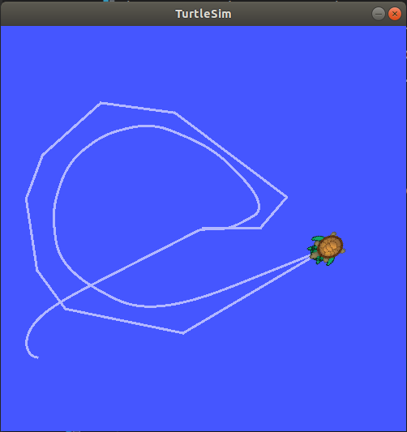

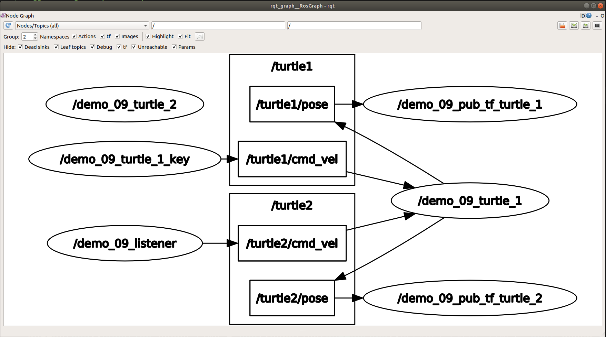

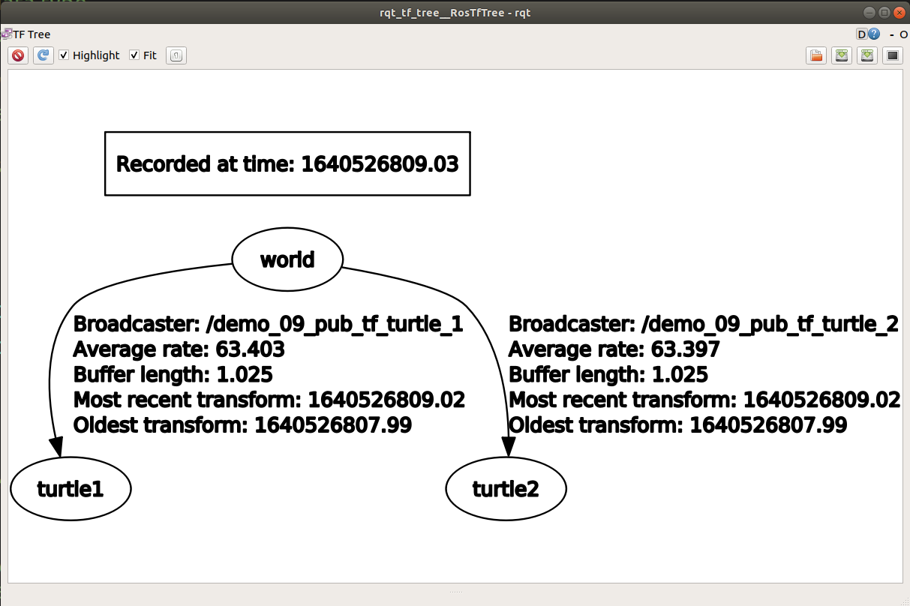

---


### 07. TF2 and TF（略）


---


## 02. rosbag


### 01. rosbag 命令行

#### 实现：

1.准备

创建目录保存录制的文件

```
mkdir ./xxx
cd xxx
```


2.开始录制

```
rosbag record -a -O 目标文件
```

操作小乌龟一段时间，结束录制使用 ctrl + c，在创建的目录中会生成bag文件。


3.查看文件

```
rosbag info 文件名
```


4.回放文件

```
rosbag play 文件名
```

重启乌龟节点，会发现，乌龟按照录制时的轨迹运动。


### 02. rosbag 代码（c++）✦✦

rosbag write

```c++
//
// Created by ds18 on 1/8/22.
//

#include "ros/ros.h"
#include "rosbag/bag.h"
#include "std_msgs/String.h"


int main(int argc, char *argv[])
{
    ros::init(argc,argv,"demo_chp05_bag_write");
    ros::NodeHandle nh;

    //创建bag对象
    rosbag::Bag bag;

    //打开
    bag.open("/home/ds18/catkin_x2/docs/test.bag",rosbag::BagMode::Write);

    //写
    std_msgs::String msg;
    msg.data = "hello world";
    bag.write("/chatter",ros::Time::now(),msg);
    bag.write("/chatter",ros::Time::now(),msg);
    bag.write("/chatter",ros::Time::now(),msg);
    bag.write("/chatter",ros::Time::now(),msg);

    //关闭
    bag.close();

    return 0;
}

```


rosbag read

```c++
//
// Created by ds18 on 1/8/22.
//

/*
    读取 bag 文件：
*/

#include "ros/ros.h"
#include "rosbag/bag.h"
#include "rosbag/view.h"
#include "std_msgs/String.h"
#include "std_msgs/Int32.h"

int main(int argc, char *argv[])
{

    setlocale(LC_ALL,"");

    ros::init(argc,argv,"demo_chp05_bag_read");
    ros::NodeHandle nh;

    //创建 bag 对象
    rosbag::Bag bag;

    //打开 bag 文件
    bag.open("/home/ds18/catkin_x2/docs/test.bag",rosbag::BagMode::Read);
    //读数据
    for (rosbag::MessageInstance const m : rosbag::View(bag))
    {
        std_msgs::String::ConstPtr p = m.instantiate<std_msgs::String>();
        if(p != nullptr){
            ROS_INFO("读取的数据:%s",p->data.c_str());
        }
    }
    //关闭文件流
    bag.close();
    
    return 0;
}

```

代码解释：

```c++
view 是 Bag 的 friend class

class ROSBAG_STORAGE_DECL Bag
{
    friend class MessageInstance;
    friend class View;
	
	...
}
```


---


## 03.  rqt 工具箱（略）


--


## 参考：

link：[ros教程第五章](http://www.autolabor.com.cn/book/ROSTutorials/di-6-zhang-ji-qi-ren-xi-tong-fang-zhen.html)

