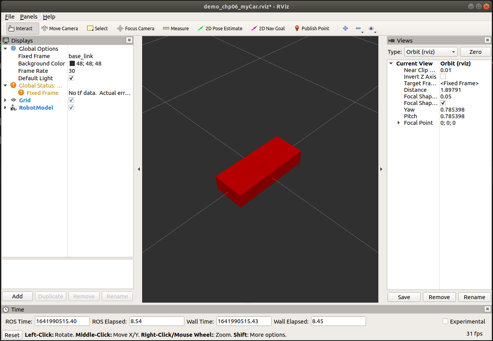
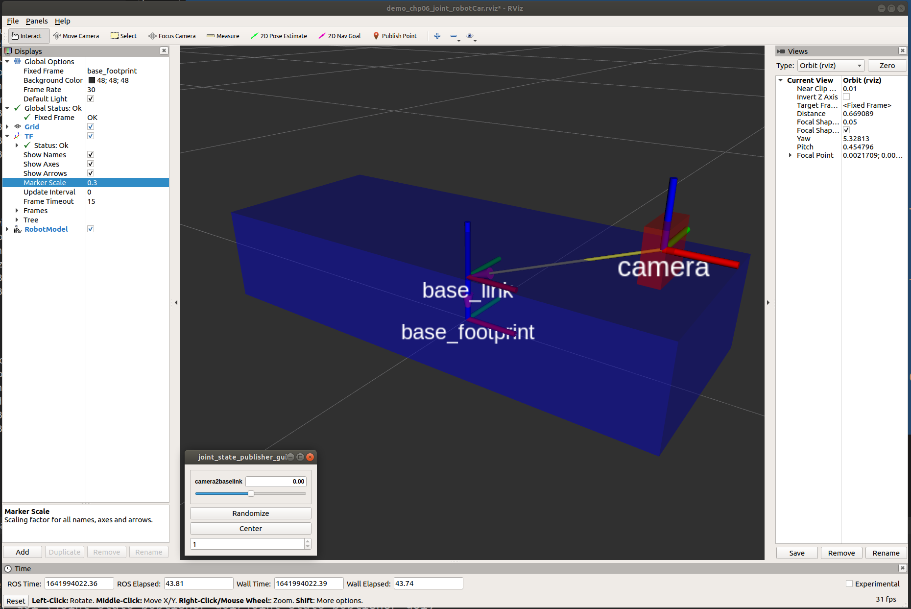
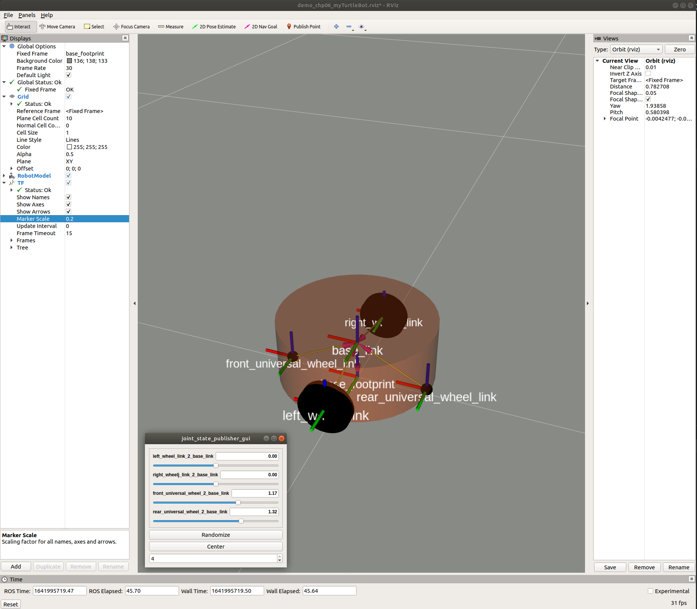
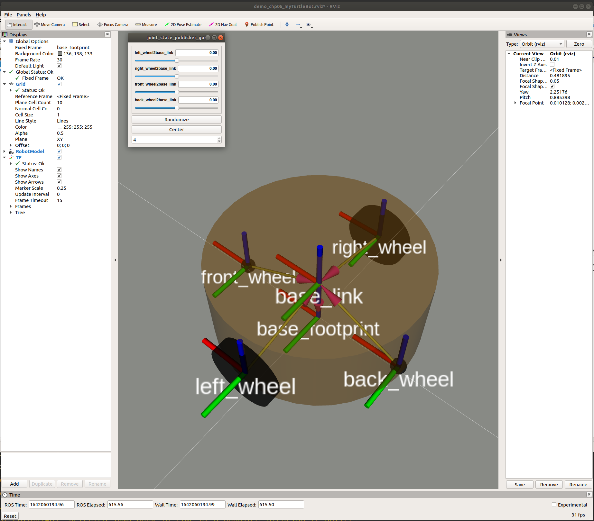
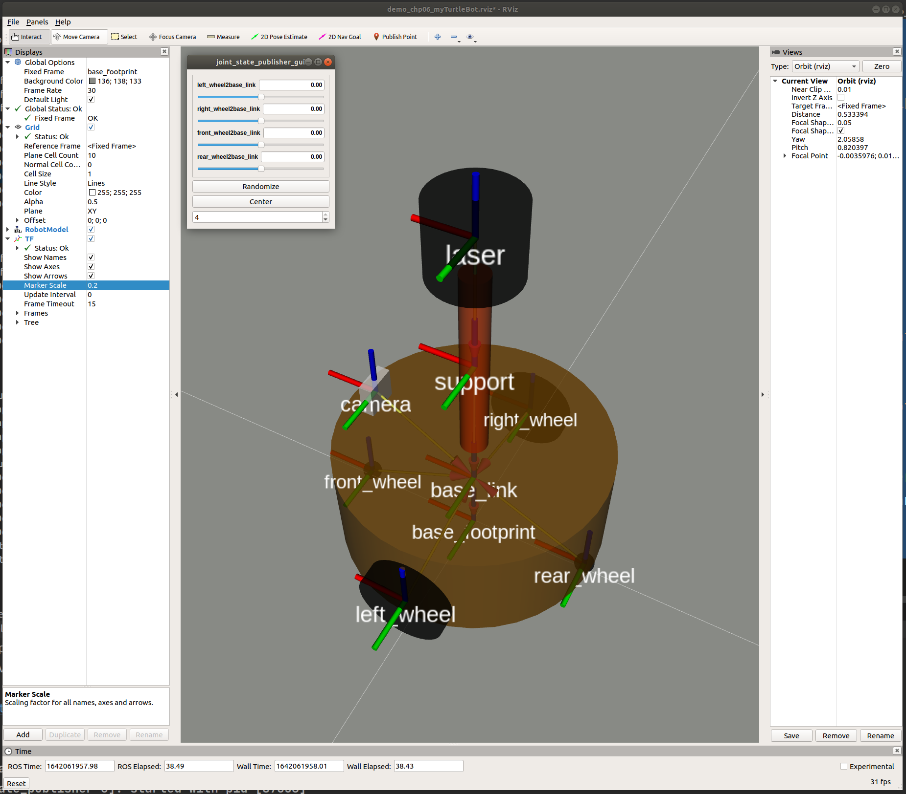
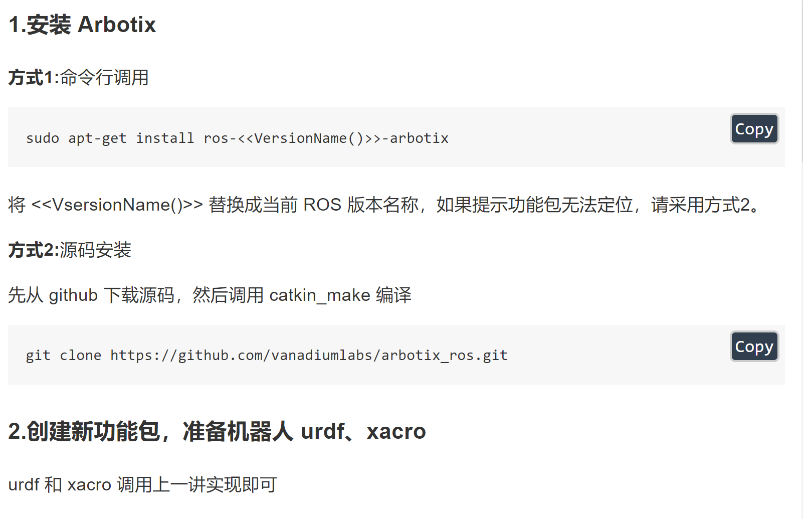
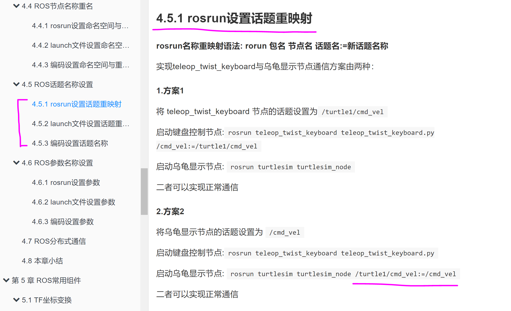
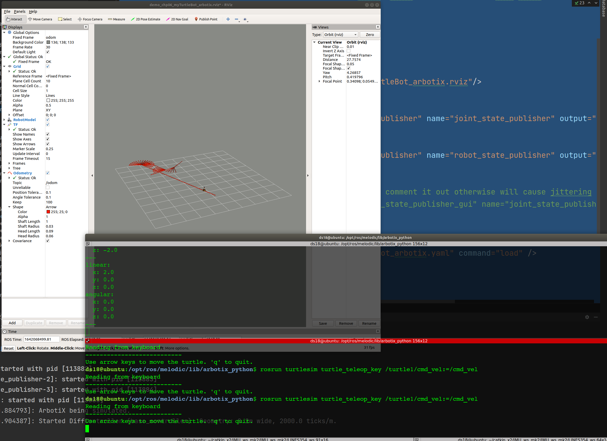

# 20220109_CHAP_06_ROS_SIMULATION_PART1

[TOC]


---


## 00. ros simulation 101

内容：

- 如何创建并显示机器人模型；
- 如何搭建仿真环境；
- 如何实现机器人模型与仿真环境的交互。


目标：

- 能够独立使用URDF创建机器人模型，并在Rviz和Gazebo中分别显示；
- 能够使用Gazebo搭建仿真环境；
- 能够使用机器人模型中的传感器(雷达、摄像头、编码器...)获取仿真环境数据。


---


## 01. 概述

### 1. **机器人系统仿真：**

是通过计算机对实体机器人系统进行模拟的技术。

在 ROS 中，仿真实现涉及的内容主要有三：

1. 对机器人建模(URDF)
2. 创建仿真环境(Gazebo)以及感知环境(Rviz)等系统性实现。


### 2. 仿真优势：

1. **低成本:** 当前机器人成本居高不下，动辄几十万，仿真可以大大降低成本，减小风险

2. **高效: **搭建的环境更为多样且灵活，可以提高测试效率以及测试覆盖率

3. **高安全性:** 仿真环境下，无需考虑耗损问题


### 3. 仿真缺陷：

机器人在仿真环境与实际环境下的表现差异较大，换言之，仿真并不能完全做到模拟真实的物理世界，存在一些"失真"的情况，原因:

1. 仿真器所使用的物理引擎目前还不能够完全精确模拟真实世界的物理情况

2. 仿真器构建的是关节驱动器（电机&齿轮箱）、传感器与信号通信的绝对理想情况，目前不支持模拟实际硬件缺陷或者一些临界状态等情形


### 4. 相关组件

#### 1. urdf

**URDF**是 Unified Robot Description Format，**统一(标准化)机器人描述格式**。

可以以一种 XML 的方式描述机器人的部分结构，比如底盘、摄像头、激光雷达、机械臂以及不同关节的自由度.....，该文件可以被 C++ 内置的解释器转换成可视化的机器人模型，是 ROS 中实现机器人仿真的重要组件。


#### 2. rviz

RViz 是 ROS Visualization Tool 的首字母缩写，直译为**ROS的三维可视化工具**。

安装：

```
sudo apt install ros-[ros-distro]-rviz
```


#### 3. gazebo

Gazebo是一款3D动态模拟器，用于显示机器人模型并创建仿真环境，能够在复杂的室内和室外环境中准确有效地模拟机器人。与游戏引擎提供高保真度的视觉模拟类似，Gazebo提供高保真度的物理模拟，其提供一整套传感器模型，以及对用户和程序非常友好的交互方式。


##### 相关问题与解决：`export SVGA_VGPU10=0`

**问题1:** VMware: vmw_ioctl_command error Invalid argument(无效的参数)

**解决：**

```shell
echo "export SVGA_VGPU10=0" >> ~/.bashrc
source .bashrc
```


**问题2：**[Err] [REST.cc:205] Error in REST request

**解决：**

`sudo gedit ~/.ignition/fuel/config.yaml`

然后将：`url : https://api.ignitionfuel.org` 使用 # 注释

再添加：`url: https://api.ignitionrobotics.org`


**问题3：**启动时抛出异常:`[gazebo-2] process has died [pid xxx, exit code 255, cmd.....`

**解决：**`killall gzserver`和`killall gzclient`


##### 安装 gazebo

```shell
# 1. 添加源

sudo sh -c 'echo "deb http://packages.osrfoundation.org/gazebo/ubuntu-stable `lsb_release -cs` main" 
>
 /etc/apt/sources.list.d/gazebo-stable.list'

wget http://packages.osrfoundation.org/gazebo.key -O - | sudo apt-key add -

# 2. 安装

sudo apt update

sudo apt install gazebo11 
sudo apt install libgazebo11-dev
```


### 5. 仿真系统

机器人的系统仿真是一种集成实现，主要包含三部分:

- URDF 用于创建机器人模型
- Gzebo 用于搭建仿真环境
- Rviz 图形化的显示机器人各种传感器感知到的环境信息

三者应用中，只是创建 URDF 意义不大，一般需要结合 Gazebo 或 Rviz 使用，在 Gazebo 或 Rviz 中可以将 URDF 文件解析为图形化的机器人模型，一般的使用组合为:

- 如果非仿真环境，那么使用 URDF 结合 Rviz 直接显示感知的真实环境信息
- 如果是仿真环境，那么需要使用 URDF 结合 Gazebo 搭建仿真环境，并结合 Rviz 显示感知的虚拟环境信息

后续课程安排:

- 先介绍 URDF 与 Rviz 集成使用，在 Rviz 中只是显示机器人模型，主要用于学习 URDF 语法
- 再介绍 URDF 与 Gazebo 集成，主要学习 URDF 仿真相关语法以及仿真环境搭建
- 最后集成 URDF 与 Gazebo 与 Rviz，实现综合应用

素材链接:

- https://github.com/zx595306686/sim_demo.git


---


## 02. URDF集成Rviz基本流程

### 0. 需求

> 在 Rviz 中显示一个盒状机器人


**实现流程：**

1. 准备：新建功能包，导入依赖
2. 核心：编写 urdf 文件
3. 核心：在 launch 文件集成 URDF 与 Rviz
4. 在 Rviz 中显示机器人模型


### 1. 创建功能包，导入依赖

在当前 package 下创建文件目录：

```
urdf: 		存储 urdf 文件的目录, xacro 文件可以放在里面

meshes:		机器人模型渲染文件(暂不使用)

config: 	配置文件

launch: 	存储 launch 启动文件
```


文件结构：

```shell
.../LINES354_ws/src/test_pkg$ tree
.
├── CMakeLists.txt
...
├── config
│   └── myTurtleBot_arbotix.yaml
├── include
...
├── launch
...
├── meshes
├── msg
...
├── package.xml
├── rviz
...
├── src
...
├── srv
│   ...
└── urdf
	...
    └── xacro_myTurtleBot_arbotix
		...


```


### 2. 编写 URDF 文件

编写一个红色盒子的 urdf 文件：

`demo_chp06_myCar.urdf`

```xml
<robot name="mycar">
    <link name="base_link">
        <visual>
            <geometry>
                <box size="0.5 0.2 0.1"/>
            </geometry>
        </visual>
    </link>
</robot>

```


### 3. 在 launch 文件中集成 URDF 与 Rviz

1. 在`launch`目录下，新建一个 launch 文件，该 launch 文件需要启动 Rviz，

2. 导入 urdf 文件，Rviz 启动后可以自动载入解析`urdf`文件，并显示机器人模型

3. 核心问题：如何导入 urdf 文件？

   在 ROS 中，可以将 urdf 文件的路径设置到参数服务器，使用的参数名是:`robot_description`

`demo_chp06_myCar.launch`

```shell
<launch>

    <!-- 设置参数 -->
    <param name="robot_description" textfile="$(find test_pkg)/urdf/demo_chp06_myCar.urdf"/>

    <!-- 启动 rviz -->
    <node pkg="rviz" type="rviz" name="rviz"
          args="-d $(find test_pkg)/rviz/demo_chp06_myCar.rviz"/>

</launch>
```


### 4. 在 Rviz 中显示机器人模型




### 5. 优化 rviz 启动

保存 rviz 配置文件，并将此配置文件路径写在 launch 文件中的 rviz node 的 arg 中。

```
file --> save config as --> .../rviz/xxx.rviz
```


---


## 03.  URDF 语法详解


### 1. 标签：`<robot>`


根标签，所有的 `link` 和 `joint` 以及其他标签都必须包含在 `robot` 标签内,在该标签内可以通过 `name` 属性设置机器人模型的名称


```xml
<robot name="xxx">

	<子标签>
		...
	</子标签>

</robot>
```


#### 属性：`name`

机器人名称。


### 2. 标签：`<link>`


`link` 标签用于描述机器人某个部件（也即刚体部分）的外观和物理属性。

比如：机器人底座、轮子、激光雷达、摄像头...，每一个部件都对应一个 link。

在 `link` 标签内，可以设计该部件的形状、尺寸、颜色、**惯性矩阵**、碰撞参数等一系列属性


#### 属性：`name`

刚体连杆名称。


#### 子标签

- visual ---> 描述外观(对应的数据是可视的)
  - geometry 设置连杆的形状
    - 标签1: box(盒状)
      - 属性:size=长(x) 宽(y) 高(z)
    - 标签2: cylinder(圆柱)
      - 属性:radius=半径 length=高度
    - 标签3: sphere(球体)
      - 属性:radius=半径
    - 标签4: mesh(为连杆添加皮肤)
      - 属性: filename=资源路径(格式:**package://<packagename>/<path>/文件**)
  - origin 设置偏移量与倾斜弧度
    - 属性1: xyz=x偏移 y便宜 z偏移
    - 属性2: rpy=x翻滚 y俯仰 z偏航 (单位是弧度)
  - metrial 设置材料属性(颜色)
    - 属性: name
    - 标签: color
      - 属性: rgba=红绿蓝权重值与透明度 (每个权重值以及透明度取值[0,1])
- collision ---> 连杆的碰撞属性
- Inertial ---> 连杆的惯性矩阵


**示例：**

```shell[
<robot name="xxx">

	<link name="xxx">
	
		<visual>
			
			<geometry>
				<box ... />
			</geometry>
			
			<origin>
				...
			</origin>
			
			<metrial>
			
			</metrial>
			
		</visual>
	
		<collision>
			...
		</collision>
	
		<inertial>
			...
		</inertial>
	
	</link>

	...

</robot>
```


#### 示例：长方体，圆柱体，球形部件

文件：`demo_chp06_link_geometry.urdf`

```shell
<robot name="geometry">

    <link name="base_link">
        <visual>

            <!-- 形状 -->
            <geometry>
                <!-- 长方体的长宽高 -->
                <!-- <box size="0.5 0.3 0.1" /> -->
                <!-- 圆柱，半径和长度 -->
<!--                <cylinder radius="0.5" length="0.1"/>-->
                <!-- 球体，半径-->
                <sphere radius="0.3" />

            </geometry>

            <!-- xyz坐标 rpy翻滚俯仰与偏航角度(3.14=180度 1.57=90度) -->
            <origin xyz="0 0 0" rpy="0 0 0"/>

            <!-- 颜色: r=red g=green b=blue a=alpha -->
            <material name="black">
                <color rgba="0.7 0.5 0 0.5"/>
            </material>

        </visual>
    </link>

</robot>

```


文件：`demo_chp06_link_geometry.launch`

```shell
<launch>

    <!-- 设置参数 -->
    <param name="robot_description" textfile="$(find test_pkg)/urdf/demo_chp06_link_geometry.urdf"/>

    <!-- 启动 rviz -->

<!--    <node pkg="rviz" type="rviz" name="rviz"/>-->

    <node pkg="rviz" type="rviz" name="rviz"
          args="-d $(find test_pkg)/rviz/demo_chp06_geometry.rviz"/>

</launch>

```


### 3. 标签：`<joint>`

`joint` 标签用于描述机器人关节的**运动学**和**动力学**属性，还可以指定关节运动的安全极限。

机器人的两个部件（分别称之为 `parent link` 与 `child link`）以”关节“ 的形式相连接。

不同的关节有不同的运动形式：旋转、滑动、固定、旋转速度、旋转角度限制....。

比如：安装在底座上的轮子可以360度旋转，而摄像头则可能是完全固定在底座上。


#### 属性：`name，type`

- name  ---> 关节名称
- type    ---> 关节运动形式
  - continuous：旋转关节，可以绕单轴无限旋转
  - revolute：旋转关节，类似于 continues,但是有旋转角度限制
  - prismatic：滑动关节，沿某一轴线移动的关节，有位置极限
  - planer：平面关节，允许在平面正交方向上平移或旋转
  - floating：浮动关节，允许进行平移、旋转运动
  - fixed：固定关节，不允许运动的特殊关节


#### 子标签

- parent(必需的)

  parent link的名字是一个强制的属性：

  - link:父级连杆的名字，是这个link在机器人结构树中的名字。

- child(必需的)

  child link的名字是一个强制的属性：

  - link:子级连杆的名字，是这个link在机器人结构树中的名字。

- origin

  - 属性: xyz=各轴线上的偏移量 rpy=各轴线上的偏移弧度。

- axis

  - 属性: xyz用于设置围绕哪个关节轴运动。


#### 示例：机器人模型

底盘为长方体，在长方体的前面添加一摄像头，摄像头可以沿着 Z 轴 360 度旋转。


文件：`demo_chp06_joint_robotCar.urdf`

```shell
<robot name="mycar">

    <!-- base_footprint: define a point, use this frame as fixed frame in rviz -->
    <link name="base_footprint">
        <visual>
            <geometry>
                <!-- this point is just for indication -->
                <sphere radius="0.001" />
            </geometry>
        </visual>
    </link>

    <!-- base_link: car chassis -->
    <link name="base_link">
        <visual>
            <geometry>
                <!-- center of origin (x, y, z : 0.25, 0.1, 0.05) -->
                <box size="0.5 0.2 0.1"/>
            </geometry>
            <origin xyz="0 0 0" rpy="0 0 0"/>
            <material name="blue">
                <color rgba="0 0 1.0 0.5"/>
            </material>
        </visual>
    </link>

    <!-- raise base_link on the base_footprint point that on the ground -->
    <joint name="base_link2base_footprint" type="fixed">
        <parent link="base_footprint" />
        <child link="base_link" />
        <origin xyz="0 0 0.05" />
    </joint>

    <!-- car camera -->
    <link name="camera">
        <visual>
            <geometry>
                <!-- center of origin (x, y, z : 0.01, 0.025, 0.025) -->
                <box size="0.02 0.05 0.05"/>
            </geometry>
            <origin xyz="0 0 0" rpy="0 0 0"/>
            <material name="red">
                <color rgba="1 0 0 0.5"/>
            </material>
        </visual>
    </link>

    <!-- joint connect to chassis and camera -->
    <joint name="camera2baselink" type="continuous">
        <parent link="base_link"/>
        <child link="camera"/>
        <!-- tf from parent frame to joint frame, joint frame origin is in child's frame's (0, 0, 0) -->
        <origin xyz="0.2 0 0.075" rpy="0 0 0"/>
<!--        <origin xyz="0 0 0" rpy="0 0 0"/>-->
        <!--  -->
        <axis xyz="0 0 1"/>
    </joint>

</robot>

```


文件：`demo_chp06_joint_robotCar.launch`

```shell
<launch>

    <!-- add urdf file to parameter server -->
    <param name="robot_description" textfile="$(find test_pkg)/urdf/demo_chp06_joint_robotCar.urdf"/>

    <!-- run rviz -->

<!--    <node pkg="rviz" type="rviz" name="rviz"/>-->

    <node pkg="rviz" type="rviz" name="rviz"
          args="-d $(find test_pkg)/rviz/demo_chp06_joint_robotCar.rviz"/>

    <!-- run joint state publisher, necessary -->
    <node pkg="joint_state_publisher" type="joint_state_publisher" name="joint_state_publisher" />

    <!-- run robot state publisher -->
    <node pkg="robot_state_publisher" type="robot_state_publisher" name="robot_state_publisher" />

    <!-- for debug purpose -->
    <!-- it is a repetition of joint_state_publisher_gui, comment it out otherwise will cause jittering -->
    <node pkg="joint_state_publisher_gui" type="joint_state_publisher_gui" name="joint_state_publisher_gui" />

</launch>

```





#### 使用 `base_footprint` 优化

机器人模型是半沉到地下的，因为默认情况下: 底盘的中心点位于地图原点上，所以会导致这种情况产生。

可以使用的优化策略，将初始 link 设置为一个尺寸极小的 link（比如半径为 0.001m 的球体，或边长为 0.001m 的立方体），然后再在初始 link 上添加底盘等刚体。

这样实现，虽然仍然存在初始link半沉的现象，但是其非常小，下沉量基本可以忽略了。这个初始 link 一般称之为 `base_footprint`。


#### 问题+解决：UnicodeEncodeError: 'ascii' codec can't encode characters

rviz中提示坐标变换异常，导致机器人部件显示结构异常

**原因:**编码问题导致的

**解决:**去除URDF中的中文注释


### 4. 练习：搭建差速轮小车


**需求描述:**

创建一个四轮圆柱状机器人模型，机器人参数如下：

底盘为圆柱状，半径 10cm，高 8cm，

四轮由两个驱动轮和两个万向支撑轮组成，

两个驱动轮半径为 3.25cm,轮胎宽度1.5cm，

两个万向轮为球状，半径 0.75cm，

底盘离地间距为 1.5cm（与万向轮直径一致）


**实现流程:**

创建机器人模型可以分步骤实现

1. 新建 urdf 文件，并与 launch 文件集成
2. 搭建底盘
3. 在底盘上添加两个驱动轮
4. 在底盘上添加两个万向轮


**相关公式：**

```
驱动轮:

驱动轮是侧翻的圆柱

参数
半径: 3.25 cm
宽度: 1.5  cm

颜色: 黑色

关节设置:
x = 0
y = 底盘的半径 + 轮胎宽度 / 2
z = 离地间距 + 底盘长度 / 2 - 轮胎半径 = 1.5 + 4 - 3.25 = 2.25(cm)

旋转轴：x y z
axis = 0 1 0


---+---+---+---+---+---+---+---+---+---+---+---+---+


添加万向轮(支撑轮)

参数
形状: 球体
半径: 0.75 cm

颜色: 黑色

关节设置:
x = 自定义(底盘半径 - 万向轮半径) = 0.1 - 0.0075 = 0.0925(cm)
y = 0
z = 底盘长度 / 2 + 离地间距 / 2 = 0.08 / 2 + 0.015 / 2 = 0.0475 

旋转轴：x y z
axis= 1 1 1


```


#### 搭建 urdf 模型：


文件：`demo_chp06_myTurteBot.urdf`

```shell
<robot name="MyTurtleBot">

    <!-- * * * * * * * * * * * *  101, structure supporting point base_footprint * * * * * * * * * * * *  -->
    <link name="base_footprint">
        <visual>
            <geometry>
                <!-- this point is just for indication -->
                <sphere radius="0.001"/>
            </geometry>
        </visual>
    </link>


    <!-- * * * * * * * * * * * *  define all links * * * * * * * * * * * *  -->

    <!--
        base_link:
            radius: 10  cm   0.1  m
            length: 8   cm   0.08 m
            height: 1.5 cm   0.15 m
    -->

    <!-- base_link: cylinder chassis -->
    <link name="base_link">
        <visual>
            <geometry>
                <cylinder radius="0.1" length="0.08"/> <!-- unit: 1m -->
            </geometry>
            <origin xyz="0 0 0" rpy="0 0 0"/>
            <material name="yellow">
                <color rgba="0.8 0.3 0.1 0.5"/>
            </material>
        </visual>
    </link>

    <!--
        xxx_wheel_link:
            radius: 3.25  cm   0.0325  m
            length: 1.5   cm   0.015   m
            color:  black
    -->

    <!-- link: left wheel -->
    <link name="left_wheel_link">
        <visual>
            <geometry>
                <cylinder radius="0.0325" length="0.015"/>
            </geometry>
            <origin xyz="0 0 0" rpy="1.5705 0 0"/> <!-- right-hand anti-clockwise is + -->
            <material name="black">
                <color rgba="0.0 0.0 0.0 1.0"/>
            </material>
        </visual>
    </link>

    <!-- link: right wheel -->
    <link name="right_wheel_link">
        <visual>
            <geometry>
                <cylinder radius="0.0325" length="0.015"/>
            </geometry>
            <origin xyz="0 0 0" rpy="1.5705 0 0"/>
            <material name="black">
                <color rgba="0.0 0.0 0.0 1.0"/>
            </material>
        </visual>
    </link>

    <!--
       xxx_universal_wheel_link:
           radius: 0.75  cm   0.00075  m
           color:  black
    -->
    <!-- link: front_universal_wheel -->
    <link name="front_universal_wheel_link">
        <visual>
            <geometry>
                <sphere radius="0.0075"/>
            </geometry>
            <origin xyz="0 0 0" rpy="0 0 0"/>
            <material name="black">
                <color rgba="0.0 0.0 0.0 1.0"/>
            </material>
        </visual>
    </link>

    <!-- link: rear_universal_wheel -->
    <link name="rear_universal_wheel_link">
        <visual>
            <geometry>
                <sphere radius="0.0075"/>
            </geometry>
            <origin xyz="0 0 0" rpy="0 0 0"/>
            <material name="black">
                <color rgba="0.0 0.0 0.0 1.0"/>
            </material>
        </visual>
    </link>

    <!-- * * * * * * * * * * * *  define all joints (child2parent) * * * * * * * * * * * *  -->

    <!-- base_link_2_base_footprint -->
    <joint name="base_link_2_base_footprint" type="fixed">
        <parent link="base_footprint" />
        <child link="base_link" />
        <origin xyz="0 0 0.055" />
    </joint>

    <!-- left_wheel_link_2_base_link-->
    <joint name="left_wheel_link_2_base_link" type="continuous">
        <parent link="base_link" />
        <child link="left_wheel_link" />
        <origin xyz="0 0.1 -0.0225" />
        <axis xyz="0 1 0" />
    </joint>

    <!-- right_wheel_link_2_base_link-->
    <joint name="right_wheelj_link_2_base_link" type="continuous">
        <parent link="base_link" />
        <child link="right_wheel_link" />
        <origin xyz="0 -0.1 -0.0225" />
        <axis xyz="0 1 0" />
    </joint>

    <!-- front_universal_wheel_2_base_link-->
    <joint name="front_universal_wheel_2_base_link" type="continuous">
        <parent link="base_link" />
        <child link="front_universal_wheel_link" />
        <origin xyz="0.0925 0 -0.0475" />
        <axis xyz="1 1 1" />
    </joint>

    <!-- rear_universal_wheel_2_base_link-->
    <joint name="rear_universal_wheel_2_base_link" type="continuous">
        <parent link="base_link" />
        <child link="rear_universal_wheel_link" />
        <origin xyz="-0.0925 0 -0.0475" />
        <axis xyz="1 1 1" />
    </joint>

</robot>
```


#### 编写 launch 文件

文件：`demo_chp06_myTurtleBot.launch`

```shell
<launch>

    <!-- add urdf file to parameter server -->
    <param name="robot_description" textfile="$(find test_pkg)/urdf/demo_chp06_myTurtleBot.urdf"/>

    <!-- run rviz -->

<!--    <node pkg="rviz" type="rviz" name="rviz"/>-->

    <node pkg="rviz" type="rviz" name="rviz"
          args="-d $(find test_pkg)/rviz/demo_chp06_myTurtleBot.rviz"/>

    <!-- run joint state publisher, necessary -->
    <node pkg="joint_state_publisher" type="joint_state_publisher" name="joint_state_publisher"/>

    <!-- run robot state publisher -->
    <node pkg="robot_state_publisher" type="robot_state_publisher" name="robot_state_publisher"/>

    <!-- for debug purpose -->
    <!-- it is a repetition of joint_state_publisher_gui, comment it out otherwise will cause jittering -->
    <node pkg="joint_state_publisher_gui" type="joint_state_publisher_gui" name="joint_state_publisher_gui"/>

</launch>

```


**实现：**




### 5. URDF 工具


- `check_urdf`命令可以检查复杂的 urdf 文件是否存在语法问题
- `urdf_to_graphiz`命令可以查看 urdf 模型结构，显示不同 link 的层级关系


---


## 04. xacro 优化 urdf


#### **URDF** 问题：

**问题1：在设计关节的位置时，需要按照一定的公式计算，公式是固定的。**

但是在 URDF 中依赖于人工计算，存在不便，容易计算失误，且当某些参数发生改变时，还需要重新计算。

**问题2：URDF 中的部分内容是高度重复的。**

驱动轮与支撑轮的设计实现，不同轮子只是部分参数不同，形状、颜色、翻转量都是一致的，在实际应用中，构建复杂的机器人模型时，更是易于出现高度重复的设计，按照一般的编程涉及到重复代码应该考虑封装。


在 ROS 中，已经给出了类似编程的优化方案（通过变量结合函数），称之为:**Xacro**


#### **概念**

Xacro 是 XML Macros 的缩写，Xacro 是一种 XML 宏语言，是可编程的 XML。


#### **原理**

1. Xacro 可以声明变量，

2. 可以通过数学运算求解，

3. 可以使用流程控制控制执行顺序，

4. 可以通过类似函数的实现，

封装固定的逻辑，将逻辑中需要的可变的数据以参数的方式暴露出去，从而提高代码复用率以及程序的安全性。


### 1. xacro 快速体验


#### **1. 使用 xacro 优化 urdf 实现流程：**

1. 需要使用变量封装底盘的半径、高度，
2. 使用数学公式动态计算底盘的关节点坐标，
3. 使用 Xacro 宏封装轮子重复的代码并调用宏创建两个轮子


#### 2. 文件编写范例：

在 xacro 中以**变量**的方式**封装属性**，以**函数**的方式**封装重复实现**：

```xml
<!-- 模型根节点 -->
<robot name="mycar" xmlns:xacro="http://wiki.ros.org/xacro">
    
    <!-- 1. xacro 属性：属性封装 -->
    <xacro:property name="wheel_radius" value="0.0325" />
    <xacro:property name="wheel_length" value="0.0015" />
    <xacro:property name="PI" value="3.1415927" />
    <xacro:property name="base_link_length" value="0.08" />
    <xacro:property name="lidi_space" value="0.015" />

    <!-- 2. xacro 宏：函数，重复实现封装 -->
    <xacro:macro name="wheel_func" params="wheel_name flag" >
        
        <link name="${wheel_name}_wheel">
            <visual>
                <geometry>
                    <cylinder radius="${wheel_radius}" length="${wheel_length}" />
                </geometry>

                <origin xyz="0 0 0" rpy="${PI / 2} 0 0" />

                <material name="wheel_color">
                    <color rgba="0 0 0 0.3" />
                </material>
            </visual>
        </link>

        <!-- 3-2.joint -->
        <joint name="${wheel_name}2link" type="continuous">
            <parent link="base_link"  />
            <child link="${wheel_name}_wheel" />
            
            <!-- 计算公式
                x 无偏移
                y 车体半径
                z z= 车体高度 / 2 + 离地间距 - 车轮半径
            -->
            <origin xyz="0 ${0.1 * flag} ${(base_link_length / 2 + lidi_space - wheel_radius) * -1}" rpy="0 0 0" />
            <axis xyz="0 1 0" />
        </joint>

    </xacro:macro>
    
    <!-- 2. 宏函数调用 -->
    <xacro:wheel_func wheel_name="left" flag="1" />
    <xacro:wheel_func wheel_name="right" flag="-1" />

</robot>

```


#### 3. xacro 文件转换成 urdf

命令：`rosrun xacro xacro xxx.xacro > xxx.urdf`


### 2. xacro 语法详解

xacro 提供了可编程接口，包括

1. 变量声明调用、
2. 函数声明与调用等语法实现。
3. 在使用 xacro 生成 urdf 时，根标签`robot`中必须包含命名空间声明：`xmlns:xacro="http://wiki.ros.org/xacro"`


#### 1. xacro 属性

> 封装 URDF 中的一些字段，比如: PAI 值，小车的尺寸，轮子半径 ....

**属性定义**

```xml
<xacro:property name="xxxx" value="yyyy" />
```

**属性调用**

```
${属性名称}
```

**算数运算**

```
${数学表达式}
```


#### 2. xacro 宏

> 类似于函数实现，提高代码复用率，优化代码结构，提高安全性


**宏定义**

```xml
<xacro:macro name="宏名称" params="参数列表(多参数之间使用空格分隔)">

    .....

    参数调用格式: ${参数名}

</xacro:macro>
Copy
```

**宏调用**

```xml
<xacro:宏名称 参数1=xxx 参数2=xxx/>
```


#### 3. 文件包括

>机器人由多部件组成，不同部件可能封装为单独的 xacro 文件，最后再将不同的文件集成，组合为完整机器人，可以使用文件包含实现

```xml
<robot name="xxx" xmlns:xacro="http://wiki.ros.org/xacro">
      <xacro:include filename="my_base.xacro" />
      <xacro:include filename="my_camera.xacro" />
      <xacro:include filename="my_laser.xacro" />
      ....
</robot>
```


### 3. xacro 完整使用流程


#### 1. 需求与效果展示


**需求描述:**

使用 Xacro 优化 URDF 版的小车底盘模型实现


**结果演示:**




#### 2. 文件 xacro 编写

文件：`demo_chp06_myTurtleBot_xacro.launch`

```xml
<robot name="MyTurtleBot" xmlns:xacro="http://www.ros.org/wiki/xacro">

    <material name="black">
        <color rgba="0.0 0.0 0.0 0.8"/>
    </material>
    <material name="yellow">
        <color rgba="0.5 0.3 0.0 0.5"/>
    </material>

    <!-- * * * * * * * * * chassis * * * * * * * * * -->
	
    <!-- xacro 属性 -->
    <xacro:property name="PI" value="3.141"/>
    <xacro:property name="base_footprint_radius" value="0.001"/>
    <xacro:property name="base_link_radius" value="0.1"/>
    <xacro:property name="base_link_length" value="0.08"/>
    <xacro:property name="ground_clearance" value="0.015"/>

    <link name="base_footprint">
        <visual>
            <geometry>
                <sphere radius="${base_footprint_radius}"/>
            </geometry>
        </visual>
    </link>

    <link name="base_link">
        <visual>
            <geometry>
                <cylinder radius="${base_link_radius}" length="${base_link_length}"/>
            </geometry>
            <origin xyz="0 0 0" rpy="0 0 0"/>
            <material name="yellow"/>
        </visual>
    </link>

    <joint name="base_link2base_footprint" type="fixed">
        <parent link="base_footprint"/>
        <child link="base_link"/>
        <origin xyz="0 0 ${ ground_clearance + base_link_length / 2 }"/>
    </joint>


    <!-- * * * * * * * * * driving wheels * * * * * * * * * -->

    <!-- xacro 属性：属性封装 -->    
    <xacro:property name="wheel_radius" value="0.0325"/>
    <xacro:property name="wheel_length" value="0.015"/>

    <!-- xacro 宏：函数封装-->
    <xacro:macro name="add_wheel" params="name flag">

        <link name="${name}_wheel">
            <visual>
                <geometry>
                    <cylinder radius="${wheel_radius}" length="${wheel_length}"/>
                </geometry>
                <origin xyz="0.0 0.0 0.0" rpy="${PI / 2} 0.0 0.0"/>
                <material name="black"/>
            </visual>
        </link>

        <joint name="${name}_wheel2base_link" type="continuous">
            <parent link="base_link"/>
            <child link="${name}_wheel"/>
            <origin xyz="0 ${flag * base_link_radius} ${ -(ground_clearance + base_link_length / 2 - wheel_radius) }"/>
            <axis xyz="0 1 0"/>
        </joint>

    </xacro:macro>

    <!>
    <xacro:add_wheel name="left" flag="1"/>
    <xacro:add_wheel name="right" flag="-1"/>


    <!-- * * * * * * * * * universal wheels * * * * * * * * * -->

    <!-- xacro 属性：属性封装 -->
    <xacro:property name="universal_wheel_radius" value="0.0075"/>

    <!-- xacro 宏：函数封装 -->
    <xacro:macro name="add_universal_wheel" params="name flag">

        <link name="${name}_wheel">
            <visual>
                <geometry>
                    <sphere radius="${universal_wheel_radius}"/>
                </geometry>
                <origin xyz="0 0 0" rpy="0 0 0"/>
                <material name="black"/>
            </visual>
        </link>

        <joint name="${name}_wheel2base_link" type="continuous">
            <parent link="base_link"/>
            <child link="${name}_wheel"/>
            <origin xyz="${ flag * (base_link_radius - universal_wheel_radius) } 0 ${ -(base_link_length / 2 + ground_clearance / 2) }"/>
            <axis xyz="1 1 1"/>
        </joint>

    </xacro:macro>

    <xacro:add_universal_wheel name="front" flag="1" />
    <xacro:add_universal_wheel name="back" flag="-1" />

</robot>
```


#### 3. 集成 launch 文件

文件：`demo_chp06_myTurtleBot_xacro.launch`

```xml
<launch>

    <!-- add urdf file to parameter server -->
    <param name="robot_description" command="$(find xacro)/xacro $(find test_pkg)/urdf/demo_chp06_myTurtleBot.xacro"/>

    <!-- run rviz -->

<!--    <node pkg="rviz" type="rviz" name="rviz"/>-->

    <node pkg="rviz" type="rviz" name="rviz"
          args="-d $(find test_pkg)/rviz/demo_chp06_myTurtleBot.rviz"/>

    <!-- run joint state publisher, necessary -->
    <node pkg="joint_state_publisher" type="joint_state_publisher" name="joint_state_publisher"/>

    <!-- run robot state publisher -->
    <node pkg="robot_state_publisher" type="robot_state_publisher" name="robot_state_publisher"/>

    <!-- for debug purpose -->
    <!-- it is a repetition of joint_state_publisher_gui, comment it out otherwise will cause jittering -->
    <node pkg="joint_state_publisher_gui" type="joint_state_publisher_gui" name="joint_state_publisher_gui"/>

</launch>

```


### 4. xacro 实操


#### 1. 需求

> 添加摄像头和雷达传感器。


#### 2. 演示




#### 3. 实现流程

机器人模型由多部件组成，可以将不同组件设置进单独文件，最终通过文件包含实现组件的拼装。

1. 首先编写摄像头和雷达的 xacro 文件
2. 然后再编写一个组合文件，组合底盘、摄像头与雷达
3. 最后，通过 launch 文件启动 Rviz 并显示模型


#### 4. 文件 xarco 组件编写

文件结构：

```shell
$ tree
.
├── demo_chp06_myTurtleBot_camera.xacro
├── demo_chp06_myTurtleBot_chassis.xacro
├── demo_chp06_myTurtleBot_laser.xacro
└── demo_chp06_myTurtleBot.xacro

0 directories, 4 files
```


 **整车 xacro 文件：`demo_chp06_myTurtleBot.xacro`**

```xml
<robot name="MyTurtleBot" xmlns:xacro="http://wiki.ros.org/xacro">

    <xacro:include filename="demo_chp06_myTurtleBot_chassis.xacro" />
    <xacro:include filename="demo_chp06_myTurtleBot_camera.xacro" />
    <xacro:include filename="demo_chp06_myTurtleBot_laser.xacro" />

</robot>
```


**车体 xacro 文件：`demo_chp06_myTurtleBot_chassis.xacro`**

```xml
<robot name="MyTurtleBot_chassis" xmlns:xacro="http://www.ros.org/wiki/xacro">

    <material name="black">
        <color rgba="0.0 0.0 0.0 0.8"/>
    </material>
    <material name="yellow">
        <color rgba="0.5 0.3 0.0 0.8"/>
    </material>

    <!-- * * * * * * * * * chassis * * * * * * * * * -->

    <xacro:property name="PI" value="3.141"/>
    <xacro:property name="base_footprint_radius" value="0.001"/>
    <xacro:property name="base_link_radius" value="0.1"/>
    <xacro:property name="base_link_length" value="0.08"/>
    <xacro:property name="ground_clearance" value="0.015"/>

    <link name="base_footprint">
        <visual>
            <geometry>
                <sphere radius="${base_footprint_radius}"/>
            </geometry>
        </visual>
    </link>

    <link name="base_link">
        <visual>
            <geometry>
                <cylinder radius="${base_link_radius}" length="${base_link_length}"/>
            </geometry>
            <origin xyz="0 0 0" rpy="0 0 0"/>
            <material name="yellow"/>
        </visual>
    </link>

    <joint name="base_link2base_footprint" type="fixed">
        <parent link="base_footprint"/>
        <child link="base_link"/>
        <origin xyz="0 0 ${ ground_clearance + base_link_length / 2 }"/>
    </joint>


    <!-- * * * * * * * * * driving wheels * * * * * * * * * -->

    <xacro:property name="wheel_radius" value="0.0325"/>
    <xacro:property name="wheel_length" value="0.015"/>

    <xacro:macro name="add_wheel" params="name flag">

        <link name="${name}_wheel">
            <visual>
                <geometry>
                    <cylinder radius="${wheel_radius}" length="${wheel_length}"/>
                </geometry>
                <origin xyz="0.0 0.0 0.0" rpy="${PI / 2} 0.0 0.0"/>
                <material name="black"/>
            </visual>
        </link>

        <joint name="${name}_wheel2base_link" type="continuous">
            <parent link="base_link"/>
            <child link="${name}_wheel"/>
            <origin xyz="0 ${flag * base_link_radius} ${ -(ground_clearance + base_link_length / 2 - wheel_radius) }"/>
            <axis xyz="0 1 0"/>
        </joint>

    </xacro:macro>

    <xacro:add_wheel name="left" flag="1"/>
    <xacro:add_wheel name="right" flag="-1"/>


    <!-- * * * * * * * * * universal wheels * * * * * * * * * -->

    <xacro:property name="universal_wheel_radius" value="0.0075"/>

    <xacro:macro name="add_universal_wheel" params="name flag">

        <link name="${name}_wheel">
            <visual>
                <geometry>
                    <sphere radius="${universal_wheel_radius}"/>
                </geometry>
                <origin xyz="0 0 0" rpy="0 0 0"/>
                <material name="black"/>
            </visual>
        </link>

        <joint name="${name}_wheel2base_link" type="continuous">
            <parent link="base_link"/>
            <child link="${name}_wheel"/>
            <origin xyz="${ flag * (base_link_radius - universal_wheel_radius) } 0 ${ -(base_link_length / 2 + ground_clearance / 2) }"/>
            <axis xyz="1 1 1"/>
        </joint>

    </xacro:macro>

    <xacro:add_universal_wheel name="front" flag="1" />
    <xacro:add_universal_wheel name="rear" flag="-1" />

</robot>
```


**摄像头 xacro 文件：`demo_chp06_myTurtleBot_camera.xacro`**

```xml
<robot name="MyTurtleBot_camera" xmlns:xacro="http://wiki.ros.org/xacro">

    <!-- camera property macro -->

    <xacro:property name="camera_length" value="0.01" />
    <xacro:property name="camera_width" value="0.025" />
    <xacro:property name="camera_height" value="0.025" />
    <xacro:property name="camera_x" value="0.08" />
    <xacro:property name="camera_y" value="0.0" />
    <xacro:property name="camera_z" value="${base_link_length / 2 + camera_height / 2}" />


    <link name="camera">
        <visual>
            <geometry>
                <box size="${camera_length} ${camera_width} ${camera_height}" />
            </geometry>
            <origin xyz="0.0 0.0 0.0" rpy="0.0 0.0 0.0" />
            <material name="white">
                <color rgba="1 1 1 0.8"/>
            </material>
        </visual>
    </link>

    <joint name="camera2base_link" type="fixed">
        <parent link="base_link" />
        <child link="camera" />
        <origin xyz="${camera_x} ${camera_y} ${camera_z}" />
    </joint>

</robot>
```


**激光雷达 xacro 文件：`demo_chp06_myTurtleBot_laser.xacro`**

```xml
<robot name="MyTurtleBot_laser" xmlns:xacro="http://wiki.ros.org/xacro">

    <!-- laser support frame property macro -->

    <xacro:property name="support_length" value="0.15"/>
    <xacro:property name="support_radius" value="0.01"/>
    <xacro:property name="support_x" value="0.0"/>
    <xacro:property name="support_y" value="0.0"/>
    <xacro:property name="support_z" value="${base_link_length / 2 + support_length / 2}"/>

    <link name="support">
        <visual>
            <geometry>
                <cylinder radius="${support_radius}" length="${support_length}"/>
            </geometry>
            <origin xyz="0.0 0.0 0.0" rpy="0.0 0.0 0.0"/>
            <material name="red">
                <color rgba="0.8 0.2 0.0 0.8"/>
            </material>
        </visual>
    </link>

    <joint name="support2base_link" type="fixed">
        <parent link="base_link"/>
        <child link="support"/>
        <origin xyz="${support_x} ${support_y} ${support_z}"/>
    </joint>


    <!-- laser property macro -->

    <xacro:property name="laser_length" value="0.05"/>
    <xacro:property name="laser_radius" value="0.03"/>
    <xacro:property name="laser_x" value="0.0"/>
    <xacro:property name="laser_y" value="0.0"/>
    <xacro:property name="laser_z" value="${support_length / 2 + laser_length / 2}"/>

    <link name="laser">
        <visual>
            <geometry>
                <cylinder radius="${laser_radius}" length="${laser_length}"/>
            </geometry>
            <origin xyz="0.0 0.0 0.0" rpy="0.0 0.0 0.0"/>
            <material name="black"/>
        </visual>
    </link>

    <joint name="laser2support" type="fixed">
        <parent link="support"/>
        <child link="laser"/>
        <origin xyz="${laser_x} ${laser_y} ${laser_z}"/>
    </joint>

</robot>
```


#### 5. 文件 launch 编写

文件：`demo_chp06_myTurtleBot_xacro_2.launch`

```shell
<launch>

    <!-- add urdf file to parameter server -->
    <param name="robot_description" command="$(find xacro)/xacro $(find test_pkg)/urdf/xacro_myTurtleBot/demo_chp06_myTurtleBot.xacro"/>

    <!-- run rviz -->

<!--    <node pkg="rviz" type="rviz" name="rviz"/>-->

    <node pkg="rviz" type="rviz" name="rviz"
          args="-d $(find test_pkg)/rviz/demo_chp06_myTurtleBot.rviz"/>

    <!-- run joint state publisher, necessary -->
    <node pkg="joint_state_publisher" type="joint_state_publisher" name="joint_state_publisher" output="screen"/>

    <!-- run robot state publisher -->
    <node pkg="robot_state_publisher" type="robot_state_publisher" name="robot_state_publisher" output="screen"/>

    <!-- for debug purpose -->
    <!-- it is a repetition of joint_state_publisher_gui, comment it out otherwise will cause jittering -->
    <node pkg="joint_state_publisher_gui" type="joint_state_publisher_gui" name="joint_state_publisher_gui" output="screen"/>

</launch>

```


---


## 05. Rviz中控制机器人模型运动

控制机器人运动，我查的资料是有两种方式：

1. ros control：

   ros_control is a generic robot controller package.

2. arbotix：

   arbotix_driver is a package designed for a specific hardware device.


通过 URDF 结合 rviz 可以创建并显示机器人静态模型，可以调用 Arbotix 控制模型的运动。


### 1. 简介：

**Arbotix：**Arbotix 是一款控制电机、舵机的控制板，**并提供相应的 ros 功能包**，这个功能包的功能不仅可以驱动真实的 Arbotix 控制板，它还提供一个**差速控制器**，通过接受速度控制指令更新机器人的 joint 状态，从而帮助我们实现机器人在 rviz 中的运动。

这个差速控制器在 arbotix_python 程序包中，完整的 arbotix 程序包还包括多种控制器，分别对应 dynamixel 电机、多关节机械臂以及不同形状的夹持器。


### 2. 需求描述：

控制机器人模型在 rviz 中做圆周运动。


### 3. 结果演示：


### 4. 实现流程：

1. 安装 Arbotix
2. 创建新功能包，准备机器人 urdf、xacro 文件
3. 添加 Arbotix 配置文件
4. 编写 launch 文件配置 Arbotix
5. 启动 launch 文件并控制机器人模型运动


### 5. 操作：



**3.添加 arbotix 所需的配置文件**

**添加 arbotix 所需配置文件**：`myTurtleBot_arbotix.yaml`

```yaml
controllers: {
  base_controller: {
    type: diff_controller,           #类型: 差速控制器
#    type: omni_controller,
    base_frame_id: base_footprint,   #参考坐标
    base_width: 0.2,                 #两个轮子之间的间距
    ticks_meter: 2000,               #控制频率
    Kp: 12,                          #PID控制参数，使机器人车轮快速达到预期速度
    Kd: 12,
    Ki: 0,
    Ko: 50,
    accel_limit: 1.0                 #加速限制
  }
}

```


**4.launch 文件中配置 arbotix 节点**

文件：`demo_chp06_myTurtleBot_xacro_arbotix.launch`

```xml
<launch>

    <!-- add urdf file to parameter server -->
    <param name="robot_description" command="$(find xacro)/xacro $(find test_pkg)/urdf/xacro_myTurtleBot_arbotix/demo_chp06_myTurtleBot.xacro"/>

    <!-- run rviz -->

<!--    <node pkg="rviz" type="rviz" name="rviz"/>-->

    <node pkg="rviz" type="rviz" name="rviz"
          args="-d $(find test_pkg)/rviz/demo_chp06_myTurtleBot_arbotix.rviz"/>

    <!-- run joint state publisher, necessary -->
    <node pkg="joint_state_publisher" type="joint_state_publisher" name="joint_state_publisher" output="screen"/>

    <!-- run robot state publisher -->
    <node pkg="robot_state_publisher" type="robot_state_publisher" name="robot_state_publisher" output="screen"/>

    <!-- for debug purpose -->
    <!-- it is a repetition of joint_state_publisher_gui, comment it out otherwise will cause jittering -->
<!--    <node pkg="joint_state_publisher_gui" type="joint_state_publisher_gui" name="joint_state_publisher_gui" output="screen"/>-->

    <!-- run arbotix controller -->
    <node name="arbotix" pkg="arbotix_python" type="arbotix_driver" output="screen">
        <rosparam file="$(find test_pkg)/config/myTurtleBot_arbotix.yaml" command="load" />
        <param name="sim" value="true" />
    </node>

</launch>

```

代码解释:

<node> 调用了 arbotix_python 功能包下的 arbotix_driver 节点。

<rosparam> arbotix 驱动机器人运行时，需要获取机器人信息，可以通过 file 加载配置文件。

<param> 在仿真环境下，需要配置 sim 为 true。


注意：要在 rviz 中打开插件 `odom`。


发布速度：

在一个终端中，输入命令：

```shell
rostopic pub -r 10 /cmd_vel geometry_msgs/Twist '{linear: {x: 0.2, y: 0, z: 0}, angular: {x: 0, y: 0, z: 0.5}}'
```

也就说我们可以发布 `cmd_vel` 话题消息控制小陈运动了，该实现策略有多种，可以另行编写节点，或者更简单些可以直接通过如下命令发布消息：


如果要使用键盘发布速度，可以用命令：

需要重映射 topic 名称。

```shell
rosrun turtlesim turtle_teleop_key /turtle1/cmd_vel:=/cmd_vel
```

参考文章内容：




查看 `rosnode`

```shell
$ rosnode list

/arbotix
/joint_state_publisher
/robot_state_publisher
/rosout
/rostopic_105822_1641986971036
/rqt_gui_py_node_75596
/rviz
/teleop_turtle
```

查看 `rosnode --> /arbotix`

`arbotix` 节点订阅 `/cmd_vel` 话题：

```shell
$ rosnode info /arbotix 
--------------------------------------------------------------------------------
Node [/arbotix]
Publications: 
 * /diagnostics [diagnostic_msgs/DiagnosticArray]
 * /joint_states [sensor_msgs/JointState]
 * /odom [nav_msgs/Odometry]
 * /rosout [rosgraph_msgs/Log]
 * /tf [tf2_msgs/TFMessage]

Subscriptions: 
 * /cmd_vel [geometry_msgs/Twist]

Services: 
 * /arbotix/SetupAnalogIn
 * /arbotix/SetupDigitalIn
 * /arbotix/SetupDigitalOut
 * /arbotix/get_loggers
 * /arbotix/set_logger_level


contacting node http://ubuntu:40525/ ...
Pid: 113885
Connections:
 * topic: /joint_states
    * to: /robot_state_publisher
    * direction: outbound (39211 - 127.0.0.1:55404) [7]
    * transport: TCPROS
 * topic: /rosout
    * to: /rosout
    * direction: outbound (39211 - 127.0.0.1:55402) [16]
    * transport: TCPROS
 * topic: /tf
    * to: /rqt_gui_py_node_75596
    * direction: outbound (39211 - 127.0.0.1:55400) [9]
    * transport: TCPROS
 * topic: /tf
    * to: /rviz
    * direction: outbound (39211 - 127.0.0.1:55428) [12]
    * transport: TCPROS
 * topic: /odom
    * to: /rviz
    * direction: outbound (39211 - 127.0.0.1:55430) [17]
    * transport: TCPROS
 * topic: /cmd_vel
    * to: /teleop_turtle (http://ubuntu:42423/)
    * direction: inbound
    * transport: TCPROS


```

查看 `rosnode --> /teleop_turtle`：

`teleop_turtle` 节点发布 `/cmd_vel`话题：

```shell
$ rosnode info /teleop_turtle 
--------------------------------------------------------------------------------
Node [/teleop_turtle]
Publications: 
 * /cmd_vel [geometry_msgs/Twist]
 * /rosout [rosgraph_msgs/Log]

Subscriptions: None

Services: 
 * /teleop_turtle/get_loggers
 * /teleop_turtle/set_logger_level


contacting node http://ubuntu:42423/ ...
Pid: 118356
Connections:
 * topic: /rosout
    * to: /rosout
    * direction: outbound (47875 - 127.0.0.1:43894) [13]
    * transport: TCPROS
 * topic: /cmd_vel
    * to: /arbotix
    * direction: outbound (47875 - 127.0.0.1:43888) [11]
    * transport: TCPROS
 * topic: /cmd_vel
    * to: /rostopic_105822_1641986971036
    * direction: outbound (47875 - 127.0.0.1:43892) [12]
    * transport: TCPROS

```


**演示结果：**




---


## 06. URDF集成Gazebo（新建文档记录）


### 1. URDF与Gazebo基本集成流程


### 2. URDF集成Gazebo相关设置


### 3. URDF集成Gazebo实操


### 4. Gazebo仿真环境搭建


---


## 07. URDF、Gazebo与Rviz综合应用（新建文档记录）


### 1. 机器人运动控制以及里程计信息显示


### 2. 雷达信息仿真以及显示


### 3. 摄像头信息仿真以及显示


### 4. kinect信息仿真以及显示


---


## 参考

- https://wiki.ros.org/urdf
- http://wiki.ros.org/rviz
- http://gazebosim.org/tutorials?tut=ros_overview
- https://github.com/zx595306686/sim_demo.git
- [ROS学习笔记12 —— urdf/xacro的使用以及gazebo属性的描述](https://blog.csdn.net/weixin_43455581/article/details/106362671)
- [ROS学习初探之自建小车模型并进行仿真（六）](https://blog.csdn.net/qq_48427527/article/details/108492177)
- [阿克曼前轮转向车gazebo模型](https://blog.csdn.net/benchuspx/article/details/117778279)
- [Gazebo仿真——阿克曼（Ackermann）四轮小车模型](https://chanchanchan97.github.io/2020/04/26/Gazebo%E4%BB%BF%E7%9C%9F%E2%80%94%E2%80%94%E9%98%BF%E5%85%8B%E6%9B%BC%EF%BC%88Ackermann%EF%BC%89%E5%9B%9B%E8%BD%AE%E5%B0%8F%E8%BD%A6%E6%A8%A1%E5%9E%8B/)
- [https://usermanual.wiki/Document/simulatormanualv120.394328797.pdf](https://usermanual.wiki/Document/simulatormanualv120.394328797.pdf)
- [duthades](https://github.com/duthades)/[car_simulation_ros_gazebo](https://github.com/duthades/car_simulation_ros_gazebo)
- [Differences between ros_control and arbotix driver package](https://answers.ros.org/question/260530/differences-between-ros_control-and-arbotix-driver-package/)
- http://wiki.ros.org/arbotix_python/diff_controller


---

## 参考：关于gazebo相关视频教程

可以使用 blender + solidworks 进行场景以及汽车建模。

- [在GAZEBO仿真中用Blender搭建属于你自己的模型](https://www.bilibili.com/video/BV1rT4y1P7HN?from=search&seid=10881630951941202872&spm_id_from=333.337.0.0)
- [70分钟快速入门Gazebo机器人仿真](https://www.bilibili.com/video/BV143411C75B?p=6&spm_id_from=pageDriver)
- [Blender分分钟制作一座城市出来-Building Tools插件，如何快速制作建筑模型](https://www.bilibili.com/video/BV1DQ4y1d7BT?from=search&seid=12735271776493340629&spm_id_from=333.337.0.0)
- [Gazebo Tutorials](http://gazebosim.org/tutorials)
- [Gazebo创建围墙并生成.world文件](https://www.codenong.com/cs105874794/)
- [解决 Intellij IDEA Cannot Resolve Symbol ‘XXX’ 问题的四板斧](https://blog.csdn.net/qq_29259155/article/details/81410184)


