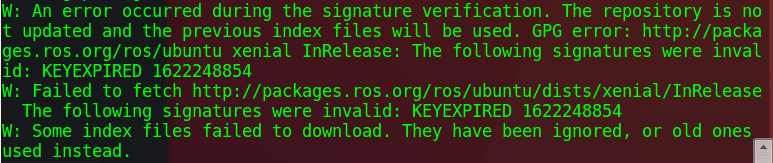
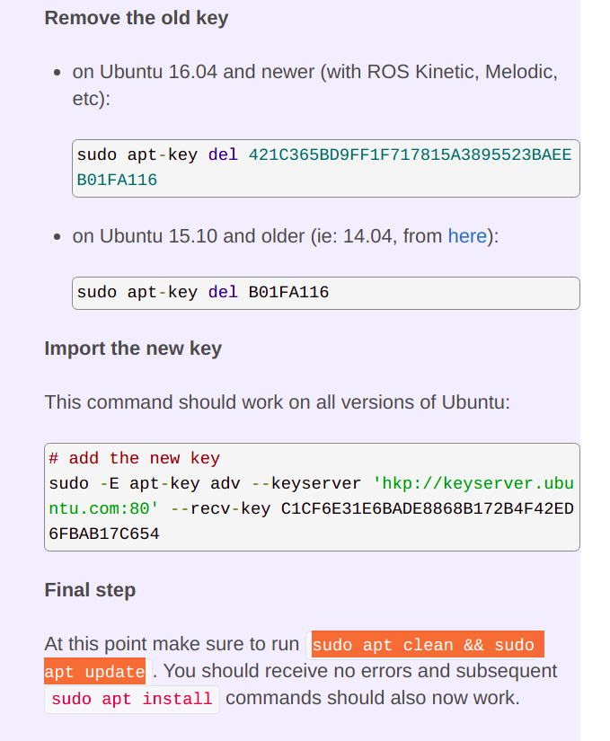
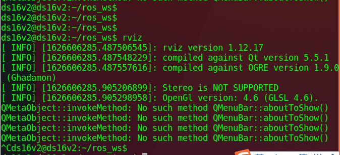
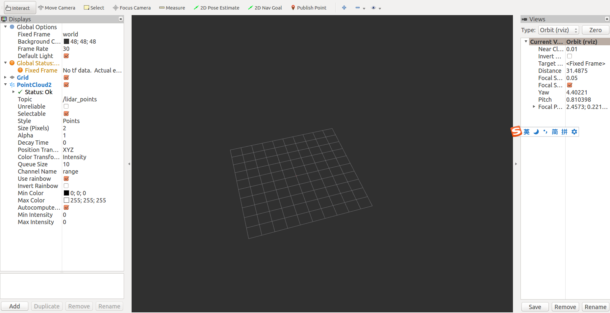
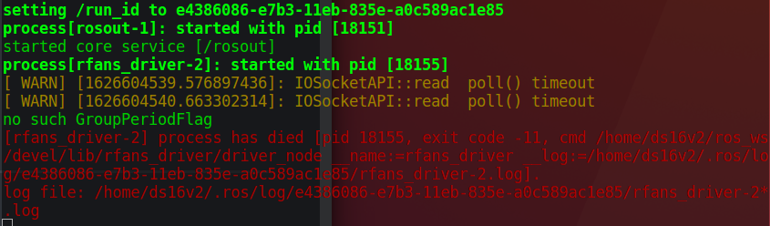
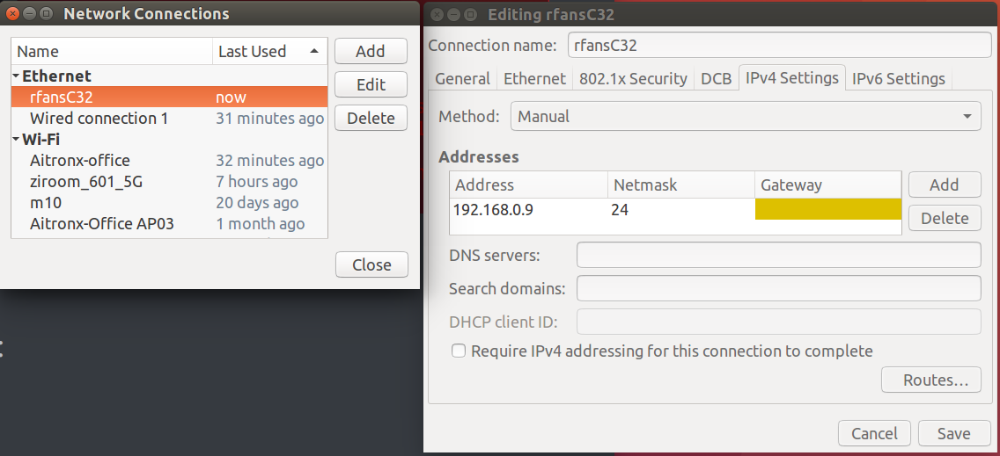
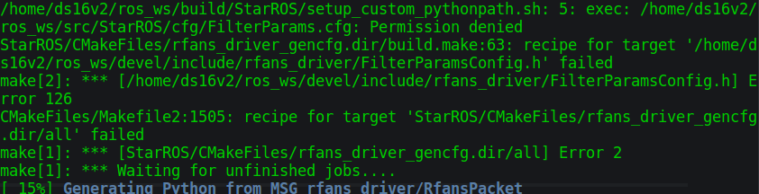

# 20210717: rfan: init

[toc]

---

## 4. ubuntu 16.07 apt update fail



solution:

```
# delete old key
$ sudo apt-key del 421C365BD9FF1F717815A3895523BAEEB01FA116

# add new key
$ sudo -E apt-key adv --keyserver 'hkp://keyserver.ubuntu.com:80' --recv-key C1CF6E31E6BADE8868B172B4F42ED6FBAB17C654

# clean
$ sudo apt clean && sudo apt update
```



参考：

link: [**apt update fails / cannot install pkgs: key not working?**](https://answers.ros.org/question/325039/apt-update-fails-cannot-install-pkgs-key-not-working/)


---

## 3. no point cloud in rviz





solution 1. solve no such method QmenuBar::aboutToShow:

​	keyword: how to install mesa 17.3.3 in ubuntu 16.04, 17.10, then

​	the rviz is crashed with the error segmentation fault (core dumped)


solution 2: unsuccessful


---

## 2. roslaunch error



solution:

1. 没有配置网络：网络配置如下：

   
   
   完成后
   
   ```
   # 第一个 CLI
   $ roslaunch rfans_driver node_manager.launch 
   
   # 第二个 CLI
   rosrun rviz rviz 或
   rviz
   ```
   
   

---

## 1. compiling error



solution:

`sudo su chmod 777 FilterParamsConfig.h`


