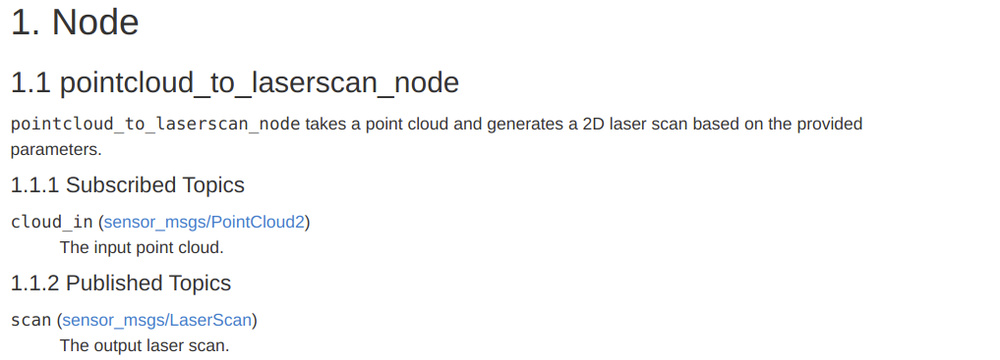
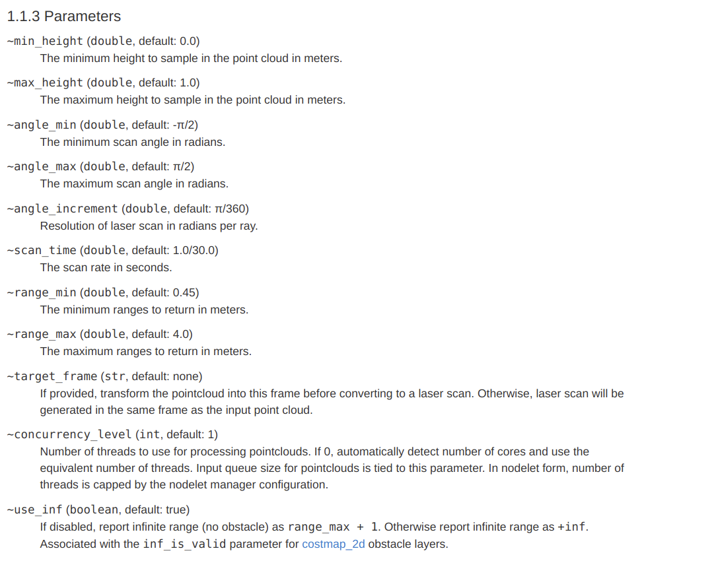
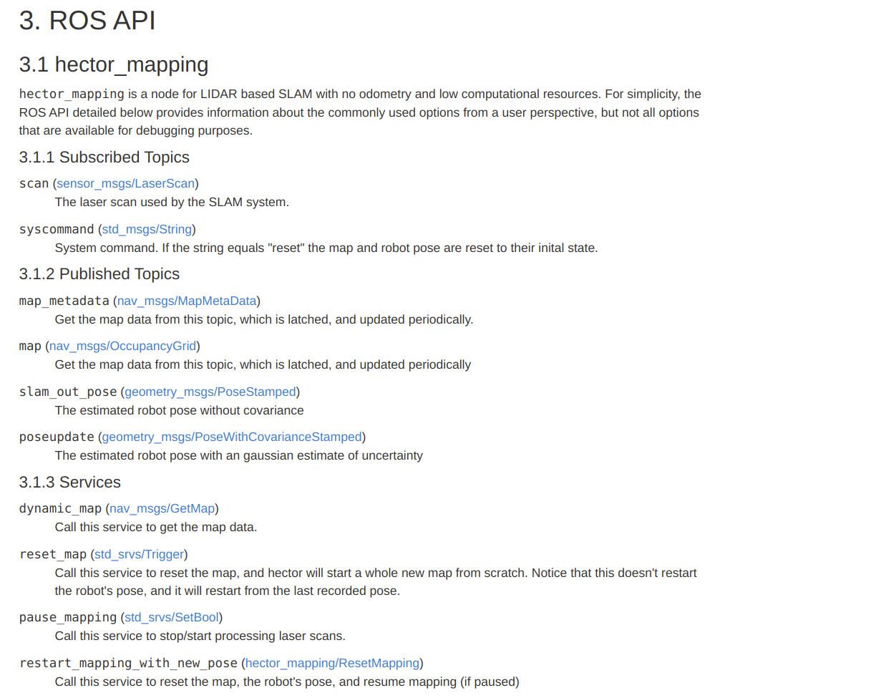
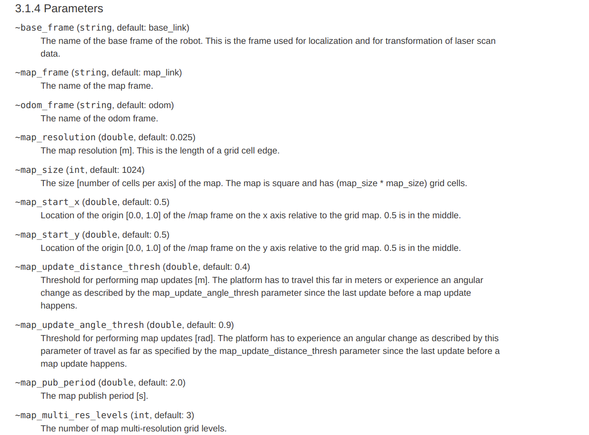
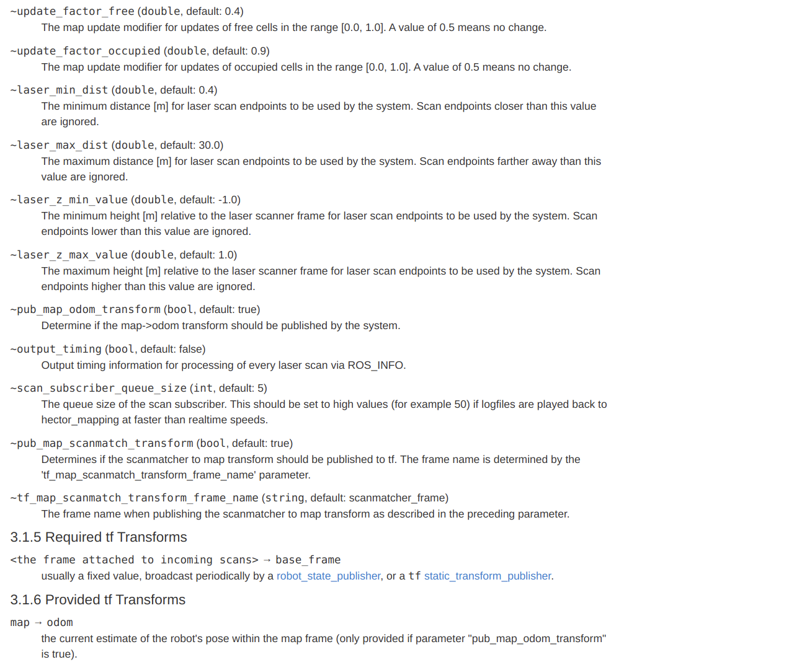
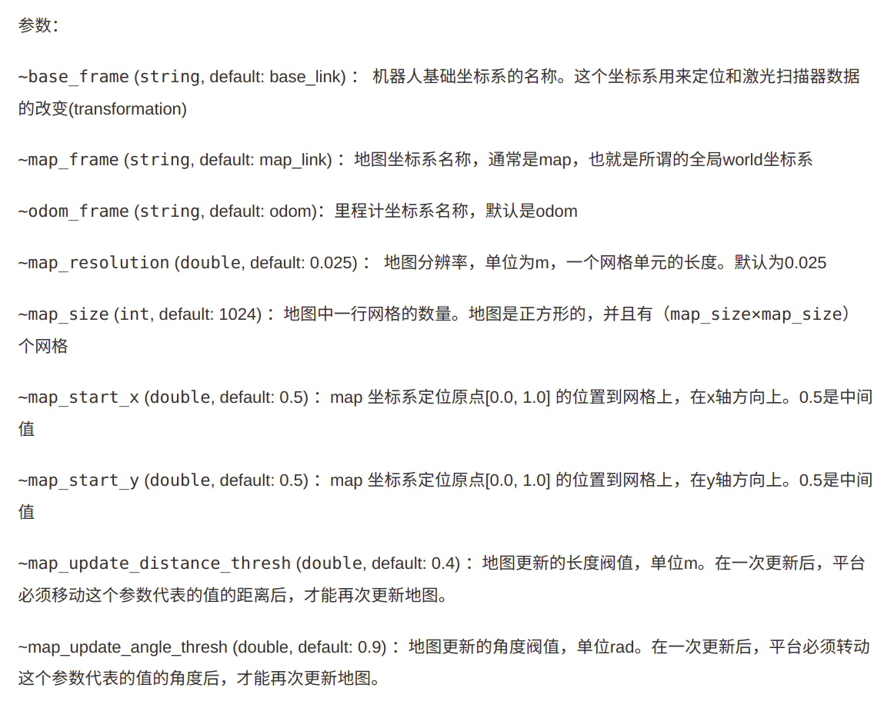
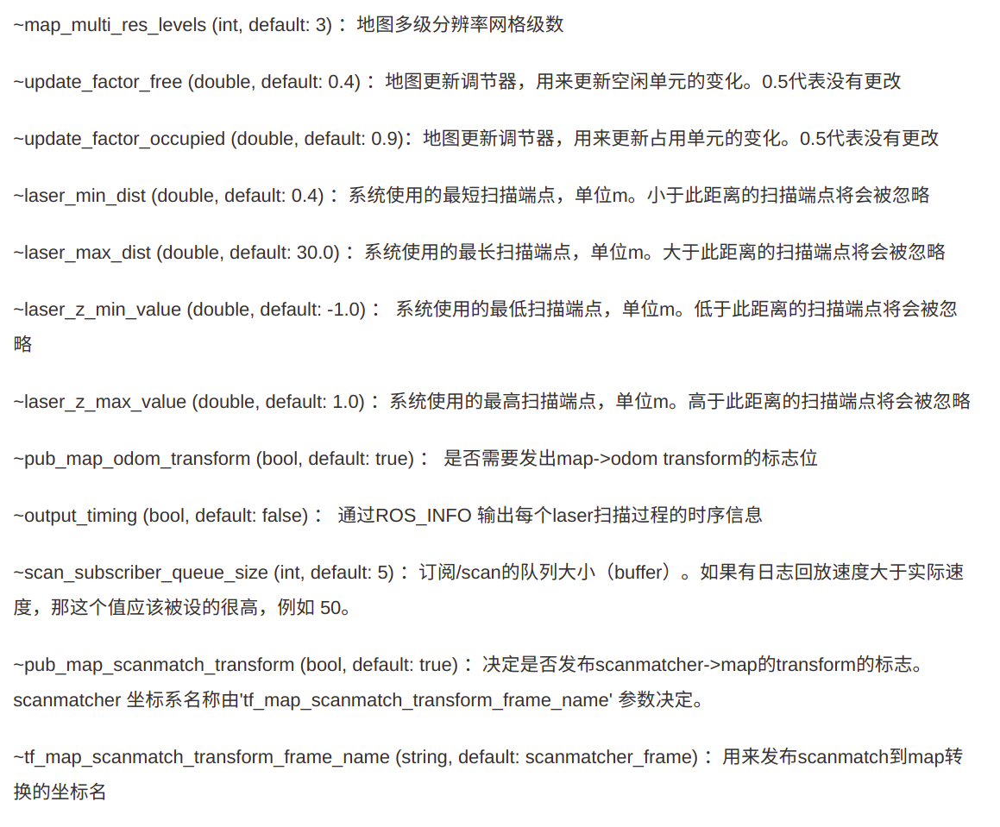
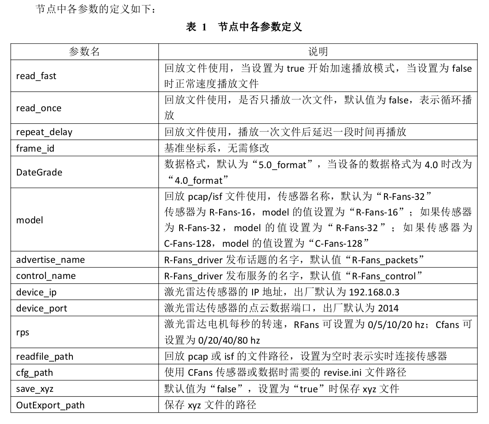

# hector_slam 相关的 node 参数

[toc]

---


---

## 0. roslaunch files

**rfans_slam_main.launch**

```xml
<?xml version="1.0"?>

<launch>

    <!--<arg name="geotiff_map_file_path" default="$(find hector_geotiff)/maps"/>-->

    <!--<param name="/use_sim_time" value="true"/>-->

    <node pkg="rviz" type="rviz" name="rviz"
          args="-d $(find hector_slam_launch)/rviz_cfg/rfans_simple_cfg.rviz"/>

    <!-- map to base_link -->
    <node pkg="tf" type="static_transform_publisher" name="map_to_base"
          args="0 0 0 0 0 0 /map /base_link 100"/>

    <!-- base_link to rfans_link -->
    <node pkg="tf" type="static_transform_publisher" name="base_to_rfans"
          args="0 0 0 0 0 0 /base_link /rfans_link 100"/>


    <!-- change mapping_default_original.launch to rfans_slam_mapping.launch -->
    <include file="$(find hector_mapping)/launch/rfans_slam_mapping.launch"/>

    <!-- use default geotiff_mapper -->
    <include file="$(find hector_geotiff_launch)/launch/geotiff_mapper.launch">
        <arg name="trajectory_source_frame_name" value="scanmatcher_frame"/>
        <!--<arg name="map_file_path" value="$(arg geotiff_map_file_path)"/>-->
    </include>

</launch>
```


**rfans_slam_mapping.launch**

```xml
<?xml version="1.0"?>

<launch>
    <arg name="tf_map_scanmatch_transform_frame_name" default="scanmatcher_frame"/>
    <!--<arg name="base_frame" default="base_footprint"/>-->
    <arg name="base_frame" default="base_link"/>
    <arg name="odom_frame" default="nav"/>
    <arg name="pub_map_odom_transform" default="true"/>
    <arg name="scan_subscriber_queue_size" default="5"/>
    <!--<arg name="scan_topic" default="scan"/>-->
    <arg name="scan_topic" default="front/scan"/>
    <arg name="map_size" default="2048"/>

    <!-- PointCloud to laserscan -->
    <node pkg="pointcloud_to_laserscan"
          type="pointcloud_to_laserscan_node"
          name="pointcloud_to_laserscan">

        <!-- <remap from="cloud_in" to="/rfans_driver/rfans_points" /> -->
        <remap from="cloud_in" to="/lidar_points"/>
        <remap from="scan" to="/front/scan"/>

        <!-- <param name="target_frame"    value="rfans" /> -->
        <param name="target_frame" value="base_link"/>
        <param name="min_height" value="0.0"/>
        <param name="max_height" value="1.0"/>
        <!--<param name="angle_min" value="-3.14"/>-->
        <!--<param name="angle_max" value="3.14"/>-->
        <!--<param name="angle_increment" value="0.00655"/>-->
        <!--<param name="scan_time" value="0.0"/>-->
        <param name="range_min" value="0.45"/>
        <param name="range_max" value="10.0"/>
        <param name="concurrency_level" value="1"/>
        <param name="use_inf" value="true"/>
    </node>

    <!--  Hector SLAM  -->
    <node pkg="hector_mapping" type="hector_mapping" name="hector_mapping" output="screen">

        <!-- Frame names -->
        <param name="map_frame" value="map"/>
        <param name="base_frame" value="$(arg base_frame)"/>
        <param name="odom_frame" value="$(arg base_frame)"/>

        <!-- Tf use -->
        <param name="use_tf_scan_transformation" value="true"/>
        <param name="use_tf_pose_start_estimate" value="false"/>
        <param name="pub_map_odom_transform" value="$(arg pub_map_odom_transform)"/>

        <!-- Map size / start point -->
        <param name="map_resolution" value="0.050"/>
        <param name="map_size" value="$(arg map_size)"/>
        <param name="map_start_x" value="0.5"/>
        <param name="map_start_y" value="0.5"/>
        <param name="map_multi_res_levels" value="2"/>

        <!-- Map update parameters -->
        <param name="update_factor_free" value="0.4"/>
        <param name="update_factor_occupied" value="0.9"/>
        <param name="map_update_distance_thresh" value="0.4"/>
        <param name="map_update_angle_thresh" value="0.06"/>
        <param name="laser_z_min_value" value="-1.0"/>
        <param name="laser_z_max_value" value="1.0"/>

        <!-- Advertising config -->
        <param name="advertise_map_service" value="true"/>

        <param name="scan_subscriber_queue_size" value="$(arg scan_subscriber_queue_size)"/>
        <param name="scan_topic" value="$(arg scan_topic)"/>

        <!-- Debug parameters -->
        <!--
          <param name="output_timing" value="false"/>
          <param name="pub_drawings" value="true"/>
          <param name="pub_debug_output" value="true"/>
        -->
        <param name="tf_map_scanmatch_transform_frame_name" value="$(arg tf_map_scanmatch_transform_frame_name)"/>
    </node>

    <!--<node pkg="tf" type="static_transform_publisher" name="map_nav_broadcaster" args="0 0 0 0 0 0 map nav 100"/>-->

</launch>
```


**node_manager.launch**

```xml
<?xml version="1.0"?>

<launch>

    <arg name="read_fast" default="false"/>
    <arg name="read_once" default="false"/>
    <arg name="repeat_delay" default="0.0"/>
    <!--<param name="frame_id" value="world"/>-->
    <param name="frame_id" value="rfans_link"/>
    <param name="model" value="R-Fans-16"/>

    <node pkg="rfans_driver" type="driver_node" name="rfans_driver" output="screen">
        <param name="advertise_name" value="rfans_packets"/>
        <param name="control_name" value="rfans_control"/>
        <param name="device_ip" value="192.168.0.3"/>
        <param name="device_port" value="2014"/>
        <param name="rps" value="10"/>
        <param name="readfile_path" value=""/>
        <!-- <param name="cfg_path"  value=""/> -->
        <param name="cfg_path" value="/home/ds16v2/ros_ws/src/StarROS/launch/revise.ini"/>
        <param name="save_xyz" value="false"/>
        <param name="OutExport_path" value=""/>
        <param name="use_double_echo" value="false"/>
        <param name="use_gps" value="false"/>
        <param name="read_fast" value="$(arg read_fast)"/>
        <param name="read_once" value="$(arg read_once)"/>
        <param name="repeat_delay" value="$(arg repeat_delay)"/>
        <param name="cut_angle_range" value="360.0"/>
    </node>

</launch>
```


---

## 1. node: pointcloud_to_laserscan

```xml
    <!-- PointCloud to laserscan -->
    <node pkg="pointcloud_to_laserscan"
          type="pointcloud_to_laserscan_node"
          name="pointcloud_to_laserscan">

        <!-- <remap from="cloud_in" to="/rfans_driver/rfans_points" /> -->
        <remap from="cloud_in" to="/lidar_points"/>
        <remap from="scan" to="/front/scan"/>

        <!-- <param name="target_frame"    value="rfans" /> -->
        <param name="target_frame" value="base_link"/>
        <param name="min_height" value="0.0"/>
        <param name="max_height" value="1.0"/>
        <!--<param name="angle_min" value="-3.14"/>-->
        <!--<param name="angle_max" value="3.14"/>-->
        <!--<param name="angle_increment" value="0.00655"/>-->
        <!--<param name="scan_time" value="0.0"/>-->
        <param name="range_min" value="0.45"/>
        <param name="range_max" value="10.0"/>
        <param name="concurrency_level" value="1"/>
        <param name="use_inf" value="true"/>
    </node>
```



**parameters:**

| target_frame      | If provided, transform the pointcloud into this frame before converting to a laser scan. Otherwise, laser scan will be generated in the same frame as the input point cloud. |      |
| ----------------- | ------------------------------------------------------------ | ---- |
| min_height        | The minimum height to sample in the point cloud in meters.   |      |
| max_height        | The maximum height to sample in the point cloud in meters.   |      |
| angle_min         | The minimum scan angle in radians.                           |      |
| angle_max         | The maximum scan angle in radians.                           |      |
| angle_increment   | Resolution of laser scan in radians per ray.                 |      |
| scan_time         | The scan rate in seconds.                                    |      |
| range_min         | The minimum ranges to return in meters.                      |      |
| range_max         | The maximum ranges to return in meters.                      |      |
| concurrency_level | Number of threads to use for processing pointclouds. If 0, automatically detect number of cores and use the equivalent number of threads. Input queue size for pointclouds is tied to this parameter. In nodelet form, number of threads is capped by the nodelet manager configuration. |      |
| use_inf           | If disabled, report infinite range (no obstacle) as `range_max + 1`. Otherwise report infinite range as `+inf`. Associated with the `inf_is_valid` parameter for [costmap_2d](http://wiki.ros.org/costmap_2d) obstacle layers. |      |



---

## 2. node: hector_mapping

```xml
    <!--  Hector SLAM  -->
    <node pkg="hector_mapping" type="hector_mapping" name="hector_mapping" output="screen">

        <!-- Frame names -->
        <param name="map_frame" value="map"/>
        <param name="base_frame" value="$(arg base_frame)"/>
        <param name="odom_frame" value="$(arg base_frame)"/>

        <!-- Tf use -->
        <param name="use_tf_scan_transformation" value="true"/>
        <param name="use_tf_pose_start_estimate" value="false"/>
        <param name="pub_map_odom_transform" value="$(arg pub_map_odom_transform)"/>

        <!-- Map size / start point -->
        <param name="map_resolution" value="0.050"/>
        <param name="map_size" value="$(arg map_size)"/>
        <param name="map_start_x" value="0.5"/>
        <param name="map_start_y" value="0.5"/>
        <param name="map_multi_res_levels" value="2"/>

        <!-- Map update parameters -->
        <param name="update_factor_free" value="0.4"/>
        <param name="update_factor_occupied" value="0.9"/>
        <param name="map_update_distance_thresh" value="0.4"/>
        <param name="map_update_angle_thresh" value="0.06"/>
        <param name="laser_z_min_value" value="-1.0"/>
        <param name="laser_z_max_value" value="1.0"/>

        <!-- Advertising config -->
        <param name="advertise_map_service" value="true"/>

        <param name="scan_subscriber_queue_size" value="$(arg scan_subscriber_queue_size)"/>
        <param name="scan_topic" value="$(arg scan_topic)"/>

        <!-- Debug parameters -->
        <!--
          <param name="output_timing" value="false"/>
          <param name="pub_drawings" value="true"/>
          <param name="pub_debug_output" value="true"/>
        -->
        <param name="tf_map_scanmatch_transform_frame_name" 
               value="$(arg tf_map_scanmatch_transform_frame_name)"/>
    </node>
```


descriptions:












---

## 3. rfans_driver

激光雷达的参数需要根据操作手册来设置。

```xml
<?xml version="1.0"?>

<launch>

    <arg name="read_fast" default="false"/>
    <arg name="read_once" default="false"/>
    <arg name="repeat_delay" default="0.0"/>
    <!--<param name="frame_id" value="world"/>-->
    <param name="frame_id" value="rfans_link"/>
    <param name="model" value="R-Fans-16"/>

    <node pkg="rfans_driver" type="driver_node" name="rfans_driver" output="screen">
        <param name="advertise_name" value="rfans_packets"/>
        <param name="control_name" value="rfans_control"/>
        <param name="device_ip" value="192.168.0.3"/>
        <param name="device_port" value="2014"/>
        <param name="rps" value="10"/>
        <param name="readfile_path" value=""/>
        <!-- <param name="cfg_path"  value=""/> -->
        <param name="cfg_path" value="/home/ds16v2/ros_ws/src/StarROS/launch/revise.ini"/>
        <param name="save_xyz" value="false"/>
        <param name="OutExport_path" value=""/>
        <param name="use_double_echo" value="false"/>
        <param name="use_gps" value="false"/>
        <param name="read_fast" value="$(arg read_fast)"/>
        <param name="read_once" value="$(arg read_once)"/>
        <param name="repeat_delay" value="$(arg repeat_delay)"/>
        <param name="cut_angle_range" value="360.0"/>
    </node>
```




---

## &. reference

link1: [hector_mapping](http://wiki.ros.org/action/fullsearch/hector_mapping?action=fullsearch&context=180&value=linkto%3A"hector_mapping")

link2: [ros中的hector_mapping节点详细介绍](https://blog.csdn.net/sunyoop/article/details/78110895)

link3: [pointcloud_to_laserscan](http://wiki.ros.org/action/fullsearch/pointcloud_to_laserscan?action=fullsearch&context=180&value=linkto%3A"pointcloud_to_laserscan")

link4:

