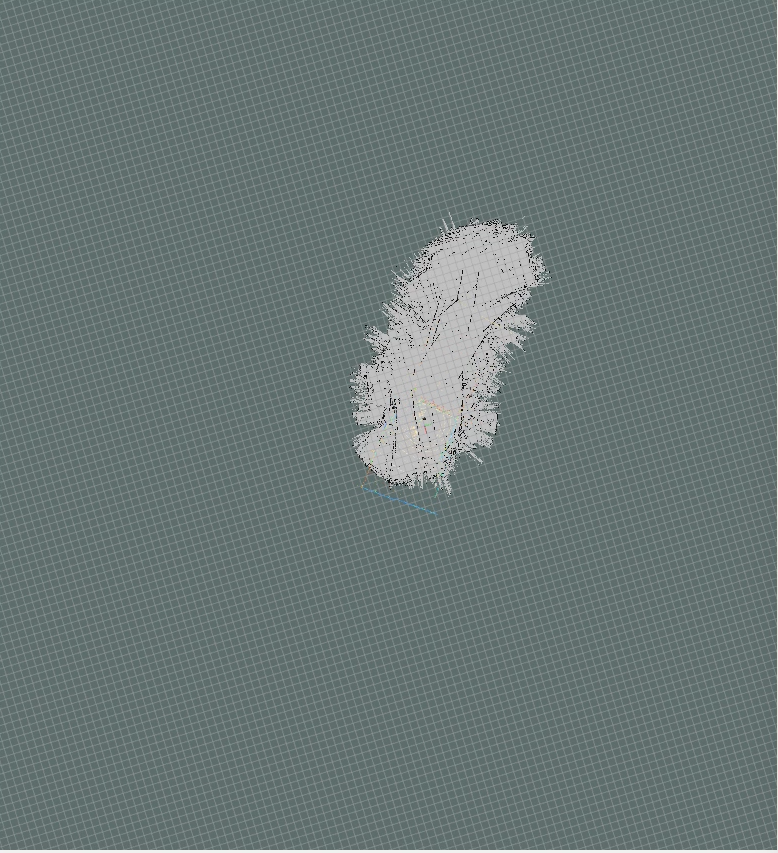

# 2021-08-05：rfan 重启 [resume]

[toc]

---

## 0. review + loglist

1. 相关 ticket：
   1. 5044：ros 建图。最后更新：使用 lslidar_C16 可以建图，但是没有办法形成闭环。
   2. 5638：rfans-32 雷达点云显示。最后更新：得到 ros 点云图，但是没有使用 hector_mapping。
2. 计划
   1. 回顾 **5044**，5638，分析 launch 文件，重新启动 lidar。
   2. 使用 lslidarC16 的 launch code（5044），启动 rfans-32。
   3. 做好资料记录，总结。


log list:

2021年08月07日：在整合的 slam lidar 项目中启动 lslidar + rfans，同时在 clion 下进行编译。再做定点 slam。


---

## 1. review 5044, catkin_make hector_slame from source


这个是 hector_slam_rfans.launch 的内容：

```xml
<!--
Maps the environment with RFANS LiDAR using Hector SLAM
No robot is necessary
-->
<launch>

    <arg name="scan_topic"         default="front/scan" />
    <arg name="use_odom"           default="false" />
    <arg name="map_frame"          default="map" />
    <arg name="base_frame"         default="base_footprint" />
    <arg name="odom_frame"         default="odom" />

    <!-- PointCloud to laserscan -->
    <node pkg="pointcloud_to_laserscan" type="pointcloud_to_laserscan_node" name="pointcloud_to_laserscan">
      <remap from="cloud_in" to="/rfans_driver/rfans_points" />
      <remap from="scan"     to="/front/scan" />

      <param name="target_frame"    value="rfans" />
      <param name="min_height"      value="0.0" />
      <param name="max_height"      value="1.0" />
      <param name="angle_min"       value="-3.14" />
      <param name="angle_max"       value="3.14" />
      <param name="angle_increment" value="0.00655" />
      <param name="scan_time"       value="0.0" />
      <param name="range_min"       value="0.45" />
      <param name="range_max"       value="100.0" />
      <param name="use_inf"         value="true" />
    </node>

    <!-- Hector SLAM -->
    <node pkg="hector_mapping" type="hector_mapping" name="hector_mapping" output="screen" >
        <param name="pub_map_odom_transform" value="true"/>
        <param name="map_frame" value="$(arg map_frame)" />
        <param name="base_frame" value="$(arg base_frame)" />
        <param name="map_size" value="2048" />
        <param if="$(arg use_odom)" name="odom_frame" value="$(arg odom_frame)" />
        <param unless="$(arg use_odom)" name="odom_frame" value="$(arg base_frame)" />
        <param name="scan_topic" value="$(arg scan_topic)" />
    </node>  

</launch>
```


这些是 hector_mapping 的一些建议值，以及 cartographer slam 的提及。


今天读3篇csdn

link1：[Hector SLAM 安装与配置](https://blog.csdn.net/i_robots/article/details/108287321)

link2：[Gmapping 之安装与配置](https://blog.csdn.net/i_robots/article/details/107884080)

link3：[ROS使用hector_slam+衫川雷达建图（一）](https://blog.csdn.net/qq_43481884/article/details/102845143?utm_medium=distribute.pc_relevant_t0.none-task-blog-2%7Edefault%7EBlogCommendFromMachineLearnPai2%7Edefault-1.control&depth_1-utm_source=distribute.pc_relevant_t0.none-task-blog-2%7Edefault%7EBlogCommendFromMachineLearnPai2%7Edefault-1.control)

link4：[资料](https://download.csdn.net/download/qq_34213260/11833334?spm=1001.2101.3001.5697)

link5：[Gmapping、hector、Cartographer三种激光SLAM算法简单对比](https://blog.csdn.net/Jeff_Lee_/article/details/77869987)

link6：[tu-darmstadt-ros-pkg](https://github.com/tu-darmstadt-ros-pkg)/**[hector_slam](https://github.com/tu-darmstadt-ros-pkg/hector_slam)**

link7：[hector-slam安装与使用 （ubuntu 16.04）（使用数据包运行hector-slam）](https://blog.csdn.net/me1171115772/article/details/105110851/?utm_medium=distribute.pc_relevant.none-task-blog-2~default~baidujs_title~default-0.control&spm=1001.2101.3001.4242)

link8：[Robosense 激光雷达slam建图（2）：使用pointcloud_to_laserscan包实现三维转二维](https://blog.csdn.net/geerniya/article/details/84880514?utm_medium=distribute.pc_relevant.none-task-blog-2%7Edefault%7EBlogCommendFromBaidu%7Edefault-15.control&depth_1-utm_source=distribute.pc_relevant.none-task-blog-2%7Edefault%7EBlogCommendFromBaidu%7Edefault-15.control)

link9：[https://ardupilot.org/dev/docs/ros-slam.html](https://ardupilot.org/dev/docs/ros-slam.html)


现在根据 link7 进行 hector_slam 的源码安装，安装目录 `...\slam_ws`：


使用 hector_slam 原 launch 文件，启动 rviz。

```
ds16v2@ds16v2:~/catkin_x/slam_ws$ roslaunch hector_slam_launch tutorial.launch 
```


console 中的输出，需要注意一些 parameters 和 nodes：

```
ds16v2@ds16v2:~/catkin_x/slam_ws$ roslaunch hector_slam_launch tutorial.launch 
... logging to /home/ds16v2/.ros/log/13c3e70e-f5c8-11eb-abbe-a0c589ac1e85/roslaunch-ds16v2-5323.log
Checking log directory for disk usage. This may take awhile.
Press Ctrl-C to interrupt
Done checking log file disk usage. Usage is <1GB.

started roslaunch server http://ds16v2:41515/

SUMMARY
========

PARAMETERS
 * /hector_geotiff_node/draw_background_checkerboard: True
 * /hector_geotiff_node/draw_free_space_grid: True
 * /hector_geotiff_node/geotiff_save_period: 0.0
 * /hector_geotiff_node/map_file_base_name: hector_slam_map
 * /hector_geotiff_node/map_file_path: /home/ds16v2/catk...
 * /hector_geotiff_node/plugins: hector_geotiff_pl...
 * /hector_mapping/advertise_map_service: True
 * /hector_mapping/base_frame: base_footprint
 * /hector_mapping/laser_z_max_value: 1.0
 * /hector_mapping/laser_z_min_value: -1.0
 * /hector_mapping/map_frame: map
 * /hector_mapping/map_multi_res_levels: 2
 * /hector_mapping/map_resolution: 0.05
 * /hector_mapping/map_size: 2048
 * /hector_mapping/map_start_x: 0.5
 * /hector_mapping/map_start_y: 0.5
 * /hector_mapping/map_update_angle_thresh: 0.06
 * /hector_mapping/map_update_distance_thresh: 0.4
 * /hector_mapping/odom_frame: nav
 * /hector_mapping/pub_map_odom_transform: True
 * /hector_mapping/scan_subscriber_queue_size: 5
 * /hector_mapping/scan_topic: scan
 * /hector_mapping/tf_map_scanmatch_transform_frame_name: scanmatcher_frame
 * /hector_mapping/update_factor_free: 0.4
 * /hector_mapping/update_factor_occupied: 0.9
 * /hector_mapping/use_tf_pose_start_estimate: False
 * /hector_mapping/use_tf_scan_transformation: True
 * /hector_trajectory_server/source_frame_name: scanmatcher_frame
 * /hector_trajectory_server/target_frame_name: /map
 * /hector_trajectory_server/trajectory_publish_rate: 0.25
 * /hector_trajectory_server/trajectory_update_rate: 4.0
 * /rosdistro: kinetic
 * /rosversion: 1.12.17
 * /use_sim_time: True

NODES
  /
    hector_geotiff_node (hector_geotiff/geotiff_node)
    hector_mapping (hector_mapping/hector_mapping)
    hector_trajectory_server (hector_trajectory_server/hector_trajectory_server)
    rviz (rviz/rviz)

auto-starting new master
process[master]: started with pid [5333]
ROS_MASTER_URI=http://localhost:11311

setting /run_id to 13c3e70e-f5c8-11eb-abbe-a0c589ac1e85
process[rosout-1]: started with pid [5346]
started core service [/rosout]
process[rviz-2]: started with pid [5370]
process[hector_mapping-3]: started with pid [5371]
process[hector_trajectory_server-4]: started with pid [5372]
process[hector_geotiff_node-5]: started with pid [5379]
[ INFO] [1628152524.630914828]: Creating application with offscreen platform.
[ INFO] [1628152524.643270822]: Waiting for tf transform data between frames /map and scanmatcher_frame to become available
HectorSM map lvl 0: cellLength: 0.05 res x:2048 res y: 2048
HectorSM map lvl 1: cellLength: 0.1 res x:1024 res y: 1024
[ INFO] [1628152524.704030673]: Created application
[ INFO] [1628152524.730046720]: HectorSM p_base_frame_: base_footprint
[ INFO] [1628152524.730097540]: HectorSM p_map_frame_: map
[ INFO] [1628152524.730111714]: HectorSM p_odom_frame_: nav
[ INFO] [1628152524.730123270]: HectorSM p_scan_topic_: scan
[ INFO] [1628152524.730134893]: HectorSM p_use_tf_scan_transformation_: true
[ INFO] [1628152524.730152172]: HectorSM p_pub_map_odom_transform_: true
[ INFO] [1628152524.730167099]: HectorSM p_scan_subscriber_queue_size_: 5
[ INFO] [1628152524.730187431]: HectorSM p_map_pub_period_: 2.000000
[ INFO] [1628152524.730204401]: HectorSM p_update_factor_free_: 0.400000
[ INFO] [1628152524.730222035]: HectorSM p_update_factor_occupied_: 0.900000
[ INFO] [1628152524.730248538]: HectorSM p_map_update_distance_threshold_: 0.400000 
[ INFO] [1628152524.730264965]: HectorSM p_map_update_angle_threshold_: 0.060000
[ INFO] [1628152524.730281973]: HectorSM p_laser_z_min_value_: -1.000000
[ INFO] [1628152524.730299179]: HectorSM p_laser_z_max_value_: 1.000000
[ INFO] [1628152524.748676715]: Successfully initialized hector_geotiff MapWriter plugin TrajectoryMapWriter.
[ INFO] [1628152524.748719378]: Geotiff node started
0x14b5cd0 void QWindowPrivate::setTopLevelScreen(QScreen*, bool) ( QScreen(0x947140) ): Attempt to set a screen on a child window.
0x14b7850 void QWindowPrivate::setTopLevelScreen(QScreen*, bool) ( QScreen(0x947140) ): Attempt to set a screen on a child window.
0x14b61f0 void QWindowPrivate::setTopLevelScreen(QScreen*, bool) ( QScreen(0x947140) ): Attempt to set a screen on a child window.
0x14b7380 void QWindowPrivate::setTopLevelScreen(QScreen*, bool) ( QScreen(0x947140) ): Attempt to set a screen on a child window.

```

可能需要调节的参数：

```
 * /hector_mapping/advertise_map_service: True
 * /hector_mapping/base_frame: base_footprint				# 基坐标系
 * /hector_mapping/laser_z_max_value: 1.0
 * /hector_mapping/laser_z_min_value: -1.0
 
 * /hector_mapping/map_frame: map							# 地图坐标系
 * /hector_mapping/map_multi_res_levels: 2
 * /hector_mapping/map_resolution: 0.05						# 调节地图精度
 * /hector_mapping/map_size: 2048							# 调节地图尺寸
 * /hector_mapping/map_start_x: 0.5
 * /hector_mapping/map_start_y: 0.5
 * /hector_mapping/map_update_angle_thresh: 0.06			# 很重要的一个参数
 * /hector_mapping/map_update_distance_thresh: 0.4			# 很重要的一个参数
 
 * /hector_mapping/odom_frame: nav							# 里程计坐标系
 * /hector_mapping/pub_map_odom_transform: True
 * /hector_mapping/scan_subscriber_queue_size: 5
 * /hector_mapping/scan_topic: scan
 * /hector_mapping/tf_map_scanmatch_transform_frame_name: scanmatcher_frame
 * /hector_mapping/update_factor_free: 0.4
 * /hector_mapping/update_factor_occupied: 0.9
 * /hector_mapping/use_tf_pose_start_estimate: False
 * /hector_mapping/use_tf_scan_transformation: True
```


接下来需要启动 rfans 以及修改 hector_slame 中的 launch 文件，放在下一节。


---

## 2. launch rfans and view point cloud through rviz

如果遇到在 clion 打开 ros package 失败的情况：clion find_package(catkin) failed：


可以参考 stackoverflow 这篇文章，可能的原因是 clion 没有办法调用 catkin 命令。

link: [Setting up ROS package in CLion](https://stackoverflow.com/questions/33172132/setting-up-ros-package-in-clion)

> Try this (for Linux):
>
> 1. Open a command line
> 2. Run *catkin_make* on your package.
> 3. *source* your *catkin_workspace/devel/setup.bash* file e.g. *source ~/my_dev_folder/catkin_ws/devel/setup.bash*
> 4. Start CLion from *[CLion install dir]/bin/clion.sh* e.g. *cd ~/Downloads/clion-1.2.4/bin && ./clion.sh*
>
> CLion should then start with knowledge about the packages in your catkin workspace, through the local environment variables set up by the setup.bash file.


@@@@@@@@@@@@@ 这是分隔符 @@@@@@@@@@@@@


**在 linux 下可以通过键盘来移动窗口：**


@@@@@@@@@@@@@ 这是分隔符 @@@@@@@@@@@@@


**回顾 rfans32 的 ros 配置：**

```
主机IP：192.168.0.9
掩码：255.255.255.0

rfansIP：192.168.0.3
```


```
$ ping 192.168.0.3

PING 192.168.0.3 (192.168.0.3) 56(84) bytes of data.
64 bytes from 192.168.0.3: icmp_seq=1 ttl=128 time=0.411 ms
64 bytes from 192.168.0.3: icmp_seq=2 ttl=128 time=0.497 ms
64 bytes from 192.168.0.3: icmp_seq=3 ttl=128 time=0.322 ms
64 bytes from 192.168.0.3: icmp_seq=4 ttl=128 time=0.248 ms
64 bytes from 192.168.0.3: icmp_seq=5 ttl=128 time=0.377 ms
64 bytes from 192.168.0.3: icmp_seq=6 ttl=128 time=0.247 ms
64 bytes from 192.168.0.3: icmp_seq=7 ttl=128 time=0.340 ms
64 bytes from 192.168.0.3: icmp_seq=8 ttl=128 time=0.303 ms
64 bytes from 192.168.0.3: icmp_seq=9 ttl=128 time=0.505 ms
64 bytes from 192.168.0.3: icmp_seq=10 ttl=128 time=0.465 ms
```


**在 linux 下可以同时使用 wifi 根 ethernet 连接。**


@@@@@@@@@@@@@ 这是分隔符 @@@@@@@@@@@@@


**启动 rfans32 + rviz：**

将 `/home/ds16v2/ros_ws/src/StarROS/` 下的 revise.ini 放入 `/home/ds16v2/ros_ws/src/StarROS/launch/`下。

在 node_manager.launch 中添加：

```
<param name="cfg_path"  value="/home/ds16v2/ros_ws/src/StarROS/launch/revise.ini"/>
```

在终端启动 rfans32，注意 **PARAMETERS** 跟 **NODES**：

```
ds16v2@ds16v2:~/ros_ws$ roslaunch rfans_driver node_manager.launch 

... logging to /home/ds16v2/.ros/log/b2f31aee-f5d1-11eb-abbe-a0c589ac1e85/roslaunch-ds16v2-18817.log
Checking log directory for disk usage. This may take awhile.
Press Ctrl-C to interrupt
Done checking log file disk usage. Usage is <1GB.

started roslaunch server http://ds16v2:35185/

SUMMARY
========

PARAMETERS
 * /frame_id: world
 * /model: R-Fans-16
 * /rfans_driver/OutExport_path: 
 * /rfans_driver/advertise_name: rfans_packets
 * /rfans_driver/cfg_path: /home/ds16v2/ros_...
 * /rfans_driver/control_name: rfans_control
 * /rfans_driver/cut_angle_range: 360.0
 * /rfans_driver/device_ip: 192.168.0.3
 * /rfans_driver/device_port: 2014
 * /rfans_driver/read_fast: False
 * /rfans_driver/read_once: False
 * /rfans_driver/readfile_path: 
 * /rfans_driver/repeat_delay: 0.0
 * /rfans_driver/rps: 10
 * /rfans_driver/save_xyz: False
 * /rfans_driver/use_double_echo: False
 * /rfans_driver/use_gps: False
 * /rosdistro: kinetic
 * /rosversion: 1.12.17

NODES
  /
    rfans_driver (rfans_driver/driver_node)

auto-starting new master
process[master]: started with pid [18827]
ROS_MASTER_URI=http://localhost:11311

setting /run_id to b2f31aee-f5d1-11eb-abbe-a0c589ac1e85
process[rosout-1]: started with pid [18840]
started core service [/rosout]
process[rfans_driver-2]: started with pid [18857]


```

在 rostopic list 中查看 rfans 发布的话题：


查看 rostopic /lidar_points 信息：


查看关于 rfans 的其他的两个 topic 信息：


启动 rviz：

```
ds16v2@ds16v2:~/ros_ws$ rviz
[ INFO] [1628156699.198379782]: rviz version 1.12.17
[ INFO] [1628156699.198434330]: compiled against Qt version 5.5.1
[ INFO] [1628156699.198450045]: compiled against OGRE version 1.9.0 (Ghadamon)
[ INFO] [1628156699.859484229]: Stereo is NOT SUPPORTED
[ INFO] [1628156699.859589670]: OpenGl version: 4.6 (GLSL 4.6).
0x2836760 void QWindowPrivate::setTopLevelScreen(QScreen*, bool) ( QScreen(0x1caee80) ): Attempt to set a screen on a child window.
```

加载 rviz 配置文件:点击 rviz 菜单栏 File 选项中的 Open Config 按钮(ctrl+O),
加载 ros_ws/src/StarROS 下的 StarROS_Rviz_cfg.rviz


尝试 直接在 launch 文件中写入 rviz node。（done）

```xml
# 在 node_manager_rviz.launch 文件中，加入
    <node pkg="rviz" type="rviz" name="rviz"
          args="-d $(find rfans_driver)/config/StarROS_Rviz_cfg.rviz" required="true" />
```

其中 find 后面接 package 名称，可以通过 rospack list 或 find 找出：

```
# 表示：package rfans_driver 的路径为 /home/ds16v2/ros_ws/src/StarROS
ds16v2@ds16v2:~/ros_ws$ rospack find rfans_driver 
/home/ds16v2/ros_ws/src/StarROS
```


link：[lauch problems; ResourceNotFound](https://answers.ros.org/question/37826/lauch-problems-resourcenotfound/)


---

## 3. hector_slam with rfans32

hector_slam package 中的两个文件，需要备份+修改：

1. tutorial.launch
2. mapping_default.launch


可以用的配置：


遇到问题：transform frame

For frame [rfans_frame]: Fixed Frame [base_footprint] does not exist

No transform from [map] to [base_footprint]

No tf data.  Actual error: Fixed Frame [map] does not exist


目前不知道该如何解决，尝试步骤：

1. 重写 tutorial.launch。(hector_slam)
2. 重写 mapping_default.launch。(hector_slam)
3. 最好弄清每一段代码的作用。
4. 重写 node_manager.launch。（hector_slam）
5. 利用 rqt_graph 进行排查。


### 3.1. solve global status: warn: fixed frame no tf data


link：[ROS RVIZ: How to visualize a point cloud that doesn't have a fixed frame transform](https://stackoverflow.com/questions/52420672/ros-rviz-how-to-visualize-a-point-cloud-that-doesnt-have-a-fixed-frame-transfo)


这个问题很烦人，很多教程都没有涉及这个最基本但是十分重要的内容。下面这位大佬讲的很好。但是第二种解决方法需要创建更多的 tf 转换。


这是当前 `rqt_graph`生成的节点图：


这是当前的效果图：


开启了四个 terminal:

```
# 启动 rfans 激光雷达
terminal 1: $ roslaunch rfans_driver node_manager.launch

# 启动 hector slam
terminal 2: $ roslaunch hector_slam_launch rfans_slam_main.launch

# 启动 rviz
terminal 3: $ rviz

# 启动 tf (map --> rfans_link)
terminal 4: $ rosrun tf static_transform_publisher 0 0 0 0 0 0 map rfans_link 100
```


现在的问题，1. slam，2. 如何将 3D 点云转到 2D，3. 各个坐标系的转换（继续研究）以及：


```
[ INFO] [1628231853.657086681]: Successfully initialized hector_geotiff MapWriter plugin TrajectoryMapWriter.
[ INFO] [1628231853.657143847]: Geotiff node started
[ WARN] [1628231873.496827324]: No transform between frames /map and scanmatcher_frame available after 20.002183 seconds of waiting. This warning only prints once.
```


### 3.2. able to run hector slam with rfans32, optimization still needed though（done）

上面的 node graph 不准确，因为 pointcloud_to_laserscan 的 `<param name="scan_topic" value="$(arg scan_topic)"/>` 其中 `<arg name="scan_topic" default="front/scan"/>`，这个值是从 节点 node：pointcloud to laserscan 的 `<remap from="scan" to="/front/scan"/>`的到。


问题：

1. pointcloud 跳动
2. slam 生成速度慢
3. 没有办法 继续进行 rfans slam 建图，因为物理原因


今后优化：

1. 小车平台
2. 如何通信


计划：

1. 今天下午（2021年08月06日）对 launch 文件进行更深入的理解。
2. 开始整合 slam 项目，将 hector_slam，lslidar，rfans package 包同时编译。
3. 有时间的话，继续在小车上调试 slam。
4. 对了，还要弄清 rosbag 的使用。


### 3.3. 相关脚本文件

rfans_slam_main.launch

```xml
<?xml version="1.0"?>

<launch>

    <!--<arg name="geotiff_map_file_path" default="$(find hector_geotiff)/maps"/>-->

    <!--<param name="/use_sim_time" value="true"/>-->

    <node pkg="rviz" type="rviz" name="rviz"
          args="-d $(find hector_slam_launch)/rviz_cfg/rfans_simple_cfg.rviz"/>

    <!-- map to base_link -->
    <node pkg="tf" type="static_transform_publisher" name="map_to_base"
          args="0 0 0 0 0 0 /map /base_link 100"/>

    <!-- base_link to rfans_link -->
    <node pkg="tf" type="static_transform_publisher" name="base_to_rfans"
          args="0 0 0 0 0 0 /base_link /rfans_link 100"/>


    <!-- change mapping_default_original.launch to rfans_slam_mapping.launch -->
    <include file="$(find hector_mapping)/launch/rfans_slam_mapping.launch"/>

    <!-- use default geotiff_mapper -->
    <include file="$(find hector_geotiff_launch)/launch/geotiff_mapper.launch">
        <arg name="trajectory_source_frame_name" value="scanmatcher_frame"/>
        <!--<arg name="map_file_path" value="$(arg geotiff_map_file_path)"/>-->
    </include>

</launch>
```

rfans_slam_mapping.launch

```xml
<?xml version="1.0"?>

<launch>
    <arg name="tf_map_scanmatch_transform_frame_name" default="scanmatcher_frame"/>
    <!--<arg name="base_frame" default="base_footprint"/>-->
    <arg name="base_frame" default="base_link"/>
    <arg name="odom_frame" default="nav"/>
    <arg name="pub_map_odom_transform" default="true"/>
    <arg name="scan_subscriber_queue_size" default="5"/>
    <!--<arg name="scan_topic" default="scan"/>-->
    <arg name="scan_topic" default="front/scan"/>
    <arg name="map_size" default="2048"/>

    <!-- PointCloud to laserscan -->
    <node pkg="pointcloud_to_laserscan"
          type="pointcloud_to_laserscan_node"
          name="pointcloud_to_laserscan">

        <!-- <remap from="cloud_in" to="/rfans_driver/rfans_points" /> -->
        <remap from="cloud_in" to="/lidar_points"/>
        <remap from="scan" to="/front/scan"/>

        <!-- <param name="target_frame"    value="rfans" /> -->
        <param name="target_frame" value="base_link"/>
        <param name="min_height" value="0.0"/>
        <param name="max_height" value="1.0"/>
        <!--<param name="angle_min" value="-3.14"/>-->
        <!--<param name="angle_max" value="3.14"/>-->
        <!--<param name="angle_increment" value="0.00655"/>-->
        <!--<param name="scan_time" value="0.0"/>-->
        <param name="range_min" value="0.45"/>
        <param name="range_max" value="10.0"/>
        <param name="concurrency_level" value="1"/>
        <param name="use_inf" value="true"/>
    </node>

    <!--  Hector SLAM  -->
    <node pkg="hector_mapping" type="hector_mapping" name="hector_mapping" output="screen">

        <!-- Frame names -->
        <param name="map_frame" value="map"/>
        <param name="base_frame" value="$(arg base_frame)"/>
        <param name="odom_frame" value="$(arg base_frame)"/>

        <!-- Tf use -->
        <param name="use_tf_scan_transformation" value="true"/>
        <param name="use_tf_pose_start_estimate" value="false"/>
        <param name="pub_map_odom_transform" value="$(arg pub_map_odom_transform)"/>

        <!-- Map size / start point -->
        <param name="map_resolution" value="0.050"/>
        <param name="map_size" value="$(arg map_size)"/>
        <param name="map_start_x" value="0.5"/>
        <param name="map_start_y" value="0.5"/>
        <param name="map_multi_res_levels" value="2"/>

        <!-- Map update parameters -->
        <param name="update_factor_free" value="0.4"/>
        <param name="update_factor_occupied" value="0.9"/>
        <param name="map_update_distance_thresh" value="0.4"/>
        <param name="map_update_angle_thresh" value="0.06"/>
        <param name="laser_z_min_value" value="-1.0"/>
        <param name="laser_z_max_value" value="1.0"/>

        <!-- Advertising config -->
        <param name="advertise_map_service" value="true"/>

        <param name="scan_subscriber_queue_size" value="$(arg scan_subscriber_queue_size)"/>
        <param name="scan_topic" value="$(arg scan_topic)"/>

        <!-- Debug parameters -->
        <!--
          <param name="output_timing" value="false"/>
          <param name="pub_drawings" value="true"/>
          <param name="pub_debug_output" value="true"/>
        -->
        <param name="tf_map_scanmatch_transform_frame_name" value="$(arg tf_map_scanmatch_transform_frame_name)"/>
    </node>

    <!--<node pkg="tf" type="static_transform_publisher" name="map_nav_broadcaster" args="0 0 0 0 0 0 map nav 100"/>-->

</launch>
```

node_manager.launch

```xml
<?xml version="1.0"?>

<launch>

    <arg name="read_fast" default="false"/>
    <arg name="read_once" default="false"/>
    <arg name="repeat_delay" default="0.0"/>
    <!--<param name="frame_id" value="world"/>-->
    <param name="frame_id" value="rfans_link"/>
    <param name="model" value="R-Fans-16"/>

    <node pkg="rfans_driver" type="driver_node" name="rfans_driver" output="screen">
        <param name="advertise_name" value="rfans_packets"/>
        <param name="control_name" value="rfans_control"/>
        <param name="device_ip" value="192.168.0.3"/>
        <param name="device_port" value="2014"/>
        <param name="rps" value="10"/>
        <param name="readfile_path" value=""/>
        <!-- <param name="cfg_path"  value=""/> -->
        <param name="cfg_path" value="/home/ds16v2/ros_ws/src/StarROS/launch/revise.ini"/>
        <param name="save_xyz" value="false"/>
        <param name="OutExport_path" value=""/>
        <param name="use_double_echo" value="false"/>
        <param name="use_gps" value="false"/>
        <param name="read_fast" value="$(arg read_fast)"/>
        <param name="read_once" value="$(arg read_once)"/>
        <param name="repeat_delay" value="$(arg repeat_delay)"/>
        <param name="cut_angle_range" value="360.0"/>
    </node>

</launch>
```


---

## 4. 参数了解

link1：[SLAM-hector_slam 简介与使用](https://www.guyuehome.com/25572)

link2：[ros中的hector_mapping节点详细介绍](https://blog.csdn.net/sunyoop/article/details/78110895)


根据 link，launch hector_slam 标准文件：hector.launch

这个demo 应该使用的是单线激光雷达，所以没有使用 pointcloud to laserscan. 

```xml
<?xml version="1.0"?>

<launch>

    <!--  -->
    
    <node pkg="hector_mapping" type="hector_mapping" name="hector_mapping" output="screen">
        <!-- Frame names -->
        <param name="pub_map_odom_transform" value="true"/>
        <param name="map_frame" value="map"/>
        <param name="base_frame" value="base_link"/>
        <param name="odom_frame" value="base_link"/>

        <!-- Tf use -->
        <param name="use_tf_scan_transformation" value="true"/>
        <param name="use_tf_pose_start_estimate" value="false"/>

        <!-- Map size / start point -->
        <param name="map_resolution" value="0.05"/>  <!-- m(米)，单位网格长度 -->
        <param name="map_size" value="2048"/>  <!-- 单轴网格数目 -->
        <param name="map_start_x" value="0.5"/>  <!-- 地图在网格x轴的中心，网格长1 -->
        <param name="map_start_y" value="0.5"/>  <!-- 地图在网格y轴的中心，网格长1 -->
        <param name="laser_z_min_value" value="-1.0"/> <!-- 相对laser_scan_frame 最低高度 -->
        <param name="laser_z_max_value" value="1.0"/> <!-- 相对laser_scan_frame 最高高度 -->
        <param name="map_multi_res_levels" value="2"/> <!-- ? -->
        <param name="map_pub_period" value="2"/>  <!-- s(秒)，地图发布频率 -->
        <param name="laser_min_dist" value="0.4"/>  <!-- m(米)，激光末端点最小距离 -->
        <param name="laser_max_dist" value="5.5"/>  <!-- m(米)，激光末端点最大距离 -->
        <param name="output_timing" value="false"/>  <!-- 输出时间，ROS_INFO 处理每一次扫描 -->
        <param name="pub_map_scanmatch_transform" value="true"/>
        <!-- 决定是否发布 scanmatcher->map 的 transform 的标志。scanmatcher 坐标系名称				              由'tf_map_scanmatch_transform_frame_name' 参数决定 -->
        <!-- ~tf_map_scanmatch_transform_frame_name (string, default: scanmatcher_frame) ：              用来发布scanmatch到map转换的坐标名 -->

        <!-- Map update parameters -->
        <param name="update_factor_free" value="0.4"/>
        <param name="update_factor_occupied" value="0.7"/>
        <param name="map_update_distance_thresh" value="0.2"/> <!-- m(米)，地图更新长度阈值 -->
        <param name="map_update_angle_thresh" value="0.06"/> <!-- rad(弧度)，更新角度阈值 -->

        <!-- Advertising config -->
        <param name="advertise_map_service" value="true"/>
        <param name="scan_subscriber_queue_size" value="5"/> 
        <!-- 订阅/scan的队列大小（buffer）,日志回放用的 -->
        <param name="scan_topic" value="scan"/>

    </node>
</launch>
```


hector_demo.launch，启动这个文件时，回同时启动 hector.launch 文件。

```xml
<?xml version="1.0"?>

<launch>
    <include file="$(find my_robot_navigation)/launch/hector.launch"/>
    <!-- run rviz -->
    <node pkg="rviz" type="rviz" name="rviz"
          args="-d $(find my_robot_navigation)/rviz/gmapping.rviz"/>
</launch>
```


PS：如果启动了 hector slam，没有启动 rfans，会出现的 warning，启动rfans之后会出现 Finished waiting for tf.


PPS：hector_mapping 当前会出现会跳动的情况，这会不会影响建图的过程。


---


## 5. slam of (hector + lslidar + rfans)


Document 中的 StarRos 有问题，可以拷贝其他地方的 package 到当前 src/ 下进行编译。clion, find_package error:


**2021年08月07日：完成对应的 loglist 中的任务，如果有时间，学习rosbag。**

需要知道：ros 调试

ros 开发编译中，代码在 src，编译好的可执行文件在 devel/lib/

```
ros_ws
	src: 代码空间
	build: 编译空间
	devel: 开发空间
	install: 安装空间
```


大概了解了一下 ros 的结构，现在咋在 slam_lidar_ws 下创建 hector_slam + rfan 的 roslaunch 文件。

完成，实现效果：


再次修改参数后的效果：


可以使用这个参数进行 slam 了。


---

## 6. do the slam（continue on 5）

2021年08月07日：进行slam 建图，并形成闭环。

|  |  |
| ------------------------------------------------------------ | ------------------------------------------------------------ |
|  |  |

对照最后一张图与倒数第二张图，可以看到当完成闭环（回到起始房间），房间的平面图没有重合（发生了偏转与平移），即可以认为闭环效果不佳。


在这次建图以及之后的一次建图中，可以发现几个问题：

1. 这次建图的时间大约是10分钟，之后的一次建图（地图要小一些）时间是两分半种左右，可以发现当建图时间越长（移动速度越小）建图的效果越好（暂时认定这一次的建图效果不好是因为移动速度过快的原因），需要查看 相关参数 或 代码了解 hector mapping 中，物体移动速度对建图的影响（是否能完整建图，是否能形成闭环）：**确定移动过程行进速度（是否能倒退）：**

   |  |  |
   | ------------------------------------------------------------ | ------------------------------------------------------------ |

   

2. 同上，需要了解移动过程中旋转角度的大小以及旋转角速度的大小对建图的影响。在第一次建图时，rfans在起始房间行驶了一段 U 形弯，这导致起始房间的建图发生很大的扭曲：**确定移动过程旋转角度以及旋转角速度：**

   |  |  |
   | ------------------------------------------------------------ | ------------------------------------------------------------ |
   |  |  |

   

3. 在这几次的建图中，可以发现，彩色的点云图在移动的过程中是没有在正确的地图位置的，现在还不清楚此点云图在建图过程中的旋转是否正确；同时，在 rviz 中的 axis 的reference frame 不管是设置为 map 还是 rfans_link，似乎都没有随着激光雷达的点云一起改变位置（或者是跟着 3D->2D点云改变位置，只是没有看到），需要再次确认一下。

   

接下来的任务，休息一下，再在楼上跑一个低速闭环（尝试确定临界速度、axis跟随问题），完成后，在地库进行闭环。2x2=4。

刚才看了 Youtube 关于 Hector SLAM 的教程，地址：[RPLidar and Hector SLAM for Beginners | ROS Tutorial #8](https://www.youtube.com/watch?v=Qrtz0a7HaQ4)，教程中的 rviz 显示如下，有 path 根 pose（需要调出来）：


---

## &. reference


