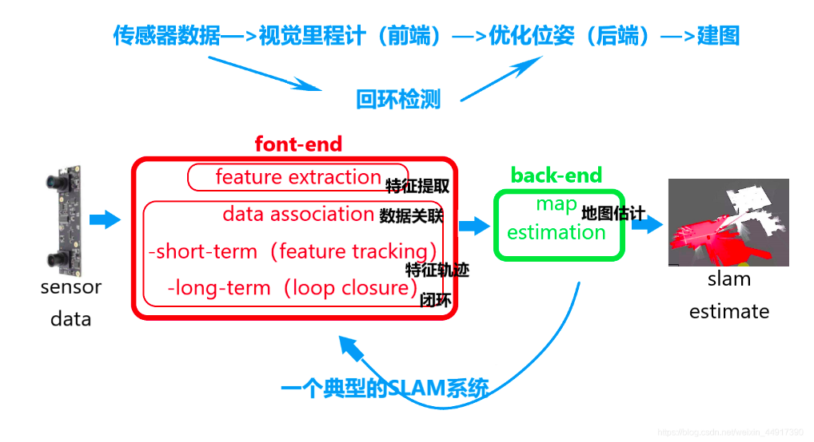

# 2021年08月09日：slam second stage

[toc]

---

## 0. review & plan

1. review：

   0803 已经完成了 hector slam + rfans，hector slam 没有办法形成闭环，只能进行算法学习（可以将 hector slam 当做 slam 研究的入门课题，以及对其进行商业落地可行性研究）。

2. plan：

   如果要实现闭环以及更精确的 slam，需要更复杂的方案，如：leGo_LOAM 和 vins mono：

   参考 1：[LVI-SAM安装与测试](https://blog.csdn.net/learning_tortosie/article/details/116051761)

3. **Open Motion Planning Library** (ryan)

2021年08月10日：

hector mapping, gmapping, cartograher 三个经典 slam 算法可以详细了解。刚才根林博谈话，了解了一些：

1. 关于激光雷达建图，当前需求是回答极氪的问题，需要重点实现 **cartographer（纯激光雷达建图）**，然后了解程序流程以及算法。

2. 关于 apa，提及了 one step 跟 multi step 算法，都是基于 rs 算法，参考：[一个实例了解自动驾驶路径规划 —— （四）HybridA*算法中RS曲线详解<又是古月居，牛B>](https://www.guyuehome.com/34363)；apa 的测试以后交给 cy、ssf，我的工作是 编译，代码优化，仿真，调试。

   参考 1：[智能小车建图导航-在rviz中导航（运行）<在高清地图创建完成后，需要做的事情>](https://www.guyuehome.com/34378)

   

---

## 1. some slam algorithm overview

**典型的 slam 技术框架**

1. hector mapping

   1.1. overview:

   设计初衷Hector主要用于救灾等地面不平坦的情况，因此无法使用里程计，特点是用IMU解决了激光的运动畸变问题。虽然系统不提供明确的循环关闭能力，但对于许多真实世界场景来说它足够准确。参考: [机器人SLAM与自主导航简介(笔记)<这篇文章提供了slam相关的总结>](https://www.guyuehome.com/34462)。

   1.2. system requirement:

   1.3. sites:

   

2. gmapping

   2.1. overview: 

   The gmapping package provides laser-based SLAM (Simultaneous Localization and Mapping), as a ROS node called slam_gmapping. Using slam_gmapping, you can create a 2-D occupancy grid map (like a building floorplan) from laser and pose data collected by a mobile robot.

   实时构建室内地图，在构建小场景地图所需的计算量较小且精度较高。相比Hector SLAM对激光雷达频率要求低、鲁棒性高（Hector 在机器人快速转向时很容易发生错误匹配，建出的地图发生错位，原因主要是优化算法容易陷入局部最小值）；而相比Cartographer在构建小场景地图时，Gmapping不需要太多的粒子并且没有回环检测因此计算量小于Cartographer而精度并没有差太多。但是，不适合构建大场景地图，并且没有回环检测，因此在回环闭合时可能会造成地图错位，虽然增加粒子数目可以使地图闭合但是以增加计算量和内存为代价，不能像Cartographer那样构建大的地图。参考: [机器人SLAM与自主导航简介(笔记)<这篇文章提供了slam相关的总结>](https://www.guyuehome.com/34462)。

   2.2. system requirement:

   ​	略

   2.3. sites:

   ​	site 1: [Gmapping算法原理及源代码解析<这篇博客对 gmapping 的应用框架讲的很详细>](https://cxx0822.github.io/2020/05/05/gmapping-suan-fa-yuan-li-ji-yuan-dai-ma-jie-xi/)

   ​	site 2: [ROS开发与应用<还是上面博主的文章，包含hector、gmapping、cartographer>](https://cxx0822.github.io/categories/ROS%E5%BC%80%E5%8F%91%E4%B8%8E%E5%BA%94%E7%94%A8/)

   ​	site 3: [基于turtlebot的定位与建图<继续上一个博主的文章，包含如何查看 lidar ros 代码，这哥们太仔细了>](https://cxx0822.github.io/2020/04/25/ji-yu-turtlebot-de-ding-wei-yu-jian-tu/)

   ​	site 4: [不可错过的gmapping算法使用与详细解释<古月居的讲解>](https://www.guyuehome.com/14967)

   ​	site 5: [我手写了个SLAM算法！<小白学移动机器人哥们的又一力作，牛B>](https://www.guyuehome.com/17802)

   

   

3. **cartographer**

   3.1. overview: 

   [Cartographer](https://github.com/cartographer-project/cartographer) (制图师) is a system that provides real-time simultaneous localization and mapping ([SLAM](https://en.wikipedia.org/wiki/Simultaneous_localization_and_mapping)) in 2D and 3D across multiple platforms and sensor configurations.

   累计误差较前两种算法低，能天然的输出协方差矩阵，后端优化的输入项。成本较低的雷达也能跑出不错的效果。是Google开源的一个ROS系统支持的2D和3D SLAM（simultaneous localization and mapping）库。参考: [机器人SLAM与自主导航简介(笔记)<这篇文章提供了slam相关的总结>](https://www.guyuehome.com/34462)。

   

   

   3.2. system requirement: 

   - 64-bit, modern CPU (e.g. 3rd generation i7)
   - 16 GB RAM
   - Ubuntu 18.04 (Bionic), 20.04 (Focal)
   - gcc version 6.3.0, 7.5.0, 9.3.0

   3.3. sites

   ​	site 0: [cartographer-project](https://github.com/cartographer-project)/**[cartographer](https://github.com/cartographer-project/cartographer)**

   ​	site 1: [Cartographer](https://google-cartographer.readthedocs.io/en/latest/#cartographer)

   ​	site 2: [Cartographer ROS Integration](https://google-cartographer-ros.readthedocs.io/en/latest/#cartographer-ros-integration)

   ​	site 3: [Compiling Cartographer ROS](https://google-cartographer-ros.readthedocs.io/en/latest/compilation.html)

   

4. OpenVSLAM

6. leGO_LOAM

7. vins mono

**注：**1-3 可以作为 slam 基础研究实践，4-6 作为进阶研究实践。4-6 在研究过程中可以适当增删，1-3 结合 视觉 slam 研究。如果时间允许。

---

## &. reference link

link 1: [如何在ROS的不同版本间进行切换以实现共存效果](https://blog.csdn.net/m0_46269438/article/details/107624106)

link 2: [SLAM本质剖析-Eigen<对Eigen有详细的讲解>](https://www.guyuehome.com/34670)

link 3: [SLAM本质剖析-Ceres<同样是 lovely_yoshino 哥们的文章，对 ceres 有详细的讲解>](https://www.guyuehome.com/34633)

link 4: [机器人SLAM与自主导航简介(笔记)<这篇文章提供了slam相关的总结>](https://www.guyuehome.com/34462)
