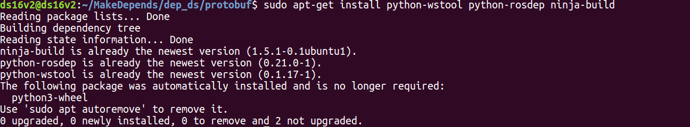
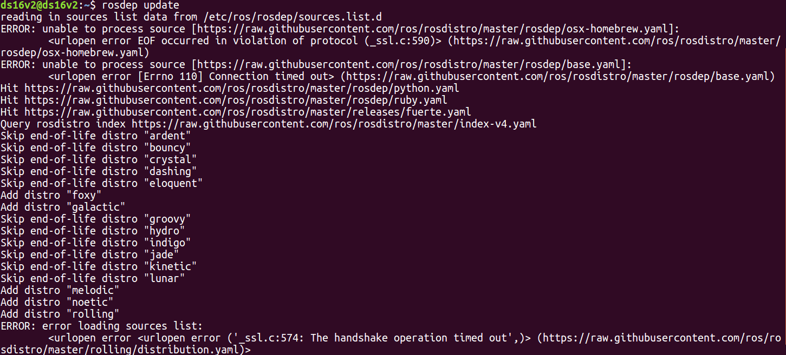
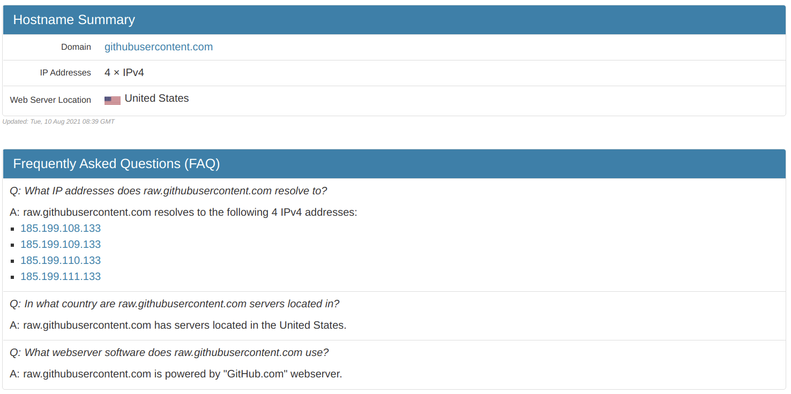
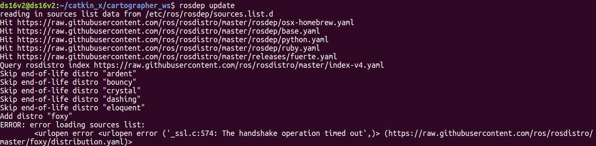
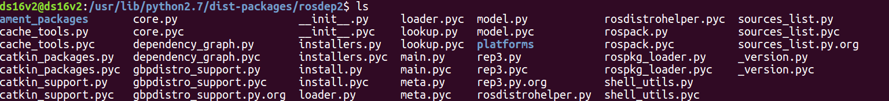
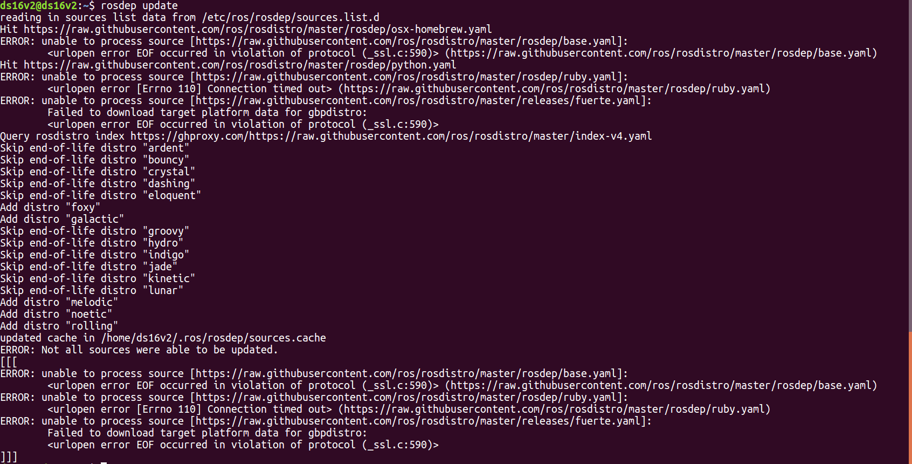

# 2021年08月11日：安装运行 ros slam cartographer

[toc]

---

记录 cartographer 的安装与运行


---

## 1. installation

### 1.1. 安装 protobuf3

```
sudo apt-get install autoconf autogen

git clone https://github.com/protocolbuffers/protobuf.git

cd protobuf

git submodule update --init --recursive

./autogen.sh
./configure

make

make check  # 这一步可能会报错，无视就好
sudo make install

sudo ldconfig  # refresh shared library cache.

————————————————
版权声明：本文为CSDN博主「北方诸哲」的原创文章，遵循CC 4.0 BY-SA版权协议，转载请附上原文出处链接及本声明。
原文链接：https://blog.csdn.net/seeseeatre/article/details/84863485
```

```
ds16v2@ds16v2:~/MakeDepends/dep_ds/protobuf$ protoc --version
libprotoc 3.17.3
```


### 1.2. 安装 `wstool, rosdep, ninja` 工具：


| wstool     | Command-line tools for maintaining a workspace of projects from multiple version-control systems. | `wstool`是用于管理`ROS`工作空间的工具，它通过`.rosinstall`文件规定工作空间的配置 |
| ---------- | ------------------------------------------------------------ | ------------------------------------------------------------ |
| **rosdep** | **`rosdep` is a command-line tool for installing system dependencies** | **rosdep是安装系统依赖项的命令行工具，可以方便在你需要编译某些源码的时候为其安装一些系统依赖，同时也是某些ROS核心功能组件所必需用到的工具。** |
| **ninja**  | **Ninja is a small build system with a focus on speed. It differs from other build systems in two major respects: it is designed to have its input files generated by a higher-level build system, and it is designed to run builds as fast as possible.** | **Ninja 是Google的一名程序员推出的注重速度的构建工具，一般在Unix/Linux上的程序通过make/makefile来构建编译，而Ninja通过将编译任务并行组织，大大提高了构建速度。** |


#### &. 参考：

1. [ros wstool的使用](https://blog.csdn.net/weixin_38258767/article/details/104260992)
2. [rosdep安装与使用](https://blog.csdn.net/weixin_45378779/article/details/103617471)
3. [Ninja](https://ninja-build.org/)
4. [cartographer安装<这个讲解的很全面>](https://zhuanlan.zhihu.com/p/259556885)


```
sudo apt-get update

# old ros distribution, kinetic
sudo apt-get install -y python-wstool python-rosdep ninja-build stow
```

```
ds16v2@ds16v2:~/MakeDepends/dep_ds/protobuf$ sudo apt-get install python-wstool python-rosdep ninja-build
Reading package lists... Done
Building dependency tree       
Reading state information... Done
ninja-build is already the newest version (1.5.1-0.1ubuntu1).
python-rosdep is already the newest version (0.21.0-1).
python-wstool is already the newest version (0.1.17-1).
The following package was automatically installed and is no longer required:
  python3-wheel
Use 'sudo apt autoremove' to remove it.
0 upgraded, 0 newly installed, 0 to remove and 2 not upgraded.
```




### 1.3. 安装 cartographer_ros 的依赖：

**创建 cartographer_ws：**

```
mkdir cartographer_ws
cd cartographer_ws
wstool init src  # 创建 ros warkspace 的 src 包
```

**关联远程仓库，从远程仓库拷贝 cartographer，cartographer_ros，ceres-solver 源代码并更新：**

```
wstool merge -t src https://raw.githubusercontent.com/googlecartographer/cartographer_ros/master/cartographer_ros.rosinstall

wstool update -t src
```

```
.
└── src
    ├── cartographer
    ├── cartographer_ros
    ├── ceres-solver
    └── .rosinstall
```


查看 `.rosinstall` 隐藏文件，文件内容是 cartographer 源代码远程仓库地址：

```
gedit .../cartographer_ws/src/.rosinstall
```

```json
# THIS IS AN AUTOGENERATED FILE, LAST GENERATED USING wstool ON 2021-08-10
- git: {local-name: cartographer, uri: 'https://github.com/cartographer-project/cartographer.git', version: 'master'}
- git: {local-name: cartographer_ros, uri: 'https://github.com/cartographer-project/cartographer_ros.git', version: 'master'}
- git: {local-name: ceres-solver, uri: 'https://github.com/ceres-solver/ceres-solver.git', version: 'master'}
```
更新源代码：
```
ds16v2@ds16v2:~/catkin_x/cartographer_ws$ wstool update -t src

[cartographer] Updating /home/ds16v2/catkin_x/cartographer_ws/src/cartographer
[cartographer] Done.
[cartographer_ros] Updating /home/ds16v2/catkin_x/cartographer_ws/src/cartographer_ros
[cartographer_ros] Done.
[ceres-solver] Updating /home/ds16v2/catkin_x/cartographer_ws/src/ceres-solver
[ceres-solver] Done.
```


**初始化 rosdep 并 更新 ros 依赖：**

```
sudo rosdep init    # 报错可忽视
rosdep update       # 报错则重新执行(网络原因)
rosdep install --from-paths src --ignore-src --rosdistro=${ROS_DISTRO} -y
```


### &. 参考：

1. [Cartographer<谷歌官网cartographer>](https://google-cartographer.readthedocs.io/en/latest/)
2. [Compiling Cartographer ROS](https://google-cartographer-ros.readthedocs.io/en/latest/compilation.html)
3. [Cartographer的原理与应用<又是cxx哥们的博客>](https://cxx0822.github.io/2019/11/11/cartographer-de-yuan-li-yu-ying-yong/)
4. [cartographer安装<这个讲解的很全面>](https://zhuanlan.zhihu.com/p/259556885)


---

## 2. implementation


---

## 3. issues collection

### 1. issue: `sudo rosdep init`

```
ds16v2@ds16v2:~$ sudo rosdep init

# 无法下载的情况
[sudo] password for ds16v2: 
ERROR: cannot download default sources list from:
https://raw.githubusercontent.com/ros/rosdistro/master/rosdep/sources.list.d/20-default.list
Website may be down.
```


```
# 下载成功的情况
ds16v2@ds16v2:~/catkin_x/cartographer_ws$ sudo rosdep init
[sudo] password for ds16v2: 
ERROR: default sources list file already exists:
	/etc/ros/rosdep/sources.list.d/20-default.list
Please delete if you wish to re-initialize
```


在`.../etc/ros/rosdep/sources.list.d/`目录下，打开 `20-default.list` 文件：

`$ gedit /etc/ros/rosdep/sources.list.d/20-default.list `

```json
$ gedit /etc/ros/rosdep/sources.list.d/20-default.list

# --- 20-default.list --- #
# os-specific listings first
yaml https://raw.githubusercontent.com/ros/rosdistro/master/rosdep/osx-homebrew.yaml osx

# generic
yaml https://raw.githubusercontent.com/ros/rosdistro/master/rosdep/base.yaml
yaml https://raw.githubusercontent.com/ros/rosdistro/master/rosdep/python.yaml
yaml https://raw.githubusercontent.com/ros/rosdistro/master/rosdep/ruby.yaml
gbpdistro https://raw.githubusercontent.com/ros/rosdistro/master/releases/fuerte.yaml fuerte

# newer distributions (Groovy, Hydro, ...) must not be listed anymore, they are being fetched from the rosdistro index.yaml instead
```


### 2. issue: `rosdep update`

`rosdep update` 会根据 `sudo rosdep init` 后保存的 `20-default.list` 文件（见 1.3）中的地址更新 ros 依赖，但是很多情况下是更新不成功的（time-out problem）。

```
ds16v2@ds16v2:~$ rosdep update

reading in sources list data from /etc/ros/rosdep/sources.list.d
ERROR: unable to process source [https://raw.githubusercontent.com/ros/rosdistro/master/rosdep/osx-homebrew.yaml]:
	<urlopen error EOF occurred in violation of protocol (_ssl.c:590)> (https://raw.githubusercontent.com/ros/rosdistro/master/rosdep/osx-homebrew.yaml)
ERROR: unable to process source [https://raw.githubusercontent.com/ros/rosdistro/master/rosdep/base.yaml]:
	<urlopen error [Errno 110] Connection timed out> (https://raw.githubusercontent.com/ros/rosdistro/master/rosdep/base.yaml)
Hit https://raw.githubusercontent.com/ros/rosdistro/master/rosdep/python.yaml
Hit https://raw.githubusercontent.com/ros/rosdistro/master/rosdep/ruby.yaml
Hit https://raw.githubusercontent.com/ros/rosdistro/master/releases/fuerte.yaml
Query rosdistro index https://raw.githubusercontent.com/ros/rosdistro/master/index-v4.yaml
Skip end-of-life distro "ardent"
Skip end-of-life distro "bouncy"
Skip end-of-life distro "crystal"
Skip end-of-life distro "dashing"
Skip end-of-life distro "eloquent"
Add distro "foxy"
Add distro "galactic"
Skip end-of-life distro "groovy"
Skip end-of-life distro "hydro"
Skip end-of-life distro "indigo"
Skip end-of-life distro "jade"
Skip end-of-life distro "kinetic"
Skip end-of-life distro "lunar"
Add distro "melodic"
Add distro "noetic"
Add distro "rolling"
ERROR: error loading sources list:
	<urlopen error <urlopen error ('_ssl.c:574: The handshake operation timed out',)> (https://raw.githubusercontent.com/ros/rosdistro/master/rolling/distribution.yaml)>
```



#### 尝试 1：修改 `/etc/hosts` 文件内容

>添加 `githubuserconent.com` 的 `ip：185.199.108.133`

尝试使用 `[https://www.ipaddress.com](https://www.ipaddress.com/)`查找 `https://raw.githubusercontent.com/ros/rosdistro/master/rosdep/sources.list.d/20-default.list` 的 IP。



然后修改 `/etc/hosts` 中的内容：`gedit /etc/hosts`，

这个解决方案效果也不好：

```
127.0.0.1	localhost
127.0.1.1	ds16v2

# 199.232.28.133 raw.githubusercontent.com
# 151.101.228.133 raw.github.com

# The following lines are desirable for IPv6 capable hosts
::1     ip6-localhost ip6-loopback
fe00::0 ip6-localnet
ff00::0 ip6-mcastprefix
ff02::1 ip6-allnodes
ff02::2 ip6-allrouters

# 151.101.84.133  raw.githubusercontent.com
# 185.199.108.133  raw.githubusercontent.com  # 这个网址是通过 ipaddress.com 查找到的
185.199.109.133  raw.githubusercontent.com  # 这个网址是通过 ipaddress.com 查找到的
```

这个是结果，依然有一些没有更新完成：

```
ds16v2@ds16v2:~/catkin_x/cartographer_ws$ rosdep update
reading in sources list data from /etc/ros/rosdep/sources.list.d
Hit https://raw.githubusercontent.com/ros/rosdistro/master/rosdep/osx-homebrew.yaml
Hit https://raw.githubusercontent.com/ros/rosdistro/master/rosdep/base.yaml
Hit https://raw.githubusercontent.com/ros/rosdistro/master/rosdep/python.yaml
Hit https://raw.githubusercontent.com/ros/rosdistro/master/rosdep/ruby.yaml
Hit https://raw.githubusercontent.com/ros/rosdistro/master/releases/fuerte.yaml
Query rosdistro index https://raw.githubusercontent.com/ros/rosdistro/master/index-v4.yaml
Skip end-of-life distro "ardent"
Skip end-of-life distro "bouncy"
Skip end-of-life distro "crystal"
Skip end-of-life distro "dashing"
Skip end-of-life distro "eloquent"
Add distro "foxy"
ERROR: error loading sources list:
	<urlopen error <urlopen error ('_ssl.c:574: The handshake operation timed out',)> (https://raw.githubusercontent.com/ros/rosdistro/master/foxy/distribution.yaml)>
```



使用 ipaddr 方法都没有办法完全更新 ros 依赖，现在尝试新方法。


#### 尝试 2：添加 `url="https://ghproxy.com/"+url `

rosdep update 可以发现：

> File "/usr/lib/python2.7/dist-packages/rosdep2/sources_list.py", line 486, in update_sources_list
>     rosdep_data = download_gbpdistro_as_rosdep_data(source.url)

```
ds16v2@ds16v2:~/catkin_x/cartographer_ws$ rosdep update

reading in sources list data from /etc/ros/rosdep/sources.list.d
ERROR: unable to process source [https://raw.githubusercontent.com/ros/rosdistro/master/rosdep/osx-homebrew.yaml]:
	<urlopen error EOF occurred in violation of protocol (_ssl.c:590)> (https://raw.githubusercontent.com/ros/rosdistro/master/rosdep/osx-homebrew.yaml)
ERROR: unable to process source [https://raw.githubusercontent.com/ros/rosdistro/master/rosdep/base.yaml]:
	<urlopen error EOF occurred in violation of protocol (_ssl.c:590)> (https://raw.githubusercontent.com/ros/rosdistro/master/rosdep/base.yaml)
ERROR: unable to process source [https://raw.githubusercontent.com/ros/rosdistro/master/rosdep/python.yaml]:
	<urlopen error [Errno 110] Connection timed out> (https://raw.githubusercontent.com/ros/rosdistro/master/rosdep/python.yaml)
Hit https://raw.githubusercontent.com/ros/rosdistro/master/rosdep/ruby.yaml
^CTraceback (most recent call last):
  File "/usr/bin/rosdep", line 11, in <module>
    load_entry_point('rosdep==0.21.0', 'console_scripts', 'rosdep')()
  File "/usr/lib/python2.7/dist-packages/rosdep2/main.py", line 146, in rosdep_main
    exit_code = _rosdep_main(args)
  File "/usr/lib/python2.7/dist-packages/rosdep2/main.py", line 441, in _rosdep_main
    return _no_args_handler(command, parser, options, args)
  File "/usr/lib/python2.7/dist-packages/rosdep2/main.py", line 450, in _no_args_handler
    return command_handlers[command](options)
  File "/usr/lib/python2.7/dist-packages/rosdep2/main.py", line 662, in command_update
    ros_distro=options.ros_distro)
  File "/usr/lib/python2.7/dist-packages/rosdep2/sources_list.py", line 486, in update_sources_list
    rosdep_data = download_gbpdistro_as_rosdep_data(source.url)
  File "/usr/lib/python2.7/dist-packages/rosdep2/gbpdistro_support.py", line 204, in download_gbpdistro_as_rosdep_data
    f = urlopen(gbpdistro_url, timeout=DOWNLOAD_TIMEOUT)
  File "/usr/lib/python2.7/urllib2.py", line 154, in urlopen
    return opener.open(url, data, timeout)
  File "/usr/lib/python2.7/urllib2.py", line 429, in open
    response = self._open(req, data)
  File "/usr/lib/python2.7/urllib2.py", line 447, in _open
    '_open', req)
  File "/usr/lib/python2.7/urllib2.py", line 407, in _call_chain
    result = func(*args)
  File "/usr/lib/python2.7/urllib2.py", line 1248, in https_open
    context=self._context)
  File "/usr/lib/python2.7/urllib2.py", line 1202, in do_open
    h.request(req.get_method(), req.get_selector(), req.data, headers)
  File "/usr/lib/python2.7/httplib.py", line 1103, in request
    self._send_request(method, url, body, headers)
  File "/usr/lib/python2.7/httplib.py", line 1143, in _send_request
    self.endheaders(body)
  File "/usr/lib/python2.7/httplib.py", line 1099, in endheaders
    self._send_output(message_body)
  File "/usr/lib/python2.7/httplib.py", line 913, in _send_output
    self.send(msg)
  File "/usr/lib/python2.7/httplib.py", line 875, in send
    self.connect()
  File "/usr/lib/python2.7/httplib.py", line 1324, in connect
    server_hostname=server_hostname)
  File "/usr/lib/python2.7/ssl.py", line 353, in wrap_socket
    _context=self)
  File "/usr/lib/python2.7/ssl.py", line 601, in __init__
    self.do_handshake()
  File "/usr/lib/python2.7/ssl.py", line 830, in do_handshake
    self._sslobj.do_handshake()
KeyboardInterrupt
```


注意这个地址：`/usr/lib/python2.7/dist-packages/rosdep2/`



之前修改过：`sources_list.py, rep3.py, gbpdistro_support.py` 三个文件，暂时先保留修改。

source_list.py 中：

```
# seconds to wait before aborting download of rosdep data
DOWNLOAD_TIMEOUT = 5000.0  # default: 15.0
```

rep3.py 中：

```
# seconds to wait before aborting download of gbpdistro data
DOWNLOAD_TIMEOUT = 5000.0  # default: 15.0
```

gbpdistro_support.py 中：

```
# seconds to wait before aborting download of gbpdistro data
DOWNLOAD_TIMEOUT = 5000.0  # default: 15.0
```

需要修改5个文件，添加：`url = "https://ghproxy.com/" + url  # mark: 0812`

```
/usr/lib/python2.7/dist-packages/rosdep2/gbpdistro_support.py  			# 36行, done
/usr/lib/python2.7/dist-packages/rosdep2/sources_list.py 				# 72行, done
/usr/lib/python2.7/dist-packages/rosdep2/rep3.py						# 39行, done
/usr/lib/python2.7/dist-packages/rosdistro/manifest_provider/github.py 	# 68行 119行, done
/usr/lib/python2.7/dist-packages/rosdistro/__init__.py					# 68行，done
```


1 -- gbpdistro_support.py	# 36行, done

```
# location of an example gbpdistro file for reference and testing
# url = "https://ghproxy.com/" + url  # mark: 0812
FUERTE_GBPDISTRO_URL = 'https://ghproxy.com/' + 'https://raw.githubusercontent.com/ros/rosdistro/' \
    'master/releases/fuerte.yaml'  # mark: 0812
```

2 -- sources_list.py 			# 72行, done

```
# default file to download with 'init' command in order to bootstrap
# rosdep
DEFAULT_SOURCES_LIST_URL = 'https://ghproxy.com/' + 'https://raw.githubusercontent.com/ros/rosdistro/master/rosdep/sources.list.d/20-default.list'  # mark: 0812
```

3 -- rep3.py						# 39行, done

```
# location of targets file for processing gbpdistro files
REP3_TARGETS_URL = 'https://ghproxy.com/' + 'https://raw.githubusercontent.com/ros/rosdistro/master/releases/targets.yaml'
```

4 -- github.py 					# 68行 119行, done

```
url = 'https://ghproxy.com/' + 'https://raw.githubusercontent.com/%s/%s/package.xml' % (path, release_tag)
    
url = 'https://ghproxy.com/' + 'https://raw.githubusercontent.com/%s/%s/%s' % \
            (path, cache.ref(), package_xml_path + '/package.xml' if package_xml_path else 'package.xml')  # mark: 0812
```

5 -- --init--.py					# 68行，done

```
DEFAULT_INDEX_URL = 'https://ghproxy.com/' + 'https://raw.githubusercontent.com/ros/rosdistro/master/index-v4.yaml'  # mark: 0812
```


依然有问题：

```
ds16v2@ds16v2:~$ rosdep update
reading in sources list data from /etc/ros/rosdep/sources.list.d
Hit https://raw.githubusercontent.com/ros/rosdistro/master/rosdep/osx-homebrew.yaml
ERROR: unable to process source [https://raw.githubusercontent.com/ros/rosdistro/master/rosdep/base.yaml]:
	<urlopen error EOF occurred in violation of protocol (_ssl.c:590)> (https://raw.githubusercontent.com/ros/rosdistro/master/rosdep/base.yaml)
Hit https://raw.githubusercontent.com/ros/rosdistro/master/rosdep/python.yaml
ERROR: unable to process source [https://raw.githubusercontent.com/ros/rosdistro/master/rosdep/ruby.yaml]:
	<urlopen error [Errno 110] Connection timed out> (https://raw.githubusercontent.com/ros/rosdistro/master/rosdep/ruby.yaml)
ERROR: unable to process source [https://raw.githubusercontent.com/ros/rosdistro/master/releases/fuerte.yaml]:
	Failed to download target platform data for gbpdistro:
	<urlopen error EOF occurred in violation of protocol (_ssl.c:590)>
Query rosdistro index https://ghproxy.com/https://raw.githubusercontent.com/ros/rosdistro/master/index-v4.yaml
Skip end-of-life distro "ardent"
Skip end-of-life distro "bouncy"
Skip end-of-life distro "crystal"
Skip end-of-life distro "dashing"
Skip end-of-life distro "eloquent"
Add distro "foxy"
Add distro "galactic"
Skip end-of-life distro "groovy"
Skip end-of-life distro "hydro"
Skip end-of-life distro "indigo"
Skip end-of-life distro "jade"
Skip end-of-life distro "kinetic"
Skip end-of-life distro "lunar"
Add distro "melodic"
Add distro "noetic"
Add distro "rolling"
updated cache in /home/ds16v2/.ros/rosdep/sources.cache
ERROR: Not all sources were able to be updated.
[[[
ERROR: unable to process source [https://raw.githubusercontent.com/ros/rosdistro/master/rosdep/base.yaml]:
	<urlopen error EOF occurred in violation of protocol (_ssl.c:590)> (https://raw.githubusercontent.com/ros/rosdistro/master/rosdep/base.yaml)
ERROR: unable to process source [https://raw.githubusercontent.com/ros/rosdistro/master/rosdep/ruby.yaml]:
	<urlopen error [Errno 110] Connection timed out> (https://raw.githubusercontent.com/ros/rosdistro/master/rosdep/ruby.yaml)
ERROR: unable to process source [https://raw.githubusercontent.com/ros/rosdistro/master/releases/fuerte.yaml]:
	Failed to download target platform data for gbpdistro:
	<urlopen error EOF occurred in violation of protocol (_ssl.c:590)>
]]]

```



```
(https://raw.githubusercontent.com/ros/rosdistro/master/rosdep/base.yaml)
(https://raw.githubusercontent.com/ros/rosdistro/master/rosdep/ruby.yaml)
[https://raw.githubusercontent.com/ros/rosdistro/master/releases/fuerte.yaml]

(https://raw.githubusercontent.com/ros/rosdistro/master/rosdep/base.yaml)
(https://raw.githubusercontent.com/ros/rosdistro/master/rosdep/ruby.yaml)
[https://raw.githubusercontent.com/ros/rosdistro/master/releases/fuerte.yaml]
```


解决问题，但是没有定位问题：

```
## 1. 首先rosdep init
ds16v2@ds16v2:~/MakeDepends/dep_ds/protobuf$ sudo rosdep init
[sudo] password for ds16v2: 
ERROR: default sources list file already exists:
	/etc/ros/rosdep/sources.list.d/20-default.list
Please delete if you wish to re-initialize

#====================================================================#

## 2. 如果 20-default.list 存在，删除后再 rosdep init
ds16v2@ds16v2:~/MakeDepends/dep_ds/protobuf$ sudo rm /etc/ros/rosdep/sources.list.d/20-default.list 

ds16v2@ds16v2:~/MakeDepends/dep_ds/protobuf$ sudo rosdep init
Wrote /etc/ros/rosdep/sources.list.d/20-default.list
Recommended: please run

	rosdep update

#====================================================================#

## 3. 完成 rosdep init 后，进行 rosdep update
ds16v2@ds16v2:~/MakeDepends/dep_ds/protobuf$ rosdep update
reading in sources list data from /etc/ros/rosdep/sources.list.d
Hit https://raw.githubusercontent.com/ros/rosdistro/master/rosdep/osx-homebrew.yaml
Hit https://raw.githubusercontent.com/ros/rosdistro/master/rosdep/base.yaml
Hit https://raw.githubusercontent.com/ros/rosdistro/master/rosdep/python.yaml
Hit https://raw.githubusercontent.com/ros/rosdistro/master/rosdep/ruby.yaml
Hit https://raw.githubusercontent.com/ros/rosdistro/master/releases/fuerte.yaml
Query rosdistro index https://ghproxy.com/https://raw.githubusercontent.com/ros/rosdistro/master/index-v4.yaml
Skip end-of-life distro "ardent"
Skip end-of-life distro "bouncy"
Skip end-of-life distro "crystal"
Skip end-of-life distro "dashing"
Skip end-of-life distro "eloquent"
Add distro "foxy"
Add distro "galactic"
Skip end-of-life distro "groovy"
Skip end-of-life distro "hydro"
Skip end-of-life distro "indigo"
Skip end-of-life distro "jade"
Skip end-of-life distro "kinetic"
Skip end-of-life distro "lunar"
Add distro "melodic"
Add distro "noetic"
Add distro "rolling"
ERROR: error loading sources list:
	('The read operation timed out',)

#====================================================================#

## 4. 如果 rosdep update 没有成功，可以尝试继续 rosdep update 
ds16v2@ds16v2:~/MakeDepends/dep_ds/protobuf$ rosdep update
reading in sources list data from /etc/ros/rosdep/sources.list.d
Hit https://raw.githubusercontent.com/ros/rosdistro/master/rosdep/osx-homebrew.yaml
Hit https://raw.githubusercontent.com/ros/rosdistro/master/rosdep/base.yaml
Hit https://raw.githubusercontent.com/ros/rosdistro/master/rosdep/python.yaml
Hit https://raw.githubusercontent.com/ros/rosdistro/master/rosdep/ruby.yaml
Hit https://raw.githubusercontent.com/ros/rosdistro/master/releases/fuerte.yaml
Query rosdistro index https://ghproxy.com/https://raw.githubusercontent.com/ros/rosdistro/master/index-v4.yaml
Skip end-of-life distro "ardent"
Skip end-of-life distro "bouncy"
Skip end-of-life distro "crystal"
Skip end-of-life distro "dashing"
Skip end-of-life distro "eloquent"
Add distro "foxy"
Add distro "galactic"
Skip end-of-life distro "groovy"
Skip end-of-life distro "hydro"
Skip end-of-life distro "indigo"
Skip end-of-life distro "jade"
Skip end-of-life distro "kinetic"
Skip end-of-life distro "lunar"
Add distro "melodic"
Add distro "noetic"
Add distro "rolling"
updated cache in /home/ds16v2/.ros/rosdep/sources.cache
```


#### &. 参考：

1. [ROS:sudo rosdep init出错常规方法都无效后解决办法记录](https://zhuanlan.zhihu.com/p/77483614)
2. [rosdep安装与使用<使用ipaddr解决rosdep update问题，未解决>](https://blog.csdn.net/weixin_45378779/article/details/103617471)
3. [解决ROS系统 rosdep update超时问题的新方法<使用修改rosdep资源下载函数解决rosdep update问题>](https://blog.csdn.net/leida_wt/article/details/115120940?utm_medium=distribute.pc_relevant_download.none-task-blog-2~default~BlogCommendFromBaidu~default-4.nonecase&depth_1-utm_source=distribute.pc_relevant_download.none-task-blog-2~default~BlogCommendFromBaidu~default-4.nonecas)
4. [ubuntu安装ROS进行到rosdep update时出现错误，如ERROR: unable to process source ...](https://blog.csdn.net/mrh1714348719/article/details/103803110)


---

## &. reference

