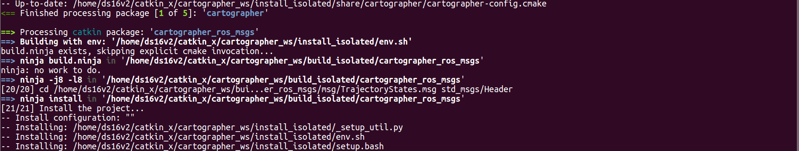

# 2021年08月13日：cartographer_ws compiling failure, attempt 2.

[toc]

---

reference to **2021年08月11日：安装运行 ros slam cartographer**, reinstall cartograher and cartographer_ros.


---

## 1. installation stage

```
mkdir catkin_ws
cd catkin_ws
wstool init src
wstool merge -t src https://raw.githubusercontent.com/cartographer-project/cartographer_ros/master/cartographer_ros.rosinstall
wstool update -t src
```

gedit src/.rosinstall 查看内容
```
# THIS IS AN AUTOGENERATED FILE, LAST GENERATED USING wstool ON 2021-08-13
- git:
    local-name: cartographer
    uri: https://github.com/cartographer-project/cartographer.git
    version: master
- git:
    local-name: cartographer_ros
    uri: https://github.com/cartographer-project/cartographer_ros.git
    version: master
```


如果官网安装方式不成功的话，可以尝试一下独立安装。


2021年08月13日：编译成功：

```
[50/384] Building CXX object CMakeFiles/cartographer.dir/cartographer/io/coloring_points_processor.cc.o
[51/384] Building CXX object CMakeFiles/cartographer.dir/cartographer/io/probability_grid_points_processor.cc.o
FAILED: /usr/bin/c++   -D__CLANG_SUPPORT_DYN_ANNOTATION__ -isystem /usr/include/eigen3 -isystem /usr/local/include -isystem /usr/include/lua5.2 -I. -I/home/ds16v2/catkin_x/cartographer_ws/src/cartographer -O3 -DNDEBUG    -pthread -fPIC  -Wall -Wpedantic -Werror=format-security -Werror=missing-braces -Werror=reorder -Werror=return-type -Werror=switch -Werror=uninitialized -O3 -DNDEBUG -MMD -MT CMakeFiles/cartographer.dir/cartographer/mapping/internal/trajectory_connectivity_state.cc.o -MF CMakeFiles/cartographer.dir/cartographer/mapping/internal/trajectory_connectivity_state.cc.o.d -o CMakeFiles/cartographer.dir/cartographer/mapping/internal/trajectory_connectivity_state.cc.o -c /home/ds16v2/catkin_x/cartographer_ws/src/cartographer/cartographer/mapping/internal/trajectory_connectivity_state.cc
In file included from /usr/include/c++/5/chrono:35:0,
                 from /home/ds16v2/catkin_x/cartographer_ws/src/cartographer/cartographer/common/time.h:20,
                 from /home/ds16v2/catkin_x/cartographer_ws/src/cartographer/cartographer/mapping/internal/trajectory_connectivity_state.h:20,
                 from /home/ds16v2/catkin_x/cartographer_ws/src/cartographer/cartographer/mapping/internal/trajectory_connectivity_state.cc:17:
/usr/include/c++/5/bits/c++0x_warning.h:32:2: error: #error This file requires compiler and library support for the ISO C++ 2011 standard. This support must be enabled with the -std=c++11 or -std=gnu++11 compiler options.
 #error This file requires compiler and library support \
```

在三个文件包的 CMakeLists.txt 中添加：`set(CMAKE_CXX_STANDARD 11)`

编译完成：（哇啊啊）

```
-- Installing: /home/ds16v2/catkin_x/cartographer_ws/install_isolated/lib/cmake/Ceres/CeresTargets.cmake
-- Installing: /home/ds16v2/catkin_x/cartographer_ws/install_isolated/lib/cmake/Ceres/CeresTargets-release.cmake
-- Installing: /home/ds16v2/catkin_x/cartographer_ws/install_isolated/lib/cmake/Ceres/CeresConfig.cmake
-- Installing: /home/ds16v2/catkin_x/cartographer_ws/install_isolated/lib/cmake/Ceres/CeresConfigVersion.cmake
-- Installing: /home/ds16v2/catkin_x/cartographer_ws/install_isolated/lib/cmake/Ceres/FindEigen.cmake
-- Installing: /home/ds16v2/catkin_x/cartographer_ws/install_isolated/lib/cmake/Ceres/FindGlog.cmake
-- Installing: /home/ds16v2/catkin_x/cartographer_ws/install_isolated/lib/cmake/Ceres/FindGflags.cmake
-- Installing: /home/ds16v2/catkin_x/cartographer_ws/install_isolated/lib/libceres.a
<== Finished processing package [5 of 5]: 'ceres-solver'
ds16v2@ds16v2:~/catkin_x/cartographer_ws$ 
```

编译 1：cartographer：


编译 2：cartographer_ros_msgs：



编译 3：cartographer_ros：


编译 4：cartographer_rviz：


编译 5：ceres-solver：


完成编译。


---

## 2. implementation stage


错误：

```
started core service [/rosout]
ERROR: cannot launch node of type [robot_state_publisher/robot_state_publisher]: robot_state_publisher
ROS path [0]=/opt/ros/kinetic/share/ros
ROS path [1]=/home/ds16v2/catkin_x/cartographer_ws/install_isolated/share
ROS path [2]=/opt/ros/kinetic/share


[FATAL] [1628850179.661537755]: Error opening file: /home/ds16v2/Downloads/cartographer_paper_deutsche


[playbag-6] process has died [pid 17492, exit code 1, cmd /opt/ros/kinetic/lib/rosbag/play --clock /home/ds16v2/Downloads/cartographer_paper_deutsche __name:=playbag __log:=/home/ds16v2/.ros/log/6e8df6f8-fc20-11eb-a857-a0c589ac1e85/playbag-6.log].
log file: /home/ds16v2/.ros/log/6e8df6f8-fc20-11eb-a857-a0c589ac1e85/playbag-6*.log
```


### reference

1. [google激光雷达slam算法Cartographer的安装及bag包demo测试](http://community.bwbot.org/topic/136/google%E6%BF%80%E5%85%89%E9%9B%B7%E8%BE%BEslam%E7%AE%97%E6%B3%95cartographer%E7%9A%84%E5%AE%89%E8%A3%85%E5%8F%8Abag%E5%8C%85demo%E6%B5%8B%E8%AF%95)


---

## 3. vpn stuff

官网安装步骤：[https://windscribe.com/guides/linux](https://windscribe.com/guides/linux)


安装成功，但是这个vpn似乎不给力：

安装步骤：

问题：`Failed to fetch https://repo.windscribe.com/ubuntu/dists/bionic/InRelease`

```
ds16v2@ds16v2:~$ sudo apt-get update
Hit:1 http://packages.ros.org/ros/ubuntu xenial InRelease
Hit:2 https://typora.io/linux ./ InRelease
Hit:3 https://esm.ubuntu.com/infra/ubuntu xenial-infra-security InRelease
Hit:4 https://esm.ubuntu.com/infra/ubuntu xenial-infra-updates InRelease
Get:5 https://download.docker.com/linux/ubuntu xenial InRelease [66.2 kB]
Hit:6 http://ppa.launchpad.net/git-core/ppa/ubuntu xenial InRelease
Hit:7 http://ppa.launchpad.net/graphics-drivers/ppa/ubuntu xenial InRelease   
Hit:8 http://ppa.launchpad.net/maarten-baert/simplescreenrecorder/ubuntu xenial InRelease   
Hit:9 http://ppa.launchpad.net/nilarimogard/webupd8/ubuntu xenial InRelease                 
Hit:10 http://ppa.launchpad.net/obsproject/obs-studio/ubuntu xenial InRelease               
Hit:11 http://ppa.launchpad.net/ubuntu-toolchain-r/test/ubuntu xenial InRelease             
Hit:12 http://ppa.launchpad.net/ubuntu-x-swat/updates/ubuntu xenial InRelease               
Hit:13 http://mirrors.ustc.edu.cn/ubuntu xenial InRelease                                   
Hit:14 http://mirrors.ustc.edu.cn/ubuntu xenial-updates InRelease                           
Hit:15 http://mirrors.ustc.edu.cn/ubuntu xenial-backports InRelease                         
Hit:16 http://mirrors.ustc.edu.cn/ubuntu xenial-security InRelease                          
Hit:17 http://packages.osrfoundation.org/gazebo/ubuntu-stable xenial InRelease              
Err:18 https://repo.windscribe.com/ubuntu bionic InRelease
  Connection timed out after 120001 milliseconds
Fetched 66.2 kB in 2min 0s (551 B/s)
Reading package lists... Done
W: Failed to fetch https://repo.windscribe.com/ubuntu/dists/bionic/InRelease  Connection timed out after 120001 milliseconds
W: Some index files failed to download. They have been ignored, or old ones used instead.
ds16v2@ds16v2:~$ 

```


解决：


give me binaries:


```
$ sudo dpkg -i windscribe-cli_1.4-51_amd64.deb
$ sudo apt install -f
$ sudo dpkg -i windscribe-cli_1.4-51_amd64.deb  # 其实不用这一步
```


```
name:	jacob_lee
passwd:	lijin890119
```


安装好了，但是没有鸟用。
