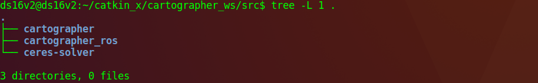
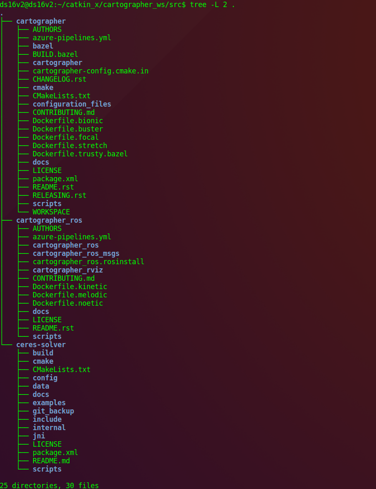
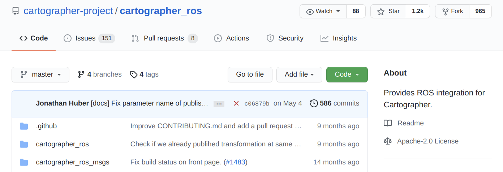
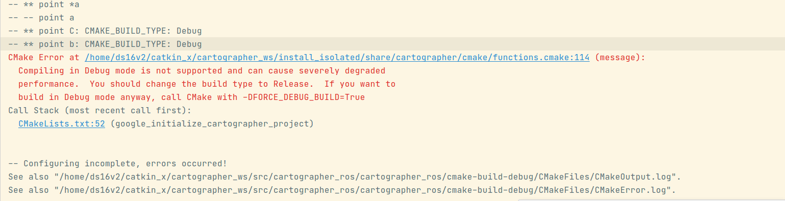
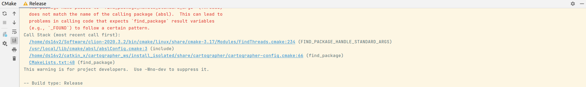
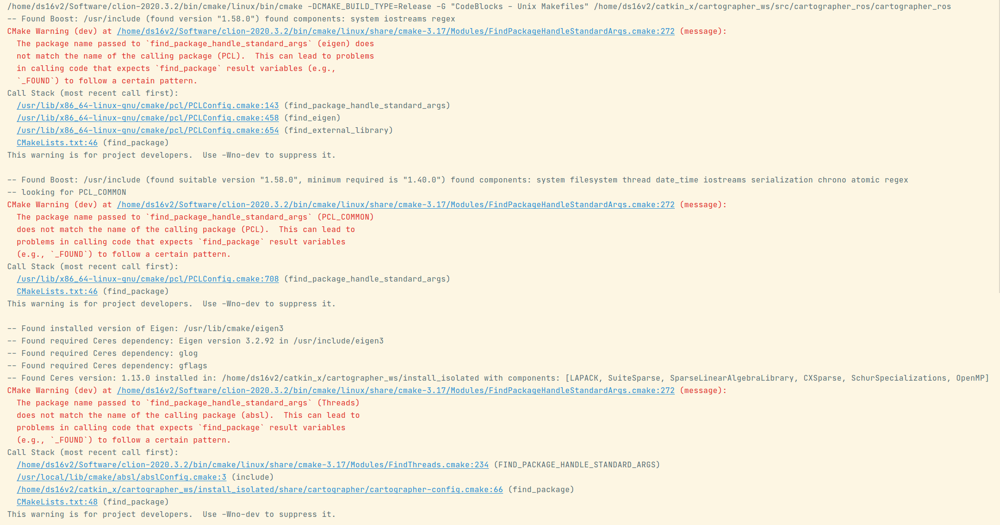
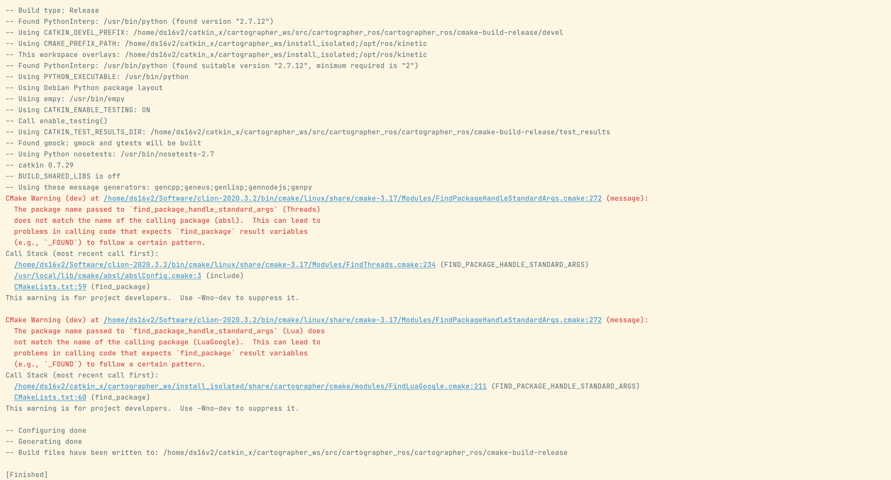
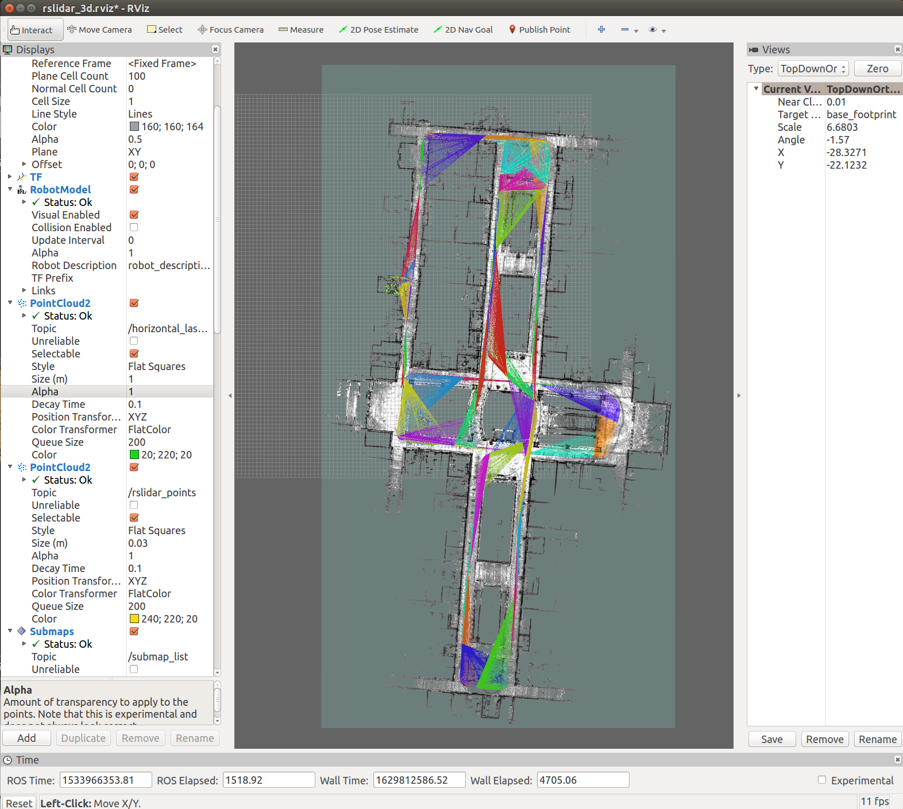
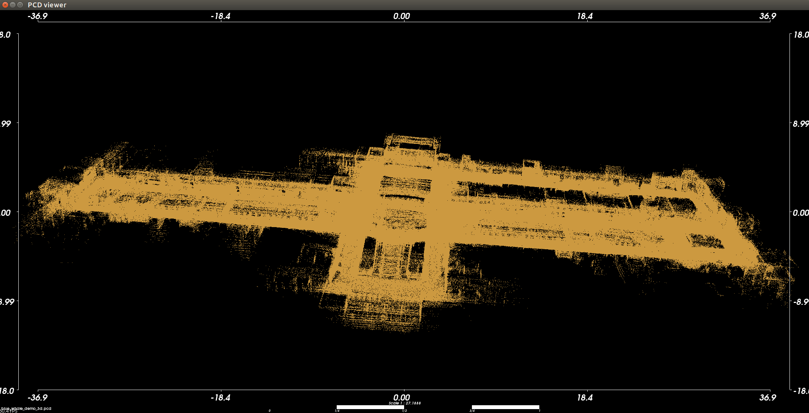
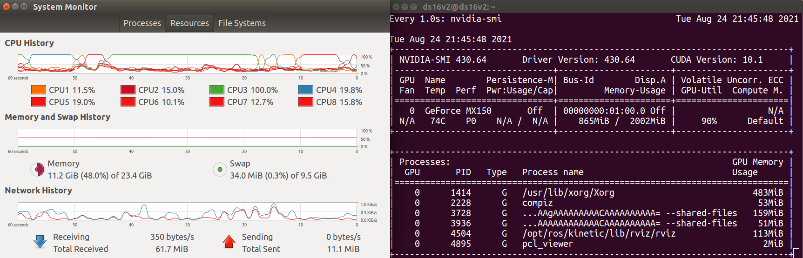

# 2021年08月21日：參考相關資料，進行建圖

---

[toc]


---

日誌：

2021年08月23日：繼續 0821 閱讀完 cartographer doc. official。（linux 虛擬機）思考如何將 ros 無干擾地安裝到服務器上。這對以後的仿真很有用。

​	額外瞭解：layer 是一個 map container <key: value>，每一個執行類通過輸入 input layer key，尋找對應的 value（正確的格式），作爲程序的參數，然後將計算結果通過（全局變量的引用，指針或 layer）傳遞出去。mpc，soc？

​	看完：【cartographer】纯定位 纯本地化 pure_localization，對 cartographer 有了一點新認識，cartographer 包含 建圖 與 定位功能，現在需要熟練單獨操作 建圖 + 定位。(done)

​	接着 看 google 的 cartographer documentation。

2021年08月24日：今天建圖，離線，在線。


---

## 0. **置頂：cartographer 中文資料**

參考：[【移动机器人技术】Cartographer使用流程-建图-纯定位-导航](https://blog.csdn.net/weixin_43259286/article/details/105143605?utm_medium=distribute.pc_relevant.none-task-blog-2%7Edefault%7EBlogCommendFromMachineLearnPai2%7Edefault-3.control&depth_1-utm_source=distribute.pc_relevant.none-task-blog-2%7Edefault%7EBlogCommendFromMachineLearnPai2%7Edefault-3.control#t12)

參考：[Cartographer用于机器人纯定位](https://blog.csdn.net/weixin_36976685/article/details/103834608)

參考：[Cartographer的纯定位模式在低性能处理器上的应用适配](https://blog.csdn.net/zhzwang/article/details/110197647)

參考：[第四讲 【cartographer】纯定位 纯本地化 pure_localization](https://blog.csdn.net/wesigj/article/details/111334726)

參考：[《机器人操作系统入门》课程代码示例](https://github.com/sychaichangkun/ROS-Academy-for-Beginners)

參考：[Cartographer编译方法及编译出错（glog库链接错误）解决方法](https://blog.csdn.net/mxdsdo09/article/details/103172574)

參考：[google激光雷达slam算法Cartographer的安装及bag包demo测试](https://community.bwbot.org/topic/136/google%E6%BF%80%E5%85%89%E9%9B%B7%E8%BE%BEslam%E7%AE%97%E6%B3%95cartographer%E7%9A%84%E5%AE%89%E8%A3%85%E5%8F%8Abag%E5%8C%85demo%E6%B5%8B%E8%AF%95)

参考：[cartographer经典版本快速安装](https://zhuanlan.zhihu.com/p/374669589)

参考：[Cartographer编译安装 2020年12月31日亲测通过](https://blog.csdn.net/qq_41807801/article/details/112007868)

参考：[1.3 ROS-找不到launch文件的解决办法](https://zhuanlan.zhihu.com/p/94971196)


---

## 1. rosbag 建圖：bluewhale rosbag

參考：[谷歌cartographer使用速腾聚创3d激光雷达数据进行三维建图](https://community.bwbot.org/topic/523/%E8%B0%B7%E6%AD%8Ccartographer%E4%BD%BF%E7%94%A8%E9%80%9F%E8%85%BE%E8%81%9A%E5%88%9B3d%E6%BF%80%E5%85%89%E9%9B%B7%E8%BE%BE%E6%95%B0%E6%8D%AE%E8%BF%9B%E8%A1%8C%E4%B8%89%E7%BB%B4%E5%BB%BA%E5%9B%BE)

參考：[BluewhaleRobot](https://github.com/BluewhaleRobot)/**[cartographer_ros](https://github.com/BluewhaleRobot/cartographer_ros)**


**review stable cartographer commit:**





```
ds16v2@ds16v2:~/catkin_x/cartographer_ws/src$ tree -L 2 .
.
├── cartographer
│   ├── AUTHORS
│   ├── azure-pipelines.yml
│   ├── bazel
│   ├── BUILD.bazel
│   ├── cartographer
│   ├── cartographer-config.cmake.in
│   ├── CHANGELOG.rst
│   ├── cmake
│   ├── CMakeLists.txt
│   ├── configuration_files
│   ├── CONTRIBUTING.md
│   ├── Dockerfile.bionic
│   ├── Dockerfile.buster
│   ├── Dockerfile.focal
│   ├── Dockerfile.stretch
│   ├── Dockerfile.trusty.bazel
│   ├── docs
│   ├── LICENSE
│   ├── package.xml
│   ├── README.rst
│   ├── RELEASING.rst
│   ├── scripts
│   └── WORKSPACE
├── cartographer_ros
│   ├── AUTHORS
│   ├── azure-pipelines.yml
│   ├── cartographer_ros
│   ├── cartographer_ros_msgs
│   ├── cartographer_ros.rosinstall
│   ├── cartographer_rviz
│   ├── CONTRIBUTING.md
│   ├── Dockerfile.kinetic
│   ├── Dockerfile.melodic
│   ├── Dockerfile.noetic
│   ├── docs
│   ├── LICENSE
│   ├── README.rst
│   └── scripts
└── ceres-solver
    ├── build
    ├── cmake
    ├── CMakeLists.txt
    ├── config
    ├── data
    ├── docs
    ├── examples
    ├── git_backup
    ├── include
    ├── internal
    ├── jni
    ├── LICENSE
    ├── package.xml
    ├── README.md
    └── scripts

```


| s.no. | package_name     |                       | commit no.                               | date                                  |
| ----- | ---------------- | --------------------- | ---------------------------------------- | ------------------------------------- |
| 1     | cartographer     |                       | b8228ee6564f5a7ad0d6d0b9a30516521cff2ee9 | Date:   Fri May 7 15:52:57 2021 +0200 |
| 2     | cartographer_ros |                       | c06879b63567a78ef92b7d1fa79453839e36ffec | Date:   Tue May 4 13:43:20 2021 +0200 |
| 2.1   |                  | cartographer_ros      | c06879b63567a78ef92b7d1fa79453839e36ffec | Date:   Tue May 4 13:43:20 2021 +0200 |
| 2.2   |                  | cartographer_ros_msgs | c06879b63567a78ef92b7d1fa79453839e36ffec | Date:   Tue May 4 13:43:20 2021 +0200 |
| 2.3   |                  | cartographer_rviz     | c06879b63567a78ef92b7d1fa79453839e36ffec | Date:   Tue May 4 13:43:20 2021 +0200 |
| 3     | ceres-solver     |                       | 19333b0f55c8462381038e70d42af43b52941128 | Date:   Thu Aug 3 00:09:36 2017 -0700 |


GitHub 中查看 commit no.：



刚才看了 commit，当前的 cartographer_ros 需要的 ceres-solver 版本是：19333b0f55c8462381038e70d42af43b52941128。

也就是说要使 cartographer，cartographer_ros 编译通过的话，需要选对版本。


**错误：**

使用 clion 打开 cartographer_ros 项目的时候（CMakelists.txt），会出现错误：



**原因：**

可以从 functions.cmake 文件 `109-126` 中看出，如果使用 Debug 模式构建构建代码，需要以 force_debug 模式构建（110），否则会进入 else 中并报错；优先使用 release 模式。有两种解决方式：

**解决方式1：**

在 functions.cmake 文件中指定构建方式：

```
set(CMAKE_BUILD_TYPE "Release")
```

**解决方式2：**

修改 clion 默认的 cmake 构建方式：

> file --> settings --> build, execution, deployment --> cmake --> profiles --> enable profile --> build type --> release

然后 reload cmake，没有报错：







从 上面的 输出 可以看见很多的库版本信息。

是否可以重复编译当前的 cartographer_ros 版本？

参考：[cmake编译Debug和Release版本的注意点](https://blog.csdn.net/Felaim/article/details/72852994)


**roscore error:**

```
roscore cannot run as another roscore/master is already running. 
Please kill other roscore/master processes before relaunching.
The ROS_MASTER_URI is http://ds16v2:11311/
The traceback for the exception was written to the log file
```

解决：

```
killall -9 roscore
killall -9 rosmaster
```


---

完成建图：




3d_pcd






---

疑問：

1. 什麼是純定位（純本地化）（pure localization）？