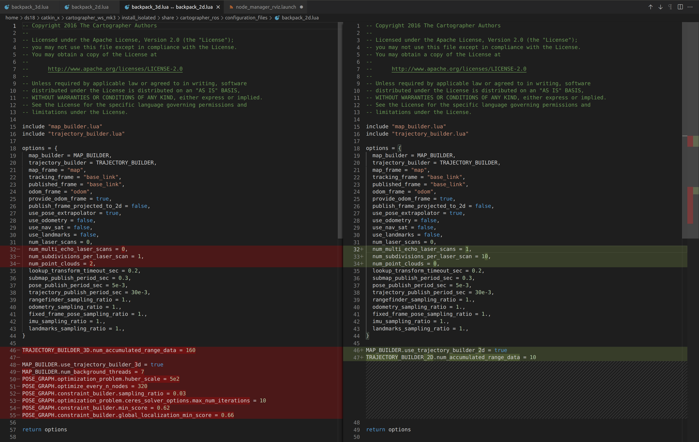

# 2021年9月24日：cartographer_ros + rosbag record

[toc]

---

## **target:**

1. 20210924:
   1. cartographer + rosbag + launch file
   2. cartographer + rfans + launch file (real time)
   3. office rosbag record


2. 20210925:
   1. office rosbag record
   2. underground rosbag record


---

## 1. 2021年9月24日：


### 1.1. 录制 cartographer

```
1. 验证 rosbag 工具：cartographer_rosbag_validate

	使用 cartographer_rosbag_validate 分析 rosbag 中的数据。
	(It is generally a good idea to run this tool before trying to tune Cartographer for incorrect data.)
	
---+---+---+---+---+---+---+---+---+---+---+

2. 创建 .lua 配置

	2.1. robot configuration 文件使用 .lua 格式编写。
	2.2. 示例 configuration .lua 文件 存放 路径：
			src/cartographer_ros/cartographer_ros/configuration_files
	2.3. 示例 configuration .lua 文件 安装路径：
			install_isolated/share/cartographer_ros/configuration_files/
	2.4. 快速编写自己的 .lua 文件（就是抄作业啦~~~）：
    	*. 3D Slam:
    	cp install_isolated/share/cartographer_ros/configuration_files/backpack_3d.lua \
    		install_isolated/share/cartographer_ros/configuration_files/my_robot.lua
    	*. 2D slam:
    	cp install_isolated/share/cartographer_ros/configuration_files/backpack_2d.lua \
    		install_isolated/share/cartographer_ros/configuration_files/my_robot.lua
    
    2.5. 快速修改自己的 .lua 文件
    	*. 编写 my_robot.lua.
    	*. 可修改的值位置 option 区域
    2.6. 在修改 .lua 文件中，需要修改 TF frame IDS:
    	*. map_frame
    	*. tracking_frame
    	*. published_frame
    	*. odom_frame
	2.7. You can either distribute your robot’s TF tree from a /tf topic in your bag or define it in a .urdf robot 
			definition.
		*. 使用 /tf (transfrom frame).
		*. 这是一个实时工具，观察在Ros上被发布的坐标系树，可用刷新按钮来更新树的内容。与上一个工具的区别在于：上一个工具连续采样5s获得的树的内容，
			并存成一个图片；这个工具可以连续的观察树的内容，使用起来更方便。
	2.8. 可以使用 use_landmarks & use_nav_sat 启动 地标 + GPS。option 中其他的变量最好保留不动。 
	2.9. 这两个变量可能需要调整：
		*. TRAJECTORY_BUILDER_3D.num_accumulated_range_data
		*. TRAJECTORY_BUILDER_2D.num_accumulated_range_data
		设成 100 或 2.
	
---+---+---+---+---+---+---+---+---+---+---+

3. 创建 .launch 文件

	*. 建议为每一个 slam robot 配置一个 .launch 文件。
    *. .launch 文件保存路径：src/cartographer_ros/cartographer_ros/launch/
    *. .launch 文件安装路径：install_isolated/share/cartographer_ros/launch/

	拷贝 demo 文件 用作 自用 roslaunch：
	
	cp install_isolated/share/cartographer_ros/launch/backpack_3d.launch \  					         
		install_isolated/share/cartographer_ros/launch/my_robot.launch
	
	cp install_isolated/share/cartographer_ros/launch/demo_backpack_3d.launch \
		install_isolated/share/cartographer_ros/launch/demo_my_robot.launch

	cp install_isolated/share/cartographer_ros/launch/offline_backpack_3d.launch \
		install_isolated/share/cartographer_ros/launch/offline_my_robot.launch

	cp install_isolated/share/cartographer_ros/launch/demo_backpack_3d_localization.launch \
		install_isolated/share/cartographer_ros/launch/demo_my_robot_localization.launch

	cp install_isolated/share/cartographer_ros/launch/assets_writer_backpack_3d.launch \
		install_isolated/share/cartographer_ros/launch/assets_writer_my_robot.launch
	
	|--- 说明：
	
	(1). backpack_3d.launch <-> my_robot.launch:
		使用情形：机器人平台（robot），执行 online slam (实时)，实时传感器数据。
		补充：暂无。
	
	(2). demo_backpack_3d.launch <-> demo_my_robot.launch
		使用情形：开发平台（development machine），rosbag 文件。
		补充：同时开启 rviz 窗口（可以查看 cartographer 状态）。
		需要：bag_filename
		
	(3). offline_backpack_3d.launch <-> offline_my_robot.launch
		使用情形：同（2），但是速度更快，同时可以使用 多个 rosbag 文件。
		需要：bag_filenames
		
	(4). demo_backpack_3d_localization.launch <-> demo_my_robot_localization.launch
		使用情形：同（2），需要 load_state_filename 参数，这个参数 指向 .pbstream（之前的录制的 cartographer execution）; 之前的
		录制 用作 pre-computed map，cartographer 将只会在这个 map 执行 localization。
		需要：load_state_filename
	
	(5). assets_writer_backpack_3d.launch <-> assets_writer_my_robot.launch
		使用情形：从录制的 .pbstream 提取数据。
		需要：暂无。
		
	注1：`configuration_basename`：指向`.lua`文件。

	注2：`robot_description`：如果要使用自己的 `.urdf`模型文件，将文件存放在`install_isolated/share/cartographer_ros/urdf`，
	指向这个`.urdf`文件。

	注3：如果要使用 `/tf`消息，删除参数`robot_description`，`robot_state_publisher`以及包含`-urfd`的行。

	注4：使用`<remap>`重定向 topics，如果 bag 或 sensor 播放的的 topic 名称与 cartographer ROS 接收的 名称不符。	
	
---+---+---+---+---+---+---+---+---+---+---+
4. 启动 Cartographer
	roslaunch cartographer_ros my_robot.launch bag_filename:=/path/to/your_bag.bag


```

注：关于 .lua 配置，参考：[Lua configuration reference documentation](https://google-cartographer-ros.readthedocs.io/en/latest/configuration.html#lua-configuration-reference-documentation)


#### 1.1.1. 文件：`.lua`

示例：2D SLAM：backpad_2d.lua 

```lua
-- Copyright 2016 The Cartographer Authors
--
-- Licensed under the Apache License, Version 2.0 (the "License");
-- you may not use this file except in compliance with the License.
-- You may obtain a copy of the License at
--
--      http://www.apache.org/licenses/LICENSE-2.0
--
-- Unless required by applicable law or agreed to in writing, software
-- distributed under the License is distributed on an "AS IS" BASIS,
-- WITHOUT WARRANTIES OR CONDITIONS OF ANY KIND, either express or implied.
-- See the License for the specific language governing permissions and
-- limitations under the License.

include "map_builder.lua"
include "trajectory_builder.lua"

options = {
  map_builder = MAP_BUILDER,
  trajectory_builder = TRAJECTORY_BUILDER,
  map_frame = "map",
  tracking_frame = "base_link",
  published_frame = "base_link",
  odom_frame = "odom",
  provide_odom_frame = true,
  publish_frame_projected_to_2d = false,
  use_pose_extrapolator = true,
  use_odometry = false,
  use_nav_sat = false,
  use_landmarks = false,
  num_laser_scans = 0,
  num_multi_echo_laser_scans = 1,
  num_subdivisions_per_laser_scan = 10,
  num_point_clouds = 0,
  lookup_transform_timeout_sec = 0.2,
  submap_publish_period_sec = 0.3,
  pose_publish_period_sec = 5e-3,
  trajectory_publish_period_sec = 30e-3,
  rangefinder_sampling_ratio = 1.,
  odometry_sampling_ratio = 1.,
  fixed_frame_pose_sampling_ratio = 1.,
  imu_sampling_ratio = 1.,
  landmarks_sampling_ratio = 1.,
}

MAP_BUILDER.use_trajectory_builder_2d = true
TRAJECTORY_BUILDER_2D.num_accumulated_range_data = 10

return options
```


示例：3D SLAM：backpack_3d.lua

```lua
-- Copyright 2016 The Cartographer Authors
--
-- Licensed under the Apache License, Version 2.0 (the "License");
-- you may not use this file except in compliance with the License.
-- You may obtain a copy of the License at
--
--      http://www.apache.org/licenses/LICENSE-2.0
--
-- Unless required by applicable law or agreed to in writing, software
-- distributed under the License is distributed on an "AS IS" BASIS,
-- WITHOUT WARRANTIES OR CONDITIONS OF ANY KIND, either express or implied.
-- See the License for the specific language governing permissions and
-- limitations under the License.

include "map_builder.lua"
include "trajectory_builder.lua"

options = {
  map_builder = MAP_BUILDER,
  trajectory_builder = TRAJECTORY_BUILDER,
  map_frame = "map",
  tracking_frame = "base_link",
  published_frame = "base_link",
  odom_frame = "odom",
  provide_odom_frame = true,
  publish_frame_projected_to_2d = false,
  use_pose_extrapolator = true,
  use_odometry = false,
  use_nav_sat = false,
  use_landmarks = false,
  num_laser_scans = 0,
  num_multi_echo_laser_scans = 0,
  num_subdivisions_per_laser_scan = 1,
  num_point_clouds = 2,
  lookup_transform_timeout_sec = 0.2,
  submap_publish_period_sec = 0.3,
  pose_publish_period_sec = 5e-3,
  trajectory_publish_period_sec = 30e-3,
  rangefinder_sampling_ratio = 1.,
  odometry_sampling_ratio = 1.,
  fixed_frame_pose_sampling_ratio = 1.,
  imu_sampling_ratio = 1.,
  landmarks_sampling_ratio = 1.,
}

TRAJECTORY_BUILDER_3D.num_accumulated_range_data = 160

MAP_BUILDER.use_trajectory_builder_3d = true
MAP_BUILDER.num_background_threads = 7
POSE_GRAPH.optimization_problem.huber_scale = 5e2
POSE_GRAPH.optimize_every_n_nodes = 320
POSE_GRAPH.constraint_builder.sampling_ratio = 0.03
POSE_GRAPH.optimization_problem.ceres_solver_options.max_num_iterations = 10
POSE_GRAPH.constraint_builder.min_score = 0.62
POSE_GRAPH.constraint_builder.global_localization_min_score = 0.66

return options
```


对比：




#### 1.1.2. 文件：`.launch`

示例：`my_robot.launch`

```xml
<!--
  Copyright 2016 The Cartographer Authors

  Licensed under the Apache License, Version 2.0 (the "License");
  you may not use this file except in compliance with the License.
  You may obtain a copy of the License at

       http://www.apache.org/licenses/LICENSE-2.0

  Unless required by applicable law or agreed to in writing, software
  distributed under the License is distributed on an "AS IS" BASIS,
  WITHOUT WARRANTIES OR CONDITIONS OF ANY KIND, either express or implied.
  See the License for the specific language governing permissions and
  limitations under the License.
-->

<launch>
  <param name="robot_description"
    textfile="$(find cartographer_ros)/urdf/backpack_3d.urdf" />

  <node name="robot_state_publisher" pkg="robot_state_publisher"
    type="robot_state_publisher" />

  <node name="cartographer_node" pkg="cartographer_ros"
      type="cartographer_node" args="
          -configuration_directory $(find cartographer_ros)/configuration_files
          -configuration_basename backpack_3d.lua"
      output="screen">
    <remap from="points2_1" to="horizontal_laser_3d" />
    <remap from="points2_2" to="vertical_laser_3d" />
  </node>

  <node name="cartographer_occupancy_grid_node" pkg="cartographer_ros"
      type="cartographer_occupancy_grid_node" args="-resolution 0.05" />
</launch>

```

注1：`configuration_basename`：指向`.lua`文件。

注2：`robot_description`：如果要使用自己的 `.urdf`模型文件，将文件存放在`install_isolated/share/cartographer_ros/urdf`，指向这个`.urdf`文件。

注3：如果要使用 `/tf`消息，删除参数`robot_description`，`robot_state_publisher`以及包含`-urfd`的行。

注4：使用`<remap>`重定向 topics，如果 bag 或 sensor 播放的的 topic 名称与 cartographer ROS 接收的 名称不符。


注5：`IMU` topic 命名成：`imu`。

注6：`sensor_msgs/LaserScan` 一个 topic，命名成：`scan`；多个 topics，命名成：`scan_1`，`scan_2...`。

注7：`sensor_msgs/MultiEchoLaserScan`仅一个 topic，命名成：`echoes`；多个 topics，命名成：`echoes_1` ，`echoes_2...`。

注8：`sensor_msgs/PointCloud2` 一个 topic，命名成：`points2`；多个 topics，命名成：`points2_1`，`points2_2`。


### 1.2. TF 命令：

```
rosrun tf view_frames          # 然后会看到一些提示，并且生成了一个frames.pdf文件。

# 1. 采用 tf_monitor，查看当前TF树中所有坐标系的发布状态。 
rosrun tf tf_monitor

# 2. 采用 rqt_tf_tree，查看当前所有坐标之间的变换关系，可通过刷新更新当前树的内容。  
rosrun rqt_tf_tree rqt_tf_tree

# 3. 采用 tf_echo，获取reference_frame和target_frame之间的坐标变换关系。 
rosrun tf tf_echo [reference_frame] [target_frame]
```


### &&. 参考

link01: [Running Cartographer ROS on your own bag](https://google-cartographer-ros.readthedocs.io/en/latest/your_bag.html)

link02: [ROS探索总结（十二）—— 坐标系统](https://www.guyuehome.com/265)

link03: [ROS学习记录⑤：TF工具的使用与练习](https://www.guyuehome.com/20269)

link04: [**Google Cartographer max speed for robot**](https://answers.ros.org/question/341816/google-cartographer-max-speed-for-robot/)


---

## 2. 2021年9月25日：


### 1. 调配 Cartographer

> Cartographer is a complex system and tuning it requires a good understanding of its inner working.

调配 Cartographer 需要了解其内部运作机制。


> Cartographer can be seen as two separate, but related subsystems. The first one is **local SLAM** (sometimes also called **frontend** or local trajectory builder). Its job is to build a succession of **submaps**. Each submap is meant to be locally consistent but we accept that local SLAM drifts over time. 

Cartographer 包含两个子系统：1. local SLAM（前端），2. global SLAM（后端）。

前端用来建立 连续的 子，每一个子图 局部连续，但是随着时间累积逐渐漂移。


> The other subsystem is **global SLAM** (sometimes called the **backend**). It runs in background threads and its main job is to find **loop closure constraints**. It does that by scan-matching **scans** (gathered in **nodes**) against submaps.

后端用于找到 闭环约束，通过对 子图 进行 匹配索引扫描。


> On a higher abstraction, the job of local SLAM is to generate good submaps and the job of global SLAM is to tie them most consistently together.


注01：Local SLAM options 配置文件地址：

```
# 对 2D 
install_isolated/share/cartographer/configuration_files/trajectory_builder_2d.lua

# 对 3D
install_isolated/share/cartographer/configuration_files/trajectory_builder_3d.lua
```

注02：Global SLAM options 配置文件地址：

```
install_isolated/share/cartographer/configuration_files/pose_graph.lua
```


#### 1.1. 文件：`trajectory_builder_2d.lua`

```lua
-- Copyright 2016 The Cartographer Authors
--
-- Licensed under the Apache License, Version 2.0 (the "License");
-- you may not use this file except in compliance with the License.
-- You may obtain a copy of the License at
--
--      http://www.apache.org/licenses/LICENSE-2.0
--
-- Unless required by applicable law or agreed to in writing, software
-- distributed under the License is distributed on an "AS IS" BASIS,
-- WITHOUT WARRANTIES OR CONDITIONS OF ANY KIND, either express or implied.
-- See the License for the specific language governing permissions and
-- limitations under the License.

TRAJECTORY_BUILDER_2D = {
  use_imu_data = true,
  min_range = 0.,
  max_range = 30.,
  min_z = -0.8,
  max_z = 2.,
  missing_data_ray_length = 5.,
  num_accumulated_range_data = 1,
  voxel_filter_size = 0.025,

  adaptive_voxel_filter = {
    max_length = 0.5,
    min_num_points = 200,
    max_range = 50.,
  },

  loop_closure_adaptive_voxel_filter = {
    max_length = 0.9,
    min_num_points = 100,
    max_range = 50.,
  },

  use_online_correlative_scan_matching = false,
  real_time_correlative_scan_matcher = {
    linear_search_window = 0.1,
    angular_search_window = math.rad(20.),
    translation_delta_cost_weight = 1e-1,
    rotation_delta_cost_weight = 1e-1,
  },

  ceres_scan_matcher = {
    occupied_space_weight = 1.,
    translation_weight = 10.,
    rotation_weight = 40.,
    ceres_solver_options = {
      use_nonmonotonic_steps = false,
      max_num_iterations = 20,
      num_threads = 1,
    },
  },

  motion_filter = {
    max_time_seconds = 5.,
    max_distance_meters = 0.2,
    max_angle_radians = math.rad(1.),
  },

  imu_gravity_time_constant = 10.,

  submaps = {
    num_range_data = 90,
    grid_options_2d = {
      grid_type = "PROBABILITY_GRID",
      resolution = 0.05,
    },
    range_data_inserter = {
      range_data_inserter_type = "PROBABILITY_GRID_INSERTER_2D",
      probability_grid_range_data_inserter = {
        insert_free_space = true,
        hit_probability = 0.55,
        miss_probability = 0.49,
      },
      tsdf_range_data_inserter = {
        truncation_distance = 0.3,
        maximum_weight = 10.,
        update_free_space = false,
        normal_estimation_options = {
          num_normal_samples = 4,
          sample_radius = 0.5,
        },
        project_sdf_distance_to_scan_normal = false,
        update_weight_range_exponent = 0,
        update_weight_angle_scan_normal_to_ray_kernel_bandwith = 0,
        update_weight_distance_cell_to_hit_kernel_bandwith = 0,
      },
    },
  },
}
```


#### 1.2. 文件：`trajectory_builder_3d.lua`

```lua
-- Copyright 2016 The Cartographer Authors
--
-- Licensed under the Apache License, Version 2.0 (the "License");
-- you may not use this file except in compliance with the License.
-- You may obtain a copy of the License at
--
--      http://www.apache.org/licenses/LICENSE-2.0
--
-- Unless required by applicable law or agreed to in writing, software
-- distributed under the License is distributed on an "AS IS" BASIS,
-- WITHOUT WARRANTIES OR CONDITIONS OF ANY KIND, either express or implied.
-- See the License for the specific language governing permissions and
-- limitations under the License.

MAX_3D_RANGE = 60.

TRAJECTORY_BUILDER_3D = {
  min_range = 1.,
  max_range = MAX_3D_RANGE,
  num_accumulated_range_data = 1,
  voxel_filter_size = 0.15,

  high_resolution_adaptive_voxel_filter = {
    max_length = 2.,
    min_num_points = 150,
    max_range = 15.,
  },

  low_resolution_adaptive_voxel_filter = {
    max_length = 4.,
    min_num_points = 200,
    max_range = MAX_3D_RANGE,
  },

  use_online_correlative_scan_matching = false,
  real_time_correlative_scan_matcher = {
    linear_search_window = 0.15,
    angular_search_window = math.rad(1.),
    translation_delta_cost_weight = 1e-1,
    rotation_delta_cost_weight = 1e-1,
  },

  ceres_scan_matcher = {
    occupied_space_weight_0 = 1.,
    occupied_space_weight_1 = 6.,
    translation_weight = 5.,
    rotation_weight = 4e2,
    only_optimize_yaw = false,
    ceres_solver_options = {
      use_nonmonotonic_steps = false,
      max_num_iterations = 12,
      num_threads = 1,
    },
  },

  motion_filter = {
    max_time_seconds = 0.5,
    max_distance_meters = 0.1,
    max_angle_radians = 0.004,
  },

  imu_gravity_time_constant = 10.,
  rotational_histogram_size = 120,

  submaps = {
    high_resolution = 0.10,
    high_resolution_max_range = 20.,
    low_resolution = 0.45,
    num_range_data = 160,
    range_data_inserter = {
      hit_probability = 0.55,
      miss_probability = 0.49,
      num_free_space_voxels = 2,
    },
  },
}
```


#### 1.3. 文件：`pose_graph.lua`

```lua
-- Copyright 2016 The Cartographer Authors
--
-- Licensed under the Apache License, Version 2.0 (the "License");
-- you may not use this file except in compliance with the License.
-- You may obtain a copy of the License at
--
--      http://www.apache.org/licenses/LICENSE-2.0
--
-- Unless required by applicable law or agreed to in writing, software
-- distributed under the License is distributed on an "AS IS" BASIS,
-- WITHOUT WARRANTIES OR CONDITIONS OF ANY KIND, either express or implied.
-- See the License for the specific language governing permissions and
-- limitations under the License.

POSE_GRAPH = {
  optimize_every_n_nodes = 90,
  constraint_builder = {
    sampling_ratio = 0.3,
    max_constraint_distance = 15.,
    min_score = 0.55,
    global_localization_min_score = 0.6,
    loop_closure_translation_weight = 1.1e4,
    loop_closure_rotation_weight = 1e5,
    log_matches = true,
    fast_correlative_scan_matcher = {
      linear_search_window = 7.,
      angular_search_window = math.rad(30.),
      branch_and_bound_depth = 7,
    },
    ceres_scan_matcher = {
      occupied_space_weight = 20.,
      translation_weight = 10.,
      rotation_weight = 1.,
      ceres_solver_options = {
        use_nonmonotonic_steps = true,
        max_num_iterations = 10,
        num_threads = 1,
      },
    },
    fast_correlative_scan_matcher_3d = {
      branch_and_bound_depth = 8,
      full_resolution_depth = 3,
      min_rotational_score = 0.77,
      min_low_resolution_score = 0.55,
      linear_xy_search_window = 5.,
      linear_z_search_window = 1.,
      angular_search_window = math.rad(15.),
    },
    ceres_scan_matcher_3d = {
      occupied_space_weight_0 = 5.,
      occupied_space_weight_1 = 30.,
      translation_weight = 10.,
      rotation_weight = 1.,
      only_optimize_yaw = false,
      ceres_solver_options = {
        use_nonmonotonic_steps = false,
        max_num_iterations = 10,
        num_threads = 1,
      },
    },
  },
  matcher_translation_weight = 5e2,
  matcher_rotation_weight = 1.6e3,
  optimization_problem = {
    huber_scale = 1e1,
    acceleration_weight = 1e3,
    rotation_weight = 3e5,
    local_slam_pose_translation_weight = 1e5,
    local_slam_pose_rotation_weight = 1e5,
    odometry_translation_weight = 1e5,
    odometry_rotation_weight = 1e5,
    fixed_frame_pose_translation_weight = 1e1,
    fixed_frame_pose_rotation_weight = 1e2,
    log_solver_summary = false,
    use_online_imu_extrinsics_in_3d = true,
    ceres_solver_options = {
      use_nonmonotonic_steps = false,
      max_num_iterations = 50,
      num_threads = 7,
    },
  },
  max_num_final_iterations = 200,
  global_sampling_ratio = 0.003,
  log_residual_histograms = true,
  global_constraint_search_after_n_seconds = 10.,
}
```


---

### &&. 参考


