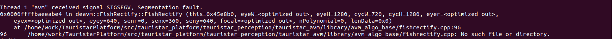
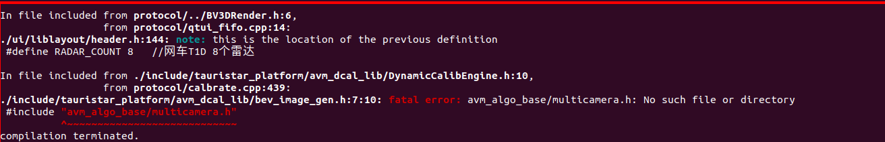

# 20211206_bst_cross_debug：黑芝麻算法库联调

[toc]


---

## 系统编译报错点：

```
# point 1
/opt/bstos/1.2.1.2/sysroots/x86_64-bstsdk-linux/usr/libexec/aarch64-bst-linux/gcc/aarch64-bst-linux/8.3.0/real-ld: skipping incompatible /opt/bstos/1.2.1.2/sysroots/aarch64-bst-linux/lib/libgcc_s.so.1 when searching for libgcc_s.so.1
cp ./*.h ../libs/liblook
cp: target '../libs/liblook' is not a directory
Makefile:5: recipe for target 'all' failed
make: *** [all] Error 1
```


位置：

```cmake
#/home/ds18/Work_DC/TauristarPlatform/src/tauristar_platform/TauristarUI_Engine/app/modelCarLUT/CMakeLists.txt

include_directories(
  ${Boost_INCLUDE_DIRS}
  ${EIGEN3_INCLUDE_DIR}
  ${OpenCV_INCLUDE_DIRS}
  alg
  calibration
  freetype
  libcar_data
  liblayout
  liblayout_cal
  liblook
  libshader
  libshow
  libshow_cal
  libtex
  pages
  tinyxml
  util
  .
)
```


---


```
# point 2
/opt/bstos/1.2.1.2/sysroots/x86_64-bstsdk-linux/usr/libexec/aarch64-bst-linux/gcc/aarch64-bst-linux/8.3.0/real-ld: skipping incompatible /opt/bstos/1.2.1.2/sysroots/aarch64-bst-linux/lib/libgcc_s.so.1 when searching for libgcc_s.so.1
cp ./*.h ../libs/libshader
cp: target '../libs/libshader' is not a directory
Makefile:8: recipe for target 'debug' failed
make: *** [debug] Error 1
```


位置：

```cmake
#/home/ds18/Work_DC/TauristarPlatform/src/tauristar_platform/TauristarUI_Engine/app/modelCarLUT/CMakeLists.txt

include_directories(
  ${Boost_INCLUDE_DIRS}
  ${EIGEN3_INCLUDE_DIR}
  ${OpenCV_INCLUDE_DIRS}
  alg
  calibration
  freetype
  libcar_data
  liblayout
  liblayout_cal
  liblook
  libshader
  libshow
  libshow_cal
  libtex
  pages
  tinyxml
  util
  .
)
```


---


```
# point 3
/opt/bstos/1.2.1.2/sysroots/x86_64-bstsdk-linux/usr/libexec/aarch64-bst-linux/gcc/aarch64-bst-linux/8.3.0/real-ld: skipping incompatible /opt/bstos/1.2.1.2/sysroots/aarch64-bst-linux/lib/libgcc_s.so.1 when searching for libgcc_s.so.1
cp ./*.h ../libs/libshow
cp: target '../libs/libshow' is not a directory
Makefile:8: recipe for target 'debug' failed
```


位置：

```cmake
#/home/ds18/Work_DC/TauristarPlatform/src/tauristar_platform/TauristarUI_Engine/app/modelCarLUT/CMakeLists.txt

include_directories(
  ${Boost_INCLUDE_DIRS}
  ${EIGEN3_INCLUDE_DIR}
  ${OpenCV_INCLUDE_DIRS}
  alg
  calibration
  freetype
  libcar_data
  liblayout
  liblayout_cal
  liblook
  libshader
  libshow
  libshow_cal
  libtex
  pages
  tinyxml
  util
  .
)
```


---


```
# point 4
/opt/bstos/1.2.1.2/sysroots/x86_64-bstsdk-linux/usr/libexec/aarch64-bst-linux/gcc/aarch64-bst-linux/8.3.0/real-ld: skipping incompatible /opt/bstos/1.2.1.2/sysroots/aarch64-bst-linux/lib/libgcc_s.so.1 when searching for libgcc_s.so.1
cp ./*.h ../libs/libshow_cal
cp: target '../libs/libshow_cal' is not a directory
Makefile:7: recipe for target 'all' failed
make: *** [all] Error 1
```


位置：

```cmake
#/home/ds18/Work_DC/TauristarPlatform/src/tauristar_platform/TauristarUI_Engine/app/modelCarLUT/CMakeLists.txt

include_directories(
  ${Boost_INCLUDE_DIRS}
  ${EIGEN3_INCLUDE_DIR}
  ${OpenCV_INCLUDE_DIRS}
  alg
  calibration
  freetype
  libcar_data
  liblayout
  liblayout_cal
  liblook
  libshader
  libshow
  libshow_cal  # <--
  libtex
  pages
  tinyxml
  util
  .
)
```


---


```
# point 5
/opt/bstos/1.2.1.2/sysroots/x86_64-bstsdk-linux/usr/libexec/aarch64-bst-linux/gcc/aarch64-bst-linux/8.3.0/real-ld: skipping incompatible /opt/bstos/1.2.1.2/sysroots/aarch64-bst-linux/lib/libgcc_s.so.1 when searching for libgcc_s.so.1
cp ./*.h ../libs/liblayout
cp: target '../libs/liblayout' is not a directory
Makefile:8: recipe for target 'debug' failed
make: *** [debug] Error 1
cd ../ && aarch64-bst-linux-g++
```


位置：

```cmake
#/home/ds18/Work_DC/TauristarPlatform/src/tauristar_platform/TauristarUI_Engine/app/modelCarLUT/CMakeLists.txt

include_directories(
  ${Boost_INCLUDE_DIRS}
  ${EIGEN3_INCLUDE_DIR}
  ${OpenCV_INCLUDE_DIRS}
  alg
  calibration
  freetype
  libcar_data
  liblayout			# <--
  liblayout_cal
  liblook
  libshader
  libshow
  libshow_cal
  libtex
  pages
  tinyxml
  util
  .
)
```


---


```
# point 6
/opt/bstos/1.2.1.2/sysroots/x86_64-bstsdk-linux/usr/libexec/aarch64-bst-linux/gcc/aarch64-bst-linux/8.3.0/real-ld: skipping incompatible /opt/bstos/1.2.1.2/sysroots/aarch64-bst-linux/lib/libgcc_s.so.1 when searching for libgcc_s.so.1
cp ./*.h ../libs/libcar_data
cp: target '../libs/libcar_data' is not a directory
Makefile:5: recipe for target 'all' failed
make: *** [all] Error 1
```


位置：

```cmake
#/home/ds18/Work_DC/TauristarPlatform/src/tauristar_platform/TauristarUI_Engine/app/modelCarLUT/CMakeLists.txt

include_directories(
  ${Boost_INCLUDE_DIRS}
  ${EIGEN3_INCLUDE_DIR}
  ${OpenCV_INCLUDE_DIRS}
  alg
  calibration
  freetype
  libcar_data
  liblayout
  liblayout_cal
  liblook
  libshader
  libshow
  libshow_cal
  libtex
  pages
  tinyxml
  util
  .
)
```


---


```
# point 7
/opt/bstos/1.2.1.2/sysroots/x86_64-bstsdk-linux/usr/libexec/aarch64-bst-linux/gcc/aarch64-bst-linux/8.3.0/real-ld: skipping incompatible /opt/bstos/1.2.1.2/sysroots/aarch64-bst-linux/lib/libgcc_s.so.1 when searching for libgcc_s.so.1
cp ./*.h ../libs/libtex
cp: target '../libs/libtex' is not a directory
Makefile:5: recipe for target 'all' failed
make: *** [all] Error 1
mkdir: cannot create directory '../so': File exists
```


位置：

```cmake
#/home/ds18/Work_DC/TauristarPlatform/src/tauristar_platform/TauristarUI_Engine/app/modelCarLUT/CMakeLists.txt

include_directories(
  ${Boost_INCLUDE_DIRS}
  ${EIGEN3_INCLUDE_DIR}
  ${OpenCV_INCLUDE_DIRS}
  alg
  calibration
  freetype
  libcar_data
  liblayout
  liblayout_cal
  liblook
  libshader
  libshow
  libshow_cal
  libtex
  pages
  tinyxml
  util
  .
)
```


---


```
# point 8
[100%] Linking CXX executable avm
/opt/bstos/1.2.1.2/sysroots/x86_64-bstsdk-linux/usr/libexec/aarch64-bst-linux/gcc/aarch64-bst-linux/8.3.0/real-ld: /home/avm/exe/../libs/tauristar_platform_app/libbasic_util.so: undefined reference to `boost::system::detail::generic_category_ncx()'
collect2: error: ld returned 1 exit status
CMakeFiles/avm.dir/build.make:98: recipe for target 'avm' failed
make[2]: *** [avm] Error 1
```


位置：

```
还不清楚位置
```


---


```
# point 9
CMakeFiles/Makefile2:72: recipe for target 'CMakeFiles/avm.dir/all' failed
make[1]: *** [CMakeFiles/avm.dir/all] Error 2
```


---


```
# point 10
Makefile:83: recipe for target 'all' failed
make: *** [all] Error 2
+ set -e
+ [ 1 -lt 1 ]
+ cp -rf ../ui/so/libUIControls.so ../ui/so/libcar_data.so ../ui/so/libcar_model_3d.so ../ui/so/liblayout.so ../ui/so/liblayout_4img.so ../ui/so/liblayout_cjqd_cal.so ../ui/so/liblayout_cjqd_video.so ../ui/so/liblook.so ../ui/so/libshader.so ../ui/so/libshader1DCamWide.so ../ui/so/libshader2DCar.so ../ui/so/libshader2DCarModel.so ../ui/so/libshader2DCarModelBin.so ../ui/so/libshaderCam.so ../ui/so/libshaderCar.so ../ui/so/libshaderCarGlass.so ../ui/so/libshaderCarMain.so ../ui/so/libshaderCarModel.so ../ui/so/libshaderCarModelBin.so ../ui/so/libshaderCarPhong.so ../ui/so/libshaderFXAA.so ../ui/so/libshaderLine.so ../ui/so/libshaderSecr.so ../ui/so/libshaderTexCar.so ../ui/so/libshaderTexMain.so ../ui/so/libshaderTexMask.so ../ui/so/libshaderTexMod.so ../ui/so/libshaderUiMain.so ../ui/so/libshaderUtil.so ../ui/so/libshaderYuv.so ../ui/so/libshaderYuv2D.so ../ui/so/libshaderYuvMix.so ../ui/so/libshader_operation.so ../ui/so/libshow.so ../ui/so/libshow1DCam.so ../ui/so/libshow1DCamWide.so ../ui/so/libshow2DCar.so ../ui/so/libshow2DRadar.so ../ui/so/libshow2DVehicleLine.so ../ui/so/libshow3DCar.so ../ui/so/libshow3DModel.so ../ui/so/libshowOpenglDraw.so ../ui/so/libshowRadar.so ../ui/so/libshowUiMain.so ../ui/so/libshowUiVideo.so ../ui/so/libshowVehicleLine.so ../ui/so/libshow_AHD_RV3DModel.so ../ui/so/libshow_AHD_RV_VehicleLine.so ../ui/so/libshow_AHD_VehicleLine.so ../ui/so/libshow_cal.so ../ui/so/libshow_cjqd_UiMain.so ../ui/so/libshow_cjqd_cal.so ../ui/so/libshow_cjqd_developer.so ../ui/so/libtex.so ../ui/so/libtext_code_convert.so ../libs/bvs
+ cp -rf ../exe/build/avm vsdk/
cp: cannot stat '../exe/build/avm': No such file or directory
```


---


|  |
| ------------------------------------------------------------ |
|  |


---


## 排查：

### 01. cmake 输出：

怀疑是 `BUILD_WITH_NEW_UI = ON`，不是这个问题。

```yaml
root@13ba83a744e3:/home/work_1/TauristarPlatform/src/tauristar_platform# ./docker_build_bst.sh 
Inside docker, ready to build
Delete build directory
-- Toolchain file defaulted to '/opt/bstos/1.2.1.2/sysroots/x86_64-bstsdk-linux/usr/share/cmake/OEToolchainConfig.cmake'
-- The C compiler identification is GNU 8.3.0
-- The CXX compiler identification is GNU 8.3.0
-- Check for working C compiler: /opt/bstos/1.2.1.2/sysroots/x86_64-bstsdk-linux/usr/bin/aarch64-bst-linux/aarch64-bst-linux-gcc
-- Check for working C compiler: /opt/bstos/1.2.1.2/sysroots/x86_64-bstsdk-linux/usr/bin/aarch64-bst-linux/aarch64-bst-linux-gcc -- works
-- Detecting C compiler ABI info
-- Detecting C compiler ABI info - done
-- Detecting C compile features
-- Detecting C compile features - done
-- Check for working CXX compiler: /opt/bstos/1.2.1.2/sysroots/x86_64-bstsdk-linux/usr/bin/aarch64-bst-linux/aarch64-bst-linux-g++
-- Check for working CXX compiler: /opt/bstos/1.2.1.2/sysroots/x86_64-bstsdk-linux/usr/bin/aarch64-bst-linux/aarch64-bst-linux-g++ -- works
-- Detecting CXX compiler ABI info
-- Detecting CXX compiler ABI info - done
-- Detecting CXX compile features
-- Detecting CXX compile features - done
-- CMAKE_MODULE_PATH: /home/work_1/TauristarPlatform/src/tauristar_platform/cmake
-- CMAKE_PREFIX_PATH: /home/work_1/TauristarPlatform/src/tauristar_platform/third_party/g2o_9b41a4e/cmake_modules
-- TAURISTAR_SRC_DIR: /home/work_1/TauristarPlatform/src/tauristar_platform
-- CMAKE_BINARY_DIR:  /home/work_1/TauristarPlatform/src/tauristar_platform/build
-- TAURISTAR_THIRD_PARTY: /home/work_1/TauristarPlatform/src/tauristar_platform/third_party
-- TAURISTAR_CROSS_COMPONENTS_DIR: /home/work_1/TauristarPlatform/src/tauristar_platform/cross_components
-- Found OpenCV: /home/opencv344/opencv_install (found version "3.4.4") 
-- Looking for pthread.h
-- Looking for pthread.h - found
-- Looking for pthread_create
-- Looking for pthread_create - not found
-- Looking for pthread_create in pthreads
-- Looking for pthread_create in pthreads - not found
-- Looking for pthread_create in pthread
-- Looking for pthread_create in pthread - found
-- Found Threads: TRUE  
-- Boost version: 1.68.0
-- Found the following Boost libraries:
--   serialization
--   system
--   program_options
--   thread
--   filesystem
--   regex
--   chrono
--   date_time
--   atomic
-- Found OpenSSL: /opt/bstos/1.2.1.2/sysroots/aarch64-bst-linux/usr/lib64/libcrypto.so (found version "1.1.1b")  
NL2SOL LIBRARIES PATH: /home/work_1/TauristarPlatform/src/tauristar_platform/third_party/nl2sol/install_horizon
-- OpenCV_INCLUDE_DIRS = /home/opencv344/opencv_install/include;/home/opencv344/opencv_install/include/opencv
-- OpenCV_LIBS_PATH = 
-- OpenCV_LIBS = opencv_calib3d;opencv_core;opencv_dnn;opencv_features2d;opencv_flann;opencv_highgui;opencv_imgcodecs;opencv_imgproc;opencv_ml;opencv_objdetect;opencv_photo;opencv_shape;opencv_stitching;opencv_superres;opencv_video;opencv_videoio;opencv_videostab
-- Boost_LIBRARIES_PATH: 
-- Boost_INCLUDE_DIRS: /opt/bstos/1.2.1.2/sysroots/aarch64-bst-linux/usr/include
-- option: BUILD_WITH_ROS=OFF
-- option: BUILD_WITH_OPENCV=ON
-- option: BUILD_WITH_HDMAP=ON
-- option: BUILD_WITH_DATABASE=OFF
-- option: BUILD_WITH_LIBTORCH=OFF
-- option: BUILD_WITH_SOFARPC=OFF
-- option: BUILD_WITH_ROSBRIDGECPP=OFF
-- option: BUILD_WITH_CAFFE=OFF
-- option: BUILD_WITH_BSD=OFF
-- option: BUILD_WITH_RINGBUFFER=OFF
-- option: BUILD_WITH_NEW_UI=OFF
-- option: BUILD_CROSS_MAKE=OFF
-- option: BUILD_WITH_MCU=OFF
-- option: BUILD_WITH_VSLAM=OFF
-- option: USE_PANGOLIN_VIEWER=OFF
-- option: BUILD_WITH_ZEROMQ=OFF
-- option: BUILD_WITH_MNN=OFF
-- EIGEN3_INCLUDE_DIRS = /home/work_1/TauristarPlatform/src/tauristar_platform/third_party/eigen3
-- add_subdirectory: /home/work_1/TauristarPlatform/src/tauristar_platform/third_party
CMake Deprecation Warning at third_party/yaml-cpp/CMakeLists.txt:10 (cmake_policy):
  The OLD behavior for policy CMP0012 will be removed from a future version
  of CMake.

  The cmake-policies(7) manual explains that the OLD behaviors of all
  policies are deprecated and that a policy should be set to OLD only under
  specific short-term circumstances.  Projects should be ported to the NEW
  behavior and not rely on setting a policy to OLD.


CMake Deprecation Warning at third_party/yaml-cpp/CMakeLists.txt:14 (cmake_policy):
  The OLD behavior for policy CMP0015 will be removed from a future version
  of CMake.

  The cmake-policies(7) manual explains that the OLD behaviors of all
  policies are deprecated and that a policy should be set to OLD only under
  specific short-term circumstances.  Projects should be ported to the NEW
  behavior and not rely on setting a policy to OLD.


-- Performing Test FLAG_WEXTRA
-- Performing Test FLAG_WEXTRA - Success
-- a--- Build type: 
-- b--- Build type: 
-- Build spdlog: 1.4.2
-- Build type: Release
-- Check size of long double
-- Check size of long double - done
-- Check size of double
-- Check size of double - done
-- Check if the system is big endian
-- Searching 16 bit integer
-- Looking for sys/types.h
-- Looking for sys/types.h - found
-- Looking for stdint.h
-- Looking for stdint.h - found
-- Looking for stddef.h
-- Looking for stddef.h - found
-- Check size of unsigned short
-- Check size of unsigned short - done
-- Using unsigned short
-- Check if the system is big endian - little endian
-- Performing Test FLOAT_CONVERSION
-- Performing Test FLOAT_CONVERSION - Success
-- Performing Test CXX11_MATH
-- Performing Test CXX11_MATH - Success
-- Performing Test CXX11_STATIC_ASSERT
-- Performing Test CXX11_STATIC_ASSERT - Success
-- add_subdirectory: /home/work_1/TauristarPlatform/src/tauristar_platform/tauristar_localization
-- Project binary dir: /home/work_1/TauristarPlatform/src/tauristar_platform/build/tauristar_localization
-- add_subdirectory: /home/work_1/TauristarPlatform/src/tauristar_platform/tauristar_mpc_solver
-- Boost version: 1.68.0
-- Found the following Boost libraries:
--   system
-- add_subdirectory: /home/work_1/TauristarPlatform/src/tauristar_platform/tauristar_geometry
-- Boost version: 1.68.0
-- Found the following Boost libraries:
--   serialization
-- add_subdirectory: /home/work_1/TauristarPlatform/src/tauristar_platform/tauristar_motion_planner
-- Boost version: 1.68.0
-- Found the following Boost libraries:
--   system
--   program_options
--   thread
--   chrono
--   date_time
--   atomic
-- Performing Test COMPILER_SUPPORTS_CXX11
-- Performing Test COMPILER_SUPPORTS_CXX11 - Success
-- Performing Test COMPILER_SUPPORTS_CXX0X
-- Performing Test COMPILER_SUPPORTS_CXX0X - Success
-- add_subdirectory: /home/work_1/TauristarPlatform/src/tauristar_platform/simple_path_planner
-- add_subdirectory: /home/work_1/TauristarPlatform/src/tauristar_platform/tauristar_perception
-- CMAKE_BINARY_DIR:  /home/work_1/TauristarPlatform/src/tauristar_platform/build
-- PROJECT_SOURCE_DIR /home/work_1/TauristarPlatform/src/tauristar_platform/tauristar_perception/tauristar_avm
-- CMAKE_INSTALL_PREFIX: /usr/local
-- CMAKE_BINARY_DIR:  /home/work_1/TauristarPlatform/src/tauristar_platform/build
PROJECT_SOURCE_DIR /home/work_1/TauristarPlatform/src/tauristar_platform/tauristar_perception/tauristar_image_pipeline/ts_vision_opencv/chess_detector
-- CMAKE_BINARY_DIR:  /home/work_1/TauristarPlatform/src/tauristar_platform/build
PROJECT_SOURCE_DIR /home/work_1/TauristarPlatform/src/tauristar_platform/tauristar_perception/tauristar_image_pipeline/ts_vision_opencv/image_geometry
PROJECT_SOURCE_DIR = /home/work_1/TauristarPlatform/src/tauristar_platform/tauristar_perception/tauristar_fcw
CMAKE_CXX_COMPILER_VERSION = 8.3.0
CMAKE_BINARY_DIR = /home/work_1/TauristarPlatform/src/tauristar_platform/build
-- BUILD_WITH_CAFFE = OFF
PROJECT_SOURCE_DIR/fcw = /home/work_1/TauristarPlatform/src/tauristar_platform/tauristar_perception/tauristar_fcw/fcw
-- add_subdirectory: /home/work_1/TauristarPlatform/src/tauristar_platform/apa_full_stack
opencv: opencv_calib3d;opencv_core;opencv_dnn;opencv_features2d;opencv_flann;opencv_highgui;opencv_imgcodecs;opencv_imgproc;opencv_ml;opencv_objdetect;opencv_photo;opencv_shape;opencv_stitching;opencv_superres;opencv_video;opencv_videoio;opencv_videostab
boost: /opt/bstos/1.2.1.2/sysroots/aarch64-bst-linux/usr/lib64/libboost_serialization-mt.so;/opt/bstos/1.2.1.2/sysroots/aarch64-bst-linux/usr/lib64/libboost_system-mt.so;/opt/bstos/1.2.1.2/sysroots/aarch64-bst-linux/usr/lib64/libboost_program_options-mt.so;/opt/bstos/1.2.1.2/sysroots/aarch64-bst-linux/usr/lib64/libboost_thread-mt.so;-lpthread;/opt/bstos/1.2.1.2/sysroots/aarch64-bst-linux/usr/lib64/libboost_filesystem-mt.so;/opt/bstos/1.2.1.2/sysroots/aarch64-bst-linux/usr/lib64/libboost_regex-mt.so;/opt/bstos/1.2.1.2/sysroots/aarch64-bst-linux/usr/lib64/libboost_chrono-mt.so;/opt/bstos/1.2.1.2/sysroots/aarch64-bst-linux/usr/lib64/libboost_date_time-mt.so;/opt/bstos/1.2.1.2/sysroots/aarch64-bst-linux/usr/lib64/libboost_atomic-mt.so
-- add_subdirectory: /home/work_1/TauristarPlatform/src/tauristar_platform/tauristar_operations
TAURISTAR_BASE_LIBS:  tauristar_flowprocessor;-Wl,--whole-archive;tauristar_operations;-Wl,--no-whole-archive;tauristar_hd_gridmap;grid_map_core;tauristar_gridmap;apa_info_process;lib_avm_dcal;lib_avm;lib_avm_bvc;lib_avm_calib;lib_avm_algobase;lib_avm_util;motion_planner;tauristar_geometry;mpc_controller_lib;tauristar_procedure;drlib;optimizer;basic_util;state_machine_lib;simple_path_planner;fcw;fcwcal;lanelet2_extension_lib;lanelet2_core;lanelet2_io;lanelet2_projection;lanelet2_routing;lanelet2_traffic_rules;GeographicLib_SHARED;pugixml
Boost libraries:  /opt/bstos/1.2.1.2/sysroots/aarch64-bst-linux/usr/lib64/libboost_serialization-mt.so;/opt/bstos/1.2.1.2/sysroots/aarch64-bst-linux/usr/lib64/libboost_system-mt.so;/opt/bstos/1.2.1.2/sysroots/aarch64-bst-linux/usr/lib64/libboost_program_options-mt.so;/opt/bstos/1.2.1.2/sysroots/aarch64-bst-linux/usr/lib64/libboost_thread-mt.so;-lpthread;/opt/bstos/1.2.1.2/sysroots/aarch64-bst-linux/usr/lib64/libboost_filesystem-mt.so;/opt/bstos/1.2.1.2/sysroots/aarch64-bst-linux/usr/lib64/libboost_regex-mt.so;/opt/bstos/1.2.1.2/sysroots/aarch64-bst-linux/usr/lib64/libboost_chrono-mt.so;/opt/bstos/1.2.1.2/sysroots/aarch64-bst-linux/usr/lib64/libboost_date_time-mt.so;/opt/bstos/1.2.1.2/sysroots/aarch64-bst-linux/usr/lib64/libboost_atomic-mt.so
-- link binary libraries
-- Configuring done
-- Generating done
-- Build files have been written to: /home/work_1/TauristarPlatform/src/tauristar_platform/build

```


### 02. 是不是 系统编译需要 NEW_UI

需要搭建 系统 编译环境。

已经搭建完 应用 编译环境。

不是 NEW_UI 的问题（`-- option: BUILD_WITH_NEW_UI=OFF`）。

```yaml
root@13ba83a744e3:/home/work_1/TauristarPlatform/src/tauristar_platform# ./docker_build_bst.sh 
Inside docker, ready to build
Delete build directory
-- Toolchain file defaulted to '/opt/bstos/1.2.1.2/sysroots/x86_64-bstsdk-linux/usr/share/cmake/OEToolchainConfig.cmake'
-- The C compiler identification is GNU 8.3.0
-- The CXX compiler identification is GNU 8.3.0
-- Check for working C compiler: /opt/bstos/1.2.1.2/sysroots/x86_64-bstsdk-linux/usr/bin/aarch64-bst-linux/aarch64-bst-linux-gcc
-- Check for working C compiler: /opt/bstos/1.2.1.2/sysroots/x86_64-bstsdk-linux/usr/bin/aarch64-bst-linux/aarch64-bst-linux-gcc -- works
-- Detecting C compiler ABI info
-- Detecting C compiler ABI info - done
-- Detecting C compile features
-- Detecting C compile features - done
-- Check for working CXX compiler: /opt/bstos/1.2.1.2/sysroots/x86_64-bstsdk-linux/usr/bin/aarch64-bst-linux/aarch64-bst-linux-g++
-- Check for working CXX compiler: /opt/bstos/1.2.1.2/sysroots/x86_64-bstsdk-linux/usr/bin/aarch64-bst-linux/aarch64-bst-linux-g++ -- works
-- Detecting CXX compiler ABI info
-- Detecting CXX compiler ABI info - done
-- Detecting CXX compile features
-- Detecting CXX compile features - done
-- CMAKE_MODULE_PATH: /home/work_1/TauristarPlatform/src/tauristar_platform/cmake
-- CMAKE_PREFIX_PATH: /home/work_1/TauristarPlatform/src/tauristar_platform/third_party/g2o_9b41a4e/cmake_modules
-- TAURISTAR_SRC_DIR: /home/work_1/TauristarPlatform/src/tauristar_platform
-- CMAKE_BINARY_DIR:  /home/work_1/TauristarPlatform/src/tauristar_platform/build
-- TAURISTAR_THIRD_PARTY: /home/work_1/TauristarPlatform/src/tauristar_platform/third_party
-- TAURISTAR_CROSS_COMPONENTS_DIR: /home/work_1/TauristarPlatform/src/tauristar_platform/cross_components
-- Found OpenCV: /home/opencv344/opencv_install (found version "3.4.4") 
-- ***** using normal make
-- ***** Boost_INCLUDE_DIR: /boost/include
-- ***** Boost_LIBRARIES: -lboost_serialization;-lboost_system;-lboost_program_options;-lboost_thread;-lboost_filesystem;-lboost_regex;-lboost_date_time;-lboost_atomic
-- ***** Boost_LIB_VERSION = 
-- Found OpenSSL: /opt/bstos/1.2.1.2/sysroots/aarch64-bst-linux/usr/lib64/libcrypto.so (found version "1.1.1b")  
NL2SOL LIBRARIES PATH: /home/work_1/TauristarPlatform/src/tauristar_platform/third_party/nl2sol/install_horizon
-- OpenCV_INCLUDE_DIRS = /home/opencv344/opencv_install/include;/home/opencv344/opencv_install/include/opencv
-- OpenCV_LIBS_PATH = 
-- OpenCV_LIBS = opencv_calib3d;opencv_core;opencv_dnn;opencv_features2d;opencv_flann;opencv_highgui;opencv_imgcodecs;opencv_imgproc;opencv_ml;opencv_objdetect;opencv_photo;opencv_shape;opencv_stitching;opencv_superres;opencv_video;opencv_videoio;opencv_videostab
-- Boost_LIBRARIES_PATH: /boost/lib
-- Boost_INCLUDE_DIRS: /boost/include
-- option: BUILD_WITH_ROS=OFF
-- option: BUILD_WITH_OPENCV=ON
-- option: BUILD_WITH_HDMAP=ON
-- option: BUILD_WITH_DATABASE=OFF
-- option: BUILD_WITH_LIBTORCH=OFF
-- option: BUILD_WITH_SOFARPC=OFF
-- option: BUILD_WITH_ROSBRIDGECPP=OFF
-- option: BUILD_WITH_CAFFE=OFF
-- option: BUILD_WITH_BSD=OFF
-- option: BUILD_WITH_RINGBUFFER=OFF
-- option: BUILD_WITH_NEW_UI=OFF
-- option: BUILD_CROSS_MAKE=OFF
-- option: BUILD_WITH_MCU=OFF
-- option: BUILD_WITH_VSLAM=OFF
-- option: USE_PANGOLIN_VIEWER=OFF
-- option: BUILD_WITH_ZEROMQ=OFF
-- option: BUILD_WITH_MNN=OFF
-- EIGEN3_INCLUDE_DIRS = /home/work_1/TauristarPlatform/src/tauristar_platform/third_party/eigen3
-- add_subdirectory: /home/work_1/TauristarPlatform/src/tauristar_platform/third_party
CMake Deprecation Warning at third_party/yaml-cpp/CMakeLists.txt:10 (cmake_policy):
  The OLD behavior for policy CMP0012 will be removed from a future version
  of CMake.

  The cmake-policies(7) manual explains that the OLD behaviors of all
  policies are deprecated and that a policy should be set to OLD only under
  specific short-term circumstances.  Projects should be ported to the NEW
  behavior and not rely on setting a policy to OLD.


CMake Deprecation Warning at third_party/yaml-cpp/CMakeLists.txt:14 (cmake_policy):
  The OLD behavior for policy CMP0015 will be removed from a future version
  of CMake.

  The cmake-policies(7) manual explains that the OLD behaviors of all
  policies are deprecated and that a policy should be set to OLD only under
  specific short-term circumstances.  Projects should be ported to the NEW
  behavior and not rely on setting a policy to OLD.


-- Performing Test FLAG_WEXTRA
-- Performing Test FLAG_WEXTRA - Success
-- a--- Build type: 
-- b--- Build type: 
-- Build spdlog: 1.4.2
-- Looking for pthread.h
-- Looking for pthread.h - found
-- Looking for pthread_create
-- Looking for pthread_create - not found
-- Looking for pthread_create in pthreads
-- Looking for pthread_create in pthreads - not found
-- Looking for pthread_create in pthread
-- Looking for pthread_create in pthread - found
-- Found Threads: TRUE  
-- Build type: Release
-- Check size of long double
-- Check size of long double - done
-- Check size of double
-- Check size of double - done
-- Check if the system is big endian
-- Searching 16 bit integer
-- Looking for sys/types.h
-- Looking for sys/types.h - found
-- Looking for stdint.h
-- Looking for stdint.h - found
-- Looking for stddef.h
-- Looking for stddef.h - found
-- Check size of unsigned short
-- Check size of unsigned short - done
-- Using unsigned short
-- Check if the system is big endian - little endian
-- Performing Test FLOAT_CONVERSION
-- Performing Test FLOAT_CONVERSION - Success
-- Performing Test CXX11_MATH
-- Performing Test CXX11_MATH - Success
-- Performing Test CXX11_STATIC_ASSERT
-- Performing Test CXX11_STATIC_ASSERT - Success
-- add_subdirectory: /home/work_1/TauristarPlatform/src/tauristar_platform/tauristar_localization
-- Project binary dir: /home/work_1/TauristarPlatform/src/tauristar_platform/build/tauristar_localization
-- add_subdirectory: /home/work_1/TauristarPlatform/src/tauristar_platform/tauristar_mpc_solver
-- Boost version: 1.68.0
-- Found the following Boost libraries:
--   system
-- add_subdirectory: /home/work_1/TauristarPlatform/src/tauristar_platform/tauristar_geometry
-- Boost version: 1.68.0
-- Found the following Boost libraries:
--   serialization
-- add_subdirectory: /home/work_1/TauristarPlatform/src/tauristar_platform/tauristar_motion_planner
-- Boost version: 1.68.0
-- Found the following Boost libraries:
--   system
--   program_options
--   thread
--   chrono
--   date_time
--   atomic
-- Performing Test COMPILER_SUPPORTS_CXX11
-- Performing Test COMPILER_SUPPORTS_CXX11 - Success
-- Performing Test COMPILER_SUPPORTS_CXX0X
-- Performing Test COMPILER_SUPPORTS_CXX0X - Success
-- add_subdirectory: /home/work_1/TauristarPlatform/src/tauristar_platform/simple_path_planner
-- add_subdirectory: /home/work_1/TauristarPlatform/src/tauristar_platform/tauristar_perception
-- CMAKE_BINARY_DIR:  /home/work_1/TauristarPlatform/src/tauristar_platform/build
-- PROJECT_SOURCE_DIR /home/work_1/TauristarPlatform/src/tauristar_platform/tauristar_perception/tauristar_avm
-- CMAKE_INSTALL_PREFIX: /usr/local
-- CMAKE_BINARY_DIR:  /home/work_1/TauristarPlatform/src/tauristar_platform/build
PROJECT_SOURCE_DIR /home/work_1/TauristarPlatform/src/tauristar_platform/tauristar_perception/tauristar_image_pipeline/ts_vision_opencv/chess_detector
-- CMAKE_BINARY_DIR:  /home/work_1/TauristarPlatform/src/tauristar_platform/build
PROJECT_SOURCE_DIR /home/work_1/TauristarPlatform/src/tauristar_platform/tauristar_perception/tauristar_image_pipeline/ts_vision_opencv/image_geometry
PROJECT_SOURCE_DIR = /home/work_1/TauristarPlatform/src/tauristar_platform/tauristar_perception/tauristar_fcw
CMAKE_CXX_COMPILER_VERSION = 8.3.0
CMAKE_BINARY_DIR = /home/work_1/TauristarPlatform/src/tauristar_platform/build
-- BUILD_WITH_CAFFE = OFF
PROJECT_SOURCE_DIR/fcw = /home/work_1/TauristarPlatform/src/tauristar_platform/tauristar_perception/tauristar_fcw/fcw
-- add_subdirectory: /home/work_1/TauristarPlatform/src/tauristar_platform/apa_full_stack
opencv: opencv_calib3d;opencv_core;opencv_dnn;opencv_features2d;opencv_flann;opencv_highgui;opencv_imgcodecs;opencv_imgproc;opencv_ml;opencv_objdetect;opencv_photo;opencv_shape;opencv_stitching;opencv_superres;opencv_video;opencv_videoio;opencv_videostab
boost: -lboost_serialization;-lboost_system;-lboost_program_options;-lboost_thread;-lboost_filesystem;-lboost_regex;-lboost_date_time;-lboost_atomic
-- add_subdirectory: /home/work_1/TauristarPlatform/src/tauristar_platform/tauristar_operations
-- ************ NEW UI ENTRY: OFF
TAURISTAR_BASE_LIBS:  tauristar_flowprocessor;-Wl,--whole-archive;tauristar_operations;-Wl,--no-whole-archive;tauristar_hd_gridmap;grid_map_core;tauristar_gridmap;apa_info_process;lib_avm_dcal;lib_avm;lib_avm_bvc;lib_avm_calib;lib_avm_algobase;lib_avm_util;motion_planner;tauristar_geometry;mpc_controller_lib;tauristar_procedure;drlib;optimizer;basic_util;state_machine_lib;simple_path_planner;fcw;fcwcal;lanelet2_extension_lib;lanelet2_core;lanelet2_io;lanelet2_projection;lanelet2_routing;lanelet2_traffic_rules;GeographicLib_SHARED;pugixml
Boost libraries:  -lboost_serialization;-lboost_system;-lboost_program_options;-lboost_thread;-lboost_filesystem;-lboost_regex;-lboost_date_time;-lboost_atomic
-- link binary libraries
-- Configuring done
-- Generating done
-- Build files have been written to: /home/work_1/TauristarPlatform/src/tauristar_platform/build
Scanning dependencies of target tauristar_flowprocessor
Scanning dependencies of target grid_map_core
Scanning dependencies of target lanelet2_core
Scanning dependencies of target yaml-cpp
Scanning dependencies of target pugixml
Scanning dependencies of target GeographicLib_SHARED
[  0%] Building CXX object third_party/lanelet2/pugixml/CMakeFiles/pugixml.dir/src/pugixml.cpp.o
[  0%] Building CXX object third_party/yaml-cpp/CMakeFiles/yaml-cpp.dir/src/binary.cpp.o
[  0%] Building CXX object third_party/lanelet2/GeographicLib/src/CMakeFiles/GeographicLib_SHARED.dir/Accumulator.cpp.o
[  0%] Building CXX object flow_processor/CMakeFiles/tauristar_flowprocessor.dir/TauristarProcessor.cpp.o
[  0%] Building CXX object third_party/grid_map-1.6.0/grid_map_core/CMakeFiles/grid_map_core.dir/src/GridMap.cpp.o
[  0%] Building CXX object third_party/lanelet2/lanelet2_core/CMakeFiles/lanelet2_core.dir/src/Attribute.cpp.o
[  1%] Building CXX object third_party/yaml-cpp/CMakeFiles/yaml-cpp.dir/src/convert.cpp.o
[  1%] Building CXX object third_party/lanelet2/GeographicLib/src/CMakeFiles/GeographicLib_SHARED.dir/AlbersEqualArea.cpp.o

```


### 03. 应用编译失败的问题点

```
/home/avm/exe/../libs/tauristar_platform_app/libbasic_util.so: undefined reference to `boost::system::detail::generic_category_ncx()'
collect2: error: ld returned 1 exit status
CMakeFiles/avm.dir/build.make:98: recipe for target 'avm' failed
make[2]: *** [avm] Error 1
```

解决办法：

**01 替换 boost 版本：**

将 bst docker 目录`/opt/bstos/1.2.1.2/sysroots/aarch64-bst-linux/usr/lib64` 中的：

```
libboost_filesystem.so
libboost_filesystem.so.1.68.0
libboost_system.so
libboost_system.so.1.68.0
```

替换之前的 bst docker TSP 算法库目录 `/home/avm/libs/tauristar_platform_app/lib` 中的 1.67.0 版本。


**02 替换 bst docker TSP 算法库目录 `/home/avm/libs/tauristar_platform_app/lib`  中的 avm 相关库。**


03 编译结果：

```
/atsl/M1_h_m.png bin/car/atsl/M1_light.png bin/car/atsl/M2.png bin/car/atsl/M3.png bin/car/atsl/M4.png bin/car/atsl/car.cfg bin/car/atsl/car.ds bin/car/atsl/car.scale bin/car/atsl/car_model.png app/res/car/atsl/
+ cp bin/BV3D/雅阁/BV3D.xml config
+ cp bin/myapp.ini config
+ cp bin/trajectort.txt config
+ cd ./bin
+ tar zxvf libtiipc.tar.gz -C ../app/lib/bvs
./libtiipc.so
./libtiipc.so.1
./libtiipc.so.1.0.0
./libtiipcutils_lad.so
./libtiipcutils_lad.so.1
./libtiipcutils_lad.so.1.0.0
./libtiipcutils.so
./libtiipcutils.so.1
./libtiipcutils.so.1.0.0
./libtitransportrpmsg.so
./libtitransportrpmsg.so.1
./libtitransportrpmsg.so.1.0.0
+ cd -
/home/avm
+ find app -name *svn
+ xargs rm -fr
+ sync
+ tar -czf app.tar.gz app config
+ sync
```

生成的文件概览：`app.tar.gz`

```
root@13ba83a744e3:/home/avm# ls
BV3DRender.cpp   OdomCarPath.h    alg_init.cpp  apa.o       boards.make    bvs_win.cpp    cmemk.ko    ds_osa.h              ds_osa_mem.o  local_pic_mod.c  named_fifo.o  protocol      rules_4x.make   tyreAngle.c  usb_tf_opts.cpp  util.o                       zscq.h
BV3DRender.h     OdomCarPath.o    alg_init.h    apa_util.h  build_all.sh   bvs_win.h      config      ds_osa_global_time.c  exe           local_pic_mod.h  pages         ringbuffer.c  rules_hzm.make  tyreAngle.h  usb_tf_opts.h    xdg-shell-client-protocol.h  zscq.o
BV3DRender.o     QxmlContainer.c  alg_init.o    app         bvs_utils.cpp  bvs_win.o      device.cpp  ds_osa_global_time.o  include       local_pic_mod.o  path_util.c   ringbuffer.h  secret          tyreAngle.o  usb_tf_opts.o    xdg-shell-protocol.c         ??????.txt
Makefile         QxmlContainer.h  apa.cpp       app.tar.gz  bvs_utils.h    car_param.cpp  device.h    ds_osa_mem.c          libbvs.so     named_fifo.c     path_util.h   ringbuffer.o  time            ui           util.c           xdg-shell-protocol.o
OdomCarPath.cpp  QxmlContainer.o  apa.h         bin         bvs_utils.o    car_param.o    device.o    ds_osa_mem.h          libs          named_fifo.h     path_util.o   rtc           tinyxml         update       util.h           zscq.c
root@13ba83a744e3:/home/avm# clear

```


### 04. TSP 独立编译 avm 相关库，在 bst docker 环境下

编译命令：

在 `*/tauristar_perception/tauristar_avm/build` 下：

```shell
cmake -DAVM_STANDALONE=ON ..
make -j
```

需要注释掉一些编译内容：

```shell
root@13ba83a744e3:/home/work_1/TauristarPlatform/src/tauristar_platform# git diff tauristar_perception/tauristar_avm/CMakeLists.txt 
diff --git a/src/tauristar_platform/tauristar_perception/tauristar_avm/CMakeLists.txt b/src/tauristar_platform/tauristar_perception/tauristar_avm/CMakeLists.txt
index ba621d26..b9ba9661 100644
--- a/src/tauristar_platform/tauristar_perception/tauristar_avm/CMakeLists.txt
+++ b/src/tauristar_platform/tauristar_perception/tauristar_avm/CMakeLists.txt
@@ -7,7 +7,11 @@ MESSAGE(STATUS "CMAKE_BINARY_DIR:  ${CMAKE_BINARY_DIR}")
 MESSAGE(STATUS "PROJECT_SOURCE_DIR " ${PROJECT_SOURCE_DIR})
 
 IF (AVM_STANDALONE)
-  find_package(OpenCV REQUIRED)
+  # find_package(OpenCV REQUIRED)
+
+  set(OpenCV_DIR "/home/opencv344/opencv_install/share/OpenCV")
+  find_package(OpenCV REQUIRED PATHS /home/opencv344/opencv_install NO_DEFAULT_PATH)
+
   find_package(Boost REQUIRED COMPONENTS
     filesystem
   )
@@ -19,10 +23,10 @@ IF (AVM_STANDALONE)
   include_directories("${THIRD_PARTY_ROOT}/spdlog/include")
   include_directories("${THIRD_PARTY_ROOT}/yaml-cpp/include")
 
-  link_directories(${THIRD_PARTY_ROOT}/nl2sol/install_x86)
-  set(OPTIMIZER_ROOT ${PROJECT_SOURCE_DIR}/../../optimizers)
-  add_subdirectory(${OPTIMIZER_ROOT} optimizers)
-  include_directories(${OPTIMIZER_ROOT})
+  # link_directories(${THIRD_PARTY_ROOT}/nl2sol/install_x86)
+  # set(OPTIMIZER_ROOT ${PROJECT_SOURCE_DIR}/../../optimizers)
+  # add_subdirectory(${OPTIMIZER_ROOT} optimizers)
+  # include_directories(${OPTIMIZER_ROOT})
 
   SET(EXECUTABLE_OUTPUT_PATH ${CMAKE_BINARY_DIR}/bin)
   SET(LIBRARY_OUTPUT_PATH ${CMAKE_BINARY_DIR}/lib)
@@ -57,7 +61,7 @@ ENDIF()
 
 set (AVM_SYSTEM_LIBS
   ${AVM_SYSTEM_LIBS}
-  optimizer
+  # optimizer
   yaml-cpp
   ${OpenCV_LIBS}
   ${Boost_LIBRARIES}
```


