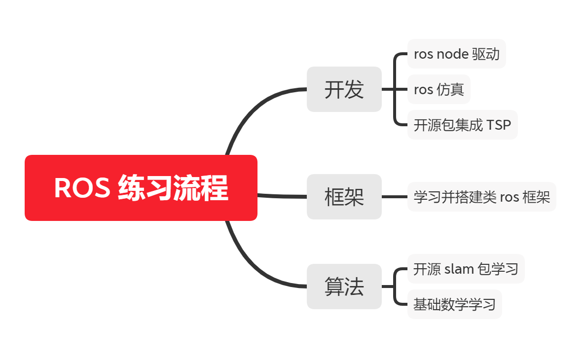

# 20211210_IMU_NODE_REFINEMENT_WITH_ROS_BASICS_PRACTICES

[TOC]

---

LOGS:

* 2021年12月10日：任务规划
  * 完成：写在最前


---

## 写在最前：

这是ROS开发+仿真的系统性学习笔记，需不需要再开一个目录专门用来存放这些笔记（暂时不用，使用敏捷开发模型，达到一定程度与数量再进行章节分离）。


这篇日志用来记录 ROS 学习的阶段性知识点，用高效的方式。可以直接将代码与运行结果记录在此笔记中。在进行练习的同时，需要思考 ROS IMU NODE 该使用什么样的方式进行封装。 


已经完成了了全课程资料的概览，现在需要进行练习，加深印象。




---


## chapter 01: some points noted

> ### ROS概念
>
> * 机器人体系是相当庞大的，其复杂度之高，以至于没有任何个人、组织甚至公司能够独立完成系统性的机器人研发工作。
>
> * 机器人体系是相当庞大的，其复杂度之高，以至于没有任何个人、组织甚至公司能够独立完成系统性的机器人研发工作。
>
> * **2007** 年，一家名为 **柳树车库（Willow Garage）**的机器人公司发布了 ***ROS***(机器人操作系统)，ROS是一套机器人通用软件框架，可以提升功能模块的复用性，并且随着该系统的不断迭代与完善，如今 ROS 已经成为机器人领域的事实标准。
>
> * **ROS全称Robot Operating System(机器人操作系统)**
>  * ROS是适用于机器人的**开源**元操作系统；
> 
>  * ROS集成了大量的工具，库，协议，提供类似OS所提供的功能，简化对机器人的控制；
> 
>  * **多台计算机**上获取，构建，编写和运行代码的工具和库，ROS在某些方面类似于“机器人框架”；
> 
>  * ROS = Plumbing + Tools + Capabilities + Ecosystem”，即ROS是通讯机制、工具软件包、机器人高层技能以及机器人生态系统的集合体。
> 
>
>   
>---

> ### ROS设计目标
>
> * **代码复用**
> * **分布式**
> * **松耦合**
> * **精简**
> * **语言独立性**
> * **易于测试**
> * **大型应用**
> * **丰富的组件化工具包**
>
> * **免费且开源**
>
> ---

> ### ROS发展历程
>
> * 2000年年中开展了一系列相关研究项目，如斯坦福人工智能机器人（STandford AI Robot, STAIR）项目、个人机器人（Personal Robots, PR）项目等，
> * 2007年，柳树车库（Willow Garage）提供了大量资源，用于将斯坦福大学机器人项目中的软件系统进行扩展与完善，同时，在无数研究人员的共同努力下，ROS的核心思想和基本软件包逐渐得到完善。


---


## chapter 02: rapid experience (cpp only)

### 1. **ROS 程序实现流程**

>1. 先创建一个工作空间；
>2. 再创建一个功能包；
>3. 编辑源文件；
>4. 编辑配置文件；
>5. 编译并执行


1. **创建工作空间并初始化**

   ```shell
   mkdir -p XXX_ws/src
   cd XXX_ws
   catkin_make
   ```


2. **进入 src 创建 ros package（包）并添加依赖**

   ```
   cd src
   catkin_create_pkg <package_name> roscpp rospy std_msgs
   ```

   > 工作空间下生成一个功能包，该功能包依赖于 roscpp、rospy 与 std_msgs，其中roscpp是使用C++实现的库，而rospy则是使用python实现的库，std_msgs是标准消息库，创建ROS功能包时，一般都会依赖这三个库实现。


### 2. HelloROS(C++版)

**步骤01**：进入 `package_name/src`，创建 `helloROS.cpp`

```
cd package/src
vim helloROS.cpp
```

**步骤02**：编写`helloROS.cpp`

```cpp
#include "ros/ros.h"

int main(int argc, char *argv[])
{
    //1. 执行 ros 节点初始化
    ros::init(argc,argv,"hello");
    
    //2. 创建 ros 节点句柄(非必须)
    ros::NodeHandle n;
    
    //3. 控制台输出 hello ros
    ROS_INFO("hello ros!");

    return 0;
}
```

**步骤03**：编辑`package_name/src/CMakeLists.txt` 

注：是`src`下的`CMakeLists.txt`，不是`package_name`下的。

```cmake
add_executable(helloROS              # 可执行程序名称
  src/helloROS.cpp
)

target_link_libraries(helloROS       # 可执行程序名称
  ${catkin_LIBRARIES}
)
```

