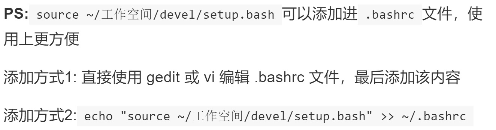
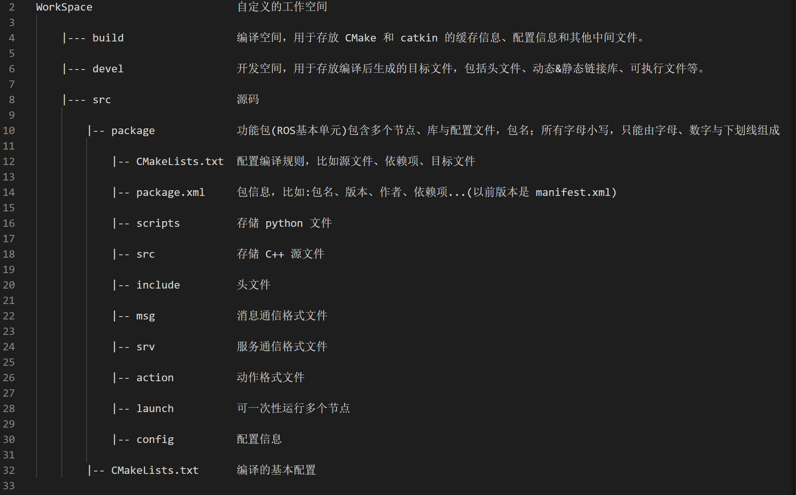

# 20211210_IMU_NODE_REFINEMENT_WITH_ROS_BASICS_PRACTICES

[TOC]

---

LOGS:

* 2021年12月10日：任务规划
  * 完成：写在最前


---

## 写在最前：

这是ROS开发+仿真的系统性学习笔记，需不需要再开一个目录专门用来存放这些笔记（暂时不用，使用敏捷开发模型，达到一定程度与数量再进行章节分离）。


这篇日志用来记录 ROS 学习的阶段性知识点，用高效的方式。可以直接将代码与运行结果记录在此笔记中。在进行练习的同时，需要思考 ROS IMU NODE 该使用什么样的方式进行封装。 


已经完成了了全课程资料的概览，现在需要进行练习，加深印象。


---


## chapter 01: some points noted

> ### ROS概念
>
> * 机器人体系是相当庞大的，其复杂度之高，以至于没有任何个人、组织甚至公司能够独立完成系统性的机器人研发工作。
>
> * 机器人体系是相当庞大的，其复杂度之高，以至于没有任何个人、组织甚至公司能够独立完成系统性的机器人研发工作。
>
> * **2007** 年，一家名为 **柳树车库（Willow Garage）**的机器人公司发布了 ***ROS***(机器人操作系统)，ROS是一套机器人通用软件框架，可以提升功能模块的复用性，并且随着该系统的不断迭代与完善，如今 ROS 已经成为机器人领域的事实标准。
>
> * **ROS全称Robot Operating System(机器人操作系统)**
>  * ROS是适用于机器人的**开源**元操作系统；
> 
>  * ROS集成了大量的工具，库，协议，提供类似OS所提供的功能，简化对机器人的控制；
> 
>  * **多台计算机**上获取，构建，编写和运行代码的工具和库，ROS在某些方面类似于“机器人框架”；
> 
>  * ROS = Plumbing + Tools + Capabilities + Ecosystem”，即ROS是通讯机制、工具软件包、机器人高层技能以及机器人生态系统的集合体。
> 
>
>   
>---

> ### ROS设计目标
>
> * **代码复用**
> * **分布式**
> * **松耦合**
> * **精简**
> * **语言独立性**
> * **易于测试**
> * **大型应用**
> * **丰富的组件化工具包**
>
> * **免费且开源**
>
> ---

> ### ROS发展历程
>
> * 2000年年中开展了一系列相关研究项目，如斯坦福人工智能机器人（STandford AI Robot, STAIR）项目、个人机器人（Personal Robots, PR）项目等，
> * 2007年，柳树车库（Willow Garage）提供了大量资源，用于将斯坦福大学机器人项目中的软件系统进行扩展与完善，同时，在无数研究人员的共同努力下，ROS的核心思想和基本软件包逐渐得到完善。


---


## chapter 02: rapid experience (cpp only)

### 1. **ROS 程序实现流程**

>1. 先创建一个工作空间；
>2. 再创建一个功能包；
>3. 编辑源文件；
>4. 编辑配置文件；
>5. 编译并执行


1. **创建工作空间并初始化**

   ```shell
   mkdir -p XXX_ws/src
   cd XXX_ws
   catkin_make
   ```


2. **进入 src 创建 ros package（包）并添加依赖**

   ```
   cd src
   catkin_create_pkg <package_name> roscpp rospy std_msgs
   ```

   > 工作空间下生成一个功能包，该功能包依赖于 roscpp、rospy 与 std_msgs，其中roscpp是使用C++实现的库，而rospy则是使用python实现的库，std_msgs是标准消息库，创建ROS功能包时，一般都会依赖这三个库实现。


### 2. HelloROS(C++版)

**步骤01**：进入 `package_name/src`，创建 `helloROS.cpp`

```
cd package/src
vim helloROS.cpp
```


**步骤02**：编写`helloROS.cpp`

```cpp
#include "ros/ros.h"

int main(int argc, char *argv[])
{
    //1. 执行 ros 节点初始化
    ros::init(argc,argv,"hello");
    
    //2. 创建 ros 节点句柄(非必须)
    ros::NodeHandle n;
    
    //3. 控制台输出 hello ros
    ROS_INFO("hello ros!");

    return 0;
}
```


**步骤03**：编辑`package_name/src/CMakeLists.txt` 

注：是`src`下的`CMakeLists.txt`，不是`package_name`下的。

```cmake
add_executable(helloROS              # 可执行程序名称
  src/helloROS.cpp
)

target_link_libraries(helloROS       # 可执行程序名称
  ${catkin_LIBRARIES}
)
```


#### **cmake 讲解**

关于cmake的注释，由浅入深。

```cmake
add_executable(<name> [WIN32] [MACOSX_BUNDLE]
               [EXCLUDE_FROM_ALL]
               [source1] [source2 ...])
```

>Add an executable to the project using the specified source files.
>
>使用指定的源文件向项目添加可执行文件。


```cmake
target_link_libraries(<target> ... <item>... ...)
```
>Specify libraries or flags to use when linking a given target and/or its dependents.
>
>指定连接给定目标和/或其依赖项时要使用的库或标志。  
>
>The named `<target>` must have been created by a command such as [`add_executable()`](https://cmake.org/cmake/help/v3.16/command/add_executable.html#command:add_executable) or [`add_library()`](https://cmake.org/cmake/help/v3.16/command/add_library.html#command:add_library) and must not be an [ALIAS target](https://cmake.org/cmake/help/v3.16/manual/cmake-buildsystem.7.html#alias-targets).
>
>命名的<目标>必须是由add_executable()或add_library()之类的命令创建的，并且不能是ALIAS目标。  


**步骤04：执行**

```
roscore

cd Xxx_ws
source ./devel/setup.bash
rosrun package_name rosnode_name
```


**步骤05：添加`setup.bash`到`CLI`**




---


## chapter 03: ROS IDE configuration

参考：[1.4.2 安装VScode]([1.4.2 安装VScode · GitBook (autolabor.com.cn)](http://www.autolabor.com.cn/book/ROSTutorials/chapter1/14-ros-ji-cheng-kai-fa-huan-jing-da-jian/142-an-zhuang-vscode.html))


### 3. launch 文件演示

>一个程序中可能需要启动多个节点，如果每次都调用 rosrun 逐一启动，显然效率低下。
>
>官方给出的优化策略是使用 launch 文件，可以一次性启动多个 ROS 节点。


### 4. 创建 launch 文件流程

1. 选定功能包右击 ---> 添加 launch 文件夹

2. 选定 launch 文件夹右击 ---> 添加 launch 文件

3. 编辑 launch 文件内容

   ```
   <launch>
       <node pkg="helloworld" type="demo_hello" name="hello" output="screen" />
       <node pkg="turtlesim" type="turtlesim_node" name="t1"/>
       <node pkg="turtlesim" type="turtle_teleop_key" name="key1" />
   </launch>
   
   node  ---> 包含的某个节点
   pkg -----> 功能包
   type ----> 被运行的节点文件
   name   --> 为节点命名
   output  -> 设置日志的输出目标
   ```

4. 运行 launch 文件：`roslaunch package_name file.launch`
5. 运行结果：一次启动多个节点。


---


## chapter 04: ROS ARCHITECTURE

### 1. 架构分类

> 立足不同的角度，对ROS架构的描述也是不同的，一般我们可以从
>
> 1. 设计者、
>
> 2. 维护者、
>
> 3. 系统结构
>
> 4. 自身结构
>
> 四个角度来描述ROS结构。


#### 1. 设计者架构

ROS**设计者**将ROS表述为：ROS = Plumbing + Tools + Capabilities + Ecosystem

- Plumbing（管道系统）：**通讯机制（实现ROS不同节点之间的交互）**
- Tools（工具）：**工具软件包（ROS中的开发和调试工具）**
- Capabilities（功能）：机器人高层技能（ROS中某些功能的集合，比如：导航）
- Ecosystem（生态）：机器人生态系统（跨地域、跨软件与硬件的ROS联盟）


#### 2. 维护者架构

**维护者**的角度，ROS 架构可划分为两大部分：

* main：核心部分，主要由Willow Garage 和一些开发者设计、提供以及维护。

* universe：全球范围的代码，有不同国家的ROS社区组织开发和维护。


#### 3. 系统架构

系统架构: ROS 可以划分为三层：

* OS 层：也即经典意义的操作系统，ROS 只是元操作系统，需要依托真正意义的操作系统。

* 中间层：ROS 封装的关于机器人开发的中间件：
  * 基于 TCP/UDP 继续封装的 TCPROS/UDPROS 通信系统
  * 用于进程间通信 Nodelet，为数据的实时性传输提供支持
  * 大量的机器人开发实现库
* 应用层：功能包，以及功能包内的节点，比如: master、turtlesim的控制与运动节点...。


#### 4. 自身结构

ROS 三层自身结构：

1. 文件系统：硬盘上面查看的ROS源代码的组织形式

2. 计算图：

   ROS 分布式系统中不同进程需要进行数据交互，计算图可以以点对点的网络形式表现数据交互过。

   计算图成员：

   1. 节点（node）
   2. 消息（message）
   3. 通信机制：话题（topic）
   4. 通信机制：服务（service）

3. 开源社区：

   1. 发行版（distribution）
   2. 软件库（repository）
   3. ROS维基（ROS Wiki）


### 2. 自身架构 -- 文件系统

> ROS文件系统：是在硬盘上ROS源代码的组织形式。
>
> 




#### 重要文件：`package.xml`

> 定义有关软件包的属性，例如软件包名称，版本号，作者，维护者以及对其他 catkin 软件包的依赖性。

```xml
<?xml version="1.0"?>
<!-- 格式: 以前是 1，推荐使用格式 2 -->
<package format="2">
  <!-- 包名 -->
  <name>demo01_hello_vscode</name>
  <!-- 版本 -->
  <version>0.0.0</version>
  <!-- 描述信息 -->
  <description>The demo01_hello_vscode package</description>

  <!-- One maintainer tag required, multiple allowed, one person per tag -->
  <!-- Example:  -->
  <!-- <maintainer email="jane.doe@example.com">Jane Doe</maintainer> -->
  <!-- 维护人员 -->
  <maintainer email="xuzuo@todo.todo">xuzuo</maintainer>


  <!-- One license tag required, multiple allowed, one license per tag -->
  <!-- Commonly used license strings: -->
  <!--   BSD, MIT, Boost Software License, GPLv2, GPLv3, LGPLv2.1, LGPLv3 -->
  <!-- 许可证信息，ROS核心组件默认 BSD -->
  <license>TODO</license>


  <!-- Url tags are optional, but multiple are allowed, one per tag -->
  <!-- Optional attribute type can be: website, bugtracker, or repository -->
  <!-- Example: -->
  <!-- <url type="website">http://wiki.ros.org/demo01_hello_vscode</url> -->


  <!-- Author tags are optional, multiple are allowed, one per tag -->
  <!-- Authors do not have to be maintainers, but could be -->
  <!-- Example: -->
  <!-- <author email="jane.doe@example.com">Jane Doe</author> -->


  <!-- The *depend tags are used to specify dependencies -->
  <!-- Dependencies can be catkin packages or system dependencies -->
  <!-- Examples: -->
  <!-- Use depend as a shortcut for packages that are both build and exec dependencies -->
  <!--   <depend>roscpp</depend> -->
  <!--   Note that this is equivalent to the following: -->
  <!--   <build_depend>roscpp</build_depend> -->
  <!--   <exec_depend>roscpp</exec_depend> -->
  <!-- Use build_depend for packages you need at compile time: -->
  <!--   <build_depend>message_generation</build_depend> -->
  <!-- Use build_export_depend for packages you need in order to build against this package: -->
  <!--   <build_export_depend>message_generation</build_export_depend> -->
  <!-- Use buildtool_depend for build tool packages: -->
  <!--   <buildtool_depend>catkin</buildtool_depend> -->
  <!-- Use exec_depend for packages you need at runtime: -->
  <!--   <exec_depend>message_runtime</exec_depend> -->
  <!-- Use test_depend for packages you need only for testing: -->
  <!--   <test_depend>gtest</test_depend> -->
  <!-- Use doc_depend for packages you need only for building documentation: -->
  <!--   <doc_depend>doxygen</doc_depend> -->
  
  <!-- 依赖的构建工具，这是必须的 -->
  <buildtool_depend>catkin</buildtool_depend>

  <!-- 指定构建此软件包所需的软件包 -->
  <build_depend>roscpp</build_depend>
  <build_depend>rospy</build_depend>
  <build_depend>std_msgs</build_depend>

  <!-- 指定根据这个包构建库所需要的包 -->
  <build_export_depend>roscpp</build_export_depend>
  <build_export_depend>rospy</build_export_depend>
  <build_export_depend>std_msgs</build_export_depend>

  <!-- 运行该程序包中的代码所需的程序包 -->  
  <exec_depend>roscpp</exec_depend>
  <exec_depend>rospy</exec_depend>
  <exec_depend>std_msgs</exec_depend>


  <!-- The export tag contains other, unspecified, tags -->
  <export>
    <!-- Other tools can request additional information be placed here -->

  </export>
</package>
```


#### 重要文件：`CMakelists.txt`

>**CMakeLists.txt **是 CMake 构建系统的输入，用于构建软件包。这些文件描述了如何构建代码以及将代码安装到何处。

```cmake
cmake_minimum_required(VERSION 3.0.2) #所需 cmake 版本
project(demo01_hello_vscode) #包名称，会被 ${PROJECT_NAME} 的方式调用

## Compile as C++11, supported in ROS Kinetic and newer
# add_compile_options(-std=c++11)

## Find catkin macros and libraries
## if COMPONENTS list like find_package(catkin REQUIRED COMPONENTS xyz)
## is used, also find other catkin packages
#设置构建所需要的软件包
find_package(catkin REQUIRED COMPONENTS
  roscpp
  rospy
  std_msgs
)

## System dependencies are found with CMake's conventions
#默认添加系统依赖
# find_package(Boost REQUIRED COMPONENTS system)


## Uncomment this if the package has a setup.py. This macro ensures
## modules and global scripts declared therein get installed
## See http://ros.org/doc/api/catkin/html/user_guide/setup_dot_py.html
# 启动 python 模块支持
# catkin_python_setup()

################################################
## Declare ROS messages, services and actions ##
## 声明 ROS 消息、服务、动作... ##
################################################

## To declare and build messages, services or actions from within this
## package, follow these steps:
## * Let MSG_DEP_SET be the set of packages whose message types you use in
##   your messages/services/actions (e.g. std_msgs, actionlib_msgs, ...).
## * In the file package.xml:
##   * add a build_depend tag for "message_generation"
##   * add a build_depend and a exec_depend tag for each package in MSG_DEP_SET
##   * If MSG_DEP_SET isn't empty the following dependency has been pulled in
##     but can be declared for certainty nonetheless:
##     * add a exec_depend tag for "message_runtime"
## * In this file (CMakeLists.txt):
##   * add "message_generation" and every package in MSG_DEP_SET to
##     find_package(catkin REQUIRED COMPONENTS ...)
##   * add "message_runtime" and every package in MSG_DEP_SET to
##     catkin_package(CATKIN_DEPENDS ...)
##   * uncomment the add_*_files sections below as needed
##     and list every .msg/.srv/.action file to be processed
##   * uncomment the generate_messages entry below
##   * add every package in MSG_DEP_SET to generate_messages(DEPENDENCIES ...)

## Generate messages in the 'msg' folder
# add_message_files(
#   FILES
#   Message1.msg
#   Message2.msg
# )

## Generate services in the 'srv' folder
# add_service_files(
#   FILES
#   Service1.srv
#   Service2.srv
# )

## Generate actions in the 'action' folder
# add_action_files(
#   FILES
#   Action1.action
#   Action2.action
# )

## Generate added messages and services with any dependencies listed here
# 生成消息、服务时的依赖包
# generate_messages(
#   DEPENDENCIES
#   std_msgs
# )

################################################
## Declare ROS dynamic reconfigure parameters ##
## 声明 ROS 动态参数配置 ##
################################################

## To declare and build dynamic reconfigure parameters within this
## package, follow these steps:
## * In the file package.xml:
##   * add a build_depend and a exec_depend tag for "dynamic_reconfigure"
## * In this file (CMakeLists.txt):
##   * add "dynamic_reconfigure" to
##     find_package(catkin REQUIRED COMPONENTS ...)
##   * uncomment the "generate_dynamic_reconfigure_options" section below
##     and list every .cfg file to be processed

## Generate dynamic reconfigure parameters in the 'cfg' folder
# generate_dynamic_reconfigure_options(
#   cfg/DynReconf1.cfg
#   cfg/DynReconf2.cfg
# )

###################################
## catkin specific configuration ##
## catkin 特定配置##
###################################
## The catkin_package macro generates cmake config files for your package
## Declare things to be passed to dependent projects
## INCLUDE_DIRS: uncomment this if your package contains header files
## LIBRARIES: libraries you create in this project that dependent projects also need
## CATKIN_DEPENDS: catkin_packages dependent projects also need
## DEPENDS: system dependencies of this project that dependent projects also need
# 运行时依赖
catkin_package(
#  INCLUDE_DIRS include
#  LIBRARIES demo01_hello_vscode
#  CATKIN_DEPENDS roscpp rospy std_msgs
#  DEPENDS system_lib
)

###########
## Build ##
###########

## Specify additional locations of header files
## Your package locations should be listed before other locations
# 添加头文件路径，当前程序包的头文件路径位于其他文件路径之前
include_directories(
# include
  ${catkin_INCLUDE_DIRS}
)

## Declare a C++ library
# 声明 C++ 库
# add_library(${PROJECT_NAME}
#   src/${PROJECT_NAME}/demo01_hello_vscode.cpp
# )

## Add cmake target dependencies of the library
## as an example, code may need to be generated before libraries
## either from message generation or dynamic reconfigure
# 添加库的 cmake 目标依赖
# add_dependencies(${PROJECT_NAME} ${${PROJECT_NAME}_EXPORTED_TARGETS} ${catkin_EXPORTED_TARGETS})

## Declare a C++ executable
## With catkin_make all packages are built within a single CMake context
## The recommended prefix ensures that target names across packages don't collide
# 声明 C++ 可执行文件
add_executable(Hello_VSCode src/Hello_VSCode.cpp)

## Rename C++ executable without prefix
## The above recommended prefix causes long target names, the following renames the
## target back to the shorter version for ease of user use
## e.g. "rosrun someones_pkg node" instead of "rosrun someones_pkg someones_pkg_node"
#重命名c++可执行文件
# set_target_properties(${PROJECT_NAME}_node PROPERTIES OUTPUT_NAME node PREFIX "")

## Add cmake target dependencies of the executable
## same as for the library above
#添加可执行文件的 cmake 目标依赖
add_dependencies(Hello_VSCode ${${PROJECT_NAME}_EXPORTED_TARGETS} ${catkin_EXPORTED_TARGETS})

## Specify libraries to link a library or executable target against
#指定库、可执行文件的链接库
target_link_libraries(Hello_VSCode
  ${catkin_LIBRARIES}
)

#############
## Install ##
## 安装 ##
#############

# all install targets should use catkin DESTINATION variables
# See http://ros.org/doc/api/catkin/html/adv_user_guide/variables.html

## Mark executable scripts (Python etc.) for installation
## in contrast to setup.py, you can choose the destination
#设置用于安装的可执行脚本
catkin_install_python(PROGRAMS
  scripts/Hi.py
  DESTINATION ${CATKIN_PACKAGE_BIN_DESTINATION}
)

## Mark executables for installation
## See http://docs.ros.org/melodic/api/catkin/html/howto/format1/building_executables.html
# install(TARGETS ${PROJECT_NAME}_node
#   RUNTIME DESTINATION ${CATKIN_PACKAGE_BIN_DESTINATION}
# )

## Mark libraries for installation
## See http://docs.ros.org/melodic/api/catkin/html/howto/format1/building_libraries.html
# install(TARGETS ${PROJECT_NAME}
#   ARCHIVE DESTINATION ${CATKIN_PACKAGE_LIB_DESTINATION}
#   LIBRARY DESTINATION ${CATKIN_PACKAGE_LIB_DESTINATION}
#   RUNTIME DESTINATION ${CATKIN_GLOBAL_BIN_DESTINATION}
# )

## Mark cpp header files for installation
# install(DIRECTORY include/${PROJECT_NAME}/
#   DESTINATION ${CATKIN_PACKAGE_INCLUDE_DESTINATION}
#   FILES_MATCHING PATTERN "*.h"
#   PATTERN ".svn" EXCLUDE
# )

## Mark other files for installation (e.g. launch and bag files, etc.)
# install(FILES
#   # myfile1
#   # myfile2
#   DESTINATION ${CATKIN_PACKAGE_SHARE_DESTINATION}
# )

#############
## Testing ##
#############

## Add gtest based cpp test target and link libraries
# catkin_add_gtest(${PROJECT_NAME}-test test/test_demo01_hello_vscode.cpp)
# if(TARGET ${PROJECT_NAME}-test)
#   target_link_libraries(${PROJECT_NAME}-test ${PROJECT_NAME})
# endif()

## Add folders to be run by python nosetests
# catkin_add_nosetests(test)
```

这个要仔细看。

##### cmake 讲解

```cmake
cmake_minimum_required(VERSION <min>[...<max>] [FATAL_ERROR])
```

>Sets the minimum required version of cmake for a project. Also updates the policy settings 。
>
>为一个项目设置最小需要的 cmake 版本。 同时更新协议设置。


```cmake
project(<PROJECT-NAME> [<language-name>...])
project(<PROJECT-NAME>
        [VERSION <major>[.<minor>[.<patch>[.<tweak>]]]]
        [DESCRIPTION <project-description-string>]
        [HOMEPAGE_URL <url-string>]
        [LANGUAGES <language-name>...])
```

>Sets the name of the project, and stores it in the variable [`PROJECT_NAME`](https://cmake.org/cmake/help/v3.16/variable/PROJECT_NAME.html#variable:PROJECT_NAME). When called from the top-level `CMakeLists.txt` also stores the project name in the variable [`CMAKE_PROJECT_NAME`](https://cmake.org/cmake/help/v3.16/variable/CMAKE_PROJECT_NAME.html#variable:CMAKE_PROJECT_NAME).
>
>设置项目的名称，并将其存储在变量 PROJECT_NAME 中。 当从顶级 CMakeLists.txt 中调用时，它还将项目名称存储在变量 CMAKE_PROJECT_NAME中。  


```cmake
find_package(<PackageName> [version] [EXACT] [QUIET] [MODULE]
             [REQUIRED] [[COMPONENTS] [components...]]
             [OPTIONAL_COMPONENTS components...]
             [NO_POLICY_SCOPE])
```

>Finds and loads settings from an external project. `<PackageName>_FOUND` will be set to indicate whether the package was found. 
>
>从外部项目中查找并加载设置。 `<PackageName>_FOUND` 将被设置为指示是否找到包。 
>
>When the package is found package-specific information is provided through variables and [Imported Targets](https://cmake.org/cmake/help/v3.16/manual/cmake-buildsystem.7.html#imported-targets) documented by the package itself. The `QUIET` option disables informational messages, including those indicating that the package cannot be found if it is not `REQUIRED`. The `REQUIRED` option stops processing with an error message if the package cannot be found.
>
>当找到包时，包有关的信息将通过包本身记录的变量和 Imported Targets 提供。 QUIET 选项禁用信息性消息，包括那些表示如果不是 REQUIRED 则无法找到包的消息。 如果找不到包，REQUIRED 选项将停止处理并显示错误消息。  
>
>A package-specific list of required components may be listed after the `COMPONENTS` option (or after the `REQUIRED` option if present). Additional optional components may be listed after `OPTIONAL_COMPONENTS`. Available components and their influence on whether a package is considered to be found are defined by the target package.
>
>一个包有关的必需组件列表可以列在 “components” 选项之后(如果存在，也可以列在“required”选项之后)。 其他可选组件可能会列在“OPTIONAL_COMPONENTS”后面。 可用组件及其对是否认为找到包的影响由目标包定义。  


```cmake
include_directories([AFTER|BEFORE] [SYSTEM] dir1 [dir2 ...])
```

>Add the given directories to those the compiler uses to search for include files. Relative paths are interpreted as relative to the current source directory.
>
>将给定的目录添加到编译器用于搜索**包含文件（.h）**的目录中。 相对路径被解释为相对于当前源目录。  
>
>The include directories are added to the [`INCLUDE_DIRECTORIES`](https://cmake.org/cmake/help/v3.16/prop_dir/INCLUDE_DIRECTORIES.html#prop_dir:INCLUDE_DIRECTORIES) directory property for the current `CMakeLists` file. They are also added to the [`INCLUDE_DIRECTORIES`](https://cmake.org/cmake/help/v3.16/prop_tgt/INCLUDE_DIRECTORIES.html#prop_tgt:INCLUDE_DIRECTORIES) target property for each target in the current `CMakeLists` file. The target property values are the ones used by the generators.
>
>包含目录被添加到当前 CMakeLists 文件的 INCLUDE_DIRECTORIES 目录属性中。 对于当前 CMakeLists 文件中的每个目标，它们也被添加到 INCLUDE_DIRECTORIES 目标属性中。目标属性值是生成器使用的属性值。  
>
>Prefer the [`target_include_directories()`](https://cmake.org/cmake/help/v3.16/command/target_include_directories.html#command:target_include_directories) command to add include directories to individual targets and optionally propagate/export them to dependents.
>
>最好使用 target_include_directories() 命令将包含目录添加到单个目标，并可选择将它们传播/导出到从属目录。  


```cmake
add_executable(<name> [WIN32] [MACOSX_BUNDLE]
               [EXCLUDE_FROM_ALL]
               [source1] [source2 ...])
```

>Adds an executable target called `<name>` to be built from the source files listed in the command invocation.
>
>添加一个名为<name>的可执行目标，从命令调用中列出的源文件构建。  
>
>The source files can be omitted here if they are added later using [`target_sources()`](https://cmake.org/cmake/help/v3.16/command/target_sources.html#command:target_sources). The `<name>` corresponds to the logical target name and must be globally unique within a project. 
>
>如果稍后使用target_sources()添加源文件，这里可以省略它们。 <name>对应于逻辑目标名称，并且在项目中必须是全局唯一的。  
>
>The actual file name of the executable built is constructed based on conventions of the native platform (such as `<name>.exe` or just `<name>`).
>
>构建的可执行文件的实际文件名是基于本机平台的约定构造的(例如<name>.exe或仅仅<name>)。 


```cmake
add_dependencies(<target> [<target-dependency>]...)
```

>Makes a top-level `<target>` depend on other top-level targets to ensure that they build before `<target>` does. 
>
>使顶级<目标>依赖于其他顶级目标，以确保它们在<目标>之前构建。  
>
>A top-level target is one created by one of the [`add_executable()`](https://cmake.org/cmake/help/v3.16/command/add_executable.html#command:add_executable), [`add_library()`](https://cmake.org/cmake/help/v3.16/command/add_library.html#command:add_library), or [`add_custom_target()`](https://cmake.org/cmake/help/v3.16/command/add_custom_target.html#command:add_custom_target) commands (but not targets generated by CMake like `install`).
>
>顶级目标是由 `add_executable()`、`add_library()` 或 `add_custom_target()` 命令创建的(但不是由CMake生成的目标，比如`install`)。  


```cmake
target_link_libraries(<target> ... <item>... ...)
```

>


---


## 参考

link: [1.5.1 ROS文件系统]([1.5.1 ROS文件系统 · GitBook (autolabor.com.cn)](http://www.autolabor.com.cn/book/ROSTutorials/chapter1/15-ben-zhang-xiao-jie/151-roswen-jian-xi-tong.html))

