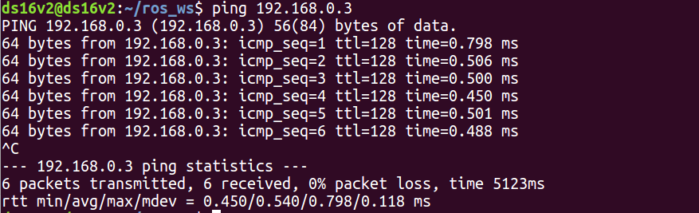
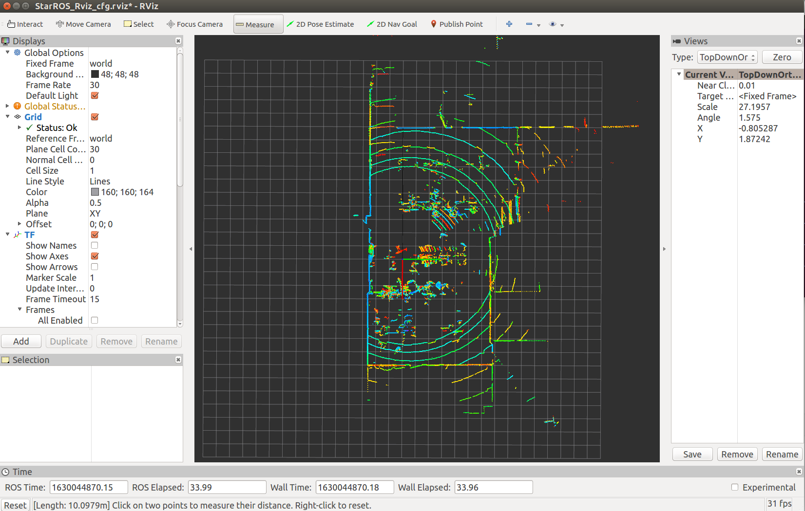
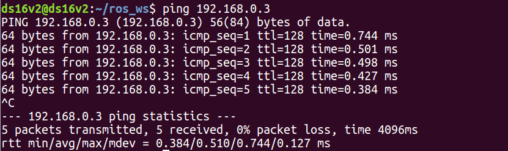
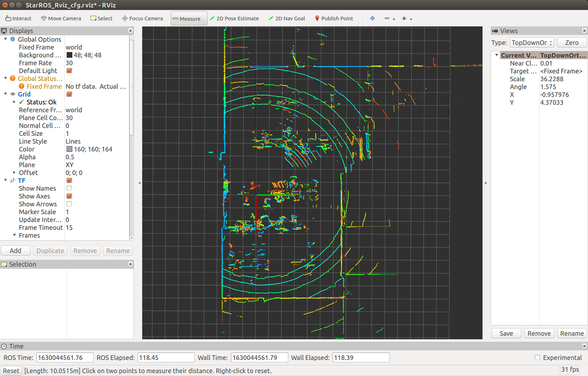
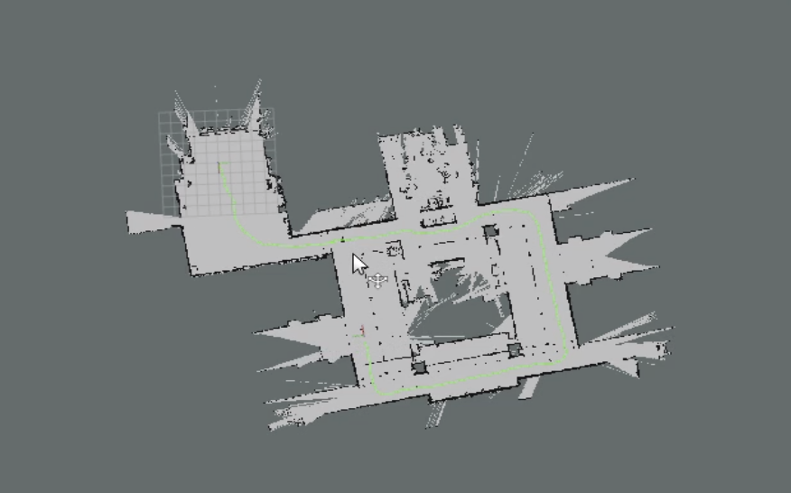

# 2021年08月27日：rfans_lidar：驗收

[toc]

---

## 0. 驗收流程

1. pc 端應用
   1. 直連
   2. 延長線
2. linux 端應用
   1. ros
      1. 直連
      2. 延長線
   2. mapping
3. 结论

---

## 1. pc 端应用

### 1.0. U 盘内容：


>1. 3D					        # rfans-32 .STEP 模型
>2. CtrilView			     # pc 端应用软件
>3. StarROS                  # 驱动文件


### 1.1. 使用 freeCAD 查看 RFans-V6K 模型：


### 1.3. CtrlView 启动 rfans + 实时点云可视化：

```
主机 IP：192.168.0.9
rfan IP：192.168.0.3
网关：192.168.0.1
```

#### 1.3.1. 直连：

```
>ping 192.168.0.3

正在 Ping 192.168.0.3 具有 32 字节的数据:
来自 192.168.0.3 的回复: 字节=32 时间=2ms TTL=128
来自 192.168.0.3 的回复: 字节=32 时间=1ms TTL=128
来自 192.168.0.3 的回复: 字节=32 时间=1ms TTL=128
来自 192.168.0.3 的回复: 字节=32 时间=1ms TTL=128

192.168.0.3 的 Ping 统计信息:
    数据包: 已发送 = 4，已接收 = 4，丢失 = 0 (0% 丢失)，
往返行程的估计时间(以毫秒为单位):
    最短 = 1ms，最长 = 2ms，平均 = 1ms
```


扫描频率：5-20：OK


可以使用 ctrlview 工具选项 --> 距离显示进行距离验证。


可以使用 ctrlview 自带算法选项进行点云后处理。

#### 1.3.2. 延长线：

```
C:\Users\jacob>ping 192.168.0.3

正在 Ping 192.168.0.3 具有 32 字节的数据:
来自 192.168.0.3 的回复: 字节=32 时间=1ms TTL=128
来自 192.168.0.3 的回复: 字节=32 时间=1ms TTL=128
来自 192.168.0.3 的回复: 字节=32 时间=1ms TTL=128
来自 192.168.0.3 的回复: 字节=32 时间=1ms TTL=128

192.168.0.3 的 Ping 统计信息:
    数据包: 已发送 = 4，已接收 = 4，丢失 = 0 (0% 丢失)，
往返行程的估计时间(以毫秒为单位):
    最短 = 1ms，最长 = 1ms，平均 = 1ms
```


重复 1.3.1. 直连配置，可以正常运行。


---


## 2. Linux 端应用

StarROS 工程結構圖：

root：`ros_ws`

```
.
├── build
├── devel
└── src
	|-- StarROS
	└── CMakeLists.txt 
```

查看 rospack：`rfans_driver`

```
$ rospack find rfans_driver 
/home/ds16v2/ros_ws/src/StarROS
```


### 2.1. 直連：



```
roslaunch rfans_driver node_manager.launch
```



使用 rviz measure tools，相同兩點距離（m）：10.0979。


### 2.2. 延長線：



```
roslaunch rfans_driver node_manager.launch
```



使用 rviz measure tools，相同兩點距離（m）：10.0515。


## 2.3. 應用：hector_mapping

使用開源 hector_mapping + rfanC32 完成辦公場景建圖：



目標雷達運行良好，無異常。


---


## 3. 總結：

1. 在 PC、linux 端均能正常運行目標雷達（有無延長線的情況下）；同時在實際應用中，目標雷達沒有發生過異常。
2. 對相同兩點AB測量距離，PC 端 CtrlView 軟件給出數值（m）：9.77881，9.82096。
3. 對相同兩點AB測量距離，Linux 端 rviz 軟件給出數值（m）：10.0979，10.0515。
4. 對比 PC 端與 Linux 端距離差值（考慮人工誤差）：
   1. 最大差值 diff_max（m）：0.31909
   2. 最小差值 diff_min（m）：0.23054

